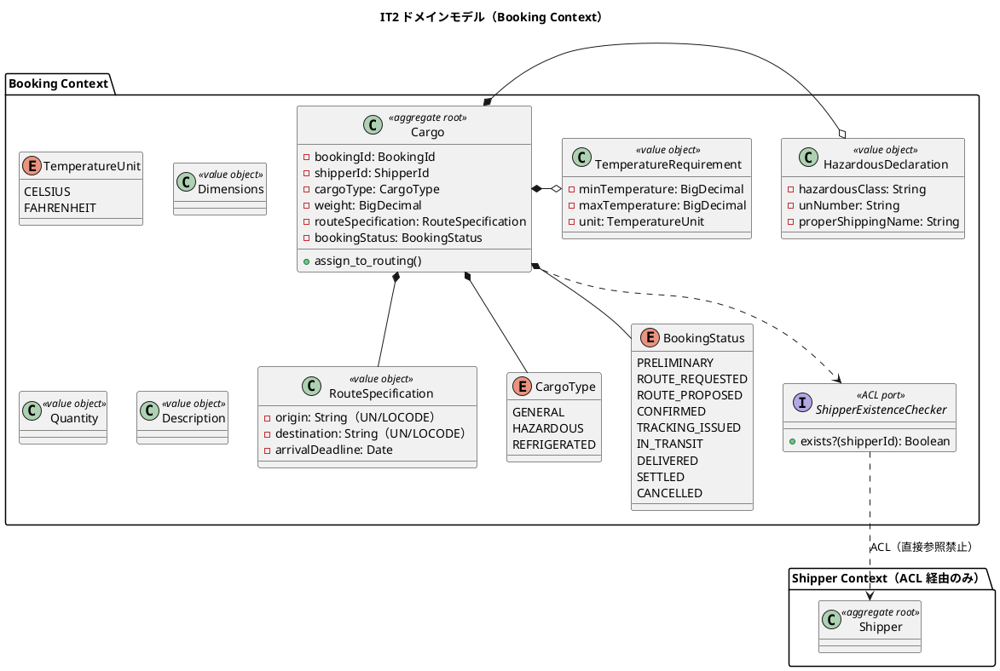
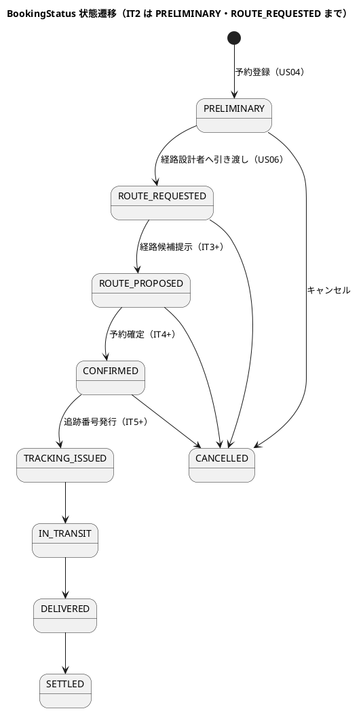
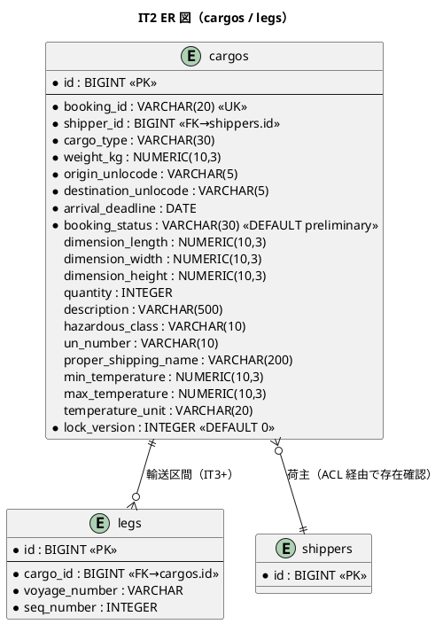
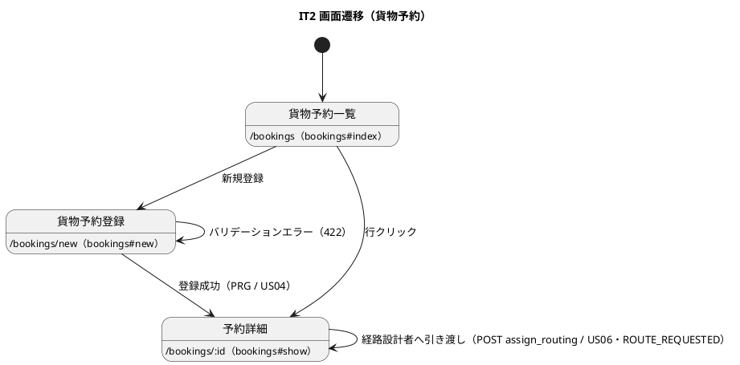

# イテレーション 2 計画 - 貨物予約登録 + 危険物/冷凍 + 引き渡し

## ゴール

Booking Context の Cargo 集約と BookingStatus 状態機械を確立し、貨物予約登録（US04）・危険物/冷凍貨物予約（US05）・経路設計者への引き渡し（US06）を序盤アウトサイドインで TDD 完成させる。あわせて Booking→Shipper の ACL 境界（`ShipperExistenceChecker`）を確立し、IT1 ふりかえりの技術的負債（DIP・Packwerk privacy・越境識別子）を返済する。

- **局面**: 序盤（アウトサイドイン）— [development_strategy.md](development_strategy.md) 参照
- **期間**: Week 3-4（2026-07-27 〜 2026-08-09）
- **目標 SP**: 13

## 対象ストーリー

| US | 概要 | SP | BC | 対応 UC |
|:---|:-----|:--|:---|:--------|
| US04 | 貨物予約を登録する | 5 | Booking Context | UC03 |
| US05 | 危険物・冷凍貨物の予約を登録する | 5 | Booking Context | UC03 |
| US06 | 予約情報を経路設計者に引き渡す | 3 | Booking Context | UC04 |

（release_plan.md Phase 1 / IT2 と一致）

## 受入条件

[user_story.md](../requirements/user_story.md) の受け入れ基準に準拠（全文）。

**US04 貨物予約を登録する**（として: 営業担当者）

- [ ] 荷主 ID を入力して既存荷主を選択できる
- [ ] 貨物種別・重量・寸法・個数・品名を入力できる
- [ ] 出発地・目的地・希望引渡日・希望着日を入力できる
- [ ] 登録完了後、予約番号が発行され状態が「仮受付」（PRELIMINARY）になる
- [ ] 経路設計者に予約登録の通知が送信される
- [ ] 見積情報との整合性が確認される

**US05 危険物・冷凍貨物の予約を登録する**（として: 営業担当者）

- [ ] 貨物種別「危険物」を選択すると、危険物申告情報の入力フィールドが表示され入力が必須となる
- [ ] 貨物種別「冷凍・冷蔵貨物」を選択すると、温度管理条件の入力フィールドが表示され入力が必須となる
- [ ] 特別情報が登録された予約は、経路設計時に対応可能な航海・ルートのみが候補として表示される（※候補フィルタは Routing を扱う IT3 で実装。IT2 は特別情報の登録・保持まで）

**US06 予約情報を経路設計者に引き渡す**（として: 営業担当者）

- [ ] 予約番号を指定して予約情報（出発地・目的地・期限・貨物仕様）を確認できる
- [ ] 経路設計依頼を実行すると、予約状態が「経路設計中」（ROUTE_REQUESTED）に更新される
- [ ] 経路設計者に経路設計依頼の通知が送信される
- [ ] 予約情報に不備がある場合、修正してから引き渡せる

## タスク分解（アウトサイドイン）

### 技術的負債の返済枠（IT1 ふりかえり Try・BC 越境前に先着手）

Booking→Shipper の ACL を導入する前に、境界と依存方向を固める。序盤の独立コミット枠で先に着手する（「余力次第」にしない）。

- [ ] 【T1】Shipper のリポジトリポート `Shipper::Domain::ShipperRepository`（duck type 契約）を定義し、`RegisterShipper` のデフォルト具象依存を撤去。合成ルート（コントローラ）で注入（DIP 回復）
- [ ] 【T3】Packwerk `enforce_privacy: true` を有効化し、`packs/shipper` / `packs/booking` の公開面（`public/`）を定義（BC 越境前に境界固定）
- [ ] 【T4】越境識別子の正本を確定（`shippers.id`（サロゲート）を BC 間参照キーとし、`cargos.shipper_id` FK と整合）。ADR-0003 として記録し、domain-model の **2 箇所の `ShipperId` 定義**（Booking 文脈の `ShipperId <<value object>> id:String, shipperType:ShipperType` と Shared Kernel の `ShipperId id:UUID`）を一本化して実態に合わせて改訂
- [ ] 【T2】RuboCop カスタム cop（`packs/*/app/domain/**` での `ApplicationRecord`/`ActiveRecord` 参照禁止）を実装し CI に組み込む、または ADR-0001 を「目視 + Packwerk」に改訂
- [ ] 【T5】README を IT1/IT2 到達点に整備（起動・`db:seed`・シードアカウント・テスト・packs 構成）
- [ ] 【T9】アカウントロック仕様（恒久ロック・管理者解除）を確定し文言を整合、`register_failure!` を `with_lock` でアトミック化
- [ ] 【T8】SonarQube を ruby/take-1 に導入（`sonar-project.properties`・SimpleCov 連携・Quality Gate）※運用タスク

> 【T6】ui_design のロール/フィールド名統一・【T7】荷主フォーム動的表示は Shipper UI の磨き込みであり、US05 の貨物種別動的表示（Stimulus）と同時に実装して重複を避ける。

### US04 貨物予約登録

- [ ] system spec: 荷主選択→貨物仕様・輸送条件入力→登録→予約番号発行・PRELIMINARY 表示（アウトサイドインの入口）
- [ ] 貨物予約コントローラ・フォーム（`/bookings` PRG、`bookings#index/new/create/show`）。IT1 のプレースホルダ `BookingsController` を実画面へ置き換え
- [ ] ナビゲーション整合: `_navbar.html.erb`・ダッシュボードの「貨物予約」導線を実画面へ更新し、営業担当者ロールで /bookings 系がダッシュボード/navbar から到達可能なことの system spec（ロール別到達性・403）。あわせて ui_design.md のナビ表ロールを 5 ロール RBAC（sales）へ是正（T6 と同時）
- [ ] `Cargo` 集約（PORO）・値オブジェクト（`BookingId`・`RouteSpecification`・`Dimensions`・`Quantity`・`Description`）・`CargoType` enum（GENERAL）のユニット spec
- [ ] `ShipperExistenceChecker` ACL ポート（Booking ドメイン）＋インプロセス・アダプタ（Shipper の公開 API を呼ぶ）で荷主 ID 存在確認（直接参照禁止）
- [ ] `ActiveRecordCargoRepository`（PORO↔AR 変換・`lock_version` 楽観ロック）の repository spec、`cargos` / `legs` テーブル migration
- [ ] 予約登録時のドメインイベント発行（`CargoBooked`）→ 経路設計者への通知（ADR-0002・`notifications` 記録）

### US05 危険物・冷凍貨物予約

- [ ] system spec: 危険物選択→危険物申告必須、冷凍選択→温度条件必須のバリデーション（種別選択で入力欄を動的表示・Stimulus）
- [ ] `HazardousDeclaration`（危険物クラス・UN 番号・正式輸送品名）・`TemperatureRequirement`（最低/最高温度・単位）値オブジェクトのユニット spec
- [ ] `CargoType`（HAZARDOUS/REFRIGERATED）の条件付き必須制約を Cargo 集約の不変条件として実装（nil なら ArgumentError）

### US06 経路設計者への引き渡し

- [ ] system spec: 予約詳細→引き渡し→ROUTE_REQUESTED 表示、不備時は修正して再実行
- [ ] `BookingStatus` 状態機械（9 値・`transition_to` 不正遷移で例外）と `assign_to_routing`（PRELIMINARY→ROUTE_REQUESTED）
- [ ] `AssignToRoutingCommand` のアプリケーションサービス（`POST /bookings/:id/assign_routing`）
- [ ] 引き渡し時のドメインイベント発行（`AssignedToRouting`）→ 経路設計者への通知

### Release 0.1 リリース作業

- [ ] Phase 1（US26/US27/US02/US03/US04/US05/US06）完了を確認し、`developing-release` で v0.1.0 をリリース

## スケジュール

| Week | 主な作業 |
|:-----|:---------|
| Week 3 | 負債返済枠（T1/T3/T4）→ US04 貨物予約登録（Cargo 集約・ACL・リポジトリ） |
| Week 4 | US05 危険物/冷凍・US06 引き渡し、デモ項目 system spec の green 化、品質ゲート、Release 0.1 |

## 設計（IT2 スコープに絞った 4 図）

### ドメインモデル図（Booking Context + Shipper ACL）

> **制約**: CargoType が HAZARDOUS なら HazardousDeclaration が、REFRIGERATED なら TemperatureRequirement が必須（nil で ArgumentError）。Booking は Shipper を直接参照せず `ShipperExistenceChecker` ACL 経由でのみ荷主存在を確認する（ADR-0001）。
>
> **注（Location 共有カーネル）**: domain-model.md では `RouteSpecification` の origin/destination は Shared Domain の `Location` 共有カーネル型だが、IT2 は UN/LOCODE を String で保持する。`Location` 値オブジェクト・`locations` テーブルの共有カーネル化は経路（Routing）を扱う IT3 で導入する（この差分は IT2 の割り切りとして明示。IT3 で Booking↔Location の変換層を一元化する）。

### 状態遷移図（BookingStatus・IT2 スコープを強調）

> **注**: IT2 で実装する遷移は「登録（→PRELIMINARY）」「引き渡し（→ROUTE_REQUESTED）」「キャンセル（→CANCELLED）」。以降の遷移は該当 IT で実装する。不正遷移は `BookingStatus#transition_to` が例外送出。

### ER 図（IT2 スコープ）

> **注**: `legs` は経路（Routing）を扱う IT3+ で本格利用する。IT2 では `cargos` を中心に実装し、`transport_status` 等の追跡系カラムは対象外（IT4+）。

### 画面遷移図（IT2 スコープ）

## リスク

| リスク | 対策 |
|--------|------|
| Booking→Shipper の ACL 実装方針（HTTP vs インプロセス）の判断 | モジュラモノリス内のため IT2 はインプロセス・アダプタ（Shipper 公開 API 呼び出し）で実装。将来の分離時に Faraday HTTP へ差し替え可能な設計とし ADR-0003 に記録 |
| 越境識別子の二重化（ShipperId VO vs shippers.id） | T4 で `shippers.id`（サロゲート）を BC 間参照キーに確定し ADR 化。domain-model の UUID 記述を改訂 |
| Cargo 集約のカラム数が多く PORO↔AR 変換が肥大化 | IT1 の Shipper 変換パターンを踏襲。危険物/冷凍のオプション群は値オブジェクトにまとめて変換の凝集度を上げる |
| 状態機械の遷移網羅漏れ | `transition_to` を単一の遷移表で実装し、許可/不許可をユニット spec で網羅（境界の不正遷移も含む） |

## 設計への反映が必要（validating 検証で補足予定）

以下は検証ステップ（validating-iteration-plan / validating-design）で確定し、実装と同時に `docs/design/` へ反映する。

1. **越境識別子の正本**: domain-model.md の Booking `ShipperId`（UUID 記述）と data-model.md の `cargos.shipper_id`（bigint FK）の不整合を、`shippers.id` サロゲートに統一して ADR-0003 に記録（T4）。
2. **ACL 実装方針**: architecture_backend.md の ACL（Faraday HTTP 前提）に対し、IT2 のインプロセス・アダプタ方針を ADR-0003 で補足。
3. **ui_design のロール/フィールド語彙**: 5 ロール RBAC への統一（navbar の `shipper` を sales + 外部未認証方針へ）・認証フィールド名の統一（IT1 レビュー指摘 T6）。
4. **RouteSpecification の Location 共有カーネル化**: IT2 は UN/LOCODE を String 保持。`Location` VO・`locations` テーブルは IT3 で導入し、domain-model との差分を IT3 で解消。
5. **data-model 内部の列名/型ゆらぎ**（設計側是正）: `cargos` 論理モデルの `spec_origin_unlocode` 系接頭辞をテーブル定義（`origin_unlocode`）に統一、ER 図の `cargo_type` を VARCHAR(20)→(30) に統一。

## Definition of Done

- [x] US04/US05/US06 の受け入れ基準をすべて満たす（US05 の候補フィルタは IT3 と明記）
- [x] デモ項目 system spec（予約登録→PRELIMINARY→危険物/冷凍の条件付き入力→引き渡し→ROUTE_REQUESTED）が green
- [x] BookingStatus 状態機械の遷移/不正遷移のユニット spec が green
- [x] Booking→Shipper が `ShipperExistenceChecker` ACL 経由のみ（Packwerk privacy 実効化・packwerk-extensions）
- [x] `bundle exec rspec` / `rubocop` / `brakeman` / `bundler-audit` / `bin/packwerk check` がすべて green・CI（Backend CI）success
- [x] ドメイン層カバレッジ 85% 以上・全体 80% 以上（実績: Line 96.07% / Branch 82.99%）
- [x] 技術的負債返済枠（T1/T3/T4）を完了、T5/T9 も完了・T2/T8 は方針明記（次 IT）
- [x] 上記「設計への反映が必要」の 3 点を `docs/design/`・ADR に反映済み（ADR-0003 作成・domain-model/data-model/ui_design 同期）
- [ ] Release 0.1（v0.1.0）をリリース（クローズ後に `developing-release` で実施）

### 実績注記（クローズ 2026-07-28）

- 全 3 ストーリー（13 SP）を完了。RSpec 151 examples 0 failures・カバレッジ Line 96.07%。
- IT1 ふりかえり Try のうち T1（DIP）・T3（Packwerk privacy）・T4（越境識別子 ADR-0003）・T5（README）・T9（ロックのアトミック化）を完了。T6（ui_design 語彙統一）もクローズ前に完了。
- Booking→Shipper の ACL 境界（ShipperExistenceChecker → インプロセスアダプタ → Shipper 公開 API）を確立し、Packwerk privacy（packwerk-extensions）で BC 境界を実効化。
- マルチパースペクティブレビューの高優先 5 件（アトミック遷移・例外露出・テスト欠落・ADR-0003 設計同期・語彙統一）を修正済み（[レビュー](../review/IT2実装_review_20260728.md)）。
- **未達（正直な記録）**: SonarQube 品質ゲート（ステップ 2.6）は ruby/take-1 用設定未整備のため未実施（T8 として次 IT 繰越）。T2（ドメイン層 AR 禁止 RuboCop cop）も次 IT。US05 の動的表示 JS テスト・US04 見積整合/寸法個数・US06 修正フローは後続 IT スコープ。
- **Release 0.1 は本 IT クローズ後に別途リリース作業**として実施する。

## デモ項目（イテレーションレビュー）

1. 営業担当者が荷主 ID を選択し、貨物仕様・輸送条件を入力して予約を登録すると、予約番号が発行され状態が「仮受付」になる。
2. 貨物種別で危険物/冷凍を選ぶと、危険物申告/温度条件が必須入力になる。
3. 予約詳細から経路設計者へ引き渡すと、状態が「経路設計中」に更新され通知が送られる。
4. Booking から Shipper への荷主存在確認が ACL 経由で行われる（直接参照なし）。

## 更新履歴

| 日付 | 更新内容 | 更新者 |
|------|---------|--------|
| 2026-07-28 | 初版作成（IT2: 貨物予約 US04/US05/US06・Booking Context・ACL・負債返済枠） | - |
| 2026-07-28 | 開始準備の整合性検証を反映（RouteSpecification の Location 注記、ナビ整合タスク追加、T4 に ShipperId 二重定義解消を追加、hazardousClass/TemperatureUnit の命名修正、設計反映項目を 5 点に拡充） | - |

## 関連ドキュメント

- [リリース計画](release_plan.md)
- [開発戦略](development_strategy.md)
- [イテレーション 1 ふりかえり](retrospective-1.md)（Try T1-T9）
- [ユーザーストーリー](../requirements/user_story.md)（US04/US05/US06）
- [ドメインモデル](../design/domain-model.md)（Booking Context）
- [データモデル](../design/data-model.md)（cargos / legs）
- [UI 設計](../design/ui_design.md)（貨物予約一覧・登録・詳細）
- [アーキテクチャ（バックエンド）](../design/architecture_backend.md)（ヘキサゴナル・ACL）
- [ADR-0001](../adr/0001-bounded-context-and-packwerk-structure.md) / [ADR-0002](../adr/0002-domain-events-and-notification.md)
