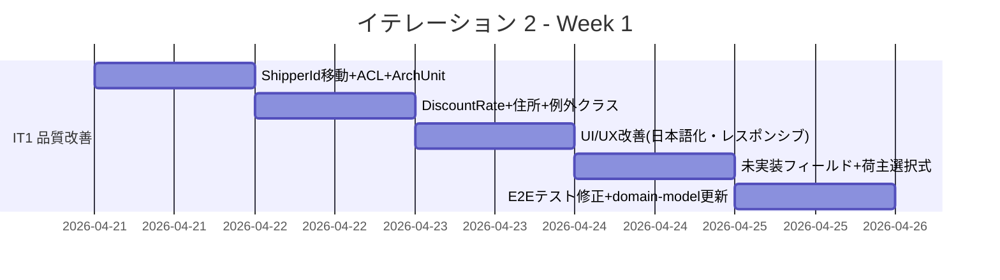
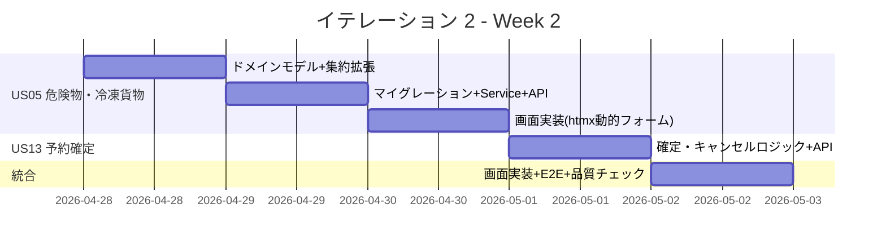
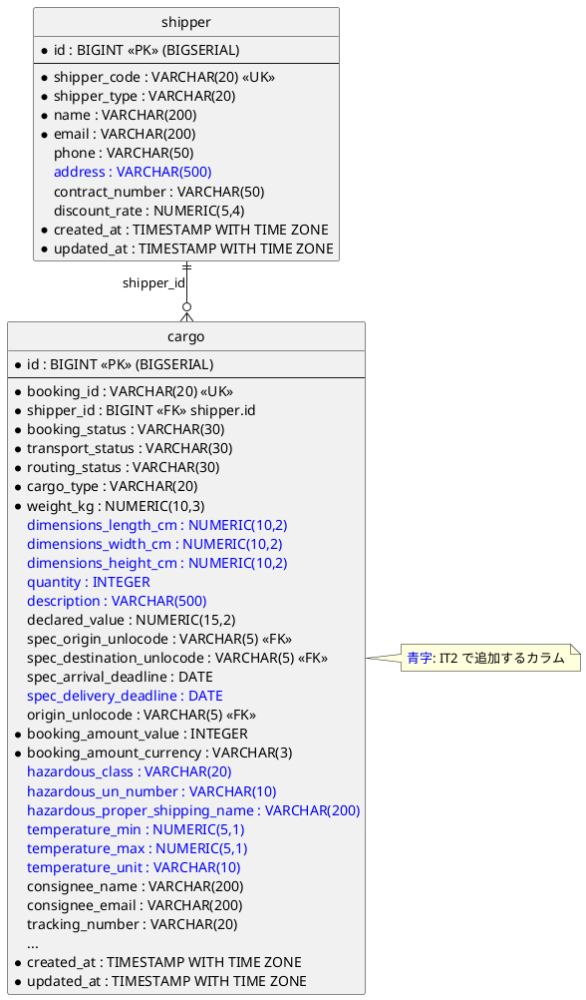
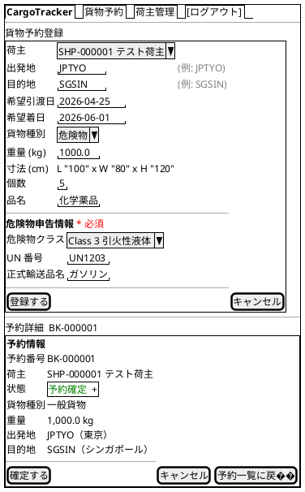
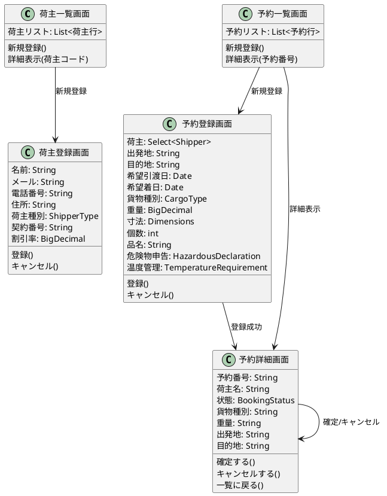
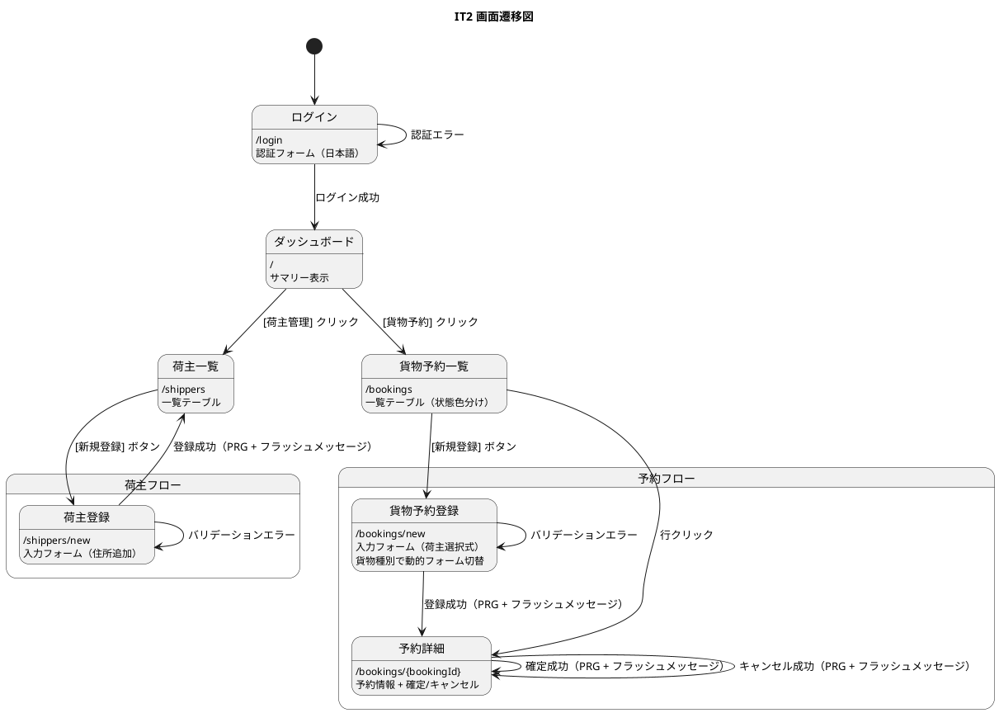

# イテレーション 2 計画

## 概要

| 項目 | 内容 |
|------|------|
| **イテレーション** | 2 |
| **期間** | Week 3-4（2026-04-21 〜 2026-05-02） |
| **ゴール** | IT1 品質改善を完了し、危険物・冷凍貨物の予約登録と予約確定フローが動作すること |
| **目標 SP** | 10（US05: 3 + US13: 3 + IT1 改善: 4） |

---

## ゴール

### イテレーション終了時の達成状態

1. **IT1 品質改善**: ShipperId の共有カーネル移動、ACL 導入、DiscountRate 30% 修正、住所フィールド追加、UI/UX 改善（日本語化・レスポンシブ・アクセシビリティ）が完了している
2. **特殊貨物予約**: 貨物種別「危険物」「冷凍・冷蔵」を選択すると追加情報の入力が必須となり、予約が登録される
3. **予約確定**: 予約詳細画面から確定・キャンセル操作ができ、状態が正しく遷移する

### 成功基準

- [x] US05: 危険物を選択すると危険物申告情報の入力が必須となる
- [x] US05: 冷凍・冷蔵を選択すると温度管理条件の入力が必須となる
- [ ] US13: 予約状態を「仮受付」→「予約確定」に遷移できる
- [ ] US13: 予約をキャンセル状態に変更できる
- [x] IT1 改善: ShipperId が shared.domain.model に配置され、ACL でコンテキスト間依存が解消されている
- [x] IT1 改善: DiscountRate 上限が 30%（0.3000）に修正されている
- [x] IT1 改善: 荷主登録に住所フィールドが追加されている
- [x] IT1 改善: ログイン画面が日本語化されている
- [ ] テストカバレッジ 80% 以上（ブランチカバレッジ含む）
- [ ] Playwright E2E テストが通過

---

## ユーザーストーリー

### 対象ストーリー

| ID | ユーザーストーリー | SP | 優先度 |
|----|-------------------|----|--------|
| US05 | 危険物・冷凍貨物の予約を登録する | 3 | 必須 |
| US13 | 予約を確定する | 3 | 必須 |
| IT1-改善 | IT1 品質改善・リファクタリング | 4 | 必須 |
| **合計** | | **10** | |

### ストーリー詳細

#### US05: 危険物・冷凍貨物の予約を登録する（UC03）

**ストーリー**:

> 営業担当者として、危険物や冷凍・冷蔵貨物の場合に、特別な追加情報（危険物申告・温度管理条件）を含めて予約を登録したい。なぜなら、貨物種別に応じた法的要件と取扱い条件を正確に管理し、安全な輸送を保証できるからだ。

**受入条件**:

1. 貨物種別「危険物」を選択すると、危険物申告情報の入力フィールドが表示され入力が必須となる
2. 貨物種別「冷凍・冷蔵貨物」を選択すると、温度管理条件の入力フィールドが表示され入力が必須となる
3. 特別情報が登録された予約は、経路設計時に対応可能な航海・ルートのみが候補として表示される（注: 経路設計は IT3 以降。IT2 ではデータ保存のみ）

#### US13: 予約を確定する（UC11）

**ストーリー**:

> 営業担当者として、荷主がルートを承認したことを確認して予約を正式確定したい。なぜなら、荷主の同意を記録し、追跡番号発行・輸送手配に進めるからだ。

**受入条件**:

1. 予約番号を指定して予約内容と選択ルートを確認できる（注: IT2 では経路未実装のため予約内容のみ表示）
2. 確定操作を行うと予約状態が「予約確定」に更新される
3. 経路設計者に追跡番号発行依頼の通知が送信される（注: IT2 ではイベント発行のみ、通知は IT3 以降）
4. 荷主がルート変更を希望する場合、予約を「経路設計中」に戻せる（注: IT2 では経路未実装のためスキップ）
5. 荷主がキャンセルを希望する場合、予約をキャンセル状態に変更できる
6. キャンセル時、荷主にキャンセル確認通知が送信される（注: IT2 ではイベント発行のみ）

#### IT1-改善: IT1 品質改善・リファクタリング

**ストーリー**:

> 開発者として、IT1 レビューで指摘された品質課題（アーキテクチャ違反・受入基準乖離・UI/UX 問題）を解消したい。なぜなら、技術的負債を早期に返済し、IT2 以降の開発速度と品質を維持できるからだ。

**受入条件（高優先度 10 件）**:

1. `ShipperId` を `shared.domain.model` に移動し、Booking Context は ACL 経由で Shipper を参照する
2. `DiscountRate` 上限を 30%（`MAX_VALUE = 0.3000`）に修正する
3. Shipper に住所フィールド（`address`）を追加する
4. ログイン画面を日本語化する
5. ナビバーにハンバーガーメニューを追加する（992px 未満対応）
6. フォームに `required` 属性・`aria-describedby` を追加する（WCAG 2.1 AA）
7. ステータスバッジを状態別に色分けする
8. 状態・貨物種別を日本語表示にする
9. ドメイン固有例外クラスを導入する（`ShipperNotFoundException` 等）
10. E2E テストの日付ハードコードを相対日付に変更する

**受入条件（中優先度 5 件）**:

11. US04 に寸法・個数・品名・希望引渡日フィールドを追加する
12. 予約登録の荷主 ID 入力を選択式（ドロップダウン）に変更する
13. 登録成功時のフラッシュメッセージを実装する
14. `DiscountRate`・`Weight` の境界値テストを追加する
15. UN/LOCODE 入力にプレースホルダー・入力例を追加する

### タスク

#### 1. IT1 品質改善（IT1-改善: 4 SP）

| # | タスク | 見積もり | 担当 | 状態 |
|---|--------|---------|------|------|
| 1.1 | `ShipperId` を `shared.domain.model` に移動 + `ShipperExistenceChecker` ACL 導入 + ArchUnit コンテキスト間分離ルール追加 | 3h | - | [x] |
| 1.2 | `DiscountRate` 上限 30% 修正 + 境界値テスト 4 値（-0.0001, 0.0000, 0.3000, 0.3001） | 1h | - | [x] |
| 1.3 | Shipper 住所フィールド追加（Flyway マイグレーション + ドメインモデル + フォーム + テスト） | 2h | - | [x] |
| 1.4 | ドメイン固有例外クラス導入（`ShipperNotFoundException`, `EmailAlreadyRegisteredException`, `BookingNotFoundException`） | 1h | - | [x] |
| 1.5 | ログイン画面日本語化 + ナビバーハンバーガーメニュー追加 | 1h | - | [x] |
| 1.6 | フォーム `required`/`aria-describedby` + ステータスバッジ色分け + 状態・種別日本語化 | 2h | - | [x] |
| 1.7 | US04 未実装フィールド追加（寸法・個数・品名・希望引渡日）+ 荷主選択式 + フラッシュメッセージ + UN/LOCODE ヘルプ | 3h | - | [x] |
| 1.8 | E2E テスト日付相対化 + `Weight` 境界値テスト + ブランチカバレッジ向上 | 2h | - | [x] |
| 1.9 | domain-model.md 更新（Shipper Context 追加・CorporateShipper・Address・ShipperId 共有カーネル化・HazardousDeclaration/TemperatureRequirement/Dimensions/Quantity/Description 追加・ShipperExistenceChecker ACL 定義） | 1h | - | [x] |

**小計**: 16h（理想時間）

#### 2. 危険物・冷凍貨物の予約登録（US05: 3 SP）

| # | タスク | 見積もり | 担当 | 状態 |
|---|--------|---------|------|------|
| 2.1 | `HazardousDeclaration` 値オブジェクト + `TemperatureRequirement` 値オブジェクト実装 | 2h | - | [x] |
| 2.2 | `Cargo` 集約に特殊貨物情報フィールド追加 + `BookCargoCommand` 拡張 | 2h | - | [x] |
| 2.3 | Flyway マイグレーション（cargo テーブルに `hazardous_class`・`temperature_min`・`temperature_max` カラム追加） | 1h | - | [x] |
| 2.4 | `CargoBookingCommandService` 特殊貨物バリデーション追加 | 1h | - | [x] |
| 2.5 | REST API 拡張（`BookCargoResource` に特殊貨物フィールド追加） | 1h | - | [x] |
| 2.6 | 予約登録画面に貨物種別連動の動的フォーム実装（htmx `hx-get` でフラグメント切替） | 2h | - | [x] |
| 2.7 | 単体テスト + API E2E テスト（危険物・冷凍各パターン） | 2h | - | [x] |
| 2.8 | Playwright E2E テスト（貨物種別切替・必須バリデーション） | 1h | - | [x] |

**小計**: 12h（理想時間）

#### 3. 予約確定（US13: 3 SP）

| # | タスク | 見積もり | 担当 | 状態 |
|---|--------|---------|------|------|
| 3.1 | `ConfirmBookingCommand` + `CancelBookingCommand` 実装 | 1h | - | [ ] |
| 3.2 | `BookingStatus` 遷移ロジック実装（PRELIMINARY → CONFIRMED、任意 → CANCELLED） | 2h | - | [ ] |
| 3.3 | `CargoBookingCommandService` に確定・キャンセルメソッド追加 | 1h | - | [ ] |
| 3.4 | `BookingConfirmedEvent` + `BookingCancelledEvent` ドメインイベント発行 | 1h | - | [ ] |
| 3.5 | REST API（POST `/api/bookings/{id}/confirm`、POST `/api/bookings/{id}/cancel`） | 1h | - | [ ] |
| 3.6 | 予約詳細画面に確定・キャンセルボタン追加 + 確認ダイアログ | 2h | - | [ ] |
| 3.7 | 単体テスト + API E2E テスト（状態遷移パターン） | 2h | - | [ ] |
| 3.8 | Playwright E2E テスト（確定・キャンセル操作） | 1h | - | [ ] |

**小計**: 11h（理想時間）

#### タスク合計

| カテゴリ | SP | 理想時間 | 状態 |
|---------|----|----|------|
| IT1 品質改善 (IT1-改善) | 4 | 16h | [x] |
| 危険物・冷凍貨物 (US05) | 3 | 12h | [x] |
| 予約確定 (US13) | 3 | 11h | [ ] |
| **合計** | **10** | **39h** | |

**1 SP あたり**: 約 3.9h
**進捗率**: 70% (7/10 SP)

---

## スケジュール

### Week 1（Day 1-5）



| 日 | タスク |
|----|--------|
| Day 1 | 1.1 ShipperId 移動 + ACL + ArchUnit |
| Day 2 | 1.2 DiscountRate 修正 + 1.3 住所追加 + 1.4 例外クラス |
| Day 3 | 1.5 ログイン日本語化 + ハンバーガー + 1.6 アクセシビリティ + ステータス色分け |
| Day 4 | 1.7 未実装フィールド + 荷主選択式 + フラッシュメッセージ |
| Day 5 | 1.8 E2E テスト修正 + 境界値テスト + 1.9 domain-model.md 更新 |

### Week 2（Day 6-10）



| 日 | タスク |
|----|--------|
| Day 6 | 2.1 特殊貨物 VO 実装 + 2.2 Cargo 集約拡張 |
| Day 7 | 2.3 マイグレーション + 2.4 Service + 2.5 REST API + 2.7 テスト |
| Day 8 | 2.6 画面実装（htmx 動的フォーム） + 2.8 E2E テスト |
| Day 9 | 3.1-3.5 確定・キャンセル（ドメイン + Service + API） + 3.7 テスト |
| Day 10 | 3.6 画面実装 + 3.8 E2E テスト + 統合テスト + 品質チェック |

---

## 設計

### ドメインモデル

```plantuml
@startuml

package "Shared Domain" {
  class ShipperId <<ValueObject>> {
    id: Long
    shipperType: ShipperType
  }
  class Location <<SharedKernel>> {
    unLocode: String
    name: String
  }
}

package "Shipper Context" {
  class Shipper {
    ShipperId id
    ShipperCode code
    ShipperName name
    Email email
    Phone phone
    Address address
    ShipperType shipperType
  }

  class CorporateShipper {
    ContractNumber contractNumber
    DiscountRate discountRate
  }

  class Address <<ValueObject>> {
    value: String
  }

  note right of CorporateShipper
    IT2: 割引率上限 30% (0.3000) に修正
    user_story.md の US03 受入基準に準拠
  end note

  Shipper *-- ShipperId
  Shipper *-- Address
  CorporateShipper --|> Shipper
}

package "Booking Context" {
  class Cargo {
    BookingId bookingId
    ShipperId shipperId
    CargoType cargoType
    Weight weight
    Dimensions dimensions
    Quantity quantity
    Description description
    RouteSpecification routeSpec
    BookingStatus status
    HazardousDeclaration hazardousDeclaration
    TemperatureRequirement temperatureRequirement
  }

  class BookingId <<ValueObject>>
  class Weight <<ValueObject>>
  class Dimensions <<ValueObject>> {
    length: BigDecimal
    width: BigDecimal
    height: BigDecimal
  }
  class Quantity <<ValueObject>> {
    value: int
  }
  class Description <<ValueObject>> {
    value: String
  }

  class HazardousDeclaration <<ValueObject>> {
    hazardousClass: String
    unNumber: String
    properShippingName: String
  }

  class TemperatureRequirement <<ValueObject>> {
    minTemperature: BigDecimal
    maxTemperature: BigDecimal
    unit: TemperatureUnit
  }

  class RouteSpecification <<ValueObject>> {
    origin: Location
    destination: Location
    deliveryDeadline: Date
    arrivalDeadline: Date
  }

  enum BookingStatus {
    PRELIMINARY
    ROUTE_PROPOSED
    CONFIRMED
    TRACKING_ISSUED
    IN_TRANSIT
    DELIVERED
    SETTLED
    CANCELLED
  }

  enum CargoType {
    GENERAL
    HAZARDOUS
    REFRIGERATED
  }

  note right of BookingStatus
    IT2 実装:
    PRELIMINARY → CONFIRMED（直接確定）
    任意 → CANCELLED
  end note

  class ConfirmBookingCommand {
    bookingId: BookingId
  }
  class CancelBookingCommand {
    bookingId: BookingId
    reason: String
  }

  interface ShipperExistenceChecker <<ACL>> {
    exists(shipperId): boolean
  }

  Cargo *-- BookingId
  Cargo *-- RouteSpecification
  Cargo *-- BookingStatus
  Cargo *-- CargoType
  Cargo *-- HazardousDeclaration
  Cargo *-- TemperatureRequirement
  Cargo *-- Dimensions
  Cargo *-- Quantity
  Cargo *-- Description
}

Cargo --> ShipperId : 参照（Shared Domain 経由）
Cargo ..> ShipperExistenceChecker : ACL
RouteSpecification --> Location : 参照

@enduml
```



### データモデル

> data-model.md に準拠。IT2 で追加するカラムを明示。



> **注**: `hazardous_class`・`temperature_min`/`temperature_max` は data-model.md に未定義。IT2 完了時に data-model.md へ反映する。

### ユーザーインターフェース

#### ビュー

> **注**: IT2 ではナビバーを ui_design.md に準拠した形式に更新する。



#### モデル



#### インタラクション



**htmx パターン**:

| 操作 | 方式 | hx 属性 |
|------|------|---------|
| 貨物種別切替 | `hx-get="/bookings/new/cargo-type-fields?type={type}"` | `hx-target="#cargo-type-fields"` `hx-swap="innerHTML"` |
| 予約確定 | `hx-post="/bookings/{id}/confirm"` | `hx-confirm="予約を確定しますか？"` |
| 予約キャンセル | `hx-post="/bookings/{id}/cancel"` | `hx-confirm="予約をキャンセルしますか？"` |

**フィードバックメッセージ**:

| 操作 | メッセージ | スタイル |
|------|----------|---------|
| 荷主登録成功 | 「荷主を登録しました（SHP-XXXXXX）」 | `alert-success` |
| 予約登録成功 | 「予約を登録しました（BK-XXXXXX）」 | `alert-success` |
| 予約確定成功 | 「予約を確定しました」 | `alert-success` |
| 予約キャンセル成功 | 「予約をキャンセルしました」 | `alert-warning` |
| バリデーションエラー | フィールド単位のエラー表示 | `alert-danger` |

**ステータスバッジ色分け**:

| 状態 | 日本語表示 | Bootstrap クラス |
|------|----------|-----------------|
| PRELIMINARY | 仮受付 | `text-bg-secondary` |
| ROUTE_PROPOSED | 経路提案済 | `text-bg-info` |
| CONFIRMED | 予約確定 | `text-bg-success` |
| CANCELLED | キャンセル | `text-bg-danger` |

### データベーススキーマ

> IT2 で追加する Flyway マイグレーション。

```sql
-- V4__add_shipper_address.sql
ALTER TABLE shipper ADD COLUMN address VARCHAR(500);

-- V5__add_cargo_detail_fields.sql
ALTER TABLE cargo ADD COLUMN dimensions_length_cm NUMERIC(10,2);
ALTER TABLE cargo ADD COLUMN dimensions_width_cm NUMERIC(10,2);
ALTER TABLE cargo ADD COLUMN dimensions_height_cm NUMERIC(10,2);
ALTER TABLE cargo ADD COLUMN quantity INTEGER;
ALTER TABLE cargo ADD COLUMN description VARCHAR(500);
ALTER TABLE cargo ADD COLUMN spec_delivery_deadline DATE;

-- V6__add_cargo_special_fields.sql
ALTER TABLE cargo ADD COLUMN hazardous_class VARCHAR(20);
ALTER TABLE cargo ADD COLUMN hazardous_un_number VARCHAR(10);
ALTER TABLE cargo ADD COLUMN hazardous_proper_shipping_name VARCHAR(200);
ALTER TABLE cargo ADD COLUMN temperature_min NUMERIC(5,1);
ALTER TABLE cargo ADD COLUMN temperature_max NUMERIC(5,1);
ALTER TABLE cargo ADD COLUMN temperature_unit VARCHAR(10);
```

### API 設計

| メソッド | エンドポイント | 説明 | IT |
|---------|---------------|------|-----|
| POST | /api/shippers | 荷主を登録する（住所追加） | IT1→IT2 拡張 |
| GET | /api/shippers | 荷主一覧を取得する | IT1 |
| GET | /api/shippers/{id} | 荷主を取得する | IT1 |
| POST | /api/bookings | 貨物予約を登録する（特殊貨物対応） | IT1→IT2 拡張 |
| GET | /api/bookings | 予約一覧を取得する | IT1 |
| GET | /api/bookings/{id} | 予約を取得する | IT1 |
| POST | /api/bookings/{id}/confirm | 予約を確定する | **IT2 新規** |
| POST | /api/bookings/{id}/cancel | 予約をキャンセルする | **IT2 新規** |

### ディレクトリ構成

> IT2 で追加・変更するファイルを ★ で示す。

```
apps/cargo-tracker/src/main/java/com/example/cargotracker/
├── shareddomain/
│   ├── events/
│   │   ├── CargoBookedEvent.java
│   │   ├── BookingConfirmedEvent.java               ★IT2 新規
│   │   └── BookingCancelledEvent.java               ★IT2 新規
│   └── model/
│       └── ShipperId.java                           ★IT2 移動（shipper→shared）
├── shipper/
│   ├── domain/
│   │   └── model/
│   │       ├── aggregates/
│   │       │   └── Shipper.java                     ★IT2 変更（Address 追加）
│   │       ├── commands/
│   │       │   └── RegisterShipperCommand.java      ★IT2 変更
│   │       └── valueobjects/
│   │           ├── Address.java                     ★IT2 新規
│   │           ├── DiscountRate.java                ★IT2 変更（MAX 30%）
│   │           └── ...
│   ├── application/
│   │   └── internal/
│   │       └── ...
│   └── interfaces/
│       └── ...
├── booking/
│   ├── domain/
│   │   └── model/
│   │       ├── aggregates/
│   │       │   └── Cargo.java                       ★IT2 変更（confirm/cancel、特殊貨物）
│   │       ├── commands/
│   │       │   ├── BookCargoCommand.java             ★IT2 変更
│   │       │   ├── ConfirmBookingCommand.java        ★IT2 新規
│   │       │   └── CancelBookingCommand.java         ★IT2 新規
│   │       └── valueobjects/
│   │           ├── HazardousDeclaration.java         ★IT2 新規
│   │           ├── TemperatureRequirement.java        ★IT2 新規
│   │           ├── Dimensions.java                   ★IT2 新規
│   │           ├── Quantity.java                     ★IT2 新規
│   │           ├── Description.java                  ★IT2 新規
│   │           └── ...
│   ├── application/
│   │   └── internal/
│   │       ├── commandservices/
│   │       │   └── CargoBookingCommandService.java   ★IT2 変更（confirm/cancel 追加）
│   │       └── outboundservices/
│   │           └── ShipperExistenceChecker.java      ★IT2 新規（ACL）
│   └── interfaces/
│       ├── rest/
│       │   └── CargoBookingController.java           ★IT2 変更（confirm/cancel エンドポイント）
│       └── web/
│           └── BookingThymeleafController.java        ★IT2 変更
└── ...
```

### ADR

| ADR | タイトル | ステータス |
|-----|---------|-----------|
| [ADR-010](../adr/010-practical-ddd-package-structure.md) | Practical DDD in Enterprise Java のパッケージ構成を採用する | 承認 |
| [ADR-011](../adr/011-archunit-hexagonal-rules.md) | ArchUnit でヘキサゴナルアーキテクチャの依存関係ルールを自動検証する | 承認 |
| [ADR-012](../adr/012-default-profile-login-prefill.md) | デフォルトプロファイルでログインフォームに認証情報をプリセットする | 承認 |

> IT2 で ADR-011 のルール 4（コンテキスト間分離）を ArchUnit テストに追加する。

### IT3 以降に保留するレビュー指摘

以下の指摘は IT2 スコープ外とし、IT3 以降で対応する。

| # | 出典 | 内容 | 保留理由 |
|---|------|------|---------|
| コード #8 | IT1 コードレビュー | OpenAPI アノテーション（@Schema, @Operation）追加 | API ドキュメント改善は機能開発後に一括対応 |
| コード #12 | IT1 コードレビュー | 重複レスポンス DTO 共通化 | Phase 2 で API 数増加時にまとめて対応 |
| コード #13 | IT1 コードレビュー | `MethodArgumentNotValidException` レスポンス構造化 | API エラーハンドリング統一は Phase 2 |
| コード #14 | IT1 コードレビュー | `Shipper` Composition 検討 | 荷主種別追加の具体的要件が出てから対応 |
| UI/UX M1 | IT1 UI/UX レビュー | 予約一覧・詳細に荷主名表示 | IT2 の荷主選択式対応で部分改善、完全対応は IT3 |
| UI/UX M3 | IT1 UI/UX レビュー | 詳細画面に編集・削除ボタン枠 | CRUD の U/D は Phase 2 以降 |
| UI/UX M5 | IT1 UI/UX レビュー | 割引率をパーセント形式で表示 | 表示フォーマット改善は IT3 |
| UI/UX M6 | IT1 UI/UX レビュー | 重量フィールドに単位（kg）表示 | 表示フォーマット改善は IT3 |
| UI/UX M7 | IT1 UI/UX レビュー | メールアドレス重複チェック UI | US02 受入基準 2 の完全実装は IT3 |
| UI/UX M8 | IT1 UI/UX レビュー | ダッシュボードのアクティブ状態修正 | ナビゲーション改善は IT3 |

---

## リスクと対策

| リスク | 影響度 | 対策 |
|--------|--------|------|
| IT1 改善タスクの見積もり超過 | 高 | 高優先度 10 件を先に対応し、中優先度は Day 5 までに完了しなければ IT3 に持ち越す |
| htmx 動的フォームの複雑度 | 中 | Thymeleaf フラグメントのシンプルな構成で実装し、JavaScript は最小限に抑える |
| BookingStatus 遷移の設計変更 | 中 | IT2 では PRELIMINARY → CONFIRMED の直接遷移のみ。ROUTE_PROPOSED は IT3 で経路設計実装時に追加 |
| data-model.md との乖離拡大 | 低 | IT2 完了時に data-model.md・domain-model.md を必ず更新する |

---

## 完了条件

### Definition of Done

- [ ] コードレビュー完了（`developing-review` 実施）
- [ ] UI/UX レビュー完了（`developing-uiux-review` 実施）
- [ ] 単体テストがパス
- [ ] API E2E テストがパス
- [ ] Playwright E2E テストがパス
- [ ] テストカバレッジ 80% 以上（命令カバレッジ + ブランチカバレッジ）
- [ ] SonarQube Quality Gate PASS（ローカル実行）
- [ ] 機能がローカル環境で動作確認済み
- [ ] ドキュメント更新完了（domain-model.md、data-model.md、ui_design.md）
- [ ] IT1 レビュー指摘の高優先度 10 件が全て解消済み

### デモ項目

1. 荷主登録で住所フィールドが入力・保存できることを確認
2. 貨物種別「危険物」を選択すると危険物申告フォームが表示され、登録できることを確認
3. 貨物種別「冷凍・冷蔵」を選択すると温度管理フォームが表示され、登録できることを確認
4. 予約詳細画面から予約を確定し、状態が「予約確定」に遷移することを確認
5. 予約詳細画面から予約をキャンセルし、状態が「キャンセル」に遷移することを確認
6. ログイン画面が日本語で表示されることを確認
7. ステータスバッジが状態に応じた色で表示されることを確認

---

## 更新履歴

| 日付 | 更新内容 | 更新者 |
|------|---------|--------|
| 2026-04-04 | 初版作成 | - |
| 2026-04-04 | IT1 品質改善（4 SP）完了を反映。テスト 95 件全 Green、JaCoCo カバレッジ 63% | - |

---

## 関連ドキュメント

- [リリース計画](./release_plan.md)
- [イテレーション 1 計画](./iteration_plan-1.md)
- [イテレーション 1 ふりかえり](./retrospective-1.md)
- [ユーザーストーリー](../requirements/user_story.md)
- [ドメインモデル設計](../design/domain-model.md)
- [データモデル設計](../design/data-model.md)
- [UI 設計](../design/ui_design.md)
- [IT1 実装成果物レビュー](../review/IT1_review_20260404.md)
- [IT1 UI/UX レビュー](../review/IT1_uiux_review_20260404.md)
