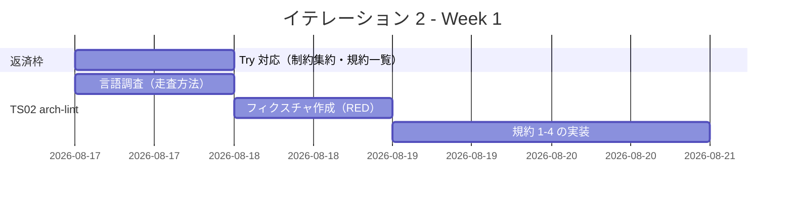
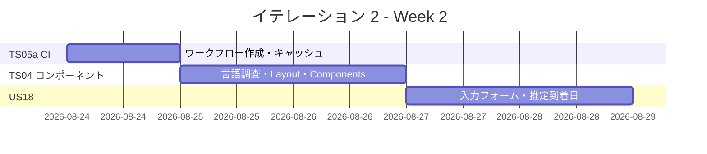
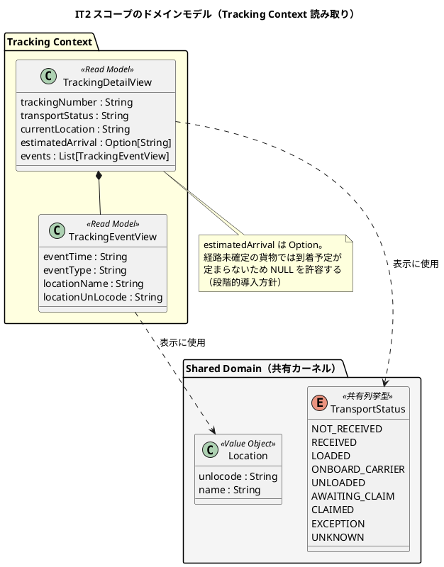
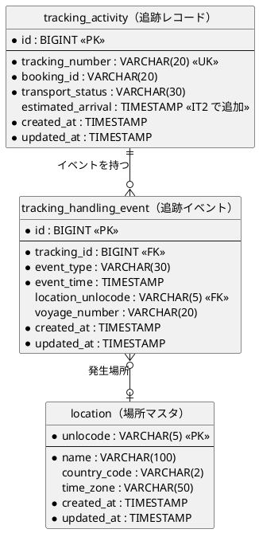
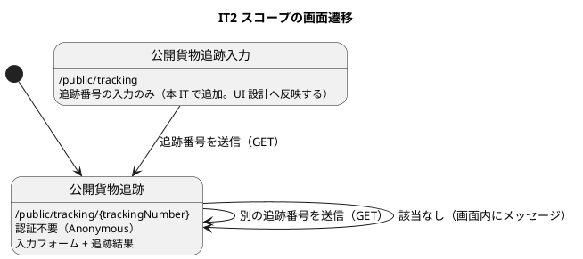

# イテレーション 2 計画

## 概要

| 項目 | 内容 |
|------|------|
| **イテレーション** | 2 |
| **期間** | Week 3-4（2026-08-17 〜 2026-08-28） |
| **局面** | 序盤（アウトサイドイン。[開発戦略](development_strategy.md) 参照） |
| **ゴール** | 公開貨物追跡を US18 の受入基準を満たす状態まで作り込み、アーキテクチャ規約の機械検査と CI を立ち上げて品質ゲートを機能させる |
| **目標 SP** | 17 |

---

## ゴール

### イテレーション終了時の達成状態

1. **US18 の完了**: 追跡番号の入力フォーム・推定到着日を実装し、受入基準 5 項目をすべて満たす
2. **アーキテクチャ規約の自動検査**: `arch-lint` が 8 規約を検査し、違反フィクスチャで自身の正しさも検証される
3. **品質ゲートの自動化**: PR で「ビルド + テスト + `arch-lint`」が自動実行され、ローカル緑と CI 緑が一致する
4. **UI 基盤の確立**: 共通レイアウト・ナビゲーション・フォーム・バッジのコンポーネント群が揃う

### 成功基準

- [ ] US18 の受入基準 5 項目がすべて満たされる（下記の判定表）
- [ ] `arch-lint` が 8 規約すべてを検査し、違反フィクスチャを検出・適合例を誤検出しない
- [ ] GitHub Actions の PR ワークフローが緑になる
- [ ] `npm run dev:verify` が全件成功する
- [ ] 前 IT のレビュー指摘の引き継ぎ分（H5・H6・M1・M3-M5・M7・L1・L5・L6）を処理する
- [ ] **言語調査に費やした時間を記録する**（Try T3。見積もり精度の改善に使う）

### US18 受入基準の判定（Try T6）

計画時点で 1 項目ずつ「IT2 で満たすか」を判定する。

| # | 受入基準 | IT1 時点 | IT2 で満たすか | 対応タスク |
|:--:|---------|:---:|:---:|-----------|
| 1 | 追跡番号を入力して貨物情報を照会できる | 未達（URL 直打ちのみ） | **満たす** | 2.1（入力フォーム） |
| 2 | 現在の状態・位置（港湾名）・推定到着日が表示される | 半分（推定到着日なし） | **満たす** | 2.2-2.4（推定到着日） |
| 3 | 追跡イベント履歴（日時・場所・作業種別）が時系列で表示される | 達成 | 維持 | - |
| 4 | 追跡番号が存在しない場合、メッセージが表示される | 達成 | 維持（文言統一） | 2.5 |
| 5 | ログインなしでも追跡番号があれば照会できる | 達成 | 維持 | - |

---

## ユーザーストーリー

### 対象ストーリー

| ID | ストーリー | SP | 優先度 | Issue |
|----|-----------|:--:|--------|-------|
| TS02 | `arch-lint`（8 規約 + 違反フィクスチャによるメタテスト） | 5 | 必須 | [#442](https://github.com/k2works/case-study-cargo-tracker/issues/442) |
| US18 | 追跡情報を照会する（受入基準の完全充足） | 5 | 必須 | [#443](https://github.com/k2works/case-study-cargo-tracker/issues/443) |
| TS04 | Html コンポーネント群（レイアウト・ナビ・フォーム・バッジ） | 5 | 必須 | [#444](https://github.com/k2works/case-study-cargo-tracker/issues/444) |
| TS05a | CI 最小構成（PR で build / test / arch-lint） | 2 | 必須 | [#445](https://github.com/k2works/case-study-cargo-tracker/issues/445) |
| **合計** | | **17** | | |

GitHub Project: [CargoTracker flix/take-1](https://github.com/users/k2works/projects/39)

> **TS05 の分割について**（ふりかえり Try T5 の判断）:
> リリース計画では CI 一式（TS05・5 SP）を IT3 に置いていたが、**IT2 も「ローカル緑のみ」で
> 進むリスク**を避けるため最小構成（2 SP）を前倒しする。残り 3 SP（E2E・日次の実 PostgreSQL・
> Trivy・SonarQube）は IT3 の TS05b とする。

### ストーリー詳細

#### TS02: `arch-lint`

**ストーリー**:
> 開発チームとして、アーキテクチャ規約の違反を機械的に検出したい。
> なぜなら、ArchUnit が使えない Flix では規約が人手のレビューに依存し、
> イテレーションを重ねるほど守られなくなるからだ。

**受入条件**:

1. [テスト戦略](../design/test_strategy.md) 3.3 の **8 規約すべて**を検査する
   - 規約 7（`Html.RawUnsafe` の許可リスト）は現時点で使用箇所 0 件。「0 件であること」を検査する
   - 規約 8（`<form>` の直接構築禁止）は TS04 で `Components.form` を実装した後に有効になる
2. 違反フィクスチャ（負例）をすべて検出する
3. 適合例（正例）を 1 件も誤検出しない
4. `npm run arch:lint` で実行でき、違反時に終了コード 1 を返す
5. **レイヤ判定はモジュール名ではなくディレクトリパスで行う**（IT1 の設計反映済み）

**前提作業（Try T4）**: 実装前に 8 規約それぞれの「検出方法」と「既知の例外」を一覧化する。
IT1 のレビューで規約 5 の定義矛盾が見つかったため、実装前の確定を必須とする。

#### US18: 追跡情報を照会する

**ストーリー**:
> 荷主（または荷受人）として、追跡番号を入力して貨物の現在位置・状態・
> 追跡イベント履歴・推定到着日を確認したい。
> なぜなら、輸送状況をいつでも自分で確認でき、到着準備や業務計画に役立てるからだ。

**受入条件**: 上記「US18 受入基準の判定」の 5 項目すべて。

**注（設計への反映が必要）その 1 — URL パラメータ名**: [UI 設計](../design/ui_design.md) は
`/public/tracking/{trackingId}` と記載しているが、[ドメインモデル設計](../design/domain-model.md) の
ユビキタス言語では追跡番号は `TrackingNumber` であり、`TrackingId` という用語は存在しない。
IT1 の実装は `{trackingNumber}` を採用済みである。**ドメインモデルを用語の正典**とし、
UI 設計側のパスパラメータ名を `{trackingNumber}` へ修正する（タスク 2.8）。

**注（設計への反映が必要）その 2 — 入力フォームのルート**: UI 設計の仕様は
「`GET /public/tracking/{trackingNumber}` でページ表示。結果は同一ページ内に表示」とあるが、
**追跡番号を未指定でページを開く導線**（フォームだけを表示する状態）が定義されていない。
`GET /public/tracking`（末尾なし）を追加し、UI 設計へ反映する（タスク 2.8）。

**注（設計への反映が必要）その 3 — 推定到着日**: 推定到着日を表示するには `tracking_activity` にカラムが必要だが、
[データモデル設計](../design/data-model.md) の現行定義に存在しない。本イテレーションで
`estimated_arrival TIMESTAMP`（NULL 許容）を追加し、データモデル設計へ同一コミットで反映する。
NULL 許容とするのは、経路未確定の貨物では到着予定が定まらないためである
（[ドメインモデル設計](../design/domain-model.md) の段階的導入方針に従う）。

#### TS04: Html コンポーネント群

**ストーリー**:
> 開発チームとして、画面に共通する部品を再利用したい。
> なぜなら、IT3 以降で画面数が増えたときに、レイアウト・ナビ・フォームを
> 各画面で書き直すと整合が崩れるからだ。

**受入条件**:

1. `Layout.page(title, principal, activeNav, body)` が全ページ共通の枠を提供する
2. `Components.form` が CSRF トークンの hidden フィールドを自動付与する（トークン自体は IT3）
3. `Components.formField` がラベル・入力・エラーメッセージをまとめて生成する
4. `Components.statusBadge` が `TransportStatus` を受け取りバッジを返す
5. `Components.alert` がフラッシュメッセージを描画する
6. 公開追跡ページが `Layout.page` を経由して描画される（未認証向けのためナビは非表示）

#### TS05a: CI 最小構成

**受入条件**:

1. PR 作成・更新時に GitHub Actions が「`flix build` → `flix test` → `arch-lint`」を実行する
2. Flix コンパイラ（`flix.jar`）と Maven 依存（`lib/`）がキャッシュされる
3. いずれかが失敗した場合、PR のチェックが赤になる
4. 実行時間が 8 分以内（[テスト戦略](../design/test_strategy.md) 7.1 の PR ステージ目標）

### タスク

#### 0. 前 IT の Try への対応（返済枠・0 SP）

ふりかえりの Try を**イテレーション序盤の独立コミット枠**で処理する。

| # | タスク | 見積もり | 担当 | 状態 |
|---|--------|:---:|------|:---:|
| 0.1 | T7: Flix の制約 10 件を手順書 7 章へ集約する | 1h | - | [x] |
| 0.2 | T4: `arch-lint` の 8 規約 × 検出方法 × 既知の例外の一覧を作る | 2h | - | [x] |
| 0.3 | L5: 未検出メッセージの文言を UI 設計に合わせてユーザーストーリー側を更新 | 0.5h | - | [x] |

**小計**: 3.5h

#### 1. TS02: `arch-lint`（5 SP）

| # | タスク | 見積もり | 担当 | 状態 |
|---|--------|:---:|------|:---:|
| 1.1 | **言語調査枠**: Flix ソースの `use` / `import` / 構文パターンの走査方法を調査する | 4h | - | [x] |
| 1.2 | 【RED】違反フィクスチャ（負例 8 件）と適合例（正例 8 件）を作る | 3h | - | [x] |
| 1.3 | 【GREEN】規約 1-3（レイヤ依存）の検査を実装する | 3h | - | [x] |
| 1.4 | 【GREEN】規約 4（BC 間の直接参照）の検査を実装する | 2h | - | [x] |
| 1.5 | 【GREEN】規約 5-6（ハンドラの合成・レイヤ違反）の検査を実装する | 3h | - | [x] |
| 1.5b | 【GREEN】規約 7-8（`RawUnsafe` 許可リスト・`<form>` 直接構築）の検査を実装する | 2h | - | [x] |
| 1.6 | `npm run arch:lint` タスクを追加し、終了コードを返す | 1h | - | [x] |
| 1.7 | 【REFACTOR】検出ロジックの重複除去・メッセージ改善 | 2h | - | [x] |

**小計**: 20h

#### 2. US18: 追跡情報を照会する（5 SP）

| # | タスク | 見積もり | 担当 | 状態 |
|---|--------|:---:|------|:---:|
| 2.1 | 【RED→GREEN】追跡番号の入力フォームを追加（`GET` 送信・同一ページ内表示） | 3h | - | [x] |
| 2.2 | `V2__add_estimated_arrival.sql` を追加し、データモデル設計へ反映する | 1.5h | - | [x] |
| 2.3 | `TrackingDetailView` に推定到着日を追加し、SQL とデコーダを更新する | 2h | - | [x] |
| 2.4 | 【RED→GREEN】推定到着日を画面に表示する（未設定時は「未定」） | 2h | - | [x] |
| 2.5 | M7: 場所表示を「都市名（UN/LOCODE）」の併記に変更する | 1.5h | - | [x] |
| 2.6 | M4: 未知の `TransportStatus` に対するフォールバックのテストを追加 | 1h | - | [x] |
| 2.7 | E2E シナリオ④（公開追跡照会）を Playwright で作成する | 3h | - | [ ] |
| 2.8 | UI 設計へ 3 件の注を反映（パラメータ名・フォームのルート・推定到着日の項目） | 1h | - | [x] |

**小計**: 15h

#### 3. TS04: Html コンポーネント群（5 SP）

| # | タスク | 見積もり | 担当 | 状態 |
|---|--------|:---:|------|:---:|
| 3.1 | **言語調査枠**: `Html` の合成パターン（部分適用・リスト構築）の書き味を確認する | 4h | - | [x] |
| 3.2 | 【RED→GREEN】`Layout.page` / `Layout.nav` / `Layout.footer` | 3h | - | [x] |
| 3.3 | 【RED→GREEN】`Components.statusBadge`（`TransportStatus` の全 9 値） | 2h | - | [x] |
| 3.4 | 【RED→GREEN】`Components.form` / `Components.formField` | 3h | - | [x] |
| 3.5 | 【RED→GREEN】`Components.alert` | 1h | - | [x] |
| 3.6 | 公開追跡ページを `Layout.page` 経由へ移行する | 2h | - | [x] |
| 3.7 | L1: `DevSeed` とテストのシードを共通フィクスチャへ抽出する | 2h | - | [ ] |

**小計**: 17h

#### 4. TS05a: CI 最小構成（2 SP）

| # | タスク | 見積もり | 担当 | 状態 |
|---|--------|:---:|------|:---:|
| 4.1 | `.github/workflows/flix-ci.yml` を作成（build / test / arch-lint） | 3h | 1h | [x] |
| 4.2 | `flix.jar` と `lib/` のキャッシュを設定する | 2h | 0.5h | [x] |
| 4.3 | PR を作成して CI が緑になることを確認する | 1h | - | [ ] |

> 4.3 は `flix/take-1` ブランチが remote に未 push のため保留。ローカルで CI と同一手順
> （`dev:build` → `dev:test` → `arch:check`）が全緑であることは確認済み（24 件成功・違反 0 件）。

**小計**: 6h

#### タスク合計

| カテゴリ | SP | 理想時間 | 状態 |
|---------|:--:|:---:|:---:|
| 前 IT の Try 対応（返済枠） | 0 | 3.5h | [x] |
| TS02 `arch-lint` | 5 | 20h | [x] |
| US18 追跡情報を照会する | 5 | 15h | [x]（2.7 E2E は IT3 へ） |
| TS04 Html コンポーネント群 | 5 | 17h | [x]（3.7 フィクスチャ共通化は IT3 へ） |
| TS05a CI 最小構成 | 2 | 6h | [x]（4.3 は push 後に確認） |
| **合計** | **17** | **61.5h** | |

**1 SP あたり**: 約 3.6h
**進捗率**: 0%（0/17 SP）

> **見積もりについて**: 想定稼働 40h に対し 61.5h は 54% の超過であり、IT1（33% 超過）より悪化している。
> これは **Try T3 に従い、言語調査枠（1.1・3.1 の計 8h）を独立タスクとして明示的に計上した**ためである。
> IT1 では同じ時間を隠れコストとして消費していた。
>
> 超過分の吸収方針:
>
> 1. 2.7（E2E）を IT3 へ送る（3h）— Playwright の環境構築は CI 整備とセットの方が効率的
> 2. 3.7（フィクスチャ共通化）を IT3 へ送る（2h）
> 3. それでも収まらない場合は 2.5（場所表示の併記）を送る（1.5h）
>
> **TS02 と TS05a は削らない**。品質ゲートの成立が本イテレーションの主目的であるため。

---

## スケジュール

### Week 1（Day 1-5）



| 日 | タスク |
|----|--------|
| Day 1 | 0.1-0.3（返済枠）、1.1（言語調査） |
| Day 2 | 1.2（違反フィクスチャ・適合例） |
| Day 3 | 1.3（規約 1-3） |
| Day 4 | 1.4（規約 4）、1.5 着手 |
| Day 5 | 1.5-1.7（規約 5-6・タスク化・リファクタ） |

### Week 2（Day 6-10）



| 日 | タスク |
|----|--------|
| Day 6 | 4.1-4.3（CI 最小構成） |
| Day 7 | 3.1（言語調査）、3.2（Layout） |
| Day 8 | 3.3-3.5（Components）、3.6（移行） |
| Day 9 | 2.1（入力フォーム）、2.2-2.3（推定到着日の基盤） |
| Day 10 | 2.4-2.6、デモ準備。**言語調査時間の記録** |

---

## 設計

本イテレーションのスコープに絞って掲載します。

### ドメインモデル

IT1 の読み取りモデルに**推定到着日**を追加します。集約の状態遷移は依然として扱いません。



### 状態モデル

`TransportStatus` は本イテレーションでも**表示のみ**で、遷移を扱いません。
状態遷移の実装は IT8（US15 荷役記録）で行うため、状態遷移図は掲載しません。

ただし `Components.statusBadge` で全 9 値のラベルとバッジ色を扱うため、
[UI 設計 - TransportStatus バッジ定義](../design/ui_design.md) を正典として実装します。

### データモデル



**注（設計への反映が必要）**: `estimated_arrival` は現行の [データモデル設計](../design/data-model.md) に存在しません。
`V2__add_estimated_arrival.sql` の追加と同一コミットでデータモデル設計へ反映します（タスク 2.2）。

### ユーザーインターフェース



ワイヤーフレームは [UI 設計 - 公開貨物追跡](../design/ui_design.md#公開貨物追跡-publictrackingtrackingid) を正典とします。

**共通レイアウトの適用範囲**: TS04 で `Layout.page` を作りますが、公開追跡は未認証ユーザー向けのため
**ナビゲーションを表示しません**（`activeNav = NavNone`）。認証済み画面での適用は IT3 以降です。

### ディレクトリ構成

```text
apps/cargo-tracker/
├── src/
│   ├── shared/infrastructure/html/
│   │   ├── Html.flix              # 既存
│   │   ├── Attrs.flix             # 新規: class/id/hx-* の属性補助
│   │   ├── Layout.flix            # 新規: page / nav / footer
│   │   └── Components.flix        # 新規: statusBadge / form / formField / alert
│   └── tracking/
│       ├── domain/port/TrackingView.flix       # 推定到着日を追加
│       ├── infrastructure/                     # SQL・デコーダを更新
│       └── interfaces/web/TrackingPublicPages.flix  # フォーム・推定到着日
├── test/
│   └── web/{LayoutTest.flix, ComponentsTest.flix}   # 新規
├── resources/db/migration/V2__add_estimated_arrival.sql  # 新規
└── e2e/                                        # 新規（Playwright。IT3 へ送る可能性あり）

ops/scripts/arch-lint/
├── index.js                       # 検査本体
├── rules/                         # 規約ごとの検出ロジック
└── fixtures/
    ├── violations/                # 負例（検出されるべき）
    └── conformant/                # 正例（誤検出されてはならない）

.github/workflows/flix-ci.yml      # 新規
```

### ADR

| ADR | タイトル | ステータス |
|-----|---------|-----------|
| ADR-0003 | セッション要件（同時セッション数 1）の扱い | **IT3 で起票（スコープ外）** |

本イテレーションで新規 ADR の起票予定はありません。

---

## リスクと対策

| リスク | 影響度 | 対策 |
|--------|--------|------|
| `arch-lint` の検出方法が確立できない（Flix の構文走査が想定より複雑） | 高 | 1.1 の言語調査枠（4h）で見極める。正規表現ベースで済まない場合は、規約 1-3（`use` 宣言のみで判定可能）に絞って IT2 を終え、規約 4-6 を IT3 へ送る |
| 見積もりが 58.5h で稼働 40h を大きく超過している | 高 | 吸収方針を明記済み（E2E → IT3、フィクスチャ共通化 → IT3）。**TS02 と TS05a は削らない** |
| CI で Flix のビルドがタイムアウトする | 中 | キャッシュを最優先で設定する（4.2）。8 分を超える場合は `flix check` のみに縮小して IT3 で拡張する |
| `Html` コンポーネントの合成が Flix で書きにくい | 中 | 3.1 の言語調査枠（4h）で見極める。書き味が悪い場合は関数を細かく分けず、画面ごとの重複を許容して IT3 で再設計する |
| Flix コンパイラの不具合を再び踏む | 中 | IT1 で `VerifyError` を経験済み。`try/catch` を含むネストしたラムダを避ける |
| 推定到着日のデータ供給元が未定 | 中 | IT2 では手動投入（シード）とし、経路確定時の自動設定は IT7（US11 経路紐付け）で実装する |

---

## 完了条件

### Definition of Done

- [ ] `npm run dev:verify`（ビルド + 全テスト）が成功する
- [ ] `npm run arch:lint` が違反 0 件で終了する
- [ ] **GitHub Actions の PR ワークフローが緑になる**
- [ ] コンパイラ警告が 0 件
- [ ] US18 の受入基準 5 項目をすべて満たす
- [ ] 実装した内容が [バックエンドアーキテクチャ](../design/architecture_backend.md)・[フロントエンドアーキテクチャ](../design/architecture_frontend.md) と一致する
- [ ] `estimated_arrival` カラムを [データモデル設計](../design/data-model.md) に反映する
- [ ] トレーサビリティ表（[テスト戦略](../design/test_strategy.md) 5 章）の US18 行を更新する
- [ ] ビジネスルール対応表の該当行を更新する
- [ ] 前 IT のレビュー引き継ぎ分を処理する（または次 IT へ送る判断を記録する）
- [ ] 言語調査に費やした時間を記録する（Try T3）
- [ ] マルチパースペクティブレビューを実施し高優先度の指摘に対応する

### デモ項目

デモ項目には対応するテスト関数を併記します（[開発戦略](development_strategy.md) 3 節）。

| # | デモ項目 | 対応テスト |
|---|---------|-----------|
| 1 | 追跡番号をフォームに入力して照会できる | `PublicTrackingHttpTest.testSearchByQueryParam` |
| 2 | 推定到着日が表示される（未設定時は「未定」） | `TrackingPublicPagesTest.testShowRendersEstimatedArrival` / `testShowRendersUndeterminedArrival` |
| 3 | 場所が「都市名（UN/LOCODE）」で表示される | `TrackingPublicPagesTest.testShowRendersLocationWithUnlocode` |
| 4 | 共通レイアウトが適用される | `LayoutTest.testPageRendersTitleBodyAndFooter` |
| 5 | `arch-lint` が違反フィクスチャを検出する | `arch-lint` のメタテスト（負例 8 件） |
| 6 | `arch-lint` が適合例を誤検出しない | `arch-lint` のメタテスト（正例 8 件） |
| 7 | PR で CI が自動実行される | GitHub Actions の実行結果 |

---

## 前イテレーションからの引き継ぎ

### ふりかえりの Try の反映状況

| # | Try | 反映先 |
|:--:|-----|--------|
| T1 | 設計の擬似コードはスパイクで検証してから書く | タスク 1.1・3.1（言語調査枠）で先行検証する |
| T2 | 同じ形を 2 回書いたら 3 回目を自問する | タスク 1.7・3.7（リファクタ枠）で確認する |
| T3 | 言語調査枠を独立タスクとして計上する | **タスク 1.1・3.1 として計上済み**（計 8h） |
| T4 | `arch-lint` 実装前に規約の検出方法と例外を一覧化する | **タスク 0.2 として計上済み** |
| T5 | CI を IT2 へ前倒しできないか検討する | **TS05a として前倒し済み**（2 SP） |
| T6 | 受入基準を 1 項目ずつ判定する | **「US18 受入基準の判定」表として実施済み** |
| T7 | Flix の制約を手順書へ集約する | **タスク 0.1 として計上済み** |

### レビュー指摘の引き継ぎ

| # | 指摘 | 対応タスク |
|:--:|------|-----------|
| H5 | 推定到着日が表示されない | 2.2-2.4 |
| H6 | 追跡番号の入力フォームがない | 2.1 |
| M1 | `/health/ready` がルーターを迂回している | **IT3 へ送る**（認可ミドルウェア実装時に再設計） |
| M3 | `collectEvents` の `List.reverse` が冗長 | 1.7 のリファクタ枠で判断 |
| M4 | フォールバック分岐のテストがない | 2.6 |
| M5 | トレーサビリティ表に技術ストーリーの行がない | 0.2 とあわせて表の注記を追加 |
| M7 | 場所表示が都市名のみ | 2.5 |
| L1 | シードの重複 | 3.7（超過時は IT3 へ） |
| L5 | 未検出メッセージの文言不一致 | 0.3 |
| L6 | Flix の制約の発見性が低い | 0.1 |

---

## 更新履歴

| 日付 | 更新内容 | 更新者 |
|------|---------|--------|
| 2026-08-14 | 初版作成 | - |
| 2026-08-28 | 実績を反映（TS02・US18・TS04・TS05a を完了。2.7 E2E と 3.7 フィクスチャ共通化を IT3 へ、4.3 は push 後に確認） | - |

---

## 関連ドキュメント

- [リリース計画](release_plan.md)
- [開発戦略](development_strategy.md)
- [イテレーション 1 ふりかえり](retrospective-1.md)
- [IT1 実装レビュー](../review/IT1実装_review_20260814.md)
- [イテレーション 2 ふりかえり](./retrospective-2.md)（イテレーション終了時に作成）
