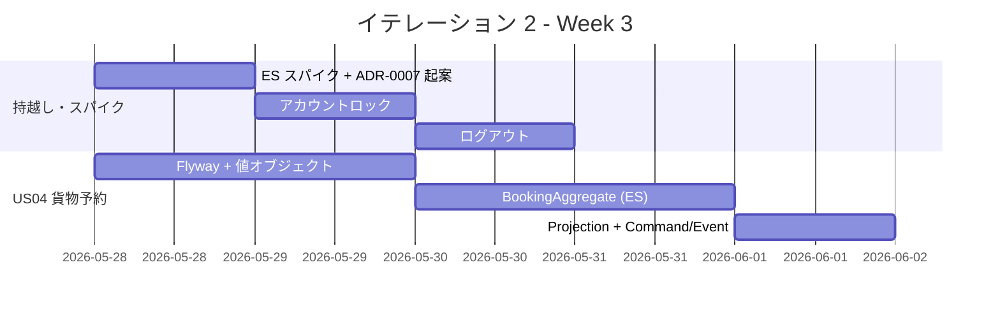
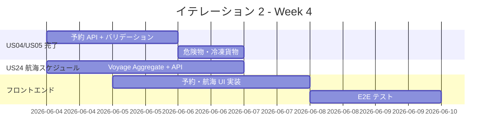
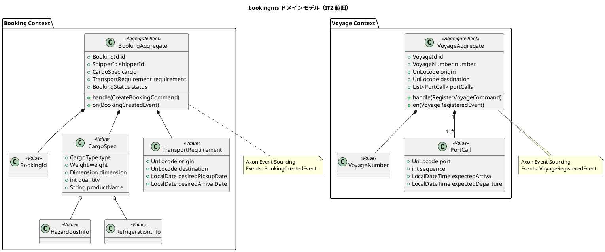
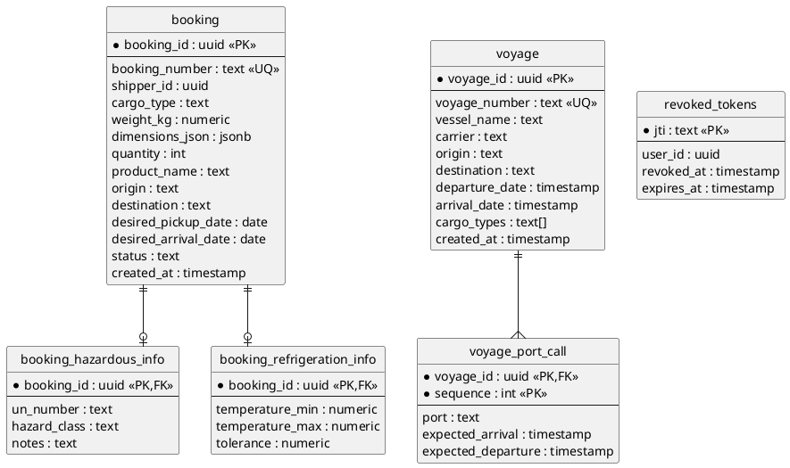
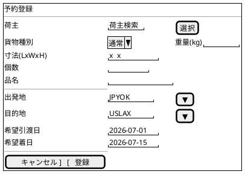
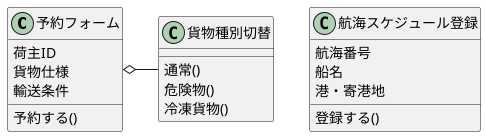
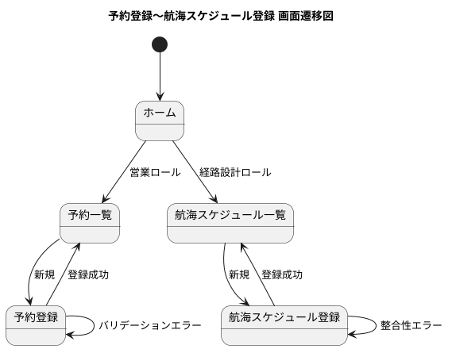

# イテレーション 2 計画

## 概要

| 項目 | 内容 |
|------|------|
| **イテレーション** | 2 / 8 |
| **期間** | Week 3-4（2026-05-28 〜 2026-06-10） |
| **ゴール** | bookingms に貨物予約 Aggregate（Axon Event Sourcing）を導入し、貨物予約・航海スケジュール登録の基盤を実装する。あわせて IT1 持越し（アカウントロック・ログアウト・E2E）を完了させる |
| **目標 SP** | 14（新規 11 SP + 持越し 3 SP）|
| **基準ベロシティ** | 13 SP（IT1 純実績ベース）/ 計画外バッファ 20% |

---

## ゴール

### イテレーション終了時の達成状態

1. **認証基盤の完成**: IT1 持越しのアカウントロック（5 回失敗で 30 分）とログアウト（トークン無効化）が機能し、JWT 認証の運用品質が満たされる
2. **貨物予約**: 営業担当者が荷主 ID・貨物仕様・輸送条件を入力して予約を登録でき、危険物・冷凍貨物の特別情報も扱える
3. **航海スケジュール**: 経路設計者が運送会社の航海スケジュールを新規登録し、後続イテレーションの検索対象とできる
4. **Axon Event Sourcing 本格導入**: `BookingAggregate` を Event Sourcing で実装し、IT1 で CRUD に切り替えた経験を踏まえた設計判断を ADR に記録する
5. **E2E テスト基盤**: フロントエンドの E2E テスト（Playwright）が 1 シナリオ動作し、IT3 以降の品質基盤となる

### 成功基準

- [ ] `POST /api/v1/auth/login` で 5 回連続失敗するとアカウントが 30 分ロックされる
- [ ] `POST /api/v1/auth/logout` でトークンが無効化される（以降の認証で 401 を返す）
- [ ] `POST /api/v1/bookings` で貨物予約を登録でき、予約番号と「仮受付」状態が発行される
- [ ] 貨物種別「危険物」「冷凍・冷蔵貨物」を選択すると追加情報の入力が必須となる
- [ ] `POST /api/v1/voyages` で航海スケジュールを新規登録できる（必須項目チェック・日付整合性チェック付き）
- [ ] `BookingAggregate` が Axon Event Sourcing で実装され、`BookingCreatedEvent` がイベントストアに永続化される
- [ ] Playwright で「ログイン → 荷主登録」シナリオの E2E テストが GREEN
- [ ] ADR-0007（Event Sourcing 導入方針）が作成される
- [ ] テストカバレッジが計測され、計画 SP 全ストーリーで 80% 以上を目標とする（未達でも計測は必須）
- [ ] Checkstyle / SpotBugs が CI で自動チェックされ、PR 単位でブロックされる
- [ ] 全 API のユニットテスト・統合テストがパスする

---

## ユーザーストーリー

### 対象ストーリー

| ID | ユーザーストーリー | SP | 優先度 | 区分 |
|----|-------------------|----|--------|------|
| US00-r1 | アカウントロックを有効化する（IT1 持越し） | 1 | 必須 | 持越し |
| US00-r2 | ログアウトを実装する（IT1 持越し） | 1 | 必須 | 持越し |
| US-UI-r | フロントエンド E2E テストを整備する（IT1 持越し） | 1 | 必須 | 持越し |
| US04 | 貨物予約を登録する | 5 | 必須 | 新規 |
| US05 | 危険物・冷凍貨物の予約を登録する | 3 | 必須 | 新規 |
| US24 | 航海スケジュールを新規登録する | 3 | 必須 | 新規 |
| **合計** | | **14** | | |

> **注**: 当初の release_plan.md では IT2 に US25（既存航海スケジュール更新, 3 SP）も含まれていたが、IT1 純ベロシティ 13 SP と持越し 3 SP を踏まえ、US25 は IT3 へ繰越す。詳細は `release_plan.md` の進捗管理セクションを参照。

### ストーリー詳細

#### US00-r1: アカウントロックを有効化する

**ストーリー**:

> システム管理者として、ID/パスワード認証で 5 回連続失敗したアカウントを 30 分間自動ロックしたい。なぜなら、ブルートフォース攻撃を抑止しシステムを安全に保てるからだ。

**受入条件**:

1. ログイン失敗が同一ユーザーで連続 5 回発生すると、6 回目以降は認証情報が正しくても 423 Locked（または 401 + lockout フラグ）を返す
2. ロックは 30 分後に自動解除される
3. ログイン成功時には失敗カウンタがリセットされる
4. ロック状態は `users` テーブルの `lock_until` カラムで管理される

#### US00-r2: ログアウトを実装する

**ストーリー**:

> システムユーザーとして、`POST /api/v1/auth/logout` でトークンを無効化し、確実にログアウトしたい。なぜなら、共用端末などでセッションを安全に終了する必要があるからだ。

**受入条件**:

1. `POST /api/v1/auth/logout` を呼び出すと、リクエストの JWT トークンが無効化される
2. 無効化されたトークンで保護リソースへアクセスすると 401 を返す
3. トークン無効化は失効ストア（Redis 代替として MyBatis + `revoked_tokens` テーブル）で管理する
4. 期限切れトークンはバッチで定期削除される（実装はスケジューラのみ、IT3 で運用開始）

#### US-UI-r: フロントエンド E2E テストを整備する

**ストーリー**:

> 開発者として、Playwright で「ログイン → 荷主一覧 → 荷主登録」の E2E シナリオを自動化したい。なぜなら、IT3 以降のフロントエンド改修時にリグレッションを即座に検出できるからだ。

**受入条件**:

1. `apps/frontend/e2e/` 配下に Playwright プロジェクトを構築する
2. シナリオ「ログイン成功 → 荷主登録ページに遷移 → 個人荷主を登録 → 一覧に表示される」を実装する
3. CI（GitHub Actions）で E2E テストが自動実行される
4. テスト用ユーザー・荷主は Testcontainers PostgreSQL のフィクスチャで投入する

#### US04: 貨物予約を登録する

**ストーリー**:

> 営業担当者として、荷主 ID・貨物仕様（種別・重量・寸法・個数・品名）・輸送条件（出発地・目的地・希望日）を入力して予約を登録したい。なぜなら、荷主の見積承認後に正式な予約を受け付け、経路設計フェーズに引き継げるからだ。

**受入条件**:

1. 荷主 ID を入力して既存荷主を選択できる
2. 貨物種別・重量・寸法・個数・品名を入力できる
3. 出発地・目的地（UN/LOCODE）・希望引渡日・希望着日を入力できる
4. 登録完了後、予約番号が発行され状態が「仮受付」になる
5. `BookingCreatedEvent` が Axon イベントストアに永続化される
6. Read Model（`booking` テーブル）に予約サマリーが反映される
7. 経路設計者向けの通知（IT3 で本格実装、IT2 ではドメインイベントの発行まで）

#### US05: 危険物・冷凍貨物の予約を登録する

**ストーリー**:

> 営業担当者として、危険物や冷凍・冷蔵貨物の場合に、特別な追加情報（危険物申告・温度管理条件）を含めて予約を登録したい。なぜなら、貨物種別に応じた法的要件と取扱い条件を正確に管理し、安全な輸送を保証できるからだ。

**受入条件**:

1. 貨物種別「危険物」を選択すると、危険物申告情報（UN 番号・クラス・取扱注意事項）の入力が必須になる
2. 貨物種別「冷凍・冷蔵貨物」を選択すると、温度管理条件（温度範囲・許容変動）の入力が必須になる
3. 特別情報は `BookingAggregate` の値オブジェクト（`HazardousInfo` / `RefrigerationInfo`）として保持される
4. Read Model にも特別情報のサブテーブルが反映される

#### US24: 航海スケジュールを新規登録する

**ストーリー**:

> 経路設計者として、運送会社が公開する航海スケジュール（航海番号・船名・出発港・到着港・出発日・到着日・寄港地・対応貨物種別）をシステムに登録したい。なぜなら、最新の運航情報を反映することで経路候補の算出精度が上がるからだ。

**受入条件**:

1. 航海番号・船名・運送会社・出発港（UN/LOCODE）・到着港（UN/LOCODE）・出発日・到着日・対応貨物種別を入力できる
2. 寄港地を複数かつ順序付きで入力できる
3. 必須項目が未入力の場合、未入力箇所を明示したエラーが返る
4. 出発日が到着日より後の場合、日付の整合性エラーが返る
5. 同一航海番号がシステムに存在しない場合、登録が完了し登録番号が発行される
6. 登録後、`voyage` テーブルに反映され、IT3 の US07（航海スケジュール検索）の対象となる

---

## タスク

### 0. IT1 持越し・スパイク（4 SP）

| # | タスク | 見積もり | 担当 | 状態 |
|---|--------|---------|------|------|
| 0.1 | Event Sourcing スパイク（`BookingAggregate` プロトタイプ・タイムボックス 4h） | 4h | - | [ ] |
| 0.2 | ADR-0007 起案（Event Sourcing 導入方針） | 2h | - | [ ] |
| 0.3 | US00-r1: `users.lock_until` カラム追加マイグレーション + `LoginAttemptTracker` 実装 | 4h | - | [ ] |
| 0.4 | US00-r1: アカウントロック統合テスト（5 回失敗 → 423 / 30 分後解除） | 2h | - | [ ] |
| 0.5 | US00-r2: `revoked_tokens` テーブル追加マイグレーション + `TokenRevocationService` 実装 | 3h | - | [ ] |
| 0.6 | US00-r2: `POST /auth/logout` コントローラー + Spring Security 検証フィルター連携 | 2h | - | [ ] |
| 0.7 | US00-r2: ログアウト統合テスト（無効化トークンで 401） | 2h | - | [ ] |

**小計**: 19h

### 1. bookingms 貨物予約 Aggregate（US04: 5 SP）

| # | タスク | 見積もり | 担当 | 状態 |
|---|--------|---------|------|------|
| 1.1 | `booking_event_store` / `booking_read_db.booking` テーブル Flyway マイグレーション作成 | 2h | - | [ ] |
| 1.2 | `BookingId` / `CargoSpec` / `TransportRequirement` 値オブジェクト実装 | 3h | - | [ ] |
| 1.3 | `BookingAggregate` 実装（`@Aggregate` + `@CommandHandler` + `@EventSourcingHandler`） | 4h | - | [ ] |
| 1.4 | `CreateBookingCommand` / `BookingCreatedEvent` 定義 + Saga スケルトン（IT3 用） | 2h | - | [ ] |
| 1.5 | `BookingProjection`（`@EventHandler` → `booking` テーブル更新） | 3h | - | [ ] |
| 1.6 | `POST /api/v1/bookings` コントローラー + 入力 DTO + バリデーション | 3h | - | [ ] |
| 1.7 | 荷主 ID 存在チェック（`ShipperReadService` を bookingms に注入 or Query 経由） | 2h | - | [ ] |
| 1.8 | 予約番号採番ロジック（年 + 連番、`BookingNumber` 値オブジェクト） | 2h | - | [ ] |
| 1.9 | `BookingAggregate` Axon `AggregateTestFixture` ユニットテスト | 3h | - | [ ] |
| 1.10 | `POST /api/v1/bookings` 統合テスト（Testcontainers + Axon Server） | 3h | - | [ ] |

**小計**: 27h

### 2. bookingms 危険物・冷凍貨物（US05: 3 SP）

| # | タスク | 見積もり | 担当 | 状態 |
|---|--------|---------|------|------|
| 2.1 | `HazardousInfo`（UN 番号・クラス・注意事項）値オブジェクト実装 | 2h | - | [ ] |
| 2.2 | `RefrigerationInfo`（温度範囲・許容変動）値オブジェクト実装 | 2h | - | [ ] |
| 2.3 | `BookingAggregate` の貨物種別分岐ロジック + 特別情報必須バリデーション | 2h | - | [ ] |
| 2.4 | `booking_hazardous_info` / `booking_refrigeration_info` Read Model 拡張 + Projection 更新 | 3h | - | [ ] |
| 2.5 | 危険物・冷凍貨物のユニットテスト + 統合テスト | 3h | - | [ ] |

**小計**: 12h

### 3. bookingms 航海スケジュール（US24: 3 SP）

| # | タスク | 見積もり | 担当 | 状態 |
|---|--------|---------|------|------|
| 3.1 | `voyage` / `voyage_port_call` Flyway マイグレーション（`booking_read_db`） | 2h | - | [ ] |
| 3.2 | `Voyage` 集約 + `VoyageNumber` / `PortCall`（寄港地）値オブジェクト実装 | 4h | - | [ ] |
| 3.3 | `RegisterVoyageCommand` / `VoyageRegisteredEvent` + `VoyageAggregate` | 3h | - | [ ] |
| 3.4 | `VoyageProjection`（Read Model 反映） | 2h | - | [ ] |
| 3.5 | `POST /api/v1/voyages` コントローラー + DTO + 日付整合性バリデーション | 3h | - | [ ] |
| 3.6 | 同一航海番号の重複チェック（Aggregate ロード or 一意制約エラーハンドリング） | 1h | - | [ ] |
| 3.7 | 航海スケジュール登録のユニットテスト + 統合テスト | 3h | - | [ ] |

**小計**: 18h

### 4. フロントエンド UI 実装（US04/US05/US24: UI 拡張、SP は親ストーリーに含む）

| # | タスク | 対象ファイル | 見積もり | 状態 |
|---|--------|------------|---------|------|
| 4.1 | 予約登録フィーチャー（`bookingApi.ts` / `useRegisterBooking.ts` / `BookingForm.tsx`） | `features/booking/` | 4h | [ ] |
| 4.2 | 貨物種別による条件分岐 UI（危険物 / 冷凍 / 通常の入力フィールド切替） | `features/booking/CargoTypeFields.tsx` | 3h | [ ] |
| 4.3 | 予約一覧画面（`BookingList.tsx` / `BookingListPage.tsx`） | `features/booking/`・`pages/` | 3h | [ ] |
| 4.4 | 航海スケジュール登録フィーチャー（`voyageApi.ts` / `VoyageForm.tsx`） | `features/voyage/` | 3h | [ ] |
| 4.5 | ロール別メニュー拡張（営業＝予約、経路設計者＝航海スケジュール） | `components/layout/Sidebar.tsx` | 1h | [ ] |
| 4.6 | フロントエンドユニットテスト（Vitest） | `features/booking/__tests__/` 等 | 3h | [ ] |

**小計**: 17h

### 5. US-UI-r: フロントエンド E2E テスト（1 SP）

| # | タスク | 対象ファイル | 見積もり | 状態 |
|---|--------|------------|---------|------|
| 5.1 | Playwright インストール + プロジェクト初期化（`apps/frontend/e2e/`） | `apps/frontend/e2e/` | 2h | [ ] |
| 5.2 | テスト用ユーザー・荷主のフィクスチャ作成（Testcontainers + Flyway） | `e2e/fixtures/` | 2h | [ ] |
| 5.3 | 「ログイン → 荷主登録 → 一覧確認」シナリオ実装 | `e2e/login-shipper.spec.ts` | 3h | [ ] |
| 5.4 | GitHub Actions ワークフロー追加（PR 時に E2E 実行） | `.github/workflows/e2e.yml` | 2h | [ ] |

**小計**: 9h

### 6. 品質基盤強化（DoD 段階導入、計画外バッファ枠内）

| # | タスク | 見積もり | 担当 | 状態 |
|---|--------|---------|------|------|
| 6.1 | Jacoco テストカバレッジ計測の CI 統合（バックエンド・フロントエンド） | 3h | - | [ ] |
| 6.2 | Checkstyle / SpotBugs を PR で自動ブロック化（既存セットアップを CI 必須チェックへ昇格） | 2h | - | [ ] |
| 6.3 | SonarQube スキャン安定化 + Quality Gate 結果の CI 表示 | 2h | - | [ ] |

**小計**: 7h（計画外バッファ枠で消化）

### タスク合計

| カテゴリ | SP | 理想時間 | 状態 |
|---------|-----|---------|------|
| IT1 持越し（ロック・ログアウト）+ ES スパイク | 2 | 19h | [ ] |
| US04 貨物予約 Aggregate | 5 | 27h | [ ] |
| US05 危険物・冷凍貨物 | 3 | 12h | [ ] |
| US24 航海スケジュール | 3 | 18h | [ ] |
| フロントエンド UI（US04/US05/US24） | - | 17h | [ ] |
| US-UI-r E2E テスト | 1 | 9h | [ ] |
| 品質基盤強化（DoD 段階導入） | - | 7h（バッファ） | [ ] |
| **合計** | **14** | **109h** | |

**1 SP あたり**: 約 7.8h（持越しと UI/E2E/品質を含めた実工数ベース。IT1 の 5.5h 想定に対し +40%、計画外タスク 9 件を吸収するための上方修正）

> **持続可能なペース**: 14 SP × 7.8h = 109h は 2 週間の純稼働 80h（週 20h × 4 週？ではなく 20h × 2 週間 = 40h）を大きく超える。これはふりかえり P5「持続可能なペースの見直し」への対応として、AI エージェント協働を前提に **理想時間 vs 稼働時間** の乖離を明示するもの。実稼働は 40h 想定で AI エージェント補完前提。

**進捗率**: 0% (0/14 SP)

---

## スケジュール

### Week 3（Day 1-5: 2026-05-28〜06-03）



| 日 | タスク |
|----|--------|
| Day 1（05-28） | Event Sourcing スパイク（タスク 0.1）+ ADR-0007 起案（0.2）+ booking_event_store マイグレーション（1.1） |
| Day 2（05-29） | アカウントロック実装（0.3, 0.4）/ 値オブジェクト（1.2） |
| Day 3（05-30） | ログアウト実装（0.5〜0.7）/ `BookingAggregate` 実装着手（1.3） |
| Day 4（06-02） | `BookingAggregate` + Command/Event（1.3, 1.4） |
| Day 5（06-03） | `BookingProjection`（1.5）/ Jacoco CI 統合（6.1） |

### Week 4（Day 6-10: 2026-06-04〜06-10）



| 日 | タスク |
|----|--------|
| Day 6（06-04） | `POST /api/v1/bookings` 実装（1.6〜1.8）/ Voyage Flyway + Aggregate（3.1, 3.2） |
| Day 7（06-05） | US04 テスト（1.9, 1.10）/ Voyage Command/Event/Projection（3.3, 3.4）/ フロントエンド予約 UI（4.1, 4.2） |
| Day 8（06-08） | US05 危険物・冷凍貨物（2.1〜2.5）/ `POST /api/v1/voyages` 実装（3.5, 3.6）/ Voyage UI（4.4） |
| Day 9（06-09） | Voyage テスト（3.7）/ フロントエンド予約一覧・ナビ拡張（4.3, 4.5）/ Playwright E2E（5.1〜5.3） |
| Day 10（06-10） | E2E CI 統合（5.4）/ Checkstyle・SpotBugs CI ブロック化（6.2）/ SonarQube 安定化（6.3）/ 統合テスト・デモ準備 |

> **依存関係注記**:
>
> - Day 1 の Event Sourcing スパイク結果が `BookingAggregate` 設計（Day 3 以降）に影響する
> - 認証強化（ロック・ログアウト）は Week 3 前半に完了させ、E2E テスト（Week 4 後半）の前提条件とする
> - US04 完了 → US05 着手の順（US05 は US04 の `BookingAggregate` を拡張するため）

> **スケジュールバッファ**: Day 10 の後半 3h をバグ修正・デモ準備に確保。超過時はタスク 6.3（SonarQube 安定化）→ IT3 持越し候補。

---

## 設計

### ドメインモデル（IT2 範囲）



### データモデル（IT2 範囲）



### ユーザーインターフェース

#### ビュー（予約登録画面）



#### モデル



#### インタラクション



### ディレクトリ構成

```
apps/backend/
├── authms/
│   └── src/main/java/.../auth/
│       ├── LoginAttemptTracker.java          # NEW: アカウントロック
│       ├── TokenRevocationService.java       # NEW: トークン無効化
│       └── controller/LogoutController.java  # NEW
├── bookingms/
│   └── src/main/java/.../booking/
│       ├── domain/
│       │   ├── BookingAggregate.java         # NEW
│       │   ├── BookingId.java                # NEW
│       │   ├── CargoSpec.java                # NEW
│       │   ├── HazardousInfo.java            # NEW
│       │   ├── RefrigerationInfo.java        # NEW
│       │   ├── TransportRequirement.java     # NEW
│       │   └── voyage/
│       │       ├── VoyageAggregate.java      # NEW
│       │       ├── VoyageNumber.java         # NEW
│       │       └── PortCall.java             # NEW
│       ├── application/
│       │   ├── command/
│       │   │   ├── CreateBookingCommand.java # NEW
│       │   │   └── RegisterVoyageCommand.java# NEW
│       │   └── event/
│       │       ├── BookingCreatedEvent.java  # NEW
│       │       └── VoyageRegisteredEvent.java# NEW
│       ├── infrastructure/
│       │   ├── persistence/BookingProjection.java # NEW
│       │   └── persistence/VoyageProjection.java  # NEW
│       └── interfaces/rest/
│           ├── BookingController.java        # NEW
│           └── VoyageController.java         # NEW
└── shared/ (変更なし、Location/UnLocode 利用)

apps/frontend/
├── src/features/
│   ├── booking/                              # NEW
│   └── voyage/                               # NEW
└── e2e/                                       # NEW（Playwright プロジェクト）
```

### API 設計

| メソッド | エンドポイント | 概要 |
|---------|---------------|------|
| POST | `/api/v1/auth/logout` | JWT トークン無効化 |
| POST | `/api/v1/bookings` | 貨物予約登録（通常・危険物・冷凍） |
| GET  | `/api/v1/bookings` | 予約一覧（営業ロール向け、IT2 では一覧のみ、詳細は IT3） |
| POST | `/api/v1/voyages` | 航海スケジュール新規登録 |
| GET  | `/api/v1/voyages` | 航海スケジュール一覧（経路設計ロール向け） |

### ADR

| ADR | タイトル | ステータス |
|-----|---------|-----------|
| ADR-0007（新規） | bookingms における Axon Event Sourcing 導入方針 | 提案 → IT2 Day 1 で起案 |

---

## リスクと対策

| リスク | 影響度 | 対策 |
|--------|--------|------|
| Event Sourcing 導入の工数超過（IT1 と同様 CRUD に切替えるリスク） | 高 | Day 1 にタイムボックス 4h のスパイクを実施。スパイクで成立しない場合は ADR-0007 で CRUD 継続を判断し、Event Sourcing 学習は IT3 以降に延期 |
| 持越し（ロック・ログアウト・E2E）が新規ストーリーを圧迫 | 中 | 持越しは Week 3 前半に完了させる。完了しなければ E2E（US-UI-r）を IT3 へ再持越し |
| 計画外タスクの再発（IT1 で 9 件発生） | 中 | DoD 段階導入（タスク 6.1〜6.3）を計画外バッファ枠で消化。新たな計画外タスクが発生したら都度 SP 換算し、優先順位を判断 |
| US24 と US04 の Aggregate 並列実装による設計衝突 | 中 | 共通する `UnLocode` は shared モジュールを利用。`booking_read_db` 内のスキーマは Aggregate ごとに分離 |
| カバレッジ 80% 未達 | 中 | IT2 では「計測必須」までを最低基準とし、80% は努力目標。未達領域はふりかえりで明示する |

---

## 完了条件

### Definition of Done

- [ ] コードレビュー完了（PR 単位）
- [ ] バックエンド単体・統合テストがパス（カバレッジ計測実施）
- [ ] フロントエンド Vitest がパス
- [ ] Playwright E2E（1 シナリオ）がパス
- [ ] Checkstyle / SpotBugs エラーなし（CI ブロック化済み）
- [ ] SonarQube Quality Gate 通過
- [ ] Swagger UI で新規 API（auth/logout, bookings, voyages）が動作確認できる
- [ ] `local-docker` プロファイルで全マイクロサービスが起動し、API が応答する
- [ ] ADR-0007 が作成され `docs/adr/index.md` と `mkdocs.yml` に反映される
- [ ] `iteration_plan-2.md` / `release_plan.md` / `index.md` が最新の進捗を反映

### デモ項目

1. 5 回ログイン失敗 → アカウントロック → 30 分後解除
2. ログイン → `POST /api/v1/auth/logout` → 同トークンで保護リソース 401
3. 通常貨物の予約登録（営業ロール、Swagger UI または UI）
4. 危険物・冷凍貨物の予約登録（追加情報の必須化）
5. 航海スケジュール新規登録（経路設計者ロール、寄港地複数）
6. Playwright E2E「ログイン → 荷主登録 → 一覧確認」シナリオの実行

---

## ベロシティ算定根拠（IT1 実績反映）

| 項目 | 計算 | 値 |
|------|------|-----|
| IT1 純ベロシティ | US00 3 + US00a 3 + US02 3 + US03 3 + US-UI 1（厳格判定） | 13 SP |
| 計画外バッファ 20% | 13 × 0.2 | 3 SP |
| ストーリー消化目標 | 13 − 3 | 10〜11 SP |
| 持越し（強制） | US00-r1 + US00-r2 + US-UI-r | +3 SP |
| **IT2 計画 SP** | ストーリー 11 + 持越し 3 | **14 SP** |

> **release_plan.md からの変更**: US25（既存航海スケジュール更新, 3 SP）を IT2 → IT3 へ移動。IT3 は 13 → 16 SP となるが、IT3 終了時のベロシティ実績で再評価する。

---

## 更新履歴

| 日付 | 更新内容 | 更新者 |
|------|---------|--------|
| 2026-05-13 | 初版作成（IT1 ベロシティ反映、US25 を IT3 へ繰越し） | AI Agent（XP PM） |

---

## 関連ドキュメント

- [リリース計画](./release_plan.md)
- [イテレーション 1 計画](./iteration_plan-1.md)
- [イテレーション 1 ふりかえり](./retrospective-1.md)
- [イテレーション 1 完了報告書](./iteration_report-1.md)
- [イテレーション 2 ふりかえり](./retrospective-2.md)（IT2 終了時に作成）
