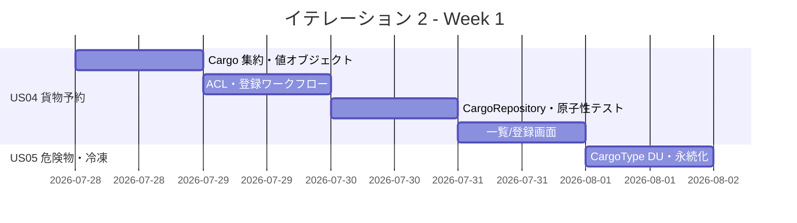
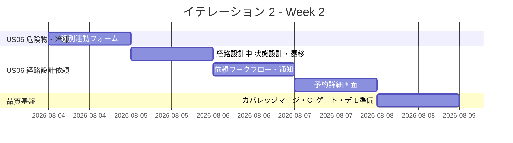
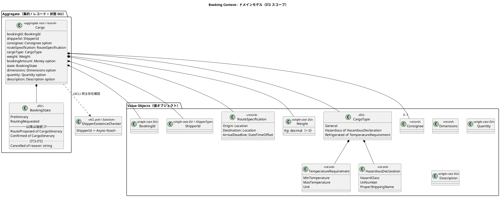
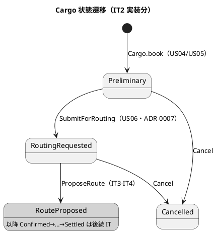
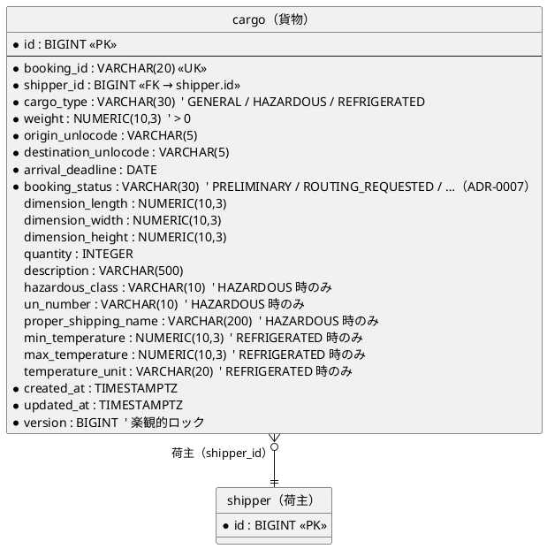
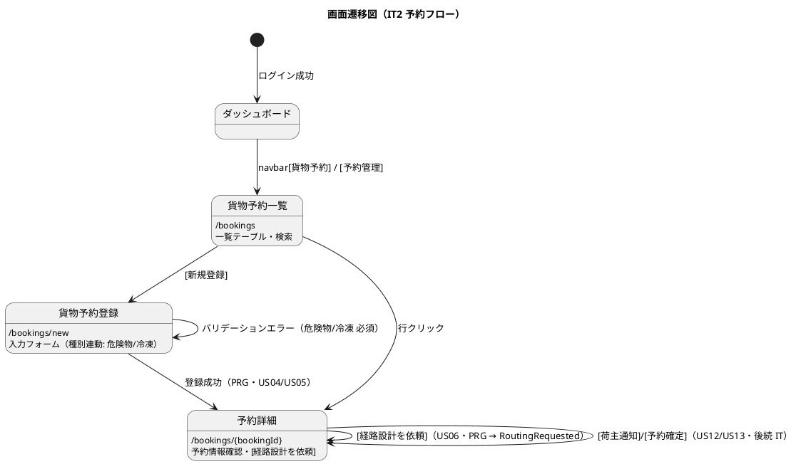

# イテレーション 2 計画

## 概要

| 項目 | 内容 |
|------|------|
| **イテレーション** | 2 |
| **期間** | 2026-07-28 〜 2026-08-08（2 週間） |
| **ゴール** | 貨物予約（危険物・冷凍対応）を登録し、見積整合性を確認したうえで経路設計者へ引き渡せる |
| **目標 SP** | 10（US04/US05/US06） |

---

## ゴール

### イテレーション終了時の達成状態

1. **貨物予約（US04）**: 営業担当者が荷主 ID・貨物仕様（種別・重量・寸法・個数・品名）・輸送条件（出発地・目的地・希望日）を入力して予約を登録でき、予約番号発行・状態「仮受付（Preliminary）」で保存される。
2. **危険物・冷凍対応（US05）**: 貨物種別「危険物」「冷凍・冷蔵」を選択すると、危険物申告／温度管理条件の入力が必須となり、`CargoType` DU ケースにデータが埋め込まれる。
3. **経路設計者への引き渡し（US06）**: 仮受付予約の内容を確認し、経路設計依頼を実行すると予約状態が「経路設計中」に更新され、経路設計者へ通知（post-commit イベント）が送信される。
4. **品質基盤（IT1 Try 対応）**: coverlet + ReportGenerator による層横断カバレッジのマージと、ドメイン 85%／全体 80% の CI ゲートを確立する。

### 成功基準

- [ ] 「ログイン → 荷主選択 → 貨物予約登録 → 経路設計依頼」が WebApplicationFactory 受入テストで一気通貫
- [ ] 危険物・冷凍の必須バリデーション（未入力時 400）を受入テストで実証
- [ ] `Cargo.book` および `SubmitForRouting`（経路設計依頼）の状態遷移がユニット + FsCheck で網羅
- [ ] 予約登録の複数書き込み（cargo + 付随情報）が単一トランザクションで原子的に永続化される（IT1 Try#2）
- [ ] ShipperExistenceChecker ACL 経由で存在しない荷主 ID 指定時にエラーになる
- [ ] 層横断カバレッジのマージ済みレポートが生成され、ドメイン 85%／全体 80% の CI ゲートが動作（IT1 Try#1）
- [ ] ArchUnitNET レイヤールール（Domain → Infrastructure 非依存）が緑

> **アプローチ（開発戦略 序盤＝アウトサイドイン IT1-IT2）**: [開発戦略](./development_strategy.md#序盤-アウトサイドインit1-it2)に従い、各ストーリーは `HttpHandler`／WebApplicationFactory の受け入れテストを Red にする所から着手し、UI ニーズから Command／Port を導出して薄く縦に貫通させる。IT1 で確立した荷主の Web スライスパターン（HttpHandler + フォーム + ワークフロー結線 + 受け入れテスト）を横展開する（IT1 Try#4）。

---

## ユーザーストーリー

### 対象ストーリー

| ID | ユーザーストーリー | SP | 優先度 |
|----|-------------------|----|----|
| US04 | 貨物予約を登録する | 5 | 必須 |
| US05 | 危険物・冷凍貨物の予約を登録する | 3 | 必須 |
| US06 | 予約情報を経路設計者に引き渡す | 2 | 必須 |
| **合計** | | **10** | |

### ストーリー詳細

#### US04: 貨物予約を登録する

**ストーリー**:
> 営業担当者として、荷主 ID・貨物仕様（種別・重量・寸法・個数・品名）・輸送条件（出発地・目的地・希望日）を入力して予約を登録したい。なぜなら、荷主の見積承認後に正式な予約を受け付け、経路設計フェーズに引き継げるからだ。

**受入条件**:

1. 荷主 ID を入力して既存荷主を選択できる（ShipperExistenceChecker ACL で存在確認）
2. 貨物種別・重量・寸法・個数・品名を入力できる
3. 出発地・目的地・希望引渡日・希望着日を入力できる
4. 登録完了後、予約番号が発行され状態が「仮受付（Preliminary）」になる
5. 経路設計者に予約登録の通知が送信される（post-commit イベント `CargoBooked`）
6. 見積情報との整合性が確認される（見積番号を任意で紐付け、出発地・目的地・貨物種別の一致を検証）

#### US05: 危険物・冷凍貨物の予約を登録する

**ストーリー**:
> 営業担当者として、危険物や冷凍・冷蔵貨物の場合に、特別な追加情報（危険物申告・温度管理条件）を含めて予約を登録したい。なぜなら、貨物種別に応じた法的要件と取扱い条件を正確に管理し、安全な輸送を保証できるからだ。

**受入条件**:

1. 貨物種別「危険物」を選択すると、危険物申告情報（危険物クラス・UN 番号・正式輸送品名）の入力フィールドが表示され必須となる
2. 貨物種別「冷凍・冷蔵貨物」を選択すると、温度管理条件（最低温度・最高温度・温度単位）の入力フィールドが表示され必須となる
3. 特別情報が登録された予約は、経路設計時に対応可能な航海・ルートのみが候補として表示される（候補絞込みの実処理は IT3、本 IT では `CargoType` へのデータ保持と永続化までを対象）

#### US06: 予約情報を経路設計者に引き渡す

**ストーリー**:
> 営業担当者として、仮受付された予約の出発地・目的地・期限・貨物仕様を確認し、経路設計者に引き渡したい。なぜなら、経路設計者が正確な情報をもとに最適な経路設計を開始できるからだ。

**受入条件**:

1. 予約番号を指定して予約情報（出発地・目的地・期限・貨物仕様）を確認できる（`/bookings/{bookingId}`）
2. 経路設計依頼を実行すると、予約状態が「経路設計中」に更新される
3. 経路設計者に経路設計依頼の通知が送信される（post-commit イベント）
4. 予約情報に不備がある場合、修正してから引き渡せる

### タスク

#### 1. US04: 貨物予約登録（5 SP）

| # | タスク | 見積もり | 担当 | 状態 |
|---|--------|---------|------|------|
| 1.1 | Booking `Cargo` 集約・`BookingState` DU（Preliminary）・`Cargo.book` ファクトリ（domain-model L489 の 6 引数 `Result` 版に統一・レビュー #20）のユニット + FsCheck（出発地≠目的地・Weight 値オブジェクト >0・BookingId 生成は IdGenerator 経由） | 4h | - | [x] |
| 1.2 | 値オブジェクト（RouteSpecification・Dimensions・Quantity・Description・Consignee）のスマートコンストラクタ + プロパティテスト | 3h | - | [x] |
| 1.3 | ShipperExistenceChecker ACL ポート（関数レコード `ShipperId -> Async<bool>`）とスタブ／Shipper リポジトリ実装配線 | 2h | - | [x] |
| 1.4 | 予約登録ワークフロー（`asyncResult` 合成・荷主存在確認・見積整合性チェック・原子的永続化） | 3h | - | [~] |
| 1.5 | CargoRepository（Donald 手書き SQL・cargo テーブル・単一トランザクション書き込み）統合テスト（IT1 Try#2 の原子性テスト含む） | 4h | - | [x] |
| 1.6 | 貨物予約一覧／登録画面（`/bookings`, `/bookings/new`・荷主選択・PRG）+ HttpHandler。IT1 ウォーキングスケルトンのプレースホルダを実画面へ差し替え | 4h | - | [x] |
| 1.7 | ナビゲーション整合性: navbar「貨物予約」（ROLE_SALES・ROLE_SHIPPER）を実 `/bookings` へ結線・アクティブ表示、ダッシュボードの [予約管理] 導線を有効化し、ロール別ナビ表示の検証テスト（WebApplicationFactory）を追加 | 2h | - | [x] |

**小計**: 22h（理想時間）

> **注（ナビゲーション整合性・絶対項目）**: 開発戦略のウォーキングスケルトン基盤化により navbar「貨物予約」と `/bookings` プレースホルダは IT1 で作成済み。IT2 では実画面化に伴い、個別画面（`/bookings`・`/bookings/new`・`/bookings/{bookingId}`）と ui_design のナビゲーション構成表（navbar・ダッシュボード [予約管理]）の両方の整合を確認する（ui_design→navbar→dashboard→検証テストの 4 点一致）。

> **注（IT1 Try#2 対応）**: 予約登録は cargo（および将来の付随テーブル）への複数書き込みを含むため、着手時に UnitOfWork によるトランザクション境界を明記し、原子性テスト（途中失敗時のロールバック）を DoD に含める。

#### 2. US05: 危険物・冷凍貨物（3 SP）

| # | タスク | 見積もり | 担当 | 状態 |
|---|--------|---------|------|------|
| 2.1 | `CargoType` DU（General / Hazardous of HazardousDeclaration / Refrigerated of TemperatureRequirement）と埋め込みデータのスマートコンストラクタ + FsCheck | 3h | - | [x] |
| 2.2 | 危険物申告・温度管理条件の永続化（cargo テーブル `hazardous_class`・`un_number`・`min/max_temperature` 等のマッピング） | 2h | - | [x] |
| 2.3 | 登録画面の種別連動フォーム（危険物／冷凍で必須フィールドを htmx で表示・サーバ側必須バリデーション）+ 受入テスト（未入力時 400） | 3h | - | [x] |

**小計**: 8h（理想時間）

#### 3. US06: 経路設計者への引き渡し（2 SP）

| # | タスク | 見積もり | 担当 | 状態 |
|---|--------|---------|------|------|
| 3.1 | 「経路設計中」状態の設計判断（下記 ADR-0007 論点）を確定し、`SubmitForRouting` コマンド／状態遷移をユニットテスト化 | 3h | - | [x] |
| 3.2 | 経路設計依頼ワークフロー（状態更新 + post-commit イベント `RoutingRequested`）と経路設計者向け通知ポート（関数レコード・スタブ） | 2h | - | [~] |
| 3.3 | 予約詳細画面（`/bookings/{bookingId}`・情報確認・[経路設計を依頼] ボタン・PRG）+ 受入テスト（依頼後の状態遷移確認） | 3h | - | [ ] |

**小計**: 8h（理想時間）

#### 4. 品質基盤（IT1 Try#1 対応・ストーリー外）

| # | タスク | 見積もり | 担当 | 状態 |
|---|--------|---------|------|------|
| 4.1 | coverlet でユニット + 統合テストのカバレッジを収集し ReportGenerator でマージ | 2h | - | [ ] |
| 4.2 | ドメイン層 85%／全体 80% の CI ゲート化（Backend CI に組込） | 2h | - | [ ] |

**小計**: 4h（理想時間）

#### タスク合計

| カテゴリ | SP | 理想時間 | 状態 |
|---------|----|----|------|
| US04 貨物予約登録 | 5 | 22h | [x] 一覧・登録フォーム縦貫通完了 |
| US05 危険物・冷凍 | 3 | 8h | [x] 種別連動フォーム・必須検証完了 |
| US06 経路設計依頼 | 2 | 8h | [~] 状態遷移/ワークフロー完了・画面残 |
| 品質基盤（IT1 Try） | - | 4h | [ ] |
| **合計** | **10** | **42h** | |

**1 SP あたり**: 約 3.8h（ストーリー分 38h / 10 SP。品質基盤 4h を含めた総見積 42h）
**進捗率**: 進行中（ドメイン層・アプリケーション層のテスト 24 件緑。残: Infrastructure〔CargoRepository/Donald〕・Web〔画面/HttpHandler/ナビ〕・post-commit イベント結線・カバレッジ CI ゲート）

---

## スケジュール

### Week 1（Day 1-5）: 貨物予約の縦貫通 + 危険物・冷凍

| 日 | タスク |
|----|--------|
| Day 1 | Cargo 集約・BookingState DU・値オブジェクト（FsCheck） |
| Day 2 | ShipperExistenceChecker ACL・予約登録ワークフロー（見積整合性） |
| Day 3 | CargoRepository 統合テスト・原子性テスト（IT1 Try#2） |
| Day 4 | 貨物予約一覧／登録画面・受入テスト |
| Day 5 | CargoType DU（危険物・冷凍）・永続化マッピング |

### Week 2（Day 6-10）: 危険物フォーム + 経路設計引き渡し + 品質ゲート

| 日 | タスク |
|----|--------|
| Day 6 | 種別連動フォーム（htmx）・必須バリデーション受入テスト |
| Day 7 | 「経路設計中」状態の設計判断（ADR-0007）・SubmitForRouting 遷移テスト |
| Day 8 | 経路設計依頼ワークフロー・post-commit 通知ポート |
| Day 9 | 予約詳細画面・経路設計依頼の受入テスト |
| Day 10 | カバレッジマージ・CI ゲート化・統合テスト・デモ準備 |

---

## 設計

参照する設計ドキュメント:

- [ドメインモデル設計](../design/domain-model.md)（Booking Context: Cargo 集約・BookingState DU・CargoType・ShipperExistenceChecker ACL）
- [データモデル設計](../design/data-model.md)（cargo / leg テーブル・危険物/温度カラム・booking_status）
- [UI 設計](../design/ui_design.md)（貨物予約一覧 `/bookings`・登録 `/bookings/new`・詳細 `/bookings/{bookingId}`）
- [バックエンドアーキテクチャ](../design/architecture_backend.md)（ヘキサゴナル + ROP・Booking Context の ACL）

### ドメインモデル（IT2 スコープ: Booking Context）

IT2 で実装する範囲に絞った Cargo 集約。`BookingState` は本 IT で到達する状態（`Preliminary`・`RoutingRequested`・`Cancelled`）を実線、後続 IT の状態を破線コメントで示す。`RoutingRequested` は ADR-0007 で追加するケース。`Weight` は US04 要件対応で追加する値オブジェクト（domain-model へ反映）。

#### 状態遷移（IT2 スコープ）

### データモデル（IT2 スコープ: cargo テーブル）

IT2 で使用する `cargo` テーブルのカラム。危険物・温度カラムは種別依存（他ケースでは NULL）。`leg`・`consignee_*`・`booking_amount_*`・`routing_status` 等は後続 IT で使用するため本図では省略。

### 画面遷移（IT2 スコープ: 予約フロー）

`/bookings` 系の実画面化に対応する遷移。US12/US13（荷主通知・予約確定）は後続 IT のため破線。経路の割り当て・確定は経路設計者フロー（`/routing/requests/{bookingId}`・IT3-IT4）に一本化。

### 主要な設計判断

#### 「経路設計中」状態の表現（要決着・ADR-0007 起票候補）

US06 の受入条件「経路設計依頼を実行すると予約状態が『経路設計中』に更新される」に対し、現行 `BookingState` DU は `Preliminary → RouteProposed（経路提案済み）` の遷移で「経路設計中（依頼済み・提案前）」ケースを持たない。data-model には将来追加予定の `routing_status` カラムがある。以下の 2 案から IT2 で決着し ADR-0007 として起票する。

| 案 | 内容 | トレードオフ |
|----|------|-------------|
| A（推奨） | `BookingState` DU に `RoutingRequested`（経路設計依頼済み）ケースを追加し、`Preliminary → RoutingRequested → RouteProposed` とする。`booking_status` カラムの文字列表現に `ROUTING_REQUESTED` を追加 | 状態遷移を型で一貫表現。DU 拡張は網羅パターンマッチの再検証が必要（`Cargo.execute` の全 match 見直し・ArchUnit/fullTest 必須） |
| B | `booking_status` は Preliminary のまま別の補助フラグ／カラムで「経路設計中」を表現 | DU 変更不要だが「状態と付随データの整合を型で保証する」F# 版の設計原則（domain-model L318）に反し、不正状態の余地を残す |

> **注（data-model との整合・要注意）**: data-model の `routing_status` カラム（将来追加予定・値は `ROUTED` / `MISROUTED` / `NOT_ROUTED`・追加時期は Routing Context 実装＝IT4+）は**経路決定の結果**を表す別概念であり、「経路設計依頼済み（提案前）」の表現には流用しない。設計レビュー 2026-07-06 の中指摘 #262（「routing_status と BookingState の二重管理」）を踏まえ、経路設計依頼状態は `booking_status`（BookingState）で一元管理する案 A を推奨する。案 A では初期スキーマの `booking_status` CHECK 制約／マッピングに `ROUTING_REQUESTED` を追加する。
>
> **注（教訓の適用）**: 案 A 採用時は `BookingState` に依存する全パターンマッチ（`Cargo.execute`・`stateName`・`ofString`／`toString` 永続化マッピング）を洗い出し、DU ケース追加後に必ず `dotnet test`（フル。ユニット + 統合 + Arch）を実行して網羅性・構造的整合を検証する。段階導入が必要な場合は補助属性を `option` で先行追加する方針を検討する。

#### 集約フィールドと IT2 永続化カラムのギャップ（要決着）

domain-model の `Cargo` レコードは `Consignee`（荷受人・必須）・`BookingAmount: Money`（必須）を持つが、data-model の `consignee_*`・`booking_amount_*` カラムは**将来追加予定**（前者は荷受人管理実装時、後者は Billing Context 実装時＝IT4+）であり、IT2 の cargo テーブルには存在しない。また `weight` カラムはドメイン `Cargo` に対応フィールドが無い「ドメイン未対応カラム」（設計レビュー #34／#142）。US04 は受入基準で重量入力を要求する。IT2 で以下を決着させる。

| 項目 | 論点 | IT2 方針（案） |
|------|------|---------------|
| `weight`（重量） | US04 が入力必須。ドメイン `Cargo` に Weight フィールドが無い（レビュー #34） | `Cargo` に `Weight`（値オブジェクト・kg・>0）を追加し domain-model へ反映。cargo.weight にマッピング |
| `Consignee`（荷受人） | ドメインは必須だが consignee_* は将来カラム。US04 受入基準に荷受人入力の記載なし | 予約時は荷受人未確定を許容する設計（`Consignee option` 化）を検討し domain-model へ反映。または IT2 で consignee_* カラムを前倒し追加。ADR/注記で確定 |
| `BookingAmount`（予約金額） | ドメインは必須 `Money` だが booking_amount_* は Billing 実装時（IT4+） | 見積連携で金額を引き継ぐ場合のみ設定。Preliminary で金額未確定を許容する設計（`Money option` 化 or 0 初期化）を検討し domain-model へ反映 |

> **注**: 上記は `Cargo` 集約レコードの必須／オプション定義（domain-model L457-467）に影響するため、着手時に domain-model.md を正として調整方針を確定し、変更点を domain-model へ反映する。`Cargo.book` のシグネチャは domain-model L489 の 6 引数 `Result<Cargo * DomainEvent list, _>` 版を正とする（設計レビュー中指摘 #20「6 引数 Result vs 2 引数生タプルの不統一」の解消）。

### ADR

IT2 が前提とする ADR:

**既存（承認済み）** — IT2 で参照実装する:

| ADR | タイトル | ステータス |
|-----|---------|-----------|
| [ADR-0001](../adr/0001-モジュール構成は垂直スライスを採用.md) | モジュール構成は垂直スライス（コンテキストファースト）を採用 | 承認済み |
| [ADR-0002](../adr/0002-ドメインイベントはPayloadレコード方式とpost-commitディスパッチを採用.md) | ドメインイベントは Payload レコード方式 + post-commit ディスパッチを採用 | 承認済み |
| ADR-0004 | Donald による DDD 集約の永続化パターン（手書き SQL・楽観ロック） | 承認済み |
| ADR-0006 | 時刻・GUID の注入ポート（Clock / IdGenerator） | 承認済み |

**IT2 で新規起票する**:

| ADR | タイトル | ステータス |
|-----|---------|-----------|
| ADR-0007 | 「経路設計中」状態の表現（BookingState DU 拡張 vs 補助カラム） | 提案 |

---

## 過去レビュー対応（設計ドキュメントレビュー 2026-07-06）

[F# 版設計ドキュメントレビュー](../review/設計ドキュメント_review_20260706.md)（高 14 / 中 18 / 低 6）のうち、Booking Context（US04-06）に関連し IT2 で対応する指摘。

| 指摘 | 重要度 | 内容 | IT2 での対応 |
|------|--------|------|-------------|
| #17/#137 | 中 | `BookingStatus`（backend/data-model）と `BookingState`（domain-model）の用語不統一 | `BookingState` に統一。永続化は `booking_status` カラム ↔ `BookingState` の `toString`／`ofString` で対応（タスク 1.5・3.1） |
| #20/#140 | 中 | `Cargo.book` のシグネチャ矛盾（6 引数 `Result` vs 2 引数生タプル） | domain-model L489 の 6 引数 `Result<Cargo * DomainEvent list, _>` 版に統一（タスク 1.1） |
| #34/#142 | 低 | ドメインに無い DB カラム（`cargo.weight` 等） | US04 の重量要件に対応し `Cargo` へ `Weight` 値オブジェクトを追加、domain-model へ反映（上記「集約フィールドと IT2 永続化カラムのギャップ」参照） |
| #262 | 中 | `routing_status` と `BookingState` の二重管理懸念 | 経路設計依頼状態は `BookingState`（案 A）で一元管理。`routing_status`（経路決定結果・IT4+）とは概念分離（ADR-0007） |
| user-rep #258 | 中 | 見積（US01）→ 予約（US04）の引き継ぎが「将来」扱いで二重入力の懸念 | US04 受入条件 6・タスク 1.4 で見積整合性チェック（見積番号任意紐付け・出発地/目的地/種別一致）を実装 |

> **注（用語）**: CargoType の埋め込みデータ名は domain-model（`Hazardous of HazardousDeclaration` / `Refrigerated of TemperatureRequirement`）を正とする。data-model L799 の `HazardousSpec` / `TemperatureRange` 表記との差異は既存のドキュメント間不整合であり、IT2 実装時に domain-model 側の名称へ揃え、必要なら data-model を修正する。

---

## リスクと対策

| リスク | 影響度 | 対策 |
|--------|--------|------|
| `BookingState` DU 拡張（ADR-0007 案 A）が既存パターンマッチへ波及 | 高 | DU ケース追加後に必ずフルテスト（ユニット + 統合 + Arch）を実行し網羅性を検証。IT1 の post-commit 基盤を再利用 |
| 予約登録の複数書き込みでトランザクション漏れ（IT1 で発生した原子性欠陥の再発） | 高 | 着手時にトランザクション境界を明記し、原子性テスト（途中失敗ロールバック）を DoD 化（IT1 Try#2） |
| ShipperExistenceChecker ACL の同期／非同期境界（`Async<bool>`）とワークフローの結線 | 中 | 関数レコードのスタブで先に契約固定し、Shipper リポジトリ実装を後結線 |
| カバレッジ層横断マージの CI 設定不備 | 中 | ローカルで ReportGenerator マージを検証してから CI ゲート化。閾値未達時は警告先行→ゲート化 |

---

## 完了条件

### Definition of Done

- [ ] コードレビュー完了（self-review: xp-programmer / xp-tester）
- [ ] ユニット・統合・アーキテクチャテストがパス
- [ ] 「ログイン → 荷主選択 → 貨物予約登録 → 経路設計依頼」の受入テストがパス
- [ ] 危険物・冷凍の必須バリデーション受入テストがパス
- [ ] ナビゲーション整合性（navbar「貨物予約」・ダッシュボード [予約管理] の実画面結線＋ロール別ナビ表示の検証テスト）がパス
- [ ] 予約登録の原子性テスト（途中失敗ロールバック）がパス（IT1 Try#2）
- [ ] 層横断カバレッジのマージ・CI ゲート（ドメイン 85%／全体 80%）が動作（IT1 Try#1）
- [ ] Fantomas フォーマットクリーン・FSharpLint 警告なし・ビルド警告 0
- [ ] 機能がローカル環境で動作確認済み
- [ ] ドキュメント更新完了（release_plan 進捗・ADR-0007）

### デモ項目

1. 一般貨物の予約登録（荷主選択・見積整合性確認・仮受付）
2. 危険物・冷凍貨物の予約登録（種別連動フォーム・必須バリデーション）
3. 予約詳細の確認と経路設計者への引き渡し（状態「経路設計中」への遷移・通知）

---

## 更新履歴

| 日付 | 更新内容 | 更新者 |
|------|---------|--------|
| 2026-07-15 | 初版作成（US04/US05/US06・10 SP）。IT1 ふりかえり Try（カバレッジ CI ゲート・トランザクション方針・Web スライス横展開）を反映。ADR-0007（経路設計中状態）論点を明記 | - |

---

## 関連ドキュメント

- [リリース計画](./release_plan.md)
- [イテレーション 1 ふりかえり](./retrospective-1.md)
- [開発戦略](./development_strategy.md)
- [イテレーション 2 ふりかえり](./retrospective-2.md)（IT2 完了時に作成）
