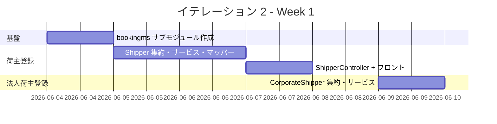
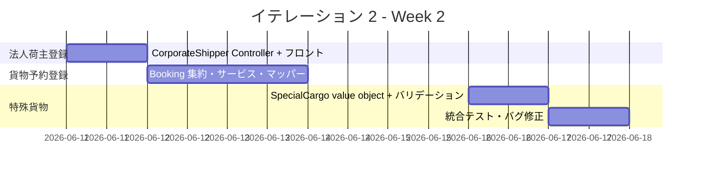
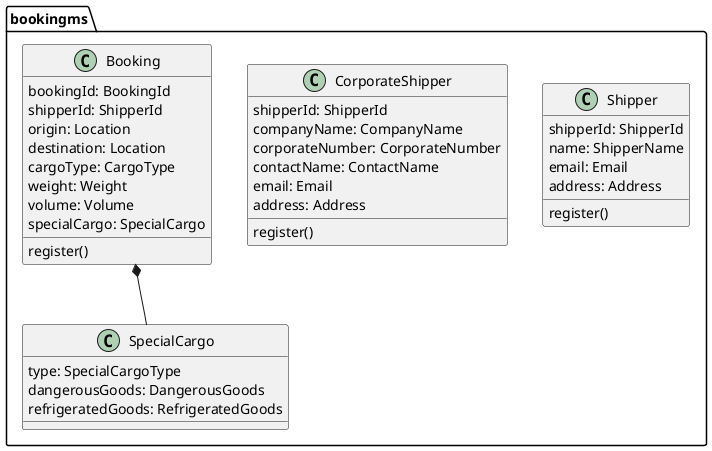
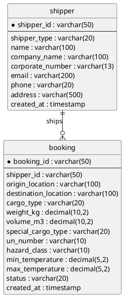
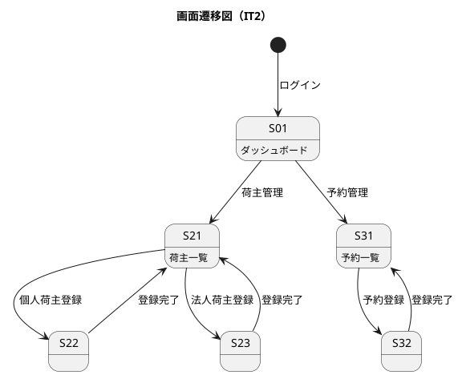

# イテレーション 2 計画

## 概要

| 項目 | 内容 |
|------|------|
| **イテレーション** | 2 |
| **期間** | 2026-06-04 〜 2026-06-17（2 週間） |
| **ゴール** | 荷主登録・法人荷主登録・貨物予約登録を実現し、予約ドメインの基盤を確立する |
| **目標 SP** | 10 |

---

## ゴール

### イテレーション終了時の達成状態

1. **荷主管理**: 個人荷主・法人荷主の登録・参照が動作する
2. **貨物予約**: 標準貨物・危険物・冷凍貨物の予約登録が動作する
3. **品質維持**: テストカバレッジ 80% 以上、SonarQube Quality Gate PASS

### 成功基準

- [ ] US02: 荷主（個人）を登録・参照できる
- [ ] US03: 法人荷主を登録・参照できる
- [ ] US04: 標準貨物の予約を登録できる
- [ ] US05: 危険物・冷凍貨物の予約を登録できる
- [ ] テストカバレッジ 80% 以上（新規コード）
- [ ] SonarQube Quality Gate PASS

---

## ユーザーストーリー

### 対象ストーリー

| ID | ユーザーストーリー | SP | 優先度 |
|----|-------------------|----|--------|
| US02 | 荷主を登録する | 2 | 必須 |
| US03 | 法人荷主を登録する | 2 | 必須 |
| US04 | 貨物予約を登録する | 3 | 必須 |
| US05 | 危険物・冷凍貨物の予約を登録する | 3 | 必須 |
| **合計** | | **10** | |

### ストーリー詳細

#### US02: 荷主を登録する

**ストーリー**:

> 営業担当者として、個人荷主の基本情報を登録したい。なぜなら、貨物予約時に荷主を特定する必要があるからだ。

**受入条件**:

1. 氏名・連絡先・住所を入力して登録できる
2. 同一メールアドレスが存在する場合はエラーを表示する
3. 登録後、荷主一覧で参照できる

#### US03: 法人荷主を登録する

**ストーリー**:

> 営業担当者として、法人荷主（会社）の情報を登録したい。なぜなら、法人は個人とは異なる割引・契約条件が適用されるからだ。

**受入条件**:

1. 会社名・法人番号・担当者名・連絡先・住所を入力して登録できる
2. 同一法人番号が存在する場合はエラーを表示する
3. 登録後、荷主一覧で法人として参照できる

#### US04: 貨物予約を登録する

**ストーリー**:

> 営業担当者として、標準貨物の輸送予約を登録したい。なぜなら、顧客から受注した貨物輸送を管理する必要があるからだ。

**受入条件**:

1. 荷主・出発地・目的地・貨物種別・重量・容積を入力して登録できる
2. 荷主が未登録の場合はエラーを表示する
3. 登録後、予約番号が発行され一覧で参照できる

#### US05: 危険物・冷凍貨物の予約を登録する

**ストーリー**:

> 営業担当者として、危険物や冷凍貨物の特殊輸送予約を登録したい。なぜなら、特殊貨物は追加の安全要件・温度管理要件が必要だからだ。

**受入条件**:

1. 危険物の場合は UN 番号・危険等級を入力できる
2. 冷凍貨物の場合は保管温度範囲を入力できる
3. 対応可能な航海スケジュール（accepted_cargo_type）と照合し、不適合の場合はエラーを表示する
4. 登録後、特殊貨物フラグ付きで予約一覧に表示される

---

## タスク

### 1. bookingms 基盤構築（1 SP）

| # | タスク | 見積もり | 担当 | 状態 |
|---|--------|---------|------|------|
| 1.1 | bookingms Gradle サブモジュール作成 | 4h | - | [ ] |
| 1.2 | Spring Boot + Axon 依存関係設定 | 2h | - | [ ] |
| 1.3 | Flyway マイグレーション（shipper / booking テーブル） | 2h | - | [ ] |

**小計**: 8h（理想時間）

### 2. US02: 荷主登録（2 SP）

| # | タスク | 見積もり | 担当 | 状態 |
|---|--------|---------|------|------|
| 2.1 | Shipper 集約（RegisterShipperCommand / ShipperRegisteredEvent） | 3h | - | [ ] |
| 2.2 | ShipperCommandService + ShipperQueryService | 2h | - | [ ] |
| 2.3 | ShipperMapper（MyBatis）+ ShipperProjectionEventHandler | 2h | - | [ ] |
| 2.4 | ShipperController（POST / GET） | 2h | - | [ ] |
| 2.5 | フロントエンド: 荷主登録画面（S21） | 3h | - | [ ] |
| 2.6 | テスト（Service / Controller / EventHandler） | 4h | - | [ ] |

**小計**: 16h（理想時間）

### 3. US03: 法人荷主登録（2 SP）

| # | タスク | 見積もり | 担当 | 状態 |
|---|--------|---------|------|------|
| 3.1 | CorporateShipper 集約（RegisterCorporateShipperCommand） | 3h | - | [ ] |
| 3.2 | CorporateShipperCommandService + QueryService | 2h | - | [ ] |
| 3.3 | CorporateShipperMapper + EventHandler | 2h | - | [ ] |
| 3.4 | CorporateShipperController（POST / GET） | 2h | - | [ ] |
| 3.5 | フロントエンド: 法人荷主登録画面（S22） | 3h | - | [ ] |
| 3.6 | テスト（Service / Controller / EventHandler） | 4h | - | [ ] |

**小計**: 16h（理想時間）

### 4. US04: 貨物予約登録（3 SP）

| # | タスク | 見積もり | 担当 | 状態 |
|---|--------|---------|------|------|
| 4.1 | Booking 集約（RegisterBookingCommand / BookingRegisteredEvent） | 4h | - | [ ] |
| 4.2 | BookingCommandService + BookingQueryService | 2h | - | [ ] |
| 4.3 | BookingMapper（MyBatis）+ BookingProjectionEventHandler | 2h | - | [ ] |
| 4.4 | BookingController（POST / GET） | 2h | - | [ ] |
| 4.5 | フロントエンド: 予約登録画面（S31） | 3h | - | [ ] |
| 4.6 | テスト（Service / Controller / EventHandler） | 4h | - | [ ] |

**小計**: 17h（理想時間）

### 5. US05: 危険物・冷凍貨物予約登録（3 SP）

| # | タスク | 見積もり | 担当 | 状態 |
|---|--------|---------|------|------|
| 5.1 | SpecialCargo value object（DangerousGoods / RefrigeratedGoods） | 3h | - | [ ] |
| 5.2 | Booking 集約に特殊貨物バリデーション追加 | 3h | - | [ ] |
| 5.3 | 航海スケジュール照合ロジック（accepted_cargo_type） | 2h | - | [ ] |
| 5.4 | フロントエンド: 特殊貨物フォーム拡張 | 3h | - | [ ] |
| 5.5 | テスト（バリデーション・照合ロジック） | 4h | - | [ ] |

**小計**: 15h（理想時間）

### タスク合計

| カテゴリ | SP | 理想時間 | 状態 |
|---------|----|---------|----|
| bookingms 基盤構築 | 0 | 8h | [ ] |
| US02: 荷主登録 | 2 | 16h | [ ] |
| US03: 法人荷主登録 | 2 | 16h | [ ] |
| US04: 貨物予約登録 | 3 | 17h | [ ] |
| US05: 危険物・冷凍貨物予約登録 | 3 | 15h | [ ] |
| **合計** | **10** | **72h** | |

**1 SP あたり**: 約 7.2h

**進捗率**: 0% (0/10 SP)

---

## スケジュール

### Week 1（Day 1-5）



| 日 | タスク |
|----|--------|
| Day 1（06-04） | bookingms サブモジュール作成、Flyway マイグレーション |
| Day 2（06-05） | Shipper 集約・CommandService・QueryService |
| Day 3（06-06） | ShipperMapper・EventHandler・Controller |
| Day 4（06-09） | 荷主登録フロントエンド（S21）・テスト |
| Day 5（06-10） | CorporateShipper 集約・サービス・マッパー |

### Week 2（Day 6-10）



| 日 | タスク |
|----|--------|
| Day 6（06-11） | CorporateShipper Controller・フロントエンド（S22）・テスト |
| Day 7（06-12） | Booking 集約・CommandService・QueryService |
| Day 8（06-13） | BookingMapper・EventHandler・Controller・フロントエンド（S31） |
| Day 9（06-16） | SpecialCargo value object・バリデーション・照合ロジック |
| Day 10（06-17） | 統合テスト、バグ修正、SonarQube 確認、デモ準備 |

---

## 設計

### ドメインモデル



### データモデル



### ユーザーインターフェース



### API 設計

| メソッド | エンドポイント | 説明 |
|---------|---------------|------|
| POST | /api/v1/shippers | 荷主登録（個人・法人） |
| GET | /api/v1/shippers | 荷主一覧取得 |
| GET | /api/v1/shippers/{shipperId} | 荷主詳細取得 |
| POST | /api/v1/bookings | 予約登録 |
| GET | /api/v1/bookings | 予約一覧取得 |
| GET | /api/v1/bookings/{bookingId} | 予約詳細取得 |

### ディレクトリ構成

```
apps/backend/
└── bookingms/
    └── src/
        ├── main/java/.../bookingms/
        │   ├── application/
        │   │   ├── ShipperCommandService.java
        │   │   ├── ShipperQueryService.java
        │   │   ├── BookingCommandService.java
        │   │   └── BookingQueryService.java
        │   ├── domain/model/
        │   │   ├── Shipper.java
        │   │   ├── Booking.java
        │   │   └── vo/SpecialCargo.java
        │   ├── infrastructure/
        │   │   ├── mapper/ShipperMapper.java
        │   │   └── mapper/BookingMapper.java
        │   └── interfaces/
        │       ├── events/ShipperProjectionEventHandler.java
        │       ├── events/BookingProjectionEventHandler.java
        │       └── rest/ShipperController.java
        │       └── rest/BookingController.java
        └── resources/
            └── db/migration/
                ├── V2__create_shipper.sql
                └── V3__create_booking.sql
```

---

## リスクと対策

| リスク | 影響度 | 対策 |
|--------|--------|------|
| bookingms の Axon 設定が routingms と干渉する | 中 | BoundedContext を明確に分離し、Kafka トピックをマイクロサービス別に分ける |
| 特殊貨物バリデーションの複雑化 | 中 | SpecialCargo を Value Object として隔離し、ドメインルールを集約内に閉じ込める |
| IT2 ベロシティが IT1 と乖離する | 低 | 10 SP を維持するが、US05 は US04 の後に実装し遅延時はバッファ調整する |

---

## 完了条件

### Definition of Done

- [ ] コードレビュー完了
- [ ] ユニットテストがパス（新規コードカバレッジ 80% 以上）
- [ ] E2E テストがパス
- [ ] SonarQube Quality Gate PASS（重複率 < 3%）
- [ ] ローカル環境（local-docker プロファイル）で動作確認済み
- [ ] Heroku デプロイ確認済み
- [ ] ドキュメント更新完了

### デモ項目

1. 個人荷主を登録し、荷主一覧に表示されることを確認
2. 法人荷主を登録し、法人として一覧に表示されることを確認
3. 標準貨物の予約を登録し、予約番号が発行されることを確認
4. 危険物予約を登録し、対応不可の航海スケジュールで拒否されることを確認

---

## 更新履歴

| 日付 | 更新内容 | 更新者 |
|------|---------|--------|
| 2026-05-22 | 初版作成 | k2works |

---

## 関連ドキュメント

- [IT2 ふりかえり](./retrospective-2.md)
- [IT1 完了報告書](./iteration_report-1.md)
- [リリース計画](./release_plan.md)
