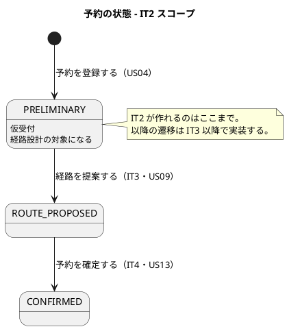
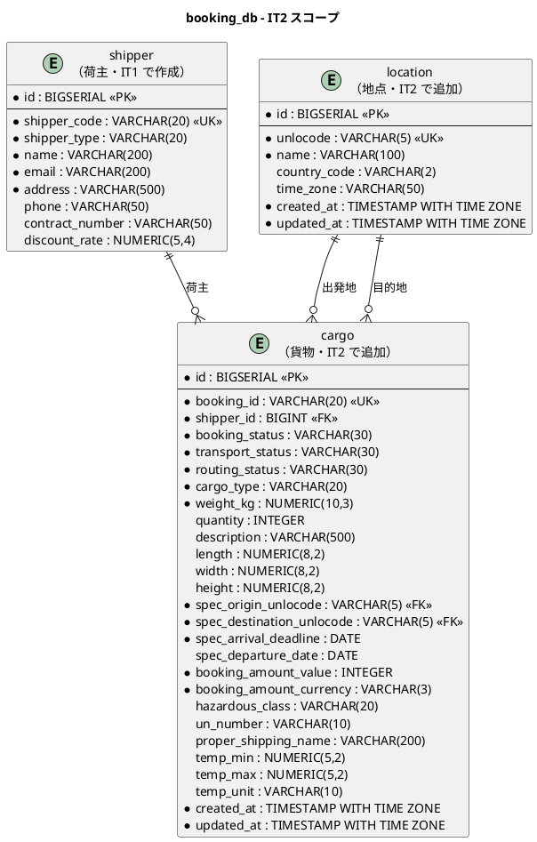
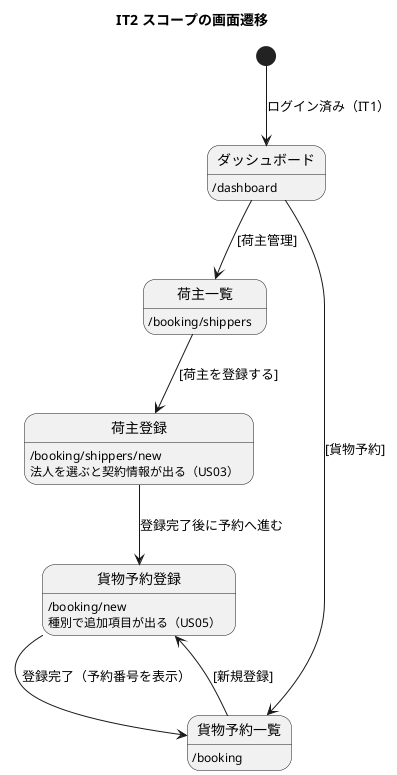

# イテレーション 2 計画

## ゴール

営業担当者が**荷主の登録から貨物予約の仮受付までを 1 本で通せる**状態にします。危険物・冷凍貨物の特別情報もこのイテレーションで扱い、経路設計（IT3 以降）に引き渡せる形にします。

## 局面とアプローチ

**序盤（2 本目・最終）／アウトサイドイン**（[開発戦略](development_strategy.md#序盤-アウトサイドイン-it1it2--release-01)）。

IT1 で通した縦切り（frontend → gatewayms → bookingms → DB）の上に、業務の中心である予約を載せます。IT2 の完了をもって序盤（Release 0.1）が閉じ、IT3 から中盤（インサイドアウト）に移ります。

> **IT1 との違い**: IT1 は基盤の妥当性検証が主目的でした。IT2 は**基盤が揃った状態で業務価値を積む最初の IT** です。基盤投資（品質ゲート・マニュアルの型）は IT1 で払い済みのため、IT2 の見積もりはストーリー実装が中心になります。

## 対象ユーザーストーリー

| ID | ユーザーストーリー | SP | 優先度 | Issue |
| :--- | :--- | :--- | :--- | :--- |
| US03 | 法人荷主を登録する | 1 | 高 | [#520](https://github.com/k2works/case-study-cargo-tracker/issues/520) |
| US04 | 貨物予約を登録する | 5 | 高 | [#521](https://github.com/k2works/case-study-cargo-tracker/issues/521) |
| US05 | 危険物・冷凍貨物の予約を登録する | 2 | 高 | [#522](https://github.com/k2works/case-study-cargo-tracker/issues/522) |
| **合計** | | **8** | | |

## 受入条件

`docs/requirements/user_story.md` の該当節を正典とします（書き写さず引用します）。

- [US03 の受け入れ基準](../requirements/user_story.md#us03-法人荷主を登録する)
- [US04 の受け入れ基準](../requirements/user_story.md#us04-貨物予約を登録する)
- [US05 の受け入れ基準](../requirements/user_story.md#us05-危険物冷凍貨物の予約を登録する)

### 受入基準のうち IT2 では満たせないもの

正直に記録します。以下は依存先が未実装のため、**IT2 のスコープ外**とします。

| 受入基準 | 依存先 | 扱い |
| :--- | :--- | :--- |
| US03「登録した法人情報は US22（法人割引を適用する）で参照される」 | US22（IT11・billingms） | 参照される側（データ）は IT2 で用意する。参照する側は US22 で実装 |
| US04「経路設計者に予約登録の通知が送信される」 | US06（IT3・予約情報の引き渡し） | **IT2 では通知しない。** 予約が仮受付状態で保存されることまでを IT2 の完了とする |
| US04「見積情報との整合性が確認される」 | US01（見積作成・IT12） | 見積が無いため確認しようがない。US01 実装時に整合確認を足す |
| US05「経路設計時に対応可能な航海・ルートのみが候補として表示される」 | US08（経路候補算出・IT4）・US09（経路選択・IT5） | **特別情報を保存し、経路設計が読める形にする**ところまでが IT2 |

> これらを「満たした」と記録しないのは、後続 IT の計画精度を守るためです。US06（IT3）・US08（IT4）・US09（IT5）・US01（IT12）の計画時に、この表を入力として使います。

## 設計

### ドメインモデル図（IT2 スコープ）

```plantuml
@startuml
title IT2 スコープ - Booking Context

package "Cargo 集約" {
  class Cargo <<aggregate root>> {
    -bookingId: BookingId
    -shipperId: ShipperId
    -routeSpecification: RouteSpecification
    -bookingStatus: BookingStatus
    -cargoType: CargoType
    -weightKg: BigDecimal
    -dimensions: Dimensions
    -quantity: Quantity
    -description: Description
    -hazardousDeclaration: HazardousDeclaration
    -temperatureRequirement: TemperatureRequirement
    +{static} book(...): Cargo
    +requiresHazardousDeclaration(): boolean
    +requiresTemperatureRequirement(): boolean
  }
}

package "Shipper 集約（IT1 から拡張）" {
  class Shipper <<aggregate root>> {
    -shipperCode: String
    -type: ShipperType
    -name: String
    -email: String
    -address: String
    -phone: String
    -contractNumber: ContractNumber
    -discountRate: DiscountRate
  }
}

package "値オブジェクト" {
  class BookingId <<value object>>
  class ShipperId <<value object>>
  class RouteSpecification <<value object>> {
    -origin: Location
    -destination: Location
    -departureDate: LocalDate
    -arrivalDeadline: LocalDate
  }
  class Dimensions <<value object>> {
    -length: BigDecimal
    -width: BigDecimal
    -height: BigDecimal
  }
  class Quantity <<value object>>
  class Description <<value object>>
  class HazardousDeclaration <<value object>> {
    -hazardousClass: String
    -unNumber: String
    -properShippingName: String
  }
  class TemperatureRequirement <<value object>> {
    -minTemperature: BigDecimal
    -maxTemperature: BigDecimal
    -unit: TemperatureUnit
  }
  class ContractNumber <<value object>>
  class DiscountRate <<value object>>
  enum CargoType {
    GENERAL
    HAZARDOUS
    REFRIGERATED
  }
  enum BookingStatus {
    PRELIMINARY
  }
  enum ShipperType {
    INDIVIDUAL
    CORPORATE
  }
  enum TemperatureUnit {
    CELSIUS
  }
}

Cargo *-- BookingId
Cargo *-- RouteSpecification
Cargo *-- Dimensions
Cargo *-- Quantity
Cargo *-- Description
Cargo o-- HazardousDeclaration
Cargo o-- TemperatureRequirement
Cargo --> CargoType
Cargo --> BookingStatus
Cargo *-- ShipperId
Shipper o-- ContractNumber
Shipper o-- DiscountRate
Shipper --> ShipperType

note bottom of Cargo
  IT2 で扱うのは仮受付（PRELIMINARY）まで。
  経路・配送状況・キャンセルは IT3 以降。
end note

note bottom of Shipper
  法人のときだけ契約番号・割引率を持つ。
  個人で入力されたら拒否する。
end note
@enduml
```

### 状態遷移図（IT2 スコープ）

### ER 図（IT2 スコープ）

> **注（設計ドキュメントの欠落）**: 開始準備の整合性検証で、設計側に 9 件の欠落が見つかりました。
> **判断が不要なものは開始準備の時点で反映済み**です（Try 6「正典を先に読み、差分を同じ変更で直す」）。
>
> | # | 対象 | 欠落 | 状態 |
> | :--- | :--- | :--- | :--- |
> | 1 | `domain-model.md` の `Cargo` | `weightKg` が無い | **反映済み** |
> | 2 | `domain-model.md` の `RouteSpecification` | 希望引渡日が無い | **反映済み** |
> | 3 | `domain-model.md` の `Shipper` | `address` が無い | **反映済み** |
> | 4 | `data-model.md` の `cargo` | US05 の列（危険物 3・温度 3・寸法 3・個数・品名）が無い | **反映済み** |
> | 5 | `data-model.md` の `cargo.spec_*` | 出発地・目的地・到着期限が nullable | **反映済み**（NOT NULL に） |
> | 6 | `data-model.md` の `shipper` / `location` | 監査カラムが無い | タスク 0.2 |
> | 7 | `architecture_backend.md` のテーブル一覧 | `location` と `estimate` が抜けている | **反映済み** |
> | 8 | `architecture_backend.md` の `Location` の置き場所 | `domain/model/entities/` と `shareddomain/model/` の二重記述 | **タスク 0.1 の判断 7**（着手前に一方へ寄せる） |
> | 9 | `ui_design.md` の貨物予約登録 | take-3 を踏襲とだけあり、take-7 の画面イメージが無い | タスク 0.2 |
>
> **`booking_amount_*` は NOT NULL** ですが、IT2 の時点で料金は算出できません（US18・IT11）。
> 扱いはタスク 0.1 の判断 6 で決めます。

### 画面遷移図（IT2 スコープ）

## タスク

### 0. 返済枠と設計反映（IT1 からの引き継ぎ・SP 対象外）

**IT2 序盤の独立コミット枠**として先に片付けます。「余力次第」にすると固定化するためです（IT1 ふりかえり）。

| # | タスク | 見積もり | 状態 |
|---|--------|---------|------|
| 0.1 | **IT2 冒頭の判断 9 件**を決めて記録する（下表）。判断は ADR かふりかえりに残す（Try 4） | 4h | [x] ADR-007〜013 |
| 0.2 | **設計ドキュメントの残る欠落を反映**（上の注の #6・#9）。`shipper` / `location` の監査カラム、`ui_design.md` の貨物予約登録の画面イメージ（種別による項目の出し分け・予約詳細を作らない旨）。**実装より先に正典を直す**（Try 6） | 3h | [x] |
| 0.3 | M1: `GET /api/v1/auth/me` を削除する（画面が使っておらず、`displayName` に利用者 ID を返す偽の実装のため） | 1h | [x] |
| 0.4 | M2: 失敗回数の更新を DB 側の加算に寄せ、**並列 5 リクエストでロックが成立すること**を検証 | 3h | [x] 期待値を条件に含む更新（CAS）で実装。修正前に赤を確認済み |
| 0.5 | M3: US31 のシステムレベル受入テスト（MSW に失敗回数を持たせ、画面で 5 回間違えると入れないことを E2E で通す） | 2h | [x] ロックを外すと赤になることを確認済み |
| 0.6 | M4: `RegisterShipperUseCase` の責務分割と boolean 引数の解消 | 2h | [x] 検索を `SearchShipperUseCase` へ分離、真偽値引数を `register` / `registerAnyway` の 2 メソッドに |
| 0.7 | M5: フロントの `pages/` と `features/` の関係を決め、ADR か architecture_frontend に記録（**画面を増やす前に決める**） | 2h | [x] [ADR-013](../adr/013-frontend-pages-and-features.md)（実装移行はタスク 0.7b） |
| 0.7b | [ADR-013](../adr/013-frontend-pages-and-features.md) の構造へ移行（IT1 の画面から取得処理を `features/booking/queries.ts` へ移し、`features/` → `pages/` の逆流が無いことを検査で固定する） | 2h | [x] 逆流を作ると赤になることを確認済み |
| 0.8 | M7: `enabled` の判定を集約の述語に寄せる／M8: CORS プリフライトの扱いを決めテストで固定／M9: npm script を運用手順書に記載 | 3h | [ ] |

**小計**: 22h

#### タスク 0.1 の判断結果（2026-08-20 決定）

いずれも**IT3 以降で決めると、既に書いたコードやデータを壊す**ものでした。決定は ADR に残しています（Try 4）。

| # | 判断 | 決定 | 記録 |
| :--- | :--- | :--- | :--- |
| 1 | Gateway をバイパスできないことの担保 | 共有フィルタで利用者ヘッダを必須にし、登録漏れをメタテストで落とす。ネットワークは NetworkPolicy で塞ぐ（多層防御の外側） | [ADR-007](../adr/007-authenticated-user-header-required.md) |
| 2 | 荷主の編集ストーリーを起票するか | **起票する**。打ち間違いが直せないまま予約に進むのは、荷主コードが本番経路の採番である以上「消して入れ直す」で回避できない。IT3 のバックログに置く | 本表・GitHub Issue |
| 3 | 法人荷主を US03 までどこまで登録させるか | **契約番号は必須・割引率は任意**。未設定の割引率は 0% ではなく「未設定」として扱う | [ADR-012](../adr/012-value-object-granularity.md) |
| 4 | 共用端末の無操作タイムアウトの要否 | **必要**。sessionStorage はタブを閉じれば消えるが、席を離れた端末は開いたままになる。ただし IT2 では実装せず、US31 系のセキュリティストーリーとして起票し IT3 で実装する | 本表・GitHub Issue |
| 5 | 利用者と荷主の紐付け方 | **IT2 では紐付けない**。予約の登録・参照とも `ROLE_SALES` のみ。`ROLE_SHIPPER` に開くと絞り込めず全荷主の予約が見える | [ADR-008](../adr/008-no-user-shipper-link-in-it2.md) |
| 6 | `cargo` の状態列をどこまで作るか | 状態列は **NOT NULL・既定値付きで最初から**作る。料金列は算出できるまで **NULL を許す**（0 で埋めない） | [ADR-009](../adr/009-cargo-status-columns-from-the-start.md) |
| 7 | `location` の正体 | サロゲート PK + `unlocode` UK、`time_zone` は NOT NULL。マスタは bookingms が持ち、IT2 では複製しない。`Location` の置き場所は**共有カーネル 1 箇所**に寄せる（`architecture_backend.md` の `domain/model/entities/` からは外す） | [ADR-010](../adr/010-location-master-shape.md) |
| 8 | `booking_id` の採番方式・フォーマット | DB シーケンスで採番し `BKG-YYYYNNNNNN`。組み立てはマイグレーションに置く。**追跡番号とは別の識別子**とし導出もしない | [ADR-011](../adr/011-booking-id-numbering.md) |
| 9 | `Shipper` の形と値オブジェクトの粒度 | 値オブジェクトは**不変条件を持つ属性にだけ**導入。`Shipper` は単一クラスのまま。`email` の VO 化は IT3 以降 | [ADR-012](../adr/012-value-object-granularity.md) |

> 判断 3 により、タスク 1.2 の「法人で未指定は許す」は**契約番号については誤り**になりました。契約番号は必須、割引率は任意です。

> M6（荷主一覧のページング）は US04 の一覧と同時に設計したほうが安いため、タスク 3.4 に統合します。
> M10（マイグレーション名）は本計画で反映済みです（`V3__init_booking_cargo.sql` を使います）。

### 1. US03: 法人荷主を登録する（1 SP）

| # | タスク | 見積もり | 状態 |
|---|--------|---------|------|
| 1.1 | `ContractNumber` / `DiscountRate` 値オブジェクト（TDD。**割引率は 0〜30%**。境界値: -0.1 / 0 / 30 / 30.1） | 2h | [ ] |
| 1.2 | `Shipper` に法人契約情報を持たせる（**個人で契約情報を渡したら拒否する**。法人は契約番号必須・割引率任意＝[ADR-012](../adr/012-value-object-granularity.md)。**復元では検査しない**） | 2h | [ ] |
| 1.3 | Flyway で `shipper` の既存行を壊さないことを確認（列は IT1 で用意済み。**復元では検査しない**） | 1h | [ ] |
| 1.4 | 荷主登録画面: 「法人」を選ぶと契約情報の入力欄が出る。個人に戻したら入力値を捨てる | 2h | [ ] |

**小計**: 7h

### 2. US04: 貨物予約を登録する（5 SP）

| # | タスク | 見積もり | 状態 |
|---|--------|---------|------|
| 2.1 | `location` テーブルの Flyway と初期データ（UN/LOCODE。共有カーネルの `Location` を使う） | 2h | [ ] |
| 2.2 | `cargo` テーブルの Flyway（`V3__init_booking_cargo.sql`）。**新しいマイグレーションとして足す**（適用済みの V2 は編集しない）。**予約番号のシーケンスとフォーマットをマイグレーションに書く**（0.1 の判断 8。リスク表に書くだけでは規律にならない） | 3h | [ ] |
| 2.3 | `BookingId` / `RouteSpecification` / `Quantity` / `Description` / `Dimensions` 値オブジェクト（TDD） | 3h | [ ] |
| 2.4 | `Cargo` 集約（TDD。**予約番号は本番経路で採番**。仮受付状態で生成。到着期限は業務タイムゾーンで判断し、過去日付を拒否）。**可変 Clock でテストする**（固定 Clock では日付境界をまたぐ振る舞いを通れない。Try 9） | 4h | [ ] |
| 2.5 | 予約登録ユースケース（荷主の存在確認・**存在しない荷主 ID を拒否**） | 3h | [ ] |
| 2.6 | `CargoMapper` と永続化（**方言スモークを同じコミットで通す**。IT1 の Try 3） | 3h | [ ] |
| 2.7 | `CargoBookingController`（`POST/GET /api/v1/bookings`）と MockMvc テスト。**登録は ROLE_SALES のみ、参照は ROLE_SALES と ROLE_SHIPPER**（ui_design の権限マトリクス）。荷主が自分の予約を参照できることと、**荷主が登録できないこと**を、認可を外すと赤になる形で検証 | 4h | [ ] |
| 2.8 | フロントエンド: 貨物予約登録画面（荷主を選ぶ・貨物仕様・輸送条件） | 4h | [ ] |
| 2.9 | フロントエンド: 貨物予約一覧（**新しい順・件数・絞り込み・上限**。M6 統合） | 3h | [ ] |

**小計**: 29h

### 3. US05: 危険物・冷凍貨物の予約を登録する（2 SP）

| # | タスク | 見積もり | 状態 |
|---|--------|---------|------|
| 3.1 | `HazardousDeclaration` / `TemperatureRequirement` 値オブジェクト（TDD。**温度は下限 ≦ 上限**） | 2h | [ ] |
| 3.2 | `Cargo` の不変条件: 種別が危険物なら申告が必須・冷凍なら温度条件が必須。**一般貨物にそれらを付けたら拒否する**（付け忘れと同じく、付けすぎも誤り） | 3h | [ ] |
| 3.3 | フロントエンド: 種別を変えると追加項目が出る／消える。**種別を戻したときに前の入力が残らない** | 3h | [ ] |
| 3.4 | 危険物・冷凍の予約が保存され、**経路設計が読める形になっている**ことの結合テスト（IT3 の入力になる） | 2h | [ ] |

**小計**: 10h

### 4. ユーザーマニュアル（SP 対象外）

**画面を伴う IT のため計上します**（IT1 ふりかえり Try 5）。

| # | タスク | 見積もり | 状態 |
|---|--------|---------|------|
| 4.1 | 「04-貨物予約.md」を執筆（予約の登録・一覧・危険物と冷凍の扱い） | 3h | [ ] |
| 4.2 | 「03-荷主管理.md」に法人荷主の節を追加 | 1h | [ ] |
| 4.3 | 業務フロー章の対応表を更新（工程 3 を「使えます」に。**検査が赤になるので忘れられない**） | 1h | [ ] |
| 4.4 | 画面キャプチャの再生成と**目視確認**（Try 5） | 2h | [ ] |

**小計**: 7h

### 見積もり合計

| カテゴリ | SP | 理想時間 |
| :--- | :--- | :--- |
| 返済枠・設計反映（SP 対象外） | — | 22h |
| US03 法人荷主 | 1 | 7h |
| US04 貨物予約 | 5 | 29h |
| US05 危険物・冷凍 | 2 | 10h |
| マニュアル（SP 対象外） | — | 7h |
| **合計** | **8** | **75h** |

**1 SP あたり**: 約 5.75h（返済枠・マニュアル除く）。IT1 実績（5.2h）とほぼ同水準です。

> **返済枠が 20h に増えました**（当初 18h）。開始準備の整合性検証で、設計ドキュメント側の欠落 9 件と
> 「いま決めるべき判断」5 件が追加されたためです。いずれも**実装の前提**であり、後回しにすると
> 実装をやり直すことになります（`location` の形は IT3 で 4 サービスに複製され、`booking_id` は
> 5 サービスが論理参照します）。

## スケジュール

> **順序は序盤ワークフロー（アウトサイドイン）に従います**: E2E（赤）→ UI + モック → Controller →
> ユースケース → ドメイン・永続化 → モックを実物に差し替えて閉じる。
> ただし**返済枠（タスク 0）を先に片付けます**。特に M5（`pages/` と `features/` の方針）は
> 画面を増やす前に決めないと、決め直しの対象が増えます。

### Week 1（Day 1-5）

| Day | 内容 | 局面 |
| :--- | :--- | :--- |
| Day 1 | 0.1 判断 4 件、0.7 フロント構造の方針決定 | 返済枠（先に決める） |
| Day 2 | 0.2 設計反映（data-model / ui_design）、0.3 `/auth/me` 削除 | 返済枠 |
| Day 3 | 0.4 ロックの並列検証、0.5 US31 の E2E、0.6 ユースケース分割 | 返済枠 |
| Day 4 | 0.8 残りの返済、E2E（US03・US04・US05 のシナリオ）を**赤で置く** | Phase 1: 受け入れ（Red） |
| Day 5 | 1.4 法人荷主の画面、2.8 予約登録画面（MSW モック） | Phase 2: UI |

### Week 2（Day 6-10）

| Day | 内容 | 局面 |
| :--- | :--- | :--- |
| Day 6 | 3.3 種別による項目の出し分け、2.9 予約一覧 | Phase 2: UI |
| Day 7 | 2.7 CargoBookingController、1.1/1.2 法人契約の値オブジェクトと集約 | Phase 3-4（US03 は小さいため 1 日で貫通する） |
| Day 8 | 2.5 予約登録ユースケース、2.3 値オブジェクト群 | Phase 4: ドメイン |
| Day 9 | 2.4 Cargo 集約、3.1/3.2 危険物・冷凍の不変条件 | Phase 4: ドメイン |
| Day 10 | 2.1/2.2/2.6 Flyway と永続化 + 方言スモーク、3.4 結合、モックを実物に差し替え、4.x マニュアル | Phase 5: 縦の閉合 |

### IT2 で扱わないと決めたこと

| 事項 | 扱い |
| :--- | :--- |
| 公開追跡経路（`/api/v1/public/tracking/*`）とポータルの追跡番号欄 | **IT2 では扱わない。US18（追跡照会）で閉じる。** IT1 の引き継ぎに挙がっているため、次の IT で探し直さないよう明記する |
| 予約詳細画面（`/booking/:bookingId`） | **IT2 では作らない。** 登録完了は一覧に戻す。`ui_design.md` の遷移図にその旨を反映する（タスク 0.2） |

## リスク

| リスク | 影響 | 対策 |
| :--- | :--- | :--- |
| 返済枠 20h が Week 1 を圧迫する | **高** | Day 1-4 に収める。溢れたら 0.8 の一部（M9 手順書）を IT3 へ送る。**0.1・0.2・M5・M2 は送らない**（判断と正典の反映は実装の前提であり、後回しにすると実装をやり直すことになる） |
| `cargo` のカラムが多く、集約の生成が肥大化する | 中 | 値オブジェクトに寄せる。`Cargo.book(...)` の引数が 7 個を超えたらコマンドオブジェクトにまとめる |
| 危険物・冷凍の項目が画面で複雑になる | 中 | 種別で出し分ける。**種別を戻したときに前の入力が残らない**ことをテストで固定する |
| US04 の受入基準 3 件が IT2 で満たせない | 低 | 上表に明記済み。完了報告書でも「満たしていない」と記録する |
| 予約番号の採番が荷主コードと同じ轍を踏む | 低 | シーケンスで採番し、**連続登録で衝突しない**ことを結合テストで確認する（IT1 と同じ形） |

## Definition of Done

- [ ] US03・US04・US05 の受入基準のうち、**IT2 スコープ内のもの**をすべて満たす（スコープ外は上表のとおり）
- [ ] `./gradlew build` が緑（ユニット・統合・ArchUnit・カバレッジ検証）
- [ ] `TZ=UTC ./gradlew test` が緑
- [ ] フロントエンドの lint・テスト・ビルド・E2E スモークが緑
- [ ] **本番相当ビルドの検査**（`test:e2e:production`）が緑
- [ ] CI が緑（全ジョブ success）
- [ ] SonarQube Quality Gate が PASS（Bug 0・Vulnerability 0）
- [ ] **追加した検査を壊して赤になることを確認済み**（Try 1・2）
- [ ] **新しい Mapper について方言スモークが通っている**（Try 3）
- [ ] **設計に書かれていない判断を ADR に起こした**（Try 4）
- [ ] **各ストーリー着手時に正典を読み、差分を同じ変更で直した**（Try 6）
- [ ] **「定義したが呼んでいない」関数が無いことを確認した**（Try 7。IT1 で全緑をすり抜けた配線漏れの型）
- [ ] **MSW を実物に差し替え、E2E が実バックエンドで緑**（Try 8。モックで検証した機能は、実物を 1 本通すまで「動く」と言わない）
- [ ] 画面を追加した US について、`ui_design.md` のナビゲーション表・サイドバー実装・ダッシュボード導線・到達性テストの **4 点一致**
- [ ] **ナビゲーションの `available` を true にした**（引き継ぎ事項）
- [ ] **業務フロー章の対応表を更新した**（工程 3）
- [ ] ユーザーマニュアルの該当章を執筆し、**キャプチャを再生成して目視した**（Try 5）
- [ ] kind 統合環境で Gateway 経由の動作確認済み
- [ ] 開発環境（Heroku）へデプロイし、`npx gulp deploy:dev:health` の**全 URL が 200**
- [ ] **序盤（Release 0.1）の完了条件を満たす**（[開発戦略の序盤 完了条件](development_strategy.md#序盤-アウトサイドイン-it1it2--release-01)を引用）。IT2 は序盤の最終 IT であり、ここで満たさなければ誰も満たさない
  - 全ロール名が確定し、`ui_design.md` の保留記述が解消されている（IT3 での作り直しを防ぐ）
- [ ] ドキュメント更新完了（release_plan の進捗・JIG / jig-erd 再生成）

## 更新履歴

| 日付 | 内容 |
| :--- | :--- |
| 2026-08-20 | 初版作成（IT1 のふりかえり Try・返済枠 10 件・引き継ぎ事項を反映） |
