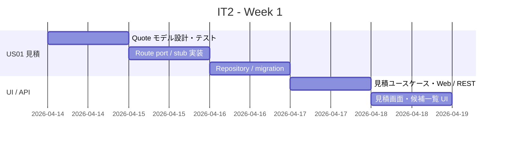
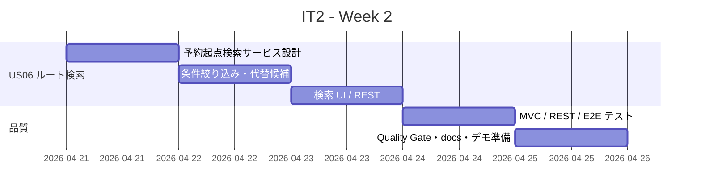
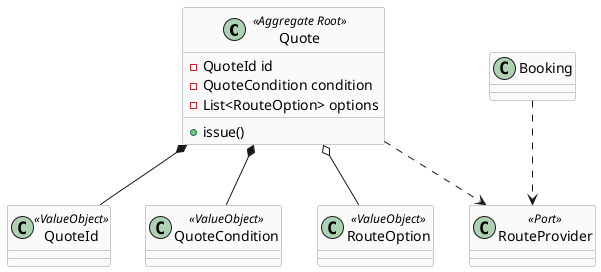
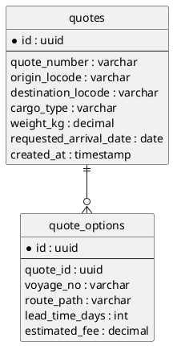
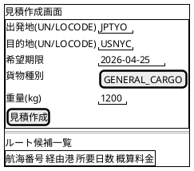
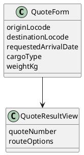
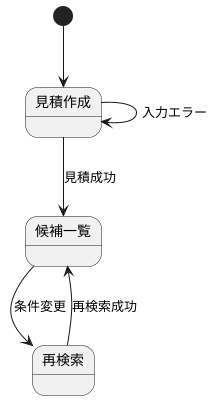

# イテレーション 2 計画

## 概要

| 項目 | 内容 |
|------|------|
| **イテレーション** | 2 |
| **期間** | Week 3-4（2026-04-14〜2026-04-27） |
| **ゴール** | 輸送見積を作成し、予約または見積条件をもとに最適ルート候補を検索できるようにする |
| **目標 SP** | 10 |

---

## ゴール

### イテレーション終了時の達成状態

1. **輸送見積**: 営業担当者が輸送条件と貨物条件から見積を作成し、見積番号付きで保存できる
2. **ルート検索**: 経路設計者が予約情報または見積条件をもとに外部ルート照会を実行し、候補一覧を確認できる
3. **品質維持**: backend テスト、E2E、SonarQube Quality Gate の基準を維持したまま IT2 機能を追加できる

### 成功基準

- [ ] 見積作成画面で出発地・目的地・希望期限・貨物種別・重量を入力し、見積番号を発行できる
- [ ] 外部ルート照会の結果として、経由港・所要日数・概算料金・航海番号を含む複数候補を表示できる
- [ ] 希望期限に間に合うルートがない場合のメッセージ表示と代替候補提示ができる
- [x] ルート照会失敗時に stub / 代替候補で動作確認できる（StubQuoteRouteProviderAdapter 実装済み）
- [ ] backend テスト、E2E、SonarQube Quality Gate が Green を維持する
- [ ] テストカバレッジ 80% 以上

---

## ユーザーストーリー

### 対象ストーリー

| ID | ユーザーストーリー | SP | 優先度 |
|----|-------------------|----|--------|
| US01 | 輸送見積を作成する | 5 | 必須 |
| US06 | 最適ルートを検索する | 5 | 必須 |
| **合計** | | **10** | |

### ストーリー詳細

#### US01: 輸送見積を作成する

**ストーリー**:
> 営業担当者として、荷主の輸送要件（出発地・目的地・希望期限・貨物種別・重量）を入力し、輸送料金と所要日数の見積を作成したい。なぜなら、荷主が予算と納期を事前に把握でき、予約決定を迅速に行えるからだ。

**受入条件**:

1. 出発地・目的地・希望期限・貨物種別・重量を入力できる
2. 外部経路システムへのルート照会が行われ、複数のルート候補が表示される
3. ルート候補ごとに「経由港・所要日数・概算料金・航海番号」が表示される
4. 見積情報が保存され、見積番号が発行される
5. 希望期限に間に合うルートが存在しない場合、その旨が通知される
6. 外部経路システムへの接続失敗時は過去の実績データから代替候補が表示される

#### US06: 最適ルートを検索する

**ストーリー**:
> 経路設計者として、予約番号を指定して出発地・目的地・希望着日から最適ルート候補を検索したい。なぜなら、ルート候補を迅速に把握し、荷主に最適な輸送プランを提案できるからだ。

**受入条件**:

1. 予約番号を指定して予約情報（出発地・目的地・希望着日・貨物種別）を確認できる
2. 外部経路システムへのルート照会が行われる
3. ルート候補が「経由港・所要日数・費用・航海番号」とともに一覧表示される
4. 希望着日に間に合うルートがない場合、その旨が表示され代替条件での再検索ができる
5. 危険物または冷凍貨物の場合、取扱い可能なルートのみが表示される
6. 出発地・目的地は UN/LOCODE 形式で指定できる

### タスク

#### 1. US01: 輸送見積を作成する（5 SP）

| # | タスク | 見積もり | 担当 | 状態 |
|---|--------|---------|------|------|
| 1.1 | Quote 集約・値オブジェクト（QuoteId、QuoteCondition、QuoteOption）を設計する | 4h | Copilot | [x] |
| 1.2 | 見積ドメインモデルと料金算出ルールのユニットテストを追加する | 3h | Copilot | [x] |
| 1.3 | 外部ルート照会ポートと WireMock / stub アダプターを実装する | 4h | Copilot | [x] |
| 1.4 | QuoteRepository・MyBatis mapper・Flyway migration を追加する | 3h | Copilot | [x] |
| 1.5 | 見積作成ユースケース、Web / REST エンドポイント、保存後の見積番号表示を実装する | 4h | Copilot | [x] |
| 1.6 | 見積作成画面と候補一覧 UI、統合テスト、E2E を追加する | 2h | Copilot | [ ] |

**小計**: 20h（理想時間）

#### 2. US06: 最適ルートを検索する（5 SP）

| # | タスク | 見積もり | 担当 | 状態 |
|---|--------|---------|------|------|
| 2.1 | 予約番号起点のルート検索クエリと Read Model を設計する | 3h | Copilot | [x] |
| 2.2 | Booking 情報と route provider を接続する検索サービスを実装する | 4h | Copilot | [x] |
| 2.3 | 希望着日不一致・危険物 / 冷凍貨物の絞り込みルールを実装しテストする | 4h | Copilot | [ ] |
| 2.4 | ルート候補一覧 UI、代替条件での再検索導線、404 / 業務エラー表示を実装する | 4h | Copilot | [ ] |
| 2.5 | REST API / MVC テスト、E2E、Swagger 表示確認を追加する | 3h | Copilot | [ ] |
| 2.6 | SonarQube と docs 更新を含めた品質ゲート確認を行う | 2h | Copilot | [ ] |

**小計**: 20h（理想時間）

#### タスク合計

| カテゴリ | SP | 理想時間 | 状態 |
|---------|----|---------|------|
| US01 輸送見積 | 5 | 20h | 進行中（5/6 タスク完了） |
| US06 最適ルート検索 | 5 | 20h | 進行中（2/6 タスク完了） |
| **合計** | **10** | **40h** | |

**1 SP あたり**: 4h  
**進捗率**: 58%（7/12 タスク完了）

---

## スケジュール

### Week 1（Day 1-5: 2026-04-14〜2026-04-18）

| 日 | タスク |
|----|--------|
| Day 1 | Quote モデル設計、値オブジェクト、ユニットテスト |
| Day 2 | route provider ポート、WireMock / stub、接続失敗時代替候補設計 |
| Day 3 | QuoteRepository、MyBatis mapper、Flyway migration |
| Day 4 | 見積作成ユースケース、Web / REST エンドポイント |
| Day 5 | 見積 UI、候補一覧表示、Week 1 動作確認 |

### Week 2（Day 6-10: 2026-04-21〜2026-04-25）

| 日 | タスク |
|----|--------|
| Day 6 | 予約番号起点の検索サービス、Read Model、Booking 連携 |
| Day 7 | 希望着日不一致・危険物 / 冷凍貨物ルール、代替条件検索 |
| Day 8 | 検索 UI、REST 表示、例外時メッセージ |
| Day 9 | MVC / REST / E2E テスト、Swagger 掲載確認 |
| Day 10 | SonarQube、docs 更新、バグ修正、デモ準備 |

---

## 設計

### ドメインモデル

### データモデル

### ユーザーインターフェース

#### ビュー

#### モデル

#### インタラクション

---

## 計画調整メモ

- IT1 実績ベロシティは 10 SP のため、IT2 も 10 SP を維持します。
- IT1 で基盤整備が完了しているため、IT2 は環境構築タスクを含めず機能開発へ集中します。
- 外部経路システムはまず stub / WireMock を前提にし、実 API 連携は IT3 以降で契約テストへ拡張します。

## 更新履歴

| 日付 | 更新内容 | 更新者 |
|------|---------|--------|
| 2026-04-01 | IT2 計画を作成 | Copilot |
| 2026-04-01 | タスク 1.5, 2.2 完了を反映（進捗 58%） | Copilot |
