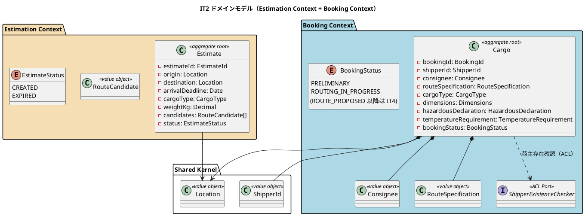
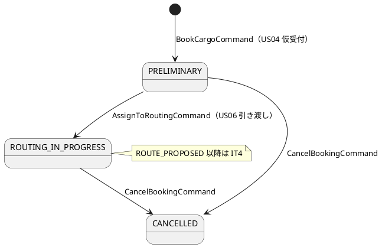
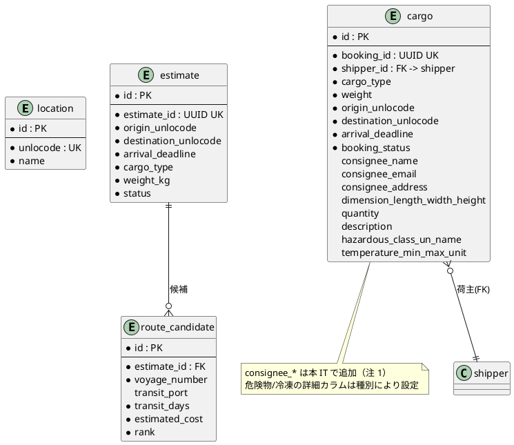
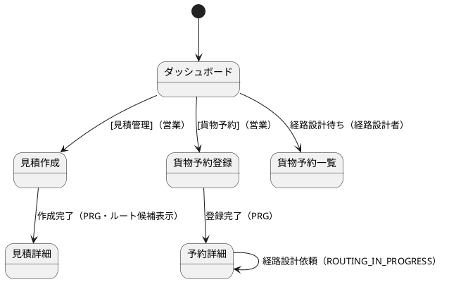

# イテレーション 2 計画

## ゴール

見積作成 → 貨物予約登録 → 経路設計者への引き渡しまでの **MVP 縦フロー** を完成させる。
Estimation Context（見積・ルート候補スタブ）と Booking Context（Cargo 集約・荷受人・危険物/冷凍・状態遷移）を実装し、
Booking から Shipper への依存を **ShipperExistenceChecker ACL** 経由に保つ（BC 独立性）。

- **局面**: 序盤（[開発戦略](development_strategy.md) — アウトサイドイン継続）
- **期間**: 2026-08-10 〜 2026-08-23（Week 3-4）
- **目標 SP**: 15

## 対象ユーザーストーリー

| ID | ユーザーストーリー | SP | 優先度 | 対応 UC |
| :--- | :--- | :--: | :--- | :--- |
| US01 | 輸送見積を作成する | 5 | 必須 | UC01 |
| US04 | 貨物予約を登録する | 5 | 必須 | UC03 |
| US05 | 危険物・冷凍貨物の予約を登録する | 3 | 必須 | UC03 |
| US06 | 予約情報を経路設計者に引き渡す | 2 | 必須 | UC04 |
| **合計** | | **15** | | |

出典: [release_plan.md](release_plan.md) Phase 1（イテレーション 1-2）。

---

## 受入条件（デモ項目 = 受け入れ基準）

序盤アウトサイドイン: デモ項目を受け入れテスト（Playwright E2E）+ 統合テストで束ねる。以下が green であることを DoD とする。

### US01: 見積作成（営業担当者）

- [ ] 出発地・目的地・希望期限・貨物種別・重量を入力できる
- [ ] ルート概算候補（経由港・所要日数・概算料金・航海番号）が表示される（**スタブ**算出）
- [ ] 見積が保存され、見積番号（`EstimateId` UUID）が発行される
- [ ] 希望期限に間に合うルートが存在しない場合、その旨が通知される
- [ ] 危険物が含まれる場合、危険物申告情報の入力フォームが表示される

### US04: 貨物予約登録（営業担当者）

- [ ] 荷主 ID を入力して既存荷主を選択できる（`ShipperExistenceChecker` ACL で存在確認）
- [ ] 貨物種別・重量・寸法・個数・品名を入力できる
- [ ] 荷受人（氏名・住所・連絡先メール）を入力できる
- [ ] 出発地・目的地・希望引渡日・希望着日を入力できる
- [ ] 登録完了後、予約番号（`BookingId`）が発行され状態が「仮受付」（`PRELIMINARY`）になる
- [ ] 経路設計者への通知（`CargoBookedEvent` 発行）が行われる

### US05: 危険物・冷凍貨物の予約登録

- [ ] 貨物種別「危険物」選択で危険物申告（クラス・UN 番号・正式輸送品名）が必須表示される（htmx 差替）
- [ ] 貨物種別「冷凍・冷蔵」選択で温度管理条件（最低/最高温度・単位）が必須表示される（htmx 差替）
- [ ] 必須項目未入力時はドメイン検証エラーを表示する

### US06: 経路設計者への引き渡し

- [ ] 予約番号を指定して予約情報（出発地・目的地・期限・貨物仕様）を確認できる（予約詳細）
- [ ] 経路設計依頼を実行すると予約状態が「経路設計中」（`ROUTING_IN_PROGRESS`）に更新される
- [ ] 経路設計者に通知（ドメインイベント）が送信される
- [ ] 経路設計待ちの予約が経路設計者のダッシュボード/一覧から到達できる（`/bookings?status=ROUTING_IN_PROGRESS`）

---

## タスク分解

序盤アウトサイドイン: 受け入れテスト Red → TSX 画面 → Controller → Application → Domain → Repository → 受け入れ Green。
Estimation → Booking の順（見積が予約の前提）。

### T0. 基盤・DB（前 IT の Try 反映）

| # | タスク | 見積 |
| :--- | :--- | :--: |
| T0-1 | マイグレーション 002: `location`（UNLOCODE マスタ）・`estimate`・`route_candidate`・`cargo` を追加（cargo に荷受人カラムを含める。注参照）。Kysely スキーマ型追加 | 8h |
| T0-2 | location シード（主要 UNLOCODE）・Kysely codegen 同期 | 3h |
| T0-3 | dependency-cruiser に `shared → contexts` 逆流禁止ルールを追加（Try T5） | 2h |

### T1. Estimation Context（US01）

| # | タスク | 見積 |
| :--- | :--- | :--: |
| T1-1 | 見積作成画面（`/estimates/new`）+ 見積詳細（`/estimates/{id}` ルート候補一覧）TSX + テンプレートテスト | 6h |
| T1-2 | EstimateController（作成 POST・PRG・危険物フィールド htmx）統合テスト | 6h |
| T1-3 | Estimate 集約・EstimateId・RouteCandidate・EstimateStatus・CargoType（単体、境界値: 重量>0・origin≠destination） | 6h |
| T1-4 | CreateEstimateService（スタブ経路候補算出・期限超過判定）単体テスト | 6h |
| T1-5 | KyselyEstimateRepository（Testcontainers/pg-mem 統合） | 4h |

### T2. Booking Context（US04/US05）

| # | タスク | 見積 |
| :--- | :--- | :--: |
| T2-1 | 貨物予約登録画面（`/bookings/new` 荷主 ID・荷受人・貨物仕様、危険物/冷凍 htmx 差替）+ 一覧 TSX | 8h |
| T2-2 | CargoBookingController（登録 POST・PRG・荷主存在確認エラー）統合テスト | 6h |
| T2-3 | Cargo 集約・Consignee・RouteSpecification・Dimensions/Quantity/Description・HazardousDeclaration・TemperatureRequirement・BookingStatus（単体、危険物必須・冷凍必須の不変条件） | 10h |
| T2-4 | BookCargoService（`ShipperExistenceChecker` ACL で荷主存在確認・`CargoBookedEvent` 発行） | 6h |
| T2-5 | ShipperExistenceChecker ACL アダプタ（Shipper Context の Repository を参照、Booking は Shipper に直接依存しない） | 4h |
| T2-6 | KyselyCargoRepository（Testcontainers/pg-mem 統合） | 4h |

### T3. 引き渡し（US06）

| # | タスク | 見積 |
| :--- | :--- | :--: |
| T3-1 | 予約詳細画面（`/bookings/{id}`）+ 経路設計依頼ボタン TSX | 4h |
| T3-2 | AssignToRoutingService（`PRELIMINARY → ROUTING_IN_PROGRESS`・通知イベント）+ Controller（PRG） | 6h |
| T3-3 | 経路設計待ち一覧フィルタ（`/bookings?status=ROUTING_IN_PROGRESS`）と経路設計者ロールの到達性 | 4h |

### T4. デモ・回帰

| # | タスク | 見積 |
| :--- | :--- | :--: |
| T4-1 | デモ項目 E2E（見積 → 予約 → 引き渡しの縦フロー）Playwright | 8h |
| T4-2 | IT1 スケルトン判定 E2E の回帰（プレースホルダ→実画面化した bookings/estimates の到達性更新） | 3h |

---

## スケジュール

| 週 | 主対象 |
| :--- | :--- |
| Week 3（08-10〜08-16） | T0 基盤・DB → T1 Estimation（US01）→ デモ green |
| Week 4（08-17〜08-23） | T2 Booking（US04/US05）→ T3 引き渡し（US06）→ T4 縦フロー E2E green・`npm run verify` パス |

---

## 設計（IT2 スコープ）

### ドメインモデル図（Estimation + Booking）

出典: [domain-model.md](../design/domain-model.md) 第 1 章 Booking / 第 7 章 Estimation。
ビジネスルール: origin≠destination・weight>0・HAZARDOUS は HazardousDeclaration 必須・REFRIGERATED は TemperatureRequirement 必須・Booking は Shipper に直接依存せず ACL 経由。

### 状態遷移図（BookingStatus / IT2 スコープ）

EstimateStatus は CREATED（作成時）で、EXPIRED は期限管理実装時（本 IT では CREATED のみ）。

### ER 図（IT2 対象テーブル）

出典: [data-model.md](../design/data-model.md) Estimation / Booking / Shared。

### 画面遷移図（IT2 対象画面）

出典: [ui_design.md](../design/ui_design.md) 見積作成/詳細・貨物予約登録/一覧・予約詳細。

---

## リスク

| リスク | 影響 | 対策 |
| :--- | :--- | :--- |
| Cargo 集約が値オブジェクト多数で複雑化し見積超過 | 中 | 危険物/冷凍を段階実装（まず GENERAL で縦貫通 → 危険物/冷凍を追加）。T2-3 を分割 |
| Booking→Shipper の BC 独立性違反（直接参照） | 高 | ShipperExistenceChecker ACL を先に定義（T2-5）。dependency-cruiser で検証（T0-3） |
| CargoBookedEvent の購読先（Tracking）が未実装 | 低 | IT2 は発行のみ（購読は IT4）。発行の統合テストで担保、未購読を明記 |
| 荷受人カラムが data-model で IT4 扱い（注 1） | 中 | 本 IT で cargo に荷受人カラムを追加し data-model を同期 |

---

## 注（設計への反映が必要）

検証（validating-iteration-plan / validating-design）で検出予定の設計ギャップ。当該 IT で設計へ反映する。

1. **荷受人カラムの前倒し**: [data-model.md](../design/data-model.md) は cargo の `consignee_name`/`consignee_email` を「将来追加予定（IT4+ 荷受人管理実装時）」としているが、US04/US05 の受入基準で荷受人入力が必須。本 IT で `cargo` に荷受人カラムを追加し、data-model の「将来追加予定」節から本体へ移す。
2. **Email 重複時の選択導線（IT1 持ち越し T6）**: US04「荷主 ID を入力して既存荷主を選択」と関連。IT1 は荷主登録の重複時に既存 ID 提示までを実装済み。IT2 では予約時の荷主 ID 指定で存在確認する形で受入基準を満たす。
3. **location マスタの導入**: cargo/estimate の origin/destination が `location.unlocode` を参照するため、`location` テーブルとシードを本 IT で追加する（data-model に定義済み、未実装）。
4. **domain-model の他 take 由来ドリフト**: [domain-model.md](../design/domain-model.md) 第 1 章 Booking / 第 7 章 Estimation に「IT2 実装状況（2026-04-06 完了）」の実装済み注記があるが、本 take では IT2 で初めて実装する。移植元の記述であり、本 IT の実装進行に合わせて実状（未実装 → 実装済み）と日付を是正する。

---

## DoD（完了の定義）

- [ ] US01/US04/US05/US06 のデモ項目 E2E green（見積 → 予約 → 引き渡しの縦フロー）
- [ ] `npm run verify`（lint / typecheck / arch / test）パス
- [ ] CI success・SonarQube Quality Gate PASS（Bug 0・Vuln 0・重複 <3%・カバレッジ目標達成）
- [ ] dependency-cruiser グリーン（BC 独立性: Booking→Shipper は ACL 経由、shared→contexts 逆流なし）
- [ ] 上記「注」の設計反映（荷受人カラム・location マスタ）を data-model と同時更新
- [ ] IT1 スケルトン判定 E2E の回帰（実画面化した bookings/estimates を含む）
- [ ] 意味のある単位でコミット済み
