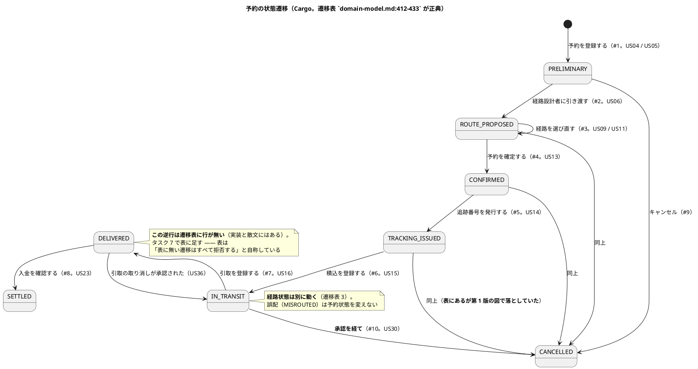
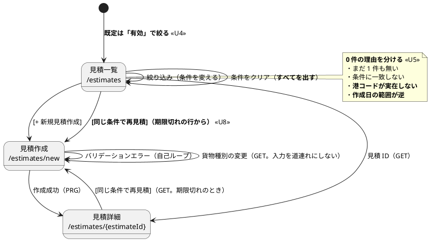

# イテレーション 20 計画

## 概要

| 項目 | 内容 |
| :--- | :--- |
| **イテレーション** | 20 |
| **期間** | 10 営業日 |
| **局面** | **出荷と是正**（2 回目。`development_strategy.md` への追記が要る。下記「注 1」） |
| **主アプローチ** | **アウトサイドイン**（画面と検査から。ドメインの境界は変えない） |
| **ゴール** | **育つ負債 2 件を止め**、正典に残った未判断を決着させ、見積一覧を毎朝使える形にする |
| **目標 SP** | **0**（新規ストーリーなし）。達成は**育つ負債を止めたか**と**未判断を減らしたか**で測る |

> **US01〜US36 のすべてが実装完了しています。** 新しいユーザーストーリーはありません。

---

## ゴール

### イテレーション終了時の達成状態

1. **育つ負債が 0 になっている**。D5（ADR-024 の代償）は契約どおりの検査で止め、D1（`Cargo` 500 行）は切り出す
2. **「あとで判断する」と書いたまま残っている決定が無くなっている**（返金・多通貨・`invoice_line_item`・見積の `EXPIRED`）
3. **見積一覧が毎朝の確認に使える**（既定・0 件の理由・件数と並び順・一覧からの作り直し）
4. **記録の誤りが直っている**（下記「着手前に分かったこと」）

### 成功基準

- [ ] **ADR-024 の契約（誰がどのメソッドを呼んでよいか）が検査になっている**（ArchUnit。**許可外から呼ぶと赤になることを確かめる**）
- [ ] **`Cargo` が 500 行を下回り、余裕がある**（いまは**上限ちょうど**で猶予 0）
- [ ] **`release_scope.md` の「スコープ外」表が実態と一致している**（5 行すべて）
- [ ] **落としたものを名前で記録している**

---

## 着手前に分かったこと（**私の読み違い 1 件・記録の誤り 2 件**）

### 私が誤っていたこと（**計画の第 1 版で「IT19 の記録が誤り」と書いた**）

**本計画の第 1 版は「D5 の『違反 0 件』は誤りで、実際は 2 件」と書きました。これが間違いでした。**

ADR-024 の「失ったもの」の表は、**呼んでよい相手をメソッドごとに書き分けています**。

| クラス | 開いた操作 | **本来呼んでよいもの** |
| :--- | :--- | :--- |
| `ProposedRoute` | `of` / `withPriority` | **`RouteSearchService`**（ドメインサービス） |
| `TrackingExceptionEvent` | `raise` / `resolve` | 集約ルート（`TrackingActivity`） |

**この契約に照らせば、`RouteSearchService` からの 2 件は違反ではありません。** IT19 の「実測の違反は 0 件」は正しく、私が規則を「**集約ルート以外から呼べない**」と一般化して読み替えたために「違反 2 件」に見えていました。**数え間違いではなく、規則の書き換えです。**

**書き換えたまま進めると、Routing の設計を壊します**（下記タスク 1 の設計判断を参照）。

### IT19 の記録の誤り（**実測で 3 件**）

| # | IT19 の記録 | 実測 |
| :--- | :--- | :--- |
| D1 | 「`Cargo` 499 行・猶予 1 行」 | **500 行・猶予 0 行**（上限ちょうど） |
| U7 | 「1 語・画面 3 か所」 | **6 件**（画面 1・テスト 2・マニュアル 1・設計 2） |
| — | 「`domain-model.md` は 5 か所で『返金は行わない』と書いている」（本計画の第 1 版） | **2 か所**（`:1114` / `:1131`） |

> **記録と実測のずれは 9 度目です**（C2 7→39 / C3 2→21 / R8 8→10 / R7 1→13 / C1 34→249 / T1 2→1 / D1 499→500 / U7 3→1 / 返金 5→2）。
>
> **本 IT の Try に「数を書くときは数えた方法も書く」を追加します。** これまでの Try は
> 「その場で数える」（T2）でしたが、**数えたつもりで数えていない記述**が残ります。

## 前イテレーションの学びの反映（ふりかえり Try）

IT19 の Try 5 件を、本 IT のタスクへ落とす。

| Try | 本 IT での落とし込み |
| :--- | :--- |
| **T1** 検査を書くときは「**過去に起きた事故の粒度**」で Red を作る | **タスク 1 そのもの**。D5 のルールは型名だけで書くと `ExceptionOccurrence.raise`（値オブジェクト）や `commandService.raise` を誤検知する。**型 ＋ メソッドの組**で書く |
| **T2** HTML を見るテストは**描画された形**でアサートする | タスク 4（件数・並び順）。既存の一覧は `1,000 kg` `120,000 円` と単位付きで描画している |
| **T3** 参照実装を写すときは 1 クラスずつ「なぜそこか」を言えるか確かめる | タスク 2（`Cargo` の切り出し）。**切り出す単位ごとに「なぜそこか」を Javadoc に書く** |
| **T4** ADR に「次 IT へ送る」と書いたら**同じコミットで計画に起票する** | **本計画がその起票である**（D5・D1 を対象・実測付きで載せた）。以後も同じ形にする |
| **T5** 計画外を受けたら**その場で落とす順序を見直して記録する** | 「落とす順序」に**見直しの記録欄**を設けた |
| **（本 IT で追加）** 数を書くときは**数えた方法も書く** | 記録と実測のずれが 9 度目。**「0 件」のように数えたつもりで数えていない記述**が残る |

---

## 着手前に決めたこと

| 論点 | 決定 | 理由 |
| :--- | :--- | :--- |
| D5 のルールをどう書くか | **ADR-024 の契約表を、そのまま検査に落とす** —— **（型・メソッド・呼んでよい相手）の 3 つ組** | 「集約ルート以外は呼べない」と一般化すると、**`ProposedRoute.of` を集約ルートへ移すことになり、探索と提案の分離が壊れる**（`of` の 6 引数はすべて探索中にしか作れない）。**設計を変えずに ADR-024 の代償を返せる**のはこの形だけである |
| `reconstruct`（復元）を検査対象にするか | **対象外**。ただし**そう書く** | 復元は infrastructure が行う。対象に含めると「永続化から集約を戻せない」という別の問題になる。**黙って外さず、検査の Javadoc に書く** |
| `Cargo` から何を切り出すか | **誤配まわり（`misrouteDetection` ＋ 3 メソッド）** | 状態遷移 12 メソッドを `CargoProgress` へ寄せる案は**採らない** —— `CargoProgress` は `valueobjects` の record であり、ADR-024 が「javac は止めていない」と書いた唯一の場所である。**12 の状態変更を、検査が届かない場所に集める**ことになる。誤配は**フィールドごと独立している**まとまりであり、切り出しても遷移に触れない |
| 返金の扱い | **「行わない」で確定**（新しい判断ではない） | `domain-model.md` が 2 か所（`:1114` / `:1131`）で「返金は行わない」と既に書いている。**`release_scope.md` の 1 行だけが「判断する」のまま古い** |
| 見積の `EXPIRED` | **採用で確定** | 実装・設計・マニュアルはすべて `EXPIRED` を前提に一貫している。**`release_scope.md` の「落とす」1 行だけが矛盾** |

> **注 1（正典の更新が要る）**: 局面表は IT19 で終わっています。**IT20 も「出荷と是正」です**。
> 直すのは表の行だけではありません —— 実測で **6 か所**です。
>
> | 場所 | 現状 |
> | :--- | :--- |
> | `development_strategy.md:5` | 「IT1〜**IT19** を 7 局面に分け」 |
> | `development_strategy.md:21` | 局面表（IT19 まで） |
> | `development_strategy.md:270` | 節見出し「出荷と是正（**IT19**）」 |
> | `release_plan.md:62` | 「開発期間: **19 イテレーション**」 |
> | `release_plan.md:428` | 局面表（IT19 まで） |
> | `release_plan.md:316-339` | 進捗表（IT20 の行なし） |
>
> **片方だけ直した前例は IT15 です**（IT19 は両方直しています。第 1 版は IT19 も前例に数えていました）。
>
> **注 2（`ui_design.md` への反映が要る）**: 見積一覧の仕様（`:1766-1772`）に **U4〜U8 の 5 項目は
> どれもありません**（既定・0 件の種類・件数・並び順・一覧からの再見積）。**このまま実装すると、
> DoD の「正典を引用する」が空振りします。** 見積 3 画面はワイヤーフレーム（`@startsalt`）自体も
> 欠けています。タスク 7 で反映します。
>
> **注 3（`domain-model.md` への反映が要る）**: 遷移表（`:412-433`）に **US36 の逆行
> （`DELIVERED` → `IN_TRANSIT`）の行がありません**。実装（`Cargo.revertDelivery`）と散文
> （`:1523`）にはあり、表だけが追随していません。表は「**表に無い遷移はすべて拒否する**」と
> 自称しているため、**穴を残したまま「遷移が変わらない」ことを確かめられません**。タスク 7 で足します。

---

## 対象

### ユーザーストーリー

**新規はありません。** US01〜US36 はすべて実装完了しています。

### 返済枠（**SP 外**。実測は本計画の作成時に数え直した）

| # | 内容 | 記録 | **実測（計画時）** | 育つか |
| :--- | :--- | :--- | ---: | :--- |
| **D5** | ADR-024 の契約（誰がどのメソッドを呼んでよいか）を検査にする | 「違反 0 件」 | **違反 0 件**（記録どおり）。対象は **4 メソッド ＋ 呼んでよい相手 2 種** | **育つ** |
| **D1** | `Cargo` の行数 | 「499 行・猶予 1 行」 | **500 行・猶予 0 行**（上限ちょうど） | **育つ** |
| J1 | `release_scope.md` の「スコープ外」表で、**実態と食い違う行** | — | **5 行**（返金・多通貨・`invoice_line_item`・`cargo.declared_value`・見積 `EXPIRED`） | 育たない |
| J2 | `data-model.md` に残る `invoice_line_item` の記述 | — | **8 か所**（ADR-016 が「作らない」と決めている） | 育たない |
| J3 | `domain-model.md` の「多通貨対応」の記述 | — | **1 か所**（`:379`）。実装は `requireSameCurrency` で異通貨演算を拒む | 育たない |
| U4 | 見積一覧の既定を「有効」に | 1 画面 | **コントローラ 1 行 ＋ テンプレ 2 か所**。**0 件の文言と衝突する**ため設計判断が要る | 育たない |
| U5 | 絞り込み 0 件の理由を分ける | 2 件 | **判定 1 メソッド ＋ 文言 2 → 4**。港コードの検証・作成日の逆転検出は**未実装** | 育たない |
| U6 | 一覧に件数と並び順を出す | 1 画面 | **テンプレ 1 か所 ＋ 並び順の正典を決める判断** | 育たない |
| **U7** | 「有効期限」の語 | 「画面 3 か所」 | **6 件**（画面 **1**・テスト 2・マニュアル 1・設計 2） | 育たない |
| U8 | 一覧から作り直せるようにする | 1 画面 | **テンプレ 1 か所** | 育たない |
| P-M2 | `EstimateFilter` が全件取得してメモリで絞る | 1 か所 | **1 か所**（`EstimateController:59`）。**本 IT では扱わない**（下記） | 育たない |

> **育つのは 2 件（D5・D1）です。** どちらも**先に返します** ——
> 落とす順序は見積もりでなく「次の IT で対象が増えるか」で決める。

---

## 本 IT では扱わないもの（**名前で記録する**）

| # | 内容 | 実測 | 扱わない理由 |
| :--- | :--- | :--- | :--- |
| C1 | 委譲アクセサの残り | 213 個 | ラチェットで止めてある。増えれば赤になる |
| D2 | 返金の**業務**（画面・操作） | 1 件 | 「行わない」で確定する（タスク 5）。**業務として始めるなら新しいストーリーの起票が要る** |
| D3 | 適格請求書（インボイス制度） | 1 件 | 同上 |
| D4 | `Location.of` が `new Location(...)` に委譲するだけ | 1 件 | 実害が出ていない |
| P-M2 | `EstimateFilter` が全件取得してメモリで絞る | 1 か所 | 見積の件数が増えるまで痛まない。**日付と地名を SQL に落とすと、状態だけが application に残る**形になり、ADR-022 の切り分けを説明し直す必要がある |
| N1 | **負荷試験**（`release_scope.md` は「Release 0.1〜1.0 で追跡 API に 1 本」と定めるが未実施） | 1 本 | **本 IT のスコープ外**。実施には環境の用意が要る。**名前で記録し、次の判断に回す** |

---

## 設計（IT20 スコープ）

### ドメインモデル図

**省略します。** 集約の境界を変えません。タスク 2（`Cargo` の切り出し）は**誤配まわりを値オブジェクトへ出す**もので、`domain-model.md` の Routing / Booking の図はどちらも `CargoProgress` や `ProposedRoute` を描いていないため、**図そのものは変わりません**。

> **ただし要素表は変わります。** 切り出した値オブジェクトを `domain-model.md` の要素表に足します（タスク 7）。**「図が変わらない」ことと「文書が変わらない」ことは別です。**

### 状態遷移図

**掲載します。** タスク 2 は遷移に触れませんが、**触れないことを確かめる基準**として要ります。

> **第 1 版の図は遷移を 3 本落とし、表に無い遷移を 1 本描いていました**（`TRACKING_ISSUED → CANCELLED`・
> `ROUTE_PROPOSED` の自己遷移・US05 の欠落）。**基準にする図が欠けていると、欠けた遷移は検証されないまま通ります。**

### ER 図

**省略します。** マイグレーションはありません。`invoice_line_item`（タスク 5）は**テーブルを消さず、設計文書の記述を実態に合わせる**だけです。

> **テーブルは残します。** ADR-016 は「**本リリースでは使わない**」「**作らない判断であって、
> 設計から消したのではない**」と書き、削除案を「**将来の判断を奪う**」として却下しています。
> したがってタスク 5 は `data-model.md` の 8 か所を**削除するのではなく、「作成済み・未使用」と実態を書く**ものです。

### 画面遷移図（見積のみ）

U4〜U8 で変わる範囲だけを描きます。

### ナビゲーションと到達性

**変更なし。** 見積管理は ROLE_SALES 専用で、navbar・ダッシュボードの両方に入っています。

### ADR

| ADR | 内容 | 要否 |
| :--- | :--- | :--- |
| — | `entities` の生成・変更を集約ルートに限る | **不要**。ADR-024 が既に決めており、本 IT はそれに**検査を与える**だけである |
| — | `Cargo` の状態遷移を `CargoProgress` へ寄せる | **不要**。集約の境界も遷移も変わらない |
| — | 返金・`invoice_line_item` | **不要**。ADR-016 / ADR-018 と `domain-model.md` が既に決めている。**`release_scope.md` が追随していないだけ** |
| — | **多通貨を単一通貨（JPY）に確定する** | **要検討**。**どの ADR も決めていない** —— `domain-model.md:379` は「多通貨対応」と書き、DB には `*_currency` 列が 10 件以上ある。実装（`requireSameCurrency`）は異通貨演算を拒むだけで、単一通貨と決めたわけではない。**タスク 5 で ADR を書くか、判断を次へ送るかを決める** |

---

## タスク分解

| # | タスク | 見積 | 状態 |
| ---: | :--- | ---: | :--- |
| 1 | **D5: `entities` の生成・変更を集約ルートに限る**（**育つ**） | 10h | 未着手 |
| 2 | **D1: `Cargo` の状態遷移を寄せる**（**育つ**） | 10h | 未着手 |
| 3 | U4 / U5: 見積一覧の既定と、0 件の理由 | 8h | 未着手 |
| 4 | U6 / U8: 件数・並び順と、一覧からの作り直し | 6h | 未着手 |
| 5 | J1〜J3: 正典に残った未判断を決着させる | 6h | 未着手 |
| 6 | U7: 「有効期限」の語を「希望到着期限」に | 3h | 未着手 |
| 7 | ドキュメント（**正典 6 か所 ＋ `ui_design.md` ＋ `domain-model.md`**・マニュアル・インデックス） | 8h | 未着手 |
| 8 | 途中レビュー | 3h | 未着手 |
| 9 | 品質ゲートと破壊検証 | 8h | 未着手 |
| | **合計** | **62h** | **余白 18h**（10 営業日 = 80h） |

> **余白を 20h 取りました。** IT19 は余白 5h に対し計画外 16h を受けて 11h 超過しました（Try T5）。

### 1. D5: ADR-024 の契約を検査にする — 10h（**育つ**）

- **契約は ADR-024 の表そのものである。（型・メソッド・呼んでよい相手）の 3 つ組**で書く

| 型 | メソッド | 呼んでよい相手 |
| :--- | :--- | :--- |
| `ProposedRoute` | `of` / `withPriority` | `RouteSearchService` |
| `TrackingExceptionEvent` | `raise` / `resolve` | `TrackingActivity`（集約ルート） |

- **型名だけで書かない**（Try T1）。`ExceptionOccurrence.raise`（値オブジェクト）や `commandService.raise` を誤検知する
- **`reconstruct` は対象外**。復元は infrastructure が行う（`MyBatisBookingRouteProposalRepository:160` / `MyBatisTrackingActivityRepository:112`）。**黙って外さず、検査の Javadoc に「なぜ対象外か」を書く**
- **Red は「許可外から呼ぶテストを足すと赤」で作る。** いまの実装に違反は無い（**契約に照らして 0 件**）
- ADR-024 の「何がどこで守るか」から**「守らない」の行を消す**

> **設計は変えない。** `ProposedRoute.of` の 6 引数はすべて探索中にしか作れず（経由港の走査結果・所要日数・概算費用・貨物種別の可否・期限の判定）、集約ルートへ移すと**探索と提案の分離が壊れる**。

### 2. D1: `Cargo` から誤配まわりを切り出す — 10h（**育つ**）

- 実測 **500 行・猶予 0**。次に 1 メソッド足すと Checkstyle が赤
- 対象は**誤配まわり**（`misrouteDetection` フィールド ＋ `withMisrouteDetection:157` / `markMisrouted:415` / `misrouteDetection:429`）
- **状態遷移 12 メソッドを `CargoProgress` へ寄せる案は採らない。** `CargoProgress` は `valueobjects` の `record` であり、ADR-024 が「**javac は止めていない**」と書いた唯一の場所である。**12 の状態変更を、検査が届かない場所に集める**ことになる
- **切り出す単位に「なぜそこか」を Javadoc に書く**（Try T3）
- **遷移に触れないことを確かめる。** 既存のテストを 1 本も緩めない
- **これで足りなければ次を選ぶ。** 候補は実測済み —— 追跡番号まわり（3 メソッド）・引取まわりの残り（4 メソッド。`CargoClaim` へ寄せ切る）

### 3. U4 / U5: 見積一覧の既定と、0 件の理由 — 8h

- **既定を「有効」にする。** ただし**初めて開いた人の 0 件文言と衝突する** —— 既定の絞り込みを「条件あり」と数えると「条件に一致する見積はありません」が出る。**既定は `filtered` に数えない**
- 0 件の理由を分ける: (a) まだ 1 件も無い、(b) 条件に一致しない、(c) **港コードが実在しない**、(d) **作成日の範囲が逆**
- (c)(d) の検出は `EstimateFilter.Criteria` に**まだ無い**。港の実在は `KnownPorts` 相当の照会が要るため、**規則は application 層に置く**（ADR-022）

### 4. U6 / U8: 件数・並び順と、一覧からの作り直し — 6h

- **件数を出す**（「該当 12 件」）。月末に「今月何件出したか」を聞かれる
- **並び順を明記する**（作成日の新しい順）。荷役一覧には明記があるのに見積一覧には無い
- **期限切れの行から直接作り直せるようにする。** いまは 1 件ずつ詳細を開いて戻る（10 件なら 20 回の遷移）
- **描画された形でアサートする**（Try T2）

### 5. J1〜J3: 正典に残った未判断を決着させる — 6h

| 対象 | すること |
| :--- | :--- |
| 返金 | `release_scope.md` の「Release 2.0 で US を起票するか、落とすかを判断する」を **「行わない（`domain-model.md` で確定済み）」**に。**新しい判断ではなく、追随していない記述の是正である** |
| 多通貨 | `release_scope.md` を「**保留**」から「**単一通貨（JPY）で確定**」に。`domain-model.md:379` の「多通貨対応」を実装（`requireSameCurrency`）に合わせる |
| `invoice_line_item` | `release_scope.md` を「作らない（ADR-016）」に。`data-model.md` の 8 か所を**実態（テーブルはあるが使わない）**に合わせる |
| 見積 `EXPIRED` | `release_scope.md:149` の「要求元なし。落とす」を**削除**し、`domain-model.md` の規則 7（IT18 で追加）へリンクする |
| `cargo.declared_value` | 「要求元なし。落とす」のまま。**実装にも `data-model.md` にも無い**ため、**落とし済みであることを書く**（`EXPIRED` と文言が同じで、片方だけ実装されている状態を放置しない） |

> **多通貨だけは新しい判断である。** 返金・`invoice_line_item`・`EXPIRED` は既に決まっており、
> `release_scope.md` が追随していないだけである。**多通貨はどの ADR も決めていない** ——
> `domain-model.md:379` は「多通貨対応」と書き、DB には `*_currency` 列が 10 件以上ある。
> **単一通貨（JPY）に確定するなら ADR を書く。** 判断できなければ次へ送り、名前で記録する。

### 6. U7: 「有効期限」の語を直す — 3h

- 実測 **7 件**（画面 1・テスト 2・マニュアル 2・設計 2）
- **同業のシステムで「見積の有効期限」は「価格を保証する期限」を意味する。** 本システムが判定しているのは**荷主の希望到着期限**であり、別の概念である
- **「希望到着期限を過ぎています」に直す**

### 7. ドキュメント — 8h

**注 1〜3 の反映を含む。**

| 対象 | すること |
| :--- | :--- |
| 局面表ほか **6 か所** | `development_strategy.md`（`:5` / `:21` / `:270`）・`release_plan.md`（`:62` / `:428` / 進捗表） |
| `ui_design.md`（**注 2**） | 見積一覧の仕様に U4〜U8 を反映（既定・0 件の種類・件数・並び順・一覧からの再見積）。**見積 3 画面のワイヤーフレームが欠けている**ため、あわせて追加する |
| `domain-model.md`（**注 3**） | 遷移表に **US36 の逆行**（`DELIVERED` → `IN_TRANSIT`）を足す。要素表にタスク 2 で切り出した値オブジェクトを足す |
| マニュアル 12 章 | U4〜U8 とキャプチャ再生成 |
| インデックス | `docs/index.md` / `mkdocs.yml` / 各 index |

### 8. 途中レビュー — 3h

タスク 2 を終えた時点で `self-review`（中間）。**正式レビューはクローズ時**。

### 9. 品質ゲートと破壊検証 — 8h

- `TZ=UTC ./gradlew check --rerun-tasks` / E2E / CI / SonarQube
- **本 IT で足した検査を壊して赤を確認する**
- **JIG の突合**（`gulp app:jig`）

---

## スケジュール

10 営業日。

### Week 1（Day 1-5）

| Day | 内容 | 見積 |
| :--- | :--- | :--- |
| Day 1 | タスク 1 前半（違反 2 件の解消） | 6h |
| Day 2 | タスク 1 後半（ArchUnit ルールと破壊検証） | 4h |
| Day 3 | タスク 2（`Cargo` の状態遷移を寄せる） | 8h |
| Day 4 | タスク 2 完了 2h ＋ **タスク 8（途中レビュー）** 3h | 5h |
| Day 5 | タスク 3（U4 / U5） | 8h |

### Week 2（Day 6-10）

| Day | 内容 | 見積 |
| :--- | :--- | :--- |
| Day 6 | タスク 4（U6 / U8） | 6h |
| Day 7 | タスク 5（正典の決着） | 6h |
| Day 8 | タスク 6（U7）3h ＋ タスク 7 着手 4h | 7h |
| Day 9 | タスク 7（ドキュメント・キャプチャ） | 4h |
| Day 10 | タスク 9（品質ゲートと破壊検証） | 8h |

> **合計 62h に対して 80h であり、余白は 18h ある。**

---

## 落とす順序（**先に決めておく**）

**見積もりではなく「次の IT で対象が増えるか」で決めます。**

1. **タスク 6（U7 の語）** — 7 件で止まっており増えない
2. **タスク 4（U6 / U8）** — 件数が増えるまで痛まない
3. **タスク 3 の (c)(d)**（港コード・作成日の逆転）— 基本の 0 件文言を残す

**落とさないもの**: タスク 1（D5）・タスク 2（D1）・タスク 5（正典の決着）・タスク 7（ドキュメント）・タスク 9（品質ゲート）。

- タスク 1・2 は**育つ負債**。落とせば次 IT で対象が増える
- タスク 5 は**放置するほど「判断した気になる」時間が延びる**（返金は Release 2.0 で判断すると書いてから 2 リリース経っている）
- タスク 7 を落とすと局面表の空白が次 IT へ持ち越される（IT15・IT19 で起きた）

### 落とす順序の見直し（**計画外を受けたら記録する**。Try T5）

| 日付 | 受けた計画外 | 見直した内容 |
| :--- | :--- | :--- |
| — | （まだ無い） | — |

---

## リスクと対策

| リスク | 影響度 | 対策 |
| :--- | :--- | :--- |
| **`ProposedRoute` の生成を集約ルートへ移すと、経路探索の設計が崩れる** | **高** | `RouteSearchService` は探索の手順を持ち、`BookingRouteProposal` は結果を持つ。**移すのは「作る操作」だけ**であり、探索の手順は動かさない。既存のテスト（`RouteSelectionTest` ほか）で遷移が変わらないことを確かめる |
| **`Cargo` の寄せ替えで遷移が変わる** | 高 | 遷移表（`domain-model.md`）を正典に、**既存のテストを 1 本も緩めない**。寄せ替えの前後で `./gradlew test` の結果が同一であることを確認する |
| U4（既定を「有効」に）が 0 件文言と衝突する | 中 | **既定の絞り込みを `filtered` に数えない**（着手前に決めた） |
| 港コードの実在検証で BC をまたぐ | 中 | 港の名簿は `location` テーブル（共有）。**ACL ポートを増やさずに済むか**を着手時に確かめる |
| 計画外を受けて余白を使い切る | 中 | **余白 20h**（IT19 の 4 倍）。受けたら**その場で落とす順序を見直して記録する** |

---

## 完了条件

### デモ項目

1. **ADR-024 の契約に反する呼び出しを足すと赤になる**（許可された相手からは緑のまま）
2. **`Cargo` に 1 メソッド足しても Checkstyle が赤にならない**
3. **見積一覧を開くと、既定で有効な見積だけが出る**
4. **絞り込んで 0 件のとき、理由が分かる**（港コードの誤り・作成日の逆転を含む）
5. **一覧に件数と並び順が出る**
6. **期限切れの行から直接作り直せる**
7. **画面に「希望到着期限を過ぎています」と出る**
8. **`release_scope.md` の「スコープ外」表が実態と一致している**

### Definition of Done

**条件は書き写さず、正典を引用します。**

#### 機能

- [ ] 正典: `docs/design/ui_design.md` の「見積一覧」「見積詳細」
- [ ] デモ項目 8 件がすべて動作する
- [ ] **落としたものは名前で記録する**

#### 局面の完了条件

- [ ] 正典: `development_strategy.md` の「出荷と是正」の節（**タスク 7 で IT20 を追記する**）

#### 品質

- [ ] `./gradlew check` が緑
- [ ] **`TZ=UTC ./gradlew check --rerun-tasks` が緑**
- [ ] E2E が緑
- [ ] **CI が緑**（`gh run`）
- [ ] SonarQube Quality Gate が PASS
- [ ] **JIG を `domain-model.md` / `architecture_backend.md` と突き合わせた**

#### 主張とテスト

- [ ] **着手時に返済枠を数え直した**（上表の実測列。**IT19 の記録の誤り 2 件を本計画で訂正済み**）
- [ ] **本 IT で足した検査を壊して赤を確認した**
- [ ] **数を書くときは、数えた方法も書いた**（本 IT の Try。**「0 件」も含む**）
- [ ] **育つ負債が 0 になった**

#### 安全装置（**着手前にリストを作らない**）

実装後に数え上げた結果で埋めます。

#### ドキュメント

- [ ] 正典 **6 か所**（`development_strategy.md` 3・`release_plan.md` 3）
- [ ] `ui_design.md` に U4〜U8 の仕様（**DoD が引用する先を先に埋める**）
- [ ] `domain-model.md` の遷移表に US36 の逆行、要素表に切り出した値オブジェクト
- [ ] マニュアル 12 章の更新とキャプチャ再生成
- [ ] `mkdocs build` の新規警告 0

---

## 更新履歴

| 日付 | 内容 |
| :--- | :--- |
| 2026-08-12 | 検証（ステップ 3・4）を反映。**第 1 版の最大の誤りは、私が ADR-024 の契約を読み替えていたこと** —— 「`entities` を集約ルート以外から呼べない」と一般化したため「違反 2 件」に見え、そのまま進めれば `ProposedRoute` の生成を集約ルートへ移して**探索と提案の分離を壊すところだった**。契約表をそのまま（型・メソッド・呼んでよい相手）の 3 つ組で検査する形に改めた。`Cargo` の寄せ先も `CargoProgress`（record で検査が届かない）から誤配まわりへ変更。数字の誤り 4 件（U7 7→6・返金 5→2・`release_scope` 4→5 行・ずれ 7→9 度目）と、状態遷移図の欠落 3 本・表に無い遷移 1 本を訂正。`ui_design.md` に U4〜U8 の仕様が無く **DoD が空振りする**ことも分かり、タスク 7 に足した |
| 2026-08-12 | 初版作成（`opening-iteration` のステップ 2）。スコープは「返済＋未判断の決着」。**着手前の数え直しで IT19 の記録の誤りを 2 件発見**（D5 は「違反 0 件」ではなく **2 件**、U7 は「画面 3 か所」ではなく **1 か所**）。育つ負債 2 件（D5・D1）を先に返す順序とし、**余白を 20h**（IT19 の 4 倍）取った |

---

## 関連ドキュメント

- [リリース計画](release_plan.md) / [リリーススコープ定義](release_scope.md)
- [開発戦略](development_strategy.md)
- [IT19 計画](iteration_plan-19.md) / [IT19 ふりかえり](retrospective-19.md) / [IT19 完了報告書](iteration_report-19.md)
- [IT19 クローズ前レビュー](../review/IT19クローズ_review_20260812.md)
- [ADR-016 請求書に明細行を持たない](../adr/016-no-invoice-line-item.md)
- [ADR-022 読み取り側の規則は application 層に置く](../adr/022-read-side-rules-live-in-application.md)
- [ADR-024 ドメインモデルを構成要素ごとのパッケージに分ける](../adr/024-domain-model-split-by-building-block.md)
