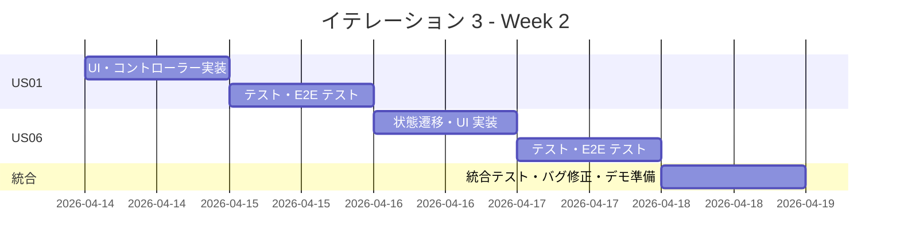
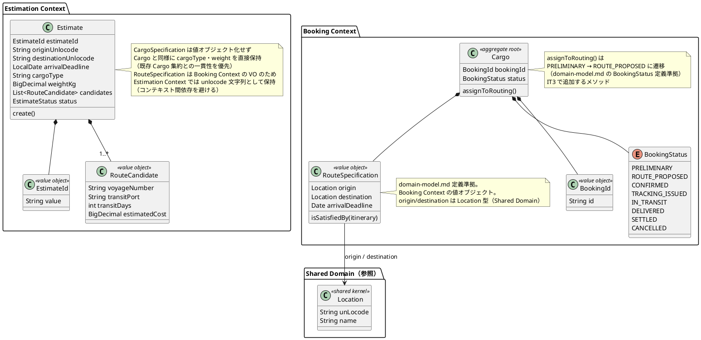
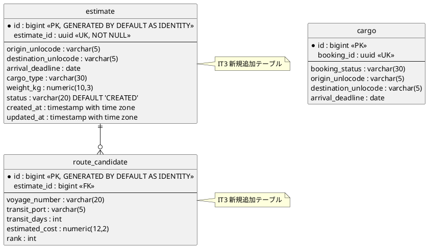
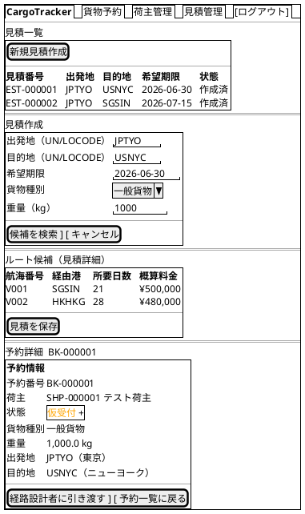
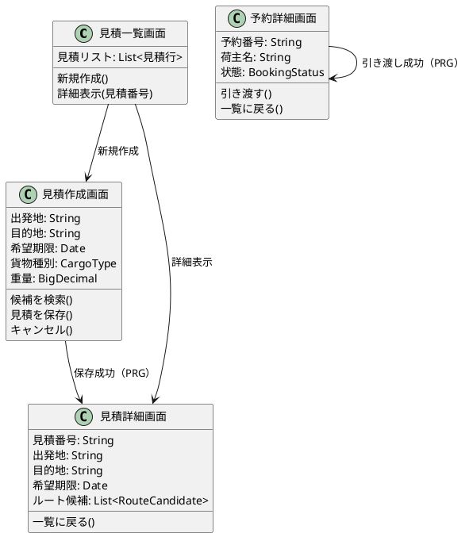
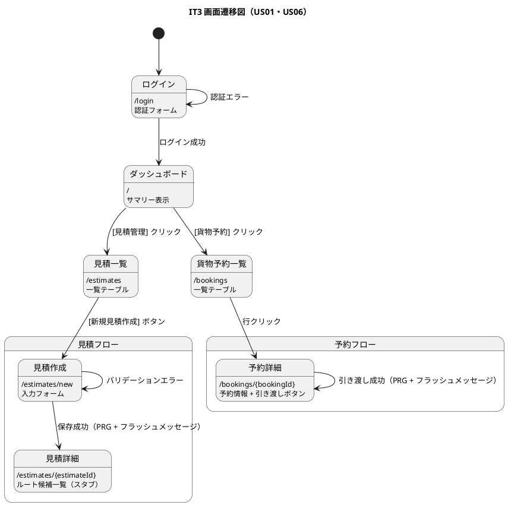

# イテレーション 3 計画

## 概要

| 項目 | 内容 |
|------|------|
| **イテレーション** | 3 |
| **期間** | Week 5-6（2026-04-07 〜 2026-04-18） |
| **ゴール** | Phase 2 開始 - 輸送見積作成と経路設計者への予約引き渡しを実現し、IT2 申し送り事項を完了する |
| **目標 SP** | 10（IT2改善: 3 + US01: 5 + US06: 2） |

---

## ゴール

### イテレーション終了時の達成状態

1. **IT2 申し送り改善**: SonarQube Quality Gate 確認・設計ドキュメント同期・E2E DB リセット機構・TestFixtures 整理・リファクタリングが完了している
2. **輸送見積作成**: 営業担当者が出発地・目的地・希望期限・貨物仕様を入力し、概算ルート候補と料金を含む見積を作成・保存できる
3. **予約引き渡し**: 営業担当者が仮受付予約を経路設計者に引き渡すと、予約状態が「経路設計中」に遷移する

### 成功基準

- [△] SonarQube ローカルスキャンを実行し Quality Gate の状態を確認している（スキャン未実行・指摘ベースのリファクタリングのみ実施）
- [x] ドメインモデル・データモデル・UI 設計ドキュメントが IT2 実装と同期している
- [x] E2E テスト用 H2 DB の不整合問題が再現しない
- [x] US01: 出発地・目的地・希望期限・貨物仕様を入力して見積を作成できる
- [x] US01: ルート概算候補（経由港・所要日数・概算料金）が表示される
- [x] US01: 見積番号が発行され、見積情報が保存される
- [x] US06: 仮受付予約を経路設計依頼すると状態が「経路設計中」に更新される
- [△] テストカバレッジ 80% 以上（命令・ブランチ）（未計測）
- [x] Playwright E2E テストが全件パス（41 件）

---

## ユーザーストーリー

### 対象ストーリー

| ID | ユーザーストーリー | SP | 優先度 |
|----|-------------------|----|--------|
| IT2-改善 | IT2 申し送り改善（SonarQube・ドキュメント・リファクタリング） | 3 | 必須 |
| US01 | 輸送見積を作成する | 5 | 必須 |
| US06 | 予約情報を経路設計者に引き渡す | 2 | 必須 |
| **合計** | | **10** | |

### ストーリー詳細

#### IT2-改善: IT2 申し送り改善（UC なし）

**ストーリー**:

> 開発者として、IT2 ふりかえりで挙げた高・中優先度の申し送り事項を IT3 Week 1 前半で完了したい。なぜなら、技術的負債を早期に解消し、IT3 以降の開発速度と品質を維持できるからだ。

**受入条件**:

1. SonarQube ローカルスキャンを実行し Quality Gate を確認できる
2. ドメインモデル・データモデル・UI 設計ドキュメントが IT2 実装と同期している
3. E2E テスト用 H2 DB リセット機構が整備されている
4. テスト用ヘルパーメソッドが `TestFixtures` クラスに集約されている
5. `CargoResponse` に `shipperName` フィールドが追加されている（booking_uiux_review H4）

#### US01: 輸送見積を作成する（UC01）

**ストーリー**:

> 営業担当者として、荷主の輸送要件（出発地・目的地・希望期限・貨物種別・重量）を入力し、輸送料金と所要日数の見積を作成したい。なぜなら、荷主が予算と納期を事前に把握でき、予約決定を迅速に行えるからだ。

**受入条件**:

1. 出発地・目的地・希望期限・貨物種別・重量を入力できる
2. ルート概算候補（経由港・所要日数・概算料金・航海番号）が表示される
3. 見積情報が保存され、見積番号が発行される
4. 希望期限に間に合うルートが存在しない場合、その旨が通知される
5. 危険物が含まれる場合、危険物申告情報の入力フォームが表示される

**IT3 スコープ注意**: ルート候補は IT3 ではスタブ実装（静的データ）とし、US07・US08 の実際の航海スケジュール検索・経路算出と連携するのは IT4 で行う

#### US06: 予約情報を経路設計者に引き渡す（UC04）

**ストーリー**:

> 営業担当者として、仮受付された予約の出発地・目的地・期限・貨物仕様を確認し、経路設計者に引き渡したい。なぜなら、経路設計者が正確な情報をもとに最適な経路設計を開始できるからだ。

**受入条件**:

1. 予約番号を指定して予約情報（出発地・目的地・期限・貨物仕様）を確認できる
2. 経路設計依頼を実行すると、予約状態が「経路設計中（ROUTE_PROPOSED）」に更新される
3. 経路設計者への通知はスタブ実装（ログ出力）とする（実通知は後続イテレーション）
4. 予約情報に不備がある場合、修正してから引き渡せる（user_story.md 準拠）

### タスク

#### 1. IT2 申し送り改善（3 SP）

| # | タスク | 見積もり | 担当 | 状態 |
|---|--------|---------|------|------|
| 1.1 | SonarQube ローカルスキャン実行・Quality Gate 確認 | 2h | - | [△] ※スキャン未実行、SonarQube 指摘ベースのリファクタリングのみ実施 |
| 1.2 | ドメインモデル・データモデル・UI 設計ドキュメント同期 | 2h | - | [x] |
| 1.3 | E2E テスト用 H2 DB リセット機構整備（test プロファイル設定） | 4h | - | [x] |
| 1.4 | テスト用ヘルパーメソッドを `TestFixtures` クラスへ集約 | 2h | - | [x] |
| 1.5 | CargoResponse に `shipperName` フィールドを追加し荷主名を一覧・詳細画面に表示（booking_uiux_review H4） | 2h | - | [x] |
| 1.6 | booking_uiux_review H1・H2・H3・H5 の IT2 対応を確認し、未対応の場合は修正（confirmModal「キャンセル」→「戻る」・重量単位 kg 表示・温度単位 CELSIUS→℃・予約番号短縮表示） | 2h | - | [x] |
| 1.7 | US13_review H4 の IT2 対応を確認し、未対応の場合は `CargoBookingCommandServiceTest` に「確定済みからのキャンセル」テストを追加 | 1h | - | [x] |

**小計**: 15h（理想時間）

#### 2. US01: 輸送見積を作成する（5 SP）

| # | タスク | 見積もり | 担当 | 状態 |
|---|--------|---------|------|------|
| 2.1 | Estimate ドメインモデル設計（EstimateId・RouteSpecification・RouteCandidate） | 2h | - | [x] |
| 2.2 | DB スキーマ作成（estimate・route_candidate テーブル） | 2h | - | [x] |
| 2.3 | EstimateRepository（MyBatis）実装 | 3h | - | [x] |
| 2.4 | EstimateService 実装（見積作成・スタブルート候補算出） | 4h | - | [x] |
| 2.5 | 見積作成 UI（Thymeleaf）・EstimationController 実装 | 4h | - | [x] |
| 2.6 | 単体テスト・統合テスト（TDD: Red → Green → Refactor） | 3h | - | [x] |
| 2.7 | Playwright E2E テスト追加 | 2h | - | [x] |

**小計**: 20h（理想時間）

#### 3. US06: 予約情報を経路設計者に引き渡す（2 SP）

| # | タスク | 見積もり | 担当 | 状態 |
|---|--------|---------|------|------|
| 3.1 | Booking 状態遷移「仮受付」→「経路設計中」実装（State パターン拡張） | 2h | - | [x] |
| 3.2 | 予約引き渡し UI（引き渡しボタン・確認ダイアログ）・コントローラー実装 | 2h | - | [x] |
| 3.3 | 通知スタブ実装（ログ出力） + 単体テスト・E2E テスト | 2h | - | [x] |
| 3.4 | ドキュメント更新（ドメインモデル・UI 設計） | 2h | - | [x] |

**小計**: 8h（理想時間）

#### タスク合計

| カテゴリ | SP | 理想時間 | 状態 |
|---------|----|----|------|
| IT2 申し送り改善 | 3 | 15h | [x] ※1.1（SonarQube）のみ未実施 |
| US01: 輸送見積を作成する | 5 | 20h | [x] |
| US06: 予約情報を経路設計者に引き渡す | 2 | 8h | [x] |
| **合計** | **10** | **43h** | |

**1 SP あたり**: 約 4.3h
**進捗率**: 90% (9/10 SP) ※SonarQube スキャン未実施

---

## スケジュール

### Week 1（Day 1-5）


| 日 | タスク |
|----|--------|
| Day 1（04/07） | SonarQube スキャン・Quality Gate 確認、ドキュメント同期 |
| Day 2（04/08） | H2 DB リセット機構、TestFixtures 集約、リポジトリリファクタリング |
| Day 3（04/09） | US01 ドメインモデル設計、DB スキーマ作成（TDD: Red） |
| Day 4（04/10） | EstimateRepository 実装（TDD: Green）、EstimateService 着手 |
| Day 5（04/11） | EstimateService 実装完了（スタブルート候補算出） |

### Week 2（Day 6-10）



| 日 | タスク |
|----|--------|
| Day 6（04/14） | US01 見積作成 UI・EstimationController 実装（TDD: Green） |
| Day 7（04/15） | US01 単体テスト・統合テスト・Playwright E2E テスト（Refactor） |
| Day 8（04/16） | US06 状態遷移実装・予約引き渡し UI・コントローラー |
| Day 9（04/17） | US06 テスト・E2E テスト・通知スタブ |
| Day 10（04/18） | 統合テスト・バグ修正・カバレッジ確認・デモ準備 |

---

## 設計

### ドメインモデル



### データモデル

> data-model.md に準拠。IT3 で追加するテーブルを明示。



> **注**: `estimate`・`route_candidate` テーブルは data-model.md に未定義。IT3 完了時に data-model.md へ反映する。

### ユーザーインターフェース

#### ビュー

> **注**: IT3 ではナビバーを ui_design.md に準拠した形式（`{/ <b>CargoTracker</b> | ... }`）で統一する。



#### モデル



#### インタラクション



**htmx パターン**:

| 操作 | 方式 | 詳細 |
|------|------|------|
| 見積作成フォーム送信 | 通常フォーム POST | `action="/estimates" method="post"` → 成功時 `redirect:/estimates/{estimateId}` |
| バリデーションエラー | 同画面再描画 | `model.addAttribute("errors", ...)` → フォームに `th:errors` 表示 |
| 予約引き渡し確認 | Bootstrap モーダル | ボタンクリックで `data-bs-toggle="modal"` → 確認ダイアログ表示 |
| 引き渡し実行 | 通常フォーム POST | `action="/bookings/{bookingId}/assign-routing" method="post"` → `redirect:/bookings/{bookingId}` |
| フィードバック | Flash Attribute | `redirectAttributes.addFlashAttribute("successMessage", ...)` → Thymeleaf で `th:if` 表示 |

**フィードバックメッセージ**:

| 操作 | メッセージ | スタイル |
|------|----------|---------|
| 見積作成成功 | 「見積を作成しました（EST-XXXXXX）」 | `alert-success` |
| 引き渡し成功 | 「予約を経路設計者に引き渡しました」 | `alert-success` |
| バリデーションエラー | フィールド単位のエラー表示 | `alert-danger` |

**ステータスバッジ色分け**（BookingStatus.java 実装準拠）:

| 状態 | 日本語表示 | Bootstrap クラス |
|------|----------|-----------------|
| PRELIMINARY | 仮受付 | `text-bg-primary` |
| ROUTE_PROPOSED | 経路設計中 | `text-bg-info` |
| CONFIRMED | 予約確定 | `text-bg-success` |
| CANCELLED | キャンセル | `text-bg-secondary` |

### データベーススキーマ

> IT3 で追加する Flyway マイグレーション。data-model.md 規約準拠（BIGINT サロゲートキー + UUID 業務キー UK）。

```sql
-- V7__add_estimate_tables.sql
CREATE TABLE IF NOT EXISTS estimate (
    id              BIGINT GENERATED BY DEFAULT AS IDENTITY PRIMARY KEY,
    estimate_id     UUID          NOT NULL,
    origin_unlocode VARCHAR(5)    NOT NULL,
    destination_unlocode VARCHAR(5) NOT NULL,
    arrival_deadline DATE         NOT NULL,
    cargo_type      VARCHAR(30)   NOT NULL,
    weight_kg       NUMERIC(10,3) NOT NULL,
    status          VARCHAR(20)   NOT NULL DEFAULT 'CREATED',
    created_at      TIMESTAMP WITH TIME ZONE NOT NULL DEFAULT NOW(),
    updated_at      TIMESTAMP WITH TIME ZONE NOT NULL DEFAULT NOW(),
    CONSTRAINT uk_estimate_id UNIQUE (estimate_id),
    CONSTRAINT chk_cargo_type_est CHECK (cargo_type IN ('GENERAL', 'HAZARDOUS', 'REFRIGERATED'))
);

-- ルート候補テーブル（FK は estimate.id（サロゲートキー）を参照）
CREATE TABLE IF NOT EXISTS route_candidate (
    id             BIGINT GENERATED BY DEFAULT AS IDENTITY PRIMARY KEY,
    estimate_id    BIGINT        NOT NULL,
    voyage_number  VARCHAR(20)   NOT NULL,
    transit_port   VARCHAR(5),
    transit_days   INT           NOT NULL,
    estimated_cost NUMERIC(12,2) NOT NULL,
    rank           INT           NOT NULL,
    CONSTRAINT fk_route_candidate_estimate FOREIGN KEY (estimate_id)
        REFERENCES estimate (id)
);
```

### API 設計

| メソッド | エンドポイント | 説明 | IT |
|---------|---------------|------|-----|
| GET | /estimates | 見積一覧 | **IT3 新規** |
| GET | /estimates/new | 見積作成フォーム | **IT3 新規** |
| POST | /estimates | 見積作成・スタブルート候補取得（redirect: /estimates/{estimateId}） | **IT3 新規** |
| GET | /estimates/{estimateId} | 見積詳細（estimateId は UUID） | **IT3 新規** |
| POST | /bookings/{bookingId}/assign-routing | 経路設計者への引き渡し（bookingId は UUID） | **IT3 新規** |

### ディレクトリ構成

> IT3 で追加・変更するファイルを ★ で示す。

```
apps/cargo-tracker/src/main/java/com/example/cargotracker/
├── estimation/                              ★IT3 新規コンテキスト
│   ├── domain/
│   │   ├── model/
│   │   │   ├── Estimate.java               ★IT3 新規
│   │   │   ├── EstimateId.java             ★IT3 新規
│   │   │   └── RouteCandidate.java         ★IT3 新規
│   │   └── repository/
│   │       └── EstimateRepository.java     ★IT3 新規
│   ├── application/
│   │   └── EstimateService.java            ★IT3 新規
│   ├── infrastructure/
│   │   └── persistence/
│   │       └── MyBatisEstimateRepository.java ★IT3 新規
│   └── interfaces/
│       └── web/
│           └── EstimationController.java   ★IT3 新規
└── booking/
    └── domain/
        └── model/
            └── aggregates/
                └── Cargo.java              ★IT3 変更（assignToRouting() 追加）
```

### ADR

| ADR | タイトル | ステータス |
|-----|---------|-----------|
| - | US01 ルート候補算出をスタブ実装とし IT4 で実連携 | 決定済み |

### IT4 以降に保留するレビュー指摘

以下の指摘は IT3 スコープ外とし、IT4 以降で対応する。

| # | 出典 | 内容 | 保留理由 |
|---|------|------|---------|
| コード #8 | IT1 コードレビュー | OpenAPI アノテーション（@Schema, @Operation）追加 | API ドキュメント改善は機能開発後に一括対応 |
| コード #12 | IT1 コードレビュー | 重複レスポンス DTO 共通化 | Phase 2 で API 数増加時にまとめて対応 |
| コード #13 | IT1 コードレビュー | `MethodArgumentNotValidException` レスポンス構造化 | API エラーハンドリング統一は Phase 2 |
| コード #14 | IT1 コードレビュー | `Shipper` Composition 検討 | 荷主種別追加の具体的要件が出てから対応 |
| UI/UX M3 | IT1 UI/UX レビュー | 詳細画面に編集・削除ボタン枠 | CRUD の U/D は Phase 2 以降 |
| UI/UX M5 | IT1 UI/UX レビュー | 割引率をパーセント形式で表示 | 表示フォーマット改善は IT4 |
| UI/UX M6 | IT1 UI/UX レビュー | 重量フィールドに単位（kg）表示 | 表示フォーマット改善は IT4 |
| UI/UX M7 | IT1 UI/UX レビュー | メールアドレス重複チェック UI | US02 受入基準 2 の完全実装は IT4 |
| UI/UX M8 | IT1 UI/UX レビュー | ダッシュボードのアクティブ状態修正 | ナビゲーション改善は IT4 |

---

## リスクと対策

| リスク | 影響度 | 対策 |
|--------|--------|------|
| US01 の RouteCandidate 算出ロジックが複雑化する | 中 | IT3 はスタブ（静的データ）に留め、US07-08 で実装する |
| E2E テスト DB 不整合が IT3 でも発生する | 中 | テストプロファイルで H2 DB_CLOSE_DELAY=0 に設定し毎回クリアする |
| Estimation Context の設計が Booking Context と密結合になる | 高 | RouteSpecification を Shared Kernel に配置し、依存方向を明確にする |

---

## 完了条件

### Definition of Done

- [ ] コードレビュー完了（`developing-review` 実施）
- [ ] UI/UX レビュー完了（`developing-uiux-review` 実施）
- [ ] 単体テストがパス（命令カバレッジ 80% 以上・ブランチカバレッジ 80% 以上）
- [ ] API E2E テストがパス
- [ ] Playwright E2E テストが全件パス
- [ ] SonarQube Quality Gate 確認済み
- [ ] 機能がローカル環境で動作確認済み
- [ ] ドキュメント更新完了（domain-model.md、data-model.md、ui_design.md）

### デモ項目

1. 出発地・目的地・期限・貨物仕様を入力して見積を作成し、見積番号が発行されることを確認
2. ルート概算候補（経由港・所要日数・概算料金）が表示されることを確認
3. 仮受付予約の詳細画面から「経路設計者に引き渡す」を実行し、状態が「経路設計中」に変わることを確認

---

## 更新履歴

| 日付 | 更新内容 | 更新者 |
|------|---------|--------|
| 2026-04-07 | 初版作成 | - |
| 2026-04-07 | 整合性検証実施・不整合修正（US06受入条件4・BookingStatus値・estimateスキーマPK・CargoSpecification・インタラクション設計追加・booking_uiux H4対応追加） | - |
| 2026-04-07 | iteration_plan-2.md に合わせて構成を統一（ビュー/モデル/インタラクション分割・セクション順序修正・IT4保留指摘追加） | - |
| 2026-04-07 | 整合性再検証（2 回目）: バッジ色修正（PRELIMINARY: secondary→primary, CANCELLED: danger→secondary）・booking_uiux H1-H3,H5 確認タスク追加（1.6）・US13 H4 確認タスク追加（1.7） | - |
| 2026-04-07 | domain-model.md との整合性確認・ドメインモデル図修正（RouteSpecification を Booking Context の VO として修正・Cargo の識別子を BookingId に修正・Estimation Context の unlocode 保持方針を明記） | - |
| 2026-04-08 | 全タスク完了・成功基準更新・ふりかえり実施（retrospective-3.md 作成） | - |

---

## 関連ドキュメント

- [リリース計画](./release_plan.md)
- [イテレーション 2 計画](./iteration_plan-2.md)
- [イテレーション 2 ふりかえり](./retrospective-2.md)
- [ユーザーストーリー](../requirements/user_story.md)
- [ドメインモデル設計](../design/domain-model.md)
- [データモデル設計](../design/data-model.md)
- [UI 設計](../design/ui_design.md)
- [IT2 US13 実装成果物レビュー](../review/US13_review_20260406.md)
- [IT2 予約管理画面 UI/UX レビュー](../review/booking_uiux_review_20260406.md)
- [IT3 開発成果物レビュー](../review/IT3_review_20260407.md)
- [IT3 UI/UX レビュー](../review/IT3_uiux_review_20260407.md)
- [イテレーション 3 ふりかえり](./retrospective-3.md)
