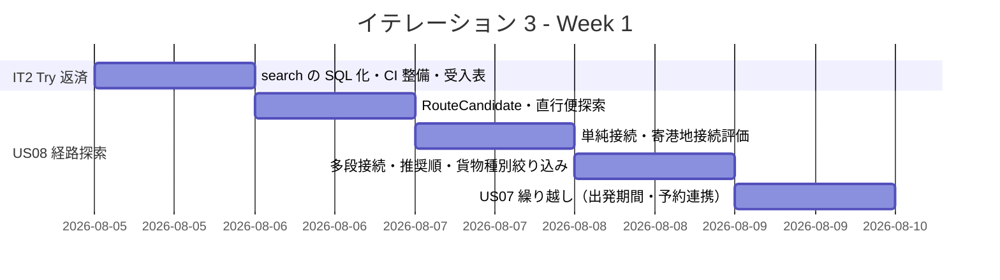
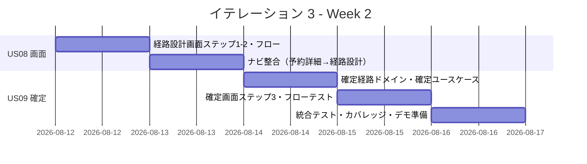
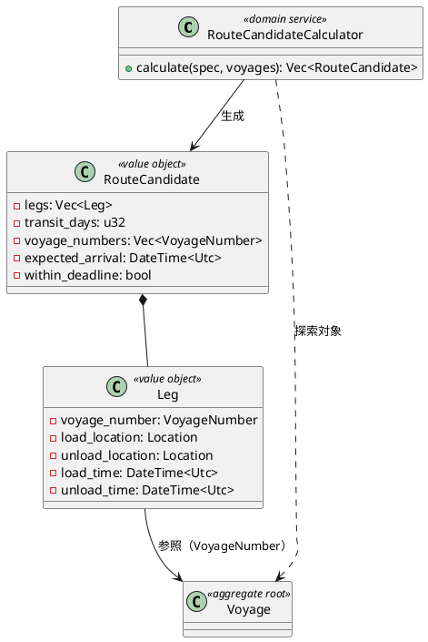
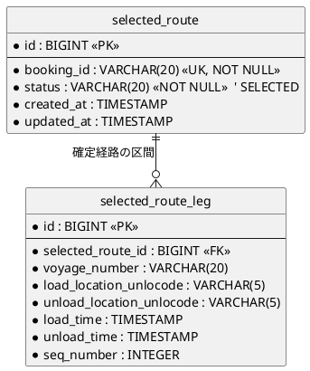
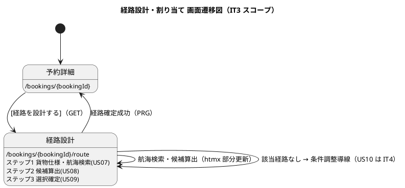

# イテレーション 3 計画

## 概要

| 項目 | 内容 |
|------|------|
| **イテレーション** | 3 |
| **期間** | Week 5-6（2 週間・2026-08-05 〜 2026-08-18） |
| **局面** | 中盤（インサイドアウト） |
| **ゴール** | 登録済み航海スケジュールから制約条件を満たす経路候補を自動算出し（US08）、候補を選択して経路を確定する（US09）フローを、経路設計・割り当て画面で成立させる |
| **目標 SP** | 11 |

---

## ゴール

### イテレーション終了時の達成状態

1. **経路探索ドメインの確立**: `domain-routing` に経路候補（`RouteCandidate`）と経路探索ドメインサービス（`RouteCandidateCalculator`）をインサイドアウトで実装し、直行便 → 単純接続（1 経由）→ 多段接続の順に接続可能性・期限充足・貨物種別対応を評価する。
2. **経路候補算出（US08）**: 経路設計・割り当て画面（`/bookings/{bookingId}/route`）で、予約番号に紐づく貨物仕様（出発地・目的地・期限・貨物種別）を確認し、登録済み Voyage から経路候補を推奨順に算出できる。
3. **経路選択・確定（US09）**: 算出された候補から 1 件を選択して経路を確定できる。Cargo への紐付け（BookingStatus 遷移）は IT4（US11）の責務とし、本 IT は Routing 内の経路確定までを担う。
4. **IT2 ふりかえり Try の反映**: US07 の未実装分（出発期間検索・予約番号連携）を本画面に統合し、Voyage 検索の N+1 を SQL 絞り込みへ改善し、CI に品質ゲート（カバレッジ・sqlx オフライン検証）を組み込む。

### 成功基準

- [ ] US08・US09 の全受入基準を満たす（受入基準をテストケースに 1:1 対応させて実証）
- [ ] `RouteCandidateCalculator` の単体テストが Red-Green-Refactor で作成されている（直行・単純接続・多段接続・期限超過・貨物種別不適合を網羅）
- [ ] 経路設計・割り当て画面の HTTP フローテストが green（算出・0 件時・選択確定）
- [ ] US07 の出発期間検索・予約番号からの貨物仕様確認を実装しテストで実証（IT2 繰り越し）
- [ ] `VoyageRepository::search` を SQL WHERE 絞り込みへ改善し、N+1 を解消（IT2 レビュー中 #7）
- [ ] CI に `cargo llvm-cov` カバレッジ計測・`cargo sqlx prepare --check` を組み込む（IT2 Try #4）
- [ ] `cargo clippy --workspace -- -D warnings` と `cargo fmt --check` が全 green・ドメイン層カバレッジ 85% 以上

---

## ユーザーストーリー

### 対象ストーリー

| ID | ユーザーストーリー | SP | 優先度 |
|----|-------------------|----|----|
| US08 | 経路候補を算出する | 8 | 必須 |
| US09 | 経路を選択・確定する | 3 | 必須 |
| **合計** | | **11** | |

### ストーリー詳細

#### US08: 経路候補を算出する

**ストーリー**:
> 経路設計者として、航海スケジュール検索結果をもとに、制約条件を考慮した経路候補を自動算出してほしい。なぜなら、手作業の属人化を解消し、制約条件を漏れなく考慮した最適経路を効率的に見つけられるからだ。

**受入条件**:

1. 航海スケジュール検索結果と出発地・目的地・期限を入力として経路候補が自動算出される
2. 寄港地の接続可能性が評価される
3. 経路候補ごとに所要日数・経由港・費用・航海番号が表示される
4. 経路候補が推奨順に並べられて提示される
5. 直行便がある場合、最優先候補として提示される
6. 期限内に到達可能な経路がない場合、その旨が通知され条件調整が促される

#### US09: 経路を選択・確定する

**ストーリー**:
> 経路設計者として、算出された経路候補から最適なものを選択し、経路を確定したい。なぜなら、最適経路を正式に確定し、予約への紐付けに進めるからだ。

**受入条件**:

1. 経路候補一覧（経由港・所要日数・費用・航海番号）を確認できる
2. 最適な経路候補を 1 件選択できる
3. 選択後、経路状態が「確定」になる
4. 最適な候補がない場合、経路条件調整（US10）に進める

> **US10 との境界**: 条件調整・再算出（US10）は IT4 のスコープ。本 IT では US09 受入 4 の「調整に進める」導線（案内・リンク）までとし、再算出ロジックは実装しない。

### タスク

#### 0. IT2 ふりかえり Try 返済枠（技術的負債返済・SP 外）

> IT3 冒頭で着手し、経路探索の土台を整える。詳細は [IT2 ふりかえり](./retrospective-2.md) Try #2・#4 を参照。

| # | タスク | 見積もり | 担当 | 状態 |
|---|--------|---------|------|------|
| 0.1 | `VoyageRepository::search` を SQL WHERE 絞り込みへ改善（全件ロード + Rust フィルタを廃止）・統合テストで検証 | 3h | - | [ ] |
| 0.2 | CI に `cargo llvm-cov`（カバレッジゲート）と `cargo sqlx prepare --check` を組み込む | 3h | - | [ ] |
| 0.3 | 受入基準 → テストケースの 1:1 対応表を US08/US09 で作成してからタスク着手（Try #1） | 1h | - | [ ] |

**小計**: 7h（理想時間）

#### 1. 経路探索ドメイン・算出（US08 / インサイドアウト起点）（8 SP）

| # | タスク | 見積もり | 担当 | 状態 |
|---|--------|---------|------|------|
| 1.1 | `RouteCandidate` 値オブジェクト（経由港・所要日数・航海番号列・到着予定・期限充足フラグ）の単体テスト → 実装 | 3h | - | [ ] |
| 1.2 | `RouteCandidateCalculator`（直行便探索）の単体テスト → 実装 | 3h | - | [ ] |
| 1.3 | `RouteCandidateCalculator`（単純接続 1 経由・寄港地接続評価）の単体テスト → 実装 | 4h | - | [ ] |
| 1.4 | `RouteCandidateCalculator`（多段接続・貨物種別対応絞り込み・推奨順ソート・期限超過警告）の単体テスト → 実装 | 4h | - | [ ] |
| 1.5 | US07 繰り越し: `VoyageRepository::search` に出発期間条件を追加し、予約番号から貨物仕様（出発地・目的地・期限・貨物種別）を取得する ACL/クエリを実装 | 3h | - | [ ] |
| 1.6 | app-routing に経路候補算出ユースケース（予約番号 → 貨物仕様 → Voyage 検索 → 候補算出）を実装・単体テスト | 3h | - | [ ] |
| 1.7 | interface-web に経路設計・割り当て画面（`/bookings/{bookingId}/route`）ステップ 1-2（貨物仕様表示・航海検索・候補算出）＋ HTTP フローテスト | 4h | - | [ ] |
| 1.8 | ナビゲーション整合: 予約詳細（`/bookings/{id}`）から `/bookings/{id}/route` への導線＋検証テスト | 2h | - | [ ] |

**小計**: 26h（理想時間）

#### 2. 経路選択・確定（US09）（3 SP）

| # | タスク | 見積もり | 担当 | 状態 |
|---|--------|---------|------|------|
| 2.1 | 確定経路（`SelectedRoute` / 経路確定状態）のドメイン表現と選択・確定ロジックの単体テスト → 実装 | 3h | - | [ ] |
| 2.2 | app-routing に経路確定ユースケース（候補選択 → 確定・永続化）を実装・単体テスト | 3h | - | [ ] |
| 2.3 | 経路設計・割り当て画面ステップ 3（候補ラジオ選択・htmx 部分更新・[確定] ボタン）＋ HTTP フローテスト（確定・0 件時の条件調整導線） | 4h | - | [ ] |

**小計**: 10h（理想時間）

#### タスク合計

| カテゴリ | SP | 理想時間 | 状態 |
|---------|----|----|------|
| IT2 Try 返済枠（SP 外） | - | 7h | [ ] |
| 経路探索ドメイン・算出（US08） | 8 | 26h | [ ] |
| 経路選択・確定（US09） | 3 | 10h | [ ] |
| **合計** | **11** | **43h** | |

**1 SP あたり**: 約 3.3h（返済枠除く実装のみ）
**進捗率**: 0% (0/11 SP)

---

## スケジュール

### Week 1（Day 1-5）

| 日 | タスク |
|----|--------|
| Day 1 | search の SQL 絞り込み化・CI 品質ゲート・受入基準テストケース対応表 |
| Day 2 | RouteCandidate 値オブジェクト・直行便探索の単体テスト → 実装 |
| Day 3 | 単純接続（1 経由）・寄港地接続評価 |
| Day 4 | 多段接続・貨物種別絞り込み・推奨順ソート・期限超過警告 |
| Day 5 | US07 繰り越し（出発期間検索・予約番号からの貨物仕様取得）・算出ユースケース |

### Week 2（Day 6-10）

| 日 | タスク |
|----|--------|
| Day 6 | 経路設計画面ステップ 1-2（貨物仕様・航海検索・候補算出）・HTTP フローテスト |
| Day 7 | 予約詳細 → 経路設計のナビ整合・検証テスト |
| Day 8 | 確定経路ドメイン・経路確定ユースケース |
| Day 9 | 確定画面ステップ 3（ラジオ選択・htmx・確定）・HTTP フローテスト |
| Day 10 | 統合テスト、カバレッジ確認、バグ修正、デモ準備 |

---

## 設計

> **対象スコープの設計図**: 本 IT スコープ（経路候補算出・選択確定）に絞り、(1) ドメインモデル図、(3) ER 図、(4) 画面遷移図を掲載する。**(2) 状態遷移図は省略する** — 経路確定状態は「未確定 → 確定」の単純遷移で状態機械を要さず、Cargo の BookingStatus 遷移（RouteProposed）は IT4（US11）の責務のため。

### ドメインモデル（Routing Context・IT3 追加分）

> **注（設計への反映が必要）**: `RouteCandidate` は現行 domain-model.md では Estimation Context の要素として定義されているが、IT3 では Routing Context の経路探索結果として実装する。両者の関係（見積時の候補と経路設計時の候補）を domain-model.md に整理する。`Leg`（輸送区間）は Booking Context の `CargoItinerary` 構成要素だが、経路候補の表現として Routing でも用いるため、共有の是非を設計に明記する。**費用**は Voyage に運賃データが無いため、IT3 では所要日数・経由港・航海番号・到着予定を算出し、費用は Billing/Estimation 連携（後続）に委ねる旨を注記する。

### データモデル（Routing Context・IT3）

> 経路候補は算出結果（一時データ）であり、確定した経路のみを永続化する。確定経路は `selected_route` テーブル（booking_id・経路の Leg 列）で保持する。IT3 で data-model.md に追加する。

### ユーザーインターフェース

- 経路設計・割り当て画面 `/bookings/{bookingId}/route`（ROLE_ROUTE_DESIGNER）: ステップ 1 貨物仕様確認＋航海検索（US07）→ ステップ 2 経路候補算出（US08）→ ステップ 3 選択確定（US09）。詳細は [UI 設計](../design/ui_design.md) の経路設計・割り当て画面を参照。

#### インタラクション

- **htmx パターン**: 航海検索・候補算出・候補選択は `hx-get`/`hx-post` で該当領域（`#route-candidates` 等）を部分更新する。
- **PRG パターン**: 経路確定の POST は成功時 `303 See Other` で `/bookings/{bookingId}` へリダイレクト。BookingStatus の `RouteProposed` 反映は IT4（US11）。
- **フィードバック**: 期限超過候補は `⚠` 付き警告、期限内経路なしは `alert-warning`（条件調整導線）、確定成功は `alert-success`。

### API 設計

| メソッド | エンドポイント | 説明 |
|---------|---------------|------|
| GET | `/bookings/{bookingId}/route` | 経路設計・割り当て画面（貨物仕様・航海検索・候補算出） |
| POST | `/bookings/{bookingId}/route/confirm` | 経路確定（US09・成功時 303 → `/bookings/{bookingId}`） |

### ADR

| ADR | タイトル | ステータス |
|-----|---------|-----------|
| ADR-XXXX | 経路探索アルゴリズムの範囲（内部 Voyage 探索・外部 ExternalRoutingService 連携の後続化） | 提案（IT3 で判断） |

---

## リスクと対策

| リスク | 影響度 | 対策 |
|--------|--------|------|
| 経路探索（多段接続）の組み合わせ爆発 | 中 | 段階実装（直行 → 1 経由 → 多段）で複雑度を管理し、探索深さ（経由数）に上限を設けてテストで固定する |
| RouteCandidate の Context 帰属（Estimation vs Routing）が設計とずれる | 中 | domain-model.md に見積時候補と経路設計時候補の関係を整理する注記を先に置き、実装は Routing 固有として進める |
| 費用データの欠如で US08 受入 3（費用表示）を満たせない | 中 | 費用は所要日数ベースの暫定表示 or「-」とし、正式費用は Billing/Estimation 連携（後続）とする方針を受入時に合意 |
| US09 の「確定」と Cargo 紐付け（US11・IT4）の境界が曖昧 | 中 | IT3 は Routing 内の経路確定（selected_route）まで、Cargo の RouteProposed 遷移は IT4 と明示。UI の BookingStatus 反映も IT4 |
| 11 SP のうち US08 が 8 SP と重い | 中 | 返済枠を Day 1 に圧縮し、US08 を段階実装で分割。多段接続（1.4）が未完なら 1 経由までで受入を成立させ多段は IT4 へ繰り越し可能に設計 |

---

## 完了条件

### Definition of Done

- [ ] コードレビュー完了（self-review、区切りで実施）
- [ ] ユニットテストがパス（経路探索ドメイン Red-Green-Refactor・受入基準 1:1 対応）
- [ ] testcontainers 統合テスト・HTTP フローテストがパス
- [ ] `cargo clippy --workspace -- -D warnings` エラーなし・`cargo fmt --check` 準拠
- [ ] ドメイン層カバレッジ 85% 以上（CI ゲートで検証）
- [ ] 機能がローカル環境（実 PostgreSQL・実ブラウザ）で動作確認済み
- [ ] ナビゲーション整合性（予約詳細 → 経路設計 → 検証テスト）を確認
- [ ] ドキュメント更新完了（ADR・domain-model/data-model/ui_design の設計差分）

### デモ項目

1. 経路設計者でログインし、予約の経路設計画面で貨物仕様を確認し航海を検索する（US07）
2. 経路候補が推奨順（直行便を最優先）に算出され、期限超過候補が警告表示される（US08）
3. 候補を 1 件選択して経路を確定する（US09）

---

## 更新履歴

| 日付 | 更新内容 | 更新者 |
|------|---------|--------|
| 2026-07-22 | 初版作成 | Claude Code |

---

## 関連ドキュメント

- [イテレーション 2 ふりかえり](./retrospective-2.md)（Try 反映元）
- [開発戦略](./development_strategy.md)
- [リリース計画](./release_plan.md)
- [イテレーション 3 ふりかえり](./retrospective-3.md)
