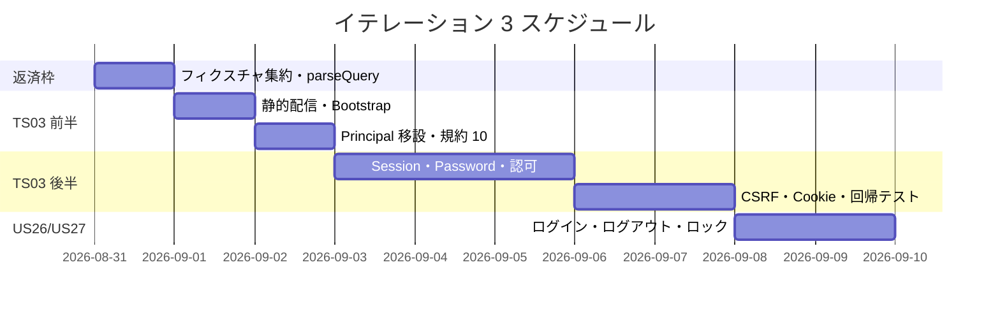
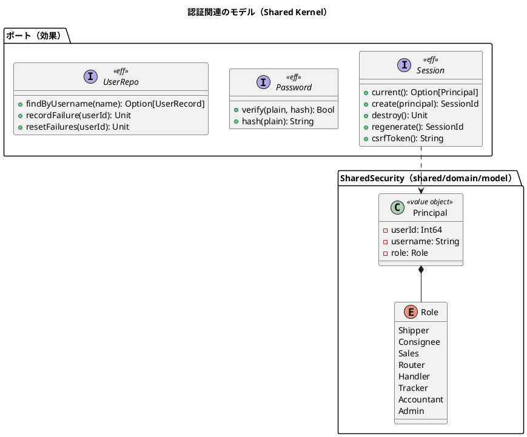
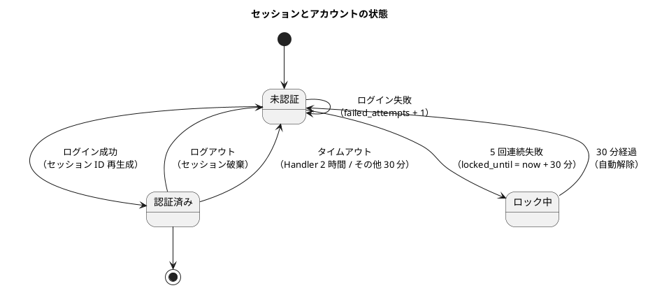
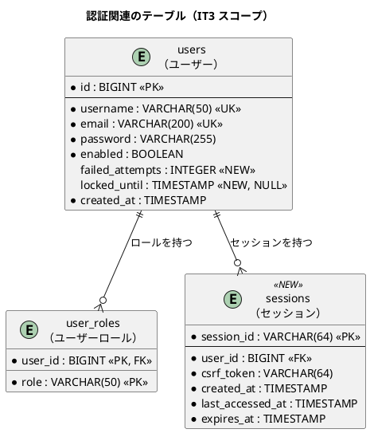
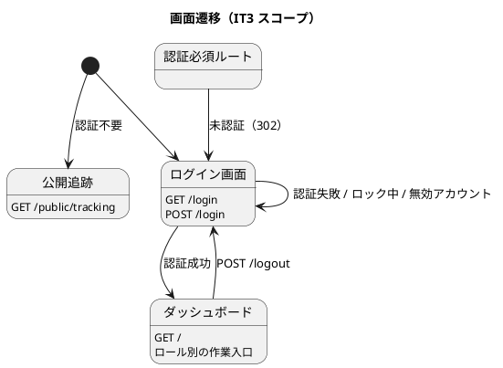

# イテレーション 3 計画

## 概要

| 項目 | 内容 |
|------|------|
| **イテレーション** | 3 |
| **期間** | Week 5-6（2026-08-31 〜 2026-09-11） |
| **局面** | 序盤（アウトサイドイン。[開発戦略](development_strategy.md) 参照） |
| **ゴール** | 自作の認証・認可基盤を確立し、ログイン・ログアウトを通す。あわせて IT2 で「価値が成立していない」と判明した UI の体裁を成立させる |
| **目標 SP** | 15 |

---

## ゴール

### イテレーション終了時の達成状態

1. **認証・認可基盤の確立**: DB セッション・CSRF・ロール判定がルーティング表を唯一の正典として機能する
2. **ログイン・ログアウトの成立**: US26・US27 の受入基準を満たす（アカウントロックを含む）
3. **UI の体裁が成立**: Bootstrap が読み込まれ、バッジ・カード・表が意図どおり表示される（IT2 レビュー H8）
4. **構造的負債の返済**: `Principal` / `Role` の置き場所を正し、`shared → BC 依存`を検査できる状態にする（IT2 レビュー H9・H10）

### 成功基準

- [ ] US26・US27 の受入基準がすべて満たされる
- [ ] セキュリティ回帰テスト 7 項目（[テスト戦略](../design/test_strategy.md) 8.4）が自動テストとして存在する
- [ ] 認可の可否表（全ルート × 全ロール）がテストで固定されている
- [ ] スマートフォン幅で公開追跡・ログイン・ダッシュボードが崩れずに表示される
- [ ] `arch-lint` に規約 10（`shared` は BC を参照しない）が追加され、違反 0 件
- [ ] CI が緑（`npm run dev:verify` + `arch:check`）
- [ ] SonarQube の Quality Gate が PASS（IT2 で未実施だった品質ゲート）

### 前イテレーションの Try の反映

| Try | 反映先 |
|:---:|--------|
| T1: フィクスチャは実コードの形で作る | 規約 10 の負例を実コード（`Composition.flix` の参照形）から作る（タスク 1.6） |
| T2: フィクスチャ生成を 1 箇所に集約し JDBC の形式のみを源とする | タスク 0.3（返済枠） |
| T3: 受入条件に「利用者が画面で確認できること」を入れる | 本計画の DoD に追加。タスク 2.7・3.6 で実画面確認 |
| T4: 静的ファイル配信を序盤の独立タスクに置く | **タスク 1.1-1.3（Day 1-2）**。余力次第にしない |
| T5: `Principal` / `Role` の移設と規約 10 を認証実装と同時に | タスク 1.4-1.6 |
| T6: ドキュメント整合の機械検査（`trace-lint`） | タスク 5.4 |
| T7: 見積もりを稼働 40h に収める | 下記「見積もりの収め方」 |
| T8: 表示ラベルを業務の言葉として読み上げる | DoD に追加 |

---

## ユーザーストーリー

### 対象ストーリー

| ID | ストーリー | SP | 優先度 | Issue |
|----|-----------|:--:|--------|-------|
| TS03 | 認証・認可基盤（DB セッション・CSRF・ロール・ミドルウェア） | 8 | 必須 | [#446](https://github.com/k2works/case-study-cargo-tracker/issues/446) |
| US26 | システムにログインする | 3 | 必須 | [#447](https://github.com/k2works/case-study-cargo-tracker/issues/447) |
| US27 | システムからログアウトする | 1 | 必須 | [#448](https://github.com/k2works/case-study-cargo-tracker/issues/448) |
| TS05b | CI/CD の残り（E2E・日次の実 PostgreSQL・Trivy・SonarQube） | 3 | 必須 | [#449](https://github.com/k2works/case-study-cargo-tracker/issues/449) |
| **合計** | | **15** | | |

GitHub Project: [CargoTracker flix/take-1](https://github.com/users/k2works/projects/39)

> **静的ファイル配信（IT2 レビュー H8）と構造的負債の返済（H9・H10）は SP を増やさず、
> TS03 の内側で扱う**。いずれも認証実装の前提（ログイン画面が体裁を持つこと・`Principal` が
> 正しい層にあること）であり、独立したストーリーとして切り出す価値がないため。

### ストーリー詳細

#### TS03: 認証・認可基盤

**ストーリー**:
> 開発チームとして、認証・認可・セッション・CSRF を自作の基盤として確立したい。
> なぜなら、フレームワークを持たない本プロジェクトで最大のリスクは自作セキュリティであり、
> 業務機能を積む前にこれを固めなければ、後続すべてが不安定な土台の上に乗るからだ。

**受入条件**:

1. `Session` 効果が定義され、DB 実装（`sessions` テーブル）とインメモリ実装を差し替えられる
2. `Password` 効果が BCrypt（コスト 12）を隠蔽し、平文がログ・レスポンス・DB に現れない
3. 認可判定がルーティング表の `RequiredRole` のみに基づく（パス文字列での分岐を作らない）
4. 未認証で認証必須ルートへアクセスすると `/login` へリダイレクトされる
5. 認証済みでロール不足の場合は 403 を返す
6. `Components.form` の CSRF トークンが自動付与され、状態変更メソッドで検証される
7. Cookie に `HttpOnly` / `SameSite=Lax` が付与される（`Secure` は本番のみ）
8. 認証成功時にセッション ID が再生成される（セッション固定攻撃対策）

**注（設計への反映が必要）その 1 — `sessions` テーブルが未定義**:
[バックエンドアーキテクチャ](../design/architecture_backend.md) は DB セッションストアを要求するが、
[データモデル設計](../design/data-model.md) に `sessions` テーブルの定義がない。
本イテレーションで `V3__add_sessions.sql` を追加し、データモデル設計へ同一コミットで反映する（タスク 2.1）。

**注（設計への反映が必要）その 2 — アカウントロック用のカラムが未定義**:
[非機能要件](../design/non_functional.md) 4.1 と US26 の受入基準は「ログイン失敗 5 回でロック（30 分自動解除）」を
要求するが、`users` テーブルに失敗回数・ロック期限のカラムがない。
`failed_attempts INTEGER` と `locked_until TIMESTAMP`（NULL 許容）を追加し、データモデル設計へ反映する（タスク 2.1）。

**注（設計への反映が必要）その 3 — ロールの永続化値と Flix enum の対応**:
`user_roles.role` は `ROLE_SHIPPER` 形式、Flix の `Role` は `Shipper` である。
[バックエンドアーキテクチャ](../design/architecture_backend.md) のロール表が対応の正典だが、
**変換関数の所在が決まっていない**。`SharedSecurity`（新設）に `roleFromPersisted` / `roleToPersisted` を置く（タスク 1.5）。

**注（設計への反映を実施済み）その 4 — ログイン識別子とエラー文言**:
検証で 2 件の不整合を検出し、**UI 設計を正典として是正した**（IT2 タスク 0.3 と同じ扱い）。

| 不整合 | 是正内容 |
| :--- | :--- |
| ユーザーストーリーは「利用者 ID」、UI 設計は「ユーザー名」 | UI 設計に合わせ、ユーザーストーリー側を「ユーザー名」へ更新 |
| UI 設計のワイヤーフレームの入力例がメールアドレス（`yamada@example.com`）だが、ラベルは「ユーザー名」。`users` は `username` と `email` の両方が UK で、どちらで認証するか不明だった | **`users.username` で認証する**ことを UI 設計に明記。`email` は通知用と定義 |

**注（設計への反映を実施済み）その 5 — ダッシュボードの段階的実装**:
[UI 設計](../design/ui_design.md) のダッシュボードはサマリーカード（予約件数・輸送中・未割り当て・未払い請求）と
最新荷役作業の一覧を持つが、これらは Booking / Tracking / Handling / Billing の実装後でなければ表示できない。
**IT3 ではロール別の作業入口のみ**とする旨を UI 設計へ注記した。

**注 — 同時セッション数 1 の扱い**:
非機能要件は「同一ユーザーの同時セッション数 1」を求めるが、荷役作業員の共用アカウント運用では
現場を阻害する可能性が指摘されている。**本イテレーションで ADR-0003 として判断する**（タスク 2.8）。
実装は ADR の結論に従う。

#### US26: システムにログインする

**受入条件**（[ユーザーストーリー](../requirements/user_story.md) より）:

| # | 受入基準 | IT3 で満たすか | 対応タスク |
|:--:|---------|:---:|-----------|
| 1 | ユーザー名とパスワードを入力してログインできる | **満たす** | 3.1-3.2 |
| 2 | ログイン成功後、ロールに応じたダッシュボードが表示される | **満たす**（ロール別の作業入口を出す。各機能は未実装のため導線のみ） | 3.4 |
| 3 | 認証情報が一致しない場合、「ユーザー名またはパスワードが正しくありません」と表示される | **満たす** | 3.3 |
| 4 | 認証失敗が 5 回連続するとアカウントが一時ロックされ、利用者に通知される | **満たす**（画面通知。メール通知は対象外） | 3.5 |
| 5 | 無効化されたアカウントではログインできず、管理者への問い合わせが案内される | **満たす** | 3.5 |
| 6 | ログイン成功・失敗がログに記録される | **満たす**（標準出力への構造化ログ。集約基盤は対象外） | 3.6 |
| 7 | 未ログイン状態で業務機能（US18 を除く）にアクセスするとログイン画面に誘導される | **満たす** | 1.7 |

> **受入基準 4 の「通知」について**: ユーザーストーリーは通知手段を規定していない。
> メール送信基盤は本プロジェクトのスコープ外（[インセプションデッキ](../strategy/inception-deck.md) の「やらないこと」）のため、
> **ログイン画面での通知**をもって満たしたとする。この解釈をユーザーストーリー側に注記する（タスク 3.7）。

#### US27: システムからログアウトする

**受入条件**:

1. ログアウト操作でセッションが破棄され、ログイン画面に戻る
2. ログアウト後にブラウザバック等で業務画面へ戻れない（セッションが無効なため再度ログインへ誘導される）
3. ログアウト日時がログに記録される

#### TS05b: CI/CD の残り

**受入条件**:

1. E2E シナリオ④（公開追跡照会）と新規シナリオ（ログイン → ダッシュボード）が Playwright で実行される
2. `main` への push で E2E が実行される
3. 日次で実 PostgreSQL に対する統合テストが実行される
4. Trivy による脆弱性スキャンが PR で実行される
5. SonarQube の Quality Gate が PASS する

---

## タスク

### 0. 前 IT の Try への対応（返済枠・0 SP）

イテレーション序盤の独立コミット枠で処理する。

| # | タスク | 見積もり | 状態 |
|---|--------|:---:|:---:|
| 0.1 | T2: テストフィクスチャを `TrackingFixtures` へ集約し、JDBC が返す形式のみを源とする（「ETA あり」「ETA なし」を名前付きで） | 2h | [x] |
| 0.2 | `parseQuery` の単体テスト（`?a`・同名キー・デコード・null・空ペア）と空白入力の扱いを決めて固定 | 2h | [x] |
| 0.3 | 手順書 12 章の空のコードフェンスを埋める（IT2 レビュー L8） | 0.5h | [x] |

**小計**: 4.5h

### 1. TS03 前半: 基盤の整地と静的配信（8 SP のうち 3 SP）

| # | タスク | 見積もり | 状態 |
|---|--------|:---:|:---:|
| 1.1 | 【RED→GREEN】静的ファイル配信（`GET /static/**`）。Content-Type・パストラバーサル防止を含む | 3h | [x] |
| 1.2 | Bootstrap 5.3 / htmx 2.0 を `resources/static/` へ配置し、`Layout.page` から読み込む | 2h | [x] |
| 1.3 | スマートフォン幅で公開追跡が崩れないことを実画面で確認する（Try T3） | 1h | [x] |
| 1.4 | `SharedSecurity`（`shared/domain/model/`）を新設し、`Role` / `Principal` を移設する | 2h | [x] |
| 1.5 | ロールの永続化値 ⇄ `Role` の変換関数を `SharedSecurity` に置く | 1h | [x] |
| 1.6 | 合成ルートを `src/composition/` へ移し、`arch-lint` に規約 10（`shared` は BC を参照しない）を追加。負例は実コードの参照形から作る（Try T1） | 3h | [x] |
| 1.7 | 【RED】未認証で認証必須ルートへアクセスするとログイン画面へ誘導される受入テスト | 2h | [x] |

**小計**: 14h

### 2. TS03 後半: 認証・認可の実装（8 SP のうち 5 SP）

| # | タスク | 見積もり | 状態 |
|---|--------|:---:|:---:|
| 2.1 | `V3__add_sessions_and_lockout.sql`（`sessions` テーブル・`users` のロック用カラム）を追加し、データモデル設計へ反映する | 2h | [x] |
| 2.2 | 【RED→GREEN】`Password` 効果（BCrypt コスト 12）とインメモリ実装 | 2h | [x] |
| 2.3 | 【RED→GREEN】`Session` 効果と DB 実装（作成・参照・破棄・タイムアウト） | 4h | [x] |
| 2.4 | 【RED→GREEN】認可ミドルウェア（`RequiredRole` の検証・302 / 403 の出し分け） | 3h | [x] |
| 2.5 | 【RED→GREEN】CSRF トークンの生成・`Components.form` への注入・検証 | 3h | [x] |
| 2.6 | Cookie 属性（`HttpOnly` / `SameSite=Lax` / 本番のみ `Secure`）とセッション ID 再生成 | 2h | [x] |
| 2.7 | セキュリティ回帰テスト 7 項目（テスト戦略 8.4）を実装する | 4h | [x] |
| 2.8 | ADR-0003（同時セッション数 1 の扱い）を起票し、結論を実装へ反映する | 2h | [x] |

**小計**: 22h

### 3. US26 / US27: ログイン・ログアウト（4 SP）

| # | タスク | 見積もり | 状態 |
|---|--------|:---:|:---:|
| 3.1 | 【RED】ログイン → ダッシュボードの受入テスト（HTTP） | 2h | [x] |
| 3.2 | 【GREEN】ログイン画面（`GET /login`）と認証処理（`POST /login`） | 3h | [x] |
| 3.3 | 認証失敗時のメッセージ（ユーザー名の存否を漏らさない一律の文言）と `/login?timeout` の表示 | 1.5h | [x] |
| 3.4 | ダッシュボード（`GET /`）。ロール別の作業入口を出す（サマリーカードは各 BC の実装時。UI 設計へ注記済み） | 1.5h | [x] |
| 3.5 | アカウントロック（5 回失敗・30 分）と無効アカウントの案内 | 3h | [x] |
| 3.6 | ログイン成功・失敗・ログアウトの構造化ログ。実画面で確認する（Try T3） | 2h | [x] |
| 3.7 | 受入基準 4 の「通知」の解釈をユーザーストーリーへ注記する | 0.5h | [x] |
| 3.8 | 【RED→GREEN】ログアウト（`POST /logout`）とセッション破棄 | 2h | [x] |

**小計**: 15.5h

### 4. TS05b: CI/CD の残り（3 SP）

| # | タスク | 見積もり | 状態 |
|---|--------|:---:|:---:|
| 4.1 | Playwright のセットアップと E2E シナリオ④（公開追跡照会） | 3h | [ ] |
| 4.2 | E2E シナリオ（ログイン → ダッシュボード → ログアウト） | 2h | [ ] |
| 4.3 | `main` への push で E2E を実行するジョブを追加 | 1h | [ ] |
| 4.4 | 日次の実 PostgreSQL 統合テストジョブ | 2h | [ ] |
| 4.5 | Trivy スキャンを PR ジョブへ追加 | 1h | [ ] |
| 4.6 | SonarQube の設定（`sonar-project.properties`）と Quality Gate の確認 | 3h | [x]（設定まで。実行は要トークン） |

**小計**: 12h

> **TS05b の着地**（計画時の縮退順序に従う）:
>
> | タスク | 状態 | 判断 |
> | :--- | :--- | :--- |
> | 4.6 SonarQube | 設定のみ完了 | **SonarQube は Flix を解析できない**ことが判明。スキャン対象を `ops/scripts`（`arch-lint` を含む）に限定した。実行には `SONAR_TOKEN` が要るため、クローズ時に実施する |
> | 4.1-4.3 E2E | **IT4 へ** | 計画時に定めた縮退順序 1。認証の E2E は IT4 の最優先とする |
> | 4.4 日次 PostgreSQL・4.5 Trivy | **IT4 へ** | 着手前に IT4 送りと確定済み |
>
> Flix 本体の品質ゲートは `arch-lint`（規約 10 件）・セキュリティ回帰テスト・
> トレーサビリティ表で担保する（[テスト戦略](../design/test_strategy.md) 6.3）。

### 5. ドキュメント整合（0 SP・返済枠）

| # | タスク | 見積もり | 状態 |
|---|--------|:---:|:---:|
| 5.1 | 認可の可否表（全ルート × 全ロール）を作成し、テストと対応づける | 2h | [x] |
| 5.2 | ビジネスルール ⇄ テスト対応表へ認証関連のルールを追加 | 1h | [x] |
| 5.3 | `arch-lint` 規約仕様へ規約 10 を追記 | 1h | [x] |
| 5.4 | T6: `trace-lint`（US 番号とトレーサビリティ表の突合）を実装し CI へ載せる | 3h | [ ] |

**小計**: 7h

### タスク合計

| カテゴリ | SP | 理想時間 |
|---------|:--:|:---:|
| 返済枠（前 IT の Try） | 0 | 4.5h |
| TS03 前半（整地・静的配信） | 3 | 14h |
| TS03 後半（認証・認可） | 5 | 22h |
| US26 / US27 | 4 | 15.5h |
| TS05b | 3 | 12h |
| ドキュメント整合 | 0 | 7h |
| **合計** | **15** | **75h** |

### 見積もりの収め方（Try T7）

**75h は稼働 40h の 1.9 倍であり、このままでは収まらない。** IT1・IT2 と同じ轍を踏まないため、
**着手前に IT4 送りを確定させる**。

| 送るタスク | 時間 | 判断理由 |
|-----------|:---:|---------|
| 4.4 日次の実 PostgreSQL 統合テスト | 2h | 本番相当の検証は BC が揃う中盤以降に価値が出る |
| 4.5 Trivy | 1h | 依存は 7 つで固定されており、変化が少ない |
| 5.4 `trace-lint` | 3h | ドキュメントのずれは検知したい。ただし認証の完成が優先 |
| （3.4 は検証で 1.5h へ縮小済み。UI 設計の段階的実装の注記による） | - | - |

**送付後の見積もり: 69h**。それでも超過するため、以下を**縮退の順序**として明示する。

1. 4.1・4.2（E2E・5h）→ IT4。ただし**認証の E2E は IT4 の最優先**とする
2. 2.8（ADR-0003・2h）→ 判断のみ行い、実装は IT4

**TS03 と US26 / US27 は削らない**。認証が中途半端な状態で IT4 の業務機能に進むと、
すべての機能が不確かな認可の上に乗るため。

---

## スケジュール

| 日 | タスク |
|----|--------|
| Day 1 | 0.1-0.3（返済枠） |
| Day 2 | 1.1-1.3（静的配信・Bootstrap・実画面確認） |
| Day 3 | 1.4-1.7（Principal 移設・規約 10・誘導テスト） |
| Day 4-6 | 2.1-2.4（`sessions`・Password・Session・認可） |
| Day 7-8 | 2.5-2.7（CSRF・Cookie・セキュリティ回帰テスト） |
| Day 9 | 3.1-3.5（ログイン・ロック） |
| Day 10 | 3.6-3.8（ログ・ログアウト）、4.6（SonarQube）、デモ準備 |

---

## 設計

本イテレーションのスコープに絞って掲載します。

### ドメインモデル（認証まわり）

認証は業務ドメインではなく**共有カーネルの関心事**として扱う。
Bounded Context 固有の集約は本イテレーションでは追加しない。

> **`Principal` を `shared/domain/model` に置く理由**: IT2 では `SharedHtmlLayout`（HTML 描画）に
> 定義していたが、認証基盤が画面モジュールに依存する形になり依存の向きが逆転する（IT2 レビュー H10）。

### 状態遷移（セッションとアカウント）

### ER 図（本 IT で追加・変更するテーブル）

> `sessions` テーブルと `users` のロック用カラムは、いずれも本イテレーションで
> [データモデル設計](../design/data-model.md) へ反映する（タスク 2.1）。

### 画面遷移図（本 IT スコープ）

---

## リスク

| リスク | 影響度 | 対応 |
|--------|:---:|------|
| **自作認証の実装欠陥**（本プロジェクト最大のリスク） | 高 | セキュリティ回帰テスト 7 項目を受入条件とする（タスク 2.7）。テストのない防御は実装しない |
| 見積もり 76h が稼働 40h を大きく超過 | 高 | **着手前に IT4 送りを確定**（7.5h）。さらに縮退の順序を明示済み |
| BCrypt（jBCrypt）が Flix の Java 相互運用で動かない | 中 | Day 4 の早い段階で疎通を確認する。動かない場合は JDK 標準の PBKDF2 へ切り替え、ADR に記録する |
| `sessions` テーブルの設計が非機能要件（同時セッション 1）と噛み合わない | 中 | ADR-0003（タスク 2.8）で先に判断してから実装する |
| 静的ファイル配信でパストラバーサルを作り込む | 中 | 配信対象を許可リスト（拡張子・ディレクトリ）に限定し、テストで固定する |
| Playwright の導入が Flix のビルドと噛み合わない | 低 | E2E は Docker 上の JAR に対して実行する。噛み合わない場合は IT4 送り（縮退順序 1） |

---

## Definition of Done

- [ ] US26・US27 の受入基準がすべて満たされる
- [ ] セキュリティ回帰テスト 7 項目が自動テストとして存在し、緑である
- [ ] 認可の可否表（全ルート × 全ロール）がテストで固定されている
- [ ] `arch-lint` が規約 10 を含めて違反 0 件、メタテストが全件成功
- [ ] `npm run dev:verify` が全件成功する
- [ ] CI が緑
- [ ] SonarQube の Quality Gate が PASS
- [ ] **実画面で確認する**（Try T3）: ログイン → ダッシュボード → ログアウトをブラウザで通し、スマートフォン幅でも崩れないこと
- [ ] **表示ラベルを業務の言葉として読み上げる**（Try T8）: 画面に出る文言に内部語（列挙値・技術用語）が混じっていないこと
- [ ] 設計ドキュメントへの反映（`sessions` テーブル・ロック用カラム・認可可否表・規約 10）が実装と同一コミットで行われている
- [ ] ビジネスルール ⇄ テスト対応表が更新されている

---

## デモ項目

| # | デモ項目 | 対応テスト |
|:--:|---------|-----------|
| 1 | 利用者 ID とパスワードでログインし、ロールに応じた作業入口が表示される | `LoginHttpTest.testLoginRedirectsToDashboard` |
| 2 | 誤ったパスワードで一律のメッセージが表示される | `LoginHttpTest.testShowsGenericFailureMessage` |
| 3 | 5 回失敗するとアカウントがロックされる | `LoginHttpTest.testLocksAccountAfterFiveFailures` |
| 4 | 未認証で `/` にアクセスすると `/login` へ誘導される | `AuthMiddlewareTest.testRedirectsAnonymousToLogin` |
| 5 | ロール不足のルートで 403 が返る | `AuthMiddlewareTest.testForbidsInsufficientRole` |
| 6 | CSRF トークンなしの POST が拒否される | `CsrfTest.testRejectsPostWithoutToken` |
| 7 | ログアウト後に業務画面へ戻れない | `LogoutHttpTest.testSessionIsInvalidatedAfterLogout` |
| 8 | 公開追跡が Bootstrap の体裁で表示される（スマートフォン幅を含む） | 実画面確認 + `StaticFilesTest` |

---

## 更新履歴

| 日付 | 更新内容 |
|------|---------|
| 2026-08-28 | 初版作成（IT3 開始準備） |
| 2026-08-28 | 整合性検証を反映（ログイン識別子・エラー文言・ダッシュボードの段階的実装・`/login?timeout`） |
| 2026-08-31 | 実装の進捗を反映（返済枠・TS03・US26・US27 を完了。TS05b とタスク 3.7 が残） |
