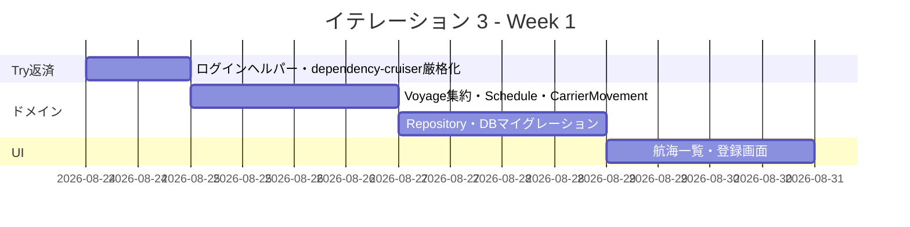
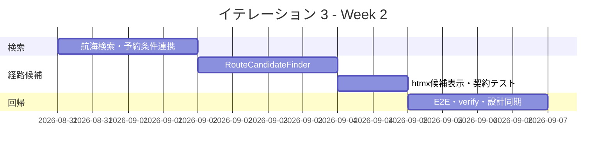
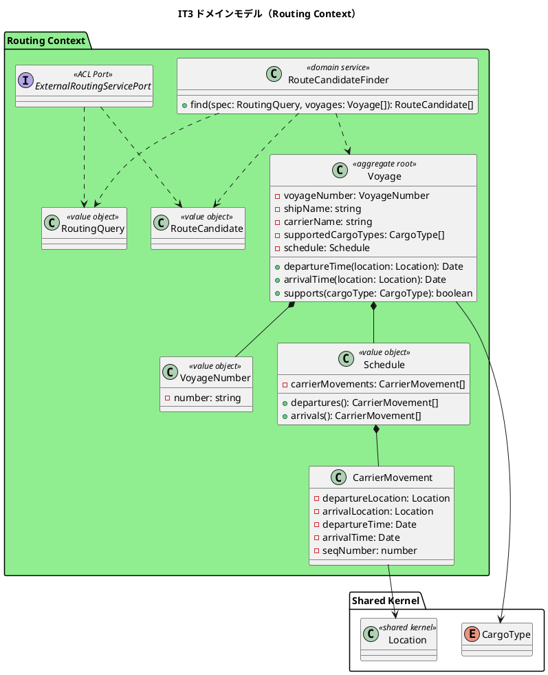
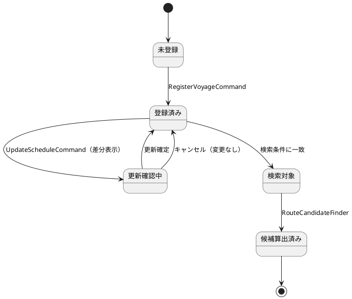
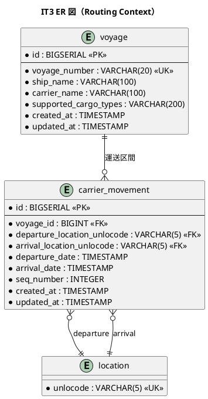
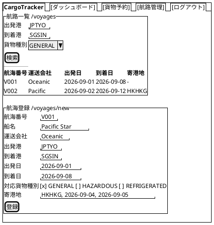
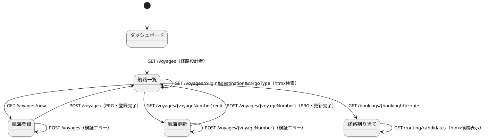

# イテレーション 3 計画

## 概要

| 項目 | 内容 |
|------|------|
| **イテレーション** | 3 |
| **期間** | 2026-08-24 〜 2026-09-06（Week 5-6） |
| **局面** | 中盤（インサイドアウト） |
| **ゴール** | Routing Context の中核ドメインを実装し、航海スケジュール登録・更新・検索から経路候補算出までを開発着手可能な形で計画する |
| **目標 SP** | 13 |

---

## ゴール

### イテレーション終了時の達成状態

1. **航海スケジュール基盤**: `Voyage` 集約・`Schedule`・`CarrierMovement` を実装し、登録・更新が永続化まで通る。
2. **航海検索**: 経路設計者が予約条件または検索条件から利用可能な航海を検索できる。
3. **経路候補算出**: 直行・寄港地接続・期限内到着を評価し、推奨順の候補を提示できる。

### 成功基準

- [ ] `US24` / `US25` / `US07` / `US08` の受入基準をテストで 1:1 に確認する。
- [ ] 中盤方針どおり、ドメイン層の不変条件・経路算出ルールを単体テストから Red-Green-Refactor で進める。
- [ ] 日付・期限判定は日付単位比較を既定にし、当日着と時刻付き到着の境界テストを含める。
- [ ] Routing Context の入力エラーは `ValidationError` 系で分類し、利用者提示エラーと内部障害を分離する。
- [ ] `npm run verify` と IT3 デモ E2E が green である。
- [ ] ドメイン層カバレッジ 85% 以上、全体カバレッジ 80% 以上を維持する。

---

## ユーザーストーリー

### 対象ストーリー

| ID | ユーザーストーリー | SP | 優先度 | 対応 UC |
|----|-------------------|----|--------|---------|
| US24 | 航海スケジュールを新規登録する | 3 | 必須 | UC19 |
| US25 | 既存航海スケジュールを更新する | 2 | 必須 | UC19 |
| US07 | 航海スケジュールを検索する | 3 | 必須 | UC05 |
| US08 | 経路候補を算出する | 5 | 必須 | UC06 |
| **合計** | | **13** | | |

### ストーリー詳細

#### US24: 航海スケジュールを新規登録する

**ストーリー**:
> 経路設計者として、各運送会社が公開している航海スケジュール（航海番号・船名・出発港・到着港・出発日・到着日・寄港地・対応貨物種別）をシステムに新規登録したい。なぜなら、最新の運航情報をシステムに反映することで、経路候補の算出精度が上がり荷主に正確な経路・所要日数を提案できるからだ。

**受入条件**:

1. 航海番号・船名・運送会社・出発港（UN/LOCODE）・到着港（UN/LOCODE）・出発日・到着日・対応貨物種別を入力できる。
2. 寄港地を複数かつ順序付きで入力できる。
3. 必須項目が未入力の場合、未入力箇所を明示したエラーが表示される。
4. 出発日が到着日より後の場合、日付の整合性エラーが表示される。
5. 同一航海番号がシステムに存在しない場合、登録が完了し登録番号が発行される。
6. 登録後、UC05（航海スケジュール検索）の検索対象として利用できる。

#### US25: 既存航海スケジュールを更新する

**ストーリー**:
> 経路設計者として、運送会社が運航変更を発表した場合に、システムに登録済みの航海スケジュールを最新情報に更新したい。なぜなら、スケジュール変更を即座にシステムに反映することで、変更後の経路候補算出に誤りが生じるのを防げるからだ。

**受入条件**:

1. 既存の航海番号を指定して既登録スケジュールを呼び出せる。
2. 既存内容と更新内容の差分が確認画面に表示される。
3. 差分確認後に「更新する」を選択することで既存スケジュールが上書き更新される。
4. 更新後、UC05（航海スケジュール検索）の検索結果に更新内容が反映される。
5. 「キャンセル」を選択した場合、既存スケジュールは変更されない。

#### US07: 航海スケジュールを検索する

**ストーリー**:
> 経路設計者として、予約の出発地・目的地・期限をもとに、利用可能な航海スケジュールを検索したい。なぜなら、制約条件を満たす航海を特定し、経路候補算出の入力を準備できるからだ。

**受入条件**:

1. 予約番号を指定して出発地・目的地・期限・貨物仕様を確認できる。
2. 検索条件（出発地・目的地・出発期間・貨物種別）を入力して検索できる。
3. 制約条件（航海スケジュール・寄港地接続・港湾制約・貨物種別対応）に基づいて利用可能な航海が表示される。
4. 航海スケジュール一覧に航海番号・運送会社・出発日・到着日・寄港地が表示される。
5. 条件を満たす航海がない場合、その旨が表示され条件を緩和して再検索できる。
6. 危険物・冷凍貨物の場合、対応可能な航海のみに絞り込まれる。
7. 出発地・目的地は UN/LOCODE 形式で指定できる。

#### US08: 経路候補を算出する

**ストーリー**:
> 経路設計者として、航海スケジュール検索結果をもとに、制約条件を考慮した経路候補を自動算出してほしい。なぜなら、手作業の属人化を解消し、制約条件を漏れなく考慮した最適経路を効率的に見つけられるからだ。

**受入条件**:

1. 航海スケジュール検索結果と出発地・目的地・期限を入力として経路候補が自動算出される。
2. 寄港地の接続可能性が評価される。
3. 経路候補ごとに所要日数・経由港・費用・航海番号が表示される。
4. 経路候補が推奨順に並べられて提示される。
5. 直行便がある場合、最優先候補として提示される。
6. 期限内に到達可能な経路がない場合、その旨が通知され条件調整が促される。

### タスク

#### 1. IT2 Try 返済・基盤調整（0 SP）

| # | タスク | 見積もり | 担当 | 状態 |
|---|--------|---------|------|------|
| 1.1 | 統合テストのログイン共通ヘルパー化とセッション確立アサート追加（retry 依存解消） | 4h | - | [x] |
| 1.2 | dependency-cruiser の no-cross-context 例外を ACL 実態に合わせて厳格化 | 2h | - | [x] |
| 1.3 | Routing Context の `ValidationError` パターンと日付単位比較ヘルパーの設計確認 | 2h | - | [x] |

**小計**: 8h（理想時間）

#### 2. Routing Context ドメイン・DB（US24/US25、5 SP）

| # | タスク | 見積もり | 担当 | 状態 |
|---|--------|---------|------|------|
| 2.1 | `Voyage` 集約・`VoyageNumber`・`Schedule`・`CarrierMovement` の単体テスト（順序・接続・同一港禁止・日付整合） | 8h | - | [x] |
| 2.2 | マイグレーション 003: `voyage` / `carrier_movement` 追加、船名・運送会社・対応貨物種別カラムの設計差分を反映 | 6h | - | [x] |
| 2.3 | `RegisterVoyageService` / `UpdateScheduleService` と Repository ポートを実装 | 8h | - | [x] |
| 2.4 | Kysely Repository 統合テスト（重複 VoyageNumber・carrier_movement 入替トランザクション） | 6h | - | [x] |

**小計**: 28h（理想時間）

#### 3. 航海スケジュール UI・検索（US07、3 SP）

| # | タスク | 見積もり | 担当 | 状態 |
|---|--------|---------|------|------|
| 3.1 | `/voyages` 一覧・検索フォーム、`/voyages/new` 登録フォーム、`/voyages/{voyageNumber}/edit` 更新フォーム TSX | 8h | - | [x] |
| 3.2 | `VoyageController` の GET/POST/PRG と htmx 検索フラグメント統合テスト | 6h | - | [x] |
| 3.3 | `VoyageQueryService` で出発地・目的地・期間・貨物種別による SQL 絞り込みを実装 | 6h | - | [x] |
| 3.4 | 予約番号指定時に `ROUTING_IN_PROGRESS` 予約の条件を表示し、検索条件へ引き継ぐ | 4h | - | [x] |

**小計**: 24h（理想時間）

#### 4. 経路候補算出（US08、5 SP）

| # | タスク | 見積もり | 担当 | 状態 |
|---|--------|---------|------|------|
| 4.1 | `RouteCandidateFinder` ドメインサービスの単体テスト（直行優先・寄港地接続・期限内到着・該当なし） | 10h | - | [ ] |
| 4.2 | `ExternalRoutingServicePort` とフォールバック実装を定義し、IT2 のスタブ ACL 返済方針を実装に接続 | 6h | - | [ ] |
| 4.3 | 外部経路サービス契約テスト（nock 相当または fetch mock）とフォールバック時の統合テスト | 6h | - | [ ] |
| 4.4 | `/routing/candidates` htmx フラグメントで候補テーブル（所要日数・経由港・費用・航海番号）を返す | 6h | - | [ ] |
| 4.5 | IT3 デモ E2E（航海登録 → 検索 → 経路候補算出） | 6h | - | [ ] |

**小計**: 34h（理想時間）

#### タスク合計

| カテゴリ | SP | 理想時間 | 状態 |
|---------|----|----------|------|
| IT2 Try 返済・基盤調整 | 0 | 8h | [x] |
| Routing Context ドメイン・DB | 5 | 28h | [x] |
| 航海スケジュール UI・検索 | 3 | 24h | [x] |
| 経路候補算出 | 5 | 34h | [ ] |
| **合計** | **13** | **94h** | |

**1 SP あたり**: 約 7.2h
**進捗率**: 64%（60/94h 完了、タスク 1.1〜1.3・2.1〜2.4・3.1〜3.4 完了）

---

## スケジュール

### Week 1（2026-08-24 〜 2026-08-30）

| 日 | タスク |
|----|--------|
| Day 1 | IT2 Try 返済、Routing Context の骨格、依存ルール厳格化 |
| Day 2 | `Voyage` 集約・値オブジェクトの Red-Green |
| Day 3 | `Schedule` / `CarrierMovement` の時系列・接続制約 |
| Day 4 | マイグレーション 003 と Repository 統合テスト |
| Day 5 | `/voyages` 一覧・登録・更新フォームの縦貫通 |

### Week 2（2026-08-31 〜 2026-09-06）

| 日 | タスク |
|----|--------|
| Day 6 | 航海検索 Query Service と htmx 検索 |
| Day 7 | 予約番号指定時の条件表示、貨物種別絞り込み |
| Day 8 | 経路候補算出ドメインサービス |
| Day 9 | 外部経路 ACL / フォールバック / 候補フラグメント |
| Day 10 | IT3 デモ E2E、`npm run verify`、設計ドキュメント同期 |

---

## 設計

### ドメインモデル

出典: [domain-model.md](../design/domain-model.md) 第 3 章 Routing Context、外部システム ACL Ports、[development_strategy.md](development_strategy.md) 中盤方針。

### 状態遷移図

`Voyage` 自体は業務状態を持たないため、IT3 では登録・更新操作の処理状態だけを扱う。BookingStatus の `ROUTING_IN_PROGRESS` 以降の遷移は IT4 で扱う。

### データモデル

出典: [data-model.md](../design/data-model.md) Routing Context。`ship_name` / `carrier_name` / `supported_cargo_types` は US24 の受入基準に必要だが現行 data-model には未定義のため、本 IT で設計へ反映する。

### ユーザーインターフェース

#### ビュー

#### 画面遷移図

出典: [ui_design.md](../design/ui_design.md) 画面一覧・htmx 使用ガイドライン。`/voyages` は既存プレースホルダを実画面化する。

---

## リスクと対策

| リスク | 影響 | 対策 |
| :--- | :--- | :--- |
| `data-model.md` の Routing Context が US24 の船名・運送会社・対応貨物種別を欠いている | 高 | 本 IT の注として明記し、マイグレーション 003 と同時に data-model を同期する |
| 経路候補算出が過剰に複雑化する | 中 | IT3 は直行 + 1 寄港接続を主対象にし、複雑な最適化は ExternalRoutingServicePort のフォールバック境界に閉じる |
| Routing Context が Booking Context の `Cargo` を直接参照する | 高 | 予約条件は Query DTO / ACL 経由で受け取り、ドメイン層は `RoutingQuery` に依存する |
| 日付粒度バグの再発 | 高 | 当日着・時刻付き到着・日跨ぎ接続をドメイン単体テストに含める |
| `/voyages` プレースホルダ実画面化でスケルトン到達性が崩れる | 中 | nav-items / skeleton-reachability E2E を更新し、ROLE_ROUTE_DESIGNER の到達性を回帰確認する |

---

## 注（設計への反映が必要）

1. **voyage の属性追加**: US24 受入基準に必要な `ship_name`、`carrier_name`、`supported_cargo_types` が [data-model.md](../design/data-model.md) の `voyage` 表に未定義。本 IT で data-model とマイグレーションを同期する。
2. **Routing Context の検索・候補算出サービス**: [domain-model.md](../design/domain-model.md) は `Voyage` / `Schedule` / `CarrierMovement` を定義済みだが、`RouteCandidateFinder` と `RoutingQuery` は IT3 計画で具体化するため、実装時に要素表へ反映する。
3. **航海登録・更新画面の具体化**: [ui_design.md](../design/ui_design.md) は `/voyages` を航路一覧・登録・更新の入口として定義済みだが、`/voyages/new` と `/voyages/{voyageNumber}/edit` は未定義。本 IT で画面一覧・画面遷移図・salt ワイヤーフレームへ反映する。
4. **US04 見積連携の扱い**: IT2 Try T3 は IT3 or IT4 の持ち越し。IT3 では経路候補算出の入力整備を優先し、見積→予約の `EstimateId` 整合性は IT4 の予約確定フロー前までに完了させる。
5. **外部経路 ACL 返済**: ADR-007 の返済トリガーに従い、IT2 のスタブルート候補は Routing Context の `ExternalRoutingServicePort` + フォールバックへ段階移行する。

---

## 完了条件

### Definition of Done

- [ ] `US24` / `US25` / `US07` / `US08` の受入基準が単体・統合・E2E のいずれかで確認されている。
- [ ] `npm run verify` がパスしている。
- [ ] IT3 デモ E2E（航海登録 → 検索 → 経路候補算出）が green である。
- [ ] dependency-cruiser が green で、Routing Context 追加後も BC 独立性が保たれている。
- [ ] `data-model.md` / `domain-model.md` / `ui_design.md` の IT3 差分が実装と同期している。
- [ ] GitHub Project の IT3 Issue は Todo から開発着手時に In Progress へ更新できる状態になっている。

### デモ項目

- [ ] 経路設計者が `/voyages` に到達し、航海スケジュールを登録できる。
- [ ] 同一航海番号の登録時に既存との差分を確認して更新またはキャンセルできる。
- [ ] 予約番号または検索条件から利用可能な航海を検索できる。
- [ ] 危険物・冷凍貨物では対応可能な航海だけが表示される。
- [ ] 経路候補が所要日数・経由港・費用・航海番号付きで推奨順に表示される。
- [ ] 期限内に到達可能な経路がない場合、条件調整を促すメッセージが表示される。

---

## 更新履歴

| 日付 | 変更内容 | 作成者 |
|------|----------|--------|
| 2026-07-29 | IT3 開始準備として初版作成 | Codex |

## 関連ドキュメント

- [リリース計画](release_plan.md)
- [開発戦略](development_strategy.md)
- [イテレーション 2 ふりかえり](retrospective-2.md)
- [ユーザーストーリー](../requirements/user_story.md)
- [システムユースケース](../requirements/system_usecase.md)
- [ドメインモデル](../design/domain-model.md)
- [データモデル](../design/data-model.md)
- [UI 設計](../design/ui_design.md)
- [IT2 実装レビュー](../review/IT2実装_review_20260728.md)
