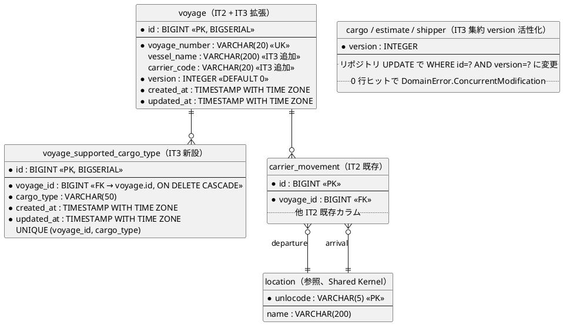
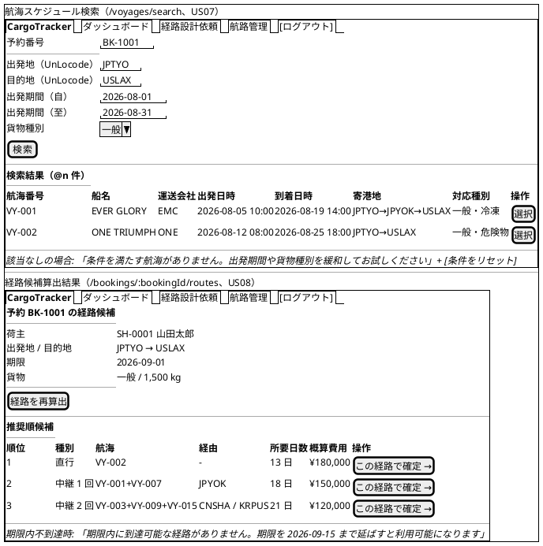
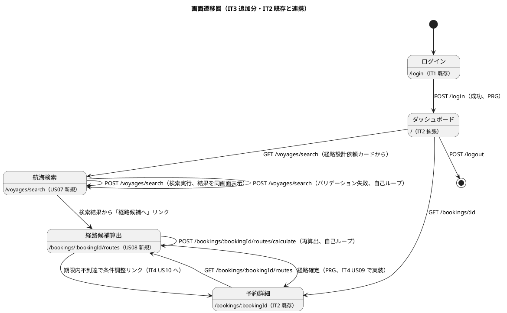

# イテレーション 3 計画

## 概要

| 項目 | 内容 |
|------|------|
| **イテレーション** | 3 |
| **期間** | Week 5-6（2026-07-20 〜 2026-08-02、2 週間） |
| **ゴール** | 航海スケジュール検索（US07）と経路候補算出（US08、Phase 2 最大リスク要素）を完成させる。IT2 申し送りの技術的負債を Day 1-2 で解消し、new_coverage 80% を復元する |
| **目標 SP** | 11（US07: 3 + US08: 8） |

---

## ゴール

### イテレーション終了時の達成状態

1. **Routing 検索**: 経路設計者が出発地・目的地・出発期間・貨物種別で航海スケジュールを検索でき、危険物・冷凍貨物の場合は対応航海のみに絞り込まれる
2. **経路候補算出**: IT2 Spike `RouteCandidateSearchSpike` を `routing.application.RouteCandidateSearch` に格上げし、料金スコアリング + 対応貨物種別フィルタ + 上位 N 候補選定 + P95 < 3 秒（非機能要件）
3. **データモデル追補**: 船名・運送会社・対応貨物種別カラムを `voyage` テーブルに追加（ADR で定義）
4. **楽観ロック完全活性化**: Cargo / Estimate / Shipper / Voyage に `version: Int` フィールドを追加し、`Either[DomainError.ConcurrentModification, A]` を返す
5. **テストカバレッジ復元**: Controller / Twirl / Dashboard 統合テストで new_coverage 80% に復元、SonarQube QG 完全 PASS

### 成功基準

- [ ] US07・US08 の受入基準すべてを満たす
- [ ] テストカバレッジ 80% 以上（IT2 末 78.67% → 復元）
- [ ] SonarQube QG 完全 PASS（new_coverage ≥ 80%）
- [ ] ScalaTest 全パス（IT2 末 158 件 → IT3 末 200 件以上）
- [ ] ArchUnit 5 ルール pass
- [ ] パフォーマンステスト pass: 経路候補算出 P95 < 3 秒（航海数 1000 件規模）
- [ ] ADR 0006（データモデル追補：voyage 船名・運送会社・対応貨物種別）を作成

---

## ユーザーストーリー

### 対象ストーリー

| ID | ユーザーストーリー | SP | 優先度 |
|----|-------------------|----|----|
| US07 | 航海スケジュールを検索する | 3 | 必須 |
| US08 | 経路候補を算出する | 8 | 必須 |
| **合計** | | **11** | |

### ストーリー詳細

#### US07: 航海スケジュールを検索する

**ストーリー**:
> 経路設計者として、予約の出発地・目的地・期限をもとに利用可能な航海スケジュールを検索したい。なぜなら、制約条件を満たす航海を特定し経路候補算出の入力を準備できるからだ。

**受入条件**:

1. 予約番号を指定して出発地・目的地・期限・貨物仕様を確認できる
2. 検索条件（出発地・目的地・出発期間・貨物種別）を入力して検索できる
3. 制約条件（航海スケジュール・寄港地接続・港湾制約・貨物種別対応）に基づいて利用可能な航海が表示される
4. 航海スケジュール一覧に航海番号・運送会社・出発日・到着日・寄港地が表示される
5. 条件を満たす航海がない場合、その旨が表示され条件を緩和して再検索できる
6. 危険物・冷凍貨物の場合、対応可能な航海のみに絞り込まれる
7. 出発地・目的地は UN/LOCODE 形式で指定できる

#### US08: 経路候補を算出する

**ストーリー**:
> 経路設計者として、航海スケジュール検索結果をもとに制約条件を考慮した経路候補を自動算出してほしい。なぜなら、手作業の属人化を解消し制約条件を漏れなく考慮した最適経路を効率的に見つけられるからだ。

**受入条件**:

1. 航海スケジュール検索結果と出発地・目的地・期限を入力として経路候補が自動算出される
2. 寄港地の接続可能性が評価される
3. 経路候補ごとに所要日数・経由港・費用・航海番号が表示される
4. 経路候補が推奨順に並べられて提示される
5. 直行便がある場合、最優先候補として提示される
6. 期限内に到達可能な経路がない場合、その旨が通知され条件調整が促される

**前提**: IT2 Spike `RouteCandidateSearchSpike` で DFS + 深さ制限の実装と純関数化が完了済み（ADR 0005）。IT3 では domain 格上げと業務要件追加で完成させる。

---

### タスク

#### 0. IT2 申し送り事項の解消（0 SP、技術的負債）

| # | タスク | 見積もり | 担当 | 状態 |
|---|--------|---------|------|------|
| 0.1 | Controller / Twirl / Dashboard の Play `FakeRequest` 統合テスト追加（CSRF / AuthFilter / Flash / PRG）。new_coverage 80% 復元 | 6h | - | [ ] |
| 0.2 | 集約 `Cargo` / `Estimate` / `Shipper` / `Voyage` に `version: Int` フィールド追加。`Either[DomainError.ConcurrentModification, A]` を返す Repository UPDATE に変更 | 5h | - | [ ] |
| 0.3 | `VoyageCommandService.register` / `update` + `VoyageController.create` / `update` の重複を `upsert(vn, build)` 共通骨格に抽出 | 2h | - | [ ] |
| 0.4 | `BookingCommandService.book` の `_ => "荷主が見つかりません"` を sealed エラー網羅 match に変更 | 1h | - | [x] |
| 0.5 | scoverage + Twirl + coverage モードの `NoClassDefFoundError` 再現条件特定 + build.sbt 修正 | 3h | - | [ ] |
| 0.6 | Dashboard 集計を `HomeController` から pure function 切り出し、テスト追加 | 2h | - | [x] |
| 0.7 | 危険物・冷凍フィールドの htmx 動的表示（IT2 ui_design.md 565 準拠） | 3h | - | [x] |
| 0.8 | 予約詳細に温度管理条件の表示追加（経路設計者が冷凍要件を確認できる） | 1h | - | [x] |
| 0.9 | `BookingCommandService.assignToRouting` / `book` の境界値・エラー経路網羅テスト | 3h | - | [x] |
| 0.10 | README に「動かし方」追加（ロール別ダッシュボード / シードユーザー / ログイン URL） | 1h | - | [x] |
| 0.11 | ScalaCheck プロパティテスト導入（ShipperId / Money / VoyageNumber 等の不変条件） | 3h | - | [x] |
| 0.12 | CHANGELOG / ADR 0005 リンクパス修正（リポジトリ名、相対パス化） | 1h | - | [x] |
| 0.13 | IT2 review 中 #13 ダッシュボードに「受領」「設計開始」等の次アクション追加（経路設計者の業務追跡が引き渡し後に止まらないように） | 2h | - | [x] |
| 0.14 | IT2 review 中 #14 release-0.1.0-gate-check.md の SonarQube QG セルを「PASS 項目 / ERROR 項目 / 判断根拠 / IT3 対応」の 4 行サブリストに分解、localhost URL コメント化 | 1h | - | [x] |
| 0.15 | IT2 review 中 #18 E2E フレーキネス対策（`page.waitForResponse` + seed エンドポイント、`networkidle` 禁止 lint 導入） | 2h | - | [x] |

**小計**: 36h（理想時間、0.13/0.14/0.15 追加で +5h）

#### 1. US07: 航海スケジュール検索（3 SP）

| # | タスク | 見積もり | 担当 | 状態 |
|---|--------|---------|------|------|
| 1.1 | データモデル追補 ADR 0006: (a) voyage に `vessel_name` / `carrier_code` 追加、(b) 中間テーブル `voyage_supported_cargo_type`（`id BIGSERIAL PK + voyage_id FK + cargo_type + UK(voyage_id, cargo_type) + 監査カラム`）新設、(c) Routing Context 用 `RouteCandidate` / `RoutingLeg` 値オブジェクトの新設（Estimation Context の既存 `RouteCandidate` と区別）。ADR 化と domain-model.md / data-model.md / ui_design.md への反映タスクを含む | 3h | - | [x] |
| 1.2 | Flyway V8: 上記カラム + 中間テーブル追加 | 1h | - | [x] |
| 1.3 | `Voyage` 集約に船名・運送会社・対応貨物種別を持たせ、`VoyageRepository.findByCriteria(origin, destination, period, cargoType)` を実装 | 3h | - | [x] |
| 1.4 | `VoyageQueryService.search(SearchVoyageCommand)` + ScalikeJDBC 実装（インデックス活用） | 3h | - | [x] |
| 1.5 | `VoyageController.search` + `views/voyage/search.scala.html`（条件入力 + 結果一覧 + 条件緩和ガイド） | 3h | - | [x] |
| 1.6 | ドメインユニット + 統合 + E2E テスト（一般・危険物・冷凍の 3 系統 + 該当なし） | 3h | - | [x] |

**小計**: 15h（5h/SP）

#### 2. US08: 経路候補算出（8 SP）

| # | タスク | 見積もり | 担当 | 状態 |
|---|--------|---------|------|------|
| 2.1 | IT2 Spike `RouteCandidateSearchSpike` を `routing.application.RouteCandidateSearch` に格上げ、`RoutingLeg` / `RouteCandidate` を `routing.domain.model.valueobjects` に移動 | 4h | - | [x] |
| 2.2 | 隣接リスト化（`legs.groupBy(_.from)`）で探索高速化（ADR 0005 IT3 申し送り） | 2h | - | [x] |
| 2.3 | 料金スコアリング統合（`PricingService` 連携、ADR 0003 経由）。経路候補ごとの費用算出 | 4h | - | [ ] |
| 2.4 | 対応貨物種別フィルタ（危険物 / 冷凍貨物に対応する航海のみで探索）。US05 受入条件 4 のフィルタロジック完成 | 3h | - | [x] |
| 2.5 | 上位 N 候補選定（直行便最優先、所要日数・費用の総合スコア） + 推奨順並び替え | 4h | - | [ ] |
| 2.6 | 期限内不到達時の通知 + 条件緩和ガイダンス | 2h | - | [ ] |
| 2.7 | `RoutingApplicationService.calculateCandidates(CalculateRouteCommand)` + Controller / 画面 | 6h | - | [ ] |
| 2.8 | パフォーマンステスト（航海数 1000 件規模で P95 < 3 秒、非機能要件） | 4h | - | [ ] |
| 2.9 | ドメインユニット + 統合 + E2E テスト（直行 / 中継 / 不到達 / 危険物フィルタ / 上位 N 件） | 6h | - | [ ] |

**小計**: 35h（4.4h/SP）

#### タスク合計

| カテゴリ | SP | 理想時間 | 状態 |
|---------|----|---------|------|
| IT2 申し送り解消 | 0（負債） | 36h | [ ] |
| US07 航海スケジュール検索 | 3 | 15h | [ ] |
| US08 経路候補算出 | 8 | 35h | [ ] |
| **合計** | **11** | **86h** | |

**1 SP あたり**: 約 7.8h（負債解消 36h を含む）。基本ストーリーのみだと約 4.5h/SP。

**注**: IT2 実装レビュー必須対応 5 件（#1 ダッシュボード「航路管理」リンク化 / #2 多区間追加 UI / #3 楽観ロック WHERE / #4 ArchUnit ルール 3 routing 追加 / #5 iteration_plan-2 サマリ更新）は IT2 完了承認前に消化済み（commit `87743bb4`）のため IT3 では取り扱わない。IT2 review の高優先 #5 → 計画では 0.6（Dashboard 集計切り出し）と統合済み。

---

## スケジュール

### Week 1（Day 1-5）

| 日 | タスク |
|----|--------|
| Day 1 | 0.1-0.4 申し送り解消（Controller テスト基盤、version 活性化、重複抽出） |
| Day 2 | 0.5-0.6 + 0.10-0.12（Twirl coverage、Dashboard、README、リンク修正、Scalacheck） |
| Day 3 | 0.7-0.9（htmx 動的、温度表示、境界値テスト）+ 1.1 ADR 0006 |
| Day 4 | 1.2-1.3 Flyway V8 + Voyage 集約拡張 + Repository.findByCriteria |
| Day 5 | 1.4-1.5 検索 Service + 検索画面 |

### Week 2（Day 6-10）

| 日 | タスク |
|----|--------|
| Day 6 | 1.6 US07 テスト一式 + 2.1 Spike 格上げ |
| Day 7 | 2.2 隣接リスト化 + 2.3 料金スコアリング |
| Day 8 | 2.4 対応貨物種別フィルタ + 2.5 上位 N 件選定 |
| Day 9 | 2.6-2.7 期限ガイダンス + アプリケーションサービス・Controller・画面 |
| Day 10 | 2.8 パフォーマンステスト + 2.9 全テスト整備 + IT3 レビュー + ふりかえり準備 |

---

## 設計

### ドメインモデル

IT2 で導入した Routing Context を IT3 で拡張する。`Voyage` 集約に船名・運送会社・対応貨物種別を追加し、`RoutingLeg` / `RouteCandidate` 値オブジェクトと `RouteCandidateSearch` アプリケーションサービスを新設する。コマンド命名・遷移は domain-model.md（line 442 / 585-625 / 651）+ ADR 0006（IT3 Day 3 作成予定）準拠。

```plantuml
@startuml
package "Auth（横断・IT1 既存）" {
  class User <<aggregate root>>
  enum Role {
    Sales
    RouteDesigner
    Tracker
    Settlement
    MasterAdmin
  }
  User "1" o-- "*" Role
}

package "Shipper Context（IT1+IT2 既存 + IT3 version 活性化）" {
  class Shipper <<aggregate root>> {
    + version : Int
    + assignToShipperType()...
  }
  class CorporateShipper
  CorporateShipper --|> Shipper
}

package "Estimation Context（IT1+IT2 既存 + IT3 version 活性化）" {
  class Estimate <<aggregate root>> {
    + version : Int
  }
  class EstimationRouteCandidate <<value object>> {
    .. Estimation 用 ..
    + voyageNumber
    + transitPorts
    + transitDays
    + estimatedCost : Money
  }
  enum EstimateStatus {
    Created
    Expired
  }
  Estimate "1" *-- "*" EstimationRouteCandidate
}

package "Booking Context（IT2 拡張 + IT3 version 活性化）" {
  class Cargo <<aggregate root>> {
    + version : Int
    + assignToRouting() : Either[DomainError, Cargo]
  }
  class CargoSpec <<value object>>
  enum BookingStatus
  Cargo *-- CargoSpec
  Cargo *-- BookingStatus
}

package "Routing Context（IT2 既存 + IT3 拡張）" {
  class Voyage <<aggregate root>> {
    + version : Int
    + vesselName : Option[String]
    + carrierCode : Option[String]
    + supportedCargoTypes : Set[CargoType]
    + supports(cargoType : CargoType) : Boolean
  }
  class VoyageNumber <<opaque type>>
  class Schedule <<value object>>
  class CarrierMovement <<entity>>
  class RoutingLeg <<value object>> {
    + voyageNumber : VoyageNumber
    + from : Location
    + to : Location
    + departure : Instant
    + arrival : Instant
  }
  class RoutingRouteCandidate <<value object>> {
    .. Routing 用、Estimation のものと区別 ..
    + legs : List[RoutingLeg]
    + transitDays : Long
    + estimatedCost : Money
    + isDirect : Boolean
    + voyages : List[VoyageNumber]
  }
  class SearchVoyageCriteria <<value object>> {
    + origin : Location
    + destination : Location
    + departurePeriodFrom : Instant
    + departurePeriodTo : Instant
    + cargoType : CargoType
  }
  interface VoyageRepository <<port>> {
    + findByVoyageNumber(VoyageNumber) : Option[Voyage]
    + findByCriteria(SearchVoyageCriteria) : Seq[Voyage]
    + save(Voyage) : Unit
  }
  class RouteCandidateSearch <<application service>> {
    + calculate(cmd : CalculateRouteCommand) : Either[DomainError, List[RoutingRouteCandidate]]
  }
  class VoyageQueryService <<application service>> {
    + search(criteria : SearchVoyageCriteria) : Seq[Voyage]
    + findByVoyageNumber(...) : Option[Voyage]
  }
  Voyage *-- VoyageNumber
  Voyage *-- Schedule
  Schedule *-- "1..*" CarrierMovement
  RoutingRouteCandidate *-- "1..*" RoutingLeg
}

package "Shared Kernel（IT1+IT2 既存）" {
  class Location <<value object>>
  class Money <<value object>>
  class ShipperId <<opaque type>>
  enum CargoType {
    General
    Hazardous
    Refrigerated
  }
  interface PricingService <<domain service>> {
    + estimateCost(origin, destination, cargoType, weight, candidateVoyage) : Either[Error, Money]
  }
  class DomainError <<sealed trait>>
  class ConcurrentModification <<case class>>
  class InvalidStatusTransition <<case class>>
  class UnreachableDestination <<case class>>
  ConcurrentModification --|> DomainError
  InvalidStatusTransition --|> DomainError
  UnreachableDestination --|> DomainError
}

RouteCandidateSearch ..> Voyage
RouteCandidateSearch ..> PricingService
VoyageQueryService ..> Voyage
CarrierMovement --> Location : departure
CarrierMovement --> Location : arrival
RoutingLeg --> Location : from
RoutingLeg --> Location : to
RoutingLeg --> VoyageNumber
Voyage ..> CargoType
@enduml
```



**実装規約（domain-model.md / IT2 から継続）**:

- 集約ルート・エンティティ: `final case class`（イミュータブル）、状態変更は `Either[DomainError, Self]` で新インスタンスを返す
- 値オブジェクト（単一値）: `opaque type` + スマートコンストラクタ（`apply` が `Either[DomainError, A]`）
- 値オブジェクト（複合値）: `final case class` + コンパニオンのスマートコンストラクタ
- **IT3 追加**: `RouteCandidate` は Routing と Estimation で別型（package で区別）。IT2 までの `Estimation.RouteCandidate` は温存、Routing は `RoutingRouteCandidate` 相当を新設（ADR 0006 で命名最終決定）

**不変条件（IT3 追加分）**:

1. `Voyage.supports(cargoType)` は `supportedCargoTypes` の空集合の場合「全種別対応」を意味する（互換性のため）
2. `SearchVoyageCriteria.apply` は `departurePeriodFrom < departurePeriodTo` を検証
3. `RoutingLeg.apply` は `from != to`、`departure < arrival` を検証
4. `RoutingRouteCandidate.apply` は `legs.nonEmpty`、連結条件（前到着地 == 次出発地、前到着時刻 ≤ 次出発時刻）を検証
5. `RouteCandidateSearch.calculate` は期限内到達不可で `Left(DomainError.UnreachableDestination(deadline))` を返す
6. **楽観ロック活性化**（IT2 タスク 0.11 の完全活性化）: Cargo / Estimate / Shipper / Voyage の各集約が `version: Int` を持ち、リポジトリ UPDATE 失敗時に `DomainError.ConcurrentModification` を返す

### データモデル

IT1+IT2 既存テーブル（users / user_roles / shipper / estimate / route_candidate / cargo / voyage / carrier_movement）+ refrigeration / version カラム）に加え、IT3 で `voyage` 拡張 3 カラム + 中間テーブル `voyage_supported_cargo_type` を新設する。data-model.md（line 755-779 / 1175 楽観ロック規約）準拠。



**マイグレーション**:

| バージョン | ファイル | 内容 |
|-----------|---------|------|
| V5-V7 | IT2 適用済み | shipper/estimate/cargo の version、cargo の refrigeration、voyage + carrier_movement |
| V8 | `V8__add_voyage_metadata_and_supported_cargo_type.sql` | (a) `ALTER TABLE voyage ADD COLUMN vessel_name VARCHAR(200), carrier_code VARCHAR(20)`、(b) `CREATE TABLE voyage_supported_cargo_type` + `UNIQUE(voyage_id, cargo_type)` |

**注**: 船名・運送会社は IT2 で「IT3 検索要件と合わせて追加」と注記済（iteration_plan-2.md L92）。今回 ADR 0006 で確定する。

### ユーザーインターフェース

#### ビュー

ui_design.md（line 71-130）の画面一覧に IT3 で 2 画面を追加する（タスク 1.1 ADR 0006 で ui_design.md にも反映）。ナビバーは IT2 から継続（RouteDesigner / MasterAdmin にのみ「航路管理」「経路設計依頼」表示）。



#### インタラクション



**htmx パターン（IT3 追加分）**:

- 航海検索（US07）: 結果テーブルのみ部分更新 → `hx-post="/voyages/search"` `hx-target="#search-result"` `hx-swap="innerHTML"` `hx-push-url="true"`
- 経路候補算出（US08）: 再算出時にローディングスピナー表示 → `hx-indicator="#calc-spinner"` + `hx-post="/bookings/:id/routes/calculate"`
- 危険物・冷凍フィールドの動的表示（IT2 申し送り 0.7）: 貨物種別 select の変更で `hx-get="/bookings/cargo-type-fields"` `hx-target="#cargo-type-fields"` `hx-trigger="change"`
- パフォーマンスインジケータ（US08 P95 < 3 秒目標）: `hx-indicator` でスピナーを必ず表示し、3 秒超は警告

**フィードバックメッセージ**（Bootstrap 5 alert、IT1+IT2 規約継続）:

| 種別 | スタイル | IT3 で利用する例 |
|------|---------|------|
| 成功 | `alert-success` | 「経路を確定しました」（IT4 で活性化） |
| 警告 | `alert-warning` | 「他のユーザーが先に更新しました。最新内容を読み込んで再度更新してください」（楽観ロック競合、IT3 で全集約に活性化） |
| 情報 | `alert-info` | 「条件を満たす航海がありません」「期限内に到達可能な経路がありません」 |
| エラー | `alert-danger` | 「貨物種別が不正です」「経路算出処理に失敗しました（システム障害）」 |

**htmx エラーハンドリング**:

- `htmx:responseError` で 409（楽観ロック競合）を捕捉し `alert-warning` を表示
- 422（バリデーション）は自己ループ
- 500 / 504 は `alert-danger`、P95 SLA 違反時にエラーログ + 警告通知

### ディレクトリ構成

IT2 から継続するレイアウトを維持しつつ、IT3 で `routing/` を拡張する。

```
app/cargotracker/
├── auth/                                # IT1 既存 + IT3 統合テスト追加
├── shared/                              # IT1+IT2 既存 + IT3 拡張
│   ├── domain/
│   │   ├── Location.scala
│   │   ├── Money.scala
│   │   ├── DomainError.scala            # + UnreachableDestination
│   │   └── OptimisticLockException.scala
│   └── interfaces/web/
│       └── layout/{main,nav}.scala.html
├── shipper/                             # IT3: 集約 version 活性化
│   ├── domain/model/aggregates/Shipper.scala  # + version: Int
│   ├── infrastructure/repositories/             # 楽観ロック WHERE + ConcurrentModification
│   └── ...（IT1+IT2 既存）
├── estimation/                          # IT3: 集約 version 活性化（同パターン）
├── booking/                             # IT2 既存 + IT3 拡張
│   ├── domain/model/aggregates/Cargo.scala     # + version: Int
│   ├── infrastructure/repositories/             # 楽観ロック WHERE
│   ├── interfaces/web/
│   │   ├── BookingController.scala              # IT3: htmx 動的フィールド + 温度表示
│   │   └── CargoTypeFragmentController.scala    # IT3 新規（htmx フラグメント）
│   └── ...（IT1+IT2 既存）
└── routing/                             # IT2 既存 + IT3 大幅拡張
    ├── domain/
    │   └── model/
    │       ├── aggregates/Voyage.scala          # + vesselName / carrierCode / supportedCargoTypes / supports()
    │       ├── valueobjects/
    │       │   ├── VoyageNumber.scala           # IT2 既存
    │       │   ├── Schedule.scala               # IT2 既存
    │       │   ├── CarrierMovement.scala        # IT2 既存
    │       │   ├── RoutingLeg.scala             # IT3 Spike 格上げ
    │       │   ├── RoutingRouteCandidate.scala  # IT3 Spike 格上げ
    │       │   └── SearchVoyageCriteria.scala   # IT3 新規
    │       └── repositories/VoyageRepository.scala  # + findByCriteria
    ├── application/
    │   ├── commandservices/
    │   │   └── VoyageCommandService.scala       # IT2 既存 + IT3 upsert 共通骨格抽出
    │   ├── queryservices/
    │   │   └── VoyageQueryService.scala         # + search(criteria)
    │   ├── RouteCandidateSearch.scala           # Spike から格上げ（料金 + フィルタ + 上位 N）
    │   ├── CalculateRouteCommand.scala          # IT3 新規
    │   └── SearchVoyageCommand.scala            # IT3 新規
    ├── infrastructure/repositories/
    │   └── ScalikeJdbcVoyageRepository.scala    # + findByCriteria + voyage_supported_cargo_type マッピング
    └── interfaces/web/
        ├── VoyageController.scala               # IT2 既存 + IT3 search / routes アクション
        └── RouteCalculationController.scala     # IT3 新規

conf/
├── routes                                # + 検索・経路候補算出 + htmx フラグメント
└── db/migration/
    ├── V1-V7 (IT1+IT2)
    └── V8__add_voyage_metadata_and_supported_cargo_type.sql

test/cargotracker/
├── arch/HexagonalArchitectureSpec.scala         # 5 ルール（IT2 から継続）
├── support/
│   ├── PostgresContainerSupport.scala
│   ├── DbCleanupSupport.scala                   # voyage_supported_cargo_type 追加
│   └── EndpointSpecSupport.scala                # IT3 新規（Controller 統合テスト基盤）
├── routing/...                                  # ScalaCheck プロパティテスト含む
└── e2e/...                                      # us07-voyage-search / us08-route-candidate spec 追加
```

### API 設計

IT1+IT2 既存に加え、IT3 で航海検索 / 経路候補算出 / htmx フラグメントを追加。ui_design.md にも 1.1 ADR 0006 で反映する。

| メソッド | エンドポイント | 説明 | 区分 |
|---------|---------------|------|------|
| GET | `/voyages/search` | 航海スケジュール検索画面（US07） | IT3 新規 |
| POST | `/voyages/search` | 検索実行（htmx 部分更新、同画面表示） | IT3 新規 |
| GET | `/bookings/:bookingId/routes` | 経路候補算出結果画面（US08） | IT3 新規 |
| POST | `/bookings/:bookingId/routes/calculate` | 経路候補算出実行 | IT3 新規 |
| GET | `/bookings/cargo-type-fields` | 貨物種別に応じた条件付きフィールド（IT2 申し送り 0.7 htmx 動的表示） | IT3 新規 |

### ADR

| ADR | タイトル | ステータス |
|-----|---------|-----------|
| [ADR 0001-0005](../adr/) | 既存 | 承認済み |
| ADR 0006（IT3 Day 3 作成予定） | 航海データモデル追補（vessel_name / carrier_code / supported_cargo_types + Routing 用 RouteCandidate 命名分離） | 提案 |

| ADR | タイトル | ステータス |
|-----|---------|-----------|
| [ADR 0001-0005](../adr/) | 既存 | 承認済み |
| ADR 0006（IT3 Day 3 作成予定） | 航海データモデル追補（vessel_name / carrier_code / supported_cargo_types） | 提案 |

---

## リスクと対策

| リスク | 影響度 | 対策 |
|--------|--------|------|
| US08 8 SP の規模リスク（IT2 で 5→8 SP 上方修正済み） | 高 | IT2 Spike で純関数 DFS 完成済み、IT3 は格上げ + 業務要件追加に専念 |
| 経路候補算出パフォーマンス（航海数 1000 件で P95 < 3 秒） | 高 | 隣接リスト化（2.2）で O(\|legs\|) 線形を解消、必要なら DB 側で前段フィルタ |
| データモデル追補（voyage への 3 カラム + 中間テーブル）の影響範囲 | 中 | ADR 0006 で論点を事前整理、Day 3 着手で IT3 内で完了 |
| 集約 version 活性化の Repository UPDATE 影響範囲 | 中 | IT2 で Voyage は実装済み、Cargo / Estimate / Shipper も同パターンで横展開 |
| Controller / Twirl テスト追加で 6h 過剰見積もり | 中 | 共通基盤（`*EndpointSpec` trait）を最初の 2h で確立、以降は反復適用 |
| 持続可能なペース違反 | 中 | 申し送り解消 31h を Day 1-3 に集中、US07/US08 を Week 1 末〜Week 2 で実装 |

---

## 完了条件

### Definition of Done

- [ ] IT2 申し送り事項 12 件すべて解消
- [ ] US07・US08 のすべての受入条件を満たす
- [ ] ScalaTest 全パス（200 件以上）
- [ ] テストカバレッジ 80% 以上（new_coverage 80% 含む）
- [ ] ScalafmtCheck / ScalafixAll / ArchUnit / SonarQube QG すべて pass
- [ ] パフォーマンステスト pass: 経路候補算出 P95 < 3 秒
- [ ] ADR 0006 作成
- [ ] CHANGELOG / docs/development/index.md / mkdocs.yml 更新
- [ ] マルチパースペクティブレビュー実施 + 必須対応完了

### デモ項目

1. シードユーザーで `/login` → 経路設計者ダッシュボード
2. 引き渡し済み予約から検索画面を開き、出発地・目的地・期限・貨物種別で航海スケジュール検索
3. 検索結果から経路候補算出を実行 → 直行 / 中継 / 該当なしの 3 シナリオ
4. 危険物・冷凍貨物予約で対応航海のみフィルタされることを確認
5. パフォーマンステスト結果デモ（航海数 1000 件で P95 < 3 秒）

---

## 更新履歴

| 日付 | 更新内容 | 更新者 |
|------|---------|--------|
| 2026-06-21 | 初版作成（IT2 ふりかえり申し送り + Phase 2 開始） | AI Agent |
| 2026-06-21 | validating-iteration-plan 検証反映: (a) ドメインモデル節を iteration_plan-2.md と同等の精度に拡張（全コンテキスト + 不変条件 6 件）、(b) データモデル節に既存テーブル + V8 マイグレーション一覧、(c) ユーザーインターフェース節（ビュー salt 図 2 画面 + 画面遷移図 + htmx パターン + フィードバックメッセージ表）、(d) フルディレクトリ構成、(e) Routing 用 RouteCandidate を Estimation 既存型と区別、(f) 中間表に id BIGSERIAL PK + 監査カラム追加、(g) IT2 review 中優先 3 件（#13/#14/#18）をタスク 0.13-0.15 に追加、合計 86h | AI Agent |

---

## 関連ドキュメント

- [リリース計画](./release_plan.md)
- [イテレーション 2 完了報告書](./iteration_report-2.md)
- [イテレーション 2 ふりかえり](./retrospective-2.md)
- [IT2 実装レビュー](../review/it2_implementation_review_20260621.md)
- [ADR 0005 経路探索アルゴリズム](../adr/0005-route-search-algorithm.md)
- [Release 0.1.0 ゲート確認](./release-0.1.0-gate-check.md)
- [イテレーション 3 ふりかえり](./retrospective-3.md)（IT3 完了後に作成）
