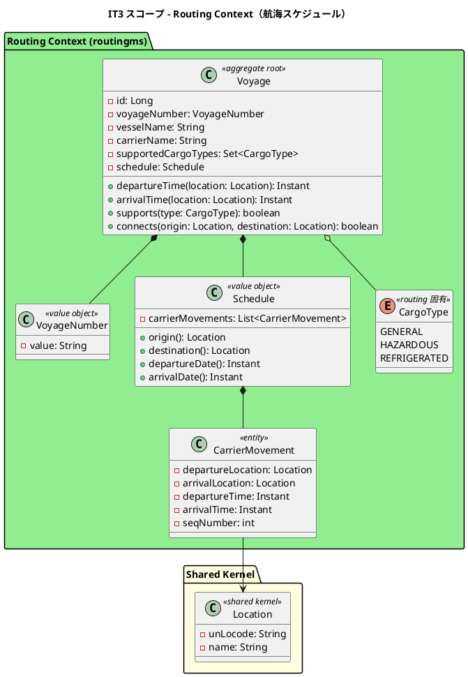
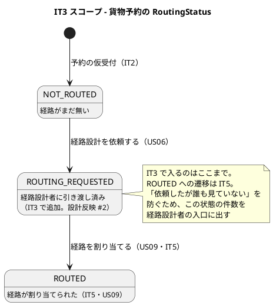
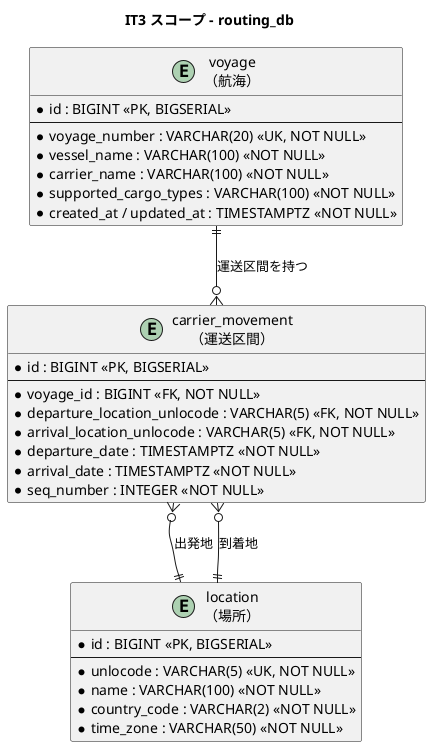

# イテレーション 3 計画

## ゴール

経路設計者が**航海スケジュールを自分で登録・更新し、予約に合う航海を探せる**状態にします。あわせて営業担当者が仮受付の予約を経路設計者へ引き渡し、**経路設計者が「自分が何をすべきか」に気づける**ようにします。

IT3 は 2 つ目のマイクロサービス（routingms）を業務で使い始める最初の IT です。IT1・IT2 で bookingms に確立した型（ヘキサゴナル 4 層・ArchUnit・方言スモーク・共通レイアウト）を routingms へ写し、差分だけを直します。

### 成功基準

| # | 基準 | 測り方 |
| :--- | :--- | :--- |
| 1 | 経路設計者が航海スケジュールを**自分で登録・更新できる** | kind 統合環境で、ログインから登録・更新までを 1 本通す |
| 2 | 予約の条件（出発地・目的地・出発期間・貨物種別）で**航海を絞り込める** | 危険物の予約に対し、対応可能な航海だけが残ることを E2E で |
| 3 | 営業担当者が予約を引き渡し、経路設計者が**その日のうちに気づける** | ダッシュボードの「経路設計待ち」から対象の一覧へ行けること |
| 4 | routingms が bookingms と**同じ型で動く** | ArchUnit・方言スモーク・カバレッジ検証が routingms にも適用されている |

## 局面とアプローチ

**中盤（1 本目）／インサイドアウト**（[開発戦略](development_strategy.md#中盤-インサイドアウトit3it7--release-0210-前半)）。

序盤で通した縦切りの上に、中核ドメインをドメイン層から作ります。IT4 の経路候補算出（US08）は `Voyage` 集約と航海の制約が正しく表現されていることが前提になるため、IT3 は**画面から書き始めず、集約と値オブジェクトの単体テストから始めます**。

> **序盤との違い**: 序盤は「通ること」を先に確かめました。中盤は「業務ルールが正しいこと」を先に確かめます。画面は最後に載せます。

> **局面移行の確認事項**（[開発戦略の移行方針](development_strategy.md)）: 着手前に **ArchUnit のメタテストが「routingms がルール適用対象に入っていないこと」を検出する**ことを確認します。検出できなければ、routingms は検査の外側で育ちます（名簿方式は載せ忘れが漏れる）。型（ヘキサゴナル 4 層・ArchUnit・共通レイアウト）の**再議論はしません**。

## 対象ユーザーストーリー

| ID | ユーザーストーリー | SP | 優先度 | Issue |
| :--- | :--- | :--- | :--- | :--- |
| US24 | 航海スケジュールを新規登録する | 3 | 高 | [#541](https://github.com/k2works/case-study-cargo-tracker/issues/541) |
| US25 | 既存航海スケジュールを更新する | 2 | 中 | [#542](https://github.com/k2works/case-study-cargo-tracker/issues/542) |
| US07 | 航海スケジュールを検索する | 3 | 中 | [#524](https://github.com/k2works/case-study-cargo-tracker/issues/524) |
| US06 | 予約情報を経路設計者に引き渡す | 2 | 中 | [#523](https://github.com/k2works/case-study-cargo-tracker/issues/523) |
| **合計** | | **10** | | |

## 受入条件

`docs/requirements/user_story.md` の該当節を正典とします（書き写さず引用します）。

- [US24 の受け入れ基準](../requirements/user_story.md#us24-航海スケジュールを新規登録する)
- [US25 の受け入れ基準](../requirements/user_story.md#us25-既存航海スケジュールを更新する)
- [US07 の受け入れ基準](../requirements/user_story.md#us07-航海スケジュールを検索する)
- [US06 の受け入れ基準](../requirements/user_story.md#us06-予約情報を経路設計者に引き渡す)

### 受入基準のうち IT3 では満たせないもの

| 受入基準 | 依存先 | 扱い |
| :--- | :--- | :--- |
| US07「制約条件（港湾制約）に基づいて利用可能な航海が表示される」のうち**港湾制約** | 港湾制約は設計にモデルが無い | IT3 では**航海スケジュール・寄港地接続・貨物種別対応**の 3 つで絞る。港湾制約は US08（IT4）で経路探索を作るときに、必要性ごと判断する。**「対応した」と書かない** |
| US06「経路設計者に経路設計依頼の通知が送信される」 | メール送信は設計に存在しない（[リリース計画のリスク](release_plan.md#技術リスク)） | **画面上の気づく手段で代替する。** 経路設計者のダッシュボードに「経路設計待ち」の件数を出し、**そこから対象の一覧へ行ける**ようにする。件数を出すだけでは仕事は進まない |
| US06「予約情報に不備がある場合、修正してから引き渡せる」の**修正** | 予約の訂正（IT2 レビューで IT3 バックログへ） | IT3 では**不備を見つけられる**ところまで（予約詳細で内容を確認できる）。訂正は起票して次 IT 以降 |

## 設計への反映が必要な点（着手前に検出）

正典（設計ドキュメント）に無いものを実装で先に作ると、設計と実装が黙って乖離します。以下は**当該タスクと同じ変更で設計ドキュメントに反映**します。

| # | 内容 | 反映先 | 対応タスク |
| :--- | :--- | :--- | :--- |
| 1 | `voyage` テーブルに**船名・運送会社・対応貨物種別**が無い。US24 の受入基準はこれらの入力を求め、US07 は貨物種別で絞る。あわせて **Routing Context 固有の `CargoType`（列挙型）と、`Voyage.supports()` / `connects()` を `domain-model.md` の要素表に定義行として載せる**（集約・値オブジェクトだけ足して列挙型を落とすドリフトが IT1・IT2 で繰り返された） | `data-model.md` の `routing_db`、`domain-model.md` の Routing Context（図・要素表の両方） | 1.1 |
| 2 | 「経路設計中」に相当する状態が `RoutingStatus`（NOT_ROUTED / ROUTED / MISROUTED）に無い | `domain-model.md` の列挙型・ADR | 4.1 |
| 3 | 航海スケジュールの画面が `ui_design.md` で「take-3 を踏襲」のまま。**どちらが正か分からない状態** | `ui_design.md` の画面詳細設計と「take-7 で定義済みの画面」表 | 3.4 |
| 4 | 予約詳細画面（`/booking/:bookingId`）が未実装。US06 の「予約情報を確認する」入口が無い | `ui_design.md`（定義済み）・実装 | 4.2 |
| 5 | `location` の複製の同期方法が未決（[ADR-010](../adr/010-location-master-shape.md) で IT3 に先送り）。routingms が地点を使い始める | ADR | 0.1 |
| 6 | `data-model.md` の `routing_db.location` に `country_code` / `time_zone` が無い。bookingms 側（IT2 実装・ADR-010）には**両方 NOT NULL** であり、複製なのに形が違う | `data-model.md` の `routing_db` | 0.1 |

## 設計

### ドメインモデル図（IT3 スコープ）



> **`CargoType` は routingms 側にも定義します。** bookingms の `CargoType` を共有カーネルに引き上げません。BC ごとに固有の型を持つ方針（[domain-model の BC 独立性](../design/domain-model.md)）を IT2 まで守っており、ここで崩すと以降の BC が芋づるで共有カーネルに寄ります。BC をまたぐ変換は ACL（US09・IT5）で行います。

### 状態遷移図（IT3 スコープ）



> **`Voyage` に状態はありません。** 航海スケジュールは登録・更新される参照データであり、状態遷移を持ちません。状態遷移図は貨物予約側（`RoutingStatus`）のみを掲載します。

### ER 図（IT3 スコープ）



> **`supported_cargo_types` は 1 列に持ちます**（`GENERAL,HAZARDOUS` のような区切り文字列）。別表にすると IT3 の範囲で結合が 1 段増えるだけで、絞り込み以外の用途がありません。**用途が増えたら別表に割ります**（US08 で港湾制約を扱うときが分岐点）。
>
> **`location` は bookingms の複製です。** 正は bookingms が持ちます（[ADR-010](../adr/010-location-master-shape.md)）。同期方法はタスク 0.1 で決めて ADR に落とします。**列の形は bookingms と揃えます**（`country_code` / `time_zone` を含む。複製なのに形が違うと、後から片方だけ必須にできなくなる。設計反映 #6）。
>
> **外部キーは `location(unlocode)` に張ります**（IT2 の `cargo` と同じ形）。論理参照にすると、登録時に存在しない港を通してしまいます。

### 画面遷移図（IT3 スコープ）

```plantuml
@startuml
title IT3 スコープ - 画面遷移

state ダッシュボード {
  ダッシュボード : /dashboard
  ダッシュボード : 経路設計者パネルに\n「経路設計待ち N 件」（US06）
}

state 航海スケジュール一覧 {
  航海スケジュール一覧 : /routing/voyages
  航海スケジュール一覧 : 検索（出発地・目的地・出発期間・貨物種別）
}

state 航海スケジュール登録 {
  航海スケジュール登録 : /routing/voyages/new
  航海スケジュール登録 : 寄港地を順序付きで入力
}

state 航海スケジュール登録_差分確認 {
  航海スケジュール登録_差分確認 : /routing/voyages/new
  航海スケジュール登録_差分確認 : 既存の航海番号を入力すると
差分を確認して上書き（US25）
}

state 貨物予約一覧 {
  貨物予約一覧 : /booking
}

state 予約詳細 {
  予約詳細 : /booking/:bookingId
  予約詳細 : 出発地・目的地・期限・貨物仕様
  予約詳細 : [経路設計を依頼する]（US06）
}

[*] --> ダッシュボード : ログイン
ダッシュボード --> 航海スケジュール一覧 : [航海管理]
ダッシュボード --> 貨物予約一覧 : [貨物予約]
ダッシュボード --> 貨物予約一覧 : [経路設計待ちを見る]\n（絞り込み済み）
航海スケジュール一覧 --> 航海スケジュール登録 : [新規登録]
航海スケジュール一覧 --> 航海スケジュール登録 : [更新]（航海番号を引き継ぐ）
航海スケジュール登録 --> 航海スケジュール登録_差分確認 : 既存の航海番号だった
航海スケジュール登録 --> 航海スケジュール一覧 : 登録／キャンセル
航海スケジュール登録_差分確認 --> 航海スケジュール一覧 : 上書き／キャンセル
航海スケジュール登録 --> 航海スケジュール登録 : 入力の誤り（自画面にメッセージ）
航海スケジュール登録_差分確認 --> 航海スケジュール登録 : 入力に戻る
貨物予約一覧 --> 予約詳細 : 予約番号
予約詳細 --> 貨物予約一覧 : 依頼／戻る

@enduml
```

> **更新専用の画面は作りません。** `ui_design.md` の画面一覧では、航海スケジュール登録（`/routing/voyages/new`）が「重複時は差分確認」として US24・US25 の両方を担います。設計が正なので、計画側をこれに合わせました（当初 `/routing/voyages/:voyageNumber/edit` を置いていた）。入口が 1 つなら、経路設計者は「新規か更新か」を先に決めずに済みます。
>
> **入力の誤りは自画面に出します。** 画面を遷移させると入力が消えます（IT2 で確立した形）。
>
> **ダッシュボードの「経路設計待ち」は件数と遷移先を対にします。** 数字だけ出しても仕事は進みません（IT2 のレビュー指摘）。

## タスク

### 0. 返済枠と設計反映（IT2 からの引き継ぎ・SP 対象外）

「余力次第」にすると毎 IT 繰り越されて固定化します。**IT3 の Day 1-2 に独立して着手**します。

| # | タスク | 見積 | 状態 |
| :--- | :--- | :--- | :--- |
| 0.1 | **`location` 複製の同期方法を決めて ADR に落とす**（ADR-010 の先送り分）。IT3 の範囲では routingms 側の Flyway に同じ初期データを入れる案が最小だが、「正はどこか」「ずれたらどう気づくか」まで決める | 3h | [x] |
| 0.2 | **ADR-007 の `AuthenticatedUserFilter` を実装し、ArchUnit で必須化する**（IT2 で ADR だけ承認済み・未実装）。**登録されていないサービスをテストで落とす**（名簿方式は載せ忘れが漏れるため、除外の側を一覧にして検査する） | 5h | [x] |
| 0.3 | **共有カーネルの範囲を守る検査を入れる**（`serviceIsolationRule` が `com.example.shared` をまるごと除外している）。IT3 で routingms が共有カーネルを使い始めるため、ここで枠を決めないと際限なく太る | 3h | [x] |
| 0.4 | **危険物クラスを選択式にする**（法定分類を自由入力にしている。IT2 レビュー高）。国連分類の enum を bookingms に置き、画面をセレクトにする | 3h | [x] |
| 0.5 | 設計反映 #1（`voyage` の船名・運送会社・対応貨物種別）を `data-model.md` / `domain-model.md` に反映 | 2h | [x] |
| 0.6 | **判別しない検査 2 件を直す**（IT2 レビュー中）。`RegisterShipperUseCaseTest` の fake `save()` が契約情報を捨てる／`CargoTest#cannotMixSpecialInformation` が壊しても赤にならない。**どちらも壊して赤を確認する** | 2h | [x] |
| 0.7 | **サーバのメッセージに入力値が連結されて画面に出る**（IT2 レビュー中）。マニュアルの表と字面が合わない。値の露出をやめるか、露出を仕様として一箇所に決める | 2h | [x] |
| **小計** | | **20h** | |

### 1. US24: 航海スケジュールを新規登録する（3 SP）

インサイドアウト。Phase 1（ドメイン）→ Phase 2（永続化）→ Phase 3（ユースケース）→ Phase 4（API）→ Phase 5（画面）。

| # | タスク | 見積 | 状態 |
| :--- | :--- | :--- | :--- |
| 1.1 | `Voyage` 集約・`VoyageNumber`・`Schedule`・`CarrierMovement` を単体テストで構築。**出発日が到着日より後を拒否**、**区間の出発地と到着地が同じを拒否**、**寄港地の順序が保たれる**ことを、壊すと赤になる形で | 6h | [x] |
| 1.2 | Flyway（`routing_db` の `location` / `voyage` / `carrier_movement`）+ MyBatis Mapper。**方言スモーク**（H2 / PostgreSQL の両方で解釈できること）を新しい Mapper について通す | 5h | [x] |
| 1.3 | `RegisterVoyageUseCase`。同一航海番号の重複を**拒否ではなく差分確認へ回す**（US25 と同じ入口。「登録できません」で終わらせない） | 4h | [x] |
| 1.4 | `VoyageController`（`POST /api/v1/voyages`）+ MockMvc テスト。**登録・更新・検索とも `ROLE_ROUTING` のみ**。認可を外すと赤になる形で検証 | 4h | [x] |
| 1.5 | 航海スケジュール登録画面（`/routing/voyages/new`）。寄港地を順序付きで追加・削除できる。**未入力箇所を明示する**（ネイティブ検証に任せず自前のメッセージ。IT2 Try 3） | 5h | [ ] |
| **小計** | | **24h** | |

### 2. US25: 既存航海スケジュールを更新する（2 SP）

| # | タスク | 見積 | 状態 |
| :--- | :--- | :--- | :--- |
| 2.1 | `Voyage.applySchedule()`（差分の算出を含む）を単体テストで。**差分が無いときは「変更ありません」と言えること** | 3h | [x] |
| 2.2 | `UpdateVoyageUseCase` + `PUT /api/v1/voyages/{voyageNumber}`。**キャンセルすれば既存は変わらない**ことを統合テストで | 4h | [x] |
| 2.3 | 登録画面に差分確認の段を足す（`/routing/voyages/new` で既存の航海番号 → 差分 → 上書き）。**更新前と更新後を並べて見せる**（何が変わるか分からないまま押させない）。一覧の [更新] は航海番号を引き継いでこの画面へ | 5h | [ ] |
| **小計** | | **12h** | |

### 3. US07: 航海スケジュールを検索する（3 SP）

| # | タスク | 見積 | 状態 |
| :--- | :--- | :--- | :--- |
| 3.1 | `Voyage.supports(CargoType)` / `connects(origin, destination)` を単体テストで。**危険物・冷凍は対応可能な航海だけが残る**ことを、判定を壊すと赤になる形で | 4h | [ ] |
| 3.2 | 検索クエリ（出発地・目的地・出発期間・貨物種別）。**件数の上限を必ず置き、切ったことを黙らない**（IT2 と同じ形） | 4h | [ ] |
| 3.3 | `GET /api/v1/voyages` + MockMvc テスト。**出発地・目的地は UN/LOCODE で指定できる** | 3h | [ ] |
| 3.4 | 航海スケジュール一覧・検索画面（`/routing/voyages`）。**条件を満たす航海が無いとき、条件を緩めて再検索できる**ことを示す。あわせて `ui_design.md` に画面を定義し（**salt のワイヤーフレーム本体と仕様の記述を同時に直す**。仕様だけ直して図が旧内容のまま残るドリフトを作らない）、「take-7 で定義済みの画面」表に追加（設計反映 #3） | 6h | [ ] |
| **小計** | | **17h** | |

### 4. US06: 予約情報を経路設計者に引き渡す（2 SP）

| # | タスク | 見積 | 状態 |
| :--- | :--- | :--- | :--- |
| 4.1 | `RoutingStatus` に `ROUTING_REQUESTED` を追加し、`Cargo.requestRouting()` を単体テストで。**仮受付でない予約からは依頼できない**こと。あわせて `domain-model.md` に反映し、状態を増やした理由を ADR に落とす（設計反映 #2） | 4h | [ ] |
| 4.2 | 予約詳細画面（`/booking/:bookingId`）+ `GET /api/v1/bookings/{bookingId}`。出発地・目的地・期限・貨物仕様を確認できる（設計反映 #4） | 5h | [ ] |
| 4.3 | 「経路設計を依頼する」（`POST /api/v1/bookings/{bookingId}/routing-request`）。**営業担当者のみ**。依頼済みの予約に再依頼できないこと | 3h | [ ] |
| 4.4 | 経路設計者の**気づく手段**: ダッシュボードに「経路設計待ち N 件」を出し、**そこから絞り込み済みの一覧へ行ける**ようにする。件数だけ出して終わりにしない | 4h | [ ] |
| **小計** | | **16h** | |

### 5. ユーザーマニュアル（SP 対象外）

画面を 4 つ追加するため、**計画時に枠を取ります**（クローズ時に思い出すと計画外の作業になります）。

| # | タスク | 見積 | 状態 |
| :--- | :--- | :--- | :--- |
| 5.1 | 「05 航海スケジュール」章を新設（一覧・検索・登録・更新）。**04 章の様式に揃える**（項目表・操作手順・よくある入力の誤り・注意） | 4h | [ ] |
| 5.2 | 「04 貨物予約」に予約詳細と経路設計依頼の節を追加。「01 業務フロー」の工程 4・6 の対応表を更新 | 2h | [ ] |
| 5.3 | 画面キャプチャを生成 spec 経由で再生成し、`manual:build` で HTML を作って目視 | 2h | [ ] |
| **小計** | | **8h** | |

### 見積もり合計

| 区分 | 見積 |
| :--- | :--- |
| 0. 返済枠・設計反映 | 20h |
| 1. US24（3 SP） | 24h |
| 2. US25（2 SP） | 12h |
| 3. US07（3 SP） | 17h |
| 4. US06（2 SP） | 16h |
| 5. マニュアル | 8h |
| **合計** | **97h** |

> IT2 の実績（8 SP / 10 日）に対し IT3 は 10 SP です。**新しいサービス（routingms）の立ち上げ分**が上乗せになるため、返済枠を Day 1-2 に前倒しし、US25 を落とし代（フィーチャバッファ）とします。

## スケジュール

### Week 1（Day 1-5）

| Day | 作業 | 局面 |
| :--- | :--- | :--- |
| Day 1 | 0.1 地点同期の ADR、0.5 設計反映、1.1 `Voyage` 集約（着手） | Phase 1 |
| Day 2 | 0.2 `AuthenticatedUserFilter`、0.3 共有カーネル検査、0.4 危険物クラス | 返済枠 |
| Day 3 | 1.1 完了、1.2 Flyway + Mapper + 方言スモーク | Phase 1-2 |
| Day 4 | 1.3 ユースケース、1.4 API | Phase 3-4 |
| Day 5 | 1.5 登録画面、3.1 検索の述語（ドメイン） | Phase 5 / Phase 1 |

### Week 2（Day 6-10）

| Day | 作業 | 局面 |
| :--- | :--- | :--- |
| Day 6 | 3.2 検索クエリ、3.3 検索 API | Phase 2-4 |
| Day 7 | 3.4 一覧・検索画面 + `ui_design.md` 反映 | Phase 5 |
| Day 8 | 4.1 `ROUTING_REQUESTED` + ADR、4.2 予約詳細 | Phase 1・5 |
| Day 9 | 4.3 依頼 API、4.4 気づく手段、2.1-2.2 US25 | Phase 3-5 |
| Day 10 | 2.3 更新画面、5.1-5.3 マニュアル、クローズ準備 | 仕上げ |

### IT3 で扱わないと決めたこと

| 内容 | 理由 | いつ |
| :--- | :--- | :--- |
| 経路候補の算出 | US08 の本体。IT3 は入力（航海スケジュール）を揃えるところまで | IT4 |
| 経路の選択・確定・予約への紐付け | 往復が閉じるのは IT5 | IT5 |
| 港湾制約 | モデルが設計に無い。必要性ごと US08 で判断する | IT4 |
| 予約の訂正 | US06 の「修正してから引き渡せる」の後半。起票して次 IT 以降 | 起票 |
| 荷主一覧・セレクトのページング、荷主詳細 | IT2 レビュー中。航海の一覧と同じ形を IT3 で作るため、型が固まってから直す | IT4 |
| 荷主の編集（[#550](https://github.com/k2works/case-study-cargo-tracker/issues/550)） | IT2 で起票済み。荷主詳細画面と同じ IT でまとめて作るほうが安い | IT4 |
| 共用端末の無操作タイムアウト（[#551](https://github.com/k2works/case-study-cargo-tracker/issues/551)） | IT2 で起票済み。認証の変更は影響範囲が広く、IT3 の 10 SP と同居させない | 未定（起票済み） |
| `Shipper.email` の値オブジェクト化 | [ADR-012](../adr/012-value-object-granularity.md) で「荷主編集に着手するとき」と決めた。#550 と同じ IT で返す | IT4 |

## リスク

| # | リスク | 影響 | 対策 |
| :--- | :--- | :--- | :--- |
| 1 | routingms の立ち上げが見積もりを超える（2 つ目のサービスで初めて型のコピーを試す） | 高 | Day 1-3 で 1.1-1.2 まで到達しなければ US25 を落とす。**型の再議論はしない**（開発戦略の移行方針） |
| 2 | 作業機の資源が足りず kind で 2 サービスを同時に確認できない | 中 | IT3 で触らないサービスは 0 レプリカ。**戻す手順を決めてから止める**（IT2 Try 10） |
| 3 | `location` の複製がずれ、bookingms で引ける地点が routingms で引けない | 中 | 0.1 で「ずれたらどう気づくか」まで決める。気づく手段が無い同期は入れない |
| 4 | `CargoType` を共有カーネルに引き上げたくなる | 中 | BC 固有型を維持し、変換は ACL（IT5）で行う。0.3 の検査で共有カーネルの範囲を固定する |
| 5 | 「経路設計待ち」が誰にも見られず滞留する | 中 | 4.4 で件数と遷移先を対にする。**件数だけ出す実装は完了としない** |

## Definition of Done

- [ ] US24・US25・US07・US06 の受入基準のうち、**IT3 スコープ内のもの**をすべて満たす（スコープ外は上表のとおり）
- [ ] `./gradlew build` が緑（ユニット・統合・ArchUnit・カバレッジ検証）
- [ ] `TZ=UTC ./gradlew test` が緑
- [ ] フロントエンドの lint・テスト・ビルド・E2E が緑
- [ ] **本番相当ビルドの検査**（`test:e2e:production`）が緑
- [ ] CI が緑（全ジョブ success）
- [ ] SonarQube Quality Gate が **PASS**（両プロジェクト。Bug 0 / Vulnerability 0 / 重複 3% 未満 / 新規カバレッジ 80% 以上）
- [ ] **追加した検査を壊して赤になることを確認済み**（IT2 Try 14）
- [ ] **判定を本番と検査で共有している**（テスト側に判定を書き直していない。IT2 Try 13）
- [ ] **復元経路で不変条件を検査していない**（値オブジェクトに `restore` がある。IT2 Try 16）
- [ ] **新しい Mapper について方言スモークが通っている**
- [ ] **設計に書かれていない判断を ADR に起こし、同じ変更で検査に落とした**（IT2 Try 15。落とせないものは本文に「未実装」と書く）
- [ ] **「設計への反映が必要な点」5 件をすべて反映した**
- [ ] 画面を追加した US について、`ui_design.md` のナビゲーション表・サイドバー実装・ダッシュボード導線・到達性テストの **4 点一致**
- [ ] **ナビゲーションの `available` を true にした**（航海スケジュール）
- [ ] **業務フロー章の対応表を更新した**
- [ ] ユーザーマニュアルの該当章を執筆し、**キャプチャを再生成し `manual:build` で HTML を作って目視した**
- [ ] kind 統合環境で Gateway 経由の動作確認済み（**bookingms と routingms の 2 サービスを通す**）
- [ ] 開発環境（Heroku）へデプロイし、`deploy:dev:health` の全 URL が 200。**加えてその環境で業務を 1 本通した**（200 は「動く」ではない。IT2 Try 11）
- [ ] ドキュメント更新完了（release_plan の進捗・JIG / jig-erd 再生成）

## デモ項目

イテレーション末に、この順で通します。**受け入れの最終ゲート（E2E）はこの筋書きをなぞります**（[開発戦略](development_strategy.md)）。

| # | デモ | 対応 US |
| :--- | :--- | :--- |
| 1 | 経路設計者でログインし、東京 → ロサンゼルスの航海（寄港地 1 つ）を登録する | US24 |
| 2 | 同じ航海番号で到着日を変えて登録し、**差分を確認してから**上書きする | US25 |
| 3 | 危険物に対応する航海と対応しない航海を並べ、貨物種別で絞ると**対応する側だけが残る** | US07 |
| 4 | 条件を満たす航海が無い検索をして、**条件を緩めて再検索できる**ことを見せる | US07 |
| 5 | 営業担当者でログインし、予約詳細から経路設計を依頼する | US06 |
| 6 | 経路設計者のダッシュボードに「経路設計待ち 1 件」が出て、**そこから対象の予約へ行ける** | US06 |

## 関連ドキュメント

| 種別 | ドキュメント |
| :--- | :--- |
| 上流 | [ユーザーストーリー](../requirements/user_story.md)・[システムユースケース](../requirements/system_usecase.md) |
| 設計 | [ドメインモデル](../design/domain-model.md)・[データモデル](../design/data-model.md)・[UI 設計](../design/ui_design.md)・[アーキテクチャ（バックエンド）](../design/architecture_backend.md)・[テスト戦略](../design/test_strategy.md) |
| 計画 | [リリース計画](release_plan.md)・[開発戦略](development_strategy.md)・[IT2 計画](iteration_plan-2.md) |
| 前 IT | [IT2 ふりかえり](retrospective-2.md)・[IT2 完了報告書](iteration_report-2.md)・[IT2 レビュー](../review/イテレーション2_review_20260820.md) |
| ADR | [ADR-007（利用者ヘッダ）](../adr/007-authenticated-user-header-required.md)・[ADR-010（地点マスタの形）](../adr/010-location-master-shape.md)・[ADR-012（値オブジェクトの粒度）](../adr/012-value-object-granularity.md) |

> **テンプレートとの差分**: `docs/template/イテレーション計画.md` の「ディレクトリ構成」「API 設計」「データベーススキーマ」節は置いていません。IT1・IT2 と同じ判断で、これらは実装と二重管理になり**先に古くなる**ためです。API パスとスキーマはタスクの行に書き、確定した形は設計ドキュメントに反映します。htmx / PRG の節も置きません（本プロジェクトは React SPA で、遷移は SPA ルーティングです）。

## 更新履歴

| 日付 | 内容 |
| :--- | :--- |
| 2026-08-20 | 初版作成（IT2 のふりかえり Try 16 件・返済枠・引き継ぎ事項を反映） |
