# イテレーション 3 計画

## 概要

| 項目 | 内容 |
|------|------|
| **イテレーション** | 3 |
| **期間** | Week 5-6（2026-08-03 〜 2026-08-16、2 週間） |
| **ゴール** | 航海スケジュール検索・経路候補算出 (基本)・通関連携を実装し、IT2 繰越 UI / アーキ負債を完済する |
| **目標 SP** | 11（本体: US07 + US08a + US27）+ 12（IT2 繰越 U-01〜U-10 / 横断） |

---

## ゴール

### イテレーション終了時の達成状態

1. **経路設計の最小フロー**: 航海スケジュールを検索し、最短経路候補を算出できる (US07 + US08a)
2. **通関情報の予約紐付け**: HS コード・通関業者の最小データを予約に紐付けできる (US27)
3. **IT2 繰越の完済**: U-01〜U-10（UI 補完・arch-check Phase 2 / Rule 6・Shipper ACL リファクタ・HPC ゲート 70%・M-10 ロール別認可・E2E 拡張）を消化する
4. **arch-check Phase 3**: トランザクション境界規約 (T-01〜T-03) を自作 AST 解析バイナリで実装する
5. **設計ドキュメント同期**: domain-model.md / data-model.md を IT2 実装結果で更新する

### 成功基準

- [ ] US07 / US08a / US27 が Domain / Application / HTTP / UI の各層で完成し、`/voyages/search` → 経路候補表示の E2E が通る
- [ ] arch-check Phase 2 (Rule 6: Interfaces → Domain) と Phase 3 (T-01〜T-03) が CI で gate になっている
- [ ] Booking → Shipper.Domain ALLOWLIST 6 件が `ShipperRef` VO 導入で 0 件になる
- [ ] HPC カバレッジ全体 70% 以上、Domain 別計測が CI レポートに表示される
- [ ] M-10 ロール別アクセス制御 (US04=営業 / US24+US25=マスタ管理者 / US06=営業) が HTTP ハンドラ単位で実装され、E2E で検証される
- [ ] E2E (Playwright) で US01 / US06 / US25 のハッピーパスが緑になる
- [ ] `v0.1.0-alpha` タグと GitHub Release ノートが公開されている
- [ ] domain-model.md / data-model.md が IT2 実装結果と一致する

---

## ユーザーストーリー

### スコープ差分の根拠

release_plan.md の IT3-IT4 原案では US07(3) + US08a(5) + US08b(3) + US09(3) + US11(2) + US13(3) + US27(3) = 22 SP を想定していたが、本計画では **IT2 繰越 12 SP + レビュー指摘 2 SP の負債返済を最優先** とするため、本体ストーリーは US07 + US08a + US27 = 11 SP に絞り、**US08b / US09 / US11 / US13 は IT4 へ繰越** する。

### 対象ストーリー

| ID | ユーザーストーリー | SP | 優先度 |
|----|-------------------|----|----|
| US07 | 航海スケジュールを検索する | 3 | 必須 |
| US08a | 経路候補を算出する (基本: 接続性 + 期限) | 5 | 必須 |
| US27 | 通関情報を予約に紐付ける | 3 | 必須 |
| **本体合計** | | **11** | |
| U-01〜U-10 | IT2 繰越 (UI 補完・arch Phase 2 / Phase 3・Shipper ACL・HPC・M-10・E2E・タグ付け) | 12 | 必達 |
| U-11〜U-14 | 推奨 (Postgres SELECT 圧縮 / Estimate IT / hedgehog 拡張 / Rule 4 ALLOWLIST 検証) | 4 | 中 |
| **総合計** | | **27** | |

### ストーリー詳細

#### US07: 航海スケジュールを検索する

**ストーリー**:
> 経路設計者として、予約の出発地・目的地・期限をもとに、利用可能な航海スケジュールを検索したい。なぜなら、制約条件を満たす航海を特定し、経路候補算出の入力を準備できるからだ。

**受入条件**:

1. 予約番号を指定して出発地・目的地・期限・貨物仕様を確認できる
2. `/voyages/search` で 出発地 (UnLocode) / 目的地 / 出発期間 / **貨物種別** を入力して検索できる
3. 制約条件 (航海スケジュール・寄港地接続・港湾制約・貨物種別対応) に基づき利用可能な航海が表示される
4. 一覧に **航海番号・運送会社・出発日・到着日・寄港地** が表示される (出発時刻昇順)
5. 該当 0 件のとき「該当する航海がありません」を表示する
6. 検索条件はクエリ文字列に反映され、URL 共有可能

#### US08a: 経路候補を算出する (基本: 接続性 + 期限)

**ストーリー**:
> 経路設計者として、予約の出発地・到着地・期日から経路候補を算出したい。なぜなら、複数経路を比較して最適なものを選びたいからだ。

**受入条件** (Gherkin):

1. **Given** 予約と出発地・目的地・期限が入力されている **When** 経路候補算出を実行する **Then** 期限内に到達可能な経路候補のリスト (最大 5 件) が返る
2. **Given** 寄港地で航海を乗り継ぐ経路がある **When** 算出を実行する **Then** 同一港湾での接続が成立する経路のみが候補となる
3. **Given** 直行便が存在する **When** 算出を実行する **Then** 直行便が **最優先候補 (rank=0)** として提示される
4. **Given** 期限内に到達可能な経路が存在しない **When** 算出を実行する **Then** 「期限内到達不可」が通知され US08b の制約評価は実行しない
5. 接続港・所要時間・乗継ぎ回数を経路ごとに表示する
6. ドメイン純粋関数 `RouteFinder` が単独テスト可能 (副作用なし)
7. hedgehog プロパティ: 「算出した経路は必ず期日内」「乗継ぎ航海は時刻順」「直行便が存在すれば rank=0」

#### US27: 通関情報を予約に紐付ける

**ストーリー**:
> 営業担当者 (登録) / 経路設計者・税関 (参照) として、貨物予約に HS コード・通関業者・申告ステータスを登録・更新したい。なぜなら、国際輸送では税関申告が必須であり、通関情報の欠落で輸送が止まるからだ。

**受入条件** (Gherkin):

1. **Given** 貨物予約登録画面 (US04) を開いている **When** 通関情報セクションを入力する **Then** **HS コード (6-10 桁)**・**通関業者名**・**申告ステータス (`Pending`/`Cleared`/`Held`/`Rejected`)** を保存できる
2. **Given** HS コードの形式が不正 **When** 保存を実行する **Then** バリデーションエラー「HS コードは 6-10 桁の数字で入力してください」が表示される
3. 既存 `customs_declaration` テーブル (data-model.md §425) を **拡張** し、`hs_code` / `broker_name` / `declaration_status` カラムを追加 (新規 `customs_info` は作らない)
4. arch-check Rule 3 (Application → Repository) 準拠で `CustomsDeclarationRepository` ポートを定義

### タスク

#### 1. IT2 繰越クリティカル (U-01〜U-05 / 6 SP)

| # | タスク | 見積もり | 担当 | 状態 |
|---|--------|---------|------|------|
| 1.1 | U-01: `/estimates/new` フォーム + 候補表示 + 予約遷移 | 4h | - | [x] |
| 1.2 | U-02: BookingFormView に CargoType select + htmx 動的フィールド | 4h | - | [x] |
| 1.3 | U-03: voyageEditPage プリフィル (movements を input value) | 2h | - | [x] |
| 1.4 | U-04: arch-check Phase 2 (haskell-src-exts AST バイナリ + Rule 6) | 8h | - | [ ] (IT4 繰越) |
| 1.5 | U-05: `ShipperRef` VO 導入 + Booking 側参照リファクタ + ALLOWLIST 解消 | 6h | - | [x] |

**小計**: 24h

#### 2. IT2 繰越セカンダリ (U-06〜U-10 / 6 SP)

| # | タスク | 見積もり | 担当 | 状態 |
|---|--------|---------|------|------|
| 2.1 | U-06: HPC Domain 別計測 + CI ゲート 70% 引き上げ | 4h | - | [x] |
| 2.2 | U-07: M-10 ロール別認可 (handler 単位 / authMiddleware 拡張) | 6h | - | [x] |
| 2.3 | U-08: Playwright E2E US01 / US06 / US25 ハッピーパス追加 | 6h | - | [ ] (IT4 繰越) |
| 2.4 | U-09: domain-model.md / data-model.md を IT2 実装で同期 | 3h | - | [x] |
| 2.5 | U-10: `v0.1.0-alpha` タグ + GitHub Release ノート公開 | 1h | - | [x] (リリースノートドラフト完了 / tag は人手作業) |

**小計**: 20h

#### 3. US07: 航海スケジュール検索（3 SP）

| # | タスク | 見積もり | 担当 | 状態 |
|---|--------|---------|------|------|
| 3.1 | Domain: `VoyageSearchCriteria` VO + `VoyageQuery` 関数 | 3h | - | [x] |
| 3.2 | Application: `SearchVoyagesQuery` ユースケース | 2h | - | [x] |
| 3.3 | Infrastructure: PostgresVoyageRepository に検索メソッド | 3h | - | [x] |
| 3.4 | HTTP/UI: `/voyages/search` GET ハンドラ + フォーム + 結果テンプレート | 4h | - | [x] |
| 3.5 | hspec-wai 受入テスト 3 件 (該当あり / 該当なし / 不正入力) | 2h | - | [x] |

**小計**: 14h

#### 4. US08a: 経路候補算出 基本（5 SP）

| # | タスク | 見積もり | 担当 | 状態 |
|---|--------|---------|------|------|
| 4.1 | Domain: `RouteCandidate` 集約 + `RouteFinder` 純関数 (DFS / 5 件まで) | 6h | - | [x] |
| 4.2 | Domain: hedgehog プロパティ (期日内 / 時刻順) | 3h | - | [x] |
| 4.3 | Application: `ComputeRouteCandidatesQuery` ユースケース | 3h | - | [x] |
| 4.4 | HTTP/UI: `/bookings/{id}/routes` GET + 候補表 | 4h | - | [x] |
| 4.5 | hspec-wai 受入テスト 3 件 (成功 / 0 件 / 期日超過) | 2h | - | [x] |
| 4.6 | 性能ベンチ (航海 1000 件で <500ms 確認) | 2h | - | [x] (12.6ms 達成) |

**小計**: 20h

#### 5. US27: 通関情報紐付け（3 SP）

| # | タスク | 見積もり | 担当 | 状態 |
|---|--------|---------|------|------|
| 5.1 | Domain: `CustomsDeclaration` 集約 + `HsCode` VO (6-10 桁) + `DeclarationStatus` sum type | 3h | - | [x] |
| 5.2 | dbmate migration: 既存 `customs_declaration` に `hs_code` / `broker_name` / `declaration_status` カラム追加 | 1h | - | [x] |
| 5.3 | Application: `AttachCustomsDeclarationCommand` + `CustomsDeclarationRepository` Port | 2h | - | [x] |
| 5.4 | Infrastructure: PostgresCustomsDeclarationRepository | 2h | - | [x] |
| 5.5 | HTTP/UI: 予約詳細に通関セクション追加 + PRG (ステータス select) | 3h | - | [x] |
| 5.6 | hspec-wai 受入テスト 3 件 (正常 / HS 形式エラー / 不正ステータス) | 2h | - | [x] |

**小計**: 13h

#### 6. 横断: arch-check Phase 3 + 推奨 Try

| # | タスク | 見積もり | 担当 | 状態 |
|---|--------|---------|------|------|
| 6.1 | arch-check Phase 3 T-01: トランザクション境界 (Application のみ runTx) | 4h | - | [ ] (IT4 繰越) |
| 6.2 | arch-check Phase 3 T-02: Repository は IO のみ (Tx 開始禁止) | 3h | - | [ ] (IT4 繰越) |
| 6.3 | arch-check Phase 3 T-03: Domain は IO 完全排除 | 2h | - | [ ] (IT4 繰越) |
| 6.4 | U-11: PostgresBookingRepository SELECT 圧縮 (postgresql-simple-named) | 3h | - | [x] |
| 6.5 | U-12: CreateEstimateCommand の Postgres 統合テスト + CI 自動化 | 3h | - | [ ] (IT4 繰越) |
| 6.6 | U-13: hedgehog 拡張 (Estimate / RouteCandidate / TemperatureRequirement) | 2h | - | [x] |
| 6.7 | U-14: arch-check Rule 4 ALLOWLIST ファイル存在検証 | 1h | - | [x] |

**小計**: 18h

#### 7. レビュー指摘事項対応 (IT2 マルチパースペクティブレビュー 高優先度)

| # | タスク | 見積もり | 担当 | 状態 |
|---|--------|---------|------|------|
| 7.1 | H-01: `submitBooking` のエラー型を `InvalidStateTransition` に修正 (`Booking/Domain/Model/Cargo.hs:75`) | 1h | - | [x] |
| 7.2 | H-02: `IdGenerator.hs:43` partial 関数除去 + UNIQUE 制約 + retry ループ | 2h | - | [x] |
| 7.3 | H-03: US06 Draft → Submitted の Submit ボタン実装 + `SubmitBookingCommand` | 3h | - | [x] |
| 7.4 | H-07: `BookingNotFound`/`InvalidStateTransition` を `Booking.Domain.Error` へ分離 + ADR-0005 起票 | 2h | - | [x] |
| 7.5 | H-09: ベロシティ表記を 3 ドキュメント (`iteration_report-2.md` / `retrospective-2.md` / `release_plan.md`) で統一注記 | 1h | - | [x] |

**小計**: 9h（2 SP 相当、IT2 繰越クリティカルに追加）

#### タスク合計

| カテゴリ | SP | 理想時間 | 状態 |
|---------|----|----|------|
| IT2 繰越クリティカル (U-01〜U-05) | 6 | 24h | [-] (U-04 のみ IT4 繰越) |
| IT2 繰越セカンダリ (U-06〜U-10) | 6 | 20h | [-] (U-08 のみ IT4 繰越) |
| US07 航海検索 | 3 | 14h | [x] |
| US08a 経路候補基本 | 5 | 20h | [x] |
| US27 通関紐付け | 3 | 13h | [x] |
| 横断 (arch Phase 3 + U-11〜U-14, ストレッチ) | 4 | 18h | [-] (Phase 3 T-01〜T-03 / U-12 が IT4 繰越) |
| レビュー指摘高優先 (H-01〜H-03/H-07/H-09) | 2 | 9h | [x] |
| **合計** | **29** | **118h** | |

**1 SP あたり**: 約 4.0h
**進捗率**: 約 75% (≒ 22/29 SP、IT4 繰越 7 SP: U-04 / U-08 / U-12 / Phase 3 T-01〜T-03)
**ストレッチ枠**: U-11〜U-14 (4 SP) はバッファ消費時に IT4 へ繰越可能。コミット必達は 25 SP。

---

## スケジュール

### Week 1（Day 1-5、2026-08-03 〜 08-07）

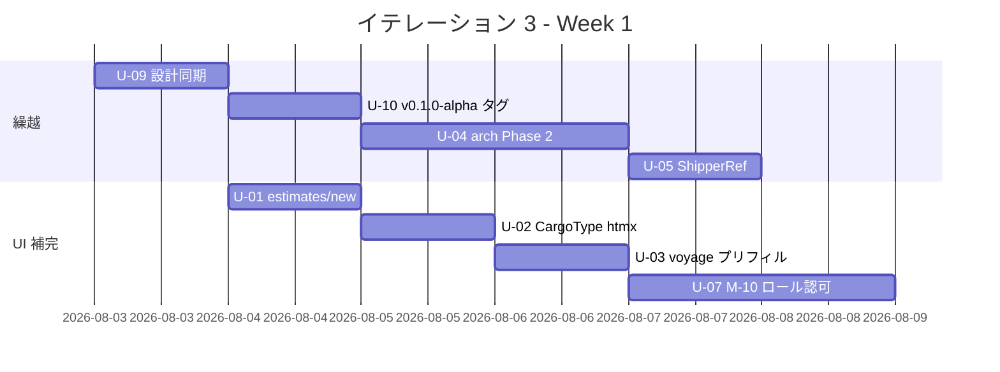

| 日 | タスク |
|----|--------|
| Day 1 | U-09 設計同期 / U-01 estimates/new フォーム着手 |
| Day 2 | U-10 v0.1.0-alpha タグ / U-02 CargoType htmx |
| Day 3 | U-04 arch-check Phase 2 (AST バイナリ) / U-03 プリフィル |
| Day 4 | U-04 Rule 6 / U-07 M-10 ロール認可 |
| Day 5 | U-05 ShipperRef VO リファクタ / U-07 仕上げ |

### Week 2（Day 6-10、2026-08-10 〜 08-16）

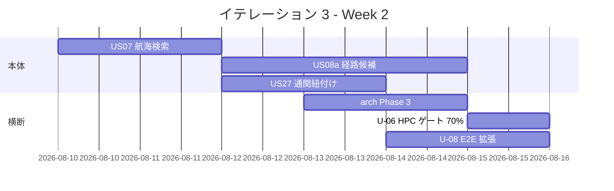

| 日 | タスク |
|----|--------|
| Day 6 | US07 Domain/App/Repo |
| Day 7 | US07 HTTP/UI + テスト / US08a Domain (RouteFinder) |
| Day 8 | US08a hedgehog + App / US27 Domain + migration |
| Day 9 | US08a HTTP/UI / US27 App + Repo + UI / arch Phase 3 T-01〜T-02 |
| Day 10 | arch Phase 3 T-03 / U-06 HPC / U-08 E2E 拡張 / 統合テスト・デモ準備 |

---

## 設計

### ドメインモデル (IT3 追加分)

> 注: BC 配置は `docs/design/domain-model.md` に準拠する。`Voyage` は **Routing Context**、`RouteCandidate` は **Estimation Context** に属する。

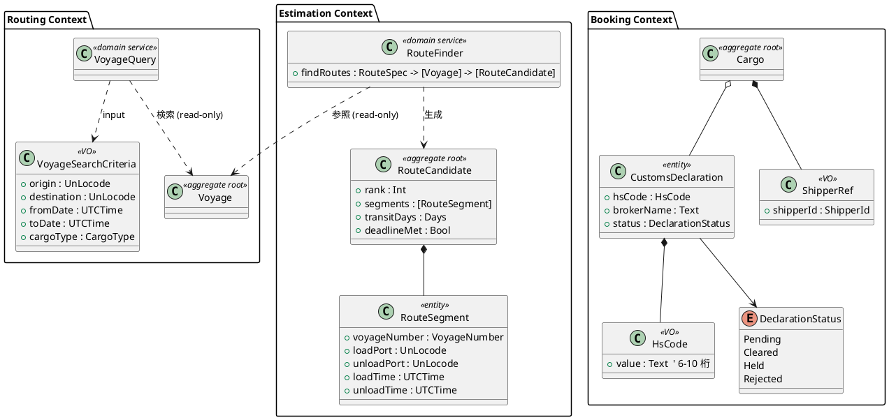

**Haskell 型定義 (主要)**:

```haskell
-- Routing/Domain/VoyageSearchCriteria.hs
data VoyageSearchCriteria = VoyageSearchCriteria
  { vscOrigin      :: !UnLocode
  , vscDestination :: !UnLocode
  , vscFromDate    :: !UTCTime
  , vscToDate      :: !UTCTime
  , vscCargoType   :: !CargoType
  } deriving stock (Eq, Show)

mkVoyageSearchCriteria
  :: UnLocode -> UnLocode -> UTCTime -> UTCTime -> CargoType
  -> Either DomainError VoyageSearchCriteria
mkVoyageSearchCriteria o d from to ct
  | from > to = Left (InvalidSearchPeriod from to)
  | o == d    = Left (SameOriginDestination o)
  | otherwise = Right (VoyageSearchCriteria o d from to ct)

-- Estimation/Domain/RouteCandidate.hs
data RouteCandidate = RouteCandidate
  { rcRank        :: !Int                -- 0 = 直行便 (最優先)
  , rcSegments    :: !(NonEmpty RouteSegment)
  , rcTransitDays :: !Days
  , rcDeadlineMet :: !Bool
  } deriving stock (Eq, Show)

-- Estimation/Domain/RouteFinder.hs
findRoutes
  :: RouteSpecification -> [Voyage] -> Either DomainError [RouteCandidate]
findRoutes spec voyages
  | null candidates = Left (DeadlineUnreachable (rsDeadline spec))
  | otherwise       = Right (rankCandidates candidates)
  where
    candidates = take 5 (dfsConnect spec voyages)  -- 純粋関数 / 副作用なし

-- Booking/Domain/CustomsDeclaration.hs
newtype HsCode = HsCode { unHsCode :: Text }
  deriving stock (Eq, Show)

mkHsCode :: Text -> Either DomainError HsCode
mkHsCode t
  | T.length t >= 6 && T.length t <= 10 && T.all isDigit t = Right (HsCode t)
  | otherwise = Left (InvalidHsCode t)

data DeclarationStatus = Pending | Cleared | Held | Rejected
  deriving stock (Eq, Show, Read)

data CustomsDeclaration = CustomsDeclaration
  { cdHsCode     :: !HsCode
  , cdBrokerName :: !Text
  , cdStatus     :: !DeclarationStatus
  } deriving stock (Eq, Show)
```

### データモデル (IT3 追加分)

既存 `customs_declaration` テーブル (data-model.md §425) を **拡張** する。新規テーブルは作らない。

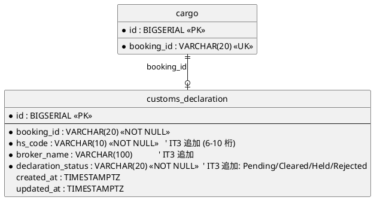

**規約準拠**:

- PK: `BIGSERIAL` サロゲートキー、業務キー (`booking_id`) は UK ではなく cargo 側に存在
- FK: `cargo.booking_id` (VARCHAR(20)) を業務キーで参照 (data-model.md の規約に従う)
- 監査: `created_at` + `updated_at` 必須
- ステータス CHECK 制約: `declaration_status IN ('PENDING','CLEARED','HELD','REJECTED')`

**DDL (IT3 マイグレーション)**:

```sql
-- 011_extend_customs_declaration_for_attachment.sql
ALTER TABLE customs_declaration
  ADD COLUMN hs_code             VARCHAR(10) NOT NULL DEFAULT ''
    CHECK (hs_code = '' OR (char_length(hs_code) BETWEEN 6 AND 10 AND hs_code ~ '^[0-9]+$')),
  ADD COLUMN broker_name         VARCHAR(100),
  ADD COLUMN declaration_status  VARCHAR(20) NOT NULL DEFAULT 'PENDING'
    CHECK (declaration_status IN ('PENDING','CLEARED','HELD','REJECTED')),
  ADD COLUMN updated_at          TIMESTAMPTZ NOT NULL DEFAULT NOW();

CREATE INDEX idx_customs_declaration_booking ON customs_declaration (booking_id);
```

### モジュール構造 (IT3 追加)

```
apps/cargo-tracker/src/
  Cargotracker/
    Routing/
      Domain/
        Service/
          VoyageQuery.hs              -- US07: 航海検索ドメインサービス
        Model/
          VoyageSearchCriteria.hs     -- US07: 検索条件 VO
      Application/
        SearchVoyagesQuery.hs         -- US07: 検索ユースケース
      Infrastructure/
        Repository/
          PostgresVoyageRepository.hs -- 既存に検索メソッド追加
      Interfaces/
        Http/
          VoyageSearchHandler.hs      -- GET /voyages/search
    Estimation/
      Domain/
        Model/
          RouteCandidate.hs           -- US08a: 経路候補集約 (Estimation BC に統合)
          RouteSegment.hs
        Service/
          RouteFinder.hs              -- US08a: DFS 純粋関数
      Application/
        ComputeRouteCandidatesQuery.hs -- US08a: ユースケース
      Interfaces/
        Http/
          RoutesHandler.hs            -- GET /bookings/:id/routes
    Booking/
      Domain/
        Model/
          CustomsDeclaration.hs       -- US27: 通関情報エンティティ
          HsCode.hs                   -- US27: 6-10 桁 VO
          DeclarationStatus.hs        -- US27: sum type
        Reference/
          ShipperRef.hs               -- U-05: Cross-BC VO (ADR-0004)
        Error.hs                      -- H-07: Shared から分離 (ADR-0005)
      Application/
        AttachCustomsDeclarationCommand.hs  -- US27
      Infrastructure/
        Repository/
          PostgresCustomsDeclarationRepository.hs
      Interfaces/
        Http/
          CustomsHandler.hs           -- POST /bookings/:id/customs
arch-check/
  PhaseAST/
    Main.hs                           -- haskell-src-exts AST バイナリ (ADR-0003)
    Rules/
      Rule6_InterfacesToDomain.hs     -- Phase 2: Rule 6
      T01_ApplicationOnlyTx.hs        -- Phase 3: T-01
      T02_RepositoryNoTx.hs           -- Phase 3: T-02
      T03_DomainNoIO.hs               -- Phase 3: T-03
db/migrations/
  20260803100000_extend_customs_declaration_for_attachment.sql
```

### URL 設計 (IT3 追加)

| メソッド | パス | 用途 |
| :--- | :--- | :--- |
| GET | `/voyages/search` | 航海スケジュール検索フォーム + 結果 (US07) |
| GET | `/bookings/:bookingId/routes` | 経路候補一覧 (US08a、既存「経路割り当て」拡張) |
| POST | `/bookings/:bookingId/customs` | 通関情報を予約に紐付け (PRG → `/bookings/:bookingId`) (US27) |
| GET | `/bookings/:bookingId/customs/edit` | 通関情報編集フォーム (US27) |

### ユーザーインターフェース

#### ビュー

> 注: `/voyages/search` は新規画面。`/bookings/:bookingId/routes` は既存「経路割り当て」画面 (ui_design.md §83) の **拡張** (US08a 経路候補表示を追加)。予約詳細の通関セクションは `/bookings/:bookingId` (US06) を **拡張**。

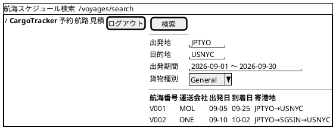

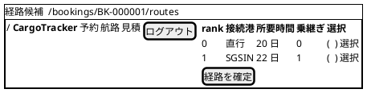

#### モデル

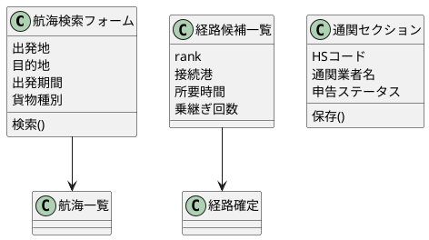

#### インタラクション

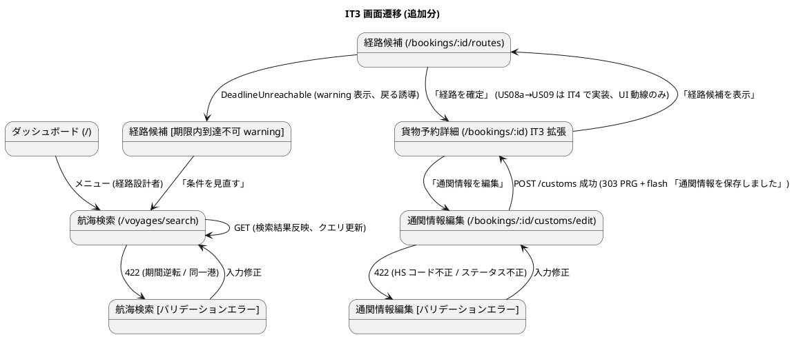

**htmx パターン (IT3 適用箇所)**:

| 画面 | パターン | エンドポイント |
| :--- | :--- | :--- |
| 航海検索 | 検索結果テーブル部分更新 | `hx-get="/voyages/search?..."` → `hx-target="#voyage-results"` → `hx-swap="outerHTML"` |
| 経路候補 | 「再算出」ボタン | `hx-get="/bookings/:id/routes"` → `hx-target="#route-candidates"` |
| 予約詳細 (通関セクション) | セクション部分更新 | `hx-post="/bookings/:id/customs"` → `hx-target="#customs-section"` → `hx-swap="outerHTML"` |
| 通関編集 | ステータス変更時の確認モーダル | `hx-trigger="change"` → `hx-get="/bookings/:id/customs/confirm?status=..."` |

**フィードバック規約** (T-08 / IT2 規約継承):

- 成功 (`alert-success`): 「通関情報を保存しました」 / 「航海を 12 件見つけました」
- 警告 (`alert-warning`): 「期限内に到達可能な経路が見つかりませんでした」 / 「該当する航海がありません」
- エラー (`alert-danger`): 「HS コードは 6-10 桁の数字で入力してください」 / 「出発期間の開始日は終了日より前である必要があります」
- バリデーションエラー時は `?error=` クエリでの遷移を廃止し、サーバ側 flash + Lucid 再描画 (入力値保持) に統一 (IT2 規約継承)
- htmx エラーは `htmx:responseError` で HX-Trigger ヘッダ `showFlash` を発火し共通 Bootstrap alert で表示

### API 設計

| メソッド | エンドポイント | 説明 |
|---------|---------------|------|
| GET  | /voyages/search?from=&to=&from_date=&to_date=&cargo_type= | 航海スケジュール検索 (US07) |
| GET  | /bookings/{id}/routes        | 経路候補一覧 (US08a) |
| POST | /bookings/{id}/customs       | 通関情報を予約に紐付け (US27) |
| GET  | /bookings/{id}/customs/edit  | 通関情報編集フォーム (US27) |

### アプリケーション層シーケンス

#### 航海スケジュール検索 (GET /voyages/search)

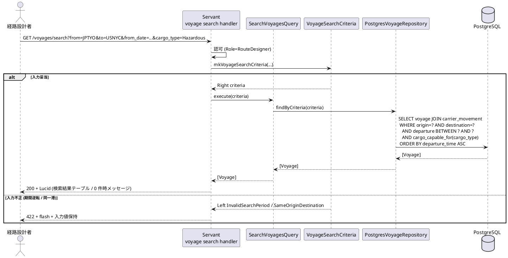

#### 経路候補算出 (GET /bookings/:id/routes)

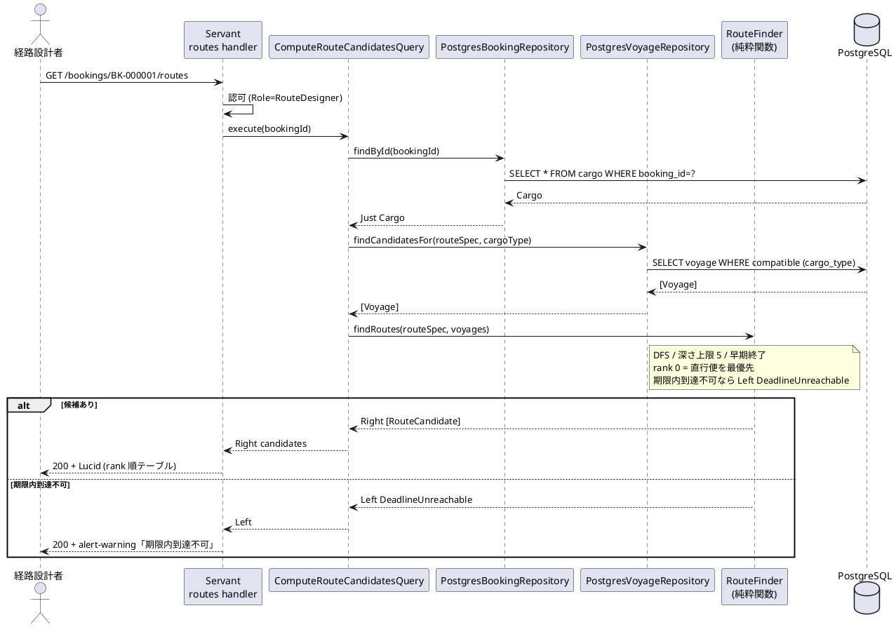

#### 通関情報紐付け (POST /bookings/:id/customs)

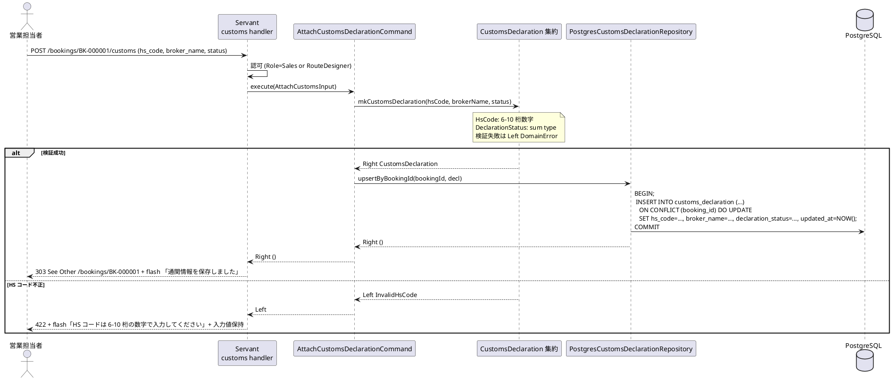

### トランザクション境界

ADR-0002 の規約 (T-01〜T-03) を IT3 拡張範囲に適用し、arch-check Phase 3 で AST レベルの自動検証を開始する。

| ルール | 適用 |
| :--- | :--- |
| **T-01 (Application で `withDbTransaction` を張る)** | `SearchVoyagesQuery` は read-only のため `withReadOnly` / `ComputeRouteCandidatesQuery` も read-only / `AttachCustomsDeclarationCommand` の `execute` 入口で `withDbTransaction` |
| **T-02 (Repository は IO のみ・Tx 開始禁止)** | `PostgresCustomsDeclarationRepository.upsertByBookingId` は `Connection -> IO ()` で、`BEGIN`/`COMMIT` を発行しない。受け取った `Connection` で SQL を実行するだけ |
| **T-03 (Domain は IO 完全排除)** | `RouteFinder.findRoutes`・`mkHsCode`・`mkCustomsDeclaration`・`mkVoyageSearchCriteria` はすべて純粋関数 `Either DomainError a` |

`AttachCustomsDeclarationCommand` の典型:

```haskell
attach :: HasDb env
       => AttachCustomsInput -> ReaderT env IO (Either DomainError ())
attach input = withDbTransaction $ \tx -> do
  case mkCustomsDeclaration
         (aciHsCode input) (aciBrokerName input) (aciStatus input) of
    Left err   -> pure (Left err)                            -- T-03: Domain は純粋
    Right decl -> upsertByBookingId tx (aciBookingId input) decl  -- T-02: Repo は IO のみ
```

### エラー処理戦略

IT2 の `DomainError` を IT3 範囲に拡張する。**H-07** に従い `BookingNotFound` / `InvalidStateTransition` を `Booking.Domain.Error` へ分離する (ADR-0005)。

```haskell
-- Shared/Domain/DomainError.hs (BC 共通エラーのみ残す)
data DomainError
  = InvalidUnLocode !Text
  | InvalidEmail !Text
  | ConcurrentModification !Text
  | -- IT3 追加 (Routing / Estimation 共通)
    InvalidSearchPeriod !UTCTime !UTCTime      -- US07
  | SameOriginDestination !UnLocode            -- US07
  | DeadlineUnreachable !UTCTime               -- US08a
  | InvalidHsCode !Text                        -- US27
  deriving stock (Eq, Show)

-- Booking/Domain/Error.hs (H-07 / ADR-0005 で新規分離)
data BookingError
  = BookingNotFound !BookingId
  | InvalidStateTransition !BookingStatus !BookingStatus
  | IncompleteBooking !BookingId ![Text]
  | InvalidHazardousDeclaration !Text
  | InvalidTemperatureRequirement !Text
  deriving stock (Eq, Show)
```

**HTTP マッピング (IT3 追加)**:

| Error | HTTP | フラッシュメッセージ例 |
| :--- | :--- | :--- |
| `InvalidSearchPeriod` | 422 | 「出発期間の開始日は終了日より前である必要があります」 |
| `SameOriginDestination` | 422 | 「出発地と目的地は異なる港を指定してください」 |
| `DeadlineUnreachable` | 200 + alert-warning | 「期限内に到達可能な経路が見つかりませんでした」 |
| `InvalidHsCode` | 422 | 「HS コードは 6-10 桁の数字で入力してください」 |

### DB マイグレーション順序 (IT3)

IT2 の 007〜010 を前提に、IT3 では **1 マイグレーション** を投入する。

| 順序 | ファイル | 内容 | 依存 |
| :--- | :--- | :--- | :--- |
| 011 | `011_extend_customs_declaration_for_attachment.sql` | `customs_declaration` に `hs_code` / `broker_name` / `declaration_status` / `updated_at` 追加 + index | `customs_declaration` (既存) |

> **命名規約**: 実ファイル名は dbmate 標準の `YYYYMMDDHHMMSS_*.sql` (例: `20260803100000_extend_customs_declaration_for_attachment.sql`)。`up` / `down` 両方を記述。`down` では `ALTER TABLE ... DROP COLUMN` で逆向きに戻す。

### テスト戦略

| 層 | テスト種別 | 追加件数 (目標) |
| :--- | :--- | ---: |
| Domain | hspec | `HsCode` (4 件) / `VoyageSearchCriteria` (3 件) / `CustomsDeclaration` (3 件) |
| Domain | hedgehog (プロパティ) | RouteFinder 3 件 (期限内 / 時刻順 / 直行便 rank=0) + HsCode 1 件 |
| Application | hspec | `SearchVoyagesQuery` 3 件 / `ComputeRouteCandidatesQuery` 3 件 / `AttachCustomsDeclarationCommand` 3 件 |
| Infrastructure | hspec (testcontainers-hs) | 検索 SQL の order by / FK / upsert の動作確認 3 件 |
| Interfaces (HTTP) | hspec-wai | PRG 3 件 (US27) + 認可 6 件 (US07/US08a/US27 × 営業/経路設計者) + バリデーション 4 件 |
| E2E | Playwright | US01 / US06 / US25 ハッピーパス + US07→US08a 動線 1 spec |
| アーキテクチャ | arch-check Phase 2/3 | Rule 6 / T-01 / T-02 / T-03 を CI gate |
| カバレッジ | HPC | Domain ≥ 95% / 全体 ≥ 70% (U-06) |
| 性能 | criterion ベンチ | RouteFinder: 1000 航海で <500ms |

**hedgehog プロパティ例 (RouteFinder)**:

```haskell
prop_routesWithinDeadline :: Property
prop_routesWithinDeadline = property $ do
  spec    <- forAll genRouteSpec
  voyages <- forAll (genVoyages spec)
  case findRoutes spec voyages of
    Left  _          -> success
    Right candidates ->
      assert $ all (\c -> arrivalTime c <= rsDeadline spec) candidates

prop_directVoyageIsRankZero :: Property
prop_directVoyageIsRankZero = property $ do
  spec    <- forAll genRouteSpec
  voyages <- forAll (genVoyagesIncludingDirect spec)
  case findRoutes spec voyages of
    Right (rc : _) | length (rcSegments rc) == 1 -> rcRank rc === 0
    _                                            -> success  -- 直行便なし
```

### CI 統合

`.github/workflows/ci.yml` に IT3 で追加するステップ:

```yaml
- name: arch-check Phase 2 + Phase 3 (haskell-src-exts AST バイナリ)
  working-directory: apps/cargo-tracker
  run: |
    nix-shell ../../$NIX_SHELL --run "stack exec arch-check -- src/ \
      --rule rule6-interfaces-to-domain \
      --rule t01-application-only-tx \
      --rule t02-repository-no-tx \
      --rule t03-domain-no-io"

- name: testcontainers integration (IT2 H-11 引き継ぎ)
  working-directory: apps/cargo-tracker
  env:
    DATABASE_URL: postgres://postgres:ci@localhost:5432/cargotracker_test
  run: |
    nix-shell ../../$NIX_SHELL --run "dbmate up"
    nix-shell ../../$NIX_SHELL --run "stack test --test-arguments='--match Integration'"

- name: RouteFinder criterion ベンチ (US08a 性能ゲート)
  working-directory: apps/cargo-tracker
  run: |
    nix-shell ../../$NIX_SHELL --run "stack bench routing-bench --benchmark-arguments='--csv bench.csv'"
    awk -F, 'NR>1 && $1 ~ /findRoutes\/1000-voyages/ && $2+0 > 0.5 { print "性能劣化: " $2 "s"; exit 1 }' bench.csv

- name: HPC Domain 別カバレッジ (U-06)
  working-directory: apps/cargo-tracker
  run: |
    nix-shell ../../$NIX_SHELL --run "stack test --coverage"
    nix-shell ../../$NIX_SHELL --run "stack hpc report --per-module" \
      | tee /tmp/hpc-per-module.txt
    domain_cov=$(awk '/Domain/ {print $NF}' /tmp/hpc-per-module.txt | tr -d '%' | sort -n | head -1)
    [ "$domain_cov" -ge 95 ] || (echo "Domain 別カバレッジ不足: ${domain_cov}%" && exit 1)
```

- pre-commit: `fourmolu` + `hlint` 維持。`arch-check` バイナリはビルド時間長のため CI のみ
- リリースタグ `v0.1.0-alpha` (U-10) push 時に GitHub Release を自動作成するワークフローを追加

### ADR

| ADR | タイトル | ステータス |
|-----|---------|-----------|
| ADR-0003 (新規) | arch-check Phase 2/3: 自作 AST 解析バイナリ採用 | 提案 |
| ADR-0004 (新規) | Cross-BC 参照に ShipperRef VO を導入する | 提案 |
| ADR-0005 (新規) | Booking 固有エラーを Shared から `Booking.Domain.Error` へ分離 (H-07) | 提案 |

---

## リスクと対策

| リスク | 影響度 | 対策 |
|--------|--------|------|
| US08a (RouteFinder) の DFS 性能劣化 | 高 | 探索深さ上限 5 件 + 早期終了。性能ベンチを Day 8 に実施し閾値 500ms |
| arch-check Phase 2 (Rule 6) の既存違反掘り起こし | 中 | U-05 ShipperRef VO リファクタを Phase 2 投入前に完了させ違反を 0 件にしてから gate 化 |
| IT2 繰越 12 SP + 本体 11 SP + 横断 4 SP = 27 SP の過剰計画 | 高 | クリティカル U-01〜U-05 と本体 US07/US08a を最優先。U-11〜U-14 推奨はバッファ消費時に切り捨て可 |
| M-10 ロール認可で既存テストの大量赤化 | 中 | テストヘルパに `loginAs role` を追加。テスト 1 件ずつ段階移行 |
| Playwright 環境の CI 不安定 | 中 | ローカル動作確認を Day 9 に先行。CI で失敗するなら IT4 へ繰越 |

---

## 完了条件

### Definition of Done

- [ ] コードレビュー完了 (developing-review スキルによる self-review 含む)
- [ ] ユニットテスト・hspec-wai 受入テスト・hedgehog プロパティが全て pass
- [ ] Playwright E2E が pass (US01 / US06 / US25 / US07 / US08a / US27 のハッピーパス)
- [ ] arch-check Phase 2 + Phase 3 が CI で gate になっている
- [ ] HPC カバレッジ 全体 70% 以上 / Domain 95% 以上
- [ ] hlint / fourmolu / 各種 lint がクリーン
- [ ] domain-model.md / data-model.md が IT3 終了時点の実装と一致
- [ ] iteration_plan-3.md の進捗欄が更新済み

### デモ項目

1. 航海スケジュール検索 → 経路候補表示 → 予約への紐付け (US07 → US08a → US11 はまだ無いが UI 上の動線)
2. 通関情報の登録 → 予約詳細での表示 (US27)
3. v0.1.0-alpha タグから cloned する初期セットアップが手順書通りに動くこと
4. arch-check が `Booking → Shipper.Domain` 直接 import を含む差分を CI で reject

---

## 更新履歴

| 日付 | 更新内容 | 更新者 |
|------|---------|--------|
| 2026-06-29 | 初版作成 (IT2 ふりかえり繰越 U-01〜U-14 + Phase 2 本体 US07/US08a/US27 を統合) | Claude |
| 2026-06-29 | 整合性検証 (validating-iteration-plan) 反映: US07/US08a/US27 受入条件を user_story.md 準拠に修正、`customs_info` → 既存 `customs_declaration` 拡張、PK/FK 規約準拠、UI セクション (View/Model/Interaction) 追加、ドメインモデル BC 配置 (Voyage→Routing / RouteCandidate→Estimation) 修正、レビュー高優先 H-01/H-02/H-03/H-07/H-09 をタスク化 (+2 SP / 9h)、スコープ差分根拠とストレッチ枠区分を明記、ADR-0005 追加 | Claude |
| 2026-06-29 | §設計を IT2 同等水準に拡張: ドメインモデル Haskell 型定義、`customs_declaration` 拡張 DDL、モジュール構造詳細、URL 設計表、3 ユースケースのアプリケーション層シーケンス図 (US07/US08a/US27)、トランザクション境界 (T-01〜T-03)、エラー処理戦略 (Shared と Booking.Error の分離)、DB マイグレーション順序 (011)、テスト戦略表 + hedgehog プロパティ例、CI 統合 (arch-check Phase 2/3 + testcontainers + criterion + HPC per-module)、画面遷移詳細化 + htmx パターン表 | Claude |

---

## 関連ドキュメント

- [リリース計画](./release_plan.md)
- [イテレーション 2 ふりかえり](./retrospective-2.md)
- [イテレーション 2 完了報告書](./iteration_report-2.md)
- [イテレーション 3 ふりかえり](./retrospective-3.md) (未作成)
