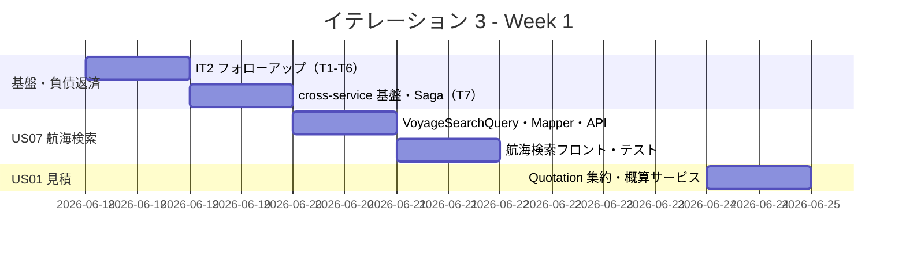
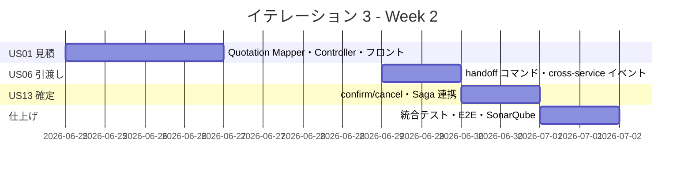
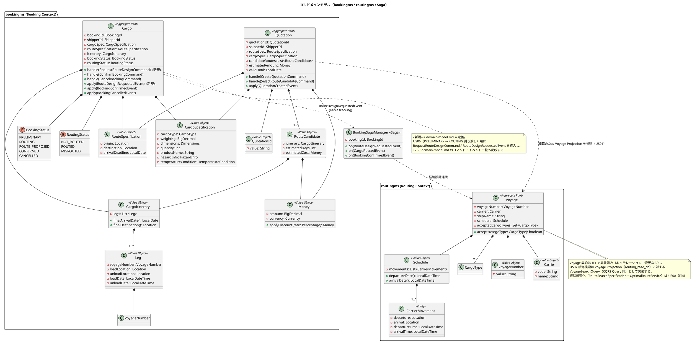
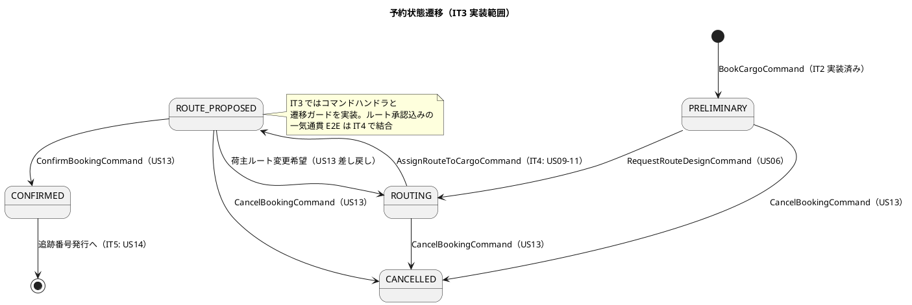
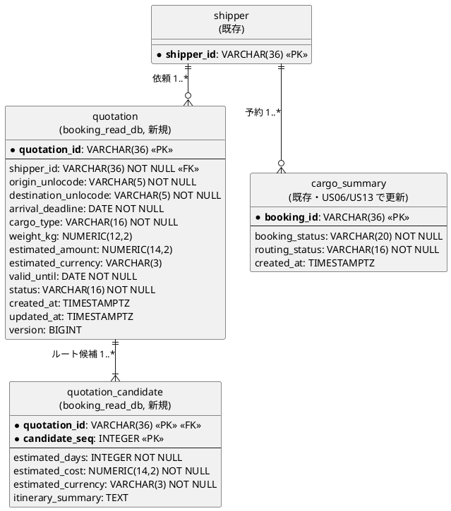
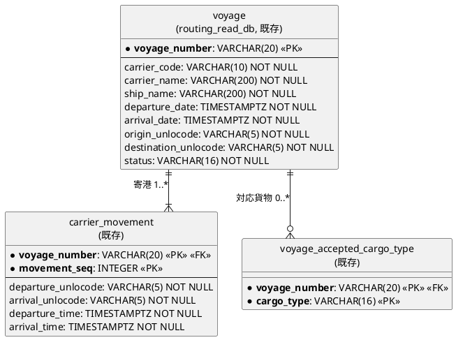
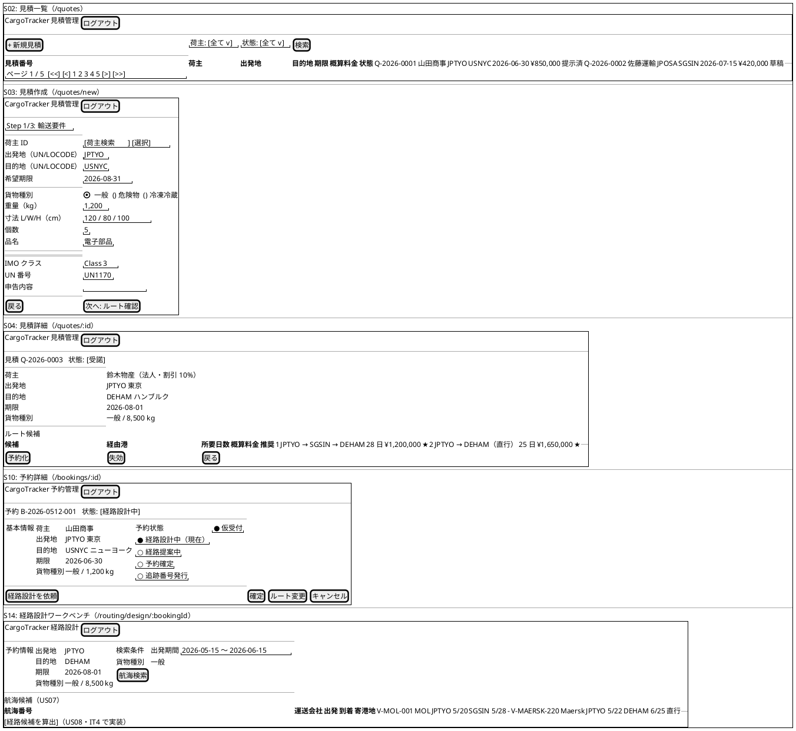
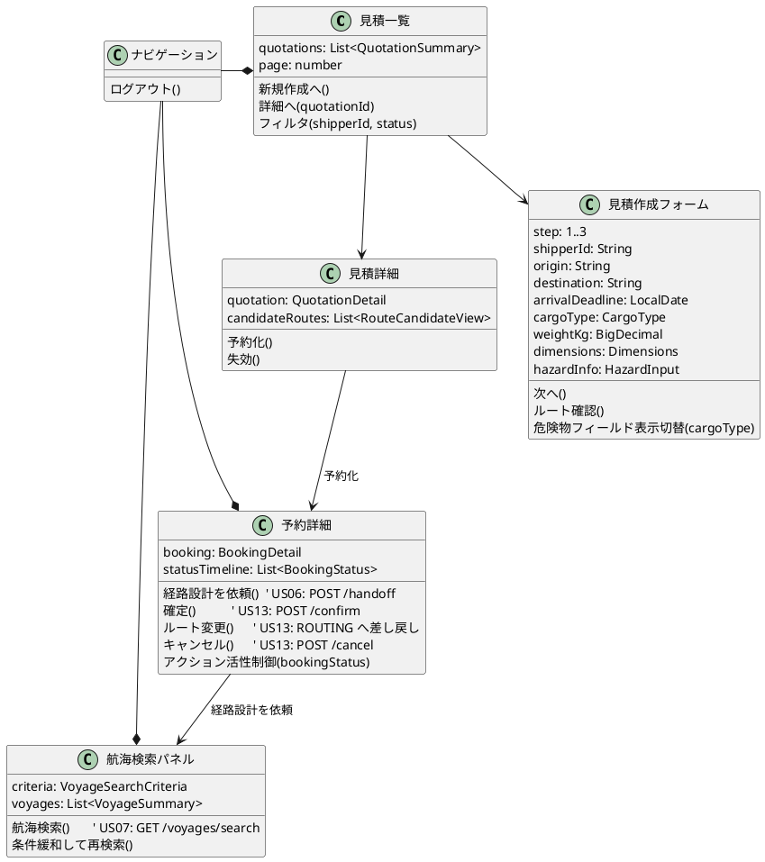
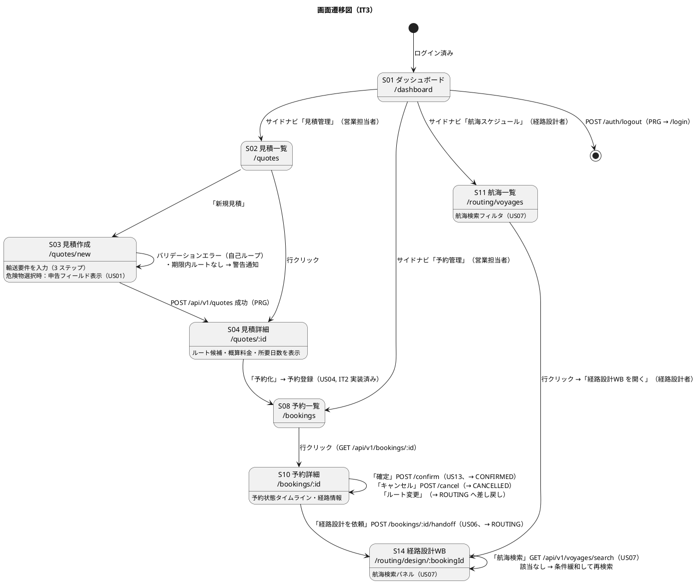

# イテレーション 3 計画

## 概要

| 項目 | 内容 |
|------|------|
| **イテレーション** | 3 |
| **期間** | 2026-06-18 〜 2026-07-01（2 週間） |
| **ゴール** | 輸送見積・予約引渡し・航海スケジュール検索・予約確定を実装し、bookingms ⇔ routingms の cross-service イベント基盤（Axon Saga + Kafka tracking モード）を確立する |
| **目標 SP** | 10 |

---

## ゴール

### イテレーション終了時の達成状態

1. **輸送見積**: 航海スケジュール情報をもとにルート概算候補・概算料金・所要日数を提示し、見積番号を発行できる（US01）
2. **予約ライフサイクル**: 予約を経路設計者に引き渡し（PRELIMINARY → ROUTING）、確定・キャンセルの状態遷移を実装する（US06・US13）
3. **航海スケジュール検索**: 経路設計者が予約の制約条件に合致する航海を検索できる（US07）
4. **cross-service 基盤**: bookingms ⇔ routingms 間を Axon Saga + Kafka tracking モードで連携し、設計通りの CQRS+Saga 構造へ移行する（IT2 Try T7）
5. **技術的負債の返済**: IT2 で持ち越したフォローアップ（T1-T6）を解消し、設計ドキュメントを SSOT として整合させる

### 成功基準

- [ ] US01: 輸送見積を作成し、ルート概算候補・見積番号発行を確認できる
- [ ] US06: 予約を経路設計者に引き渡し、状態が「経路設計中」に更新される
- [ ] US07: 制約条件に基づく航海スケジュール検索ができる
- [ ] US13: 予約を確定・キャンセルでき、状態遷移ガードが機能する
- [ ] bookingms ⇔ routingms の cross-service イベントが Kafka 経由で疎通する
- [ ] テストカバレッジ（新規コード）80% 以上 / SonarQube Quality Gate PASS

---

## ユーザーストーリー

### 対象ストーリー

| ID | ユーザーストーリー | SP | 優先度 |
|----|-------------------|----|--------|
| US01 | 輸送見積を作成する | 3 | 必須 |
| US07 | 航海スケジュールを検索する | 3 | 必須 |
| US06 | 予約情報を経路設計者に引き渡す | 2 | 必須 |
| US13 | 予約を確定する | 2 | 必須 |
| **合計** | | **10** | |

> **実装順序**: US07（航海検索）→ US01（見積はその検索結果を入力とする）→ US06（cross-service 引き渡し）→ US13（Saga 連携の確定）。データ・連携の依存関係に沿って積み上げる。

### ストーリー詳細

#### US01: 輸送見積を作成する

**ストーリー**:

> 営業担当者として、荷主の輸送要件（出発地・目的地・希望期限・貨物種別・重量）を入力し、輸送料金と所要日数の見積を作成したい。なぜなら、荷主が予算と納期を事前に把握でき、予約決定を迅速に行えるからだ。

**受入条件**:

- [ ] 出発地・目的地・希望期限・貨物種別・重量を入力できる
- [ ] 航海スケジュール情報をもとにルート概算候補が表示される
- [ ] ルート候補ごとに「経由港・所要日数・概算料金・航海番号」が表示される
- [ ] 見積情報が保存され、見積番号が発行される
- [ ] 希望期限に間に合うルートが存在しない場合、その旨が通知される
- [ ] 危険物が含まれる場合、危険物申告情報の入力フォームが表示される

**対応 UC**: UC01 / **画面**: S02 見積一覧・S03 見積作成・S04 見積詳細

#### US07: 航海スケジュールを検索する

**ストーリー**:

> 経路設計者として、予約の出発地・目的地・期限をもとに、利用可能な航海スケジュールを検索したい。なぜなら、制約条件を満たす航海を特定し、経路候補算出の入力を準備できるからだ。

**受入条件**:

- [ ] 予約番号を指定して出発地・目的地・期限・貨物仕様を確認できる
- [ ] 検索条件（出発地・目的地・出発期間・貨物種別）を入力して検索できる
- [ ] 制約条件（航海スケジュール・寄港地接続・港湾制約・貨物種別対応）に基づいて利用可能な航海が表示される
- [ ] 航海スケジュール一覧に航海番号・運送会社・出発日・到着日・寄港地が表示される
- [ ] 条件を満たす航海がない場合、その旨が表示され条件を緩和して再検索できる
- [ ] 危険物・冷凍貨物の場合、対応可能な航海のみに絞り込まれる
- [ ] 出発地・目的地は UN/LOCODE 形式で指定できる

**対応 UC**: UC05 / **画面**: S11 航海一覧・S13 航海詳細・S14 経路設計ワークベンチ（航海検索）

#### US06: 予約情報を経路設計者に引き渡す

**ストーリー**:

> 営業担当者として、仮受付された予約の出発地・目的地・期限・貨物仕様を確認し、経路設計者に引き渡したい。なぜなら、経路設計者が正確な情報をもとに最適な経路設計を開始できるからだ。

**受入条件**:

- [ ] 予約番号を指定して予約情報（出発地・目的地・期限・貨物仕様）を確認できる
- [ ] 経路設計依頼を実行すると、予約状態が「経路設計中」に更新される
- [ ] 経路設計者に経路設計依頼の通知が送信される
- [ ] 予約情報に不備がある場合、修正してから引き渡せる

**対応 UC**: UC04 / **画面**: S10 予約詳細（経路設計依頼操作）

#### US13: 予約を確定する

**ストーリー**:

> 営業担当者として、荷主がルートを承認したことを確認して予約を正式確定したい。なぜなら、荷主の同意を記録し、追跡番号発行・輸送手配に進めるからだ。

**受入条件**:

- [ ] 予約番号を指定して予約内容と選択ルートを確認できる
- [ ] 確定操作を行うと予約状態が「予約確定」に更新される
- [ ] 経路設計者に追跡番号発行依頼の通知が送信される
- [ ] 荷主がルート変更を希望する場合、予約を「経路設計中」に戻せる
- [ ] 荷主がキャンセルを希望する場合、予約をキャンセル状態に変更できる
- [ ] キャンセル時、荷主にキャンセル確認通知が送信される

**対応 UC**: UC11 / **画面**: S10 予約詳細（確定操作）

> **依存関係の注記**: US13 の「選択ルートの確認」は本来 US09（経路選択・確定、IT4）後の業務フロー。IT3 では Cargo 集約の `ConfirmBookingCommand` / `CancelBookingCommand` ハンドラと状態遷移ガード（ROUTE_PROPOSED → CONFIRMED、任意 → CANCELLED、ROUTING へ戻す）の実装に留め、ルート承認込みの一気通貫 E2E は IT4（US08-12）で結合する。

---

## タスク

### 0. IT2 フォローアップ・負債返済（0 SP）

IT2 ふりかえりの Try / 技術的負債を IT3 着手時に解消する。SP には含めず基盤整備として実施する。

| # | タスク | 見積もり | 担当 | 状態 |
|---|--------|---------|------|------|
| 0.1 | T1: 「新サービス追加チェックリスト」を `docs/reference/` に作成（gatewayms routes・deploy:dev SERVICES・docker-compose・sonar-project.properties） | 2h | - | [x] |
| 0.2 | T2: 設計ドキュメント整合（`architecture_backend.md` / `architecture_frontend.md` / `domain-model.md` / `data-model.md`）と ADR-0008「設計ドキュメントとの差分」解消 | 3h | - | [x] |
| 0.3 | T3: `fetchBookings` / `fetchShippers` 後方互換ラッパを削除し `fetchBookingsPage` / `fetchShippersPage` に統一 | 2h | - | [ ] |
| 0.4 | T4: `created_at DESC` インデックスを Flyway で追加し `data-model.md` に反映 | 1h | - | [ ] |
| 0.5 | T5: `PageResponse<T>` 型・`PAGE_SIZE` 定数を `src/shared/api/types.ts` に共通化 | 2h | - | [ ] |
| 0.6 | T6: マルチパースペクティブレビュー用プロンプトテンプレート（tester / user-representative 観点）を整備 | 1h | - | [x] |

**小計**: 11h（理想時間）

### 1. cross-service イベント基盤 / Axon Saga（0 SP, T7）

US06 / US13 の前提となる bookingms ⇔ routingms 連携基盤。SP 外で実装するが作業量は約 2 SP 相当（リスク参照）。

| # | タスク | 見積もり | 担当 | 状態 |
|---|--------|---------|------|------|
| 1.1 | Kafka tracking モード移行（bookingms / routingms の event processor を tracking に変更） | 3h | - | [ ] |
| 1.2 | cross-service イベント定義（`RouteDesignRequestedEvent` / `TrackingIssuanceRequestedEvent`）と Kafka トピック設計 | 2h | - | [ ] |
| 1.3 | `BookingSagaManager`（Axon Saga）スケルトン作成（予約→経路設計→確定のフロー骨格） | 3h | - | [ ] |
| 1.4 | ADR-0009「cross-service イベント連携と Saga 採用」作成 | 1h | - | [ ] |
| 1.5 | cross-service イベント疎通の統合テスト（Testcontainers Kafka） | 2h | - | [ ] |

**小計**: 11h（理想時間）

### 2. US07: 航海スケジュール検索（3 SP）

| # | タスク | 見積もり | 担当 | 状態 |
|---|--------|---------|------|------|
| 2.1 | routingms に `VoyageSearchCriteria` + `VoyageQueryService.search`（出発地・目的地・出発期間・貨物種別） | 3h | - | [x] |
| 2.2 | `VoyageMapper.search` に貨物種別対応・危険物/冷凍絞り込み（寄港地接続・港湾制約は US08/IT4 へ委譲） | 3h | - | [x] |
| 2.3 | `GET /api/v1/voyages/search` エンドポイント（List 形式。PageResponse 化は将来） | 2h | - | [x] |
| 2.4 | フロントエンド: S11 一覧検索フィルタ + 見積フォーム内航海検索（S14 独立 WB は US08/IT4 と一体のため見送り） | 3h | - | [x] |
| 2.5 | テスト（QueryService / Controller / Mapper 統合 / フロント、該当なし案内） | 4h | - | [x] |

**小計**: 15h（理想時間、コミット `1dd1081c` / `52f9ba77` / `f6877af8`）

### 3. US01: 輸送見積（3 SP）

| # | タスク | 見積もり | 担当 | 状態 |
|---|--------|---------|------|------|
| 3.1 | bookingms に `Quotation` 集約（`CreateQuotationCommand` / `QuotationCreatedEvent` / 見積番号採番） | 4h | - | [x] |
| 3.2 | ルート概算: フロントが US07 検索結果から選んだ候補を受け取り最安費用を概算金額とする（cross-service 同期呼び出しは回避） | 3h | - | [x] |
| 3.3 | `QuotationMapper` + `quotation` / `quotation_candidate` read model EventHandler + Flyway | 2h | - | [x] |
| 3.4 | `QuotationController`（POST /api/v1/quotes / GET 一覧 / GET 詳細） | 2h | - | [x] |
| 3.5 | フロントエンド: S02 見積一覧・S03 見積作成（US07 検索連携）・S04 見積詳細 + ルーティング | 4h | - | [x] |
| 3.6 | テスト（集約 / EventHandler / Controller / フロント各ページ） | 4h | - | [x] |

**小計**: 19h（理想時間、コミット `8d65362e` / `cbb105b4` / `18f1145c` / `4a8e24f4` / `754c264a` / `b3c07204`）

### 4. US06: 予約引渡し（2 SP）

| # | タスク | 見積もり | 担当 | 状態 |
|---|--------|---------|------|------|
| 4.1 | Cargo 集約に `RequestRouteDesignCommand` + 状態遷移（PRELIMINARY → ROUTING）ガード | 3h | - | [ ] |
| 4.2 | `CargoCommandService.requestRouteDesign` + `RouteDesignRequestedEvent` 発行（routingms へ） | 2h | - | [ ] |
| 4.3 | `POST /api/v1/bookings/{bookingId}/handoff` + 予約不備バリデーション | 2h | - | [ ] |
| 4.4 | フロントエンド: S10 予約詳細に「経路設計依頼」操作・状態表示 | 2h | - | [ ] |
| 4.5 | テスト（状態遷移・不備時のブロック・cross-service イベント発行） | 3h | - | [ ] |

**小計**: 12h（理想時間）

### 5. US13: 予約確定（2 SP）

| # | タスク | 見積もり | 担当 | 状態 |
|---|--------|---------|------|------|
| 5.1 | Cargo 集約の `ConfirmBookingCommand` / `CancelBookingCommand` 状態遷移ガード実装 | 3h | - | [ ] |
| 5.2 | `CargoCommandService` 確定/キャンセル + `TrackingIssuanceRequestedEvent`（Saga 経由） | 3h | - | [ ] |
| 5.3 | `POST /api/v1/bookings/{bookingId}/confirm` / `/cancel` エンドポイント | 2h | - | [ ] |
| 5.4 | フロントエンド: S10 予約詳細に確定・ルート変更（ROUTING へ戻す）・キャンセル操作 | 2h | - | [ ] |
| 5.5 | テスト（確定・キャンセル・差し戻し・不正遷移の拒否） | 3h | - | [ ] |

**小計**: 13h（理想時間）

### 6. E2E テスト整備（DoD 対応、0 SP）

| # | タスク | 見積もり | 担当 | 状態 |
|---|--------|---------|------|------|
| 6.1 | US01 見積作成 E2E（要件入力→ルート概算→見積番号発行→詳細表示） | 2h | - | [ ] |
| 6.2 | US07 航海検索 E2E（条件入力→絞り込み→該当なし時の再検索案内） | 2h | - | [ ] |
| 6.3 | US06/US13 予約ライフサイクル E2E（引き渡し→確定→キャンセル/差し戻し） | 2h | - | [ ] |
| 6.4 | gatewayms `local-h2` プロファイルに quotes / voyages/search ルート追加（T1 チェックリスト適用） | 0.5h | - | [ ] |
| 6.5 | `deploy:dev` SERVICES / DEPLOY_ORDER の確認（T1 チェックリスト適用） | 0.5h | - | [ ] |

**小計**: 7h（理想時間）

### タスク合計

| カテゴリ | SP | 理想時間 | 状態 |
|---------|----|---------|------|
| IT2 フォローアップ・負債返済 | 0 | 11h | [ ] |
| cross-service イベント基盤 / Axon Saga | 0 | 11h | [ ] |
| US07: 航海スケジュール検索 | 3 | 15h | [x] |
| US01: 輸送見積 | 3 | 19h | [x] |
| US06: 予約引渡し | 2 | 12h | [ ] |
| US13: 予約確定 | 2 | 13h | [ ] |
| E2E テスト整備（DoD） | 0 | 7h | [ ] |
| **合計** | **10** | **88h** | |

**1 SP あたり**: 約 8.8h（うち SP 外基盤・負債返済 29h を含む。新規ストーリー実装のみでは約 5.9h/SP）

**進捗率**: 60% (6/10 SP) — US07・US01 のバックエンド + フロントを完成。US06・US13（4 SP）は ADR-0009 承認待ち。負債返済は T1/T2/T6 完了、T3/T4/T5/T7 未着手。

---

## スケジュール

### Week 1（Day 1-5）



| 日 | タスク |
|----|--------|
| Day 1（06-18） | T1 チェックリスト、T2 設計ドキュメント整合、T3-T5 ページネーション負債返済、T6 レビューテンプレート |
| Day 2（06-19） | Kafka tracking モード移行、cross-service イベント定義、`BookingSagaManager` スケルトン、ADR-0009 |
| Day 3（06-22） | routingms `VoyageSearchQuery`・`VoyageMapper` 制約検索・`GET /voyages/search` |
| Day 4（06-23） | 航海検索フロント（S14/S11）・US07 テスト |
| Day 5（06-24） | `Quotation` 集約・`QuotationService` ルート概算（US07 検索を入力） |

### Week 2（Day 6-10）



| 日 | タスク |
|----|--------|
| Day 6（06-25） | `QuotationMapper`・read model・`QuotationController`・Flyway |
| Day 7（06-26） | 見積フロント（S02/S03/S04）・US01 テスト |
| Day 8（06-29） | US06: `RequestRouteDesignCommand`・handoff API・`RouteDesignRequestedEvent`・S10 経路設計依頼 |
| Day 9（06-30） | US13: confirm/cancel コマンド・Saga 連携・S10 確定操作・状態遷移テスト |
| Day 10（07-01） | 統合テスト、E2E（US01/US07/US06/US13）、SonarQube 確認、デモ準備 |

---

## 設計

> **注**: domain-model.md・data-model.md・ui_design.md の定義に準拠する。`<<新規>>` 印は設計ドキュメント未定義のため IT3 で導入し、T2（設計ドキュメント整合）で各設計書に反映する変更点。

### ドメインモデル

bookingms に見積（`Quotation`）集約を追加し、`Cargo` 集約へ予約ライフサイクル遷移（引き渡し・確定・キャンセル）を実装する。routingms の `Voyage` 集約（IT1 実装済み）は変更せず、US07 航海検索を Query 側に追加する。



#### Cargo 集約の不変条件（IT3 関連）

- `RequestRouteDesignCommand` は `bookingStatus = PRELIMINARY` のときのみ受理し、`ROUTING` に遷移する（不備時は `IllegalStateException`）
- `ConfirmBookingCommand` は `bookingStatus = ROUTE_PROPOSED`（IT4 で経路確定済み）のときのみ受理し、`CONFIRMED` に遷移する
- `CancelBookingCommand` は `CONFIRMED` 未満（PRELIMINARY / ROUTING / ROUTE_PROPOSED）で受理し、`CANCELLED` に遷移する
- `bookingStatus = CANCELLED` の Cargo はそれ以降のコマンドを受け付けない（domain-model.md 準拠）

### 状態遷移（Cargo 集約）



### データモデル

新規に `quotation` / `quotation_candidate`（booking_read_db）を実装する。US06/US13 は既存 `cargo_summary` の `booking_status` / `routing_status` を更新し、US07 は既存 `voyage` 系（routing_read_db、IT1 実装済み）を検索する。

> **注**: いずれも data-model.md で定義済み。`quotation` / `quotation_candidate` は新規テーブル、`cargo_summary` / `voyage` は既存テーブルの参照・更新。T4 で `cargo_summary(created_at DESC)` インデックスを追加する。

#### 新規: booking_read_db（見積）



#### 参照: routing_read_db（US07 検索対象、IT1 実装済み）



> **検索インデックス（既存）**: `voyage` の `INDEX(origin_unlocode, destination_unlocode, departure_date)` を US07 検索で利用。貨物種別絞り込みは `voyage_accepted_cargo_type` の `INDEX(cargo_type)`。新規 `quotation` には `INDEX(shipper_id, status)`。

### ユーザーインターフェース

> **注**: ui_design.md の画面 ID・パス・ビュー定義に準拠する。S02-S04=見積（営業）、S10=予約詳細（営業）、S11/S14=航海検索（経路設計）。フロントエンドは React + Vite。フォームは PRG パターン（送信成功で詳細へ）+ バリデーションエラーの自己ループで構成し、htmx は使用しない。

#### ビュー



#### モデル



#### インタラクション



#### フィードバックメッセージ

| 種別 | 契機 | メッセージ例 | スタイル |
|------|------|-------------|---------|
| 成功 | 見積作成・予約確定・引き渡し成功 | 「見積 Q-… を作成しました」「予約を経路設計者に引き渡しました」 | `alert-success` |
| 警告 | 期限内ルートなし・航海検索 0 件 | 「希望期限に間に合うルートがありません。条件を緩和してください」 | `alert-warning` |
| エラー | バリデーション・不正状態遷移 | 「この予約は経路設計を依頼できる状態ではありません」 | `alert-error` |

### API 設計

| メソッド | エンドポイント | 説明 | ストーリー |
|---------|---------------|------|-----------|
| GET | /api/v1/voyages/search | 航海スケジュール検索（PageResponse、条件: origin/destination/出発期間/cargoType） | US07 |
| POST | /api/v1/quotes | 輸送見積作成（ルート概算・見積番号発行） | US01 |
| GET | /api/v1/quotes | 見積一覧取得（PageResponse、荷主・状態フィルタ） | US01 |
| GET | /api/v1/quotes/{quotationId} | 見積詳細取得（ルート候補含む） | US01 |
| GET | /api/v1/bookings/{bookingId} | 予約詳細取得（状態・経路情報） | US06/US13 |
| POST | /api/v1/bookings/{bookingId}/handoff | 経路設計引き渡し（→ ROUTING） | US06 |
| POST | /api/v1/bookings/{bookingId}/confirm | 予約確定（→ CONFIRMED） | US13 |
| POST | /api/v1/bookings/{bookingId}/cancel | 予約キャンセル（→ CANCELLED） | US13 |

### ディレクトリ構成

```
apps/backend/
├── bookingms/src/
│   ├── main/java/.../bookingms/
│   │   ├── application/
│   │   │   ├── QuotationService.java              # 見積作成・ルート概算（US01）
│   │   │   ├── QuotationQueryService.java         # 見積一覧・詳細（PageResponse）
│   │   │   └── CargoCommandService.java           # requestRouteDesign / confirm / cancel 拡張
│   │   ├── domain/model/
│   │   │   ├── Quotation.java                     # 集約ルート（見積）
│   │   │   ├── Cargo.java                         # 集約ルート（予約・状態遷移拡張）
│   │   │   └── vo/
│   │   │       ├── QuotationId.java
│   │   │       └── RouteCandidate.java            # itinerary / estimatedDays / estimatedCost
│   │   ├── domain/event/
│   │   │   ├── QuotationCreatedEvent.java
│   │   │   ├── RouteDesignRequestedEvent.java     # 新規（cross-service）
│   │   │   ├── BookingConfirmedEvent.java
│   │   │   └── BookingCancelledEvent.java
│   │   ├── infrastructure/mapper/QuotationMapper.java
│   │   ├── saga/BookingSagaManager.java           # Axon Saga（T7）
│   │   └── interfaces/
│   │       ├── events/QuotationProjectionEventHandler.java
│   │       └── rest/QuotationController.java
│   └── main/resources/db/migration/
│       ├── V4__create_quotation.sql               # quotation + quotation_candidate
│       └── V5__add_cargo_summary_created_at_index.sql   # T4
└── routingms/src/
    ├── main/java/.../routingms/
    │   ├── application/VoyageQueryService.java     # search 追加（US07）
    │   ├── infrastructure/mapper/VoyageMapper.java # 制約検索クエリ
    │   └── interfaces/rest/VoyageController.java    # GET /voyages/search 追加
    └── main/resources/mybatis/VoyageMapper.xml

apps/frontend/src/
├── pages/
│   ├── quotes/
│   │   ├── QuotationListPage.tsx      # S02
│   │   ├── QuotationNewPage.tsx       # S03（3 ステップ）
│   │   └── QuotationDetailPage.tsx    # S04
│   ├── bookings/BookingDetailPage.tsx # S10
│   └── routing/DesignWorkbenchPage.tsx # S14（航海検索パネル）
├── components/
│   ├── quote/{QuotationForm,RouteCandidateTable}.tsx
│   ├── booking/BookingActions.tsx     # 経路設計依頼/確定/キャンセル
│   └── routing/VoyageSearchPanel.tsx
└── shared/api/
    ├── types.ts                       # PageResponse<T> / PAGE_SIZE 共通化（T5）
    ├── quoteApi.ts
    └── voyageApi.ts
```

### ADR

| ADR | タイトル | ステータス |
|-----|---------|-----------|
| [ADR-0001](../adr/0001-axon-kafka-aiven-adoption.md) | Axon Kafka Extension + Aiven 採用 | 承認済み |
| [ADR-0002](../adr/0002-mybatis-adoption.md) | MyBatis 採用 | 承認済み |
| [ADR-0008](../adr/0008-pagination-strategy.md) | ページネーション戦略（T2 で設計差分を解消） | 承認済み |
| ADR-0009（新規） | cross-service イベント連携と Axon Saga 採用（Kafka tracking モード） | 提案 → IT3 で承認 |

---

## リスクと対策

| リスク | 影響度 | 対策 |
|--------|--------|------|
| cross-service 基盤（Saga + Kafka tracking モード）の作業量が約 2 SP 相当あり、新規 10 SP と合わせて過負荷 | 高 | T7 基盤を Day 2 に前倒し集中実装。遅延時は US13 のキャンセル/差し戻しを最小実装に絞り IT4 へ一部移送 |
| US13 が US09（経路選択・確定、IT4）に先行するため一気通貫 E2E が組めない | 中 | IT3 はコマンド・状態遷移ガードの単体検証に留め、E2E は状態を直接セットして検証。承認フロー結合は IT4 |
| Kafka subscribing → tracking モード移行で既存 IT2 のイベント処理が退行する | 中 | Testcontainers Kafka で IT2 の荷主・予約登録 E2E を回帰実行してから移行を確定 |
| 見積のルート概算ロジック（US01）が US08 経路候補算出（IT4）と二重実装になる | 中 | US01 は「概算」（航海検索の単純積み上げ）に限定し、最適化は US08（OptimalRouteService）に委譲。ADR-0009 で責務境界を明記 |
| 設計ドキュメント整合（T2）が見積もり超過する | 低 | ADR-0008 の差分 5 項目に絞って解消し、全面改訂は避ける |

---

## 完了条件

### Definition of Done

- [ ] コードレビュー完了
- [ ] ユニットテストがパス（新規コードカバレッジ 80% 以上）
- [ ] E2E テストがパス
- [ ] SonarQube Quality Gate PASS（重複率 < 3%）
- [ ] cross-service イベントが Kafka 経由で疎通（Testcontainers 統合テスト）
- [ ] ローカル環境（local-docker プロファイル）で動作確認済み
- [ ] Heroku デプロイ確認済み（quotes / voyages サービスを deploy:dev に登録）
- [ ] ドキュメント更新完了（設計ドキュメント T2 整合・ADR-0009）

### デモ項目

1. 輸送要件を入力して見積を作成し、ルート概算候補・見積番号発行を確認（US01）
2. 経路設計者が予約の制約条件で航海スケジュールを検索し、危険物対応航海のみ絞り込まれることを確認（US07）
3. 予約を経路設計者に引き渡し、状態が「経路設計中」に更新され routingms にイベントが届くことを確認（US06）
4. 予約を確定し状態が「予約確定」になること、キャンセル・ルート変更差し戻しが機能することを確認（US13）

---

## 更新履歴

| 日付 | 更新内容 | 更新者 |
|------|---------|--------|
| 2026-05-25 | 初版作成（IT3: 見積・引渡し・航海検索・予約確定 + cross-service 基盤） | k2works |
| 2026-05-25 | 整合性検証による設計修正（ドメインモデル・データモデル・UI 命名を SSOT に整合） | k2works |
| 2026-05-25 | 設計セクションを IT2 粒度に拡充（VO 詳細・周辺データモデル・UI ビュー/モデル/インタラクション/フィードバック） | k2works |
| 2026-05-25 | US07・US01 の実装完了を反映（進捗 60%、6/10 SP）。実装での簡略化を各タスクに注記 | k2works |

---

## 関連ドキュメント

- [IT3 ふりかえり](./retrospective-3.md)
- [IT2 完了報告書](./iteration_report-2.md)
- [IT2 ふりかえり](./retrospective-2.md)
- [リリース計画](./release_plan.md)
- [ユーザーストーリー](../requirements/user_story.md)
- [ドメインモデル設計](../design/domain-model.md)
- [データモデル設計](../design/data-model.md)
- [UI 設計](../design/ui_design.md)
- [ADR-0008 ページネーション戦略](../adr/0008-pagination-strategy.md)
