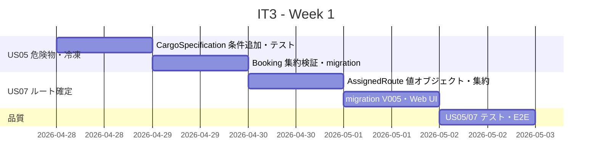
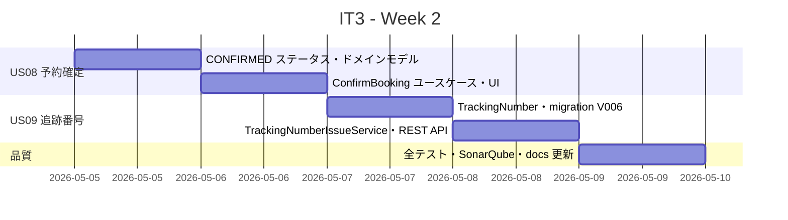
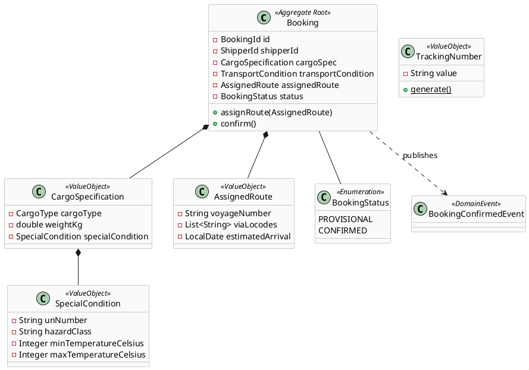
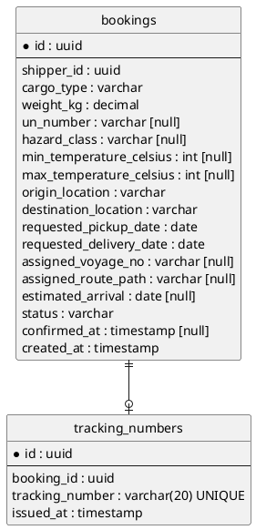
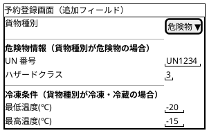
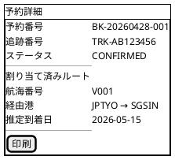
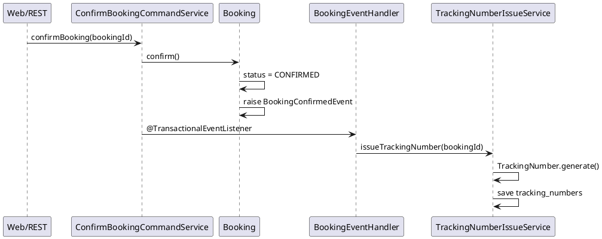

# イテレーション 3 計画

## 概要

| 項目 | 内容 |
|------|------|
| **イテレーション** | 3 |
| **期間** | Week 5-6（2026-04-28〜2026-05-11） |
| **ゴール** | 危険物・冷凍貨物対応を完成させ、ルート選択〜予約確定〜追跡番号発行までの業務フローを繋ぐ |
| **目標 SP** | 12 |

---

## ゴール

### イテレーション終了時の達成状態

1. **危険物・冷凍貨物予約**: 荷主が危険物（UN 番号付き）または冷凍貨物（温度帯指定）の特殊条件を入力して予約を登録できる
2. **ルート確定**: 経路設計者がルート検索結果から 1 件を選択し、予約に紐付けられる
3. **予約確定**: 担当者がルートを確認し、予約ステータスを CONFIRMED に変遷できる
4. **追跡番号発行**: 予約確定時に追跡番号が自動発行され、追跡番号で予約を検索できる
5. **品質維持**: backend テスト、E2E、SonarQube Quality Gate の基準を IT2 から維持する

### 成功基準

- [ ] 危険物予約で UN 番号が必須入力となり、冷凍貨物で温度帯（最低・最高温度）が必須入力となる
- [ ] ルート検索結果一覧から「この予約に割り当てる」ボタンで選択したルートが予約に紐付く
- [ ] ルート未割り当ての予約では確定操作ができない（バリデーションエラー）
- [ ] ルートが割り当て済みの予約を確定すると、予約ステータスが CONFIRMED になる
- [ ] 予約確定時に追跡番号（英数字 10 桁）が自動発行される
- [ ] 追跡番号で予約情報（出発地・目的地・ステータス）を検索できる（REST API）
- [ ] backend テスト Green・テストカバレッジ 80% 以上・SonarQube Quality Gate PASS

---

## ユーザーストーリー

### 対象ストーリー

| ID | ユーザーストーリー | SP | 優先度 |
|----|-------------------|----|--------|
| US05 | 危険物・冷凍貨物の予約を登録する | 3 | 必須 |
| US07 | ルートを選択して予約に紐付ける | 3 | 必須 |
| US08 | 予約を確定する | 3 | 必須 |
| US09 | 追跡番号を発行する | 3 | 必須 |
| **合計** | | **12** | |

### ストーリー詳細

#### US05: 危険物・冷凍貨物の予約を登録する

**ストーリー**:
> 荷主として、危険物（UN 番号・ハザードクラス付き）または冷凍貨物（最低・最高温度帯付き）の特殊条件を入力して予約を登録したい。なぜなら、特殊な貨物の安全な輸送のために取扱い可能なルートのみを選択できるようにするからだ。

**受入条件**:

1. 貨物種別で「危険物」を選択すると UN 番号・ハザードクラスの入力欄が表示される
2. 危険物予約で UN 番号が未入力の場合はバリデーションエラーになる
3. 貨物種別で「冷凍・冷蔵」を選択すると最低温度・最高温度の入力欄が表示される
4. 冷凍貨物で温度帯が未入力の場合はバリデーションエラーになる
5. 特殊条件付きで登録された予約は、ルート検索時に対応可能なルートのみ表示される

#### US07: ルートを選択して予約に紐付ける

**ストーリー**:
> 経路設計者として、ルート検索結果の中から 1 件を選択し、対象の予約に紐付けたい。なぜなら、確定したルートを予約に結びつけることで、荷役・積み替え計画の具体化に進めるからだ。

**受入条件**:

1. ルート検索結果の各候補に「この予約に割り当てる」ボタンが表示される
2. ボタンを押すと確認ダイアログ（または確認画面）が表示される
3. 確定後、予約詳細に「割り当て済みルート」として航海番号・経由港・推定到着日が表示される
4. 既にルートが割り当て済みの予約には「ルート変更」ボタンで上書き可能である
5. 予約ステータスは PROVISIONAL のままとなる（確定は US08 で行う）

#### US08: 予約を確定する

**ストーリー**:
> 担当者として、ルートが確定した予約を「確定」操作によって CONFIRMED ステータスに変更したい。なぜなら、確定済み予約を荷役・追跡・請求の起点として扱えるようにするからだ。

**受入条件**:

1. 予約詳細画面に「予約を確定する」ボタンが表示される
2. ルートが割り当てられていない予約に対して確定操作を行うとエラーメッセージが表示される
3. 確定操作後、予約ステータスが CONFIRMED に変わる
4. CONFIRMED 予約には「確定日時」が記録される
5. 確定後は予約情報の変更ができない（変更時にエラー）

#### US09: 追跡番号を発行する

**ストーリー**:
> 担当者として、予約確定時に追跡番号が自動発行され、追跡番号で予約・輸送状況を照会したい。なぜなら、荷主や関係者が追跡番号で輸送状況を確認できるようにするからだ。

**受入条件**:

1. 予約確定時に追跡番号（英数字 10 桁、例: TRK-XXXXXXXX）が自動発行される
2. 予約確定後の詳細画面に追跡番号が表示される
3. REST API で追跡番号を指定して予約情報（出発地・目的地・ステータス・割り当てルート）を検索できる
4. 存在しない追跡番号を指定した場合は 404 が返却される
5. 追跡番号はシステム全体で一意となる

---

## タスク

### 1. US05: 危険物・冷凍貨物の予約を登録する（3 SP）

| # | タスク | 見積もり | 担当 | 状態 |
|---|--------|---------|------|------|
| 1.1 | CargoSpecification に危険物条件（UnNumber、HazardClass）と冷凍条件（MinTemp、MaxTemp）を追加し、CargoType 別バリデーション規則をユニットテストする | 3h | Copilot | [ ] |
| 1.2 | Booking 集約の register() で危険物・冷凍条件の不整合を検証するロジックを追加し、テストする | 3h | Copilot | [ ] |
| 1.3 | 予約登録フォームに危険物・冷凍の条件入力 UI（動的表示）を追加し、バリデーションエラーを確認する | 3h | Copilot | [ ] |
| 1.4 | Booking テーブルに危険物・冷凍カラムを追加する（Flyway migration）。REST API・MVC テスト・E2E を追加する | 3h | Copilot | [ ] |

**小計**: 12h（理想時間）

### 2. US07: ルートを選択して予約に紐付ける（3 SP）

| # | タスク | 見積もり | 担当 | 状態 |
|---|--------|---------|------|------|
| 2.1 | AssignedRoute 値オブジェクトと assignRoute() コマンドを Booking 集約に追加し、ユニットテストする | 4h | Copilot | [ ] |
| 2.2 | Booking テーブルに assigned_voyage_no・route_path・estimated_arrival カラムを追加する（Flyway migration V005） | 2h | Copilot | [ ] |
| 2.3 | ルート検索結果画面に「割り当て」ボタンと確認・完了画面を実装し、予約詳細に割り当て済みルートを表示する | 4h | Copilot | [ ] |
| 2.4 | AssignRoute REST API・MVC テスト・E2E を追加する | 2h | Copilot | [ ] |

**小計**: 12h（理想時間）

### 3. US08: 予約を確定する（3 SP）

| # | タスク | 見積もり | 担当 | 状態 |
|---|--------|---------|------|------|
| 3.1 | BookingStatus に CONFIRMED を追加し、confirm() ドメインメソッドと BookingConfirmedEvent を Booking 集約に実装してユニットテストする | 4h | Copilot | [ ] |
| 3.2 | ConfirmBookingCommandService と確定ユースケースを実装する。ルート未割り当て時の業務例外を含める | 3h | Copilot | [ ] |
| 3.3 | 予約詳細画面に「予約を確定する」ボタンを追加し、確定後の状態表示と変更不可 UI を実装する | 3h | Copilot | [ ] |
| 3.4 | MVC テスト・REST テスト・E2E を追加する | 2h | Copilot | [ ] |

**小計**: 12h（理想時間）

### 4. US09: 追跡番号を発行する（3 SP）

| # | タスク | 見積もり | 担当 | 状態 |
|---|--------|---------|------|------|
| 4.1 | TrackingNumber 値オブジェクト（TRK-XXXXXXXX 形式）と tracking_numbers テーブル（Flyway migration V006）を追加する | 3h | Copilot | [ ] |
| 4.2 | BookingConfirmedEvent を受けて TrackingNumber を発行する TrackingNumberIssueService を実装し、ユニットテストする | 4h | Copilot | [ ] |
| 4.3 | 追跡番号検索 REST API（GET /api/v1/tracking/{trackingNumber}）と予約詳細への追跡番号表示を実装する | 3h | Copilot | [ ] |
| 4.4 | ユニットテスト・REST テスト・E2E を追加する。SonarQube・docs 更新を含めた品質ゲート確認を行う | 2h | Copilot | [ ] |

**小計**: 12h（理想時間）

### タスク合計

| カテゴリ | SP | 理想時間 | 状態 |
|---------|----|---------|------|
| US05 危険物・冷凍貨物予約 | 3 | 12h | 未着手 |
| US07 ルート確定 | 3 | 12h | 未着手 |
| US08 予約確定 | 3 | 12h | 未着手 |
| US09 追跡番号発行 | 3 | 12h | 未着手 |
| **合計** | **12** | **48h** | |

**1 SP あたり**: 4h
**進捗率**: 0%（0/16 タスク完了）

---

## スケジュール

### Week 1（Day 1-5: 2026-04-28〜2026-05-02）

| 日 | タスク |
|----|--------|
| Day 1 | CargoSpecification 危険物・冷凍条件追加、バリデーション規則ユニットテスト |
| Day 2 | Booking 集約検証ロジック追加、booking テーブル migration |
| Day 3 | AssignedRoute 値オブジェクト・assignRoute() コマンド、migration V005 |
| Day 4 | ルート検索 UI に割り当てボタン追加、予約詳細のルート表示 |
| Day 5 | US05 フォーム動的 UI・バリデーション、US07 REST API・E2E |

### Week 2（Day 6-10: 2026-05-05〜2026-05-09）

| 日 | タスク |
|----|--------|
| Day 6 | BookingStatus CONFIRMED 追加、confirm() メソッド・BookingConfirmedEvent、ユニットテスト |
| Day 7 | ConfirmBookingCommandService、予約詳細 UI の確定ボタン・変更不可制御 |
| Day 8 | TrackingNumber 値オブジェクト、migration V006、TrackingNumberIssueService |
| Day 9 | 追跡番号検索 REST API、予約詳細の追跡番号表示、E2E |
| Day 10 | SonarQube 確認、docs 更新、バグ修正、デモ準備 |

---

## 設計

### ドメインモデル

### データモデル

### ユーザーインターフェース

#### 予約登録（危険物・冷凍条件）

#### 予約詳細（確定・追跡番号）

### アーキテクチャ（ドメインイベントフロー）

---

## 計画調整メモ

- IT1・IT2 の実績ベロシティはともに 10 SP。IT3 は 12 SP とやや増加しているが、IT2 で基盤（stub・WireMock・E2E）が整備済みのため対応可能と判断する。
- US05 の `CargoSpecification` 拡張は既存テストへの影響が大きいため、最初に着手して回帰テストを早期に確認する。
- US07〜09 は業務フローとして連鎖（ルート確定 → 確定 → 追跡番号）しているため、この順序で進める。
- 追跡番号（US09）は `@TransactionalEventListener` で `BookingConfirmedEvent` を受信して発行する設計とし、IT1 で確立した `@Commit` テストパターンを再利用する。
- IT3 終了時に 3 イテレーション実績でベロシティを再確定し、IT4 以降の計画を調整する。

---

## 更新履歴

| 日付 | 更新内容 | 更新者 |
|------|---------|--------|
| 2026-04-02 | IT3 計画を作成 | Copilot |
