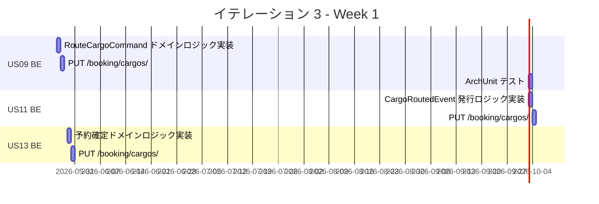
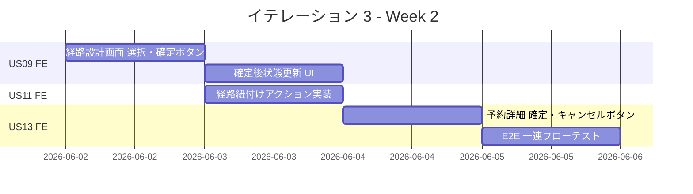
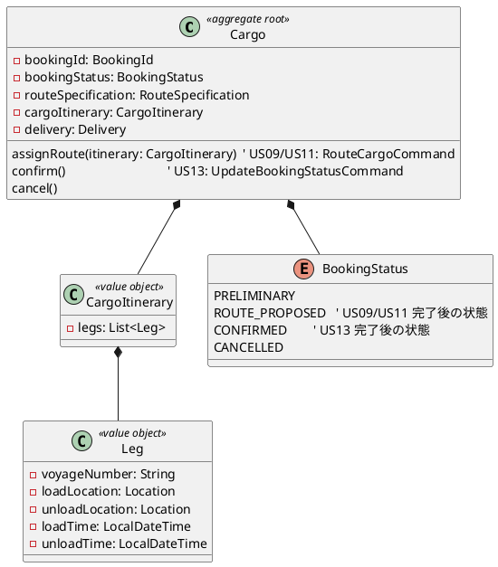
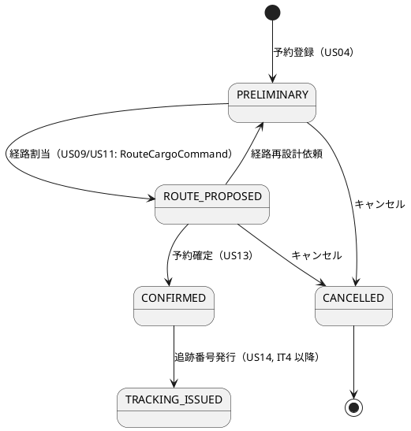
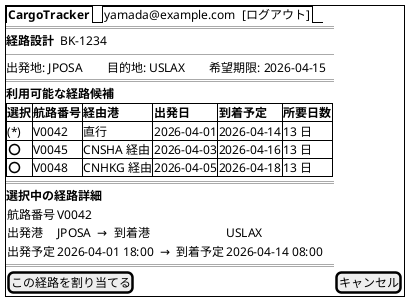
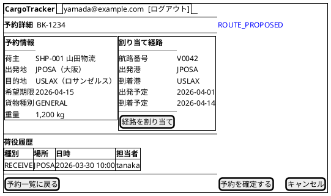
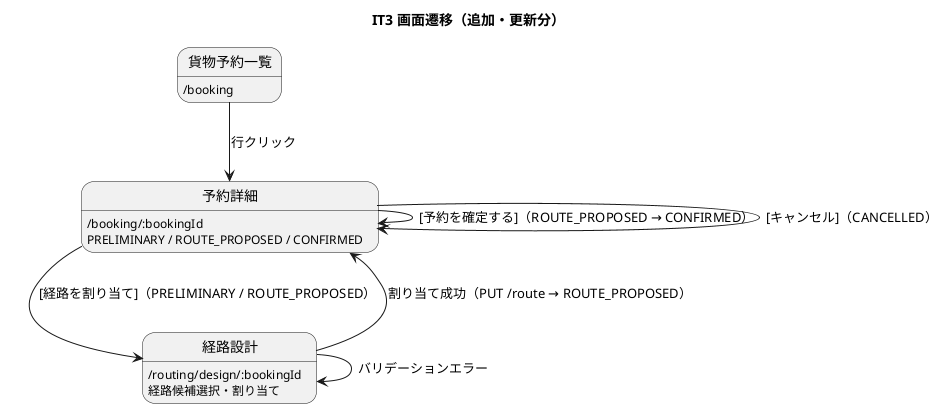

# イテレーション 3 計画

## 概要

| 項目 | 内容 |
|------|------|
| **イテレーション** | 3 |
| **期間** | Week 5-6（2026-05-26〜2026-06-06） |
| **ゴール** | 経路選択・確定・予約紐付け・予約確定の一連のフローを API + 画面で完成する |
| **目標 SP** | 18（BE 11 + FE 7） |

---

## ゴール

### イテレーション終了時の達成状態

1. **経路選択・確定**: bookingms の `RouteCargoCommand` で経路候補を CargoItinerary として Cargo 集約に割り当て、予約状態が `ROUTE_PROPOSED` に遷移する API が動作し、React SPA の経路設計画面で選択・割り当て操作ができる
2. **経路紐付け**: 選択した経路情報（CargoItinerary）を貨物予約に割り当て（RouteCargoCommand）、予約状態を `ROUTE_PROPOSED` に更新できる API + 画面が動作する
3. **予約確定**: bookingms で荷主承認を記録して予約状態を「予約確定」に更新できる API + 画面が動作し、予約→経路→確定の一連フローが E2E で動作する

### 成功基準

- [x] US09: 経路候補を選択して CargoItinerary を割り当てられる API が動作する（bookingms）
- [x] US09: 経路設計画面で候補選択・確定操作ができる
- [x] US11: 確定経路を予約に紐付けられる API が動作する
- [x] US11: 紐付け後、予約状態が `ROUTE_PROPOSED` に更新される
- [x] US13: 予約確定 API が動作する（bookingms）
- [x] US13: 予約確定画面で確定操作ができる
- [ ] テストカバレッジ 80% 以上（routingms + bookingms、JaCoCo / Vitest）

---

## ユーザーストーリー

### 対象ストーリー

| ID | ユーザーストーリー | BE | FE | SP | 優先度 |
|----|-------------------|----|----|-----|--------|
| US09 | 経路を選択・確定する | 5 | 3 | 8 | 必須 |
| US11 | 経路情報を予約に紐付ける | 3 | 2 | 5 | 必須 |
| US13 | 予約を確定する | 3 | 2 | 5 | 必須 |
| **合計** | | **11** | **7** | **18** | |

### ストーリー詳細

#### US09: 経路を選択・確定する

**ストーリー**:

> 経路設計者として、算出された経路候補から最適なものを選択し、経路を確定したい。なぜなら、最適経路を正式に確定し、予約への紐付けに進めるからだ。

**受入条件**:

1. 経路候補一覧（経由港・所要日数・費用・航海番号）を確認できる
2. 最適な経路候補を 1 件選択できる
3. 選択後、bookingms に経路割当が通知され予約状態が「経路提案中」（ROUTE_PROPOSED）になる
4. 最適な候補がない場合、経路条件調整（US10）に進める（US10 は IT3 スコープ外だが画面上のナビゲーションは提供する）
5. 認証なしのリクエストは 401 エラーを返す

#### US11: 経路情報を予約に紐付ける

**ストーリー**:

> 経路設計者として、確定した経路情報を貨物予約に紐付けたい。なぜなら、予約と経路の関連を確立し、営業担当者が荷主にルート提案できるようにするからだ。

**受入条件**:

1. 確定経路と予約番号を確認できる
2. 経路情報を予約に紐付ける操作を実行できる
3. 紐付け後、予約状態が「経路提案中」（ROUTE_PROPOSED）に更新される

#### US13: 予約を確定する

**ストーリー**:

> 営業担当者として、荷主がルートを承認したことを確認して予約を正式確定したい。なぜなら、荷主の同意を記録し、追跡番号発行・輸送手配に進めるからだ。

**受入条件**:

1. 予約番号を指定して予約内容と選択ルートを確認できる
2. 確定操作を行うと予約状態が「予約確定」（CONFIRMED）に更新される
3. 経路設計者に追跡番号発行依頼の通知イベントが発行される
4. 荷主がルート変更を希望する場合、予約を「経路設計中」（PRELIMINARY）に戻せる
5. 荷主がキャンセルを希望する場合、予約をキャンセル状態（CANCELLED）に変更できる

### タスク

#### 1. US09 経路選択・確定（8 SP）

| # | タスク | 見積もり | 担当 | 状態 |
|---|--------|---------|------|------|
| 1.1 | bookingms: RouteCargoCommand ドメインロジック実装（CargoItinerary 割当 → ROUTE_PROPOSED） | 4h | - | [x] |
| 1.2 | bookingms: PUT /api/booking/cargos/:id/route エンドポイント実装 | 2h | - | [x] |
| 1.3 | bookingms: ArchUnit テスト追加 | 1h | - | [x] |
| 1.4 | FE: 経路設計画面に「この経路を割り当てる」ボタン追加（TanStack Query mutation） | 3h | - | [x] |
| 1.5 | FE: 割り当て成功後に /booking/:bookingId へ遷移（React Router）・フィードバック UI 実装 | 2h | - | [x] |

**小計**: 12h（理想時間）

#### 2. US11 経路紐付け（5 SP）

| # | タスク | 見積もり | 担当 | 状態 |
|---|--------|---------|------|------|
| 2.1 | bookingms: CargoRoutedEvent 発行ロジック実装（RabbitMQ → trackingms 同期） | 3h | - | [ ] |
| 2.2 | bookingms: PUT /api/booking/cargos/:id/route レスポンス + テスト補完 | 2h | - | [x] |
| 2.3 | FE: 予約詳細画面（/booking/:bookingId）に ROUTE_PROPOSED バッジ + 経路情報表示 | 2h | - | [x] |

**小計**: 7h（理想時間）

#### 3. US13 予約確定（5 SP）

| # | タスク | 見積もり | 担当 | 状態 |
|---|--------|---------|------|------|
| 3.1 | bookingms: 予約確定ドメインロジック実装（予約状態 → CONFIRMED） | 3h | - | [x] |
| 3.2 | bookingms: PUT /api/booking/cargos/:id/confirm エンドポイント実装 | 2h | - | [x] |
| 3.3 | FE: 予約詳細画面に確定・キャンセルボタン実装 | 3h | - | [x] |
| 3.4 | E2E: 予約→経路→確定の一連フロー Playwright テスト作成 | 2h | - | [x] |

**小計**: 10h（理想時間）

#### タスク合計

| カテゴリ | SP | 理想時間 | 状態 |
|---------|-----|---------|------|
| US09 経路選択・確定 | 8 | 12h | [x] |
| US11 経路紐付け（2.1 のみ未完） | 5 | 7h | 実施中 |
| US13 予約確定 | 5 | 10h | [x] |
| **合計** | **18** | **29h** | |

**1 SP あたり**: 約 1.6h（IT2 実績 2.1h より効率化を目標）

**進捗率**: 約 94%（17/18 SP 相当 — CargoRoutedEvent が残り）

---

## スケジュール

### Week 1（Day 1-5）: 2026-05-26〜2026-05-30



| 日 | タスク |
|----|--------|
| Day 1 | US09 BE: RouteCargoCommand ドメインロジック（CargoItinerary 割当 → ROUTE_PROPOSED）TDD |
| Day 2 | US09 BE: PUT /api/booking/cargos/:id/route エンドポイント + テスト |
| Day 3 | US11 BE: CargoRoutedEvent 発行ロジック（RabbitMQ）+ テスト |
| Day 4 | US13 BE: 予約確定ドメインロジック + エンドポイント TDD |
| Day 5 | BE 統合確認・ArchUnit テスト・カバレッジ確認 |

### Week 2（Day 6-10）: 2026-06-02〜2026-06-06



| 日 | タスク |
|----|--------|
| Day 6 | US09 FE: 経路設計画面 選択・確定ボタン（TanStack Query mutation） |
| Day 7 | US11 FE: 経路紐付けアクション実装 + 状態フィードバック UI |
| Day 8 | US13 FE: 予約詳細画面 確定・キャンセルボタン実装 |
| Day 9 | E2E: 予約→経路→確定の一連フロー Playwright テスト作成 |
| Day 10 | 統合テスト・バグ修正・デモ準備 |

---

## 設計

### ドメインモデル

IT3 は domain-model.md の既存設計（Cargo 集約）を拡張する。新規集約は追加しない。



> **注**: `RouteCargoCommand`（US09/US11）は bookingms の Booking Context が担当。routingms は経路候補算出（US08）と航海スケジュール管理のみを担当し、経路割当の状態管理は bookingms が行う。

### データモデル

IT3 では新規テーブルの追加はない。既存の `cargo` テーブルと `leg` テーブルに対してデータを更新・挿入する。

| 操作 | テーブル | 対象カラム | 変更内容 |
|------|---------|-----------|---------|
| UPDATE | `cargo` | `booking_status` | `ROUTE_PROPOSED`（US09/US11）・`CONFIRMED`（US13）・`CANCELLED` への遷移 |
| UPDATE | `cargo` | `routing_status` | `ROUTED` への更新（経路割当時） |
| INSERT | `leg` | 全カラム | CargoItinerary の各 Leg を `cargo_id` FK で挿入 |

**`leg` テーブルの主要カラム（data-model.md 準拠）**:

| カラム | 型 | 制約 | 説明 |
|-------|-----|------|------|
| `id` | `BIGSERIAL` | PK | サロゲートキー |
| `cargo_id` | `BIGINT` | FK → cargo.id, NOT NULL | 親貨物（FK はサロゲートキー参照） |
| `voyage_number` | `VARCHAR(20)` | NOT NULL | 論理参照（routing_db との論理 FK） |
| `load_location_unlocode` | `VARCHAR(5)` | FK, NOT NULL | 積込場所 |
| `unload_location_unlocode` | `VARCHAR(5)` | FK, NOT NULL | 荷降場所 |
| `load_time` | `TIMESTAMP` | - | 積込時刻 |
| `unload_time` | `TIMESTAMP` | - | 荷降時刻 |
| `seq_number` | `INTEGER` | NOT NULL | 旅程内の順序番号 |
| `created_at` | `TIMESTAMP WITH TIME ZONE` | NOT NULL | 監査カラム |
| `updated_at` | `TIMESTAMP WITH TIME ZONE` | NOT NULL | 監査カラム |

### API 設計

| メソッド | エンドポイント | サービス | 説明 |
|---------|---------------|---------|------|
| PUT | /api/booking/cargos/:bookingId/route | bookingms | 経路選択・旅程割当・ROUTE_PROPOSED に遷移（RouteCargoCommand） |
| PUT | /api/booking/cargos/:bookingId/confirm | bookingms | 予約確定・CONFIRMED に遷移 |
| PUT | /api/booking/cargos/:bookingId/cancel | bookingms | 予約キャンセル・CANCELLED に遷移 |

> **注**: UI 設計（ui-design.md）の仕様に準拠。経路設計画面の「この経路を割り当てる」ボタンは `PUT /api/booking/cargos/:bookingId/route` を呼び出す。routingms への新規エンドポイント追加はなし。

### 状態遷移

BookingStatus の遷移（domain-model.md 準拠）:



### ユーザーインターフェース

#### ビュー

##### 経路設計画面（/routing/design/:bookingId）— 更新



**仕様（IT3 追加・更新分）**:

- **「この経路を割り当てる」**: `PUT /api/booking/cargos/:bookingId/route` を TanStack Query mutation で呼び出す
- **割り当て成功**: React Router で `/booking/:bookingId` へ遷移し、トースト通知で成功フィードバック
- **希望期限超過**: 到着予定が希望期限を超える経路は警告バッジ付き（既存仕様、IT2 で実装済みの可能性あり）

##### 予約詳細画面（/booking/:bookingId）— 更新



**仕様（IT3 追加・更新分）**:

- **ROUTE_PROPOSED バッジ**: ページタイトル横に BookingStatus を表示（既存実装を拡張）
- **[予約を確定する]**: `ROLE_SALES` かつ `ROUTE_PROPOSED` のみ表示。`PUT /api/booking/cargos/:bookingId/confirm`
- **[キャンセル]**: 確認ダイアログ後に `PUT /api/booking/cargos/:bookingId/cancel`
- **[経路を割り当て]**: `ROLE_ROUTING` かつ `PRELIMINARY` / `ROUTE_PROPOSED` のみ表示（ui-design.md 準拠）

#### インタラクション



### ディレクトリ構成

```
apps/
  bookingms/
    src/main/java/.../booking/
      domain/
        Cargo.java                   # 更新: assignRoute(CargoItinerary), confirm(), cancel()
        CargoItinerary.java          # 更新: Leg リストを保持する値オブジェクト
        Leg.java                     # 既存: 輸送区間値オブジェクト
      application/
        CargoRoutingService.java     # 新規: RouteCargoCommand 処理（ROUTE_PROPOSED 遷移）
        CargoConfirmService.java     # 新規: 予約確定処理（CONFIRMED 遷移）
      infrastructure/
        rest/
          CargoController.java       # 更新: PUT /route, PUT /confirm, PUT /cancel
        messaging/
          CargoRoutedEventPublisher.java  # 新規: CargoRoutedEvent → RabbitMQ
  frontend/
    src/
      features/
        routing/
          RoutingDesignPage.tsx      # 更新: 「この経路を割り当てる」ボタン + mutation
        booking/
          BookingDetailPage.tsx      # 更新: ROUTE_PROPOSED バッジ + 確定・キャンセルボタン
```

---

## リスクと対策

| リスク | 影響度 | 対策 |
|--------|--------|------|
| bookingms と routingms のサービス間連携が複雑 | 中 | まず BE 単体テストで動作確認してから Gateway 経由連携をテスト |
| 予約状態遷移のルール漏れ | 中 | 状態遷移図を先に確定し、ドメインロジックでガード節を実装 |
| E2E テストで既存フローとの整合性が取れない | 低 | IT2 の E2E テストを参考にし、同じヘルパー関数を再利用 |

---

## 完了条件

### Definition of Done

- [x] コードレビュー完了（AI ペアレビュー）
- [x] ユニットテストがパス（routingms + bookingms）
- [x] ArchUnit テストがパス
- [x] E2E テストがパス（予約→経路→確定の一連フロー）
- [ ] テストカバレッジ 80% 以上（JaCoCo）
- [ ] 機能がローカル環境で動作確認済み
- [x] ドキュメント更新完了

### デモ項目

1. 経路候補一覧から 1 件を選択・確定する操作
2. 確定した経路を貨物予約に紐付け、予約状態が「経路提案中」に変わる
3. 予約確定操作で予約状態が「予約確定」に変わる
4. キャンセル操作で予約をキャンセル状態に変更する

---

## 更新履歴

| 日付 | 更新内容 | 更新者 |
|------|---------|--------|
| 2026-05-08 | 初版作成 | - |
| 2026-05-08 | 整合性検証による修正（BookingStatus・API 設計・US受入条件・データモデル追加） | - |
| 2026-05-08 | 進捗更新: US09/US11/US13 主要実装完了（16/18 SP = 89%）。残: CargoRoutedEvent・E2E テスト | - |

---

## 関連ドキュメント

- [イテレーション 3 ふりかえり](./retrospective-3.md)
- [イテレーション 2 計画](./iteration_plan-2.md)
- [リリース計画](./release_plan.md)
