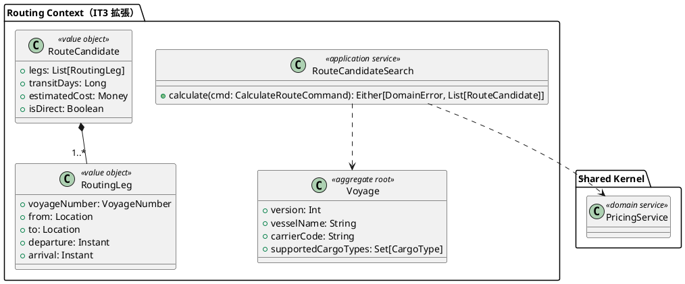
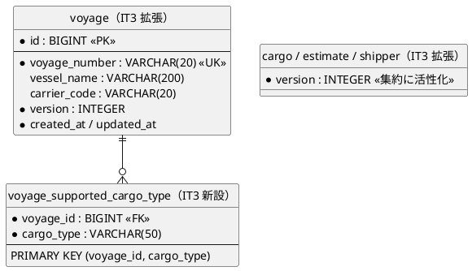

# イテレーション 3 計画

## 概要

| 項目 | 内容 |
|------|------|
| **イテレーション** | 3 |
| **期間** | Week 5-6（2026-07-20 〜 2026-08-02、2 週間） |
| **ゴール** | 航海スケジュール検索（US07）と経路候補算出（US08、Phase 2 最大リスク要素）を完成させる。IT2 申し送りの技術的負債を Day 1-2 で解消し、new_coverage 80% を復元する |
| **目標 SP** | 11（US07: 3 + US08: 8） |

---

## ゴール

### イテレーション終了時の達成状態

1. **Routing 検索**: 経路設計者が出発地・目的地・出発期間・貨物種別で航海スケジュールを検索でき、危険物・冷凍貨物の場合は対応航海のみに絞り込まれる
2. **経路候補算出**: IT2 Spike `RouteCandidateSearchSpike` を `routing.application.RouteCandidateSearch` に格上げし、料金スコアリング + 対応貨物種別フィルタ + 上位 N 候補選定 + P95 < 3 秒（非機能要件）
3. **データモデル追補**: 船名・運送会社・対応貨物種別カラムを `voyage` テーブルに追加（ADR で定義）
4. **楽観ロック完全活性化**: Cargo / Estimate / Shipper / Voyage に `version: Int` フィールドを追加し、`Either[DomainError.ConcurrentModification, A]` を返す
5. **テストカバレッジ復元**: Controller / Twirl / Dashboard 統合テストで new_coverage 80% に復元、SonarQube QG 完全 PASS

### 成功基準

- [ ] US07・US08 の受入基準すべてを満たす
- [ ] テストカバレッジ 80% 以上（IT2 末 78.67% → 復元）
- [ ] SonarQube QG 完全 PASS（new_coverage ≥ 80%）
- [ ] ScalaTest 全パス（IT2 末 158 件 → IT3 末 200 件以上）
- [ ] ArchUnit 5 ルール pass
- [ ] パフォーマンステスト pass: 経路候補算出 P95 < 3 秒（航海数 1000 件規模）
- [ ] ADR 0006（データモデル追補：voyage 船名・運送会社・対応貨物種別）を作成

---

## ユーザーストーリー

### 対象ストーリー

| ID | ユーザーストーリー | SP | 優先度 |
|----|-------------------|----|----|
| US07 | 航海スケジュールを検索する | 3 | 必須 |
| US08 | 経路候補を算出する | 8 | 必須 |
| **合計** | | **11** | |

### ストーリー詳細

#### US07: 航海スケジュールを検索する

**ストーリー**:
> 経路設計者として、予約の出発地・目的地・期限をもとに利用可能な航海スケジュールを検索したい。なぜなら、制約条件を満たす航海を特定し経路候補算出の入力を準備できるからだ。

**受入条件**:

1. 予約番号を指定して出発地・目的地・期限・貨物仕様を確認できる
2. 検索条件（出発地・目的地・出発期間・貨物種別）を入力して検索できる
3. 制約条件（航海スケジュール・寄港地接続・港湾制約・貨物種別対応）に基づいて利用可能な航海が表示される
4. 航海スケジュール一覧に航海番号・運送会社・出発日・到着日・寄港地が表示される
5. 条件を満たす航海がない場合、その旨が表示され条件を緩和して再検索できる
6. 危険物・冷凍貨物の場合、対応可能な航海のみに絞り込まれる
7. 出発地・目的地は UN/LOCODE 形式で指定できる

#### US08: 経路候補を算出する

**ストーリー**:
> 経路設計者として、航海スケジュール検索結果をもとに制約条件を考慮した経路候補を自動算出してほしい。なぜなら、手作業の属人化を解消し制約条件を漏れなく考慮した最適経路を効率的に見つけられるからだ。

**受入条件**:

1. 航海スケジュール検索結果と出発地・目的地・期限を入力として経路候補が自動算出される
2. 寄港地の接続可能性が評価される
3. 経路候補ごとに所要日数・経由港・費用・航海番号が表示される
4. 経路候補が推奨順に並べられて提示される
5. 直行便がある場合、最優先候補として提示される
6. 期限内に到達可能な経路がない場合、その旨が通知され条件調整が促される

**前提**: IT2 Spike `RouteCandidateSearchSpike` で DFS + 深さ制限の実装と純関数化が完了済み（ADR 0005）。IT3 では domain 格上げと業務要件追加で完成させる。

---

### タスク

#### 0. IT2 申し送り事項の解消（0 SP、技術的負債）

| # | タスク | 見積もり | 担当 | 状態 |
|---|--------|---------|------|------|
| 0.1 | Controller / Twirl / Dashboard の Play `FakeRequest` 統合テスト追加（CSRF / AuthFilter / Flash / PRG）。new_coverage 80% 復元 | 6h | - | [ ] |
| 0.2 | 集約 `Cargo` / `Estimate` / `Shipper` / `Voyage` に `version: Int` フィールド追加。`Either[DomainError.ConcurrentModification, A]` を返す Repository UPDATE に変更 | 5h | - | [ ] |
| 0.3 | `VoyageCommandService.register` / `update` + `VoyageController.create` / `update` の重複を `upsert(vn, build)` 共通骨格に抽出 | 2h | - | [ ] |
| 0.4 | `BookingCommandService.book` の `_ => "荷主が見つかりません"` を sealed エラー網羅 match に変更 | 1h | - | [ ] |
| 0.5 | scoverage + Twirl + coverage モードの `NoClassDefFoundError` 再現条件特定 + build.sbt 修正 | 3h | - | [ ] |
| 0.6 | Dashboard 集計を `HomeController` から pure function 切り出し、テスト追加 | 2h | - | [ ] |
| 0.7 | 危険物・冷凍フィールドの htmx 動的表示（IT2 ui_design.md 565 準拠） | 3h | - | [ ] |
| 0.8 | 予約詳細に温度管理条件の表示追加（経路設計者が冷凍要件を確認できる） | 1h | - | [ ] |
| 0.9 | `BookingCommandService.assignToRouting` / `book` の境界値・エラー経路網羅テスト | 3h | - | [ ] |
| 0.10 | README に「動かし方」追加（ロール別ダッシュボード / シードユーザー / ログイン URL） | 1h | - | [ ] |
| 0.11 | ScalaCheck プロパティテスト導入（ShipperId / Money / VoyageNumber 等の不変条件） | 3h | - | [ ] |
| 0.12 | CHANGELOG / ADR 0005 リンクパス修正（リポジトリ名、相対パス化） | 1h | - | [ ] |

**小計**: 31h（理想時間）

#### 1. US07: 航海スケジュール検索（3 SP）

| # | タスク | 見積もり | 担当 | 状態 |
|---|--------|---------|------|------|
| 1.1 | データモデル追補 ADR 0006: voyage に `vessel_name` / `carrier_code` / `supported_cargo_types`（中間テーブル `voyage_supported_cargo_type`）追加。ADR 化 | 2h | - | [ ] |
| 1.2 | Flyway V8: 上記カラム + 中間テーブル追加 | 1h | - | [ ] |
| 1.3 | `Voyage` 集約に船名・運送会社・対応貨物種別を持たせ、`VoyageRepository.findByCriteria(origin, destination, period, cargoType)` を実装 | 3h | - | [ ] |
| 1.4 | `VoyageQueryService.search(SearchVoyageCommand)` + ScalikeJDBC 実装（インデックス活用） | 3h | - | [ ] |
| 1.5 | `VoyageController.search` + `views/voyage/search.scala.html`（条件入力 + 結果一覧 + 条件緩和ガイド） | 3h | - | [ ] |
| 1.6 | ドメインユニット + 統合 + E2E テスト（一般・危険物・冷凍の 3 系統 + 該当なし） | 3h | - | [ ] |

**小計**: 15h（5h/SP）

#### 2. US08: 経路候補算出（8 SP）

| # | タスク | 見積もり | 担当 | 状態 |
|---|--------|---------|------|------|
| 2.1 | IT2 Spike `RouteCandidateSearchSpike` を `routing.application.RouteCandidateSearch` に格上げ、`RoutingLeg` / `RouteCandidate` を `routing.domain.model.valueobjects` に移動 | 4h | - | [ ] |
| 2.2 | 隣接リスト化（`legs.groupBy(_.from)`）で探索高速化（ADR 0005 IT3 申し送り） | 2h | - | [ ] |
| 2.3 | 料金スコアリング統合（`PricingService` 連携、ADR 0003 経由）。経路候補ごとの費用算出 | 4h | - | [ ] |
| 2.4 | 対応貨物種別フィルタ（危険物 / 冷凍貨物に対応する航海のみで探索）。US05 受入条件 4 のフィルタロジック完成 | 3h | - | [ ] |
| 2.5 | 上位 N 候補選定（直行便最優先、所要日数・費用の総合スコア） + 推奨順並び替え | 4h | - | [ ] |
| 2.6 | 期限内不到達時の通知 + 条件緩和ガイダンス | 2h | - | [ ] |
| 2.7 | `RoutingApplicationService.calculateCandidates(CalculateRouteCommand)` + Controller / 画面 | 6h | - | [ ] |
| 2.8 | パフォーマンステスト（航海数 1000 件規模で P95 < 3 秒、非機能要件） | 4h | - | [ ] |
| 2.9 | ドメインユニット + 統合 + E2E テスト（直行 / 中継 / 不到達 / 危険物フィルタ / 上位 N 件） | 6h | - | [ ] |

**小計**: 35h（4.4h/SP）

#### タスク合計

| カテゴリ | SP | 理想時間 | 状態 |
|---------|----|---------|------|
| IT2 申し送り解消 | 0（負債） | 31h | [ ] |
| US07 航海スケジュール検索 | 3 | 15h | [ ] |
| US08 経路候補算出 | 8 | 35h | [ ] |
| **合計** | **11** | **81h** | |

**1 SP あたり**: 約 7.4h（負債解消 31h を含む）。基本ストーリーのみだと約 4.5h/SP。

---

## スケジュール

### Week 1（Day 1-5）

| 日 | タスク |
|----|--------|
| Day 1 | 0.1-0.4 申し送り解消（Controller テスト基盤、version 活性化、重複抽出） |
| Day 2 | 0.5-0.6 + 0.10-0.12（Twirl coverage、Dashboard、README、リンク修正、Scalacheck） |
| Day 3 | 0.7-0.9（htmx 動的、温度表示、境界値テスト）+ 1.1 ADR 0006 |
| Day 4 | 1.2-1.3 Flyway V8 + Voyage 集約拡張 + Repository.findByCriteria |
| Day 5 | 1.4-1.5 検索 Service + 検索画面 |

### Week 2（Day 6-10）

| 日 | タスク |
|----|--------|
| Day 6 | 1.6 US07 テスト一式 + 2.1 Spike 格上げ |
| Day 7 | 2.2 隣接リスト化 + 2.3 料金スコアリング |
| Day 8 | 2.4 対応貨物種別フィルタ + 2.5 上位 N 件選定 |
| Day 9 | 2.6-2.7 期限ガイダンス + アプリケーションサービス・Controller・画面 |
| Day 10 | 2.8 パフォーマンステスト + 2.9 全テスト整備 + IT3 レビュー + ふりかえり準備 |

---

## 設計

### ドメインモデル（IT3 追加分）

### データモデル（IT3 追加分、ADR 0006 で確定）

### API 設計

| メソッド | エンドポイント | 説明 | 区分 |
|---------|---------------|------|------|
| GET | `/voyages/search` | 航海スケジュール検索フォーム + 結果一覧（US07） | IT3 新規 |
| POST | `/voyages/search` | 検索実行（PRG 不要、結果を同画面表示） | IT3 新規 |
| GET | `/bookings/:bookingId/routes` | 経路候補算出結果画面（US08） | IT3 新規 |
| POST | `/bookings/:bookingId/routes/calculate` | 経路候補算出実行 | IT3 新規 |

### ADR

| ADR | タイトル | ステータス |
|-----|---------|-----------|
| [ADR 0001-0005](../adr/) | 既存 | 承認済み |
| ADR 0006（IT3 Day 3 作成予定） | 航海データモデル追補（vessel_name / carrier_code / supported_cargo_types） | 提案 |

---

## リスクと対策

| リスク | 影響度 | 対策 |
|--------|--------|------|
| US08 8 SP の規模リスク（IT2 で 5→8 SP 上方修正済み） | 高 | IT2 Spike で純関数 DFS 完成済み、IT3 は格上げ + 業務要件追加に専念 |
| 経路候補算出パフォーマンス（航海数 1000 件で P95 < 3 秒） | 高 | 隣接リスト化（2.2）で O(\|legs\|) 線形を解消、必要なら DB 側で前段フィルタ |
| データモデル追補（voyage への 3 カラム + 中間テーブル）の影響範囲 | 中 | ADR 0006 で論点を事前整理、Day 3 着手で IT3 内で完了 |
| 集約 version 活性化の Repository UPDATE 影響範囲 | 中 | IT2 で Voyage は実装済み、Cargo / Estimate / Shipper も同パターンで横展開 |
| Controller / Twirl テスト追加で 6h 過剰見積もり | 中 | 共通基盤（`*EndpointSpec` trait）を最初の 2h で確立、以降は反復適用 |
| 持続可能なペース違反 | 中 | 申し送り解消 31h を Day 1-3 に集中、US07/US08 を Week 1 末〜Week 2 で実装 |

---

## 完了条件

### Definition of Done

- [ ] IT2 申し送り事項 12 件すべて解消
- [ ] US07・US08 のすべての受入条件を満たす
- [ ] ScalaTest 全パス（200 件以上）
- [ ] テストカバレッジ 80% 以上（new_coverage 80% 含む）
- [ ] ScalafmtCheck / ScalafixAll / ArchUnit / SonarQube QG すべて pass
- [ ] パフォーマンステスト pass: 経路候補算出 P95 < 3 秒
- [ ] ADR 0006 作成
- [ ] CHANGELOG / docs/development/index.md / mkdocs.yml 更新
- [ ] マルチパースペクティブレビュー実施 + 必須対応完了

### デモ項目

1. シードユーザーで `/login` → 経路設計者ダッシュボード
2. 引き渡し済み予約から検索画面を開き、出発地・目的地・期限・貨物種別で航海スケジュール検索
3. 検索結果から経路候補算出を実行 → 直行 / 中継 / 該当なしの 3 シナリオ
4. 危険物・冷凍貨物予約で対応航海のみフィルタされることを確認
5. パフォーマンステスト結果デモ（航海数 1000 件で P95 < 3 秒）

---

## 更新履歴

| 日付 | 更新内容 | 更新者 |
|------|---------|--------|
| 2026-06-21 | 初版作成（IT2 ふりかえり申し送り + Phase 2 開始） | AI Agent |

---

## 関連ドキュメント

- [リリース計画](./release_plan.md)
- [イテレーション 2 完了報告書](./iteration_report-2.md)
- [イテレーション 2 ふりかえり](./retrospective-2.md)
- [IT2 実装レビュー](../review/it2_implementation_review_20260621.md)
- [ADR 0005 経路探索アルゴリズム](../adr/0005-route-search-algorithm.md)
- [Release 0.1.0 ゲート確認](./release-0.1.0-gate-check.md)
- [イテレーション 3 ふりかえり](./retrospective-3.md)（IT3 完了後に作成）
