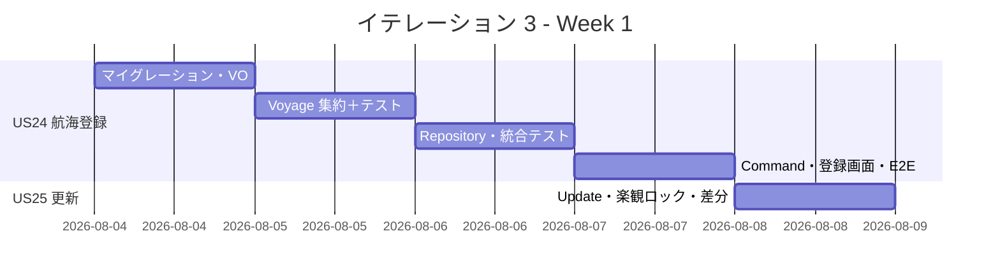
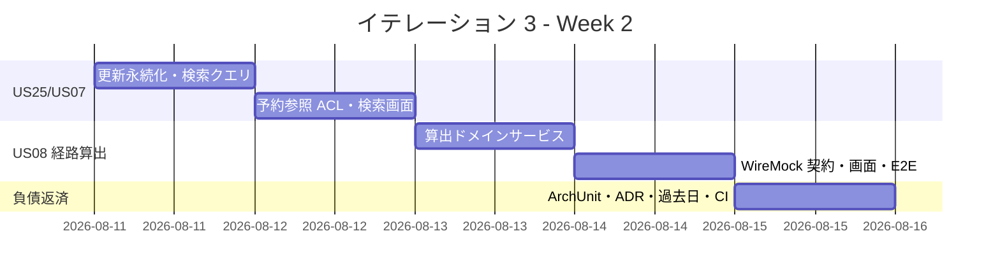
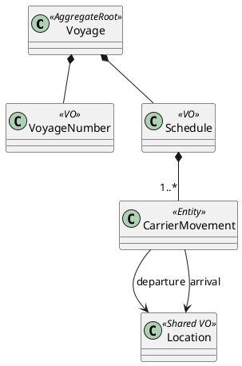

# イテレーション 3 計画

## 概要

| 項目 | 内容 |
|------|------|
| **イテレーション** | 3 |
| **期間** | 2026-08-04 〜 2026-08-15（2 週間） |
| **ゴール** | 航海スケジュールを管理し、外部経路サービス ACL 経由で経路候補を算出できる |
| **目標 SP** | 14（US24 / US25 / US07 / US08） |

---

## ゴール

### イテレーション終了時の達成状態

1. **Routing コンテキストの立ち上げ**: `CargoTracker.Domain.Routing` を新規 BC として実装し、Voyage 集約（航海スケジュール）を登録・更新できる。
2. **航海スケジュール検索**: 予約の出発地・目的地・期限・貨物種別（危険物・冷凍含む）から利用可能な航海を検索できる。
3. **経路候補算出**: 外部経路サービス ACL（WireMock.Net 契約で固定）経由で、制約条件を考慮した経路候補を推奨順に算出できる。

### 成功基準

- [ ] US24・US25・US07・US08 の受入条件をすべて満たす
- [ ] Voyage 集約・Schedule/CarrierMovement のドメインルールが単体テストで網羅（中盤の主戦場）
- [ ] 外部経路サービス ACL が WireMock.Net 契約で固定され、スタブ→契約検証に移行
- [ ] E2E で「航海登録 → 検索 → 経路候補算出」フローが通る
- [ ] ArchUnit ルールを Routing BC に拡張し依存方向を検証
- [ ] テストカバレッジ 80% 以上（ドメイン層 85%）

### アプローチ（開発戦略: 中盤インサイドアウト）

[開発戦略](./development_strategy.md#中盤-インサイドアウトit3-5) に従い、IT3 から**中盤・インサイドアウト**に移行する。

- **データ層 → ドメイン層 → アプリケーション → プレゼンテーション**の順に内側から作り込む。経路候補算出（US08）・航海スケジュール（US24/25）はドメインロジックが複雑なため、貧血ドメインモデルを避けドメイン層にビジネスルールを凝集させる（ここが中盤の主戦場）。
- 外部経路サービス ACL は **WireMock.Net でスタブ契約を先に固定**し、ドメインをスタブ駆動で作り込む（IT1 の `StubExternalRoutingService` を契約検証に発展）。
- 局面移行（IT2→IT3）に際し、序盤で確立した縦切りパターン・レイヤー境界・`Architecture.Tests` グリーンを踏襲する。Booking の ACL/UoW/イベント/楽観ロックのパターンを Routing でも再利用する。

---

## ユーザーストーリー

### 対象ストーリー

| ID | ユーザーストーリー | SP | 優先度 |
|----|-------------------|----|----|
| US24 | 航海スケジュールを新規登録する | 3 | 必須 |
| US25 | 既存航海スケジュールを更新する | 3 | 必須 |
| US07 | 航海スケジュールを検索する | 3 | 必須 |
| US08 | 経路候補を算出する | 5 | 必須 |
| **合計** | | **14** | |

### ストーリー詳細

#### US24: 航海スケジュールを新規登録する

**ストーリー**:
> 経路設計者として、各運送会社が公開している航海スケジュール（航海番号・船名・出発港・到着港・出発日・到着日・寄港地・対応貨物種別）をシステムに新規登録したい。なぜなら、最新の運航情報を反映することで経路候補の算出精度が上がり荷主に正確な経路・所要日数を提案できるからだ。

**受入条件**:

1. 航海番号・船名・運送会社・出発港（UN/LOCODE）・到着港（UN/LOCODE）・出発日・到着日・対応貨物種別を入力できる
2. 寄港地を複数かつ順序付きで入力できる
3. 必須項目が未入力の場合、未入力箇所を明示したエラーが表示される
4. 出発日が到着日より後の場合、日付の整合性エラーが表示される
5. 同一航海番号が存在しない場合、登録が完了し登録番号が発行される
6. 登録後、US07（航海スケジュール検索）の検索対象として利用できる

#### US25: 既存航海スケジュールを更新する

**ストーリー**:
> 経路設計者として、運送会社が運航変更を発表した場合に、登録済みの航海スケジュールを最新情報に更新したい。なぜなら、変更を即座に反映することで変更後の経路候補算出に誤りが生じるのを防げるからだ。

**受入条件**:

1. 既存の航海番号を指定して既登録スケジュールを呼び出せる
2. 既存内容と更新内容の差分が確認画面に表示される
3. 差分確認後に「更新する」を選択することで既存スケジュールが上書き更新される
4. 更新後、US07 の検索結果に更新内容が反映される
5. 「キャンセル」を選択した場合、既存スケジュールは変更されない

#### US07: 航海スケジュールを検索する

**ストーリー**:
> 経路設計者として、予約の出発地・目的地・期限をもとに利用可能な航海スケジュールを検索したい。なぜなら、制約条件を満たす航海を特定し経路候補算出の入力を準備できるからだ。

**受入条件**:

1. 予約番号を指定して出発地・目的地・期限・貨物仕様を確認できる
2. 検索条件（出発地・目的地・出発期間・貨物種別）を入力して検索できる
3. 制約条件（航海スケジュール・寄港地接続・港湾制約・貨物種別対応）に基づいて利用可能な航海が表示される
4. 一覧に航海番号・運送会社・出発日・到着日・寄港地が表示される
5. 条件を満たす航海がない場合、その旨が表示され条件を緩和して再検索できる
6. 危険物・冷凍貨物の場合、対応可能な航海のみに絞り込まれる
7. 出発地・目的地は UN/LOCODE 形式で指定できる

#### US08: 経路候補を算出する

**ストーリー**:
> 経路設計者として、航海スケジュール検索結果をもとに制約条件を考慮した経路候補を自動算出してほしい。なぜなら、手作業の属人化を解消し制約条件を漏れなく考慮した最適経路を効率的に見つけられるからだ。

**受入条件**:

1. 航海スケジュール検索結果と出発地・目的地・期限を入力として経路候補が自動算出される
2. 寄港地の接続可能性が評価される
3. 経路候補ごとに所要日数・経由港・費用・航海番号が表示される
4. 経路候補が推奨順に並べられて提示される
5. 直行便がある場合、最優先候補として提示される
6. 期限内に到達可能な経路がない場合、その旨が通知され条件調整が促される

### タスク

> 進め方はインサイドアウト（データ → ドメイン → アプリケーション → プレゼンテーション）。下表は成果物の内訳。

#### 1. US24 航海スケジュールを新規登録する（3 SP）

| # | タスク | 見積もり | 担当 | 状態 |
|---|--------|---------|------|------|
| 1.0 | 【Day 1・着手前】設計論点 1〜3 を docs/design に反映（data-model に voyage 拡張カラム・楽観ロック方式、domain-model に Routing 経路候補の BC 所属）。局面移行チェック（縦切り・ArchUnit グリーン・UoW 基盤動作） | 3h | - | [ ] |
| 1.1 | voyage / carrier_movement マイグレーション（0007・二方言）。vessel_name・carrier・supported_cargo_types を voyage に追加、寄港地は carrier_movement 連鎖で表現（論点1 確定） | 4h | - | [ ] |
| 1.2 | 値オブジェクト（VoyageNumber・Schedule・CarrierMovement エンティティ）実装＋ドメインユニットテスト（時系列順・出発≠到着・日付整合） | 6h | - | [ ] |
| 1.3 | Voyage 集約ルート（一意 VoyageNumber・Schedule 構成不変条件）＋ユニットテスト | 5h | - | [ ] |
| 1.4 | IVoyageRepository（Routing/Domain/Repositories）+ Dapper 実装（航海+運送区間の単一トランザクション保存）＋統合テスト | 5h | - | [ ] |
| 1.5 | RegisterVoyageCommand / CommandService（同一航海番号の重複拒否）＋登録画面・E2E | 5h | - | [ ] |

**小計**: 28h（理想時間）

#### 2. US25 既存航海スケジュールを更新する（3 SP）

| # | タスク | 見積もり | 担当 | 状態 |
|---|--------|---------|------|------|
| 2.1 | UpdateScheduleCommand / CommandService（version 楽観ロック＝IT2 のドメイン先行方式を踏襲。論点3 確定）＋ドメイン更新ロジック | 4h | - | [ ] |
| 2.2 | 差分表示（既存 vs 更新）・確認/キャンセル導線の画面＋統合/E2E | 5h | - | [ ] |
| 2.3 | 更新の永続化（運送区間の入替）＋統合テスト | 3h | - | [ ] |

**小計**: 12h（理想時間）

#### 3. US07 航海スケジュールを検索する（3 SP）

| # | タスク | 見積もり | 担当 | 状態 |
|---|--------|---------|------|------|
| 3.1 | 検索クエリサービス（出発地・目的地・出発期間・貨物種別で絞り込み。危険物・冷凍対応航海のフィルタ） | 4h | - | [ ] |
| 3.2 | 予約情報（BookingId から出発地・目的地・期限・貨物仕様）の参照 ACL（Routing → Booking 読取） | 3h | - | [ ] |
| 3.3 | 検索画面・結果一覧（航海番号・運送会社・出発/到着日・寄港地）＋該当なし時の再検索導線＋E2E | 4h | - | [ ] |

**小計**: 11h（理想時間）

#### 4. US08 経路候補を算出する（5 SP）

| # | タスク | 見積もり | 担当 | 状態 |
|---|--------|---------|------|------|
| 4.1 | 経路候補算出ドメインサービス（寄港地接続評価・所要日数・直行優先・推奨順ソート）＋ユニットテスト（中盤の主戦場） | 8h | - | [ ] |
| 4.2 | 外部経路サービス ACL を WireMock.Net 契約で固定（IT1 スタブから契約検証へ）＋契約テスト | 5h | - | [ ] |
| 4.3 | 期限内到達不能時の通知・条件調整導線 | 2h | - | [ ] |
| 4.4 | 経路候補算出画面・結果表示（所要日数・経由港・費用・航海番号）＋E2E | 5h | - | [ ] |

**小計**: 20h（理想時間）

#### 5. IT2 レビュー持ち越し・技術的負債

| # | タスク | 見積もり | 担当 | 状態 |
|---|--------|---------|------|------|
| 5.1 | ArchUnit ルールを Routing BC に拡張（Routing→他 BC 直接参照禁止） | 2h | - | [ ] |
| 5.2 | H1: AmbientTransaction を ADR 化（ADR-0002 を Superseded・新 ADR 起票）＋ネスト非対応ガードとテスト（IT2 レビュー高 H1/H2） | 3h | - | [ ] |
| 5.3 | H4/T3: CargoType の domain-model「共通」記述を実装（BC 独立）に整合し軽量 ADR 起票（統合判断基準を明示） | 2h | - | [ ] |
| 5.4 | H3: 予約フォームの過去日ガード（RouteSpecification/BookingForm に当日以降の不変条件）※IT2 レビュー高 | 2h | - | [ ] |
| 5.5 | T4: ドメイン層カバレッジ計測（coverlet）を CI に組込 | 2h | - | [ ] |
| 5.6 | H5: E2E.Tests に予約フロー（登録→引き渡し）と航海フロー（登録→検索→経路候補）を追加。時間超過時は予約フロー分を IT4 へ明示繰り越し | 3h | - | [ ] |

**小計**: 14h（理想時間）

#### タスク合計

| カテゴリ | SP | 理想時間 | 状態 |
|---------|----|----|------|
| US24 航海スケジュールを新規登録する | 3 | 28h | [ ] |
| US25 既存航海スケジュールを更新する | 3 | 12h | [ ] |
| US07 航海スケジュールを検索する | 3 | 11h | [ ] |
| US08 経路候補を算出する | 5 | 20h | [ ] |
| IT2 レビュー持ち越し・技術的負債 | - | 14h | [ ] |
| **合計** | **14** | **85h** | |

**1 SP あたり**: 約 5.1h（ストーリータスクのみ 71h ÷ 14 SP）
**進捗率**: 0% (0/14 SP)

---

## スケジュール

### Week 1（Day 1-5）

| 日 | タスク |
|----|--------|
| Day 1 | 1.0 docs/design 反映・局面移行チェック、1.1 マイグレーション、1.2 値オブジェクト（Red 先行） |
| Day 2 | 1.3 Voyage 集約＋ユニットテスト |
| Day 3 | 1.4 IVoyageRepository＋統合テスト |
| Day 4 | 1.5 RegisterVoyageCommand・登録画面・E2E |
| Day 5 | 2.1 UpdateScheduleCommand（楽観ロック）、2.2 差分表示 |

### Week 2（Day 6-10）

| 日 | タスク |
|----|--------|
| Day 6 | 2.3 更新永続化、3.1 検索クエリサービス |
| Day 7 | 3.2 予約参照 ACL、3.3 検索画面・E2E |
| Day 8 | 4.1 経路候補算出ドメインサービス（主戦場） |
| Day 9 | 4.2 WireMock.Net 契約、4.3/4.4 通知・画面・E2E |
| Day 10 | 5.1-5.6 ArchUnit・ADR 起票・過去日ガード・coverlet・E2E 拡張、統合テスト、デモ準備 |

---

## 設計

Routing コンテキストは本イテレーションで新規に立ち上げる（IT1 で全ルートのプレースホルダは作成済み。IT3 で航路・経路設計ルートを実画面化）。詳細は
[ドメインモデル設計 - Routing Context](../design/domain-model.md#3-routing-context経路コンテキスト) を SoT とする。

### ドメインモデル（本 IT スコープ）

- 集約: Voyage（航海）。VoyageNumber（一意）・Schedule（時系列 CarrierMovement 一覧）を含む。
- 不変条件: 一意 VoyageNumber、Schedule は時系列順、CarrierMovement の出発地≠到着地、出発日≦到着日。
- ACL: Routing → Booking（予約情報読取。US07 の予約参照）。他 BC の内部モデルを直接参照しない（IT2 の ShipperExistenceChecker パターン踏襲）。
- 経路候補算出（US08）は Routing BC 固有の新規ポート（例 `IRouteCandidateService`）経由で行い、Routing 固有の経路候補型（例 `CandidateRoute`）を返す。Estimation の `IExternalRoutingServicePort`／`RouteCandidate`（見積用）とは分離する（下記「設計論点の確定」2 参照。BC 独立原則）。

### データモデル

[data-model.md - Routing Context](../design/data-model.md#routing-context) を SoT とする。voyage / carrier_movement を使用。

> **注（確定・Day 1 タスク 1.0 で反映）**: US24 受入条件が要求する **船名（vessel_name）・運送会社（carrier）・対応貨物種別（supported_cargo_types）** が現行 voyage 物理定義に存在しない（寄港地は carrier_movement の seq_number 連鎖で表現）。「設計論点の確定」1 のとおり voyage テーブルへ追記し、0007 マイグレーションと同時に data-model.md を更新する。

### API 設計

| メソッド | エンドポイント | 説明 |
|---------|---------------|------|
| GET | /voyages | 航海一覧 |
| GET | /voyages/new | 航海登録フォーム（US24） |
| POST | /voyages | 航海スケジュール登録（US24） |
| GET | /voyages/{voyageNumber}/edit | 更新フォーム・差分表示（US25） |
| POST | /voyages/{voyageNumber} | 航海スケジュール更新（US25） |
| GET | /routing/requests | 経路設計依頼一覧（引き渡し済み予約） |
| GET | /routing/requests/{bookingId} | 航海検索・経路候補算出（US07/US08） |

### ADR

| ADR | タイトル | ステータス |
|-----|---------|-----------|
| [ADR-0001](../adr/0001-集約永続化戦略.md) | 集約永続化戦略（楽観ロック） | 承認済（US25 で適用） |
| ADR-00XX（新規・5.2） | Ambient Transaction によるトランザクション伝播（ADR-0002 を Superseded） | 起票予定 |
| ADR-00XX（新規・5.3） | CargoType の BC 独立定義（共通化の保留判断） | 起票予定 |

---

## 設計論点の確定（validating-design 2026-07-09 の結果）

設計整合性検証（軸 A/B/C）を実施し、以下を暫定確定した。設計ドキュメントが未確定な論点はテックリード判断で確定し、実装前（Day 1・タスク 1.0）に docs/design へ反映する。確定後は docs/design を正とする。

1. **voyage/carrier_movement の物理定義拡張（確定）**: data-model.md の voyage テーブルに `vessel_name`（船名）・`carrier`（運送会社）・`supported_cargo_types`（対応貨物種別）を追記する。寄港地は carrier_movement の連鎖（seq_number 順）で表現。0007 マイグレーションと同時に data-model.md を更新。

2. **経路候補算出サービス・経路候補の所属 BC（確定）**: DDD の BC 独立原則（CargoType 二重定義の前例）に従い、**US08 の経路候補算出は Routing BC 固有の概念として実装**する。`IExternalRoutingServicePort`（Estimation・見積用・`RouteCandidate` を返す）とは分離し、Routing 側に新規ポート（例 `IRouteCandidateService`）と Routing 固有の経路候補型（例 `CandidateRoute`：所要日数・経由港・費用・航海番号）を定義する。Estimation の `RouteCandidate` は見積用途に据え置く（移設・共有しない）。根拠: US08 は Routing 活動で見積の RouteCandidate とライフサイクル・責務が異なり、共有すると BC 結合が生じる。domain-model.md の該当記述（ポート配置・戻り値 CargoItinerary vs RouteCandidate の乖離）を Routing 側定義に合わせて更新。

3. **楽観ロック実装方式（確定）**: IT2 で実装・テスト済みの**ドメイン先行方式**（集約が `Version++`、リポジトリが `WHERE version=更新前値`、影響行 0 で競合例外）を正とする。US25 も同方式。data-model.md の楽観ロック節（DB 側 `version=version+1` 記述）と ADR-0001 を実装方式に合わせて更新（IT2 レビュー M1 の解決）。

> これら 1〜3 の docs/design 反映は Day 1（タスク 1.0）に実施する。重大な設計変更のため方針に異論があれば着手前に見直す。

---

## リスクと対策

| リスク | 影響度 | 対策 |
|--------|--------|------|
| 経路候補算出（US08）のドメインロジックが想定より複雑 | 高 | 4.1 を Day 8 に単独配置し中盤の主戦場として厚くテスト。WireMock 契約で外部依存を早期固定 |
| voyage データモデルの拡張が設計横断に波及 | 中 | 実装前に data-model 更新＋validating-design で確定。US24 を Week 1 前半に置き早期に確定 |
| 経路サービスの BC 所属が未確定でリファクタ発生 | 中 | validating-design で先に決定。決まるまで Estimation ポートを Routing から参照しない設計に留める |
| 中盤移行でインサイドアウトのリズムが乱れる | 低 | 局面移行チェック（縦切りパターン踏襲・ArchUnit グリーン）を Day 1 に確認 |

---

## 完了条件

### Definition of Done

- [ ] コードレビュー完了（self-review：中間 / developing-review：正式）
- [ ] ユニットテストがパス（ドメイン層 85% 以上・経路算出ロジック網羅）
- [ ] E2E テストがパス（航海登録→検索→経路候補算出フロー）
- [ ] ArchUnit テストがパス（Routing BC の依存方向）
- [ ] 外部経路サービス ACL が WireMock.Net 契約で固定
- [ ] `dotnet format` / Lint エラーなし
- [ ] domain-model / data-model / ui_design / release_plan の横断更新完了
- [ ] ADR（AmbientTransaction・CargoType）起票完了

### デモ項目

1. 航海スケジュールの新規登録（寄港地・対応貨物種別含む）→ 検索対象化
2. 既存航海スケジュールの更新（差分確認 → 上書き）
3. 予約の出発地・目的地・期限から航海検索 → 経路候補の推奨順算出（直行優先・期限超過通知）

---

## 更新履歴

| 日付 | 更新内容 | 更新者 |
|------|---------|--------|
| 2026-07-09 | 初版作成（US24/25/07/08・目標 14 SP・中盤インサイドアウト・IT2 レビュー持ち越し反映） | - |
| 2026-07-09 | validating-design 反映（軸 A OK。軸 B/C の設計論点を確定：voyage 物理定義拡張・経路候補の Routing BC 独立・楽観ロックのドメイン先行方式。Day 1 の docs 反映タスク 1.0・H5 E2E タスク 5.6 を追加） | - |

---

## 関連ドキュメント

- [イテレーション 3 ふりかえり](./retrospective-3.md)（IT3 完了後に作成）
- [開発戦略](./development_strategy.md)
- [リリース計画](./release_plan.md)
- [イテレーション 2 計画](./iteration_plan-2.md)
- [開発成果物レビュー（IT2）](../review/開発成果物_IT2_review_20260709.md)
- [ドメインモデル設計](../design/domain-model.md)
- [ユーザーストーリー](../requirements/user_story.md)
