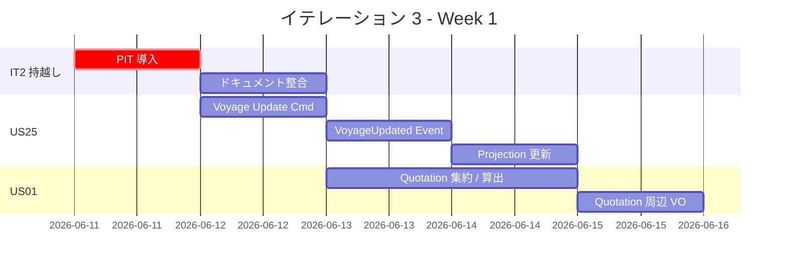
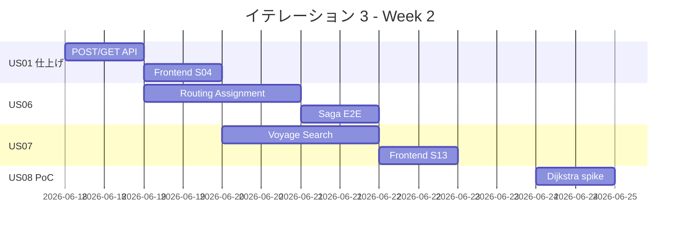
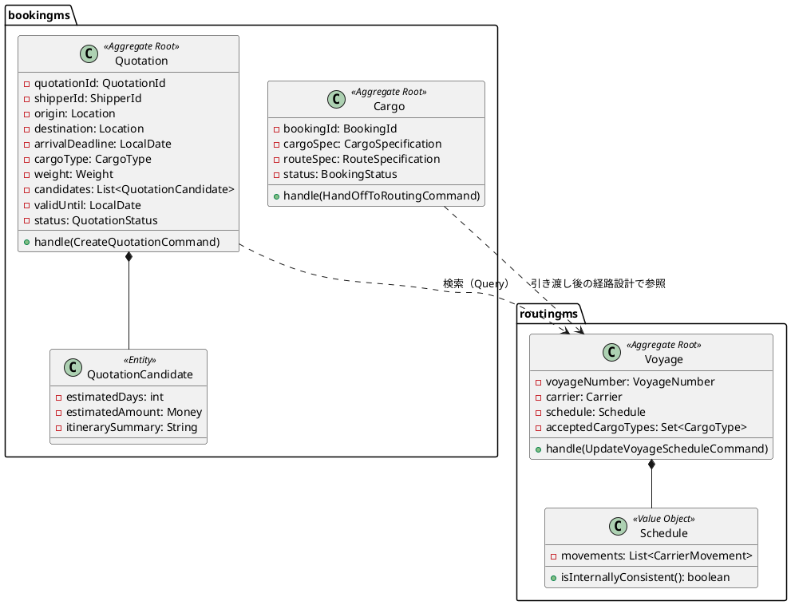
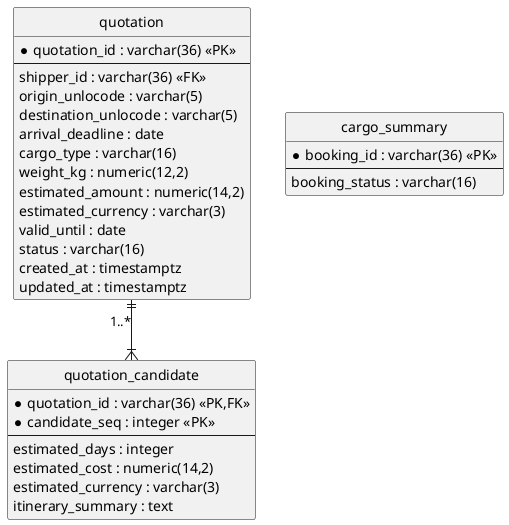
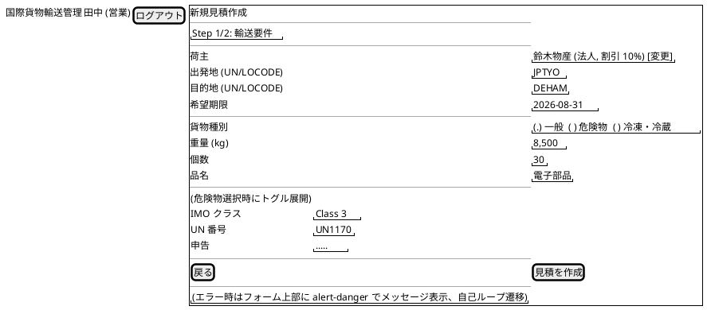
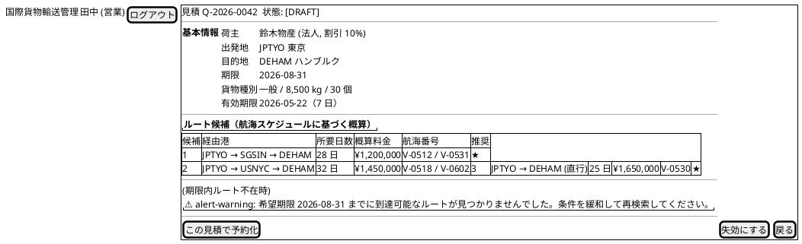
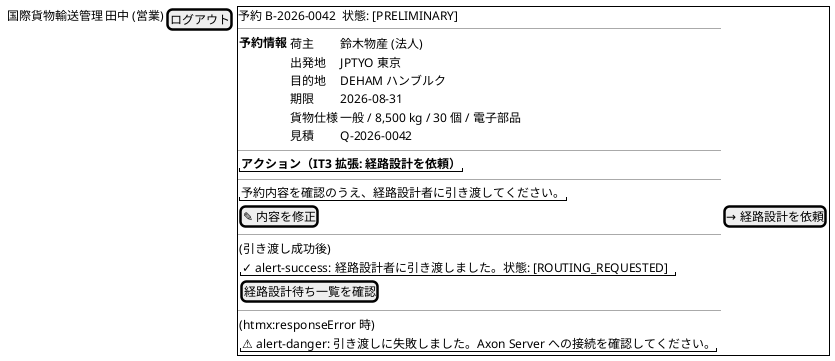
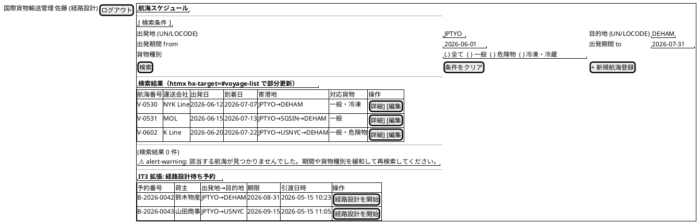
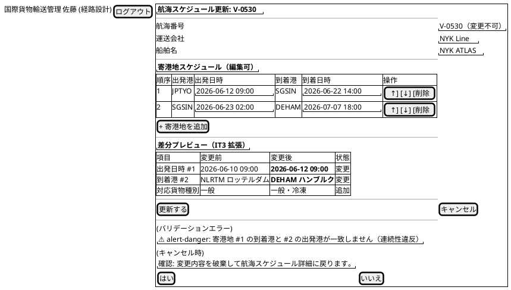
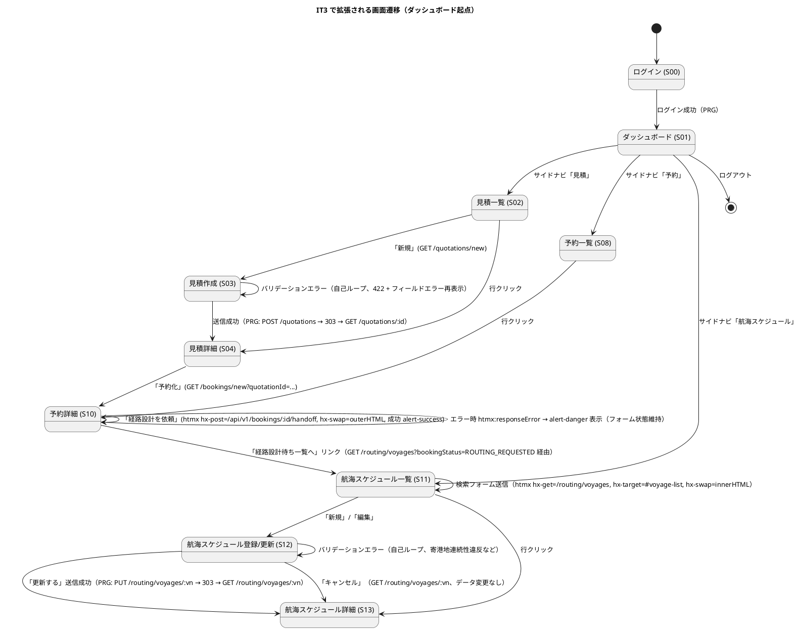

# イテレーション 3 計画

## 概要

| 項目 | 内容 |
|------|------|
| **イテレーション** | 3 / 8 |
| **期間** | Week 5-6（2026-06-11 〜 2026-06-24） |
| **ゴール** | 輸送見積と経路設計前半（スケジュール検索・引き渡し）を実装し、IT2 から繰越しの US25（既存航海スケジュール更新）と品質基盤（PIT 75%）を完了させる |
| **目標 SP** | 16（IT2 繰越し 3 SP + 新規 13 SP） |
| **基準ベロシティ** | 14 SP（IT1: 14 / IT2: 14 の単純平均）／ 計画外バッファ 15% |

> **設計準拠の方針**: 本計画は `docs/design/domain-model.md`、`docs/design/data-model.md`、`docs/design/ui_design.md` に完全準拠する。輸送見積は bookingms の `Quotation` 集約（domain-model.md L1202 / data-model.md L350-368）として実装する。経路設計への引き渡しは `Cargo` 集約の `HandOffToRoutingCommand`（domain-model.md L1205）で行い、専用 Read Model は新設せず既存 `cargo_summary.booking_status` で表現する。航海スケジュール検索は routingms の Query Side として実装し、既存 S11「航海スケジュール一覧」の検索フォーム拡張として UI を提供する（ui_design.md L101）。

> **ADR-0009 事前完了**: IT2 retrospective の「IT3 で注意すべきリスク 1（Subscribing → Pooled 切替の確定）」に対応し、ADR-0009 で `axon-server-connector` 明示依存と pooled-streaming 復帰を IT3 着手前に解消済み（commit `18df5932`）。IT3 では trackingms / handlingms 追加時に同じ `AxonJdbcConfig` パターンを踏襲する。

---

## ゴール

### イテレーション終了時の達成状態

1. **輸送見積（US01, UC01）**: 営業担当者が出発地・目的地・希望期限・貨物種別・重量を入力すると、`Quotation` 集約が複数のルート候補（経由港・所要日数・概算料金・航海番号）を保持した見積を作成し、見積番号と共に S04 で表示される
2. **予約引き渡し（US06, UC04）**: 仮受付された予約の内容を S10 で確認し「経路設計を依頼」を選択すると、`Cargo` 集約が `HandOffToRoutingCommand` を受けて `cargo_summary.booking_status` が `ROUTING_REQUESTED` に遷移し、経路設計者向け一覧に表示される
3. **航海スケジュール検索（US07, UC05）**: 経路設計者が S11 で出発地・目的地・出発期間・貨物種別の条件で `voyage` テーブルを検索でき、危険物・冷凍貨物の場合は対応可能な航海のみに絞り込まれる
4. **航海スケジュール更新（US25, UC19, IT2 繰越し）**: 既存航海番号で S12 を開き差分を確認した上で `UpdateVoyageScheduleCommand` を発行し、`VoyageScheduleUpdatedEvent` で Read Model（`voyage` / `carrier_movement`）が更新される。「キャンセル」で変更を破棄できる
5. **品質基盤の完成（IT2 持越し）**: PIT 75%（ドメイン層主指標）が CI で動作し、Backend `Cargo` / `Voyage` Aggregate に最初に適用される
6. **ドキュメント陳腐化解消（IT2 持越し）**: `apps/frontend/e2e/README.md`、運用手順書 §7、`data-model.md`（`users.lock_until` / `failed_attempts`）を実装と整合させる

### 成功基準

- [ ] `POST /api/v1/quotations` で輸送見積（金額・通貨・有効期限・候補一覧）が返却される（US01）
- [ ] `POST /api/v1/bookings/{id}/handoff` 成功後、`cargo_summary.booking_status` が `ROUTING_REQUESTED` に更新される（US06）
- [ ] `GET /api/v1/voyages?origin={UNLOCODE}&destination={UNLOCODE}&departureFrom=YYYY-MM-DD&cargoType={GENERAL/HAZARDOUS/REFRIGERATED}` で航海候補が取得できる（US07）
- [ ] `PUT /api/v1/voyages/{voyageNumber}` で既存航海スケジュールを更新でき、`VoyageScheduleUpdatedEvent` がイベントストアに永続化される（US25）
- [ ] PIT カバレッジ（bookingms / routingms のドメイン層）が CI で計測され、Quality Gate に組み込まれる（目標 75%、未達でも計測必須）
- [ ] `apps/frontend/e2e/README.md` から「IT3 で予定」記述が消え、現状の Playwright シナリオに一致する
- [ ] 運用手順書 §7（アプリケーション開発環境セットアップ）から「Phase 0」記述が消え、IT2 構成と一致する
- [ ] `docs/design/data-model.md` に `users.lock_until` / `users.failed_attempts` カラムが反映される
- [ ] フロントエンドの「見積→予約→引き渡し→航海検索」フローが Playwright E2E で GREEN
- [ ] Axon Server を停止すると `POST /api/v1/bookings` が 500 で失敗することを smoke test で継続検証（ADR-0009 の receding regression 防止）

---

## ユーザーストーリー

### 対象ストーリー

| ID | ユーザーストーリー | SP | 優先度 | 区分 |
|----|-------------------|----|--------|------|
| US25 | 既存航海スケジュールを更新する（IT2 繰越し） | 3 | 必須 | 持越し |
| US01 | 輸送見積を作成する | 5 | 必須 | 新規 |
| US06 | 予約情報を経路設計者に引き渡す | 3 | 必須 | 新規（Saga） |
| US07 | 航海スケジュールを検索する | 5 | 必須 | 新規 |
| **合計** | | **16** | | |

> **US08 先行スパイク**: release_plan.md の技術リスク欄に従い、IT4 で実装予定の US08（経路候補算出）について IT3 内で簡易 PoC（Dijkstra / 制約条件評価のプロトタイプ）を実施。SP には計上せず、計画外バッファ枠（4h）で扱う。

> **業務的入力検証ストーリー化**: IT2 retrospective T4 を受け、レビュー指摘 H10-H13（荷主 ID マスタ検索、IMO クラスドロップダウン、温度条件 0/0 制約、出発日 < 到着日整合性）を **US04-r1 / US05-r1 / US24-r1** として新規起票。IT3 では起票のみとし、実装は IT4 以降で別途検討する。

### ストーリー詳細

#### US25: 既存航海スケジュールを更新する（IT2 繰越し、UC19）

**ストーリー**:

> 経路設計者として、運送会社が運航変更を発表した場合に、システムに登録済みの航海スケジュールを最新情報に更新したい。なぜなら、スケジュール変更を即座にシステムに反映することで、変更後の経路候補算出に誤りが生じるのを防げるからだ。

**受入条件**（user_story.md 準拠）:

1. 既存の航海番号を指定して既登録スケジュールを呼び出せる
2. 既存内容と更新内容の差分が確認画面に表示される
3. 差分確認後に「更新する」を選択することで既存スケジュールが上書き更新される（`UpdateVoyageScheduleCommand` → `VoyageScheduleUpdatedEvent`）
4. 更新後、UC05（航海スケジュール検索）の検索結果に更新内容が反映される（PooledStreamingEventProcessor 経由）
5. 「キャンセル」を選択した場合、既存スケジュールは変更されない

> 画面は S12「航海スケジュール登録/更新」を `/routing/voyages/:vn/edit` URL で再利用する（ui_design.md S12 は新規登録と更新の両 URL を持つ単一画面）。

#### US01: 輸送見積を作成する（UC01）

**ストーリー**:

> 営業担当者として、荷主の輸送要件（出発地・目的地・希望期限・貨物種別・重量）を入力し、輸送料金と所要日数の見積を作成したい。なぜなら、荷主が予算と納期を事前に把握でき、予約決定を迅速に行えるからだ。

**受入条件**（user_story.md 準拠）:

1. 出発地・目的地・希望期限・貨物種別・重量を入力できる
2. 航海スケジュール情報をもとにルート概算候補が表示される
3. ルート候補ごとに「経由港・所要日数・概算料金・航海番号」が表示される
4. 見積情報が保存され、見積番号が発行される（`Quotation` 集約 + `CreateQuotationCommand` → `QuotationCreatedEvent`）
5. 希望期限に間に合うルートが存在しない場合、その旨が通知される
6. 危険物が含まれる場合、危険物申告情報の入力フォームが表示される

> 見積はドメインモデル定義（domain-model.md L1202）に従い `Quotation` 集約として実装し、Read Model は `quotation` / `quotation_candidate` テーブル（data-model.md L350 / L368）に投影する。

#### US06: 予約情報を経路設計者に引き渡す（UC04）

**ストーリー**:

> 営業担当者として、仮受付された予約の出発地・目的地・期限・貨物仕様を確認し、経路設計者に引き渡したい。なぜなら、経路設計者が正確な情報をもとに最適な経路設計を開始できるからだ。

**受入条件**（user_story.md 準拠）:

1. 予約番号を指定して予約情報（出発地・目的地・期限・貨物仕様）を確認できる
2. 経路設計依頼を実行すると、予約状態が「経路設計中」に更新される（`Cargo` 集約 + `HandOffToRoutingCommand`、`cargo_summary.booking_status` 更新）
3. 経路設計者に経路設計依頼の通知が送信される（内部 Saga トリガー）
4. 予約情報に不備がある場合、修正してから引き渡せる

> 引き渡しはドメインモデル（domain-model.md L1205）に従い `Cargo` 集約に対する `HandOffToRoutingCommand` で実装し、専用 Read Model は新設せず既存 `cargo_summary` の `booking_status` 列で表現する（data-model.md UC04）。

#### US07: 航海スケジュールを検索する（UC05）

**ストーリー**:

> 経路設計者として、予約の出発地・目的地・期限をもとに、利用可能な航海スケジュールを検索したい。なぜなら、制約条件を満たす航海を特定し、経路候補算出の入力を準備できるからだ。

**受入条件**（user_story.md 準拠）:

1. 予約番号を指定して出発地・目的地・期限・貨物仕様を確認できる
2. 検索条件（出発地・目的地・出発期間・貨物種別）を入力して検索できる
3. 制約条件（航海スケジュール・寄港地接続・港湾制約・貨物種別対応）に基づいて利用可能な航海が表示される
4. 航海スケジュール一覧に航海番号・運送会社・出発日・到着日・寄港地が表示される
5. 条件を満たす航海がない場合、その旨が表示され条件を緩和して再検索できる
6. 危険物・冷凍貨物の場合、対応可能な航海のみに絞り込まれる（`voyage_accepted_cargo_type` 結合）
7. 出発地・目的地は UN/LOCODE 形式で指定できる

> 検索画面は S11「航海スケジュール一覧」（ui_design.md L101）の検索フォーム拡張として実装する。Query 専用なのでドメインモデル上のコマンド/イベントは発火しない（domain-model.md L1206「UC05 航海検索 / Query」）。

### タスク

#### 1. US25 既存航海スケジュール更新（3 SP）

| # | タスク | 見積もり | 担当 | 状態 |
|---|--------|---------|------|------|
| 1.1 | `Voyage` Aggregate に `UpdateVoyageScheduleCommand` / `@CommandHandler` を追加 | 2h | AI | [ ] |
| 1.2 | `VoyageScheduleUpdatedEvent` と `@EventSourcingHandler` を実装（`Schedule` VO の差分検証含む） | 2h | AI | [ ] |
| 1.3 | `VoyageProjectionsEventHandler` の更新ロジック追加（`voyage` / `carrier_movement` 反映） | 2h | AI | [ ] |
| 1.4 | `PUT /api/v1/voyages/{voyageNumber}` エンドポイント実装 + 差分確認レスポンス | 2h | AI | [ ] |
| 1.5 | フロント S12（`/routing/voyages/:vn/edit` URL）に差分表示とキャンセル動作を追加 | 3h | AI | [ ] |
| 1.6 | 統合テスト（更新 → Read Model 反映 → S11 検索結果に反映確認） | 2h | AI | [ ] |

**小計**: 13h

#### 2. US01 輸送見積（5 SP）

| # | タスク | 見積もり | 担当 | 状態 |
|---|--------|---------|------|------|
| 2.1 | `Quotation` 集約と関連 VO（`QuotationId` / `RouteRequirement` / `EstimatedAmount` / `EstimatedDays`）実装 | 3h | AI | [ ] |
| 2.2 | `CreateQuotationCommand` / `QuotationCreatedEvent` と料金・所要日数算出ロジック実装（domain-model.md L1202） | 4h | AI | [ ] |
| 2.3 | `quotation` / `quotation_candidate` テーブル Flyway migration（data-model.md L350 / L368 既存定義に準拠） | 1h | AI | [ ] |
| 2.4 | `POST /api/v1/quotations` / `GET /api/v1/quotations/{quotationId}` 実装 | 3h | AI | [ ] |
| 2.5 | フロント S03 見積作成（フォーム）と S04 見積詳細（シングルビュー）を実装 | 4h | AI | [ ] |
| 2.6 | ユニットテスト（境界値・危険物含む条件・期限内ルート不在パターン） | 3h | AI | [ ] |
| 2.7 | 統合テスト（S03 入力 → S04 詳細 → 予約化導線 S08/S09） | 2h | AI | [ ] |

**小計**: 20h

#### 3. US06 予約引き渡し（3 SP）

| # | タスク | 見積もり | 担当 | 状態 |
|---|--------|---------|------|------|
| 3.1 | `Cargo` 集約に `HandOffToRoutingCommand` / `@CommandHandler` 追加（status: PRELIMINARY → ROUTING_REQUESTED） | 3h | AI | [ ] |
| 3.2 | `CargoProjectionsEventHandler` に `cargo_summary.booking_status` 更新ロジック追加 | 2h | AI | [ ] |
| 3.3 | `POST /api/v1/bookings/{id}/handoff` と S10 予約詳細の「経路設計を依頼」アクション | 3h | AI | [ ] |
| 3.4 | 経路設計者向け通知（最小実装：ログ出力 + `booking_status='ROUTING_REQUESTED'` 検索 API） | 2h | AI | [ ] |
| 3.5 | E2E テスト（予約 → 引き渡し → S11 で経路設計待ち予約一覧表示） | 2h | AI | [ ] |

**小計**: 12h

#### 4. US07 航海スケジュール検索（5 SP）

| # | タスク | 見積もり | 担当 | 状態 |
|---|--------|---------|------|------|
| 4.1 | `voyage` / `voyage_accepted_cargo_type` に検索用インデックス追加（origin / destination / departure_date） | 1h | AI | [ ] |
| 4.2 | MyBatis Mapper `findByCriteria` 実装（出発地・目的地・出発期間・貨物種別・寄港地接続条件） | 4h | AI | [ ] |
| 4.3 | `GET /api/v1/voyages` 拡張（既存エンドポイントにクエリパラメータ追加・条件不一致時メッセージ） | 3h | AI | [ ] |
| 4.4 | フロント S11 一覧画面に検索フォームを追加（出発地・目的地・期間・貨物種別フィルタ） | 4h | AI | [ ] |
| 4.5 | 統合テスト・パフォーマンステスト（300ms 以内、危険物時の絞り込み確認） | 3h | AI | [ ] |

**小計**: 15h

#### 5. IT2 持越しタスク（バッファ枠 6h）

| # | タスク | 見積もり | 担当 | 状態 |
|---|--------|---------|------|------|
| 5.1 | PIT プラグイン導入（Backend gradle） + CI 統合（T3 反映） | 4h | AI | [x] 完了（bookingms 78% / routingms 58%、目標 75% は bookingms で達成、routingms は US25 実装で改善見込み） |
| 5.2 | `data-model.md` に `users.lock_until` / `users.failed_attempts` 反映 | 1h | AI | [x] 完了（`users` エンティティに `lock_until` 追加、note も IT2 / US00-r1 仕様を明記） |
| 5.3 | `apps/frontend/e2e/README.md` の「IT3 で予定」削除 + 現状反映 | 1h | AI | [x] 完了（local-docker フル起動を推奨、3 シナリオ全列挙、IT3 追加予定を注記） |
| 5.4 | 運用手順書 §7 の「Phase 0」削除 + IT2 構成反映 | 1h | AI | [x] 完了（`gulp local-docker:up` 主軸、4 ms フル起動の現状反映、ADR-0009 設定言及） |

**小計**: 7h

#### 6. US04-r1 / US05-r1 / US24-r1 起票（業務的入力検証、SP 計上なし）

| # | タスク | 見積もり | 担当 | 状態 |
|---|--------|---------|------|------|
| 6.1 | US04-r1 起票（荷主 ID マスタ検索・既存荷主からの選択） | 0.5h | AI | [ ] |
| 6.2 | US05-r1 起票（IMO クラス・UN 番号ドロップダウン化、温度範囲妥当性） | 0.5h | AI | [ ] |
| 6.3 | US24-r1 起票（出発日 < 到着日・寄港地連続性チェック強化） | 0.5h | AI | [ ] |

**小計**: 1.5h（IT4 以降で SP 見積もり）

#### 7. US08 先行スパイク（バッファ枠 4h、IT4 準備）

| # | タスク | 見積もり | 担当 | 状態 |
|---|--------|---------|------|------|
| 7.1 | 経路候補算出の Dijkstra ベース PoC（routing-spike モジュール） | 3h | AI | [ ] |
| 7.2 | 制約評価（到着期限 / 寄港地連続 / 輸送モード）のスケッチ | 1h | AI | [ ] |

**小計**: 4h

#### タスク合計

| カテゴリ | SP | 理想時間 | 状態 |
|---------|----|---------|------|
| US25 既存航海スケジュール更新 | 3 | 13h | [ ] |
| US01 輸送見積 | 5 | 20h | [ ] |
| US06 予約引き渡し | 3 | 12h | [ ] |
| US07 航海スケジュール検索 | 5 | 15h | [ ] |
| IT2 持越し（PIT・ドキュメント） | - | 7h | [ ] |
| US04-r1 等 起票のみ | - | 1.5h | [ ] |
| US08 先行スパイク | - | 4h | [ ] |
| **合計** | **16** | **72.5h** | |

**1 SP あたり**: 約 3.75h（IT1: 3.8h / IT2: 3.7h と一致、安定）
**進捗率**: 0% (0/16 SP)

---

## スケジュール

### Week 1（Day 1-5）

| 日 | タスク |
|----|--------|
| Day 1 (06-11) | 5.1 PIT 導入 / 5.2-5.4 ドキュメント整合（朝） / 1.1 UpdateVoyageScheduleCommand |
| Day 2 (06-12) | 1.2 VoyageScheduleUpdatedEvent / 1.3 Projection 更新 |
| Day 3 (06-13) | 1.4 PUT エンドポイント / 2.1 Quotation 集約・VO |
| Day 4 (06-14) | 2.2 Quotation 算出ロジック（前半） / 2.3 Flyway migration |
| Day 5 (06-15) | 2.2 Quotation 算出ロジック（後半） / 2.6 ユニットテスト着手 |

### Week 2（Day 6-10）

| 日 | タスク |
|----|--------|
| Day 6 (06-18) | 2.4 POST/GET API / 1.5 S12 edit URL / 1.6 統合テスト |
| Day 7 (06-19) | 2.5 S03 / S04 見積画面 / 3.1-3.2 HandOffToRoutingCommand + Projection |
| Day 8 (06-20) | 3.3 handoff API + S10 アクション / 4.1-4.2 voyage 検索 Mapper |
| Day 9 (06-21) | 4.3 GET /voyages 拡張 / 4.4 S11 検索フォーム / 3.4 経路設計者通知 |
| Day 10 (06-24) | 3.5 E2E / 4.5 性能検証 / 7.1-7.2 US08 PoC / 6.1-6.3 改善ストーリー起票 / イテレーションレビュー |

---

## 設計

### ドメインモデル（US01・US06・US07・US25 観点）

> domain-model.md（L540 Voyage 集約 / L1202 UC ↔ 集約マッピング）に準拠する。`Quotation`・`Cargo` は bookingms、`Voyage` は routingms 所属。`PricingService` は新規ドメインサービスではなく `Quotation` 集約の `CreateQuotationCommand` ハンドラ内ロジックとして実装する。`RoutingAssignment` は専用集約・専用 Read Model を新設せず、既存 `Cargo` 集約の `HandOffToRoutingCommand` と `cargo_summary.booking_status` で表現する。

| UC | 主集約 | 主コマンド | 主イベント |
|----|--------|-----------|-----------|
| UC01 見積作成 (US01) | `Quotation` | `CreateQuotationCommand` | `QuotationCreatedEvent` |
| UC04 予約引渡 (US06) | `Cargo` | `HandOffToRoutingCommand` | 内部 Saga トリガー |
| UC05 航海検索 (US07) | `Voyage` | （Query） | - |
| UC19 航海スケジュール更新 (US25) | `Voyage` | `UpdateVoyageScheduleCommand` | `VoyageScheduleUpdatedEvent` |

### データモデル

> data-model.md（L350 `quotation` / L368 `quotation_candidate` / UC04 `cargo_summary`）の既存定義に準拠する。新規テーブルは追加しない。`cargo_summary.booking_status` の状態遷移に `ROUTING_REQUESTED` を加える。

> 状態遷移追加（US06 反映）: `booking_status` は `PRELIMINARY → ROUTING_REQUESTED → ROUTING_ASSIGNED → CONFIRMED → ...` の流れを許容するよう Flyway migration で CHECK 制約を更新する。詳細は data-model.md の UC04 セクションに合わせる。

### API 設計

| メソッド | エンドポイント | 説明 | US |
|---------|---------------|------|---|
| POST | /api/v1/quotations | 輸送見積を新規作成（`Quotation` 集約） | US01 |
| GET | /api/v1/quotations/{quotationId} | 見積詳細と候補一覧を取得 | US01 |
| POST | /api/v1/bookings/{bookingId}/handoff | 予約を経路設計者に引き渡し（`HandOffToRoutingCommand`） | US06 |
| GET | /api/v1/bookings?status=ROUTING_REQUESTED | 経路設計待ち予約一覧 | US06 |
| GET | /api/v1/voyages | 航海スケジュール検索（出発地/目的地/出発期間/貨物種別） | US07 |
| PUT | /api/v1/voyages/{voyageNumber} | 既存航海スケジュールを更新 | US25 |

### ユーザーインターフェース

#### ビュー（画面構成）

ui_design.md（L85-103 主要画面一覧）の既存画面 ID を踏襲する。新規画面は追加しない。

| 画面 ID | 画面名 | パス | 拡張内容 | US |
|--------|-------|------|---------|----|
| S03 | 見積作成（フォーム） | `/quotations/new` | 既存 — 危険物入力フォーム条件表示を追加 | US01 |
| S04 | 見積詳細（シングル） | `/quotations/:id` | 既存 — ルート候補テーブル（経由港・所要日数・概算料金・航海番号）を表示 | US01 |
| S10 | 予約詳細（シングル） | `/bookings/:id` | 既存 — 「経路設計を依頼」アクションボタンを追加（status PRELIMINARY のときのみ表示） | US06 |
| S11 | 航海スケジュール一覧 | `/routing/voyages` | 既存 — 検索フォーム（出発地・目的地・出発期間・貨物種別）を追加。経路設計待ち予約への引き渡し導線も追加 | US06, US07 |
| S12 | 航海スケジュール登録/更新 | `/routing/voyages/new` / `/routing/voyages/:vn/edit` | 既存 — `:vn/edit` 経路に差分表示エリアと「更新する」「キャンセル」ボタンを追加 | US25 |
| S13 | 航海スケジュール詳細 | `/routing/voyages/:vn` | 既存 — 編集前後の差分表示は S12 側で実装するため S13 は変更なし | - |

#### ワイヤーフレーム（PlantUML salt）

ui_design.md の既存 salt を踏襲しつつ、IT3 で **追加 / 拡張する箇所** を強調する。共通ヘッダー（`国際貨物輸送管理 | ユーザ名 (ロール) | [ログアウト]`）とサイドナビ（`ダッシュボード / 見積 / 荷主 / 予約 / 経路設計 / 追跡管理 / 荷役 / 精算`）は全画面共通のため省略する。

##### S03: 見積作成（US01）

##### S04: 見積詳細（US01）— ルート候補表示

##### S10: 予約詳細（US06）— 「経路設計を依頼」アクション追加

##### S11: 航海スケジュール一覧（US06 / US07）— 検索フォーム + 経路設計待ち予約セクション

##### S12: 航海スケジュール登録/更新（US25）— 差分表示

#### インタラクション（画面遷移と htmx パターン）

> ダッシュボード起点で IT3 の主要シナリオを示す。サイドナビ「見積」「予約」「航海スケジュール」が一次導線。各機能内の細かい遷移は ui_design.md L182-211 の既存遷移図に集約しており、ここでは IT3 で新たに追加される自己ループ（バリデーションエラー）と htmx パターンを強調した。

**htmx / PRG 規約**:

- フォーム送信は基本的に PRG（POST/PUT → 303 See Other → GET）で、ブラウザの戻る/再送防止を担保する
- 部分更新が必要な箇所（S10 の引き渡しアクション、S11 の検索結果リスト）は htmx で `hx-target` + `hx-swap` を指定し、レスポンスはサーバから HTML フラグメントを返す
- バリデーションエラー時はサーバが 422 を返し、エラーメッセージ付きフォーム HTML を `outerHTML` で差し替える（自己ループ遷移）
- 成功フィードバックは `alert-success`、警告（期限内ルート不在など）は `alert-warning`、サーバエラーは `htmx:responseError` イベントを捕捉して `alert-danger` を表示する

### ADR

| ADR | タイトル | ステータス |
|-----|---------|-----------|
| [ADR-0007](../adr/0007-axon-5-event-sourcing-api.md) | Axon 5.1 Event Sourcing 採用 | 承認済み |
| [ADR-0008](../adr/0008-axon-5-spring-boot-integration-pattern.md) | Axon 5.1 Spring Boot 統合パターン | 承認済み |
| [ADR-0009](../adr/0009-axon-server-connector-explicit-dependency.md) | axon-server-connector 明示依存と pooled-streaming 復帰 | 承認済み（IT3 着手前完了） |

---

## リスクと対策

| リスク | 影響度 | 対策 |
|--------|--------|------|
| `HandOffToRoutingCommand`（US06）の冪等性確保が見積もりを超過 | 高 | 同一 `bookingId` への二重発行は `cargo_summary.booking_status` で守る。Axon の重複検出は IT4 へ持越し可とする |
| `Quotation` 集約（US01）の料金・所要日数算出ロジック仕様が未確定 | 中 | 仮ロジック（5 ゾーン × 4 貨物種別 × 距離係数）で実装し、IT4 以降で本番ロジックに置換可能な抽象を残す |
| PIT 導入によるテスト時間増 | 中 | PIT を nightly のみで実行し PR ビルドは jacoco のみとする運用に分離 |
| US07 検索性能（300ms）未達 | 中 | EXPLAIN ANALYZE で index 利用確認、超過時は Read Model に検索専用ビューを追加 |
| US25 で寄港地連続性違反など複雑な検証ロジックが Aggregate に集中 | 中 | `Schedule` VO の `isInternallyConsistent()` を流用し、コマンドハンドラ内で軽量バリデーション |
| US08 PoC が深掘りされ IT3 SP を侵食 | 中 | PoC は厳密に 4h タイムボックス。超過しても IT4 で本実装するため未完で可 |

---

## 完了条件

### Definition of Done

- [ ] コードレビュー完了（XP 5 エージェント並列レビュー実施）
- [ ] ユニットテストがパス（Jacoco line coverage 90% 以上）
- [ ] PIT カバレッジ 75% 以上（bookingms / routingms ドメイン層）または計測のみ実施で記録
- [ ] E2E テストがパス（Playwright「見積→予約→引き渡し→航海検索」シナリオ）
- [ ] SonarQube Quality Gate PASS（new code、Backend / Frontend 両方）
- [ ] Checkstyle / SpotBugs エラーなし
- [ ] `local-docker` プロファイルで `gulp local-docker:smoke` PASS
- [ ] Axon Server 停止時に POST が 500 で失敗することを継続確認（ADR-0009 regression 防止）
- [ ] Heroku ステージング環境にデプロイし全 ms の Actuator が UP
- [ ] 関連ドキュメント（`docs/design/*.md`、`apps/frontend/e2e/README.md`、運用手順書）が実態と一致

### デモ項目

1. 営業 S03 画面で出発地・目的地・希望期限・貨物種別・重量を入力 → S04 にルート候補（経由港・所要日数・概算料金・航海番号）が表示される（US01）
2. S10 予約詳細で「経路設計を依頼」をクリック → `booking_status` が `ROUTING_REQUESTED` に変わり、S11 の経路設計待ち予約一覧に現れる（US06）
3. 経路設計者が S11 で出発地・目的地・期間・貨物種別で航海スケジュールを検索（危険物指定時は対応可能な航海のみが表示される）（US07）
4. 検索結果の航海スケジュールを S12（`:vn/edit`）で開き、差分を確認して「更新する」で保存。「キャンセル」では何も変わらないことも見せる（US25）
5. Axon Server を停止した状態で `POST /api/v1/bookings/{id}/handoff` が 500 を返すことを観衆に見せる（ADR-0009 受入条件の継続検証）

---

## 更新履歴

| 日付 | 更新内容 | 更新者 |
|------|---------|--------|
| 2026-05-15 | 初版作成（IT2 retrospective・ADR-0009 完了状況・release_plan.md IT3 スコープを反映） | AI Agent |
| 2026-05-15 | 整合性検証で発見した不整合 14 件を修正（ストーリー本文を user_story.md 正本に置換、ドメインモデル命名を `Quotation` / `UpdateVoyageScheduleCommand` / `VoyageScheduleUpdatedEvent` / `Schedule` VO に統一、データモデルを既存 `quotation` / `quotation_candidate` に揃え `routing_assignment` 新設を撤回、画面 ID を S03/S04・S11 拡張・S12 既存 URL に修正、UI インタラクション節を追加） | AI Agent |
| 2026-05-15 | UI 設計に PlantUML salt ワイヤーフレーム（S03/S04/S10/S11/S12）を追加し、画面遷移図をダッシュボード起点に再構成 | AI Agent |

---

## 関連ドキュメント

- [リリース計画](./release_plan.md)
- [イテレーション 2 ふりかえり](./retrospective-2.md)
- [イテレーション 2 完了報告書](./iteration_report-2.md)
- [ADR-0009: axon-server-connector 明示依存と pooled-streaming 復帰](../adr/0009-axon-server-connector-explicit-dependency.md)
- [イテレーション 3 ふりかえり](./retrospective-3.md)（IT3 完了時に作成）
