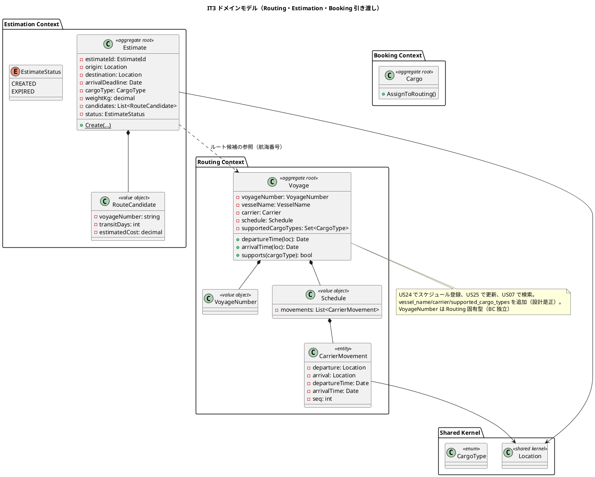
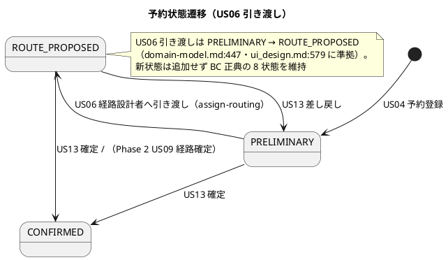
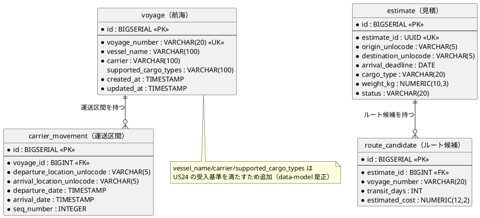
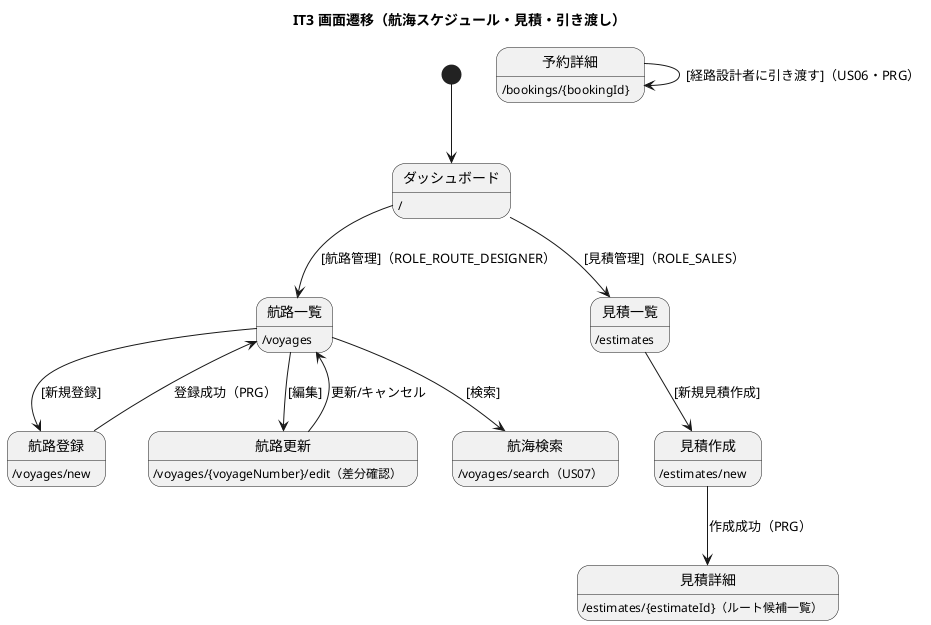

# イテレーション 3 計画

## 概要

本イテレーション（IT3）は、中盤局面（**インサイドアウト**）の初回として Phase 2（経路設計・貨物追跡）に着手する。**航海スケジュール**（Routing Context）と**輸送見積**（Estimation Context）という 2 つの新規 BC を、domain（値オブジェクト・集約・不変条件）と infrastructure（Repository）から先に固め、application → interfaces へ展開する。あわせて営業担当者から経路設計者への**予約引き渡し**（US06・Booking Context）を実装する。

- **局面**: 中盤（IT3-6）／アプローチ: **インサイドアウト**（domain / data 層から堅牢に作り込み、貧血ドメインモデルを回避）
- **対象 BC**: Routing Context（新設）・Estimation Context（新設）・Booking Context（US06 の状態遷移追加）
- **前提**: IT2 で予約（Cargo 集約）・荷主が実装済み。IT3 では経路設計の入力となる航海スケジュールと、荷主向けの輸送見積を新規に作り込む。経路候補算出（US08）は IT4。

---

## ゴール

### イテレーション終了時の達成状態

- 経路設計者が航海スケジュールを新規登録・更新でき、予約条件から利用可能な航海を検索できる（US24/US25/US07）。
- 営業担当者が輸送要件から見積を作成し、航海スケジュールに基づくルート概算候補を確認できる（US01）。
- 営業担当者が仮受付の予約を経路設計者に引き渡せる（US06・状態遷移）。
- routing / estimation BC が DDD + ヘキサゴナルで新設され、BC 独立性（コンテキスト固有の `VoyageNumber` 型・業務識別子参照）が保たれる。

### 成功基準

- [x] US24/US25/US07/US01/US06 の受け入れ基準を満たす（経路候補の精緻化など Phase 2 後続依存分は「注」で明示）。
- [x] Routing・Estimation の各ドメイン層カバレッジ 90% 以上、全体で SonarQube Quality Gate PASS。
- [x] **Try T3（sqlc BC 別分割）を実施**: `routing/estimation/booking` 別パッケージへ sqlc 出力を分割し go-arch-lint で BC 越境を構造検出（ADR-0005 決定3）。
- [x] **Try（カバレッジ計測標準化）**: クローズ時カバレッジは `go test -tags integration -coverprofile` で生成する運用を確立。
- [x] `make check`（build + test + lint + govulncheck + arch）green・CI success。

---

## ユーザーストーリー

### 対象ストーリー

| ID | ユーザーストーリー | SP | 対応 UC | BC | 優先度 |
|----|-------------------|----|---------|----|--------|
| US24 | 航海スケジュールを新規登録する | 3 | UC19 | routing | 必須 |
| US25 | 既存航海スケジュールを更新する | 2 | UC19 | routing | 必須 |
| US07 | 航海スケジュールを検索する | 5 | UC05 | routing | 必須 |
| US01 | 輸送見積を作成する | 5 | UC01 | estimation | 必須 |
| US06 | 予約情報を経路設計者に引き渡す | 2 | UC04 | booking | 必須 |
| **合計** | | **17** | | | |

> ベロシティ注記: IT1 実績 15 SP・IT2 実績 8 SP。IT3 は 17 SP と大きく、2 新規 BC の立ち上げ・設計ギャップの是正・Try T3（sqlc 分割）を含む。着手時に再見積もりし、必要なら US10/US12 相当の後続を IT4 へ寄せる。序盤オーバーヘッド解消後の中盤 initial として、完了しきらない場合は US07（検索の絞り込み精緻化）を優先度順に段階実装する。

### ストーリー詳細（受け入れ基準の要点）

#### US24: 航海スケジュールを新規登録する（経路設計者）

- 航海番号・船名・運送会社・出発港/到着港（UN/LOCODE）・出発日/到着日・対応貨物種別を入力できる。
- 寄港地を複数かつ順序付き（`seq_number`）で入力できる。
- 必須未入力・日付整合性（出発 > 到着はエラー）を検証する。
- 同一航海番号が存在しなければ登録完了・登録番号発行。以降 US07 の検索対象になる。
- **注（設計反映が必要）**: 現行 `voyage` テーブルは `voyage_number` のみ。船名・運送会社・対応貨物種別の列が欠落。Voyage 集約と data-model に `vessel_name`・`carrier`・`supported_cargo_types` を追加する（IT3 で反映）。

#### US25: 既存航海スケジュールを更新する（経路設計者）

- 航海番号で既登録を呼び出し、既存と更新内容の差分を確認画面に表示。
- 「更新する」で上書き、「キャンセル」で不変。更新後は検索結果に反映。

#### US07: 航海スケジュールを検索する（経路設計者）

- 予約番号から出発地・目的地・期限・貨物仕様を確認できる。
- 検索条件（出発地・目的地・出発期間・貨物種別）で利用可能な航海を検索。
- 制約（出発/到着港一致・寄港地接続・貨物種別対応）で絞り込み、航海番号・運送会社・出発/到着日・寄港地を表示。
- 危険物・冷凍は対応可能な航海のみに絞り込む。該当なしは緩和再検索を促す。
- **注**: 高度な寄港地接続グラフ探索は US08（IT4）。IT3 は出発/到着港・貨物種別・期間の直接フィルタまで。

#### US01: 輸送見積を作成する（営業担当者）

- 出発地・目的地・希望期限・貨物種別・重量を入力し見積を作成、見積番号を発行。
- 航海スケジュール情報をもとにルート概算候補（経由港・所要日数・概算料金・航海番号）を表示。
- 希望期限に間に合うルートがなければ通知。危険物選択時は危険物申告フォームを表示。
- **注**: ルート候補は本 IT ではスタブ/簡易算出（domain-model の「スタブのルート候補を自動付与」に準拠）。精緻な候補は US08（IT4）。

#### US06: 予約情報を経路設計者に引き渡す（営業担当者）

- 予約番号から予約情報を確認し、「経路設計者に引き渡す」を実行すると予約状態を更新。
- **状態遷移（設計正典に準拠）**: `POST /bookings/{bookingId}/assign-routing` で `PRELIMINARY → ROUTE_PROPOSED` へ遷移する（domain-model.md:447 `AssignToRoutingCommand`・ui_design.md:579 と一致）。受入基準の「経路設計中」は業務上の呼称で、システム状態としては既存 enum `ROUTE_PROPOSED` に対応させる（**新状態は追加しない**。BC 正典の 8 状態を維持）。表示ラベルは「経路設計中」寄りの表現を検討するが enum 値は増やさない。

---

## タスク（インサイドアウト順）

### 0. Try 返済・基盤（新 BC 立ち上げ前に先行）

- [x] **CargoType を共有カーネルへ移設（BC 独立性の前提・最重要）**: 現状 `CargoType` は `booking/domain/valueobjects.go` に定義されており、routing の `supportedCargoTypes`・estimation の `cargoType` がこれを参照すると **新 BC が booking BC に依存する BC 独立性違反**（`make arch` で検出）になる。IT2 の `ShipperCode`/`ShipperId` 移設パターン（ADR-0005 決定2）を踏襲し、`CargoType`（+ `ParseCargoType`）を `shared/domain` へ移設してから routing/estimation で参照する。ADR-0006 に記録。
- [x] **T3 sqlc BC 別分割**: sqlc の `output` を BC 別パッケージへ分割。**既存の `booking`（cargo）・`shipper`（users 含む）も分割対象**とし、`shared/infrastructure/sqlcgen` 集約を解消。各 Repository が自 BC のクエリのみ参照する構成へ。go-arch-lint に BC 別 sqlcgen コンポーネントを定義し越境を構造検出（ADR-0005 決定3）。既存 Repository の参照書き換え後、既存テスト green を確認してから新 BC を追加。
- [x] **カバレッジ計測標準化**: `go test -tags integration -coverprofile=coverage.out` をクローズ手順・CI に固定（IT2 の Sonar 新規カバレッジ FAIL 再発防止）。

### 1. Routing Context（US24/US25/US07 / 10 SP）

- [x] domain: `VoyageNumber`（コンテキスト固有型）・`CarrierMovement`（出発/到着地・時刻・seq）・`Schedule`（時系列 CarrierMovement）・`Voyage` 集約。`vessel_name`・`carrier`・`supportedCargoTypes` を集約に追加。不変条件（航海番号一意・時系列・出発≠到着・出発<到着）。
- [x] infrastructure: マイグレーション（voyage に vessel_name/carrier/supported_cargo_types 追加、carrier_movement）、sqlc、`VoyageRepository`（Save/FindByNumber/Search）。
- [x] application: `RegisterVoyageService`・`UpdateScheduleService`・`SearchVoyageService`（検索条件 → 制約フィルタ）。
- [x] interfaces: `/voyages`（一覧）・`/voyages/new`（登録）・`/voyages/{voyageNumber}/edit`（更新・差分確認）・`/voyages/search`（検索）。navbar の「航路管理」（`/voyages`・ROLE_ROUTE_DESIGNER）は既存。**ui_design.md:811 は航路を「閲覧専用」と記載しているため、登録/更新/検索を ROLE_ROUTE_DESIGNER に付与する旨を ui_design に是正**（下記 注 参照）。

### 2. Estimation Context（US01 / 5 SP）

- [x] domain: `EstimateId`・`RouteCandidate`（航海番号・経由港・所要日数・概算コスト）・`Estimate` 集約・`EstimateStatus`（CREATED/EXPIRED）。不変条件（必須項目・候補の値域）。
- [x] infrastructure: マイグレーション（estimate・route_candidate）、sqlc、`EstimateRepository`（Save/FindByEstimateId/FindAll）。
- [x] application: `CreateEstimateService`（Voyage を参照しスタブ/簡易ルート候補を付与）。
- [x] interfaces: `/estimates`（一覧）・`/estimates/new`（作成）・`/estimates/{estimateId}`（詳細・候補一覧）。**navbar に「見積管理」（`/estimates`・ROLE_SALES）リンクを追加**（現状欠落・US01 の到達導線）。ナビ整合を E2E で担保（navbar/dashboard/一覧/検証テストの 4 点一致）。

### 3. Booking 引き渡し（US06 / 2 SP）

- [x] domain: `Cargo.AssignToRouting()`（PRELIMINARY → ROUTE_PROPOSED）と不変条件・可否判定（`CanAssignToRouting`）。新状態は追加しない。
- [x] application/interfaces: `POST /bookings/{bookingId}/assign-routing`（PRG）、予約詳細に「経路設計者に引き渡す」アクション（ROLE_SALES・PRELIMINARY のみ表示）。
- [x] 表示ラベルの検討（「経路設計中」寄り）は `BookingStatus.Ja()` の範囲で行い enum 値は増やさない。

### 4. デモ E2E（受け入れ基準）

- [x] 航海スケジュール登録→検索、見積作成→候補表示、予約引き渡し→状態遷移の Playwright シナリオ。

---

## スケジュール（2 週間）

### Week 1

- Day 1: Try T3（sqlc BC 別分割）・カバレッジ計測標準化。
- Day 2-3: Routing domain + infra（Voyage 集約・Repository・マイグレーション・設計是正）。
- Day 4: Routing application + interfaces（US24 登録）。
- Day 5: US25 更新（差分確認）。

### Week 2

- Day 6: US07 検索（制約フィルタ・貨物種別絞り込み）。
- Day 7-8: Estimation BC（US01 見積作成・スタブ候補）。
- Day 9: US06 引き渡し（状態遷移）・デモ E2E。
- Day 10: 品質ゲート（make check / SonarQube / CI）・レビュー・クローズ準備。

---

## 設計

IT3 スコープ（Routing・Estimation の新設、Booking の US06 状態遷移）に絞って掲載する。

### ドメインモデル

### 状態遷移図（BookingStatus・US06 追加分）

### データモデル（ER 図）

### 画面遷移図

### API 設計

| メソッド | エンドポイント | 説明 | ロール |
|---------|---------------|------|--------|
| GET | `/voyages` | 航路一覧 | ROLE_ROUTE_DESIGNER |
| GET/POST | `/voyages/new` `/voyages` | 航海スケジュール登録（US24） | ROLE_ROUTE_DESIGNER |
| GET/POST | `/voyages/{voyageNumber}/edit` | 更新・差分確認（US25） | ROLE_ROUTE_DESIGNER |
| GET | `/voyages/search` | 航海検索（US07） | ROLE_ROUTE_DESIGNER |
| GET | `/estimates` | 見積一覧 | ROLE_SALES |
| GET/POST | `/estimates/new` `/estimates` | 見積作成（US01） | ROLE_SALES |
| GET | `/estimates/{estimateId}` | 見積詳細・候補 | ROLE_SALES |
| POST | `/bookings/{bookingId}/assign-routing` | 経路設計者へ引き渡し（US06） | ROLE_SALES |

### ADR

| ADR | タイトル | 本 IT での扱い |
|-----|---------|---------------|
| [ADR-0002](../adr/0002-bounded-context-canon.md) | BC 正典 | routing/estimation を正典どおり新設 |
| [ADR-0005](../adr/0005-bc-reference-and-shared-sqlcgen.md) | BC 間参照・共有 sqlcgen | 決定3（sqlc BC 別分割）を IT3 で実施 |
| ADR-0006（新規予定） | 航海スケジュール・見積のドメインモデル拡張 | US24 の設計是正（vessel/carrier/cargoType）を記録 |

---

## 検証結果（validating-iteration-plan / validating-design）

ステップ 3（validating-iteration-plan）・ステップ 4（validating-design）を並列エージェントで実施した。

### 一致を確認した項目

- **集約/値オブジェクト/enum**: Voyage/VoyageNumber/Schedule/CarrierMovement・Estimate/EstimateId/RouteCandidate/EstimateStatus(CREATED/EXPIRED) が domain-model と一致。
- **テーブル/カラム/命名**: voyage/carrier_movement/estimate/route_candidate・snake_case・UN/LOCODE(VARCHAR(5))・voyage_number(VARCHAR(20))・estimate_id(UUID) が data-model と一致。
- **URL/ロール/PRG**: /voyages・/estimates・/estimates/{estimateId}・POST /bookings/{bookingId}/assign-routing、ROLE_ROUTE_DESIGNER/ROLE_SALES が ui_design と一致。
- **軸 A（開発戦略）**: 中盤・インサイドアウト、IT3 の US 割当（US24/25/07/01/06）、レイヤー貫通順序、デモ E2E 受け入れ基準化がすべて一致。
- **BC ディレクトリ**: `internal/routing`・`internal/estimation` は空スケルトンで存在、4 層構成を踏襲可能。VoyageNumber は Routing 固有型として新設（コンテキスト固有型パターン踏襲）。

### 検証で修正した計画側の不整合

- **US06 状態の一本化**: 投機的な新状態 `ROUTING` を撤回し、設計正典（domain-model.md:447・ui_design.md:579）どおり **PRELIMINARY → ROUTE_PROPOSED** に統一（状態遷移図・タスク・受入を修正）。
- **CargoType 共有カーネル移設タスクを追加**: 現状 `booking/domain` にある CargoType を routing/estimation が参照すると BC 独立性違反。移設タスクをタスク 0 に追加（最重要）。
- **navbar 見積管理導線**: `/estimates`（ROLE_SALES）が navbar 未反映。タスク 2 に追加。
- **T3 の分割対象明記**: 既存 booking/shipper（cargo/users）も分割対象と明記。

### 注（設計ドキュメントを IT3 で是正）

- **voyage の列不足**: `data-model.md:759`・`domain-model.md:569` の Voyage に `vessel_name`・`carrier`・`supported_cargo_types` を追加（US24 受入基準）。
- **CargoType の昇格**: `booking/domain` の CargoType を `shared/domain` へ移設し、domain-model の共有カーネル節に追記。ADR-0006 に記録。
- **航路の書き込み権限**: `ui_design.md:811` の「航路は閲覧専用・ROLE_ROUTE_DESIGNER は読み取りのみ」を是正し、登録/更新/検索を経路設計者に付与する（US24/US25）。
- **navbar 見積導線**: `web/templates/layout.html` に ROLE_SALES 用 `/estimates` リンクを追加（実装是正）。
- **ダッシュボード起点**: `/` は placeholder のため、遷移図の dashboard 起点は navbar 経由到達で代替（dashboard ロール別カードは Phase 2 後続で検討）。

### IT2 レビュー Try の取り扱い（it2_go_review）

- **User-rep H1（フォームの必須検証 UI）**: IT3 で新設する見積作成・航海登録フォームにも適用する横断 DoD とする（クライアント `required` + フィールド単位エラー表示は可能な範囲で実装）。
- **User-rep H2（荷主選択導線）**: 予約フォームの改修を伴うため IT3 スコープ外。予約系画面を触る次 IT（IT4/5）へ明示的に繰越。

### Phase 2 後続依存（IT3 範囲外）

- **US07 の寄港地接続グラフ探索**は US08（IT4）。IT3 は出発/到着港・貨物種別・期間の直接フィルタまで。
- **US01 のルート候補**はスタブ/簡易算出（精緻化は US08）。

---

## リスクと対策

| リスク | 影響 | 対策 |
|--------|------|------|
| IT3 が 17 SP と大きく完了しきらない | 高 | インサイドアウトで Voyage（基盤）→ Estimate → US06 の順に縦完成させ、US07 の検索精緻化を優先度順に段階実装。未達分は IT4 へ明示的に繰越 |
| sqlc BC 別分割（T3）が既存 booking/shipper に波及 | 高 | 新規 BC 立ち上げ前に T3 を先行し、booking/shipper の Repository が壊れないことを既存テストで確認してから routing/estimation を追加 |
| 2 新規 BC 同時立ち上げによるユビキタス言語のブレ | 中 | コンテキスト固有型（VoyageNumber）・共有カーネル（Location・CargoType）の再利用方針を validating-design 軸 C で確認 |
| US06 の状態設計の後戻り | 中 | 実装前に validating-design で遷移先を確定し、enum/設計ドキュメントを同時反映 |

---

## 完了条件

### Definition of Done

- [x] US24/US25/US07/US01/US06 の受け入れ基準を満たす（Phase 2 後続依存分は「注」で明示）。
- [x] Try T3（sqlc BC 別分割）実施・go-arch-lint で BC 越境検出。
- [x] カバレッジ計測を integration タグ込みに標準化。
- [x] Routing・Estimation ドメイン層カバレッジ 90% 以上。
- [x] `make check` green・SonarQube Quality Gate PASS・CI success。
- [x] マルチパースペクティブレビュー実施・高優先度対応。
- [x] 設計ドキュメント（domain-model / data-model / ui_design）と実装が一致（voyage 列・US06 状態・CargoType 昇格・航路書き込み権限）。
- [x] CargoType を shared/domain へ移設し routing/estimation が booking に依存しない（`make arch` green）。
- [x] 新設フォーム（見積作成・航海登録）に必須検証 UI（IT2 レビュー Try H1）を適用。
- [x] navbar に見積管理導線を追加しナビ整合を E2E で担保。

### デモ項目（E2E 受け入れ基準）

- [x] 航海スケジュール登録（US24）→ 検索で表示（US07）。
- [x] 既存航海スケジュールの更新と差分確認（US25）。
- [x] 見積作成（US01）→ ルート候補一覧表示。
- [x] 予約の経路設計者への引き渡し（US06）→ 状態遷移。

---

## 更新履歴

| 日付 | 内容 |
|------|------|
| 2026-07-25 | 初版作成（IT3 開始準備・opening-iteration ステップ 2） |
| 2026-07-25 | クローズ時更新（実績反映）: 実績 17 SP・成功基準/DoD/タスク/デモ項目を全達成として更新。設計是正（voyage 列・CargoType 昇格・航路権限）は本体反映済み。UI 深掘り（動的区間・候補経由港）はレビュー Try として IT4 繰越 |

---

## 関連ドキュメント

- [リリース計画](release_plan.md)
- [開発戦略](development_strategy.md)
- [IT2 ふりかえり](retrospective-2.md)
- [IT2 完了報告書](iteration_report-2.md)
- [ドメインモデル設計](../design/domain-model.md)
- [データモデル設計](../design/data-model.md)
- [UI 設計](../design/ui_design.md)
- [ユーザーストーリー](../requirements/user_story.md)
- [ADR-0005](../adr/0005-bc-reference-and-shared-sqlcgen.md)
