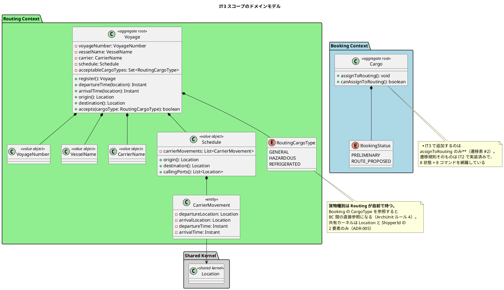
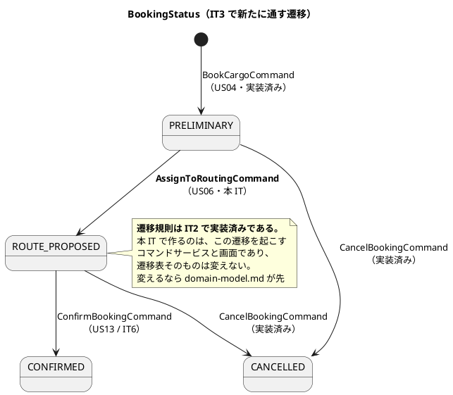
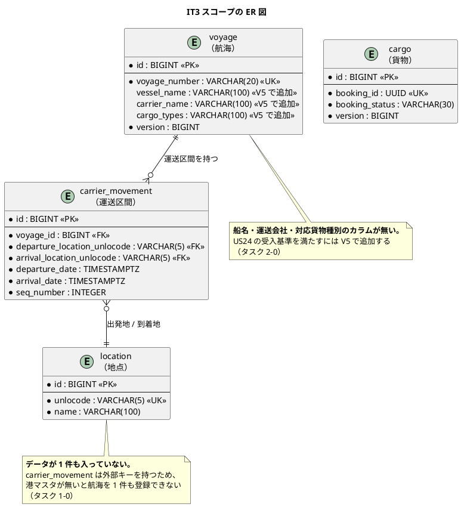
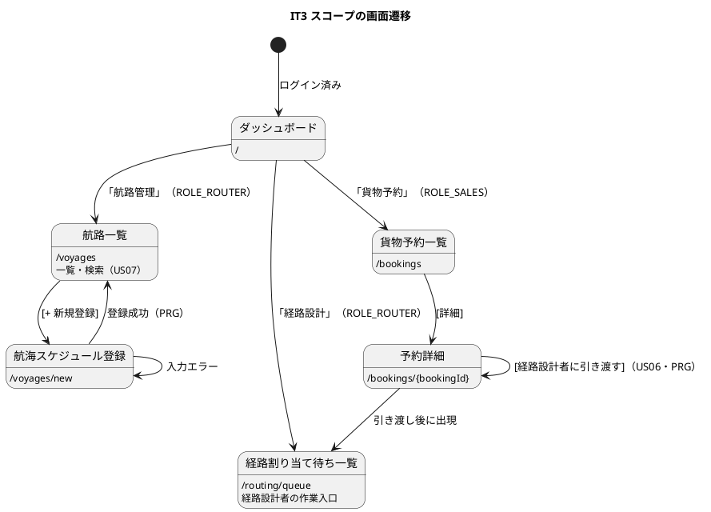

# イテレーション 3 計画

## ゴール

**航海スケジュールを登録・検索でき、予約を経路設計者に引き渡せるようにする。**
Routing Context の `Voyage` 集約と `Schedule` の連結制約を確立し、経路候補算出（IT4）の
入力を用意する。

| 項目 | 内容 |
| :--- | :--- |
| リリース | Release 0.2（経路設計・予約確定） |
| 局面 | **中盤（インサイドアウト）** — `development_strategy.md` |
| 計画 SP | 8 |
| 前提 | IT2 完了（予約登録・荷主訂正・品質ゲート） |

**局面が変わる。** IT1・IT2 は序盤（アウトサイドイン）だったが、IT3 からは中盤の
インサイドアウトになる。**ドメインの不変条件をユニットテストで書いてから外側へ出る。**
`Schedule` の連結制約（`CarrierMovement[n].arrival == CarrierMovement[n+1].departure`）は
画面から作ると必ず崩れる。

---

## 前イテレーションからの引き継ぎ

IT2 のふりかえり（[retrospective-2.md](retrospective-2.md)）の Try と持ち越しを、本計画の
タスク・成功基準・DoD に落とし込む。

### Try の反映

| Try | 本計画での扱い |
| :--- | :--- |
| T1 ロールに機能を開放するときは「見えてはならないもの」を先に書く | **DoD に追加。** 新設する 3 画面（`/voyages`・`/voyages/new`・`/routing/queue`）すべてに「**そのロール以外は URL 直打ちでも開けない**」テストを添える |
| T2 安全装置のテスト自体も壊して確認する | **DoD に追加。** 連結制約・日付整合・重複航海番号の各テストは、**制約を外して赤になること**を確認してから採用する |
| T3 間接的な指標で安全性を守らない | 経過時間・件数ではなく分岐の結果で判定する（T2 に含む） |
| T4 複数箇所に効く置換は件数を数える | 作業ルール。計画には項目を置かない |
| T5 品質ゲートは緑になるまでスキャンを繰り返す | クローズ時のルール。**1 回目の 0 件を結論にしない** |
| T6 返済枠を最初から時間で確保する | **タスク 0 として 12 時間確保**（下記） |

### 持ち越しの返済枠

| # | 内容 | 本計画での扱い |
| :--- | :--- | :--- |
| C1 | 一覧のページネーション（1 ページ 20 件） | タスク 0-1。**貨物予約・荷主・航路の 3 一覧に共通で効く**ため、航路一覧を作る前に片付ける |
| C2 | ステータスバッジの色分け | タスク 0-2 |
| C3 | 荷主検索のモーダル化（htmx） | タスク 0-3 |
| C4 | キャンセルの確認 | タスク 0-4 |
| C5 | US34（荷主が自社の予約を照会する） | **本 IT では対応しない。** Release 2。それまで荷主に開く画面は無い |
| C6 | US33（ロック解除） | **本 IT では対応しない。** IT6 が期限 |

---

## ユーザーストーリー

### 対象ストーリー

| ID | ユーザーストーリー | SP | 優先度 | Issue |
| :--- | :--- | :--- | :--- | :--- |
| US24 | 航海スケジュールを新規登録する | 3 | 必須 | [#485](https://github.com/k2works/case-study-cargo-tracker/issues/485) |
| US07 | 航海スケジュールを検索する | 3 | 必須 | [#486](https://github.com/k2works/case-study-cargo-tracker/issues/486) |
| US06 | 予約情報を経路設計者に引き渡す | 2 | 必須 | [#487](https://github.com/k2works/case-study-cargo-tracker/issues/487) |
| | **合計** | **8** | | |

### 受入基準

受入基準の正典は [ユーザーストーリー](../requirements/user_story.md) である。**本計画に書き写さず引用する。**

- US24: [US24 の受入基準](../requirements/user_story.md#us24-航海スケジュールを新規登録する)
- US07: [US07 の受入基準](../requirements/user_story.md#us07-航海スケジュールを検索する)
- US06: [US06 の受入基準](../requirements/user_story.md#us06-予約情報を経路設計者に引き渡す)

### 受入基準のうち本 IT で満たさないもの

| 受入基準 | 扱い | 理由 |
| :--- | :--- | :--- |
| US06「経路設計者に経路設計依頼の通知が送信される」 | **`/routing/queue` への出現をもって「引き渡し」とする**。受入基準を修正する（タスク 0-5） | ADR-006 により外部連携（メール送信）は実装しない。**通知の実体が無いまま「送信される」と書き続けると、永遠に満たせない受入基準が残る。** 経路設計者の作業入口に現れることが、業務上の「引き渡し」である |
| US07「危険物・冷凍貨物の場合、対応可能な航海のみに絞り込まれる」 | **本 IT で満たす。** ただし「対応可能」の判定は `voyage.cargo_types` に基づく単純な包含判定とし、港湾側の取扱制約（ビジネスルール 6）は US08 で扱う | 港湾の取扱可否は経路候補算出の関心事 |

---

## 設計への反映が必要（当該 IT で対応）

計画作成時の突合で見つかった、**設計ドキュメント・スキーマ側の欠落**である。

| # | 内容 | 対応 |
| :--- | :--- | :--- |
| 1 | **`location` テーブルにデータが 1 件も無い。** `carrier_movement` は `location` への外部キーを持つため、**港マスタが無いと航海スケジュールを 1 件も登録できない** | **タスク 1-0。** UN/LOCODE の港マスタを `common` マイグレーションで投入する。動作確認用データではなく**業務マスタ**であるため `db/seed` ではなく `common` に置く |
| 2 | **`voyage` テーブルに船名・運送会社・対応貨物種別が無い。** US24 の受入基準「船名・運送会社・対応貨物種別を入力できる」を満たせない | **タスク 2-0。** `V5__voyage_specification.sql` で追加する。**IT2 の V3 と同じ型の欠落**（テーブルはあるがカラムが揃っていない） |
| 3 | US06 の受入基準が「通知が送信される」のまま | 受入基準を修正する（タスク 0-5） |
| 4 | `cargo.origin_unlocode` / `destination_unlocode` に `location` への外部キーが無い | **本 IT では変えない。** 港マスタ投入後に整合を確認し、追加は US08 で判断する（既存データの整合が必要なため） |
| 5 | **`domain-model.md` の `Voyage` は `voyageNumber` と `schedule` しか持たない。** US24 の受入基準が求める船名・運送会社・対応貨物種別に対応する `VesselName` / `CarrierName` / `RoutingCargoType` が**ドメインモデルに存在しない**（横断検証で検出） | **タスク 5-2 で `domain-model.md` に追加する。** Routing Context の要素表・ドメインモデル図・ビジネスルールの 3 箇所。**実装と同じイテレーションで反映する**（先行乖離を防ぐ） |
| 6 | `RoutingCargoType` が Booking の `CargoType` と同じ 3 値を持つ | `domain-model.md` に**意味の違いを注記する**（「この貨物は何か」と「この航海は何を運べるか」）。ADR は起こさない |

> **「テーブルがある」と「使える」は別である。** IT2 で `cargo` のカラム欠落を踏んだのに続き、
> IT3 は**マスタデータの欠落**を踏む。初期スキーマで全テーブルを作る方針の副作用であり、
> 着手前の突合でしか見つからない。

---

## 設計（IT3 スコープ）

### ドメインモデル図

> **`RoutingCargoType` を Routing 側に置く理由**: Booking の `CargoType` を参照すると
> ArchUnit ルール 4 で落ちる。IT2 で確立した「ACL ポートのみが越境点」の規律に従う。
> **同じ 3 値を 2 か所に持つのは重複に見えるが、意味が違う。** Booking の `CargoType` は
> 「この貨物は何か」、Routing の `RoutingCargoType` は「この航海は何を運べるか」である。

### 状態遷移図（IT3 スコープ）

> **`Voyage` は状態を持たない。** 航海スケジュールは登録と更新のみで、ライフサイクル状態を
> 持たないため、Routing Context 側の状態遷移図は掲載しない。

### ER 図（IT3 スコープ）

### 画面遷移図（IT3 スコープ）

> **ROLE_ROUTER にとって、本 IT が最初に開く画面である。** IT1・IT2 では経路設計者に
> 開く画面が 1 つも無かった。**ダッシュボードの「現在ご利用いただける機能はありません」の
> 対象から ROLE_ROUTER が外れる**のが本 IT の到達点のひとつである。

---

## タスク分解

見積は理想時間。局面は**インサイドアウト**（ドメインの不変条件から書き、画面は最後）。

### 0. 返済枠（上限 12 時間。IT2 ふりかえり T6）

> **Issue は起票済みだった**（#485 / #486 / #487。ラベル `it3`・SP・マイルストーンとも設定済み）。
> 開始準備で確認し、起票タスクは不要と判断した。

| # | タスク | 見積 |
| :--- | :--- | :--- |
| 0-1 | **一覧のページネーション（C1）。** 貨物予約・荷主・航路の 3 一覧に共通で効く部品として作る。**航路一覧を作る前に片付ける** | 4h |
| 0-2 | ステータスバッジの色分け（C2）。`BookingStatus` に表示色を持たせ、画面で分岐しない | 2h |
| 0-3 | 荷主検索のモーダル化（C3。htmx） | 3h |
| 0-4 | キャンセルの確認（C4） | 1h |
| 0-5 | US06 の受入基準の修正（通知 → 経路割り当て待ち一覧への出現） | 1h |

### 1. 港マスタ（前提）

| # | タスク | 見積 |
| :--- | :--- | :--- |
| 1-0 | **UN/LOCODE の港マスタを投入する。** `common/V6__location_master.sql`。日本・アジア・北米・欧州の主要港。**業務マスタであり動作確認用データではないため `db/seed` に置かない** | 3h |
| 1-1 | 港マスタが投入されていることを検証するテスト。**「マスタが空でも起動できてしまう」状態を許さない** | 1h |

### 2. Routing Context のドメイン（インサイドから固める）

| # | タスク | 見積 |
| :--- | :--- | :--- |
| 2-0 | **`V5__voyage_specification.sql`。** `voyage` に `vessel_name` / `carrier_name` / `cargo_types` を追加する | 2h |
| 2-1 | 値オブジェクト（`VoyageNumber`・`VesselName`・`CarrierName`・`RoutingCargoType`）とユニットテスト | 4h |
| 2-2 | **`CarrierMovement` と `Schedule` の連結制約**（`movements[n].arrival == movements[n+1].departure`）。**制約を外して赤になることを確認する**（Try T2） | 6h |
| 2-3 | `Voyage` 集約（`register` / `origin` / `destination` / `callingPorts` / `accepts`）とユニットテスト | 5h |
| 2-4 | `Cargo` に `assignToRouting` / `canAssignToRouting` を追加（US06。遷移表 #2） | 2h |

> **連結制約と日付整合は 2-2 の境界値に必ず含める。** 「区間 1 の到着港と区間 2 の出発港が違う」
> 「区間の到着が出発より前」「区間 2 の出発が区間 1 の到着より前（時間が巻き戻る）」の 3 つ。
> **最後のひとつは DB の CHECK では守れない**（区間をまたぐため）。

### 3. 永続化

| # | タスク | 見積 |
| :--- | :--- | :--- |
| 3-1 | `VoyageRepository`（ポート）と MyBatis 実装。**集約全体（Voyage + CarrierMovement）の保存と復元**。テストは Testcontainers（ADR-003） | 6h |
| 3-2 | 航海番号の重複を業務の結果に落とす（US24 の受入基準）。**`DuplicateKeyException` を 500 にしない**（IT2 の C6 と同型） | 2h |

### 4. アプリケーションと画面

| # | タスク | 見積 |
| :--- | :--- | :--- |
| 4-1 | `RegisterVoyageCommandService`（US24） | 3h |
| 4-2 | `VoyageQueryService`（US07）。出発地・目的地・出発期間・貨物種別で絞り込む。**絞り込みは SQL 側**（CQRS のクエリ側） | 4h |
| 4-3 | `AssignToRoutingCommandService`（US06） | 2h |
| 4-4 | 航路一覧・航海スケジュール登録の 2 画面 | 6h |
| 4-5 | 経路割り当て待ち一覧（`/routing/queue`）。**既定の並び順は希望期限の昇順**（`ui_design.md`） | 4h |
| 4-6 | 予約詳細に `[経路設計者に引き渡す]`。**ボタンの出し分けは集約の述語をそのまま呼ぶ** | 2h |
| 4-7 | **ロール別・URL 直打ちの到達性検証（Try T1）。** ROLE_ROUTER が 3 画面に到達でき、**他のロールは導線も出ず URL 直打ちでも 403 になる**ことを固定する | 3h |

### 5. ドキュメント

| # | タスク | 見積 |
| :--- | :--- | :--- |
| 5-1 | **マニュアル更新。** 「05. 航路管理」を新設し、「04. 貨物予約」に引き渡しの節を追加。**キャプチャ生成が通ってから記述を始める**（Try T3） | 6h |
| 5-2 | **設計ドキュメントの反映（上表 5・6）。** `domain-model.md` の Routing Context に `VesselName` / `CarrierName` / `RoutingCargoType` を追加し、`data-model.md` に V5・V6 を反映する。JIG / jig-erd と突き合わせる | 4h |

**合計見積: 76 理想時間**

---

## リスク

| リスク | 影響 | 対応 |
| :--- | :--- | :--- |
| 港マスタ（1-0）の範囲が膨らむ | 本題に入る前に時間を使う | **主要港 30 件程度に絞る。** 網羅は目的ではない。US08 で経路候補を算出するのに足りることだけを条件とする |
| 返済枠（タスク 0）が 12 時間を超える | US24 / US07 / US06 を圧迫する | **上限 12 時間で打ち切る。** 超えた分は次 IT へ送り、送ったことを完了報告書に明記する（IT2 と同じ規律） |
| `Schedule` の連結制約が画面から崩れる | 不正なスケジュールが登録される | **インサイドアウトで作る。** 制約をユニットテストで固定してから画面を作る。局面が中盤に変わる理由そのものである |
| 集約全体の永続化（3-1）が想定より重い | IT3 が未達になる | `Voyage` は子コレクションを 1 つ持つだけである。**IT2 の `Cargo`（子なし）から 1 段だけ上がる** |
| `RoutingCargoType` の重複が指摘される | 設計判断が伝わらない | **計画に理由を明記済み**（Booking の `CargoType` とは意味が違う）。ADR は起こさず、`domain-model.md` に注記する |
| ROLE_ROUTER に開放する画面が増える | IT2 の H1 と同型の欠陥 | **Try T1 を DoD に置いた。** 「見せる」と「見せない」の両方をテストする |

---

## 完了の定義（DoD）

**条件は正典を引用する。書き写さない。**

| 項目 | 正典 |
| :--- | :--- |
| 受け入れ基準 | [ユーザーストーリー](../requirements/user_story.md) の US24 / US07 / US06 |
| テストレベルと責務 | [テスト戦略](../design/test_strategy.md) §1.3 / §3 |
| 品質ゲート | [テスト戦略](../design/test_strategy.md) §6.2 |
| 画面仕様・ロール別の到達性 | [UI 設計](../design/ui_design.md) |
| ドメインの不変条件 | [ドメインモデル設計](../design/domain-model.md) |

加えて、本イテレーション固有の条件:

- [ ] **`Schedule` の連結制約がユニットテストで固定されている**。制約を外すと赤になることを確認済み（Try T2）
- [ ] **ドメインの不変条件は画面より先に書かれている**（中盤＝インサイドアウト）
- [ ] **港マスタが投入され、空のままでは検出できるテストがある**
- [ ] **新設する 3 画面すべてに「そのロール以外は URL 直打ちでも開けない」テストがある**（Try T1）
- [ ] **ROLE_ROUTER がダッシュボードから作業入口に到達できる**（IT1・IT2 では開く画面が無かった）
- [ ] Repository のテストは Testcontainers で書く。H2 では書かない（ADR-003）
- [ ] `booking` から `routing` への直接参照が無い（ArchUnit ルール 4）
- [ ] 画面層がリポジトリを直接参照しない（ArchUnit。IT2 で追加）
- [ ] **ユーザーマニュアルを更新し、キャプチャを再生成して `/manual/` に配信されることを確認する**
- [ ] Heroku 開発環境にデプロイし、**権限の無いロールで 403 になることまで**確認する
- [ ] **SonarQube Quality Gate が PASS になるまでスキャンを繰り返す**（Try T5。1 回目の 0 件を結論にしない）
- [ ] **満たせない受入基準は、隠さず完了報告書に記録する**
- [ ] **`domain-model.md` に `VesselName` / `CarrierName` / `RoutingCargoType` が反映されている**（実装と同じ IT で反映し、先行乖離を作らない）
- [ ] **IT3 終了時にベロシティを実績で再計算する**（3 イテレーションの実績が揃う。`release_plan.md` のリスク項目）

---

## 参照

- [リリース計画](release_plan.md) — IT 配分と SP の正典
- [開発戦略](development_strategy.md) — 局面とアプローチ（IT3 から中盤）
- [IT2 ふりかえり](retrospective-2.md) — 本計画の入力
- [IT2 実装レビュー](../review/IT2実装_review_20260806.md) — 持ち越し事項の出典
- [ドメインモデル設計](../design/domain-model.md) — Routing Context の正典
