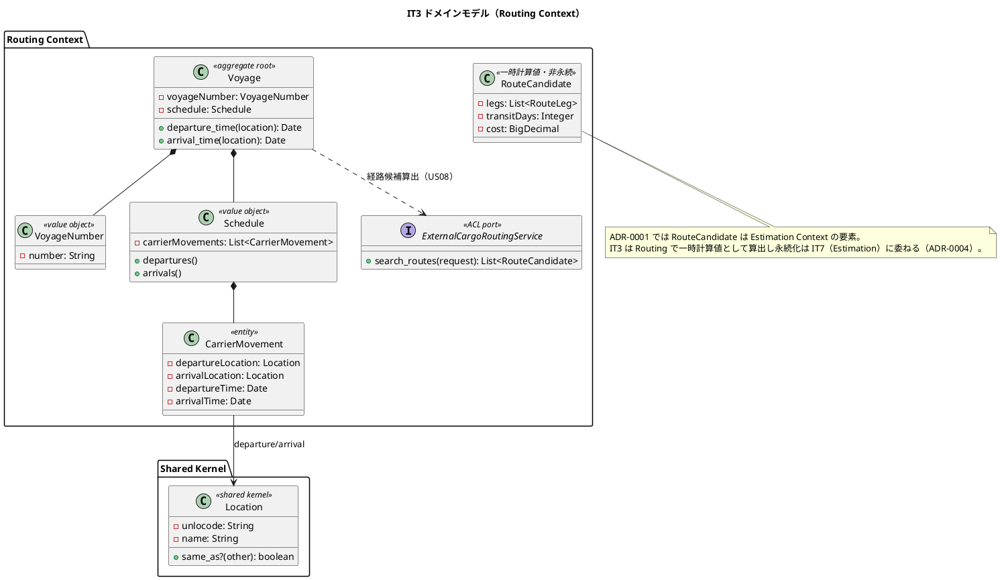
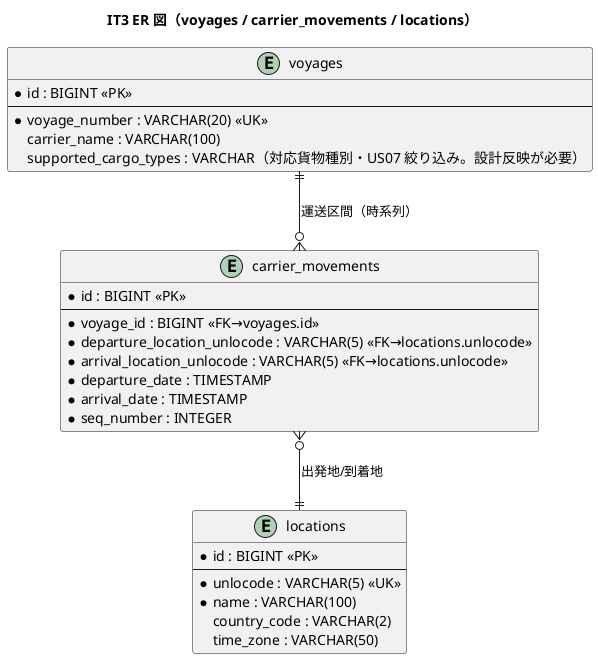
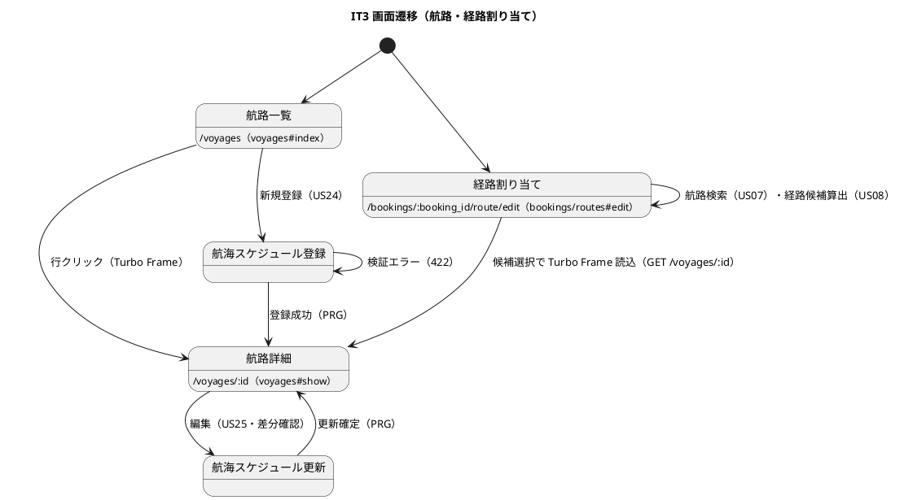

# イテレーション 3 計画 - 航海スケジュール + 経路候補算出

## ゴール

Routing Context の Voyage 集約と航海スケジュールを確立し、航海スケジュールの新規登録（US24）・更新（US25）・検索（US07）・経路候補算出（US08）を中盤インサイドアウトで TDD 完成させる。あわせて Location 共有カーネル（`packs/shared`・locations テーブル）を導入し、外部経路システムの ACL（`ExternalRoutingService` ポート + フォールバック）を WebMock 契約テストで確立する。

- **局面**: 中盤（インサイドアウト）— [development_strategy.md](development_strategy.md) 参照
- **期間**: Week 5-6（2026-08-10 〜 2026-08-23）
- **目標 SP**: 14

## 対象ストーリー

| US | 概要 | SP | BC | 対応 UC |
|:---|:-----|:--|:---|:--------|
| US24 | 航海スケジュールを新規登録する | 3 | Routing Context | UC19 |
| US25 | 既存航海スケジュールを更新する | 3 | Routing Context | UC19 |
| US07 | 航海スケジュールを検索する | 3 | Routing Context | UC05 |
| US08 | 経路候補を算出する | 5 | Routing Context | UC06 |

（release_plan.md Phase 2 / IT3 と一致）

## 受入条件

[user_story.md](../requirements/user_story.md) の受け入れ基準に準拠（全文）。

**US24 航海スケジュールを新規登録する**（として: 経路設計者。MVP では営業担当者が代替）

- [ ] 航海番号・船名・運送会社・出発港（UN/LOCODE）・到着港（UN/LOCODE）・出発日・到着日・対応貨物種別を入力できる
- [ ] 寄港地を複数かつ順序付きで入力できる
- [ ] 必須項目が未入力の場合、未入力箇所を明示したエラーが表示される
- [ ] 出発日が到着日より後の場合、日付の整合性エラーが表示される
- [ ] 同一航海番号がシステムに存在しない場合、登録が完了し登録番号が発行される
- [ ] 登録後、UC05（航海スケジュール検索）の検索対象として利用できる

**US25 既存航海スケジュールを更新する**（として: 経路設計者）

- [ ] 既存の航海番号を指定して既登録スケジュールを呼び出せる
- [ ] 既存内容と更新内容の差分が確認画面に表示される
- [ ] 差分確認後に「更新する」を選択することで既存スケジュールが上書き更新される
- [ ] 更新後、UC05（航海スケジュール検索）の検索結果に更新内容が反映される
- [ ] 「キャンセル」を選択した場合、既存スケジュールは変更されない

**US07 航海スケジュールを検索する**（として: 経路設計者。MVP では営業担当者が経路割り当て画面で代替 — ui_design 準拠）

- [ ] 予約番号を指定して出発地・目的地・期限・貨物仕様を確認できる
- [ ] 検索条件（出発地・目的地・出発期間・貨物種別）を入力して検索できる
- [ ] 制約条件（航海スケジュール・寄港地接続・港湾制約・貨物種別対応）に基づいて利用可能な航海が表示される
- [ ] 航海スケジュール一覧に航海番号・運送会社・出発日・到着日・寄港地が表示される
- [ ] 条件を満たす航海がない場合、その旨が表示され条件を緩和して再検索できる
- [ ] 危険物・冷凍貨物の場合、対応可能な航海のみに絞り込まれる（※貨物種別対応の絞り込み。対応種別を航海に保持）
- [ ] 出発地・目的地は UN/LOCODE 形式で指定できる

**US08 経路候補を算出する**（として: 経路設計者。MVP では営業担当者が経路割り当て画面で代替 — ui_design 準拠）

- [ ] 航海スケジュール検索結果と出発地・目的地・期限を入力として経路候補が自動算出される
- [ ] 寄港地の接続可能性が評価される
- [ ] 経路候補ごとに所要日数・経由港・費用・航海番号が表示される
- [ ] 経路候補が推奨順に並べられて提示される
- [ ] 直行便がある場合、最優先候補として提示される
- [ ] 期限内に到達可能な経路がない場合、その旨が通知され条件調整が促される

## タスク分解（インサイドアウト）

中盤はデータ層 → リポジトリ → ドメイン層 → アプリケーション → UI の順で貫通する。

### 技術的負債の返済枠（IT2 ふりかえり Try）

- [ ] 【T12】ADR で正典変更を決めたら「実装と同一コミットで domain-model/data-model/該当計画を更新」を本 IT の DoD に組み込む（正典ドリフト防止）
- [ ] 【T13】フォーム値の安全変換ヘルパ（空/非数値→ドメインで日本語メッセージ）を共通化し、Voyage 日付・貨物種別の変換に適用（IT2 の重量例外の再発防止）
- [ ] 【T10】状態/集約更新の悲観ロック更新の口をリポジトリ基盤に標準化（Voyage 更新 US25 に適用）
- [ ] 【T11】capybara-playwright の `:js` driver を導入し、経路割り当ての Turbo Frame（`/voyages/:id` 部分読み込み）を system spec で検証
- [ ] 【T14】荷主 ID 入力を荷主名/コードの検索・選択 UX に改善（`Shipper::Public::ShipperDirectory` 活用。貨物予約フォームに適用）
- [ ] 【T2】ドメイン層 AR 禁止 RuboCop カスタム cop（`packs/*/app/domain/**` での `ActiveRecord`/`ApplicationRecord` 参照禁止）を実装し CI 組込
- [ ] 【T8】SonarQube を ruby/take-1 に導入（`sonar-project.properties`・SimpleCov 連携・Quality Gate）※運用タスク
- [ ] 【T15】Cargo.reconstitute（復元専用）を分離し、Voyage リポジトリでも生成/復元を分離（同型の設計を Routing で最初から採る）

### Location 共有カーネルの導入（先行基盤）

- [ ] `Shared::Domain::Location` 値オブジェクト（`unlocode`・`name`・`same_as?`・UN/LOCODE 形式検証）のユニット spec
- [ ] `locations` テーブル migration（`unlocode` UK・`name`・`country_code`・`time_zone`）と `Shared::Public::LocationDirectory`（公開参照 API）
- [ ] Booking の `RouteSpecification` を String 保持から Location 参照へリファクタ（UN/LOCODE の一貫化。IT2 の割り切りを解消）

### データ層 → リポジトリ（US24 基盤）

- [ ] `voyages` / `carrier_movements` テーブル migration（`voyage_number` UK・FK→locations.unlocode・`seq_number`）
- [ ] `Routing::Infrastructure::VoyageRecord` / `CarrierMovementRecord`（AR）と `ActiveRecordVoyageRepository`（PORO↔AR 変換・悲観ロック更新）の repository spec

### ドメイン層（US24/US25）

- [ ] `Voyage` 集約（PORO）・`VoyageNumber` 値オブジェクト・`Schedule`（時系列 CarrierMovement 一覧・`departures`/`arrivals`）・`CarrierMovement` エンティティのユニット spec
- [ ] ビジネスルール: 一意 VoyageNumber・時系列順・出発地≠到着地・出発日<到着日・寄港地順序付きのドメイン検証
- [ ] `RegisterVoyage` / `UpdateSchedule` ユースケース（US24 新規登録・US25 差分更新。同一航海番号の重複チェック）

### US08 の BC 帰属決定（ADR-0004・着手前に確定）

- [ ] 【ADR-0004】US08 経路候補算出の BC 帰属を決定し記録する。ADR-0001 では **Estimation Context が US08 の受け皿**（`RouteCandidate` は Estimation の要素）だが、Estimation は IT7 まで未着手。IT3 では **Routing Context で経路候補を「一時計算値（非永続）」として算出**し、永続化（`route_candidates` テーブル）は Estimation を作る IT7 に委ねる方針を ADR-0004 に記録する。実装と同一コミットで domain-model.md（Routing/Estimation 双方の要素表・依存図）・architecture_backend.md を更新（T12）

### アプリケーション → UI（US07/US08）

- [ ] `Routing::Public::VoyageDirectory`（公開参照 API）を定義し、Booking の経路割り当て画面は Routing へ公開 API 経由のみアクセス（Packwerk privacy で直接参照禁止・ADR-0001/0003・IT2 と同型）
- [ ] `SearchVoyages` クエリサービス（US07 検索・出発地/目的地/期間/貨物種別で絞り込み・貨物種別対応フィルタ）
- [ ] `ExternalCargoRoutingService` 出力ポート（Routing ドメイン層の抽象）＋ `ExternalCargoRoutingClient`（Faraday HTTP アダプタ・Infrastructure）＋ フォールバック（タイムアウト時に過去実績データから候補算出）。WebMock 契約テスト（正常 3 候補・接続タイムアウト→フォールバック）。命名は architecture_backend に合わせる
- [ ] `CalculateRouteCandidates` ユースケース（US08 経路候補を一時 `RouteCandidate` 値で算出・所要日数/経由港/費用/航海番号・推奨順・直行便優先・期限内不可の通知）。**期限（DATE）と到着時刻（TIMESTAMP）の比較は日付単位で行い、当日時刻付き着を刈らない**（既知バグ類型のテスト観点）
- [ ] 航路 UI: 一覧（`/voyages`）・詳細（`/voyages/:id` Turbo Frame）・スケジュール登録/更新フォーム・検索・経路割り当て（`/bookings/:booking_id/route/edit` の候補表示。確定は US09/IT4）
- [ ] ナビゲーション整合: `_navbar.html.erb`・ダッシュボードの「航路管理」導線を実画面へ更新し、ロール別到達性 system spec

## スケジュール

| Week | 主な作業 |
|:-----|:---------|
| Week 5 | 負債返済枠（T2/T8/T12/T13）→ Location 共有カーネル → voyages/carrier_movements データ層・リポジトリ・Voyage 集約（US24/US25） |
| Week 6 | US07 検索・US08 経路候補算出（外部 ACL・WebMock・フォールバック）、航路 UI・経路割り当て候補表示、デモ項目 system spec の green 化、品質ゲート |

## 設計（IT3 スコープに絞った 4 図）

### ドメインモデル図（Routing Context + Location 共有カーネル）

> **注（状態遷移図の省略）**: Voyage 集約は業務状態機械を持たない（登録・更新・検索のみで状態遷移がない）ため、状態遷移図は掲載しない。経路候補算出は外部 ACL（`ExternalRoutingService`）経由で、タイムアウト時は自航海データからのフォールバック候補を返す。

### ER 図（IT3 スコープ）

> **注**: `carrier_movements.seq_number` で時系列順を担保。Booking の `legs` は `voyage_number`（業務キー）で voyages を参照するが、BC 間参照整合のため DB FK は設けない（data-model 判断 5）。

### 画面遷移図（IT3 スコープ）

### データモデル図（論理・Routing）

上記 ER 図に準拠。`locations` は Shared Kernel として全 BC で共有し、`voyages`/`carrier_movements` は Routing Context が所有する。

## リスク

| リスク | 対策 |
|--------|------|
| 外部経路システム ACL（US08）の仕様不確実性 | WebMock 契約テストを先に定義（正常 3 候補・タイムアウト）。タイムアウト時は自航海データからのフォールバック候補を必須実装（test_strategy の契約） |
| Location 共有カーネル導入に伴う Booking RouteSpecification の破壊的変更 | String→Location 参照のリファクタは Booking の既存 spec を回帰網羅で守り、段階的に置換（Location.of(unlocode) の後方互換ファクトリを用意） |
| 経路候補算出（寄港地接続・推奨順・直行便優先）のロジック複雑性 | インサイドアウトでドメインの CargoItinerary 連結制約（Leg[n].unload == Leg[n+1].load）を先にユニットで固め、外部候補はアダプタで整形 |
| 経路設計者専用画面の MVP 代替 | ui_design 通り営業担当者の経路割り当て画面で代替。専用画面は後続 IT（スコープ外明記） |
| US08 経路候補を Routing に前倒しし Estimation（IT7）と二重定義になる | ADR-0004 で「Routing は一時計算値・Estimation が永続化」と役割分担を記録し、domain-model/architecture を同時更新（T12） |
| 期限（DATE）と到着（TIMESTAMP）の素朴比較で期限当日着を誤って刈る | 日付単位で比較し「当日時刻付き着」を経路候補算出のユニット/契約テストに含める（既知バグ類型） |

## 設計への反映が必要（validating 検証で確定）

以下は開始準備の横断検証で検出。実装と同一コミットで `docs/design/`・ADR へ反映する（T12 の DoD 化）。

1. **【高】US08 の BC 帰属（ADR-0004）**: ADR-0001 は US08・`RouteCandidate` を Estimation Context の要素とする（`route_candidates` は estimates 子テーブル）。IT3 は Routing で経路候補を一時計算値として算出し永続化を IT7 に委ねる方針を **ADR-0004** に記録し、domain-model.md（Routing/Estimation 双方）・architecture_backend.md を同時更新する。正典衝突（RouteCandidate の二重定義）を防ぐ。
2. **【高】US24/US25 の画面・ルート**: ui_design の画面一覧・ルート表は `/voyages`（index/show）のみで、航海スケジュール登録（US24）・更新/差分確認（US25）の画面と POST/PATCH ルートが未定義。ui_design に追加する（経路設計者専用画面の MVP 代替方針の範囲で、営業担当者が操作できる管理画面として）。
3. **航海の対応貨物種別**: US07 の危険物/冷凍フィルタ・US24 入力に必要な「対応貨物種別」が voyages（domain-model・data-model）に未定義。voyages に `supported_cargo_types`（または関連テーブル）と `carrier_name`/`ship_name` を追加する。
4. **Routing のビジネスルール補足**: domain-model の Routing ビジネスルールは 4 項（一意番号・時系列順・出発地≠到着地・UN/LOCODE 一意）のみ。US24 の「出発日 < 到着日」「寄港地の順序付き」を追記する。
5. **Location の設計記述の重複解消**: architecture_backend が Location を packs/booking の entities と packs/shared に二重記載し種別も割れている。Shared Kernel（`packs/shared`）に一本化する。
6. **ExternalRoutingService の命名/層**: domain-model=`ExternalRoutingServicePort`・architecture=`ExternalCargoRoutingService`/`ExternalCargoRoutingClient`・test_strategy=`ExternalRoutingServiceAdapter` と割れる。ユビキタス名を確定し正典化する。

## Definition of Done

- [ ] US24/US25/US07/US08 の受け入れ基準をすべて満たす
- [ ] デモ項目 system spec（スケジュール登録→検索で発見→経路候補算出→経路割り当て画面で候補表示）が green
- [ ] Voyage 集約・Schedule・CarrierMovement のドメイン検証（一意番号・時系列・出発地≠到着地・日付整合）のユニット spec が green
- [ ] 外部経路 ACL の WebMock 契約テスト（正常・タイムアウト→フォールバック）が green
- [ ] Location 共有カーネル導入・Booking RouteSpecification の Location 参照化・既存 spec 回帰 green
- [ ] `bundle exec rspec` / `rubocop`（+ ドメイン AR 禁止 cop）/ `brakeman` / `bundler-audit` / `bin/packwerk check`（privacy）green・CI success
- [ ] ドメイン層カバレッジ 85% 以上・全体 80% 以上
- [ ] SonarQube Quality Gate PASS（T8 導入後）または未導入なら方針明記
- [ ] ADR-0004（US08 の BC 帰属・Routing 一時計算 / Estimation 永続化）を作成
- [ ] 上記「設計への反映が必要」の 6 点を `docs/design/`・ADR に反映済み（実装と同一コミット・T12）
- [ ] Booking→Routing が `Routing::Public::VoyageDirectory` 公開 API 経由のみ（Packwerk privacy）

## デモ項目（イテレーションレビュー）

1. 航海スケジュール（航海番号・運送会社・寄港地・出発/到着日）を登録できる。
2. 出発地・目的地・貨物種別で航海を検索し、対応可能な航海が一覧表示される。
3. 出発地・目的地・期限から経路候補が所要日数・経由港・費用・推奨順で算出される（直行便が最優先）。
4. 外部経路システムがタイムアウトしても、フォールバック候補が返る。

## 更新履歴

| 日付 | 更新内容 | 更新者 |
|------|---------|--------|
| 2026-07-28 | 初版作成（IT3: 航海スケジュール US24/US25/US07/US08・Routing Context・Location 共有カーネル・外部 ACL） | - |
| 2026-07-28 | 開始準備の整合性検証を反映（US08 の BC 帰属を ADR-0004 化・RouteCandidate を一時計算値に、Routing::Public::VoyageDirectory 追加、US07 第1受入基準・actor 注記、voyages 対応貨物種別、ExternalCargoRoutingService 命名整合、DATE/TIMESTAMP 境界、設計反映 6 点に拡充） | - |

## 関連ドキュメント

- [リリース計画](release_plan.md)
- [開発戦略](development_strategy.md)（中盤インサイドアウト）
- [イテレーション 2 ふりかえり](retrospective-2.md)（Try T2/T8/T10-T15）
- [ユーザーストーリー](../requirements/user_story.md)（US24/US25/US07/US08）
- [ドメインモデル](../design/domain-model.md)（Routing Context・Shared Domain/Location）
- [データモデル](../design/data-model.md)（voyages / carrier_movements / locations）
- [UI 設計](../design/ui_design.md)（航路一覧・詳細・経路割り当て）
- [アーキテクチャ（バックエンド）](../design/architecture_backend.md)（外部経路 ACL）
- [テスト戦略](../design/test_strategy.md)（WebMock 契約テスト・フォールバック）
- [ADR-0001](../adr/0001-bounded-context-and-packwerk-structure.md) / [ADR-0003](../adr/0003-cross-context-identifier-and-acl.md)
