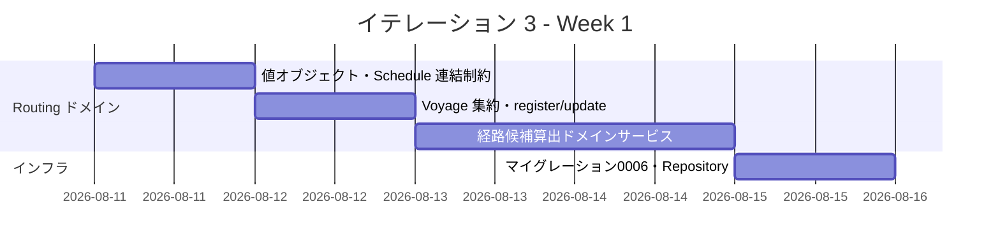
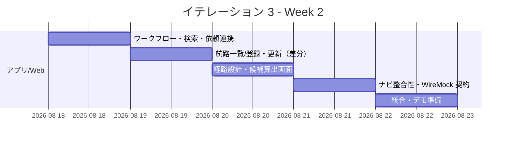
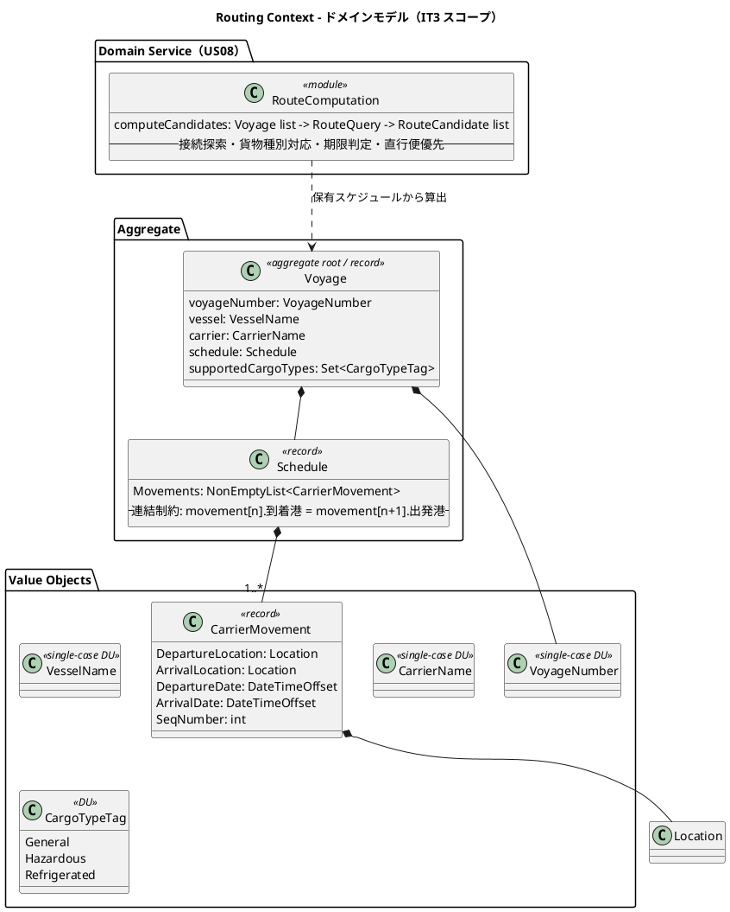
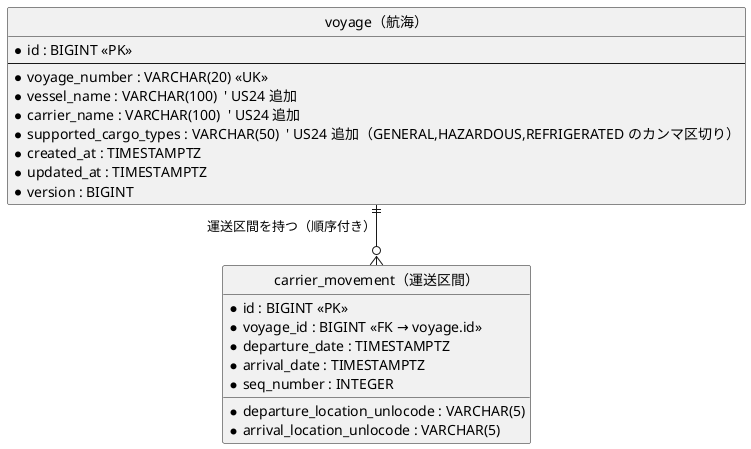
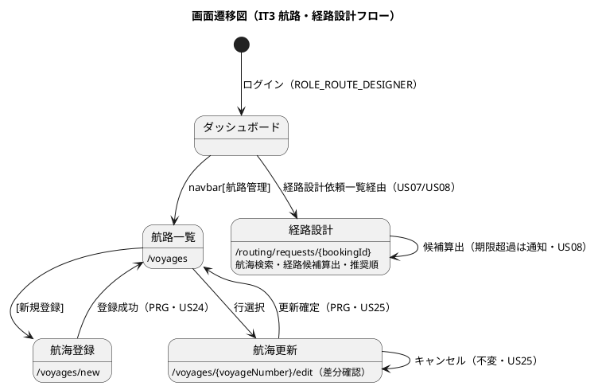

# イテレーション 3 計画

## 概要

| 項目 | 内容 |
|------|------|
| **イテレーション** | 3 |
| **期間** | 2026-08-11 〜 2026-08-22（2 週間） |
| **ゴール** | 航海スケジュールを管理・検索し、制約を考慮した経路候補を自動算出できる（Routing Context の中核ドメインを確立する） |
| **目標 SP** | 14（US24/US25/US07/US08） |
| **局面** | 中盤（開発戦略）／アプローチ: **インサイドアウト** |

---

## ゴール

### イテレーション終了時の達成状態

1. **航海スケジュール登録（US24）**: 経路設計者が航海番号・船名・運送会社・出発港/到着港・出発日/到着日・対応貨物種別・寄港地（順序付き）を登録でき、日付整合・重複航海番号を検証する。
2. **航海スケジュール更新（US25）**: 既存航海番号を呼び出し、差分を確認してから上書き更新できる（キャンセル時は不変）。
3. **航海スケジュール検索（US07）**: 出発地・目的地・出発期間・貨物種別で利用可能な航海を検索し、寄港地接続・貨物種別対応で絞り込める。
4. **経路候補算出（US08）**: 登録済み航海スケジュールから、寄港地接続・貨物種別対応・期限を制約として経路候補を自動算出し、推奨順（直行便優先）に提示する。

### 成功基準

- [ ] Voyage 集約の不変条件（運送区間の連結: `movement[n].到着港 = movement[n+1].出発港`・出発日 < 到着日・非空スケジュール）が FsCheck で網羅検証される
- [ ] 経路候補算出（接続評価・貨物種別対応・期限判定・直行便優先）がドメイン層のユニット + FsCheck で検証される
- [ ] `VoyageRepository`（Donald・voyage + carrier_movement の親子）が Testcontainers/SQLite 統合テストでパスする
- [ ] 航路一覧 `/voyages`・登録 `/voyages/new`・更新 `/voyages/{voyageNumber}/edit`（差分確認）・経路設計 `/routing/requests/{bookingId}` が受け入れテストでパスする
- [ ] 経路候補が期限内に存在しない場合の通知が動作する
- [ ] ドメイン被覆 85%／全体 80% のカバレッジゲートが緑（IT2 で整備）
- [ ] ArchUnitNET（Routing → Infrastructure 非依存・BC 分離）が緑

> **アプローチ（開発戦略 中盤＝インサイドアウト IT3-IT5）**: [開発戦略](./development_strategy.md#中盤-インサイドアウトit3-it5)に従い、Voyage 集約・経路候補算出という不変条件と網羅的評価を持つ複雑ドメインを、まず `Domain.fs` の値オブジェクト・ドメインサービスを FsCheck で固めてから Application → Infrastructure（Testcontainers）→ Web へ展開する。序盤の受け入れテスト起点（アウトサイドイン）ではなく、ドメイン層起点で貧血モデルを回避する。IT2 で確立した ACL＝関数レコード・UoW・カバレッジゲートの規律は踏襲する。

---

## ユーザーストーリー

### 対象ストーリー

| ID | ユーザーストーリー | SP | 優先度 |
|----|-------------------|----|----|
| US24 | 航海スケジュールを新規登録する | 3 | 必須 |
| US25 | 既存航海スケジュールを更新する | 3 | 必須 |
| US07 | 航海スケジュールを検索する | 3 | 必須 |
| US08 | 経路候補を算出する | 5 | 必須 |
| **合計** | | **14** | |

### ストーリー詳細

#### US24: 航海スケジュールを新規登録する

**ストーリー**:
> 経路設計者として、各運送会社が公開している航海スケジュール（航海番号・船名・出発港・到着港・出発日・到着日・寄港地・対応貨物種別）をシステムに新規登録したい。なぜなら、最新の運航情報を反映することで経路候補の算出精度が上がり、荷主に正確な経路・所要日数を提案できるからだ。

**受入条件**:

1. 航海番号・船名・運送会社・出発港（UN/LOCODE）・到着港（UN/LOCODE）・出発日・到着日・対応貨物種別を入力できる
2. 寄港地を複数かつ順序付きで入力できる
3. 必須項目が未入力の場合、未入力箇所を明示したエラーが表示される
4. 出発日が到着日より後の場合、日付の整合性エラーが表示される
5. 同一航海番号が存在しない場合、登録が完了し登録番号が発行される
6. 登録後、US07（検索）の検索対象として利用できる

#### US25: 既存航海スケジュールを更新する

**ストーリー**:
> 経路設計者として、運送会社が運航変更を発表した場合に、登録済みの航海スケジュールを最新情報に更新したい。なぜなら、変更を即座に反映することで、変更後の経路候補算出に誤りが生じるのを防げるからだ。

**受入条件**:

1. 既存の航海番号を指定して既登録スケジュールを呼び出せる
2. 既存内容と更新内容の差分が確認画面に表示される
3. 差分確認後に「更新する」を選択すると既存スケジュールが上書き更新される
4. 更新後、US07（検索）の検索結果に更新内容が反映される
5. 「キャンセル」を選択した場合、既存スケジュールは変更されない

#### US07: 航海スケジュールを検索する

**ストーリー**:
> 経路設計者として、予約の出発地・目的地・期限をもとに、利用可能な航海スケジュールを検索したい。なぜなら、制約条件を満たす航海を特定し、経路候補算出の入力を準備できるからだ。

**受入条件**:

1. 予約番号を指定して出発地・目的地・期限・貨物仕様を確認できる
2. 検索条件（出発地・目的地・出発期間・貨物種別）を入力して検索できる
3. 制約条件（航海スケジュール・寄港地接続・貨物種別対応）に基づいて利用可能な航海が表示される
4. 一覧に航海番号・運送会社・出発日・到着日・寄港地が表示される
5. 条件を満たす航海がない場合、条件を緩和して再検索できる
6. 危険物・冷凍貨物の場合、対応可能な航海のみに絞り込まれる
7. 出発地・目的地は UN/LOCODE 形式で指定できる

#### US08: 経路候補を算出する

**ストーリー**:
> 経路設計者として、航海スケジュール検索結果をもとに、制約条件を考慮した経路候補を自動算出してほしい。なぜなら、手作業の属人化を解消し、制約条件を漏れなく考慮した最適経路を効率的に見つけられるからだ。

**受入条件**:

1. 航海スケジュール検索結果と出発地・目的地・期限を入力として経路候補が自動算出される
2. 寄港地の接続可能性が評価される
3. 経路候補ごとに所要日数・経由港・費用・航海番号が表示される
4. 経路候補が推奨順に並べられて提示される
5. 直行便がある場合、最優先候補として提示される
6. 期限内に到達可能な経路がない場合、条件調整が促される

### タスク

#### 1. Routing ドメイン層（インサイドアウト先行・US24/US07/US08 の中核）

| # | タスク | 見積もり | 担当 | 状態 |
|---|--------|---------|------|------|
| 1.1 | 値オブジェクト（VoyageNumber・VesselName・CarrierName・PortCall・対応貨物種別集合）のスマートコンストラクタ + FsCheck | 3h | - | [x] |
| 1.2 | `Schedule` 値オブジェクト（順序付き CarrierMovement 非空リスト・連結制約 `movement[n].到着港 = movement[n+1].出発港`・出発日 < 到着日）を `create` で保証 + FsCheck | 4h | - | [x] |
| 1.3 | `Voyage` 集約（VoyageNumber・船名・運送会社・Schedule・対応貨物種別）と `register`/`updateSchedule` 純粋関数 + ユニット | 3h | - | [x] |
| 1.4 | 経路候補算出ドメインサービス `RouteComputation`（US08）: 登録航海群から出発地→目的地の接続経路を探索し、貨物種別対応・期限で絞り、直行便優先の推奨順に並べる。費用は区間ベースの簡易ヒューリスティック（正式料金は Billing IT7）。Routing 固有の候補型を返す + FsCheck | 5h | - | [x] |

**小計**: 15h（理想時間）

> **注（US08 算出方式の設計判断・ADR 候補）**: 経路候補算出は Routing Context が**自コンテキストで保有する Voyage スケジュールから接続経路を構成する**方式を採る（外部 `ExternalRoutingServicePort` への委譲ではない）。ExternalRoutingServicePort（domain-model・tech_stack）は Estimation の概算見積（IT1 スタブ）と、将来の外部経路サービス連携のための ACL であり、IT3 の US08 とは役割を分ける。この方針を ADR-0009 として起票する。

#### 2. Routing アプリケーション/インフラ層（US24/US25/US07）

| # | タスク | 見積もり | 担当 | 状態 |
|---|--------|---------|------|------|
| 2.1 | ワークフロー（`registerVoyage`・`updateVoyage`・`searchVoyages`・`computeRouteCandidates`）を `asyncResult` で構成・VoyageRepository ポート（関数レコード）定義 | 3h | - | [ ] |
| 2.2 | マイグレーション 0006（voyage 拡張: 船名・運送会社・対応貨物種別／carrier_movement）両方言 + data-model 反映 | 3h | - | [ ] |
| 2.3 | VoyageRepository（Donald・voyage + carrier_movement 親子の単一トランザクション書き込み・検索クエリ）統合テスト | 4h | - | [ ] |
| 2.4 | 予約 → 経路設計依頼一覧の連携（RoutingRequested 状態の予約を `/routing/requests` に表示）。IT2 の post-commit イベント結線（レビュー H6・retro Try#2） | 3h | - | [ ] |

**小計**: 13h（理想時間）

#### 3. Routing Web 層（US24/US25/US07/US08）

| # | タスク | 見積もり | 担当 | 状態 |
|---|--------|---------|------|------|
| 3.1 | 航路一覧 `/voyages`・航海登録 `/voyages/new`（寄港地の順序付き入力・種別）+ HttpHandler・受入テスト | 4h | - | [ ] |
| 3.2 | 航海更新 `/voyages/{voyageNumber}/edit`（差分確認・PRG）+ 受入テスト（キャンセル時不変） | 3h | - | [ ] |
| 3.3 | 経路設計 `/routing/requests/{bookingId}`（航海検索・経路候補算出・推奨順表示・期限超過通知）+ 受入テスト | 4h | - | [ ] |
| 3.4 | ナビゲーション整合性: navbar「航路管理」（ROLE_ROUTE_DESIGNER）を実 `/voyages` へ結線・ダッシュボード導線・ロール別ナビ表示の検証テスト | 2h | - | [ ] |

**小計**: 13h（理想時間）

> **注（ナビゲーション整合性・絶対項目）**: 開発戦略のウォーキングスケルトンで navbar「航路管理」→`/voyages` プレースホルダは作成済み（差し替え担当 IT3-IT4）。実画面化に伴い、個別画面（`/voyages`・`/voyages/new`・`/voyages/{voyageNumber}/edit`・`/routing/requests/{bookingId}`）と ui_design のナビゲーション構成表（navbar・ダッシュボード）の両方の整合を確認する（4 点一致）。

#### 4. 外部経路 ACL 契約（US08 の補完・WireMock.Net）

| # | タスク | 見積もり | 担当 | 状態 |
|---|--------|---------|------|------|
| 4.1 | IT1 の Estimation `ExternalRoutingServicePort` スタブに WireMock.Net 契約テストを追加し、契約を固定（tech_stack のスタブ→契約固定方針） | 2h | - | [ ] |

**小計**: 2h（理想時間）

#### タスク合計

| カテゴリ | SP | 理想時間 | 状態 |
|---------|----|----|------|
| Routing ドメイン層 | 8 | 15h | [x] Voyage集約・Schedule・RouteComputation 完了 |
| Routing アプリ/インフラ | — | 13h | [ ] |
| Routing Web 層 | 6 | 13h | [ ] |
| 外部 ACL 契約 | — | 2h | [ ] |
| **合計** | **14** | **43h** | |

**1 SP あたり**: 約 3.1h（ストーリー分 43h / 14 SP）
**進捗率**: 0% (0/14 SP)

---

## スケジュール

### Week 1（Day 1-5）: ドメイン層先行（インサイドアウト）

| 日 | タスク |
|----|--------|
| Day 1 | 値オブジェクト（VoyageNumber・PortCall 等）・Schedule 連結制約（FsCheck） |
| Day 2 | Voyage 集約・register/updateSchedule |
| Day 3-4 | 経路候補算出ドメインサービス（接続探索・貨物種別・期限・直行便優先・FsCheck） |
| Day 5 | マイグレーション 0006・VoyageRepository 統合テスト |

### Week 2（Day 6-10）: アプリ → Web → 契約

| 日 | タスク |
|----|--------|
| Day 6 | ワークフロー結線・US07 検索・RoutingRequested 依頼連携（post-commit） |
| Day 7 | 航路一覧/登録画面・受入テスト |
| Day 8 | 航海更新（差分確認）画面・受入テスト |
| Day 9 | 経路設計・候補算出画面・期限超過通知・ナビ整合性 |
| Day 10 | WireMock.Net 契約テスト・統合・デモ準備・カバレッジゲート確認 |

---

## 設計

参照する設計ドキュメント:

- [ドメインモデル設計](../design/domain-model.md)（Routing Context: Voyage 集約・Schedule・CarrierMovement・RoutingStatus）
- [データモデル設計](../design/data-model.md)（voyage / carrier_movement テーブル）
- [UI 設計](../design/ui_design.md)（航路一覧/登録/更新・経路設計）
- [バックエンドアーキテクチャ](../design/architecture_backend.md)（Routing Context・ExternalRoutingServicePort）
- [開発戦略](./development_strategy.md)（中盤インサイドアウト）

### ドメインモデル（IT3 スコープ: Routing Context）

> **注（domain-model 反映・ドリフト防止）**: 本 IT で新規追加する Routing 要素 — `Schedule`（値オブジェクト）・`VesselName`／`CarrierName`（単一ケース DU）・`CargoTypeTag`（DU）・`RouteComputation`（ドメインサービス）— は現行の domain-model 要素表に未定義。実装完了時に domain-model.md の Routing Context 要素表へ集約・値オブジェクト・**ドメインサービス**として追加する（IT2 の retro Try#1 と同じ規律）。`VoyageNumber` は Booking Context 固有型（`Leg.Voyage` 用）と**別型**の Routing Context 固有型として定義する（domain-model の型帰属方針・設計レビュー #33 に整合）。
>
> **注（RouteCandidate の帰属と費用算出）**: `RouteComputation` が返す経路候補は Estimation Context の `RouteCandidate`（見積用・EstimatedCost 保持）とは別概念のため、Routing Context 固有の候補型（航海番号・経由港・所要日数・費用）として定義する。US08 AC3 の「費用」は、Billing（IT7）の本格的な料金計算に先立ち、IT3 では**区間ベースの簡易ヒューリスティック**（区間数・距離代替）で算出し、正式な料金は Billing 実装時に置き換える旨を注記する。

### データモデル（IT3 スコープ: voyage 拡張 + carrier_movement）

> **要決着（マイグレーション 0006・data-model 反映）**: 現行の `voyage` テーブルは `voyage_number` のみで、US24 が要求する**船名・運送会社・対応貨物種別**のカラムを持たない。IT3 で voyage テーブルにこれらを追加する（`vessel_name`・`carrier_name`・`supported_cargo_types`）。`carrier_movement` は既存定義（出発港・到着港・出発日・到着日・seq_number）を使用する。

### 画面遷移（IT3 スコープ: 航路・経路設計フロー）

### ADR

IT3 で新規起票する:

| ADR | タイトル | ステータス |
|-----|---------|-----------|
| ADR-0009 | 経路候補算出は Routing Context が自コンテキストの Voyage スケジュールから構成する（外部 ACL 委譲ではない） | 提案 |

IT3 が前提とする既存 ADR: ADR-0001（垂直スライス）・ADR-0002（post-commit）・ADR-0003（DbUp）・ADR-0004（Donald）・ADR-0006（Clock/Id）・ADR-0007（BookingState）。

---

## 過去レビュー・ふりかえりの引き継ぎ

| 出典 | 項目 | IT3 での対応 |
|------|------|-------------|
| IT2 レビュー H6 / retro Try#2 | post-commit イベント基盤が未結線 | タスク 2.4 で RoutingRequested を消費し `/routing/requests` に反映。UnitOfWork.execute へ寄せる |
| IT2 retro Try#1 | IT2 設計判断の設計ドキュメント反映 | 反映済み（domain-model/data-model）。IT3 の Voyage 拡張も 0006 と同時に反映（タスク 2.2） |
| IT2 レビュー M8 | ハンドラの repo 組立重複 | Routing ハンドラ実装時に DI 化を検討 |
| リリース計画 | IT3 終了時にベロシティ再較正 | IT3 完了時に IT1-3 実績で IT 割り当て・リリース日を改訂 |

---

## リスクと対策

| リスク | 影響度 | 対策 |
|--------|--------|------|
| 経路候補算出（接続探索）の複雑度が見積超過 | 高 | ドメインサービスを FsCheck 先行で小さく作り込み、直行便→1 経由→多経由の順に段階実装。グラフ探索は深さ制限で発散を防ぐ |
| voyage テーブル拡張（0006）が既存 leg/handling の voyage_number 参照へ波及 | 中 | voyage_number は業務キーとして不変。追加カラムのみで既存参照は変えない。フルテストで裏取り |
| Schedule 連結制約と実データ（寄港地順序）の不整合 | 中 | `Schedule.create` で連結を強制し、FsCheck で順序・連結を網羅。不正データは登録時に弾く |
| post-commit 結線（H6）が Booking 側の既存挙動へ波及 | 中 | UoW.execute はテスト済み。Booking の book/submitForRouting を段階的に寄せ、原子性テストで裏取り |

---

## 完了条件

### Definition of Done

- [ ] コードレビュー完了（self-review: xp-programmer / xp-tester）
- [ ] ユニット・統合・アーキテクチャテストがパス
- [ ] Voyage 不変条件・経路候補算出が FsCheck で網羅検証
- [ ] 「航海登録 → 検索 → 経路候補算出」「航海更新（差分・キャンセル）」の受入テストがパス
- [ ] カバレッジゲート（ドメイン 85%／全体 80%）が緑
- [ ] ナビゲーション整合性（navbar「航路管理」・ダッシュボード・検証テスト）がパス
- [ ] Fantomas クリーン・FSharpLint 警告なし・ビルド警告 0
- [ ] ドキュメント更新完了（release_plan 進捗・ADR-0009・data-model 0006 反映・domain-model への新規 Routing 要素〔Schedule・VesselName・CarrierName・CargoTypeTag・RouteComputation〕反映）

### デモ項目

1. 航海スケジュールの新規登録（寄港地順序付き・種別対応・日付整合）
2. 航海スケジュールの更新（差分確認・キャンセル時不変）
3. 予約に対する航海検索と経路候補の自動算出（直行便優先・期限超過通知）

---

## 更新履歴

| 日付 | 更新内容 | 更新者 |
|------|---------|--------|
| 2026-07-15 | 初版作成（US24/US25/US07/US08・14 SP）。中盤インサイドアウト。ADR-0009（経路算出方式）・voyage 拡張（0006）論点を明記。IT2 レビュー H6（post-commit）引き継ぎ | - |

---

## 関連ドキュメント

- [リリース計画](./release_plan.md)
- [開発戦略](./development_strategy.md)
- [イテレーション 2 ふりかえり](./retrospective-2.md)
- [イテレーション 3 ふりかえり](./retrospective-3.md)（IT3 完了時に作成）
