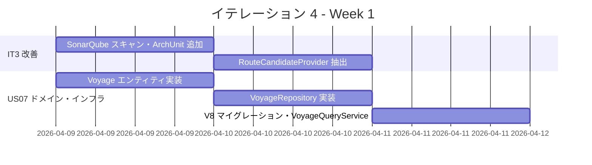
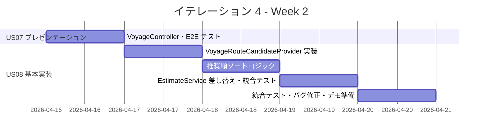
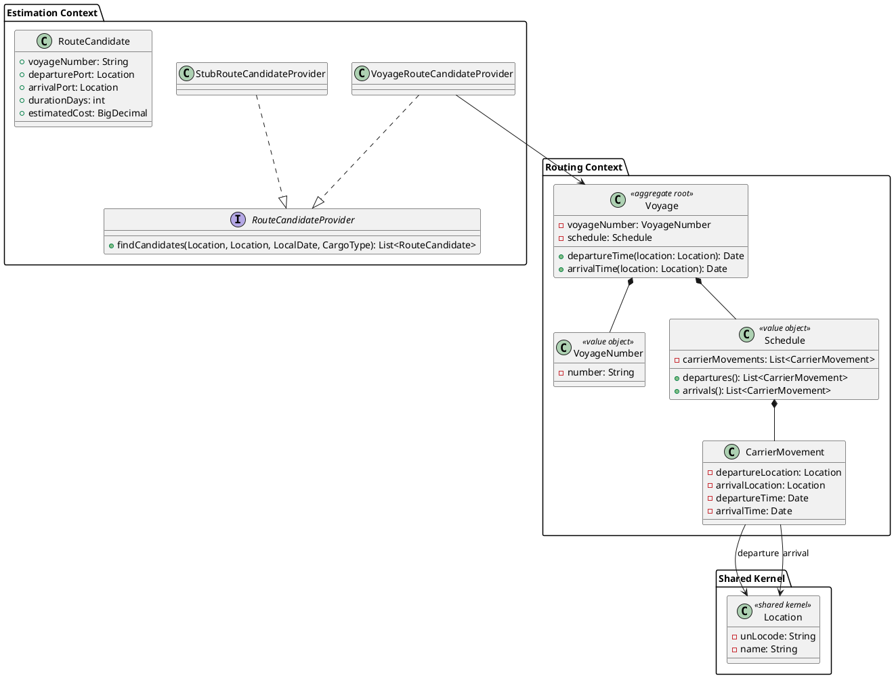
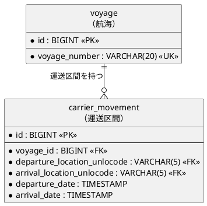
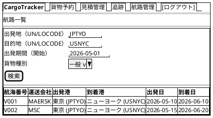
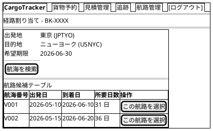
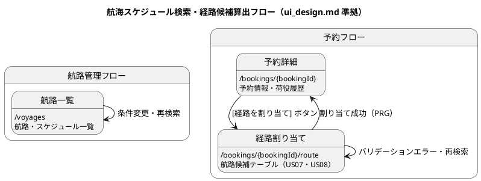

# イテレーション 4 計画

## 概要

| 項目 | 内容 |
|------|------|
| **イテレーション** | 4 |
| **期間** | Week 7-8（2026-04-09 〜 2026-04-22） |
| **ゴール** | 航海スケジュール検索と経路候補算出の基盤を構築し、Estimation コンテキストのスタブを実データ連携に移行する |
| **目標 SP** | 10 |

---

## ゴール

### イテレーション終了時の達成状態

1. **品質基盤の整備**: SonarQube Quality Gate PASS・ArchUnit で Estimation コンテキストのアーキテクチャルールを保護・`RouteCandidateProvider` ポートによる依存性逆転が完成している
2. **US07 完了**: 経路設計者が予約の出発地・目的地・期限をもとに利用可能な航海スケジュールを検索できる
3. **US08 基本実装**: 航海スケジュール検索結果をもとに経路候補が自動算出され、見積作成フォームにスタブではなく実データが連携されている

### 成功基準

- [ ] SonarQube ローカルスキャンを実行し Quality Gate を確認できる
- [ ] ArchUnit テストに Estimation コンテキストのルールが追加されている
- [ ] `RouteCandidateProvider` ポートが抽出され `VoyageRepository` と連携している
- [ ] 航海スケジュール検索画面で条件（出発地・目的地・期間）を入力して検索できる
- [ ] 検索結果に航海番号・運送会社・出発日・到着日・寄港地が表示される
- [ ] 見積作成時にスタブではなく実際の航海データから経路候補が算出される
- [ ] Java テスト全パス・E2E テスト全パス

---

## ユーザーストーリー

### 対象ストーリー

| ID | ユーザーストーリー | SP | 優先度 |
|----|-------------------|----|--------|
| IT3-改善 | IT3 申し送り改善（SonarQube・ポート抽出・ArchUnit） | 2 | 必須 |
| US07 | 航海スケジュールを検索する | 5 | 必須 |
| US08 | 経路候補を算出する（基本実装） | 3 | 必須 |
| **合計** | | **10** | |

> **注**: US08 はフルスコープ 8 SP のうち基本実装（直行便・推奨順算出）を IT4 で実施し、残り（条件調整・再算出との連携）は IT5 に引き継ぐ。

### ストーリー詳細

#### IT3-改善: IT3 申し送り改善

**内容**:

- SonarQube ローカルスキャン実行・Quality Gate 確認
- `EstimateService.generateStubCandidates` を `RouteCandidateProvider` ポートとして抽出
- ArchUnit テストに Estimation コンテキストのアーキテクチャルールを追加
- `CargoTest` に属性保全（immutable コピーの正確性）検証を追加

#### US07: 航海スケジュールを検索する

**ストーリー**:
> 経路設計者として、予約の出発地・目的地・期限をもとに利用可能な航海スケジュールを検索したい。なぜなら、制約条件を満たす航海を特定し、経路候補算出の入力を準備できるからだ。

**受入条件**:

1. 予約番号を指定して出発地・目的地・期限・貨物仕様を確認できる
2. 検索条件（出発地・目的地・出発期間・貨物種別）を入力して検索できる
3. 制約条件（航海スケジュール・寄港地接続・港湾制約・貨物種別対応）に基づいて利用可能な航海が表示される
4. 航海スケジュール一覧に航海番号・運送会社・出発日・到着日・寄港地が表示される
5. 条件を満たす航海がない場合、その旨が表示され条件を緩和して再検索できる
6. 危険物・冷凍貨物の場合、対応可能な航海のみに絞り込まれる
7. 出発地・目的地は UN/LOCODE 形式で指定できる

#### US08: 経路候補を算出する（基本実装）

**ストーリー**:
> 経路設計者として、航海スケジュール検索結果をもとに、制約条件を考慮した経路候補を自動算出してほしい。なぜなら、手作業の属人化を解消し、最適経路を効率的に見つけられるからだ。

**受入条件（IT4 スコープ）**:

1. 航海スケジュール検索結果と出発地・目的地・期限を入力として経路候補が自動算出される
2. 経路候補ごとに所要日数・経由港・費用・航海番号が表示される
3. 経路候補が推奨順（直行便優先・所要日数昇順）に並べられて提示される
4. 見積作成フォームでスタブではなく実際の航海データから候補が算出される

---

## タスク

### 1. IT3 申し送り改善（2 SP）

| # | タスク | 見積もり | 担当 | 状態 |
|---|--------|---------|------|------|
| 1.1 | SonarQube ローカルスキャン実行・Quality Gate 確認・指摘対応 | 2h | - | [ ] |
| 1.2 | `RouteCandidateProvider` ポートインターフェース抽出と `StubRouteCandidateProvider` 実装 | 3h | - | [ ] |
| 1.3 | ArchUnit テストに Estimation コンテキストのアーキテクチャルール追加 | 2h | - | [ ] |
| 1.4 | `CargoTest` に immutable コピーの属性保全検証を追加 | 1h | - | [ ] |

**小計**: 8h（理想時間）

### 2. US07: 航海スケジュールを検索する（5 SP）

| # | タスク | 見積もり | 担当 | 状態 |
|---|--------|---------|------|------|
| 2.1 | `Voyage` エンティティ・`VoyageNumber` / `CargoType` 対応フィールド設計と実装 | 4h | - | [ ] |
| 2.2 | `VoyageRepository` インターフェースと `MyBatisVoyageRepository` 実装 | 4h | - | [ ] |
| 2.3 | V8 DB マイグレーション（`voyage` テーブル作成・テストデータ投入） | 2h | - | [ ] |
| 2.4 | `VoyageQueryService` 実装（出発地・目的地・期間・貨物種別フィルタ） | 4h | - | [ ] |
| 2.5 | 航海スケジュール検索画面（検索フォーム・一覧）Thymeleaf テンプレート作成 | 3h | - | [ ] |
| 2.6 | `VoyageController` 実装・ユニットテスト・E2E テスト作成 | 3h | - | [ ] |

**小計**: 20h（理想時間）

### 3. US08: 経路候補を算出する・基本実装（3 SP）

| # | タスク | 見積もり | 担当 | 状態 |
|---|--------|---------|------|------|
| 3.1 | `VoyageRouteCandidateProvider` 実装（`RouteCandidateProvider` ポートを `VoyageRepository` で実装） | 4h | - | [ ] |
| 3.2 | 直行便優先・推奨順ソートロジックの実装 | 3h | - | [ ] |
| 3.3 | `EstimateService` をスタブから `VoyageRouteCandidateProvider` に差し替え・統合テスト更新 | 3h | - | [ ] |

**小計**: 10h（理想時間）

### タスク合計

| カテゴリ | SP | 理想時間 | 状態 |
|---------|----|---------|------|
| IT3 申し送り改善 | 2 | 8h | [ ] |
| US07: 航海スケジュールを検索する | 5 | 20h | [ ] |
| US08: 経路候補を算出する（基本実装） | 3 | 10h | [ ] |
| **合計** | **10** | **38h** | |

**1 SP あたり**: 約 3.8h（IT3 実績: 4.3h）
**進捗率**: 0% (0/10 SP)

---

## スケジュール

### Week 1（Day 1-5）



| 日 | タスク |
|----|--------|
| Day 1 | IT3 改善: SonarQube スキャン実行、ArchUnit ルール追加 |
| Day 2 | IT3 改善: RouteCandidateProvider 抽出、US07: Voyage エンティティ実装 |
| Day 3 | US07: VoyageRepository 実装、V8 マイグレーション作成 |
| Day 4 | US07: VoyageQueryService 実装（検索ロジック） |
| Day 5 | US07: 検索画面 Thymeleaf テンプレート作成 |

### Week 2（Day 6-10）



| 日 | タスク |
|----|--------|
| Day 6 | US07: VoyageController 実装・E2E テスト作成 |
| Day 7 | US08: VoyageRouteCandidateProvider 実装 |
| Day 8 | US08: 直行便優先・推奨順ソートロジック実装 |
| Day 9 | US08: EstimateService を実データ連携に差し替え・統合テスト更新 |
| Day 10 | 統合テスト全パス確認・バグ修正・デモ準備 |

---

## 設計

### ドメインモデル

> **注**: `domain-model.md` Section 3「Routing Context」の構造に準拠。`Voyage` は `Schedule`（値オブジェクト）を介して `CarrierMovement`（エンティティ）を保持する。



### データモデル

> **注**: `data-model.md` Section「Routing Context」に準拠。`voyage`（1 件: VoyageNumber のみ）と `carrier_movement`（N 件: 出発地・到着地・日時）の 2 テーブル構成。PK は `id`（BIGSERIAL）、業務キーは `voyage_number`（UK）。



### ユーザーインターフェース

#### 航路一覧・検索画面（`/voyages`）

> **注**: `ui_design.md` の画面一覧では `/voyages` が「航路・スケジュール一覧」として定義済み。経路設計者が事前に航海スケジュールを確認する画面として実装する。



#### 経路割り当て画面（`/bookings/{bookingId}/route`）

> **注**: `ui_design.md` の画面一覧で US07・US08 が対応付けられている画面。予約詳細から「経路を割り当て」ボタンで遷移する。



#### 画面遷移



### ディレクトリ構成

```
apps/cargo-tracker/src/main/java/com/example/cargotracker/
└── routing/
    ├── domain/
    │   ├── model/
    │   │   ├── Voyage.java           ← 集約ルート（voyageNumber + schedule のみ）
    │   │   ├── VoyageNumber.java     ← 値オブジェクト
    │   │   ├── Schedule.java         ← 値オブジェクト（CarrierMovement リスト）
    │   │   └── CarrierMovement.java  ← エンティティ（出発地・到着地・日時）
    │   └── repository/
    │       └── VoyageRepository.java
    ├── application/
    │   └── service/
    │       └── VoyageQueryService.java
    ├── infrastructure/
    │   └── persistence/
    │       └── MyBatisVoyageRepository.java
    └── presentation/
        └── web/
            └── VoyageController.java

apps/cargo-tracker/src/main/java/com/example/cargotracker/
└── estimation/
    └── domain/
        └── service/
            ├── RouteCandidateProvider.java         ← 新規（ポート抽出）
            ├── StubRouteCandidateProvider.java     ← 新規（既存スタブを分離）
            └── VoyageRouteCandidateProvider.java   ← 新規（実データ連携）
```

### API 設計

| メソッド | エンドポイント | 説明 |
|---------|---------------|------|
| GET | `/voyages` | 航路一覧・検索（`ui_design.md` 定義済み画面） |
| GET | `/bookings/{bookingId}/route` | 経路割り当て画面（航海検索・候補表示、US07・US08 対象） |
| POST | `/bookings/{bookingId}/route` | 経路確定（選択した航路を予約に紐付け）|

### データベーススキーマ

> **注**: data-model.md 設計方針に準拠。DB は PostgreSQL（`BIGSERIAL`）、H2 テスト環境では `BIGINT GENERATED BY DEFAULT AS IDENTITY` に読み替え。

```sql
-- V8__create_voyage_tables.sql
CREATE TABLE voyage (
    id         BIGSERIAL PRIMARY KEY,
    voyage_number VARCHAR(20) NOT NULL,
    created_at TIMESTAMP NOT NULL DEFAULT NOW(),
    updated_at TIMESTAMP NOT NULL DEFAULT NOW(),
    CONSTRAINT uk_voyage_number UNIQUE (voyage_number)
);

CREATE TABLE carrier_movement (
    id                          BIGSERIAL PRIMARY KEY,
    voyage_id                   BIGINT NOT NULL REFERENCES voyage(id),
    departure_location_unlocode VARCHAR(5) NOT NULL,
    arrival_location_unlocode   VARCHAR(5) NOT NULL,
    departure_date              TIMESTAMP NOT NULL,
    arrival_date                TIMESTAMP NOT NULL,
    created_at                  TIMESTAMP NOT NULL DEFAULT NOW(),
    updated_at                  TIMESTAMP NOT NULL DEFAULT NOW()
);
```

---

## リスクと対策

| リスク | 影響度 | 対策 |
|--------|--------|------|
| SonarQube Quality Gate が PASS にならない | 高 | 既存の指摘（`refactor: SonarQube 指摘対応` コミット済み）を踏まえ、まず指摘確認・分類してから修正着手 |
| `RouteCandidateProvider` 抽出による既存テストの破壊 | 中 | TDD: ポートインターフェース定義 → スタブ実装への差し替え → テスト全パス確認の順序で進める |
| US08 の経路算出ロジックが複雑化する | 中 | IT4 では直行便 + 1 経由地まで（基本実装）に限定し、複雑な多段接続は IT5 以降に持ち越す |

---

## 完了条件

### Definition of Done

- [ ] コードレビュー完了（`developing-review` 実施）
- [ ] ユニットテスト全パス（Java テスト 184 件 → 200 件以上目安）
- [ ] E2E テスト全パス（41 件 → 46 件以上目安）
- [ ] SonarQube Quality Gate PASS（初回達成）
- [ ] SpotBugs・CheckStyle エラーなし
- [ ] 機能がローカル環境で動作確認済み
- [ ] ドキュメント更新完了（data-model.md・domain-model.md に Routing コンテキスト追加）

### デモ項目

1. SonarQube ダッシュボードで Quality Gate の PASS を確認する
2. 予約詳細画面から「経路設計を開始」→ 航海スケジュール検索画面で JPTYO→USNYC を検索する
3. 検索結果から見積作成画面に遷移し、スタブではなく実データのルート候補が表示されることを確認する

---

## 更新履歴

| 日付 | 更新内容 | 更新者 |
|------|---------|--------|
| 2026-04-09 | 初版作成 | - |

---

## 関連ドキュメント

- [イテレーション 3 ふりかえり](./retrospective-3.md)
- [イテレーション 4 ふりかえり](./retrospective-4.md)
- [リリース計画](./release_plan.md)
