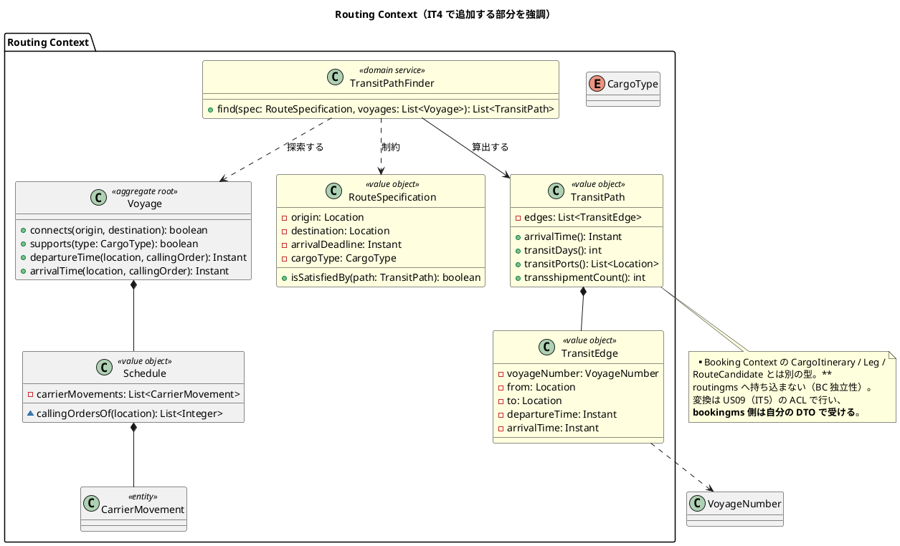
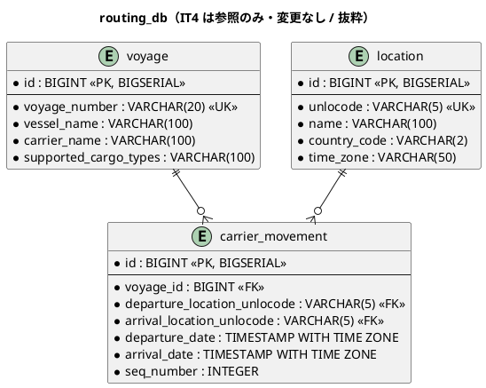
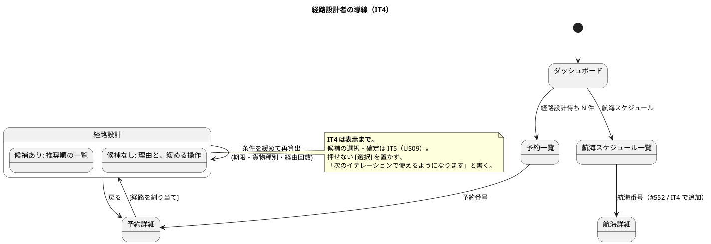

# イテレーション 4 計画

## ゴール

経路設計者が、引き渡された予約に対して**期限内に着く経路の候補を、推奨順に並んだ一覧として受け取れる**状態にします。候補の選択・確定・予約への紐付けは IT5 です。**IT4 では往復が閉じません**。

US08 は本システムで最も複雑なドメイン（グラフ探索 + 制約充足）です。IT3 で `Voyage` 集約と航海スケジュールの入力を揃えたので、IT4 は**その上に探索を載せる**イテレーションになります。

### 成功基準

| # | 基準 | 測り方 |
| :--- | :--- | :--- |
| 1 | 出発地・目的地・期限・貨物種別から**候補が算出される** | 直行 1 本・積み替え 1 回・積み替え 2 回を含む航海データで、期待する候補集合が出ることをドメインの単体テストで |
| 2 | **期限に間に合わない経路が候補に出ない** | 期限ちょうどに着く経路は出る／1 分超過は出ない（境界のデータで検査する。IT3 Try 6） |
| 3 | 経路設計者が**候補一覧を画面で読める** | kind 統合環境で、予約詳細 → 経路設計画面 → 候補一覧までを 1 本通す |
| 4 | **候補が無いときに、次の操作へ進める** | 「期限内に到達可能な経路なし」だけで終わらせず、条件を緩める操作を画面に置く（IT3 Try：気づく手段は次の行動へ繋ぐ） |
| 5 | 往復航海で**集約と SQL の答えが一致する** | `connects()` が復路（LAX → TOKYO）で true を返す。壊すと赤になる形で |

## 局面とアプローチ

**中盤（2 本目）／インサイドアウト**（[開発戦略](development_strategy.md#中盤-インサイドアウトit3it7--release-0210-前半)）。

[開発戦略](development_strategy.md)は US08 について「UI から書き始めると制約ロジックがサービス層に漏れて貧血モデル化するため、`Voyage` 集約と経路算出ドメインサービスの単体テストから始める」と定めています。IT4 はこの順序を守り、**探索と制約が全部ドメインの単体テストで固まってから**、API と画面を載せます。

> **IT3 との違い**: IT3 は新しいサービスの立ち上げでした。IT4 は既存サービス（routingms）への追加なので、立ち上げ分の上乗せはありません。**それでも 1 SP あたりの見積もりは IT3 より重くしています**（[見積もり合計](#見積もり合計)）。US08 はグラフ探索と制約充足を含み、設計ドキュメントの欠落も最も多いためです。

## 対象ユーザーストーリー

| ID | ユーザーストーリー | SP | 優先度 | Issue |
| :--- | :--- | :--- | :--- | :--- |
| US08 | 経路候補を算出する | 8 | 高 | [#525](https://github.com/k2works/case-study-cargo-tracker/issues/525) |
| **合計** | | **8** | | |

## 受入条件

`docs/requirements/user_story.md` の該当節を正典とします（書き写さず引用します）。

- [US08 の受け入れ基準](../requirements/user_story.md#us08-経路候補を算出する)

### 受入基準のうち IT4 では満たせないもの

| 受入基準 | 依存先 | 扱い |
| :--- | :--- | :--- |
| 「経路候補ごとに**費用**が表示される」 | 料金体系は US21（IT11）。運賃表も港湾利用料のマスタも存在しない | **概算を出す。根拠は画面に明記する**（[UC06](../requirements/system_usecase.md) の「基本輸送料金 + 港湾利用料の概算」）。算出式は ADR-018 に固定し、US21 で実料金に差し替える。**「費用が出る」とは書くが「正しい料金」とは書かない** |
| 「制約条件を考慮した」のうち**港湾制約** | モデルが設計に無い（[ui_design.md](../design/ui_design.md) が「US08 で必要性ごと判断する」と先送り） | **IT4 で「持たない」と決める**（ADR-018 の決定 3）。判断を先送りし続けると、US28 の再設計でまた同じ議論になる |
| 候補の**選択・確定・予約への紐付け** | US09・US11（IT5） | IT4 は**一覧の表示まで**。画面に選択の操作を出さず、「候補の確定は次のイテレーションで使えるようになります」と明示する（押せないボタンを置かない） |

## 設計への反映が必要な点（着手前に検出）

US08 は**設計ドキュメントの欠落が最も多いストーリー**です。正典に無いものを実装で先に作ると、設計と実装が黙って乖離します。以下は**当該タスクと同じ変更で反映**します。反映先には[開発戦略](development_strategy.md)の定める正典 3 点（ADR・設計ドキュメント・該当 plan）を含めます。

| # | 内容 | 反映先 | 対応タスク |
| :--- | :--- | :--- | :--- |
| 1 | **routingms に経路候補を表す型が無い**。`TransitPath` / `TransitEdge` は `architecture_backend.md` にしか登場せず、`domain-model.md` の Routing Context に無い。Booking Context の `CargoItinerary` / `Leg` / `RouteCandidate` は**別 BC の型**であり、routingms に持ち込まない | `domain-model.md` の Routing Context（**図・要素表の両方**） | 1.1 |
| 2 | **経路算出ドメインサービスが設計に無い**。開発戦略は概念として言及するだけで、クラス名はどこにも無い。`TransitPathFinder` として載せる | `domain-model.md`（**図・要素表の両方**） | 1.2 |
| 3 | **`RouteSpecification` は正典が「Booking Context の型」と断定している**（`domain-model.md` のユビキタス言語表）。routingms に同名型を注記なく作ると正典と正面から矛盾する。IT3 の `CargoType` と同じく **BC 固有の同名別型として要素表に対比を書く**。**改名（例: `RouteSearchSpecification`）の採否も 1.2 で決める**（IT5 の ACL は変換の両端が同じ名前になり、最も混同しやすい形） | `domain-model.md` のユビキタス言語表・Routing Context の図・要素表 | 1.2 |
| 4 | **新規 4 型の日本語名が決まっていない**。`domain-model.md` の要素表は全 BC で日本語名列が必須。決めずに着手すると実装者がその場で決める（IT3 は `CargoType` = 「対応貨物種別」を計画時に決めた）。案: `TransitPath` = 経路候補、`TransitEdge` = 経路区間、`TransitPathFinder` = 経路候補算出、`RouteSpecification`（Routing） = 経路探索条件 | `domain-model.md` の要素表 | 1.1・1.2 |
| 5 | **`Schedule` の公開シグネチャを変える**（`callingOrderOf` → `callingOrdersOf`、`departureTime` / `arrivalTime` に寄港を指定する引数）。正典の `Schedule` は `departures()` / `arrivals()` / `origin()` / `destination()` しか持たない | `domain-model.md` の Routing Context（図・要素表） | 0.1 |
| 6 | **複数候補を返す API 契約が無い**。`GET /api/v1/routes/optimal` は**単数の最適経路**を返す形で、所要日数・費用・経由港のフィールドも `cargoType` パラメータも無い。US08 の「推奨順に並べられて提示される」を満たせない | `architecture_backend.md` の API 一覧・ACL 実装例、ADR-017 | 3.1 |
| 7 | **推奨順の規則・費用の概算式・港湾制約の要否が設計に無い** | ADR-018、`domain-model.md` のビジネスルール、`ui_design.md` / `system_usecase.md` / `requirements_definition.md` の「US08 で判断する」記述 | 1.3 |
| 8 | **経路候補を永続化するテーブルが無い**。`booking_db.route_candidate` は `estimate_id` 必須で、US08 の候補を入れる場所ではない。都度算出とするなら明文が要る | ADR-017、`data-model.md` の `routing_db` に注記 | 3.1 |
| 9 | **`/routing/design/:bookingId` の画面詳細設計が無い**。加えて既存の画面遷移図は経路設計を「候補**選択**・割り当て」「割り当て成功 → 予約詳細」と定義しており、**IT4 の範囲（表示まで）と食い違う** | `ui_design.md` の画面詳細設計・画面一覧・画面遷移図・「take-7 で定義済みの画面」表 | 4.1 |
| 10 | **ナビゲーション表の `/routing/design` と画面一覧の `/routing/design/:bookingId` が食い違う**。実装する画面は `:bookingId` 付きなので、サイドバー項目を `available: true` にすると**死んだ URL へ飛ぶ** | `ui_design.md` のナビゲーション表、`navigation.ts` | 4.2 |
| 11 | **航海詳細画面が正典に一切無い**（画面一覧・権限マトリクス・画面遷移図・「定義済みの画面」表・ナビゲーション表・`architecture_backend.md` の API 一覧のいずれにも無い。単一航海を返す GET は実装済みだが正典未反映）。**SP 対象外のタスクなので DoD の「画面を追加した US」から読み落とされやすい** | `ui_design.md`（画面一覧・画面詳細設計・定義済み画面表）、`architecture_backend.md` の API 一覧 | 0.6 |
| 12 | **`ui_design.md` に「一覧規約 / 入力規約 / 表示規約」の節が存在しない**。IT2・IT3 のふりかえりが繰り返しそこを反映先に指定しているのに、実体が無い。**反映先の無い Try は反映されない** | `ui_design.md`（節を新設し、IT2・IT3 の Try 8・9・10 を移す） | 0.7 |
| 13 | **`RoutingStatus` の定義が 4 箇所で食い違う**（`domain-model.md` の 2 行 + ユビキタス言語表 + Booking の PlantUML enum）。ADR-015 が正。`MISROUTED` は US28 で使うので、**`ROUTING_REQUESTED` を足した上で統合する** | `domain-model.md`（4 箇所） | 0.7 |
| 14 | **UC / BUC の番号衝突**。`system_usecase.md` の UC06 と `requirements_definition.md` の UC_R03 が同じ業務を別番号で指し、さらに **BUC09 が 2 文書で別の業務を指している**（一方は経路候補算出、他方は追跡情報確認）。別番号ではなく番号の衝突なので危険度が高い | `requirements_definition.md` の対応表 | 0.7 |
| 15 | **`docs/adr/index.md` は ADR 一覧の正典**。ADR-016・017・018 を起こしたら同じ変更で行を足す | `docs/adr/index.md` | 1.3・3.1 |
| 16 | **「認可は入力検証より先に置く」が ADR に落ちていない**。ADR-004 はロール認可、ADR-007 はヘッダ必須と登録検査で、順序には触れていない。IT3 は文章だけで守り、bookingms 側は順序を戻しても全緑だった（**文章は半分しか守らないことが実証済み**） | ADR（決定として起こす）、両サービスの検査 | 0.2 |

## 設計

### ドメインモデル図（IT4 スコープ）

> **`RouteSpecification` は Booking Context にも同名の値オブジェクトがあります**。しかも意味の差は `CargoType` より大きく、Booking 側は `Cargo` に永続化される輸送要件、Routing 側は都度の探索条件です。**日本語名を変えて要素表で意味差を明文化し、改名の採否も 1.2 で決めます**（設計反映 #3・#4）。共有カーネルへは引き上げません（`SharedKernelScopeTest` が範囲を固定しており、`com.example.routingms..` に置く限り抵触しません）。

### 状態遷移図（IT4 スコープ）

**IT4 では状態を追加しません。** 経路候補は集約ではなく算出結果（値オブジェクト）であり、寿命を持たないためです。予約側の `RoutingStatus` は `ROUTING_REQUESTED` のまま変わりません（`ROUTED` への遷移は US11 / IT5）。よって本 IT の状態遷移図は省略します。

### ER 図（IT4 スコープ）

**IT4 ではテーブルを追加・変更しません。** 経路候補は都度算出し、永続化しません（ADR-017 の決定 2）。以下は IT4 が読む 3 テーブルの抜粋で、正確な型・監査カラムは [data-model.md](../design/data-model.md) の `routing_db` を正典とします。

> **探索対象の航海をどう絞るか**は性能に直結します。全航海をメモリに載せてから探索すると航海が増えたときに破綻し、SQL で絞りすぎると集約の判定と食い違います（IT3 で `callingOrderOf` が実際にそうなりました）。**IT4 は「出発地・目的地のいずれかに寄港し、貨物種別に対応し、期限より前に出発する航海」を SQL で絞り、接続と順序の判定は集約で行います**。判定は本番と検査で共有します（テスト側に書き直しません）。

### 画面遷移図（IT4 スコープ）

> ボタンの文言は正典（`ui_design.md` の画面遷移図）の **[経路を割り当て]** に合わせています。変える場合は 4.1 で正典ごと変えます。

## タスク

### 0. 返済枠と設計反映（IT3 からの引き継ぎ・SP 対象外）

「余力次第」にすると毎 IT 繰り越されて固定化します（[完了報告書の残作業](iteration_report-3.md#課題と残作業)のうち、**着手条件が IT4 に来ているもの**。番号は完了報告書側の体系です）。**Day 1-2 に独立して着手**します。

| # | タスク | 見積 | 状態 |
| :--- | :--- | :--- | :--- |
| 0.1 | **`Schedule` の往復航海対応**（残作業 2・US08 の着手条件）。`callingOrderOf` を `callingOrdersOf`（全出現位置）に改め、`connects()` を「出発の出現位置より後に到着の出現位置があるか」で判定する。`departureTime` / `arrivalTime` も `findFirst` のままなので、**どの寄港を指すかを引数で決める**。TOKYO → LAX → TOKYO の復路で検査する。**シグネチャの変更を `domain-model.md` に反映する**（設計反映 #5） | 5h | [x] |
| 0.2 | **予約詳細を `ROLE_ROUTING` に対して引き渡し済みへ限定する**（[#554](https://github.com/k2works/case-study-cargo-tracker/issues/554)）。一覧の制限を予約番号の列挙で迂回できる。[ADR-015](../adr/015-routing-requested-state.md) の決定は文言上**一覧しか射程に入れていない**ので、**射程を「経路設計者に開く予約（一覧・詳細）」へ広げる追記を行い、同じ変更で詳細側の検査を足す**。あわせて **「認可は入力検証より先」を ADR の決定として起こし、bookingms・routingms の両方で順序を戻すと赤になる検査を置く**（設計反映 #16） | 4h | [x] |
| 0.3 | **`AuthenticatedUserFilter` の登録検査を実効にする**（残作業 6）。`AuthenticatedUserFilterRegistrationTest` がソースの正規表現一致にとどまり、**公開パスを広げても緑**。実際に登録された `FilterRegistrationBean` の URL パターンと有効状態を Spring のコンテキストから読む形に変える。**壊して赤を確認する** | 4h | [x] |
| 0.4 | **`AuthenticatedUserFilter` が渡す属性の扱いを決める**（残作業 7）。本番コードが誰も読んでいない。US08 の API が経路設計者を識別するので、**ここで読み手を作るか、渡すのをやめるか**を決める。使わないものを渡し続けない | 2h | [x] |
| 0.5 | **US06 の E2E 2 本を繋ぐ**（残作業 9）。引き渡した予約が経路設計者の一覧に出るところまでを 1 本で通す。IT4 はその一覧から経路設計画面へ進むので、**繋がっていないと US08 の E2E も途中から始まる** | 3h | [ ] |
| 0.6 | **航海詳細画面**（[#552](https://github.com/k2works/case-study-cargo-tracker/issues/552)・着手条件「US08 の前」）。候補に出た航海の寄港地と区間ごとの時刻を確認できないと、経路設計者は候補の妥当性を判断できない。`/routing/voyages/:voyageNumber`（単一航海を返す GET は実装済み）。**正典が空なので先に書く**（設計反映 #11）: `ui_design.md` の画面一覧・画面詳細設計・定義済み画面表、`architecture_backend.md` の API 一覧、ナビゲーション 4 点（一覧からの遷移で足りるならその判断を明記する）、到達性テスト | 7h | [ ] |
| 0.7 | **設計ドキュメントの矛盾・欠落を直す**（設計反映 #12・#13・#14）。`ui_design.md` に「一覧規約 / 入力規約 / 表示規約」の節を新設し IT2・IT3 の Try を移す、`RoutingStatus` の 4 箇所を ADR-015 に合わせて統合する（`MISROUTED` は残し `ROUTING_REQUESTED` を足す）、UC / BUC の番号衝突に決着をつける。**反映先が無いと Try は反映されない** | 5h | [x] |
| 0.8 | **ADR-014 に改称（`UPDATE`）の検査を足す**（残作業 12・[ADR-014](../adr/014-location-replica-sync.md)）。決定は「同じ INSERT」と「テーブルの形も同じ」の 2 つだが検査は種データしか見ておらず、**列だけ足す `ALTER` が素通り**する。ADR は決定の数だけ検査を用意する（IT3 Try 7） | 3h | [x] |
| **小計** | | **33h** | |

### 1. US08 Phase 1: 経路探索のドメイン（4 SP）

**画面もサービス層も書きません。** ここが終わるまで上に進まないのが中盤の規律です。

| # | タスク | 見積 | 状態 |
| :--- | :--- | :--- | :--- |
| 1.1 | `TransitEdge` / `TransitPath` を単体テストで構築（設計反映 #1・#4）。**`edges[n].to == edges[n+1].from` の連結制約**、**前の到着 ≤ 次の出発**（積み替えに要する時間の下限を業務判断として決める）、輸送日数・経由港・積み替え回数の導出。**`domain-model.md` の図と要素表の両方に、日本語名つきで追加する** | 8h | [x] |
| 1.2 | `RouteSpecification`（Routing 版）と `TransitPathFinder` を単体テストで構築（設計反映 #2・#3・#4）。**直行 1 本・積み替え 1 回・積み替え 2 回**を含む航海データを組み、期待する候補集合が出ることを検査する。**探索の打ち切り（積み替え回数の上限）を決めて明文化する**（上限が無いと循環で止まらない）。**任意の出発地（貨物の現在地を含む）を起点にできる**ことを前提に設計する（`domain-model.md` のビジネスルール 5・US28）。**候補集合の比較は `TransitPath` を丸ごと 1 つの表現で行う**（区間・属性ごとの比較を積み上げない。IT3 Try 1）。`domain-model.md` の図・要素表・ユビキタス言語表に反映し、**改名の採否をここで決める** | 12h | [x] |
| 1.3 | **推奨順・費用の概算・港湾制約を決めて ADR-018 に落とし、同じ変更で反映する**（設計反映 #7・#15）。**決定は 4 つ**: ①直行が最優先、以降は到着の早い順・積み替えの少ない順 ②費用は「基本輸送料金 + 港湾利用料の概算」 ③**港湾制約は持たない** ④積み替えには最低 6 時間を要する。①②④は検査に落とす。③は否定の決定なので、`ui_design.md` / `system_usecase.md` / `requirements_definition.md` の「US08 で判断する」記述を決定済みに書き換える。`domain-model.md` のビジネスルールと `docs/adr/index.md` にも反映する | 7h | [x] |
| 1.4 | **期限の境界を、境界のデータで検査する**（IT3 Try 6）。期限ちょうどに着く経路は候補に**出る**、1 分超過は**出ない**。どちらが正かを業務判断として決めてから書く。**反転させて赤になることを確認する** | 4h | [x] |
| **小計** | | **31h** | |

### 2. US08 Phase 2: 探索対象の絞り込み（1 SP）

| # | タスク | 見積 | 状態 |
| :--- | :--- | :--- | :--- |
| 2.1 | `VoyageRepository` に探索対象を引く操作を追加し、Mapper と方言スモークを通す。**判定は本番と検査で共有する**（IT2 Try 13）。SQL の絞り込みが集約の判定より広いことを検査で固定する（狭いと候補が落ちる） | 5h | [x] |
| 2.2 | **SQL と集約の答えが一致することを、往復航海のデータで検査する**（0.1 の裏返し）。IT3 はここが食い違ったまま緑だった | 3h | [x] |
| **小計** | | **8h** | |

### 3. US08 Phase 3-4: ユースケースと API（1 SP）

| # | タスク | 見積 | 状態 |
| :--- | :--- | :--- | :--- |
| 3.1 | **API 契約を決めて ADR-017 に落とす**（設計反映 #6・#8・#15）。**決定は 3 つ**: ①`GET /api/v1/routes/optimal`（単数）を**複数候補を推奨順に返す形へ改め、`cargoType` を受け取る** ②**候補は永続化しない** ③**到着期限は日付で受け取り、業務タイムゾーンの当日終わりまでとする**。①はレスポンス契約テスト、②は `routing_db` のテーブル集合を固定する検査（新テーブルで赤）に落とす。**`origin` に任意の地点（貨物の現在地）を指定できる性質を新契約でも保つ**（US28）。**ACL は bookingms 固有の DTO で受け、`TransitPath` を型名ごと持ち込まない**（現状の `architecture_backend.md` の実装例は直接デシリアライズしており、BC 独立性が既に漏れている）。`architecture_backend.md` の API 一覧・ACL 実装例、`data-model.md` の注記、`docs/adr/index.md` を同じ変更で更新する。**設計図の向きを変えたら ADR** | 6h | [x] |
| 3.2 | `FindRouteCandidatesUseCase` と `RouteController` を実装。**認可を入力検証より先に置く**（0.2 で ADR に落とした決定）。候補 0 件は 200 + 空配列 + 理由（404 にしない。「無い」は正常な結果） | 6h | [x] |
| 3.3 | **画面が送る値の型を、サーバが受け取る型と突き合わせる**（IT3 Try 4）。期限は日付か日時か、タイムゾーンをどちらが決めるかを 1 度確かめる。**モックを本物より甘くしない**（IT3 Try 3。日付を送り日時で受ける食い違いが実バックエンドでだけ落ちた） | 3h | [x] |
| **小計** | | **15h** | |

### 4. US08 Phase 5: 経路設計画面（2 SP）

| # | タスク | 見積 | 状態 |
| :--- | :--- | :--- | :--- |
| 4.1 | **`ui_design.md` に `/routing/design/:bookingId` の画面詳細設計を書く**（設計反映 #9）。候補一覧の列（航海番号・経由港・輸送日数・到着日時・費用の概算）、既定の並び、上限、空結果の表示。**既定の並びを「経路設計者が朝いちばんに開いたとき」で確かめる**（出港済み・期限切れの航海を含む候補が先頭に来ない。IT3 Try 8）。画面一覧・画面遷移図に**「選択・確定は US09（IT5）」の注記**を入れる。**書いてから実装する** | 5h | [ ] |
| 4.2 | 経路設計画面を実装。予約詳細から遷移し、予約の出発地・目的地・期限・貨物種別を引き継いで開く（**空のフォームを出さない**。IT3 Try 9）。**[経路を割り当て] の表示は集約の述語をそのまま呼んで出し分ける**（`ROUTING_REQUESTED` の予約からだけ行ける）。**ナビゲーション 4 点をすべて触る**（設計反映 #10）: `ui_design.md` のナビゲーション表・`navigation.ts`・`dashboard-panels.ts`・到達性テスト。**サイドバーの `/routing/design` は `:bookingId` を持たないので、入口にするか、メニューから外して予約詳細のみを入口とするかをここで決め、決めた側を正典に反映する**（ダッシュボードに入口を置かない場合は、その理由をコード上のコメントと到達性テストの免除一覧に残す） | 9h | [ ] |
| 4.3 | **利用者の言葉と時刻で出す**（IT3 Try 10）。日時は業務タイムゾーン、貨物種別は日本語、港は UN/LOCODE ではなく港名（コードは併記）。**費用は概算であることを画面に書く** | 3h | [ ] |
| 4.4 | **候補が無いときに次の操作へ繋ぐ**（成功基準 4）。「どの条件が強く効いているか」を示し、期限・貨物種別・積み替え回数の上限を緩める操作を置く。**通知するだけで終わらせない**。**あわせて、これが US10（経路条件調整）のバッファ判断で言う「代替手段が画面上に実在するか」の判定になる**（[リリース計画](release_plan.md)）。実在すると判定できたかを完了報告書に記録する | 4h | [ ] |
| 4.5 | E2E：予約一覧 → 予約詳細 → 経路設計 → 候補一覧を 1 本で通す（0.5 で繋いだ US06 の E2E に接続する）。**日時は業務タイムゾーンの共有ヘルパで作る**（`toISOString()` は CI で落ちる） | 4h | [ ] |
| **小計** | | **25h** | |

### 5. ユーザーマニュアル（SP 対象外）

画面を伴う IT なので、計画段階で枠を取ります。

| # | タスク | 見積 | 状態 |
| :--- | :--- | :--- | :--- |
| 5.1 | `06-経路設計.md` を新設（候補の読み方・費用が概算であること・候補が無いときにどうするか）。`05-航海スケジュール.md` に航海詳細の節を追加（0.6） | 4h | [ ] |
| 5.2 | `01-業務フロー.md` の対応表を更新し、キャプチャを再生成して `manual:build` で HTML を目視 | 3h | [ ] |
| 5.3 | **実装から画面に出るメッセージを機械的に洗い出し、表に無いものを潰す**（IT3 Try 11。IT3 では 6 件漏れていた） | 2h | [ ] |
| **小計** | | **9h** | |

### 見積もり合計

| 区分 | 見積 |
| :--- | :--- |
| 0. 返済枠・設計反映 | 33h |
| 1. Phase 1 ドメイン（4 SP） | 31h |
| 2. Phase 2 絞り込み（1 SP） | 8h |
| 3. Phase 3-4 API（1 SP） | 15h |
| 4. Phase 5 画面（2 SP） | 25h |
| 5. マニュアル | 9h |
| **合計** | **121h** |

> ストーリー分は 8 SP / 79h = **1 SP あたり 9.9h** で、IT3（6.9h）より重く見積もっています。US08 はグラフ探索と制約充足を含み、リリース計画のスケジュールリスクでも「1 イテレーションに収まらない」が高影響で挙がっているためです。**返済枠 33h は IT3 の 20h から増えています**（着手条件が IT4 に集まり、設計ドキュメントの欠落が 16 件あるため）。落とし代は 4.4 と 0.6 の順で、**Phase 1 は削りません**（ここを削ると貧血モデルになり IT5 で作り直しになります）。

## スケジュール

### Week 1（Day 1-5）

| Day | 作業 | 局面 |
| :--- | :--- | :--- |
| Day 1 | **着手前の整合性検証**（`validating-iteration-plan` / `validating-design` の指摘反映を確認）、0.1 `Schedule` 往復対応、0.7 設計ドキュメントの矛盾解消 | 返済枠 |
| Day 2 | 0.2 予約詳細の限定 + 認可順序の ADR、0.3 フィルタ登録検査、0.4 属性の扱い、0.8 ADR-014 の検査 | 返済枠 |
| Day 3 | 1.1 `TransitEdge` / `TransitPath` | Phase 1 |
| Day 4 | 1.2 `TransitPathFinder`（着手） | Phase 1 |
| Day 5 | 1.2 完了、1.3 ADR-018（推奨順・費用・港湾制約） | Phase 1 |

### Week 2（Day 6-10）

| Day | 作業 | 局面 |
| :--- | :--- | :--- |
| Day 6 | 1.4 期限の境界、2.1 絞り込みクエリ + 方言スモーク | Phase 1-2 |
| Day 7 | 2.2 SQL と集約の一致、3.1 ADR-017（API 契約）、3.2 API | Phase 2-4 |
| Day 8 | 3.3 型の突き合わせ、4.1 画面詳細設計、4.2 画面（着手） | Phase 4-5 |
| Day 9 | 4.2 完了、4.3 表示、4.4 候補なしの導線、0.5 US06 の E2E 接続、0.6 航海詳細 | Phase 5 |
| Day 10 | 4.5 E2E、5.1-5.3 マニュアル、クローズ準備（**レビューの指摘は裏を取ってから直す**。IT3 は高優先度 1 件が指摘側の誤りだった） | 仕上げ |

### IT4 で扱わないと決めたこと

| 内容 | 理由 | いつ |
| :--- | :--- | :--- |
| 候補の選択・確定・予約への紐付け | US09・US11。**IT4 は表示まで**（リリース計画のデモの区切り） | IT5 |
| 経路条件の調整と再算出（US10） | 4.4 で「条件を緩める操作」を画面に置くが、**保存された条件の再算出は US10 の本体** | IT5 |
| 港湾制約 | **IT4 で「持たない」と決める**（ADR-018 の決定 3）。先送りしない | 決定する |
| 荷主編集（[#550](https://github.com/k2works/case-study-cargo-tracker/issues/550)）・`MyBatisShipperRepository.save` の分岐・`Shipper.email` の値オブジェクト化（[ADR-012](../adr/012-value-object-granularity.md)） | IT3 計画では「IT4」と書いたが、**US08 単独で実効ベロシティ 8 SP を使い切る**。3 つは着手条件を共有するので分割しない。**「余力次第」にせず IT5 に置く**（落とした負債は育つ） | **IT5（確定）** |
| 荷主一覧・セレクトのページング、荷主詳細 | 上と同じ IT でまとめて作るほうが安い | IT5 |
| 方言スモークの実体検出化（handlingms・trackingms・billingms） | 着手条件は「handlingms がクエリを書くとき」。IT4 は handlingms を触らない | **IT7（US15 荷役・確定）** |
| `UserFacingMessage` の重複解消 | 着手条件は「3 つ目のサービスが必要になったとき」。IT4 では増えない | 条件成立時 |
| 引き渡しの差し戻し | 予約の訂正と同時（[ADR-015](../adr/015-routing-requested-state.md) は却下も再依頼も無いと決めている） | 予約の訂正時 |
| 共用端末の無操作タイムアウト（[#551](https://github.com/k2works/case-study-cargo-tracker/issues/551)） | 認証の変更は影響範囲が広く、US08 と同居させない | 未定（起票済み） |
| 営業側の「まだ引き渡していない予約」に気づく手段（[#553](https://github.com/k2works/case-study-cargo-tracker/issues/553)） | US11（予約確定）と合わせる | IT5 |

## リスク

| # | リスク | 影響 | 対策 |
| :--- | :--- | :--- | :--- |
| 1 | 探索が 1 イテレーションに収まらない（リリース計画のスケジュールリスク） | 高 | Day 5 終了時に 1.2 が終わっていなければ、**積み替えの上限を 1 回に落として範囲を狭める**（上限は 1.2 で明文化する数値なので、狭めても設計は壊れない）。落とし代は 4.4 → 0.6 の順 |
| 2 | 探索が循環で止まらない（往復航海・同一港の再訪） | 高 | 1.2 で打ち切り条件を決めてから実装する。**循環するデータを含むテストを先に置く**（0.1 で往復を扱えるようにするため、循環は現実に起こる） |
| 3 | 全航海をメモリに載せて探索し、航海が増えると破綻する | 中 | 2.1 で SQL の絞り込みを入れる。ただし**絞り込みが集約の判定より狭いと候補が落ちる**ため、広めに引いて集約で判定する |
| 4 | 費用の概算が「正しい料金」と読まれる | 中 | 4.3 で画面に概算であることを書き、ADR-017 に US21 で差し替えると明記する |
| 5 | 設計ドキュメントの欠落が 16 件あり、実装が先行して乖離する | 高 | 各タスクに反映先を紐付けた（上表）。**同じ変更で反映する**。DoD で 16 件の消し込みを確認する |
| 6 | **同名・類似名の型を BC 間で取り違える** | 高 | `RouteSpecification` は両 BC に同名で存在し、`TransitPath` は Booking の `CargoItinerary` に対応する。1.2 で**日本語名を変え、改名の採否を決める**。ArchUnit の BC 分離ルールが越境を検出することを確認する（越境点は ACL ポートのみ）。3.1 で **ACL は bookingms 側の DTO で受ける**ことを契約に書く |

## Definition of Done

- [ ] US08 の受入基準のうち、**IT4 スコープ内のもの**をすべて満たす（スコープ外は上表のとおり）
- [ ] `./gradlew build` が緑（ユニット・統合・ArchUnit・カバレッジ検証）
- [ ] **ドメイン層カバレッジ 90% 以上**を `jacocoTestCoverageVerification` で機械判定（IT4 は Phase 1 に 4 SP を割くドメイン主戦場）
- [ ] **`./gradlew test`（フル）を実行した**（Port 追加・ADR 起票を伴うため、部分実行で済ませない）
- [ ] `TZ=UTC ./gradlew test` が緑
- [ ] フロントエンドの lint・テスト・ビルド・E2E が緑
- [ ] **本番相当ビルドの検査**（`test:e2e:production`）が緑
- [ ] CI が緑（全ジョブ success）
- [ ] SonarQube Quality Gate が **PASS**（両プロジェクト）
- [ ] **追加した検査を壊して赤になることを確認済み**
- [ ] **判定を本番と検査で共有している**（テスト側に判定を書き直していない）
- [ ] **境界の包含を、境界のデータで検査した**（IT3 Try 6）。期限ちょうど・積み替えの前後の到着 = 出発。**反転させて赤になることを確認した**
- [ ] **「丸ごと 1 つの表現で比べた」**（IT3 Try 1）。候補集合・経路の比較を区間や属性ごとに積み上げていない
- [ ] **更新・再算出のシナリオを「変えたい 1 項目だけを変える」形で検査した**（IT3 Try 2）。条件を 1 つだけ緩めて候補が変わることを見る
- [ ] **認可が入力検証より先であることを、bookingms・routingms の双方で検査した**。順序を戻すと両方で赤になる
- [ ] **画面が送る値の型を、サーバが受け取る型と突き合わせた**（IT3 Try 4）。期限の日付／日時を実バックエンドで 1 度確かめた
- [ ] **モックが本物より甘くない**（IT3 Try 3）。型が違う値を比較しているモックを残していない
- [ ] **実環境で見つけた欠陥は、見つかった場所に回帰テストを置いた**（IT3 Try 5）
- [ ] **新しい Mapper について方言スモークが通っている**
- [ ] **ADR-017（決定 3 つ）・ADR-018（決定 4 つ）を起こし、決定の数だけ検査または文書反映を用意した**（IT3 Try 7）。`docs/adr/index.md` にも行を足した
- [ ] **「設計への反映が必要な点」16 件をすべて反映した**（ADR・設計ドキュメント・該当 plan の 3 点）
- [ ] 画面を追加した US について、`ui_design.md` のナビゲーション表・サイドバー実装・ダッシュボード導線・到達性テストの **4 点一致**（**経路設計と航海詳細（0.6）の 2 画面とも**。SP 対象外のタスクを免除しない）
- [ ] **状態軸の到達性を確認した**（`ROUTING_REQUESTED` の予約から経路設計画面へ行ける。それ以外からは行けない。出し分けは集約の述語をそのまま呼ぶ）
- [ ] **業務フロー章の対応表を更新した**
- [ ] ユーザーマニュアルの該当章を執筆し、**キャプチャを再生成し `manual:build` で HTML を作って目視した**
- [ ] **マニュアルの表に無いメッセージを実装から機械的に洗い出して潰した**（IT3 Try 11）
- [ ] **US10 のバッファ判断（代替手段が画面上に実在するか）に決着をつけ、完了報告書に記録した**
- [ ] kind 統合環境で Gateway 経由の動作確認済み（bookingms と routingms を通す）
- [ ] 開発環境（Heroku）へデプロイし、`deploy:dev:health` の全 URL が 200。**加えてその環境で業務を 1 本通した**
- [ ] ドキュメント更新完了（release_plan の進捗・JIG / jig-erd 再生成）

## デモ項目

[開発戦略](development_strategy.md)の定めにより、デモ項目を E2E の受け入れ基準とします。

1. 経路設計者でログインし、ダッシュボードの「経路設計待ち」から予約一覧へ行く
2. 引き渡された予約の詳細を開き、[経路を割り当て] で経路設計画面へ進む
3. 出発地・目的地・期限・貨物種別が予約から引き継がれた状態で、**候補が推奨順に並んで表示される**
4. **直行便が最優先で出ている**ことを確認する
5. 候補の航海番号から航海詳細を開き、寄港地と区間ごとの時刻を確認する
6. 期限を厳しくして再算出し、**候補が無いときの表示と、条件を緩める操作**を確認する
7. **ここまで。** 候補の選択・確定は IT5

## 関連ドキュメント

- [リリース計画](release_plan.md) / [開発戦略](development_strategy.md)
- [IT3 ふりかえり](retrospective-3.md) / [IT3 完了報告書](iteration_report-3.md) / [IT3 レビュー](../review/イテレーション3_review_20260821.md)
- [ユーザーストーリー US08](../requirements/user_story.md#us08-経路候補を算出する) / [UC06](../requirements/system_usecase.md)
- [ドメインモデル](../design/domain-model.md) / [データモデル](../design/data-model.md) / [UI 設計](../design/ui_design.md) / [バックエンドアーキテクチャ](../design/architecture_backend.md)
- [ADR-015 経路設計の依頼状態](../adr/015-routing-requested-state.md)

## 更新履歴

| 日付 | 内容 |
| :--- | :--- |
| 2026-08-21 | 初版作成 |
| 2026-08-21 | 着手前検証を反映: 設計反映を 9 → 16 件（航海詳細画面・`Schedule` シグネチャ・`RouteSpecification` の同名衝突・日本語名・ナビ URL 不一致・ADR index・認可順序の ADR 化）、ADR-017 の決定を 3 つに数え直し、IT3 Try 1・12 を追加、見積もりを 112 → 121h に更新 |
