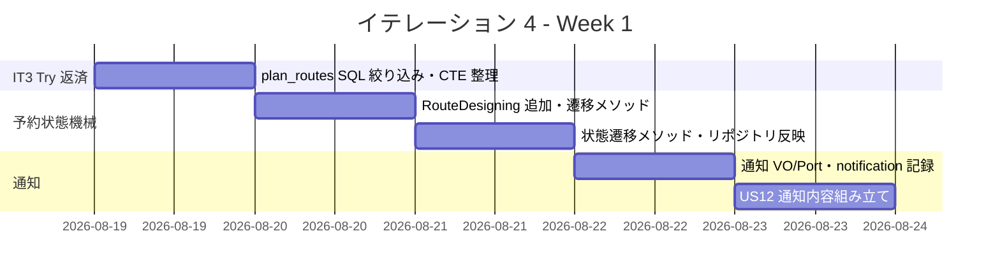
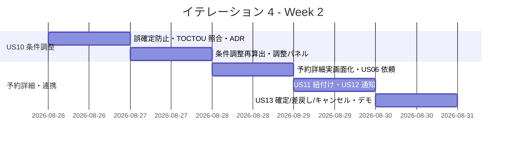
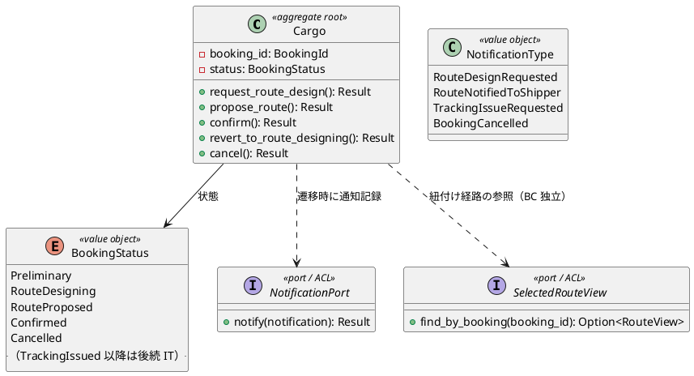
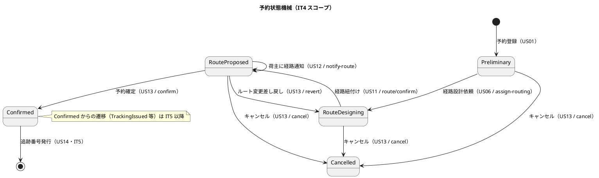
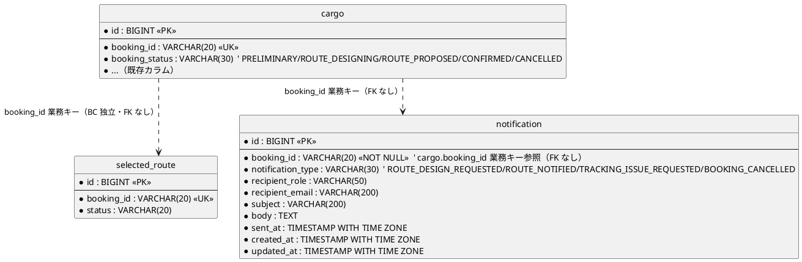
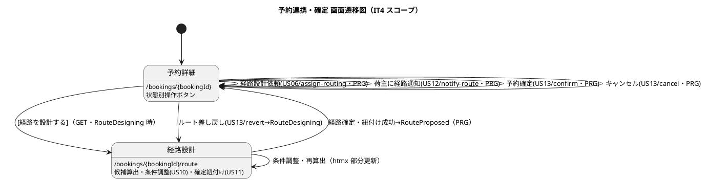

# イテレーション 4 計画

## 概要

| 項目 | 内容 |
|------|------|
| **イテレーション** | 4 |
| **期間** | Week 7-8（2 週間・2026-08-19 〜 2026-09-01） |
| **局面** | 中盤（インサイドアウト） |
| **ゴール** | 予約の状態機械（仮受付 → 経路設計中 → 経路提案中 → 予約確定）を Cargo 集約に構築し、経路設計依頼（US06）・条件調整再算出（US10）・確定経路の予約紐付け（US11）・荷主への経路通知（US12）・予約確定（US13）を予約詳細／経路設計画面で一貫して成立させる |
| **目標 SP** | 14 |

---

## ゴール

### イテレーション終了時の達成状態

1. **予約状態機械の確立**: `domain-booking` の `Cargo` 集約に状態遷移メソッド（`request_route_design`・`propose_route`・`confirm`・`revert_to_route_designing`・`cancel`）をインサイドアウトで実装し、不正な遷移を型・`Result` で拒否する。あわせて欠落している `BookingStatus::RouteDesigning`（経路設計中）を追加する。
2. **経路設計依頼（US06）**: 営業担当者が予約詳細画面で仮受付予約の内容を確認し、経路設計依頼を実行すると予約状態が「経路設計中」に更新され、経路設計者への通知が記録される。
3. **条件調整・再算出（US10）**: 経路設計者が期限内経路が無い場合に条件（期限延長・貨物種別等）を調整して経路候補を再算出できる。あわせて IT3 Try（`plan_routes` の `cargo_type` SQL 絞り込み・期限超過候補の誤確定防止・確定時の候補同一性照合）を返済する。
4. **経路紐付け（US11）**: 確定経路（`selected_route`）を予約に紐付ける操作で予約状態が「経路提案中」に更新される。Routing の確定経路と Booking の状態遷移を BC 独立（ACL/読み取りビュー）を保ったまま連携する。
5. **荷主通知（US12）・予約確定（US13）**: 営業担当者が確定経路の詳細（経由港・所要日数・到着予定日）を荷主に通知（記録）し、予約を確定できる。ルート変更希望時は「経路設計中」への差し戻し、キャンセル希望時はキャンセル遷移と通知記録を行う。

### 成功基準

- [ ] US06・US10・US11・US12・US13 の全受入基準を満たす（受入基準をテストケースに 1:1 対応させ、実証テストのファイル:テスト名まで対応表に明記）
- [ ] `Cargo` 集約の状態遷移メソッドが Red-Green-Refactor で実装され、不正遷移（例: `Preliminary` からの直接確定・確定済みの再確定）が `Result::Err` で拒否される
- [ ] 予約詳細画面（`/bookings/{bookingId}`）が実画面化し、状態別の操作ボタン（経路設計依頼・荷主通知・予約確定・差し戻し・キャンセル）がロール条件付きで表示・動作する
- [ ] 経路設計画面の条件調整パネル（US10）で再算出が動作し、`plan_routes` の全件ロードが `cargo_type` の SQL 絞り込みに置き換わる（IT3 Try #2）
- [ ] 期限超過候補の確定が誤確定防止機構で拒否／明示確認される（IT3 Try #3）、確定時に候補同一性（航海番号列）が照合される（IT3 Try #4）
- [ ] 通知送信記録（`notification`）が US06/US12/US13 で登録され、HTTP フローテストで実証される
- [ ] `cargo clippy --workspace -- -D warnings` と `cargo fmt --check` が全 green・ドメイン層カバレッジ 85% 以上（CI ゲート）

---

## ユーザーストーリー

### 対象ストーリー

| ID | ユーザーストーリー | SP | 優先度 |
|----|-------------------|----|----|
| US06 | 予約情報を経路設計者に引き渡す | 2 | 必須 |
| US10 | 経路条件を調整して再算出する | 5 | 必須 |
| US11 | 経路情報を予約に紐付ける | 2 | 必須 |
| US12 | 確定経路を荷主に通知する | 2 | 必須 |
| US13 | 予約を確定する | 3 | 必須 |
| **合計** | | **14** | |

### ストーリー詳細

#### US06: 予約情報を経路設計者に引き渡す

**ストーリー**:
> 営業担当者として、仮受付された予約の出発地・目的地・期限・貨物仕様を確認し、経路設計者に引き渡したい。なぜなら、経路設計者が正確な情報をもとに最適な経路設計を開始できるからだ。

**受入条件**:

1. 予約番号を指定して予約情報（出発地・目的地・期限・貨物仕様）を確認できる
2. 経路設計依頼を実行すると、予約状態が「経路設計中」に更新される
3. 経路設計者に経路設計依頼の通知が送信（記録）される
4. 予約情報に不備がある場合、修正してから引き渡せる（本 IT では不備時の遷移不可・エラー表示までとする。修正編集フローは US02 の予約更新に委ねる）

#### US10: 経路条件を調整して再算出する

**ストーリー**:
> 経路設計者として、経路候補に最適なものがない場合に、条件（期限・経由地等）を調整して経路候補を再算出したい。なぜなら、条件を柔軟に調整することで実現可能な経路を見つけ、輸送を実現できるからだ。

**受入条件**:

1. 現在の制約条件（期限・経由地制限等）を確認できる
2. 条件を調整（期限延長・貨物種別変更等）して再算出を実行できる
3. 調整後の条件で新たな経路候補が算出・提示される
4. 調整後も条件を満たす経路がない場合、営業担当者に荷主との条件協議を依頼できる（依頼＝通知記録・案内導線）

> **経由地追加の扱い**: 受入基準の「経由地追加」は経路探索アルゴリズムへの経由地強制を要し複雑度が高いため、本 IT では期限延長・貨物種別変更を調整軸とし、経由地追加は後続に切り出す（リスク表参照）。

#### US11: 経路情報を予約に紐付ける

**ストーリー**:
> 経路設計者として、確定した経路情報を貨物予約に紐付けたい。なぜなら、予約と経路の関連を確立し、営業担当者が荷主にルート提案できるようにするからだ。

**受入条件**:

1. 確定経路と予約番号を確認できる
2. 経路情報を予約に紐付ける操作を実行できる
3. 紐付け後、予約状態が「経路提案中」に更新される

#### US12: 確定経路を荷主に通知する

**ストーリー**:
> 営業担当者として、経路が予約に紐付けられた後、確定経路の詳細（経由港・所要日数・到着予定日）を荷主に通知したい。なぜなら、荷主が確定経路の内容を確認し、承認または変更依頼を行えるようにするからだ。

**受入条件**:

1. 予約番号を指定して紐付けられた経路情報を確認できる
2. 通知内容（経由港・所要日数・到着予定日・料金概算）を確認できる
3. 荷主への経路通知を送信（記録）できる
4. 通知送信記録が登録される

> **料金概算の扱い**: 料金は Billing/Estimation 連携（後続）で、Routing の `RouteCandidate` に費用が無い（IT3 リスク表で合意済み）。本 IT では通知内容の料金概算欄は「-」表示とし、経由港・所要日数・到着予定日を通知する。

#### US13: 予約を確定する

**ストーリー**:
> 営業担当者として、荷主がルートを承認したことを確認して予約を正式確定したい。なぜなら、荷主の同意を記録し、追跡番号発行・輸送手配に進めるからだ。

**受入条件**:

1. 予約番号を指定して予約内容と選択ルートを確認できる
2. 確定操作を行うと予約状態が「予約確定」に更新される
3. 経路設計者に追跡番号発行依頼の通知が送信（記録）される
4. 荷主がルート変更を希望する場合、予約を「経路設計中」に戻せる
5. 荷主がキャンセルを希望する場合、予約をキャンセル状態に変更できる
6. キャンセル時、荷主にキャンセル確認通知が送信（記録）される

> **追跡番号発行（US14）との境界**: US13 受入 3 の通知は「追跡番号発行依頼」の記録までとし、追跡番号の実発行（US14）は IT5 の責務。

---

### タスク

#### 0. IT3 ふりかえり Try 返済枠（技術的負債返済・SP 外）

> IT4 の前半で着手し、経路連携の土台を整える。詳細は [IT3 ふりかえり](./retrospective-3.md) Try #2〜#5 を参照。
>
> **保留の継続明示**: IT2/IT3 で保留した `CurrentUser.roles` の `Vec<Role>` 型化（ADR-0003 スコープ外）は、認証の別領域でセッションシリアライズ仕様への影響確認を要するため IT4 でも保留を継続する。予約状態遷移の認可（ROLE_SALES / ROLE_ROUTE_DESIGNER）は既存 `RoleGuard` extractor で成立し、IT4 のブロッカーにはならない。
>
> **IT3 Try 全 5 件のタスク対応表**（追跡性確保）: Try#1（受入基準×テスト 1:1 の実証テスト名明記）→ タスク 0.1・本計画の受入基準対応表 / Try#2（`plan_routes` の cargo_type SQL 絞り込み）→ タスク 0.2 / Try#3（期限超過候補の確定拒否）→ タスク 3.1（US10 と一体のため実装枠に配置）/ Try#4（候補同一性照合・TOCTOU）→ タスク 3.2（同上）/ Try#5（`search` の CTE 化）→ タスク 0.3。
>
> **IT3 レビュー中 #5（推奨順ソートの第2/第3キー分離検証テスト）の対応方針**: 本 IT の主眼（状態機械・経路連携）から外れ、かつ US10 の再算出で候補ソートを触るため、**タスク 3.3 の再算出ユースケース単体テストで所要日数キー・期限内優先キーの分離検証を併せて実施する**（独立タスク化はせず 3.3 に内包）。

| # | タスク | 見積もり | 担当 | 状態 |
|---|--------|---------|------|------|
| 0.1 | Try #1: 受入基準 → テストケース 1:1 対応表に「実証テストのファイル:テスト名」列を設け、US06/10/11/12/13 で着手前に作成 | 1h | - | [ ] |
| 0.2 | Try #2: `RoutePlanningService::plan_routes` の探索対象取得を `cargo_type` の SQL 絞り込みに置換（`find_all` 全件ロードを解消）・統合テストで検証 | 3h | - | [ ] |
| 0.3 | Try #5: `VoyageRepository::search` の相関副問い合わせを CTE（`ROW_NUMBER`/`DISTINCT ON`）へ整理・回帰テストで検証 | 2h | - | [ ] |

**小計**: 6h（理想時間）

#### 1. 予約状態機械ドメイン（US06/US11/US13 の基盤・インサイドアウト起点）（US06 2 SP ＋ US13 の一部）

| # | タスク | 見積もり | 担当 | 状態 |
|---|--------|---------|------|------|
| 1.1 | `BookingStatus::RouteDesigning`（経路設計中）を追加し、`as_str`/`from_str_or_preliminary`・domain-model.md を同期 | 1h | - | [ ] |
| 1.2 | `Cargo::request_route_design`（`Preliminary → RouteDesigning`）の単体テスト → 実装（不正遷移は `Err`） | 2h | - | [ ] |
| 1.3 | `Cargo::propose_route`（`RouteDesigning → RouteProposed`）・`confirm`（`RouteProposed → Confirmed`）・`revert_to_route_designing`（`RouteProposed → RouteDesigning`）・`cancel`（任意状態 → `Cancelled`、確定後の可否を含む）の単体テスト → 実装 | 4h | - | [ ] |
| 1.4 | `CargoRepository` に状態更新（`booking_status` 反映）を実装・統合テストで検証 | 2h | - | [ ] |

**小計**: 9h（理想時間）

#### 2. 通知ドメイン・記録（US06/US12/US13 の通知）（US12 2 SP）

| # | タスク | 見積もり | 担当 | 状態 |
|---|--------|---------|------|------|
| 2.1 | 通知値オブジェクト（`NotificationType`・受信者ロール・件名・本文）と `NotificationPort`（送信＝記録）trait の単体テスト → 実装 | 2h | - | [ ] |
| 2.2 | `notification` テーブルのマイグレーションと `SqlxNotificationRepository`（記録）を実装・統合テスト | 3h | - | [ ] |
| 2.3 | app 層で US12 の通知内容（経由港・所要日数・到着予定日）を確定経路から組み立てる（料金概算は「-」）・単体テスト | 2h | - | [ ] |

**小計**: 7h（理想時間）

#### 3. 経路条件調整・再算出（US10）（5 SP）

| # | タスク | 見積もり | 担当 | 状態 |
|---|--------|---------|------|------|
| 3.1 | Try #3: 期限超過候補の確定拒否（誤確定防止）を `confirm_route` に実装・単体テスト | 2h | - | [ ] |
| 3.2 | Try #4: `confirm_route` の候補同一性（航海番号列）照合（TOCTOU 対策）を実装・単体テスト・ADR 起票 | 3h | - | [ ] |
| 3.3 | `RoutePlanningService` に条件調整（期限延長・貨物種別変更）付き再算出ユースケースを実装・単体テスト | 4h | - | [ ] |
| 3.4 | 経路設計画面に条件調整パネル（`POST /bookings/{id}/route/adjust`・htmx 部分更新）＋再算出後の候補再表示・HTTP フローテスト | 4h | - | [ ] |
| 3.5 | 調整後も 0 件時の「荷主との条件協議依頼」導線（通知記録・案内）＋テスト | 2h | - | [ ] |

**小計**: 15h（理想時間）

#### 4. 経路紐付け・予約詳細操作（US06/US11/US12/US13 の画面・連携）（US11 2 SP ＋ US13 残 ＋ US06/US12 画面）

| # | タスク | 見積もり | 担当 | 状態 |
|---|--------|---------|------|------|
| 4.1 | 予約詳細画面（`/bookings/{bookingId}`）を実画面化: 予約内容・選択ルート表示（既存 `SelectedRouteRepository::exists`/`find_by_booking` を `SelectedRouteView` 実装で活用し IT3 の YAGNI・user-rep 指摘 D を解消）・状態別操作ボタン（ロール条件付き）。**状態別ボタン活性条件（Preliminary/RouteDesigning/RouteProposed）とナビ導線の検証テスト**を独立サブ項目として HTTP フローに含める | 4h | - | [ ] |
| 4.2 | US06: `POST /bookings/{id}/assign-routing`（`request_route_design` ＋経路設計者通知）ハンドラ・app ユースケース・HTTP フローテスト | 3h | - | [ ] |
| 4.3 | US11: `route_confirm`（`/route/confirm`）を Cargo の `propose_route`（`RouteProposed` 遷移）まで拡張し、Routing 確定経路を BC 独立の読み取りビュー/ACL 経由で予約に紐付け・HTTP フローテスト | 3h | - | [ ] |
| 4.4 | US12: `POST /bookings/{id}/notify-route`（確定経路詳細の荷主通知記録）ハンドラ・app ユースケース・HTTP フローテスト | 2h | - | [ ] |
| 4.5 | US13: `POST /bookings/{id}/confirm`（`confirm`）・`/revert`（差し戻し）・`/cancel`（キャンセル＋通知）ハンドラ・app ユースケース・HTTP フローテスト | 4h | - | [ ] |

**小計**: 16h（理想時間）

#### タスク合計

| カテゴリ | SP | 理想時間 | 状態 |
|---------|----|----|------|
| IT3 Try 返済枠（SP 外） | - | 6h | [ ] |
| 予約状態機械ドメイン（US06 基盤） | 2 | 9h | [ ] |
| 通知ドメイン・記録（US12） | 2 | 7h | [ ] |
| 経路条件調整・再算出（US10） | 5 | 15h | [ ] |
| 経路紐付け・予約詳細操作（US11/US13 ＋画面） | 5 | 16h | [ ] |
| **合計** | **14** | **53h** | |

**1 SP あたり**: 約 3.4h（返済枠除く実装のみ）
**進捗率**: 0% (0/14 SP)

---

## スケジュール

### Week 1（Day 1-5）

| 日 | タスク |
|----|--------|
| Day 1 | Try #2 `plan_routes` の cargo_type SQL 絞り込み・Try #5 CTE 整理・受入基準対応表 |
| Day 2 | `BookingStatus::RouteDesigning` 追加・`request_route_design` 遷移の単体テスト → 実装 |
| Day 3 | `propose_route`/`confirm`/`revert`/`cancel` 遷移・CargoRepository 状態反映 |
| Day 4 | 通知 VO・NotificationPort・notification テーブル・記録リポジトリ |
| Day 5 | US12 通知内容（経由港・所要日数・到着予定日）組み立て・単体テスト |

### Week 2（Day 6-10）

| 日 | タスク |
|----|--------|
| Day 6 | Try #3 期限超過候補の確定拒否・Try #4 候補同一性照合・ADR 起票 |
| Day 7 | 条件調整付き再算出ユースケース・条件調整パネル（htmx）・0 件協議依頼導線 |
| Day 8 | 予約詳細画面の実画面化（状態別操作ボタン）・US06 経路設計依頼 |
| Day 9 | US11 経路紐付け（RouteProposed 遷移）・US12 荷主通知記録 |
| Day 10 | US13 確定・差し戻し・キャンセル、統合テスト・カバレッジ・デモ準備 |

---

## 設計

> **対象スコープの設計図**: 本 IT スコープ（予約状態機械・経路連携・通知・確定）に絞り、4 図すべてを掲載する。**(2) 状態遷移図は本 IT の中核**（`Cargo` の予約状態機械を新規構築するため）。

### ドメインモデル（Booking Context ＋ 通知・IT4 追加分）

> **注（設計への反映が必要）**:
> - **`BookingStatus::RouteDesigning`（経路設計中）が現行 enum・domain-model.md に欠落している**（現状は `Preliminary → RouteProposed → Confirmed …`）。しかし user_story US06 受入 2・US13 受入 4・ui_design.md の予約詳細ボタン設計はいずれも「経路設計中」状態を前提とする。**IT4 で `RouteDesigning` を `Preliminary` と `RouteProposed` の間に追加し、domain-model.md の状態一覧・状態遷移記述に反映する**（設計ドキュメントの欠落を当該 IT で補う）。
> - **`Cargo` 集約に状態遷移メソッドが未実装**（現状は `book`/`reconstitute`＋getter のみ）。domain-model.md のコマンド定義（`AssignToRoutingCommand` 等）に対応する遷移メソッドを IT4 で実装し、要素表の集約メソッド欄を更新する。
> - **通知（Notification）は domain-model.md の ACL ポート一覧に `NotificationPort` として記載があるが実装が無い**。IT4 で `NotificationType` 値オブジェクト・`NotificationPort` を追加し、要素表に定義行を加える（ドメインサービス・enum も要素表に載せるドリフト再発防止）。実送信（メール/SMS）はスコープ外とし、送信＝記録（`notification` テーブル）に限定する。
> - **BC 独立性**: 予約への経路紐付け（US11）で Booking Context は Routing の `selected_route` を直接参照せず、読み取りビュー/ACL（`SelectedRouteView`）を通じてのみ確定経路を得る（IT3 の `CargoSpecProvider` と対をなす逆方向 ACL）。`domain-booking → domain-routing` の依存は張らず、composition root で結線する。`SelectedRouteView` の infra 実装は IT3 で YAGNI 保留していた既存 `SelectedRouteRepository::exists`/`find_by_booking` を活用し、Routing 側リポジトリ（書き込み）と読み取りビューの責務を分離する（重複させない）。

### 状態遷移図（BookingStatus・IT4 中核）

> **注**: `Confirmed` 以降（`TrackingIssued`/`InTransit`/…）は IT5 以降の責務。IT4 は `Preliminary`〜`Confirmed`＋`Cancelled` の遷移に限定する。荷主通知（US12）は状態を変えない自己ループ（`RouteProposed` のまま通知記録）。

### データモデル（Booking Context ＋ 通知・IT4）

> `cargo.booking_status` は既存カラム（`VARCHAR(30)`）。IT4 は新状態値 `ROUTE_DESIGNING`（および `ROUTE_PROPOSED`/`CONFIRMED`/`CANCELLED`）を許容値に加えるのみで、スキーマ変更はしない（値は Rust enum が正）。通知記録用に `notification` テーブルを新規作成する。
>
> **命名規約の対応**: `notification` は既存テーブル（`voyage`/`selected_route`）と同じ規約 — 単数形・サロゲート PK（`BIGSERIAL id`）・監査カラム `created_at`/`updated_at`（型は `TIMESTAMP WITH TIME ZONE` → `DateTime<Utc>`）。コンテキスト間参照（`booking_id`）は BC 独立方針に従い **DB 外部キー制約を張らない**（`cargo.booking_id` を業務キーで参照）。マイグレーションファイル名は連番規約に従い `20260819000001_it4_notification.sql`。

### ユーザーインターフェース

- 予約詳細画面 `/bookings/{bookingId}`（ROLE_SALES / ROLE_SHIPPER）: 予約内容・選択ルート・状態別操作ボタンを表示。状態条件は [経路設計依頼]（`Preliminary`・ROLE_SALES）/ [荷主に経路通知]（`RouteProposed`・ROLE_SALES）/ [予約確定]・[経路設計に差し戻し]・[キャンセル]（`RouteProposed`・ROLE_SALES）。
- 経路設計・割り当て画面 `/bookings/{bookingId}/route`（ROLE_ROUTE_DESIGNER）: IT3 の候補算出・確定に、条件調整パネル（US10）と紐付け（US11・確定時に予約を `RouteProposed` へ）を追加。詳細は [UI 設計](../design/ui_design.md) の予約詳細・経路設計画面を参照。

#### インタラクション

- **htmx パターン**: 条件調整・再算出は `hx-post` で `#route-candidates` を部分更新する。
- **PRG パターン**: 状態遷移 POST（assign-routing・route/confirm・notify-route・confirm・revert・cancel）は成功時 `303 See Other` で `/bookings/{bookingId}` へリダイレクトし、フラッシュメッセージを表示。
- **フィードバック**: 遷移成功は `alert-success`、不正遷移（状態条件を満たさない操作）は `alert-danger`（422 相当）、期限超過候補の確定拒否・調整後 0 件は `alert-warning`（協議依頼導線）。

> **注（ui_design.md との整合）**: ui_design.md の予約詳細ボタン設計（[経路設計依頼]=Preliminary、[荷主に経路通知]=RouteProposed、[予約確定]=RouteProposed）は本 IT の状態機械と概ね一致する。ただし ui_design.md は「経路設計中（RouteDesigning）」状態を持たず、経路設計依頼後も `Preliminary` を保持する扱いになっているため厳密には不一致。本 IT で `RouteDesigning` を新設し、予約詳細のボタン活性条件に `RouteDesigning`（依頼済み・設計中は [経路を設計する] を表示）を追記するとともに、ui_design.md の BookingStatus バッジ表・ボタン活性条件を `RouteDesigning` 追加で更新する。

### API 設計

| メソッド | エンドポイント | 説明 |
|---------|---------------|------|
| GET | `/bookings/{bookingId}` | 予約詳細（状態別操作ボタン・選択ルート表示） |
| POST | `/bookings/{bookingId}/assign-routing` | 経路設計依頼（US06・`Preliminary → RouteDesigning`＋通知） |
| POST | `/bookings/{bookingId}/route/adjust` | 条件調整・再算出（US10・htmx 部分更新） |
| POST | `/bookings/{bookingId}/route/confirm` | 経路確定・紐付け（US09 拡張＋US11・`RouteDesigning → RouteProposed`） |
| POST | `/bookings/{bookingId}/notify-route` | 荷主への経路通知（US12・通知記録） |
| POST | `/bookings/{bookingId}/confirm` | 予約確定（US13・`RouteProposed → Confirmed`＋通知） |
| POST | `/bookings/{bookingId}/revert` | ルート差し戻し（US13・`RouteProposed → RouteDesigning`） |
| POST | `/bookings/{bookingId}/cancel` | 予約キャンセル（US13・`→ Cancelled`＋通知） |

### ADR

| ADR | タイトル | ステータス |
|-----|---------|-----------|
| ADR-XXXX | 予約状態機械の遷移ルールと不正遷移の拒否方針（Cargo 集約に閉じ込め） | 提案（IT4 で判断） |
| ADR-XXXX | 確定経路の予約紐付けにおける BC 独立（Booking → Routing の読み取り ACL・FK なし） | 提案（IT4 で判断） |
| ADR-XXXX | 確定時の候補同一性照合（TOCTOU 対策）と期限超過候補の誤確定防止方針 | 提案（IT3 Try #3/#4・IT4 で起票） |

---

## 受入基準 × テストケース対応表（Try #1）

IT3 ふりかえり Try #1 に基づき、受入基準を実装前にテストケースへ 1:1 対応させ、**実証テストのファイル:テスト名**まで明記する（対応表＝実装の担保）。テスト名は実装時に確定するため計画時は想定名を記す。

### US06: 予約情報を経路設計者に引き渡す

| # | 受入基準 | 実証テスト（層・ファイル:想定テスト名） |
|---|---------|-----------------|
| 1 | 予約情報を確認できる | web `booking_flow_test.rs::予約詳細は貨物仕様と状態を表示する` |
| 2 | 経路設計依頼で状態が「経路設計中」に更新される | domain `aggregate.rs::仮受付から経路設計中へ遷移できる` / web `booking_flow_test.rs::経路設計依頼で予約が経路設計中になる` |
| 3 | 経路設計者に依頼通知が記録される | app `lib.rs::経路設計依頼で経路設計者通知が記録される` / infra `notification_repository_test.rs::通知を記録し取得できる` |
| 4 | 不備がある場合は引き渡せない（不正遷移拒否） | domain `aggregate.rs::確定済み予約は経路設計依頼できない` / web `booking_flow_test.rs::状態不整合の経路設計依頼は422` |

### US10: 経路条件を調整して再算出する

| # | 受入基準 | 実証テスト（層・ファイル:想定テスト名） |
|---|---------|-----------------|
| 1 | 現在の制約条件を確認できる | web `route_flow_test.rs::経路設計画面は現在の制約条件を表示する` |
| 2 | 条件を調整して再算出を実行できる | app `lib.rs::期限延長で再算出すると候補が変わる` / web `route_flow_test.rs::条件調整で候補が再算出される` |
| 3 | 調整後の条件で新たな候補が提示される | domain `route.rs::調整後の期限で期限内候補が増える` / web 同上 |
| 4 | 0 件時に協議依頼できる | web `route_flow_test.rs::調整後0件時は協議依頼導線を表示する`（通知記録） |
| （Try #2）| plan_routes の cargo_type SQL 絞り込み | infra `voyage_repository_test.rs::貨物種別で探索対象を絞り込む` |
| （Try #3）| 期限超過候補の確定拒否 | app `lib.rs::期限超過候補の確定は拒否される` / web route/confirm の 422 |
| （Try #4）| 候補同一性照合（TOCTOU） | app `lib.rs::表示候補と異なる航海番号列の確定は拒否される` |

### US11: 経路情報を予約に紐付ける

| # | 受入基準 | 実証テスト（層・ファイル:想定テスト名） |
|---|---------|-----------------|
| 1 | 確定経路と予約番号を確認できる | web `route_flow_test.rs::経路設計画面は確定対象の予約と候補を表示する` |
| 2 | 紐付け操作を実行できる | app `lib.rs::経路確定で予約に経路が紐付く` |
| 3 | 紐付け後、状態が「経路提案中」に更新される | domain `aggregate.rs::経路設計中から経路提案中へ遷移できる` / web `route_flow_test.rs::経路確定で予約が経路提案中になる` |

### US12: 確定経路を荷主に通知する

| # | 受入基準 | 実証テスト（層・ファイル:想定テスト名） |
|---|---------|-----------------|
| 1 | 紐付けられた経路情報を確認できる | web `booking_flow_test.rs::予約詳細は選択ルートを表示する` |
| 2 | 通知内容（経由港・所要日数・到着予定日・料金概算）を確認できる | app `lib.rs::通知内容に経由港と到着予定日を含む`（料金概算は「-」） |
| 3 | 荷主への経路通知を送信（記録）できる | web `booking_flow_test.rs::荷主通知で通知が記録される` |
| 4 | 通知送信記録が登録される | infra `notification_repository_test.rs::荷主通知を記録できる` |

### US13: 予約を確定する

| # | 受入基準 | 実証テスト（層・ファイル:想定テスト名） |
|---|---------|-----------------|
| 1 | 予約内容と選択ルートを確認できる | web `booking_flow_test.rs::予約詳細は予約内容と選択ルートを表示する` |
| 2 | 確定で状態が「予約確定」に更新される | domain `aggregate.rs::経路提案中から予約確定へ遷移できる` / web `booking_flow_test.rs::予約確定で状態が確定になる` |
| 3 | 追跡番号発行依頼通知が記録される | app `lib.rs::予約確定で追跡番号発行依頼通知が記録される` |
| 4 | ルート変更希望で「経路設計中」に戻せる | domain `aggregate.rs::経路提案中から経路設計中へ差し戻せる` / web `booking_flow_test.rs::差し戻しで経路設計中に戻る` |
| 5 | キャンセル希望でキャンセル状態に変更できる | domain `aggregate.rs::予約をキャンセルできる` / web `booking_flow_test.rs::キャンセルで状態がキャンセルになる` |
| 6 | キャンセル時、荷主に確認通知が記録される | infra `notification_repository_test.rs::キャンセル確認通知を記録できる` |

---

## リスクと対策

| リスク | 影響度 | 対策 |
|--------|--------|------|
| `BookingStatus::RouteDesigning` 追加が既存の永続化・復元（`from_str_or_preliminary`）・seed データと非整合になる | 中 | enum 追加と同時に `as_str`/`from_str`・data-model 許容値・seed（業務フロー）を同一コミットで同期。未知値は `Preliminary` フォールバックを維持 |
| BC 独立を保った経路紐付け（Booking → Routing 参照）の設計が崩れ、`domain-booking → domain-routing` の依存が発生する | 高 | 読み取り ACL（`SelectedRouteView`）を Booking 側 or shared に定義し、実装は composition root で結線。`cargo build`（Cargo.toml 依存宣言）で構造違反を即検知 |
| US10 の「経由地追加」再算出が探索アルゴリズム改修を要し 5 SP を超過 | 中 | 経由地追加は後続へ切り出し、IT4 は期限延長・貨物種別変更を調整軸に限定（ストーリー詳細で境界明示） |
| 14 SP は IT2/IT3（各 11 SP）よりベロシティ超過 | 高 | 状態遷移ドメイン（1.x）を最優先で固め、US10 の調整パネル（3.4）と US13 の差し戻し/キャンセル（4.5）は独立性が高く、未完時は次 IT へ繰り越し可能に設計。返済枠を Day 1 に圧縮 |
| 通知（US06/12/13）を実送信まで作り込むとスコープ爆発 | 中 | 送信＝記録（`notification` テーブル）に限定し、実メール/SMS 送信は後続。ドメインは `NotificationPort` で抽象化しテスト時は fake 記録 |

---

## 完了条件

### Definition of Done

- [ ] コードレビュー完了（self-review、区切りで実施）
- [ ] ユニットテストがパス（`Cargo` 状態遷移 Red-Green-Refactor・不正遷移拒否・受入基準 1:1 対応）
- [ ] testcontainers 統合テスト・HTTP フローテストがパス（状態遷移・通知記録）
- [ ] `cargo clippy --workspace -- -D warnings` エラーなし・`cargo fmt --check` 準拠
- [ ] ドメイン層カバレッジ 85% 以上（CI ゲートで検証）
- [ ] 機能がローカル環境（実 PostgreSQL・実ブラウザ）で動作確認済み
- [ ] ナビゲーション整合性（予約詳細 ↔ 経路設計の状態別導線・検証テスト）を確認
- [ ] ドキュメント更新完了（ADR 3 件・domain-model の RouteDesigning/遷移メソッド/Notification に加え、コマンド一覧の遷移（`AssignToRoutingCommand`: Preliminary→RouteDesigning、`RouteCargoCommand`→propose_route 等）とビジネスルールの遷移順記述の同期・data-model の notification・ui_design の状態別ボタン）

### デモ項目

1. 営業担当者でログインし、仮受付予約の詳細を確認して経路設計依頼を実行（状態が「経路設計中」へ・通知記録）（US06）
2. 経路設計者で経路設計画面を開き、期限内 0 件のとき条件を調整して再算出し、候補を確定して予約に紐付け（状態が「経路提案中」へ）（US10・US11）
3. 営業担当者で確定経路を荷主に通知（記録）し、予約を確定（状態が「予約確定」へ）。ルート変更差し戻し・キャンセルも実演（US12・US13）

---

## 更新履歴

| 日付 | 更新内容 | 更新者 |
|------|---------|--------|
| 2026-07-22 | 初版作成 | Claude Code |

---

## 関連ドキュメント

- [イテレーション 3 ふりかえり](./retrospective-3.md)（Try 反映元）
- [開発戦略](./development_strategy.md)
- [リリース計画](./release_plan.md)
- [イテレーション 3 計画](./iteration_plan-3.md)
