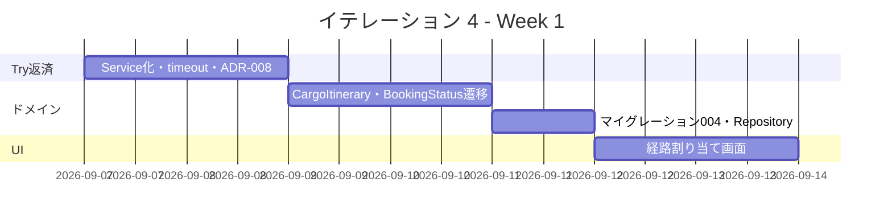
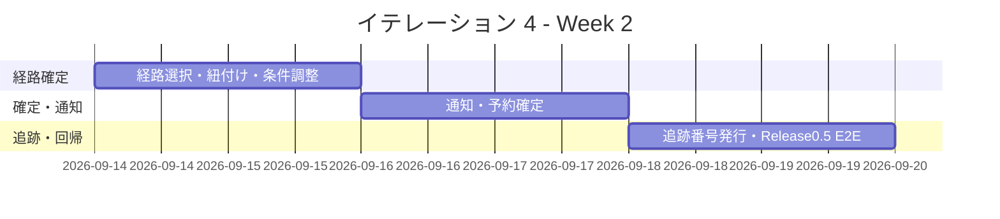
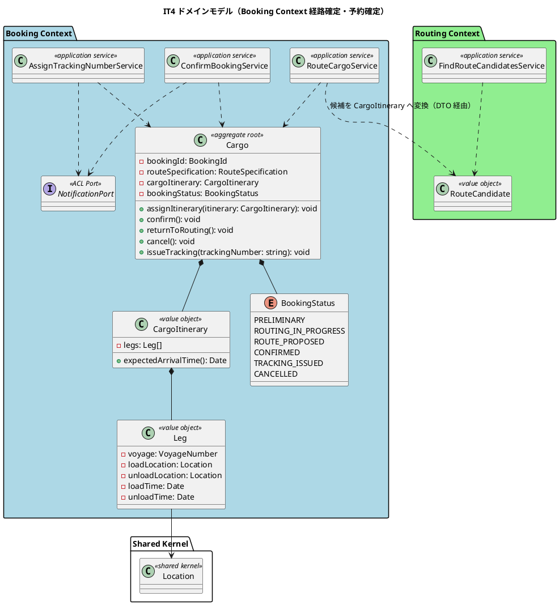
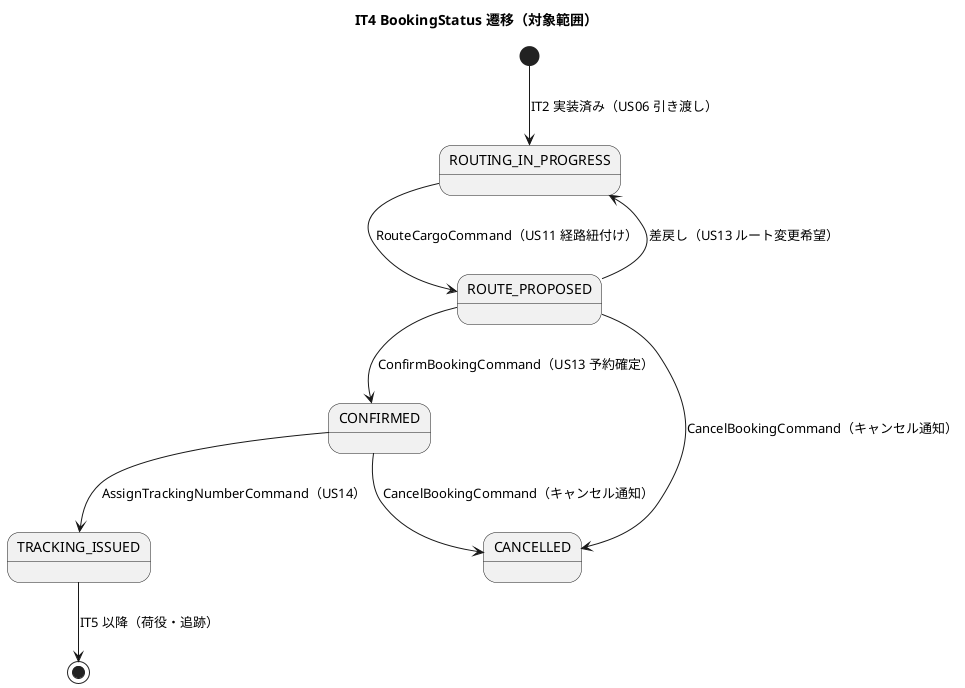
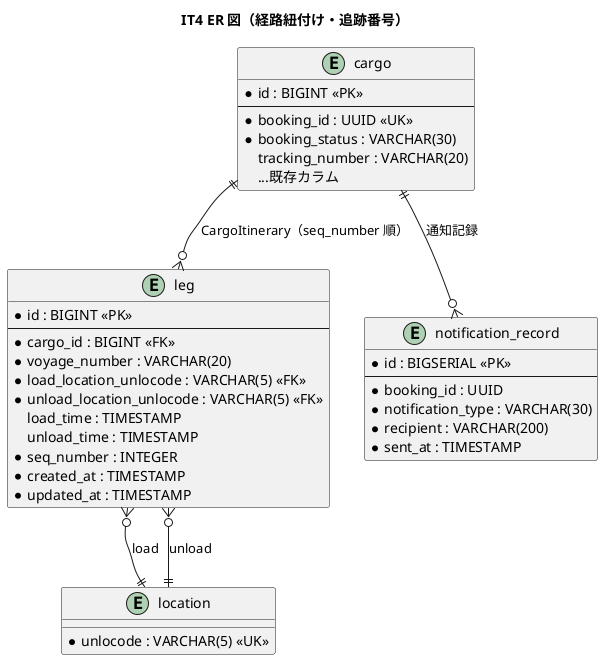
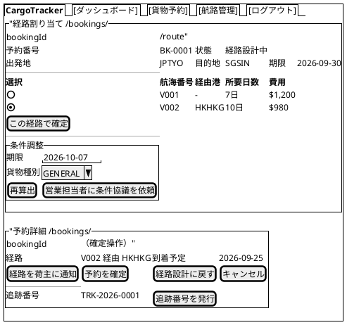
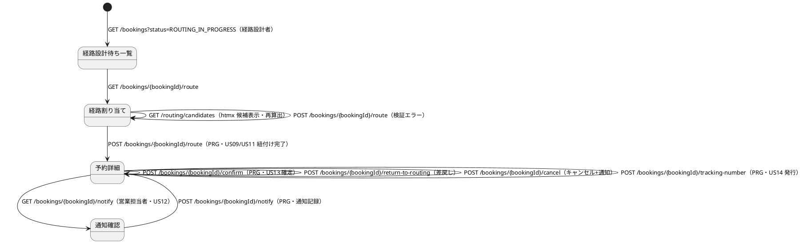

# イテレーション 4 計画

## 概要

| 項目 | 内容 |
|------|------|
| **イテレーション** | 4 |
| **期間** | 2026-09-07 〜 2026-09-20（計画 Week 7-8） |
| **局面** | 中盤（インサイドアウト） |
| **ゴール** | IT3 の経路候補を Booking の状態遷移へ接続し、経路選択・予約紐付け・荷主通知・予約確定・追跡番号発行までの基幹フローを完成させる（Release 0.5） |
| **目標 SP** | 16 |

---

## ゴール

### イテレーション終了時の達成状態

1. **経路確定**: 経路設計者が経路候補から 1 件を選択し、`CargoItinerary`（Leg 連結制約付き）として予約に紐付け、`ROUTING_IN_PROGRESS → ROUTE_PROPOSED` 遷移が完了する。
2. **条件調整**: 期限内候補がない場合、期限・貨物種別等を調整して再算出できる。
3. **通知・確定**: 営業担当者が確定経路を荷主に通知し、予約を `CONFIRMED` へ確定できる。差戻し（経路設計中へ）・キャンセルも扱える。
4. **追跡番号発行**: 確定予約に一意の追跡番号を発行し、`TRACKING_ISSUED` へ遷移、荷主に通知記録が残る。
5. **Release 0.5 デモ E2E**: 予約登録 → 引き渡し → 経路候補 → 経路確定 → 通知 → 予約確定 → 追跡番号発行の基幹フロー E2E が green である。

### 成功基準

- [x] `US09` / `US10` / `US11` / `US12` / `US13` / `US14` の受入基準をテストで 1:1 に確認する。
- [x] 中盤方針どおり、`CargoItinerary` の Leg 連結制約・`BookingStatus` 遷移をドメイン単体テストから Red-Green-Refactor で進める。
- [x] 画面を伴う US は「endpoint がある」ではなく「対象ロールが画面操作で完結できる」ことを E2E で確認する（IT3 Try T1）。
- [x] `RoutingCandidateController` の候補算出組み立てを `FindRouteCandidatesService` へ移す（IT3 Try T2）。
- [x] `HttpExternalRoutingService` に timeout / abort を追加し、fallback テストに遅延ケースを含める（IT3 Try T3）。
- [x] Estimation 見積候補 Port と Routing 経路候補 Port の境界を ADR-008 で決定する（IT3 Try T5）。
- [x] `npm run verify` と Release 0.5 基幹フロー E2E が green である。
- [x] ドメイン層カバレッジ 85% 以上、全体カバレッジ 80% 以上を維持する。

---

## ユーザーストーリー

### 対象ストーリー

| ID | ユーザーストーリー | SP | 優先度 | 対応 UC |
|----|-------------------|----|--------|---------|
| US09 | 経路を選択・確定する | 3 | 必須 | UC07 |
| US10 | 経路条件を調整して再算出する | 3 | 中 | UC08 |
| US11 | 経路情報を予約に紐付ける | 3 | 必須 | UC09 |
| US12 | 確定経路を荷主に通知する | 2 | 中 | UC10 |
| US13 | 予約を確定する | 3 | 必須 | UC11 |
| US14 | 追跡番号を発行する | 2 | 必須 | UC12 |
| **合計** | | **16** | | |

### ストーリー詳細

#### US09: 経路を選択・確定する

**ストーリー**:
> 経路設計者として、算出された経路候補から最適なものを選択し、経路を確定したい。なぜなら、制約条件を満たす経路を確定することで、予約への紐付けと荷主への提案に進めるからだ。

**受入条件**:

1. 経路候補一覧（経由港・所要日数・費用・航海番号）を確認できる。
2. 最適な経路候補を 1 件選択できる。
3. 選択後、経路の状態が「確定」になる。
4. 最適な候補がない場合、条件調整（UC08 / US10）に進める。

#### US10: 経路条件を調整して再算出する

**ストーリー**:
> 経路設計者として、条件（期限・経由地など）を調整して経路候補を再算出したい。なぜなら、当初条件で期限内到達可能な経路がない場合でも、条件を見直して実行可能な経路を見つけられるからだ。

**受入条件**:

1. 現在の制約条件（期限・経由地制限など）を確認できる。
2. 条件を調整（期限延長・経由地追加・貨物種別変更など）して再算出できる。
3. 調整後の条件に基づいた新しい経路候補が提示される。
4. 条件を満たす経路がない場合、営業担当者に条件協議を依頼できる。

#### US11: 経路情報を予約に紐付ける

**ストーリー**:
> 経路設計者として、確定した経路を貨物予約に紐付けたい。なぜなら、経路と予約が結び付くことで、荷主への提案・予約確定・荷役計画の基礎情報が揃うからだ。

**受入条件**:

1. 確定経路と予約番号を確認できる。
2. 紐付け操作を実行できる。
3. 紐付け後、予約状態が「経路提案中」に更新される。

#### US12: 確定経路を荷主に通知する

**ストーリー**:
> 営業担当者として、確定経路の詳細（経由港・所要日数・到着予定日）を荷主に通知したい。なぜなら、荷主が輸送計画を確認・承認することで予約確定に進められるからだ。

**受入条件**:

1. 予約番号を指定して経路情報を確認できる。
2. 通知内容（経由港・所要日数・到着予定日・料金概算）を確認できる。
3. 荷主への経路通知を送信できる。
4. 通知送信記録が登録される。

#### US13: 予約を確定する

**ストーリー**:
> 営業担当者として、荷主の承認を確認して予約を正式に確定したい。なぜなら、確定によって追跡番号発行と輸送準備を開始できるからだ。

**受入条件**:

1. 予約内容と選択ルートを確認できる。
2. 確定操作により予約状態が「予約確定」になる。
3. 経路設計者に追跡番号発行依頼が通知される。
4. 荷主がルート変更を希望する場合、「経路設計中」に戻せる。
5. 荷主がキャンセルを希望する場合、キャンセル状態へ遷移できる。
6. キャンセル時、荷主へキャンセル確認通知が送られる。

#### US14: 追跡番号を発行する

**ストーリー**:
> 経路設計者として、確定した予約に一意の追跡番号を発行し、荷主に通知したい。なぜなら、追跡番号によって荷主・関係者が輸送状況を照会できるようになるからだ。

**受入条件**:

1. 「予約確定」状態の予約に対して追跡番号を発行できる。
2. 追跡番号は一意に採番される。
3. 発行後、貨物状態が「受領待ち」（追跡発行済）になる。
4. 荷主に追跡番号と追跡方法がメール通知される。

### タスク

#### 1. IT3 Try 返済・基盤調整（0 SP）

| # | タスク | 見積もり | 担当 | 状態 |
|---|--------|---------|------|------|
| 1.1 | `FindRouteCandidatesService` を新設し、`RoutingCandidateController` の候補算出組み立てを Application 層へ移す（Try T2） | 4h | - | [x] |
| 1.2 | `HttpExternalRoutingService` に `AbortSignal.timeout` を追加し、遅延時 fallback の統合テストを追加（Try T3） | 4h | - | [x] |
| 1.3 | ADR-008: Estimation 見積候補 Port と Routing 経路候補 Port の境界（統合 or 概算専用として維持）、候補 DTO の形状（注 6）、Routing ACL の Published Language 方針（M4）、追跡番号採番主体の暫定判断（注 4）を起票・決定（Try T5） | 6h | - | [x] |
| 1.4 | 航海更新の確認前 validation（日付逆転・寄港地時系列）を共通化（Try T6） | 4h | - | [x] |

**小計**: 18h（理想時間）

#### 2. Booking ドメイン: CargoItinerary・状態遷移・DB（US11/US13/US14 の基盤、5 SP）

| # | タスク | 見積もり | 担当 | 状態 |
|---|--------|---------|------|------|
| 2.1 | `CargoItinerary` / `Leg` 値オブジェクトの単体テスト（1 Leg 以上・`Leg[n].unloadLocation === Leg[n+1].loadLocation` 連結制約・`expectedArrivalTime()`） | 8h | - | [x] |
| 2.2 | `BookingStatus` 遷移ルールの単体テスト（ROUTING_IN_PROGRESS → ROUTE_PROPOSED → CONFIRMED → TRACKING_ISSUED、差戻し・CANCELLED） | 6h | - | [x] |
| 2.3 | マイグレーション 004: `leg` テーブル（cargo_id・voyage_number・load/unload location・load/unload time・seq_number）と `cargo.tracking_number` カラム追加 | 6h | - | [x] |
| 2.4 | Cargo Repository の itinerary 永続化（leg 入替トランザクション）統合テスト | 6h | - | [x] |

**小計**: 26h（理想時間）

#### 3. 経路選択・調整・紐付け（US09/US10/US11、6 SP）

| # | タスク | 見積もり | 担当 | 状態 |
|---|--------|---------|------|------|
| 3.1 | `RouteCargoService`（RouteCargoCommand）: 選択候補を `CargoItinerary` へ変換し予約へ紐付け、`ROUTE_PROPOSED` へ遷移 | 8h | - | [x] |
| 3.2 | `/bookings/{bookingId}/route` 画面: 経路候補テーブル・候補選択・PRG で予約詳細へ | 8h | - | [x] |
| 3.3 | 条件調整フォーム（期限延長・貨物種別変更等）と htmx 再算出、候補なし時の条件協議依頼メッセージ | 6h | - | [x] |
| 3.4 | 経路設計待ち一覧（`/bookings?status=ROUTING_IN_PROGRESS`）から経路割り当てへの導線と統合テスト | 4h | - | [x] |

**小計**: 26h（理想時間）

#### 4. 通知・予約確定（US12/US13、3 SP）

| # | タスク | 見積もり | 担当 | 状態 |
|---|--------|---------|------|------|
| 4.1 | `NotificationPort` と記録付きスタブ実装（送信記録の永続化・契約テスト） | 6h | - | [x] |
| 4.2 | 経路通知（通知内容確認 → 送信 → 記録表示）の画面・Controller・統合テスト | 6h | - | [x] |
| 4.3 | `ConfirmBookingService`（CONFIRMED / 差戻し ROUTING_IN_PROGRESS / CANCELLED + キャンセル通知）と予約詳細画面の確定操作 | 8h | - | [x] |

**小計**: 20h（理想時間）

#### 5. 追跡番号発行・Release 0.5 E2E（US14、2 SP）

| # | タスク | 見積もり | 担当 | 状態 |
|---|--------|---------|------|------|
| 5.1 | `AssignTrackingNumberService`: 一意採番・`TRACKING_ISSUED` 遷移・荷主通知記録（CONFIRMED 以外はエラー） | 8h | - | [x] |
| 5.2 | 追跡番号発行導線（経路設計者が予約詳細へ到達できるロール別導線を含む・注 3）と統合テスト | 4h | - | [x] |
| 5.3 | Release 0.5 基幹フロー E2E（予約登録 → 引き渡し → 経路候補 → 経路確定 → 通知 → 予約確定 → 追跡番号発行） | 8h | - | [x] |

**小計**: 20h（理想時間）

#### タスク合計

| カテゴリ | SP | 理想時間 | 状態 |
|---------|----|----------|------|
| IT3 Try 返済・基盤調整 | 0 | 18h | [x] |
| Booking ドメイン・DB | 5 | 26h | [x] |
| 経路選択・調整・紐付け | 6 | 26h | [x] |
| 通知・予約確定 | 3 | 20h | [x] |
| 追跡番号発行・E2E | 2 | 20h | [x] |
| **合計** | **16** | **110h** | [x] |

**1 SP あたり**: 約 6.9h
**進捗率**: 100%（US09〜US14 実装・Try T2/T3/T6 返済・ADR-008・設計同期・Release 0.5 基幹フロー E2E green）

---

## スケジュール

### Week 1（2026-09-07 〜 2026-09-13）

| 日 | タスク |
|----|--------|
| Day 1 | Try T2/T3 返済（`FindRouteCandidatesService`・timeout/abort） |
| Day 2 | ADR-008 決定、確認前 validation 共通化（T5/T6） |
| Day 3 | `CargoItinerary` / `Leg` 連結制約の Red-Green |
| Day 4 | `BookingStatus` 遷移ルールと差戻し・キャンセル |
| Day 5 | マイグレーション 004・Repository 統合テスト、経路割り当て画面着手 |

### Week 2（2026-09-14 〜 2026-09-20）

| 日 | タスク |
|----|--------|
| Day 6 | `RouteCargoService` と経路割り当て画面の縦貫通（US09/US11） |
| Day 7 | 条件調整・再算出・条件協議依頼（US10） |
| Day 8 | `NotificationPort`・経路通知（US12） |
| Day 9 | 予約確定・差戻し・キャンセル（US13） |
| Day 10 | 追跡番号発行（US14）、Release 0.5 E2E、`npm run verify`、設計同期 |

---

## 設計

### ドメインモデル

出典: [domain-model.md](../design/domain-model.md) Booking Context（CargoItinerary / Leg / BookingStatus / コマンド一覧・ビジネスルール 3・4）、外部システム ACL Ports（NotificationPort）、[development_strategy.md](development_strategy.md) 中盤 IT4 方針。Routing → Booking の候補受け渡しは DTO 経由とし、ドメイン層のコンテキスト間直接依存は作らない。

### 状態遷移図

出典: [domain-model.md](../design/domain-model.md) ビジネスルール 4（遷移順・任意状態から CANCELLED 可）。`IN_TRANSIT` 以降は IT5-6 で扱う。

### データモデル

出典: [data-model.md](../design/data-model.md) `leg` テーブル・`cargo.booking_status` CHECK・将来追加カラム `tracking_number`。`leg.voyage_number` は Routing Context の `voyage` を参照するため、コンテキスト間 DB FK は張らない方針（data-model.md）に従いアプリケーション側で整合を保証する。`notification_record` は US12/US13/US14 の通知記録要件のための新規テーブル（注 2 参照）。

### ユーザーインターフェース

#### ビュー

#### 画面遷移図

出典: [ui_design.md](../design/ui_design.md) 画面一覧（予約詳細・経路割り当て）・PRG / htmx ガイドライン。通知確認・確定・追跡番号発行の URL は ui_design.md に未定義のため本 IT で追補する（注 3 参照）。

---

## リスクと対策

| リスク | 影響 | 対策 |
| :--- | :--- | :--- |
| Routing の `RouteCandidate` を Booking ドメインが直接参照し BC 独立性が崩れる | 高 | 候補 → `CargoItinerary` 変換は Application 層の DTO 経由で行い、dependency-cruiser で回帰確認する |
| Estimation 見積候補 Port の扱いが未決のまま実装が進む | 中 | Week 1 で ADR-008 を決定してから US09 実装に入る（Try T5） |
| `BookingStatus` 遷移の差戻し・キャンセル分岐でテスト漏れ | 高 | 遷移マトリクスを test.each で網羅し、不正遷移はドメインエラーで拒否する |
| 通知の実送信手段がなく US12/US14 の受入基準を満たせない | 中 | `NotificationPort` + 記録付きスタブで「送信記録の登録」を正とし、実配信は運用フェーズへ切り出す（注 2） |
| leg 入替（再紐付け）時のトランザクション不整合 | 中 | delete-insert を単一トランザクションで行い、Repository 統合テストで検証する |
| 画面導線はあるが対象ロールで完結しない（IT3 Problem 再発） | 高 | ロール別に「一覧 → 操作 → 完了確認」の E2E を DoD に含める（Try T1） |

---

## 注（設計への反映が必要）

1. **CargoItinerary / Leg / 遷移実装**: domain-model.md で「IT4+ 実装予定」とされている `CargoItinerary`・`Leg`・`ROUTE_PROPOSED` 以降の遷移を本 IT で実装し、実装状況注記を更新する。US13 の差戻し遷移（`ROUTE_PROPOSED → ROUTING_IN_PROGRESS`）は domain-model.md ビジネスルール 4 に未記載のため、実装と同時にルール 4 へ追記する。
2. **通知記録テーブル**: US12「通知送信記録が登録される」に対応する `notification_record` は data-model.md に未定義。マイグレーション 004 と同時に data-model.md へ追加する。`NotificationPort` の名称は domain-model.md の ACL Ports 表に従う。
3. **通知・確定・差戻し・追跡番号発行の画面**: `/bookings/{bookingId}/notify`・`/confirm`・`/return-to-routing`・`/tracking-number` は ui_design.md に未定義のため、実装と同時に画面一覧・画面遷移図へ追補する（`/cancel` は既定義）。あわせて、US14 の操作者である経路設計者が予約詳細（追跡番号発行導線）へ到達できるロール別導線（予約詳細の到達ロールへの経路設計者追加、または確定済み一覧からの導線）を ui_design.md に定義する。
4. **cargo.tracking_number**: data-model.md では「将来追加予定」。本 IT のマイグレーション 004 で **nullable + 発行済のみ一意（部分 UNIQUE インデックス）** として追加し、表と制約を同期する。Tracking Context の `tracking_activity` 本体は IT5-6 で実装する。IT4 では採番を Booking 側（`AssignTrackingNumberService`）で暫定的に行い、Tracking 集約実装時に採番主体を再配置する（domain-model.md のイベントフローでは Tracking Context 採番）。この暫定判断は ADR-008 に含めて明文化する。
5. **US04 見積連携（IT3 持ち越し）**: `EstimateId` 整合性は ADR-008 の決定に含めて扱いを確定する。Voyage 検索の SQL 化（Try T4）は件数増加が顕在化するまで IT5 以降へ後置する。
6. **候補 DTO の形状**: 既存 Routing `RouteCandidate` は `voyageNumbers` / `transitPorts` / 全体の出発・到着時刻のみで、`leg` の区間別 `load_time` / `unload_time` を持たない。`RouteCargoService` での `CargoItinerary` 変換に向けて、候補 DTO へ区間別スケジュールを含めるか Voyage 再取得で補完するかをタスク 1.3（ADR-008）とあわせて Week 1 に決定する。
7. **スコープ外の明示**: Try T7 / レビュー M6（Testcontainers smoke の CI 追加または ADR-004 適用範囲更新）は IT4 スコープ外とし、CI 改善として別途扱う。レビュー M4（Routing ACL の Published Language / read model 方針）は ADR-008 のスコープに含めて明文化する。
8. **優先度の典拠**: 対象ストーリー表の優先度（US10/US12 = 中、他 = 必須）は release_plan.md の優先順位マトリックスに従う（user_story.md のビジネス価値表記とは体系が異なる）。

---

## 完了条件

### Definition of Done

- [x] `US09` / `US10` / `US11` / `US12` / `US13` / `US14` の受入基準が単体・統合・E2E のいずれかで確認されている。
- [x] 画面を伴う US は対象ロールが画面操作で完結できることを E2E で確認している（Try T1）。
- [x] `npm run verify` がパスしている。
- [x] Release 0.5 基幹フロー E2E（予約登録 → 経路確定 → 予約確定 → 追跡番号発行）が green である。
- [x] dependency-cruiser が green で、Booking / Routing の BC 独立性が保たれている。
- [x] ADR-008 が承認され、Estimation / Routing の候補 Port 境界が明文化されている。
- [x] `data-model.md` / `domain-model.md` / `ui_design.md` の IT4 差分が実装と同期している。
- [x] GitHub Project の IT4 Issue が開発着手時に In Progress へ更新できる状態になっている。

### デモ項目

- [x] 経路設計者が経路設計待ち一覧から経路割り当て画面に到達し、候補から 1 件選択して予約に紐付けられる（予約状態が「経路提案中」になる）。
- [x] 期限内候補がない場合、条件を調整して再算出できる。候補が見つからなければ条件協議依頼ができる。
- [x] 営業担当者が通知内容を確認して荷主に経路通知を送信し、送信記録が表示される。
- [x] 営業担当者が予約を確定でき、差戻し・キャンセル（キャンセル通知付き）も選択できる。
- [x] 経路設計者が確定予約に追跡番号を発行でき、一意の追跡番号と「追跡発行済」状態が表示される。
- [x] 上記を通しで実行する Release 0.5 基幹フロー E2E が green である。

---

## 更新履歴

| 日付 | 変更内容 | 作成者 |
|------|----------|--------|
| 2026-07-29 | IT4 開始準備として初版作成 | Claude |
| 2026-07-29 | 詳細・横断整合性検証の指摘を反映（ER 型修正、注 6〜8 追加、ADR-008 スコープ拡張、US14 導線） | Claude |

## 関連ドキュメント

- [リリース計画](release_plan.md)
- [開発戦略](development_strategy.md)
- [イテレーション 3 ふりかえり](retrospective-3.md)
- [ユーザーストーリー](../requirements/user_story.md)
- [システムユースケース](../requirements/system_usecase.md)
- [ドメインモデル](../design/domain-model.md)
- [データモデル](../design/data-model.md)
- [UI 設計](../design/ui_design.md)
- [IT3 実装レビュー](../review/IT3実装_review_20260729.md)
- [ADR-007 共有カーネルとスタブ ACL](../adr/007-shared-kernel-and-stub-acl.md)
