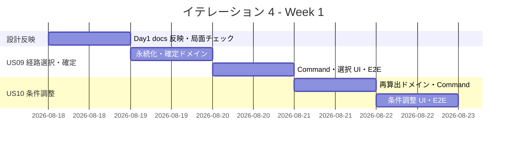
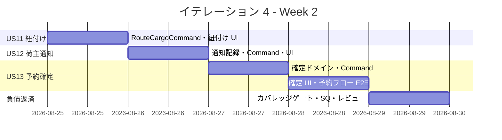
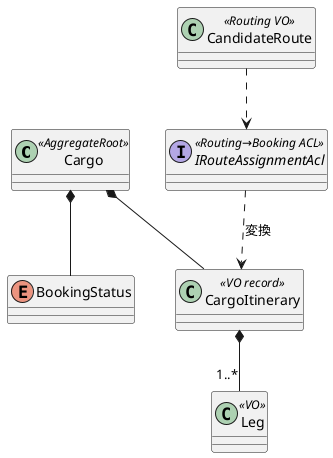

# イテレーション 4 計画

## 概要

| 項目 | 内容 |
|------|------|
| **イテレーション** | 4 |
| **期間** | 2026-08-18 〜 2026-08-29（2 週間） |
| **ゴール** | 経路の選択・調整・紐付けから予約確定・荷主通知までの予約フローが完結する |
| **目標 SP** | 12（US09 / US10 / US11 / US12 / US13） |

---

## ゴール

### イテレーション終了時の達成状態

1. **経路確定と予約への紐付け**: 経路設計者が算出済み経路候補から最適経路を選択・確定し（US09）、確定経路を貨物予約に紐付けて予約状態を遷移させる（US11）。Routing の `CandidateRoute` を Booking の `CargoItinerary` に変換する BC 連携（ACL）を確立する。
2. **経路条件の再調整**: 適切な候補がない場合に条件（期限・経由地・貨物種別）を調整して再算出できる（US10）。IT3 の `RouteCandidateCalculator` を再利用する。
3. **予約フローの完結**: 営業担当者が確定経路を荷主に通知し（US12）、荷主承認をもって予約を確定する（US13）。予約ライフサイクル（`Preliminary → RouteProposed → Confirmed`）が一気通貫で動作する。

### 成功基準

- [ ] US09・US10・US11・US12・US13 の受入条件をすべて満たす
- [ ] Routing → Booking の経路紐付け ACL（`CandidateRoute` → `CargoItinerary` 変換）がドメイン不変条件（Leg 連結制約）を満たして動作する
- [ ] BookingStatus 状態遷移（`Preliminary → RouteProposed → Confirmed`、および Cancelled/差し戻し）が単体テストで網羅される
- [ ] E2E（Playwright）で「経路候補算出 → 選択・確定 → 予約紐付け → 荷主通知 → 予約確定」の予約フロー全体を担保する（IT3 繰り越し H5 の解消）
- [ ] ドメイン層カバレッジの実測ベースラインを可視化し、85% ハードゲートを段階導入する（IT3 繰り越し T4 / SQ-1）
- [ ] SonarQube 指摘 SQ-1〜SQ-5 を消化し Quality Gate OK を維持する
- [ ] ArchUnit で Routing ↔ Booking の依存方向（ACL 経由のみ）を継続検証する

### アプローチ（開発戦略: 中盤インサイドアウト継続）

[開発戦略](./development_strategy.md#中盤-インサイドアウトit3-5) に従い、IT4 も**中盤・インサイドアウト**を継続する。

- **データ層 → ドメイン層 → アプリケーション → プレゼンテーション**の順に内側から作り込む。予約状態遷移（US09/US11/US13）はドメイン不変条件が中核のため、Cargo 集約の状態遷移ロジックにビジネスルールを凝集させる。
- **BC 連携（Routing → Booking）が本 IT の焦点**。IT3 で分離した Routing の `CandidateRoute` を Booking の `CargoItinerary` に変換する ACL を新設する。Booking の内部モデルを Routing から直接参照せず、確立済みの ACL パターン（`ShipperExistenceChecker`・SQL 直接参照）を踏襲する。
- IT3 の確立パターン（AmbientTransaction・version 楽観ロック（ドメイン先行）・post-commit イベント・二方言 SQL）を予約確定フローで再利用する。
- **T1 の反映**: Codex 利用上限を前提に作業を小さな単位で分割し、上限到達時はテックリードが継続。Codex 復帰時に `developing-review` で独立レビューを挟む。

---

## ユーザーストーリー

### 対象ストーリー

| ID | ユーザーストーリー | SP | 優先度 |
|----|-------------------|----|----|
| US09 | 経路を選択・確定する | 3 | 必須 |
| US10 | 経路条件を調整して再算出する | 3 | 必須 |
| US11 | 経路情報を予約に紐付ける | 2 | 必須 |
| US12 | 確定経路を荷主に通知する | 2 | 必須 |
| US13 | 予約を確定する | 2 | 必須 |
| **合計** | | **12** | |

### ストーリー詳細

#### US09: 経路を選択・確定する（UC07）

**ストーリー**:
> 経路設計者として、算出された経路候補一覧から最適な経路を選択・確定したい。なぜなら、確定した経路をもとに予約への紐付けと荷主への提案に進めるからだ。

**受入条件**:

1. 経路候補一覧（経由港・所要日数・費用・航海番号）を確認できる
2. 最適な経路候補を 1 つ選択できる
3. 選択された経路情報が保存され、経路状態が「確定」になる
4. 選択操作の記録が残る
5. 最適な候補がない場合、経路条件調整（US10）へ進める導線がある

#### US10: 経路条件を調整して再算出する（UC08）

**ストーリー**:
> 経路設計者として、算出された経路候補に最適なものがない場合、条件を調整して経路候補を再算出したい。なぜなら、条件を柔軟に調整することで実現可能な経路を見つけられるからだ。

**受入条件**:

1. 現在の制約条件（期限・経由地制限・貨物種別等）を確認できる
2. 条件を調整（期限延長・経由地追加・貨物種別変更等）できる
3. 調整後の条件で経路候補が再算出される（US08 の算出ロジックを起動）
4. 新たな経路候補を確認できる
5. 調整後も条件を満たす経路がない場合、その旨が通知され条件変更協議を促される
6. 調整条件と再算出結果が記録される

#### US11: 経路情報を予約に紐付ける（UC09）

**ストーリー**:
> 経路設計者として、確定した経路情報を貨物予約に紐付けたい。なぜなら、予約と経路の関連を確立することで、追跡管理者が確定ルートに沿った追跡管理を行え、営業担当者が荷主にルート提案できるからだ。

**受入条件**:

1. 確定経路と予約番号を確認できる
2. 経路情報を予約に紐付ける操作を実行できる
3. 経路情報（`CargoItinerary`）が予約に関連付けて保存される（Leg 連結制約を満たす）
4. 予約状態が「経路提案中」（`RouteProposed`）に更新される
5. 紐付け操作の記録が残る

#### US12: 確定経路を荷主に通知する（UC10）

**ストーリー**:
> 営業担当者として、予約に紐付けられた確定経路情報を荷主に通知したい。なぜなら、荷主が経路の詳細（経由港・所要日数・到着予定日・料金概算）を確認し、承認判断できるからだ。

**受入条件**:

1. 予約番号を指定して紐付けられた経路情報を確認できる
2. 通知内容（経由港・所要日数・到着予定日・料金概算）を確認できる
3. 荷主への経路通知を送信できる
4. 通知送信の記録が登録される
5. 通知後、荷主が承認・変更依頼を行える状態（`RouteProposed`）になる

#### US13: 予約を確定する（UC11）

**ストーリー**:
> 営業担当者として、荷主がルート提案を承認した予約を正式確定したい。なぜなら、予約が確定することで輸送が確約され、追跡番号発行フェーズに進めるからだ。

**受入条件**:

1. 予約番号を指定して予約内容と選択ルートを確認できる
2. 荷主の承認を確認して確定操作を行える
3. 予約状態が「予約確定」（`Confirmed`）に更新される
4. 経路設計者に追跡番号発行を依頼する通知が送信される
5. 荷主がルート変更を希望する場合、予約を「経路設計中」（`Preliminary` 相当）に戻して経路再設計を依頼できる
6. 荷主がキャンセルを希望する場合、予約を `Cancelled` に変更しキャンセル確認通知を送信できる

### タスク

> 進め方はインサイドアウト（データ → ドメイン → アプリケーション → プレゼンテーション）。下表は成果物の内訳。

#### 0. Day 1 設計反映・局面継続チェック

| # | タスク | 見積もり | 担当 | 状態 |
|---|--------|---------|------|------|
| 0.1 | 【Day 1・着手前】設計論点 1〜4 を docs/design に反映：(a) **予約状態遷移・コマンドの整合確定**（UC フロー「Preliminary→経路設計中→経路提案中→確定」と domain-model のコマンド定義（`AssignToRoutingCommand`: Pre→RouteProposed / `RouteCargoCommand`: RouteProposed→Confirmed / `ConfirmBookingCommand`: Pre→Confirmed）の内部矛盾を解消し、各 US のコマンド割当・遷移を確定して domain-model を修正）、(b) 新規コマンド（`SelectRouteCommand`・`AdjustRouteConditionCommand`・`NotifyRouteToShipperCommand`）を domain-model のコマンド一覧に追加定義、(c) Routing→Booking の経路紐付け ACL（`CandidateRoute`→`CargoItinerary` 変換）を domain-model に定義、(d) 荷主通知の記録モデル（通知履歴）を data-model/domain-model に定義し、対象画面（下記）を ui_design 画面一覧に追記、(e) `/bookings/{bookingId}/route` スタブの扱い（廃止＝`/routing/requests` 集約 or 予約詳細参照ビュー化）を確定し ui_design 画面一覧の重複エントリ・開発戦略ナビ表と整合。局面継続チェック（縦切り・ArchUnit グリーン・UoW 基盤動作） | 4h | - | [ ] |

**小計**: 4h（理想時間）

> **注（状態遷移の確定方針・Day 1 で docs/design を正に修正）**: IT2 の US06（`AssignToRoutingCommand`）が既に `Preliminary → RouteProposed` を実装済みのため、本 IT では US09（経路確定）・US11（紐付け）は Routing 側の経路確定と `CargoItinerary` 割当を担い、予約状態の `Confirmed` 遷移は US13（`ConfirmBookingCommand`）に集約する。domain-model のコマンド定義（特に `RouteCargoCommand`/`ConfirmBookingCommand` の遷移元）と UC フローの乖離は Day 1 タスク 0.1 で確定し docs/design を更新してから実装する。

#### 1. US09 経路を選択・確定する（3 SP）

| # | タスク | 見積もり | 担当 | 状態 |
|---|--------|---------|------|------|
| 1.1 | 確定経路の永続化（selected_route / route_status マイグレーション 0008・二方言）＋モデル定義 | 3h | - | [ ] |
| 1.2 | 経路選択・確定ドメインロジック（候補からの選択・経路状態「確定」への遷移不変条件）＋ドメインユニットテスト | 5h | - | [ ] |
| 1.3 | SelectRouteCommand / CommandService（選択記録・確定）＋統合テスト | 4h | - | [ ] |
| 1.4 | 経路候補一覧からの選択・確定 UI（`/routing/requests/{bookingId}` に選択導線）＋条件調整（US10）への分岐＋E2E | 4h | - | [ ] |

**小計**: 16h（理想時間）

#### 2. US10 経路条件を調整して再算出する（3 SP）

| # | タスク | 見積もり | 担当 | 状態 |
|---|--------|---------|------|------|
| 2.1 | 条件調整（期限延長・経由地追加・貨物種別変更）ドメインロジック＋IT3 `RouteCandidateCalculator` 再算出の呼び出し＋ユニットテスト | 5h | - | [ ] |
| 2.2 | AdjustRouteConditionCommand / CommandService（調整条件・再算出結果の記録）＋統合テスト | 3h | - | [ ] |
| 2.3 | 条件調整フォーム・再算出結果表示（該当なし時の条件変更協議導線）＋E2E | 4h | - | [ ] |

**小計**: 12h（理想時間）

#### 3. US11 経路情報を予約に紐付ける（2 SP）

| # | タスク | 見積もり | 担当 | 状態 |
|---|--------|---------|------|------|
| 3.1 | Routing→Booking 経路紐付け ACL（`CandidateRoute`→`CargoItinerary` 変換。Leg 連結制約検証。ShipperExistenceChecker パターン踏襲）＋ユニット/契約テスト | 5h | - | [ ] |
| 3.2 | RouteCargoCommand / CommandService（既存コマンド。`CargoItinerary` を Cargo に割り当て。予約状態は US06 で既に `RouteProposed`。遷移の最終確定は Day1 0.1 に従う。AmbientTransaction・楽観ロック踏襲）＋統合テスト | 4h | - | [ ] |
| 3.3 | 紐付け実行 UI・予約状態表示更新＋E2E | 3h | - | [ ] |

**小計**: 12h（理想時間）

#### 4. US12 確定経路を荷主に通知する（2 SP）

| # | タスク | 見積もり | 担当 | 状態 |
|---|--------|---------|------|------|
| 4.1 | 経路通知ドメイン/アプリ（通知内容組み立て・通知送信記録の永続化。マイグレーション 0009・二方言）＋テスト | 4h | - | [ ] |
| 4.2 | NotifyRouteToShipperCommand / CommandService＋統合テスト | 3h | - | [ ] |
| 4.3 | 経路通知確認・送信 UI（経由港・所要日数・到着予定日・料金概算の確認）＋E2E | 3h | - | [ ] |

**小計**: 10h（理想時間）

#### 5. US13 予約を確定する（2 SP）

| # | タスク | 見積もり | 担当 | 状態 |
|---|--------|---------|------|------|
| 5.1 | 予約確定ドメインロジック（`RouteProposed → Confirmed` 遷移・差し戻し（`Preliminary` へ）・`Cancelled` 遷移の不変条件。遷移元の最終確定は Day1 0.1）＋ユニットテスト | 5h | - | [ ] |
| 5.2 | ConfirmBookingCommand（既存）/ CancelBookingCommand（既存）/ CommandService（確定・追跡番号発行依頼 post-commit イベント発行。差し戻し/キャンセル分岐）＋統合テスト | 4h | - | [ ] |
| 5.3 | 予約確定 UI（内容・選択ルート確認・確定/差し戻し/キャンセル導線）＋予約フロー全体 E2E | 4h | - | [ ] |

**小計**: 13h（理想時間）

#### 6. IT3 繰り越し・技術的負債・SonarQube 指摘

| # | タスク | 見積もり | 担当 | 状態 |
|---|--------|---------|------|------|
| 6.1 | T4/SQ-1: ドメイン層カバレッジの実測ベースラインを reportgenerator で可視化 → 85%（全体 80%）ハードゲートを CI に段階導入（壊さないよう実測確認後） | 4h | - | [ ] |
| 6.2 | T4（IT3 H5）: Playwright E2E を予約フロー（算出→選択→紐付け→通知→確定）に拡張。US13 と合流 | 4h | - | [ ] |
| 6.3 | T2: US08 経路候補算出を developing-review で重点レビュー（探索網羅性・費用計算妥当性・区間展開の計算量）※テックリード自作分の独立検証 | 2h | - | [ ] |
| 6.4 | T5: 外部経路サービスの契約方針を判断。実連携不要ならローカル算出（`VoyageRouteCandidateService`）を正式方針として ADR 化、必要なら WireMock.Net 契約テスト追加 | 3h | - | [ ] |
| 6.5 | SQ-2: `S6967` ModelState.IsValid（Routing/Voyage/Estimate/Auth Controller）。GET 誤検出を精査し必要箇所のみ対応 or 抑制 | 2h | - | [ ] |
| 6.6 | SQ-3: `Web:S6853` Razor label とコントロール関連付け（アクセシビリティ 33 件）。IT2/IT3 レビューのアクセシビリティ指摘と一括対応 | 3h | - | [ ] |
| 6.7 | SQ-4/SQ-5: `S1144` 未使用 private メンバー削除（23）・`SYSLIB1045` GeneratedRegex 化（22）。機械的返済 | 3h | - | [ ] |
| 6.8 | IT3 レビュー H2: 経路候補 → US09 経路選択導線を実装（本 IT で解消。IT3 で置いた「IT4 対応」注記を実導線へ置換） | 1h | - | [x] |
| 6.9 | IT3 レビュー M9: 航海更新（US25）差分の変更箇所ハイライト（左右並置に変更強調）＋M1 状態バッジ日本語化・M2 費用単位/概算表記の UI 一括対応 | 3h | - | [x]（M1 状態バッジ・M2 費用単位・M9 差分ハイライトを実装） |

**小計**: 25h（理想時間）

#### タスク合計

| カテゴリ | SP | 理想時間 | 状態 |
|---------|----|----|------|
| Day 1 設計反映・局面継続チェック | - | 4h | [x]（状態遷移・コマンド・確定経路/通知の設計反映を実装と同時に完了。スタブ整理は残） |
| US09 経路を選択・確定する | 3 | 16h | [x] |
| US10 経路条件を調整して再算出する | 3 | 12h | [x]（算出再利用＋条件調整導線） |
| US11 経路情報を予約に紐付ける | 2 | 12h | [x] |
| US12 確定経路を荷主に通知する | 2 | 10h | [x] |
| US13 予約を確定する | 2 | 13h | [x] |
| IT3 繰り越し・技術的負債・SonarQube・レビュー反映 | - | 25h | [~]（H2/M1 完了。カバレッジゲート・SonarQube・M9/M2・Playwright E2E は残） |
| **合計** | **12** | **92h** | |

**1 SP あたり**: 約 5.3h（ストーリータスクのみ 63h ÷ 12 SP）
**進捗率**: 100% (12/12 SP)（機能実装完了。負債返済タスクの一部が残）

---

## スケジュール

### Week 1（Day 1-5）

| 日 | タスク |
|----|--------|
| Day 1 | 0.1 docs/design 反映・局面継続チェック、1.1 マイグレーション（Red 先行） |
| Day 2 | 1.2 経路選択・確定ドメイン、1.3 SelectRouteCommand＋統合テスト |
| Day 3 | 1.4 選択・確定 UI・E2E、2.1 条件調整・再算出ドメイン |
| Day 4 | 2.2 AdjustRouteConditionCommand、2.3 条件調整 UI・E2E |
| Day 5 | 3.1 Routing→Booking 経路紐付け ACL（BC 連携の主戦場） |

### Week 2（Day 6-10）

| 日 | タスク |
|----|--------|
| Day 6 | 3.2 RouteCargoCommand（状態遷移）＋統合テスト、3.3 紐付け UI・E2E |
| Day 7 | 4.1 通知記録永続化、4.2 NotifyRouteToShipperCommand、4.3 通知 UI・E2E |
| Day 8 | 5.1 予約確定ドメイン（差し戻し・キャンセル分岐）、5.2 ConfirmBookingCommand＋イベント |
| Day 9 | 5.3 予約確定 UI・予約フロー全体 E2E、6.2 Playwright E2E 拡張 |
| Day 10 | 6.1 カバレッジゲート段階導入、6.3-6.7 US08 重点レビュー・ADR・SonarQube 消化、統合テスト、デモ準備 |

---

## 設計

Booking と Routing の連携が本イテレーションの中核。詳細は
[ドメインモデル設計 - Booking Context](../design/domain-model.md#2-booking-context予約コンテキスト) および [Routing Context](../design/domain-model.md#3-routing-context経路コンテキスト) を SoT とする。

### ドメインモデル（本 IT スコープ）

- 状態遷移: `Preliminary → RouteProposed → Confirmed`（いずれからも `Cancelled` 可）。US11 で `Preliminary → RouteProposed`、US13 で `RouteProposed → Confirmed`。US13 差し戻しは `RouteProposed → Preliminary`。
- BC 連携: Routing の `CandidateRoute`（所要日数・経由港・費用・航海番号）を Booking の `CargoItinerary`（Leg 集合）に変換する ACL を新設。Booking の内部モデルを Routing から直接参照しない（IT2/IT3 の ACL パターン踏襲）。
- 不変条件: `CargoItinerary` の Leg 連結制約（`Leg[n].UnloadLocation == Leg[n+1].LoadLocation`）を単一トランザクション内で検証。

> **設計論点（Day 1 タスク 0.1 で確定・反映）**: ユースケース（UC09/UC11）の状態呼称「経路設計中／経路提案中」と domain-model の `BookingStatus`（`Preliminary/RouteProposed/Confirmed`）の対応を確定し、状態遷移図・各 US 受入条件の呼称を統一する。乖離があるため実装着手前に docs/design を正として反映する。

### データモデル

[data-model.md - Booking / Routing Context](../design/data-model.md) を SoT とする。確定経路（selected_route / route_status）と通知履歴を追加（0008・0009 マイグレーション、二方言）。Day 1 タスク 0.1 で data-model.md を更新してから実装する。

### ユーザーインターフェース

[UI 設計](../design/ui_design.md) を SoT とする。IT3 で実画面化した経路設計・候補算出画面（`/routing/requests/{bookingId}`）に選択・確定・条件調整・紐付けの導線を追加（ui_design 画面一覧では US09/US10/US11 が本画面に統合）。予約詳細（`/bookings/{bookingId}`）に通知・確定の営業担当者向けアクションを追加（ui_design で US12/US13 が予約詳細に統合）。

**対象画面**（ui_design 画面一覧に準拠）:

| 画面 | URL | 説明 | 対象ロール | US |
|------|-----|------|-----------|-----|
| 経路設計・候補算出 | `/routing/requests/{bookingId}` | 航海検索・候補算出・比較・条件調整・**選択/確定/紐付け** | ROLE_ROUTE_DESIGNER | US07/US08/US09/US10/US11 |
| 予約詳細 | `/bookings/{bookingId}` | 予約情報・経路・荷役履歴・**荷主通知/予約確定** | ROLE_SALES（荷主） | US06/US12/US13 |

> **ナビゲーション整合性（絶対項目・確認済み）**: 本 IT の対象画面は IT1 のウォーキングスケルトンで navbar・ダッシュボードに実装済み（`_Layout.cshtml`: 「経路設計」`/routing/requests`（ROLE_ROUTE_DESIGNER）、`Home/Index.cshtml`: 「経路設計」カード・「貨物予約」カード）。本 IT は**既存実画面内のアクション追加**（選択/確定/紐付け/通知/確定）であり新規ナビ項目・新規トップレベル画面はない。ナビ／ダッシュボードの追加変更は不要。`WalkingSkeletonTest` の ROLE_ROUTE_DESIGNER／ROLE_SALES 到達アサートは既存で担保。
>
> **軸 A 注記（`/bookings/{bookingId}/route` スタブの扱い・Day1 0.1 で確定）**: 開発戦略のナビ表では `/bookings/{bookingId}/route`（経路割り当て・営業担当者）を「IT2/IT4 で実装」とするが、経路設計作業は経路設計者フロー（`/routing/requests/{bookingId}`）に集約する方針のため、本 IT では当該スタブを**廃止（`/routing/requests` へ集約）**または**予約詳細からの参照ビュー化**のいずれかに Day1 0.1 で確定し、ui_design 画面一覧（line 71 の重複エントリ）と開発戦略ナビ表を整合させる。スタブが実画面から辿れて未実装のまま残る状態を防ぐ。

**インタラクション**（htmx / PRG パターン）:

- 経路選択（US09）: 候補一覧から `[この経路を選択]` を押下 → 確定（PRG で `/routing/requests` へ）。最適候補なし時は `[条件を調整]` で US10 の条件調整フォームへ分岐。
- 条件調整（US10）: 条件（期限・経由地・貨物種別）を `hx-post` で送信し再算出結果を部分更新。該当なし時は `alert-warning` で条件変更協議を促す。
- 紐付け（US11）: `[予約に紐付ける]`（PRG・楽観ロック）で確定経路を `CargoItinerary` として予約に割り当て。予約状態は US06 で既に `RouteProposed`（遷移の最終確定は Day1 0.1）。Leg 連結制約違反時はエラー表示。
- 荷主通知（US12）: 通知内容（経由港・所要日数・到着予定日・料金概算）を確認 → `[荷主に通知]` で送信記録登録。
- 予約確定（US13）: `[確定する]`（`Confirmed`・追跡番号発行依頼イベント）／`[経路再設計に戻す]`（`Preliminary` 差し戻し）／`[キャンセル]`（`Cancelled`・確認通知）。

### API 設計

> エンドポイントは ui_design の 2 画面（`/routing/requests/{bookingId}`・`/bookings/{bookingId}`）配下の htmx アクション。Day1 0.1 で ui_design のインタラクション節に追記する。

| メソッド | エンドポイント | 説明 |
|---------|---------------|------|
| POST | /routing/requests/{bookingId}/select | 経路選択・確定（US09。経路設計画面内アクション） |
| POST | /routing/requests/{bookingId}/adjust | 経路条件調整・再算出（US10。同上） |
| POST | /routing/requests/{bookingId}/assign | 経路情報を予約に紐付け（US11。同上） |
| POST | /bookings/{bookingId}/notify | 荷主への経路通知送信（US12。予約詳細内アクション） |
| POST | /bookings/{bookingId}/confirm | 予約確定/差し戻し/キャンセル（US13。予約詳細内アクション） |

### ADR

| ADR | タイトル | ステータス |
|-----|---------|-----------|
| [ADR-0006](../adr/0006-AmbientTransactionによるトランザクション伝播.md) | Ambient Transaction によるトランザクション伝播 | 承認済（予約確定フローで適用） |
| [ADR-0007](../adr/0007-貨物種別と経路候補のBC独立定義.md) | 貨物種別・経路候補の BC 独立定義 | 承認済（紐付け ACL の前提） |
| ADR-00XX（新規・6.4） | 外部経路サービスの契約方針（ローカル算出の正式化 or WireMock 契約） | 起票予定 |

---

## リスクと対策

| リスク | 影響度 | 対策 |
|--------|--------|------|
| 予約状態呼称（UC ⇔ domain-model）の乖離で実装・テストが混乱 | 高 | Day 1 タスク 0.1 で状態遷移を確定し docs/design を正に統一してから着手 |
| Routing→Booking の BC 連携 ACL（`CandidateRoute`→`CargoItinerary` 変換）が想定より複雑 | 高 | 3.1 を Day 5 に単独配置し Leg 連結制約を厚くテスト。確立済み ACL パターンを踏襲 |
| カバレッジ 85% ハードゲートの CI 追加でパイプラインを壊す | 中 | 6.1 で実測ベースラインを可視化してから段階導入（閾値を実測に合わせて設定） |
| Codex 利用上限で実装がテックリードに集中（IT3 と同事象） | 中 | T1 に従い小さな単位で分割。復帰時に developing-review で独立検証（6.3） |
| 予約フロー E2E（多段状態遷移）が不安定 | 中 | 6.2 で状態遷移ごとにシナリオを分割し、状態前提を明示してアサート |

---

## 完了条件

### Definition of Done

- [ ] コードレビュー完了（self-review：中間 / developing-review：正式）
- [ ] ユニットテストがパス（ドメイン層 85% 以上・状態遷移/紐付け ACL 網羅）
- [ ] E2E テストがパス（経路算出→選択→紐付け→通知→確定の予約フロー全体）
- [ ] ArchUnit テストがパス（Routing ↔ Booking の ACL 経由依存）
- [ ] カバレッジ 85% ハードゲートを CI に段階導入（実測ベースライン確定後）
- [ ] SonarQube Quality Gate OK（SQ-1〜SQ-5 消化）
- [ ] `dotnet format` / Lint エラーなし
- [ ] domain-model / data-model / ui_design / release_plan の横断更新完了
- [ ] ADR（外部経路サービス契約方針）起票完了

### デモ項目

1. 経路候補の選択・確定 → 条件調整による再算出（該当なし時の条件緩和）
2. 確定経路を予約に紐付け（予約状態 `RouteProposed` へ遷移）→ 荷主への経路通知
3. 荷主承認をもって予約確定（`Confirmed`・追跡番号発行依頼）／ルート変更差し戻し／キャンセル

---

## 更新履歴

| 日付 | 更新内容 | 更新者 |
|------|---------|--------|
| 2026-07-13 | 初版作成（US09/10/11/12/13・目標 12 SP・中盤インサイドアウト継続。IT3 ふりかえり Try（T1-T5）・SonarQube 指摘（SQ-1〜5）を反映） | - |
| 2026-07-13 | validating-iteration-plan 反映（8 ステップ）。ステップ 3/7：状態遷移・コマンドの domain-model 乖離を Day1 0.1 の確定対象に明示し US11/US13 タスクを既存コマンド名に整合。ステップ 5：対象画面・API を ui_design 画面一覧（`/routing/requests/{bookingId}`・`/bookings/{bookingId}` 統合）に準拠修正。ステップ 8：IT3 レビュー H2（US09 導線）・M9（差分ハイライト）・M1/M2（状態バッジ日本語化・費用単位）を反映タスク 6.8/6.9 として追加 | - |
| 2026-07-13 | validating-design 反映（軸 A/B/C）。軸 A：局面（中盤・IT3-5 インサイドアウト）・アプローチ・US 割り当て一致。`/bookings/{bookingId}/route` スタブの扱いを Day1 0.1(e) の確定対象に追加。軸 B：新規ドメインサービス・ACL・コマンド・enum の domain-model 要素表反映を Day1 0.1 に集約、ナビゲーション整合性（既存 navbar/dashboard で担保）を明示。軸 C：CandidateRoute/CargoItinerary・AmbientTransaction・楽観ロック（ドメイン先行）・ACL・二方言 SQL・post-commit イベント・ADR-0007 の連続性を確認（一致） | - |

---

## 関連ドキュメント

- [イテレーション 4 ふりかえり](./retrospective-4.md)（IT4 完了後に作成）
- [開発戦略](./development_strategy.md)
- [リリース計画](./release_plan.md)
- [イテレーション 3 計画](./iteration_plan-3.md)
- [イテレーション 3 ふりかえり](./retrospective-3.md)
- [ドメインモデル設計](../design/domain-model.md)
- [システムユースケース](../requirements/system_usecase.md)
- [ユーザーストーリー](../requirements/user_story.md)
- [ADR-0006 Ambient Transaction によるトランザクション伝播](../adr/0006-AmbientTransactionによるトランザクション伝播.md)
- [ADR-0007 貨物種別・経路候補の BC 独立定義](../adr/0007-貨物種別と経路候補のBC独立定義.md)
