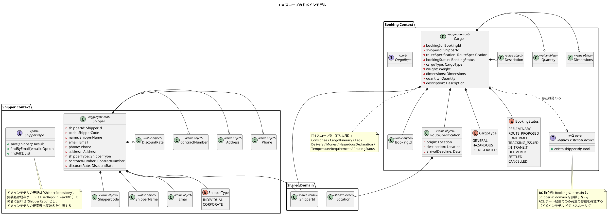
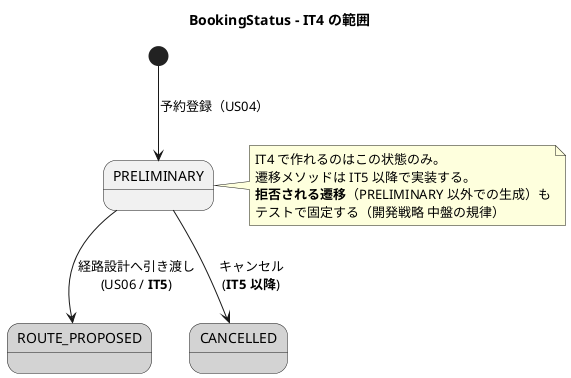
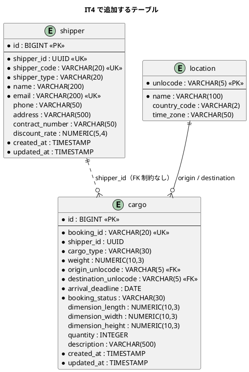
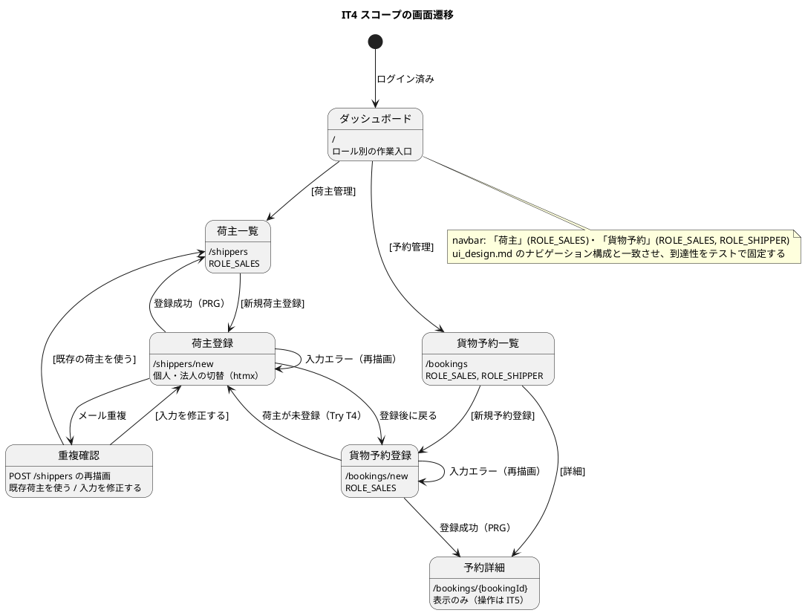

# イテレーション 4 計画

## 概要

| 項目 | 内容 |
|------|------|
| **イテレーション** | 4 |
| **期間** | Week 7-8（2026-09-14 〜 2026-09-25） |
| **局面** | **中盤（インサイドアウト）の初回**（[開発戦略](development_strategy.md) 参照） |
| **ゴール** | Shipper・Booking の 2 コンテキストを立ち上げ、荷主登録と貨物予約という**書き込み経路**を初めて通す。あわせて IT3 で顕在化したランタイム基盤の負債（ルーティング表の分裂）を、BC が増える前に返済する |
| **目標 SP** | 14 |

---

## ゴール

### イテレーション終了時の達成状態

1. **ランタイム基盤の負債返済**: ルーティング表が単一に戻り、「ルート表が認可の唯一の正典」が回復する（IT3 ふりかえり P5・T1）
2. **書き込み経路の確立**: 集約を新規作成して永続化し、PRG でリダイレクトするまでを通す（本プロジェクト初の書き込みトランザクション）
3. **Shipper Context の成立**: 荷主（個人・法人）を登録・一覧できる
4. **Booking Context の成立**: 貨物予約を登録し、`PRELIMINARY` 状態で永続化できる。Shipper への参照は ACL ポート経由に限る
5. **CI/CD の完成**: E2E・Trivy・日次の実 PostgreSQL が動き、TS05b がクローズする

### 成功基準（IT4 クローズ時の評価）

- [~] US02・US03・US04 の受入基準がすべて満たされる
      → **部分達成**。US02-3・US04-4（ID / 予約番号の発行）は発行はされるが、
      登録直後に自分の登録したものを特定できない（フラッシュメッセージ未実装）。
      US04-2 の寸法がフォームにない。詳細は [レビュー](../review/IT4実装_review_20260925.md) の充足表
- [x] ルーティング表が 1 つに統合され、同一パスが 2 表に現れうる構造が消えている
- [x] パス一致・メソッド不一致で **405** が返る
- [x] `Clock` 効果が導入され、AU-11 がテストで固定されている（5 件）
- [x] `Booking` の `domain` が `Shipper` の `domain` を参照していない（`arch-lint` 規約 4・違反 0 件）
- [x] 判断を含むユースケースに**単体テストが先にある**（`RegisterShipperTest` 8 件・`BookCargoTest` 8 件）
- [~] CI が緑（build / test / arch-lint / trace-lint / E2E / Trivy）
      → **E2E は未実施**（縮退順序 1 に従い IT5 へ）。他は緑
- [x] 手順書だけで新規参加者が荷主登録・予約登録まで到達できる（Try T5）

### 前イテレーションの Try の反映

| Try | 反映先 |
|:---:|--------|
| T1: ルーティング表の単一化を IT4 の最優先タスクにする | **TS08（タスク 1）。Day 1-3 の独立枠**。成立しない場合は ADR-0005 で認可の正典を再定義する |
| T2: 受入基準に「壊れ方」を 1 項目入れる | 各ストーリーの受入条件に「**壊れ方**」の行を追加（US02-4・US04-6 ほか） |
| T3: 判断を含むユースケースには単体テストを先に書く | タスク 2.2・3.2 を【RED（単体）】として統合テストより前に置く。DoD に明記 |
| T4: 画面を伴う機能には「詰まったときの次の行動」を受入基準に入れる | 各画面の受入条件に「詰まったときの次の行動」を明記（重複メール・入力エラー・荷主未登録の 3 箇所） |
| T5: 手順書の更新を DoD に入れる | DoD に追加。タスク 5.1 |
| T6: テストヘルパーは失敗時に停止させる | タスク 0.1（返済枠）。`loginAndGetCookie` ほか全ヘルパーを点検 |
| T7: 時刻をポート化する（`Clock` 効果） | TS08 のタスク 1.5-1.6。AU-11 の検証まで |
| T8: セキュリティ回帰テスト 8.4 を `trace-lint` の突合対象にする | タスク 5.3 |
| T9: 見積もりの精度そのものに向き合う | 下記「見積もりの収め方（Try T9）」で 3 点の実績を分析し、係数を計画へ織り込む |

---

## ユーザーストーリー

### 対象ストーリー

| ID | ストーリー | SP | 優先度 | Issue |
|----|-----------|:--:|--------|-------|
| TS08 | ランタイム基盤の整理（ルーティング表の単一化・`TxMode`・`Clock`） | 3 | 必須 | [#450](https://github.com/k2works/case-study-cargo-tracker/issues/450) |
| US02 | 荷主を登録する | 3 | 必須 | [#451](https://github.com/k2works/case-study-cargo-tracker/issues/451) |
| US03 | 法人荷主を登録する | 2 | 必須 | [#452](https://github.com/k2works/case-study-cargo-tracker/issues/452) |
| US04 | 貨物予約を登録する | 5 | 必須 | [#453](https://github.com/k2works/case-study-cargo-tracker/issues/453) |
| TS05b | CI/CD の残り（E2E・日次の実 PostgreSQL・Trivy） | 1 | 必須 | [#449](https://github.com/k2works/case-study-cargo-tracker/issues/449)（再オープン） |
| **合計** | | **14** | | |

GitHub Project: [CargoTracker flix/take-1](https://github.com/users/k2works/projects/39)

### スコープの変更（US05・US06 を IT5 へ）

[リリース計画](release_plan.md) の暫定配分では IT4 を US02-US06（15 SP）としていた。
**US05（危険物・冷凍貨物、3 SP）と US06（経路設計者への引き渡し、2 SP）を IT5 へ送る**。

理由は 2 つある。

1. **TS08（3 SP）が新たに必要になった**。IT3 のふりかえり T1 で「BC が 8 個になる IT4 以降では持たない」と
   判断した構造的負債であり、**Booking と Shipper という 2 つの BC を足す本イテレーションが最後の安価な返済機会**である。
   [開発戦略](development_strategy.md) 5 章の規律に従い、余力次第にせず独立枠として計上する
2. **見積もりが 3 回連続で 1.5〜1.9 倍超過している**（IT3 ふりかえり P7）。実効ベロシティ 15 SP に対し、
   TS08 を足した 19 SP は着地しない。**着手前に落とすものを確定させる**（IT2 ふりかえり T7 の踏襲）

**US05 を落とす代償**（US04 と同じ予約フォームを 2 度触ることになる）は、
US04 の実装時点で `CargoType` による**条件フィールドの拡張点を設計として用意しておく**ことで緩和する（タスク 3.5）。
US05 は「拡張点に危険物・温度の入力群を差す」作業に閉じるようにする。

この変更は 5 SP をリリース計画の**スコープバッファ（18 SP）から前借り**する。
Phase 5（精算・13 SP）の扱いを明示的に判断する時期が早まるため、[リリース計画](release_plan.md) の
暫定配分と「スケジュールリスク」を同一変更で更新する。

### ストーリー詳細

#### TS08: ランタイム基盤の整理

**ストーリー**:
> 開発チームとして、効果集合ごとに分裂したルーティング表を単一の表へ戻したい。
> なぜなら、BC が 2 つ増える本イテレーションを境に、分裂した表は「認可の唯一の正典」という
> 設計そのものを壊し、同一パスが 2 表にあると片方の認可が**静かに消える**からだ。

**受入条件**:

1. ルーティング表が 1 つに統合され、業務単位（BC 単位）で並ぶ
2. 同一パス・同一メソッドの二重定義が起こりえない（起きた場合は起動時またはテストで検出される）
3. パス一致・メソッド不一致で **405 Method Not Allowed** を返す
4. `/health/ready` がルーティング表に載る（IT3 レビュー M9）
5. ルートごとに `TxMode`（読み取り専用 / 書き込み）を宣言でき、読み取り専用ルートでコミットが走らない（IT2 レビュー M13）
6. `Clock` 効果が導入され、セッションのタイムアウト・アカウントロック解除が注入した時刻で判定される
7. **壊れ方**（Try T2）: 統合に失敗した場合の縮退が定義されている — 表を分けたまま「同一パスの二重定義を検出するテスト」を必ず持つ

**技術的アプローチ**:

Flix は効果の上位変換を持たない（宣言効果と実効果の完全一致が必要）。
そのため**「表を分ける」以外の選択肢を先に実験する**。

| 案 | 内容 | 判断基準 |
|:--:|------|---------|
| A（lift 案） | 各ポートに no-op 操作を足し、全ハンドラを「全効果を要求する」形へ揃える | ハンドラ 1 本あたりの追加記述が 1 行以内に収まるか |
| B（クロージャ案） | ハンドラをすべて合成ルートで適用済みの `Request -> Response \ IO` にしてから表へ載せる | ハンドラ内で効果が必要な時点にハンドラが未適用にならないか |
| C（ADR 案） | 統合を断念し、「認可の正典は表の集合」と再定義。二重定義の検出を `arch-lint` かテストで機械化する | A・B がいずれも成立しない場合 |

**Day 1-2 で A・B を実験し、Day 3 までに決着させる**（時間を切る）。
C になった場合は **ADR-0005** として記録し、受入条件 2・3 は「表の集合」に対して満たす。

**注（設計への反映が必要）— `Clock` 効果がポート一覧にない**:
[バックエンドアーキテクチャ](../design/architecture_backend.md) の効果（ポート）一覧に `Clock` がない。
本イテレーションで追加し、同一コミットで反映する（タスク 1.6）。

#### US02: 荷主を登録する

**ストーリー**（[ユーザーストーリー](../requirements/user_story.md) より）:
> **として**: 営業担当者
> **したい**: 新規荷主の氏名/社名・住所・連絡先・メールアドレスをシステムに登録したい
> **なぜなら**: 次回以降の予約で荷主情報の再入力を省略でき、顧客情報を一元管理できるからだ
>
> **対応 UC**: UC02

**受入条件**:

| # | 受入基準 | IT4 で満たすか | 対応タスク |
|:--:|---------|:---:|-----------|
| 1 | 氏名/社名・住所・連絡先・メールアドレス・荷主種別（個人/法人）を入力できる | **満たす** | 2.3-2.4 |
| 2 | 同一メールアドレスが既に登録されている場合、既存荷主として表示しどちらを使用するか選択できる | **満たす** | 2.2・2.5 |
| 3 | 登録完了後、荷主 ID が発行される | **満たす**（`ShipperCode` を画面に表示。`ShipperId` は内部識別子） | 2.4 |
| 4 | 荷主種別「個人」で登録できる | **満たす** | 2.4 |
| 5 | **壊れ方**（Try T2）: メールの一意制約に DB 側で違反した場合（同時登録）、500 ではなく重複画面へ倒れる | **満たす** | 2.5 |
| 6 | **詰まったときの次の行動**（Try T4）: 重複時は「既存の荷主を使う」「入力を修正する」の 2 つの導線が画面上にある | **満たす** | 2.5 |

**注（設計への反映が必要）その 1 — `shipper` テーブルに `address` カラムがない**:
[ドメインモデル](../design/domain-model.md) の `Shipper` は `Address`（オプション、最大 500 文字）を持ち、
US02 の受入基準も住所の入力を求めるが、[データモデル](../design/data-model.md) の `shipper` テーブルに
`address` カラムがない。`address VARCHAR(500)`（NULL 許容）を追加し、同一コミットでデータモデルへ反映する（タスク 2.1）。

**注（設計への反映が必要）その 2 — 割引率の上限が 3 箇所で食い違う**:

| 出典 | 値 |
| :--- | :--- |
| [ユーザーストーリー](../requirements/user_story.md) US03 | 0〜30% |
| [ドメインモデル](../design/domain-model.md) ビジネスルール 4 | 0.0000〜0.3000（0〜30%） |
| [データモデル](../design/data-model.md) `shipper.discount_rate` | 0.0000〜0.1500（最大 15%） |

**ユーザーストーリーとドメインモデルが一致する 30% を正**とし、データモデル側を是正する（タスク 2.1）。
要件が正典であり、実装値を要件に合わせる（[開発戦略](development_strategy.md) 4 章）。

**注（設計への反映が必要）その 3 — `cargo.shipper_id` の型と FK 指定が 2 つの設計判断に反する**:
[データモデル](../design/data-model.md) は `shipper.id` を `BIGSERIAL`、`cargo.shipper_id` を
`UUID`（`FK → shipper.id`）と定義しており、次の 2 点で成立しない。

| 問題 | 反している判断 |
| :--- | :--- |
| `UUID` の列が `BIGSERIAL` の列を参照しており、FK として型が合わない | 「1. サロゲートキーと業務キーの併用」 |
| Booking と Shipper は**別コンテキスト**であり、そもそも DB 外部キーを張ってはならない | 「5. コンテキスト間の参照整合性」 |

**是正**: `shipper` にサロゲートキー `id BIGINT` と業務キー `shipper_id UUID`（UK）を併置し、
`cargo.shipper_id` は `shipper.shipper_id` と**同じ値域を持つが FK 制約を設けない**列とする。
整合性は `ShipperExistenceChecker` ACL がアプリケーション層で保証する（ドメインモデル ビジネスルール 9 と同じ立場）。タスク 2.1 で反映する。

**注（設計への反映が必要）その 5 — `shipper.email` に一意制約がない**:
[ドメインモデル](../design/domain-model.md) ビジネスルール 2 は「Email はシステム全体で一意」と定めるが、
[データモデル](../design/data-model.md) の `shipper` テーブルで `email` は `NOT NULL` のみで `UK` がない。
US02 の受入基準 2（重複検出）と受入条件 5（壊れ方）を DB 側でも担保するため `UNIQUE` を付与し、
データモデルへ反映する（タスク 2.1）。

**注（設計への反映が必要）その 4 — 荷主画面の詳細設計がない**:
[UI 設計](../design/ui_design.md) の画面一覧・画面遷移図には `/shippers`・`/shippers/new` があるが、
「画面詳細設計」節にワイヤーフレームと仕様がない。本イテレーションで追加する（タスク 2.7）。

**注 — 設計ドキュメントの「実装状況」注記は別実装の実績**:
[ドメインモデル](../design/domain-model.md) の Booking Context に「IT2 実装状況（2026-04-06 完了）」、
Shipper Context に「IT1 実装状況（2026-04-04 完了）」との注記があるが、これは
`tmp/case-study-cargo-tracker`（Java 実装）の実績であり、**本 take（Flix 実装）では両コンテキストとも未着手**である。
誤読すると「実装済みのものを再実装している」と読めるため、注記に実装系を明記する（タスク 5.2）。

#### US03: 法人荷主を登録する

**ストーリー**:
> **として**: 営業担当者
> **したい**: 法人荷主の契約番号と割引率を含めて登録したい
> **なぜなら**: 法人契約条件（割引率）を精算時に自動適用できるからだ
>
> **対応 UC**: UC02

**受入条件**:

| # | 受入基準 | IT4 で満たすか | 対応タスク |
|:--:|---------|:---:|-----------|
| 1 | 荷主種別「法人」を選択すると、法人契約情報（契約番号・割引率）の入力フィールドが表示される | **満たす**（htmx による切替） | 2.6 |
| 2 | 割引率は 0〜30% の範囲で設定できる | **満たす** | 2.2・2.6 |
| 3 | 法人荷主で登録完了後、荷主 ID が発行される | **満たす** | 2.6 |
| 4 | 登録した法人情報は US22（法人割引を適用する）で参照される | **本 IT では対象外**（US22 は IT10）。永続化までを満たす | 2.6 |
| 5 | **壊れ方**（Try T2）: 種別「法人」で契約番号・割引率が空の場合、`INDIVIDUAL` として静かに登録されず、入力エラーになる | **満たす** | 2.2 |

#### US04: 貨物予約を登録する

**ストーリー**:
> **として**: 営業担当者
> **したい**: 荷主 ID・貨物仕様（種別・重量・寸法・個数・品名）・輸送条件（出発地・目的地・希望日）を入力して予約を登録したい
> **なぜなら**: 荷主の見積承認後に正式な予約を受け付け、経路設計フェーズに引き継げるからだ
>
> **対応 UC**: UC03

**受入条件**:

| # | 受入基準 | IT4 で満たすか | 対応タスク |
|:--:|---------|:---:|-----------|
| 1 | 荷主 ID を入力して既存荷主を選択できる | **満たす**（`ShipperExistenceChecker` ACL 経由で存在確認） | 3.2・3.4 |
| 2 | 貨物種別・重量・寸法・個数・品名を入力できる | **満たす** | 3.4 |
| 3 | 出発地・目的地・希望引渡日・希望着日を入力できる | **一部**。`RouteSpecification` は出発地・目的地・**到着期限**の 3 つ（下記の注 2 参照） | 3.4 |
| 4 | 登録完了後、予約番号が発行され状態が「仮受付」になる | **満たす**（`BookingStatus.PRELIMINARY`） | 3.3 |
| 5 | 経路設計者に予約登録の通知が送信される | **本 IT では対象外**。通知基盤はスコープ外（US06 と同時に IT5 で判断する） | - |
| 6 | 見積情報との整合性が確認される | **本 IT では対象外**。Estimation Context は IT5 以降 | - |
| 7 | **壊れ方**（Try T2）: 存在しない荷主 ID で予約しようとした場合、外部キー違反の 500 ではなく入力エラーとして戻る | **満たす** | 3.2 |
| 8 | **詰まったときの次の行動**（Try T4）: 荷主が未登録の場合、予約フォームから荷主登録へ遷移でき、戻ってこられる | **満たす** | 3.6 |

**注（設計への反映が必要）その 1 — UI 設計の貨物種別がドメインモデルと食い違う**:
[UI 設計](../design/ui_design.md)「貨物予約登録」の仕様は貨物種別を
`GENERAL_CARGO` / `REFRIGERATED` / `HAZARDOUS` / `PERISHABLE` と記載しているが、
[ドメインモデル](../design/domain-model.md) の `CargoType` は `GENERAL` / `HAZARDOUS` / `REFRIGERATED` の 3 値で、
`PERISHABLE` は存在しない。**ドメインモデルを正典**とし、UI 設計側を是正する（タスク 3.7）。

**注（設計への反映が必要）その 2 — 「希望引渡日」に対応するフィールドがない**:
US04 の受入基準 3 は「希望引渡日・希望着日」を求めるが、`RouteSpecification` は
`origin` / `destination` / `arrivalDeadline` のみを持ち、`cargo` テーブルにも `arrival_deadline` しかない。
**本イテレーションは到着期限のみを扱い**、希望引渡日の要否を IT5（US06・経路設計への引き渡し）で判断する。
この解釈をユーザーストーリー側へ注記する（タスク 3.7）。

**注（設計への反映が必要）その 4 — `cargo.booking_id` の型が IT1 の実装と突合できない**:
[データモデル](../design/data-model.md) は `cargo.booking_id` を `UUID` とするが、次の 2 点と矛盾する。

| 出典 | 予約番号の表現 |
| :--- | :--- |
| IT1 で作成済みの `tracking_activity.booking_id`（`V1__init.sql`） | `VARCHAR(20)` |
| [ドメインモデル](../design/domain-model.md) の `BookingId` | `-id: String` |
| [UI 設計](../design/ui_design.md) の表示例 | `BK-1234` |

`tracking_activity.booking_id` は Tracking Context が Booking の予約番号を保持する列であり、
**型が違えば突合できない**。IT1 の実装と ドメインモデルが一致する **`VARCHAR(20)`（`BK-` プレフィックス）を正**とし、
データモデル側を是正する（タスク 2.1）。`ShipperId` は `UUID` のままとする（ドメインモデルどおり）。

**注（設計への反映が必要）その 3 — UI 設計に「Bean Validation」の記載が残っている**:
[UI 設計](../design/ui_design.md)「貨物予約登録」の仕様に「サーバー側は Bean Validation」とあるが、
これは Java/Jakarta 実装の前提であり本 take には存在しない。
**値オブジェクトの生成が `Result[DomainError, t]` を返す**方式（[開発戦略](development_strategy.md) 中盤の規律）へ是正する（タスク 3.7）。

#### TS05b: CI/CD の残り

**受入条件**（IT3 からの持ち越し分のみ）:

1. E2E シナリオ④（公開追跡照会）とログイン → ダッシュボードが Playwright で実行される
2. `main` への push で E2E が実行される
3. 日次で実 PostgreSQL に対する統合テストが実行される
4. Trivy による脆弱性スキャンが PR で実行される

> SonarQube は IT3 で「Flix は解析対象外」と確定し、適用範囲を `ops/scripts` に限定済み。本 IT では扱わない。

---

## タスク

### 0. 前 IT の Try への対応（返済枠・0 SP）

イテレーション序盤の独立コミット枠で処理する（[開発戦略](development_strategy.md) 5 章）。

| # | タスク | 見積もり | 状態 |
|---|--------|:---:|:---:|
| 0.1 | T6: テストヘルパーを点検し、失敗時に値を返さず `Assert.fail` で停止させる（`loginAndGetCookie` ほか） | 1.5h || [x] |
| 0.2 | ロック境界値のテスト分割・Cookie の攻撃者視点ケース（IT3 レビュー M11・M13） | 1.5h || [x] |
| 0.3 | CSRF のクロスセッション統合テスト（IT3 レビュー H17） | 1h || [x] |
| 0.4 | ロール・無効化の文言によるユーザー列挙の受容を ADR-0002 へ追記（IT3 レビューの矛盾 1） | 0.5h || [x] |
| 0.5 | `requiresCsrf` のテスト（IT3 レビュー M14）。`Anonymous` な POST ルートが増えた瞬間に無防備になるため | 0.5h || [x] |
| 0.6 | CSRF トークン比較を定数時間に（M13/L5）、`Session.login` の戻り値を `Unit` へ（L6） | 1h || [x] |

**小計**: 6h

### 1. TS08: ランタイム基盤の整理（3 SP）

| # | タスク | 見積もり | 状態 |
|---|--------|:---:|:---:|
| 1.1 | 【実験】lift 案（A）: ポートへ no-op 操作を足して効果を揃える。小さく試して記述量を実測する | 2h || [x] |
| 1.2 | 【実験】クロージャ案（B）: ハンドラ適用済みの関数を表へ載せる。A が不成立の場合のみ | 1.5h || [x] |
| 1.3 | 【RED→GREEN】単一表への統合。二重定義の検出テストと、パス一致・メソッド不一致で 405 を返すテスト | 3h || [x] |
| 1.4 | `/health/ready` をルーティング表へ載せる（IT3 レビュー M9） | 1h || [x] |
| 1.5 | 【RED→GREEN】`TxMode`（読み取り専用 / 書き込み）をルート定義に持たせ、読み取り専用でコミットしない | 2h || [x] |
| 1.6 | 【RED→GREEN】`Clock` 効果の導入。AU-11（ロール別タイムアウト）とロック解除を注入時刻で検証する（Try T7）。ポート一覧へ反映 | 3h || [x] |
| 1.7 | A・B が不成立の場合は ADR-0005 を起票し、認可の正典を「表の集合」と再定義する | 1.5h || [x] |
| 1.8 | ルート定義の `RequiredRole` と設計の認可可否表を照合するテスト（IT3 レビュー M17）。単一表になれば安く書ける | 1.5h || [x] |

**小計**: 15.5h（1.2・1.7 はいずれか一方のみ発生するため実質 14h 前後）

### 2. US02 / US03: 荷主登録（5 SP）

インサイドアウトで進める。ドメイン → ユースケース（インメモリ）→ JDBC → 画面の順（[開発戦略](development_strategy.md) 中盤）。

| # | タスク | 見積もり | 状態 |
|---|--------|:---:|:---:|
| 2.1 | `V4__add_shipper.sql`。データモデルの是正 3 点（`address` 追加・割引率上限 30%・`shipper_id UUID` 併置）を同一コミットで反映 | 2h || [x] |
| 2.2 | 【RED→GREEN・単体】`Shipper` 集約と値オブジェクト（`ShipperCode` / `ShipperName` / `Email` / `Phone` / `Address` / `ContractNumber` / `DiscountRate` / `ShipperType`）。不変条件は `Result[DomainError, t]` | 4h || [x] |
| 2.3 | 【RED→GREEN】`ShipperRepo` 効果とインメモリ実装 → 登録ユースケースの単体テスト（重複メールの判定を含む。Try T3） | 3h || [x] |
| 2.4 | 【RED→GREEN】JDBC 実装（`shipper` への INSERT・メール検索）と統合テスト。書き込みトランザクションの初適用 | 3h || [x] |
| 2.5 | 【RED→GREEN】`GET /shippers/new`・`POST /shippers`。重複時は既存荷主を提示し「使う / 修正する」の 2 導線を出す（Try T4）。PRG で `/shippers` へ | 3h || [x] |
| 2.6 | 法人切替（htmx）と契約番号・割引率の入力・検証（US03） | 2h || [x] |
| 2.7 | `GET /shippers`（一覧・検索）と、UI 設計へ荷主 2 画面のワイヤーフレーム・仕様を追加 | 3h || [x] |
| 2.8 | ナビゲーション整合: navbar「荷主」（ROLE_SALES）とダッシュボードの作業入口を有効化し、到達性をテストで固定 | 1.5h || [x] |

**小計**: 21.5h

### 3. US04: 貨物予約登録（5 SP）

| # | タスク | 見積もり | 状態 |
|---|--------|:---:|:---:|
| 3.1 | `V5__add_cargo.sql`（IT4 スコープのカラムのみ。将来追加分は作らない） | 1.5h || [x] |
| 3.2 | 【RED→GREEN・単体】`Cargo` 集約と値オブジェクト（`BookingId` / `ShipperId` / `RouteSpecification` / `CargoType` / `Dimensions` / `Quantity` / `Description` / `BookingStatus`）。出発地 ≠ 目的地、重量 > 0 を含む | 4h || [x] |
| 3.3 | 【RED→GREEN】`ShipperExistenceChecker` ACL ポートとインメモリ実装 → 予約登録ユースケースの単体テスト（Try T3） | 2.5h || [x] |
| 3.4 | 【RED→GREEN】`CargoRepo` の JDBC 実装と統合テスト。`PRELIMINARY` で永続化される | 3h || [x] |
| 3.5 | 【RED→GREEN】`GET /bookings/new`・`POST /bookings`。`CargoType` による条件フィールドの**拡張点**を用意する（US05 の受け皿） | 3.5h || [x] |
| 3.6 | 荷主未登録時に荷主登録へ遷移し戻ってこられる導線（Try T4）。`GET /bookings` 一覧と `GET /bookings/{bookingId}` 詳細（表示のみ） | 3h || [x] |
| 3.7 | UI 設計の是正（`CargoType` の値・Bean Validation の記述・状態の表示ラベル定義）。**salt ワイヤーフレーム本体と仕様の両方を直す**。ユーザーストーリーへの注記（希望引渡日） | 1.5h || [x] |
| 3.8 | ナビゲーション整合: navbar「貨物予約」とダッシュボードの作業入口。ロール別到達性をテストで固定 | 1h || [x] |

**小計**: 19.5h

### 4. TS05b: CI/CD の残り（1 SP）

| # | タスク | 見積もり | 状態 |
|---|--------|:---:|:---:|
| 4.1 | Playwright のセットアップと E2E シナリオ（公開追跡照会・ログイン → ダッシュボード） | 4h | [ ]（**IT5 へ**。縮退順序に従い、CI の緑は他ジョブで担保） |
| 4.2 | `main` への push で E2E を実行するジョブ | 1h | [ ]（**IT5 へ**） |
| 4.3 | 日次の実 PostgreSQL 統合テストジョブ | 2h || [x] |
| 4.4 | Trivy スキャンを PR ジョブへ追加 | 1h || [x] |

**小計**: 8h

### 5. ドキュメント整合（0 SP・返済枠）

| # | タスク | 見積もり | 状態 |
|---|--------|:---:|:---:|
| 5.1 | T5: 手順書へ荷主登録・予約登録の動作確認フローを追加し、新規参加者が到達できることを確認する | 1.5h || [x] |
| 5.2 | 設計ドキュメントの「実装状況」注記に実装系（Java / Flix）を明記する。あわせてドメインモデルへ `ShipperRepo` の実装名併記と `CorporateShipper` の Flix マッピングを追記する | 1.5h || [x] |
| 5.3 | T8: セキュリティ回帰テスト（テスト戦略 8.4）へテスト関数名の列を追加し、`trace-lint` の突合対象にする | 2h | [ ]（**IT5 へ**。縮退順序 4） |
| 5.4 | ビジネスルール ⇄ テスト対応表へ Shipper・Booking のルールを追加（AU-11 を「済」へ） | 1.5h || [x] |
| 5.5 | `arch-lint` に「BC の domain は他 BC の domain を参照しない」規約を追加し、負例を実コードの形で作る | 2h || [x] |

**小計**: 8h

### タスク合計

| カテゴリ | SP | 理想時間 |
|---------|:--:|:---:|
| 返済枠（前 IT の Try・レビュー未対応分） | 0 | 6h |
| TS08 ランタイム基盤 | 3 | 14h |
| US02 / US03 荷主登録 | 5 | 21.5h |
| US04 貨物予約登録 | 5 | 19.5h |
| TS05b CI/CD | 1 | 8h |
| ドキュメント整合 | 0 | 8h |
| **合計** | **14** | **77h** |

### 実績（クローズ時）

| ID | 計画 SP | 実績 SP | 備考 |
|----|:--:|:--:|------|
| TS08 | 3 | 3 | 受入条件 7 項目をすべて満たす。ADR-0005 を起票 |
| US02 | 3 | 3 | 受入基準 3 が部分充足（発行番号を登録直後に特定できない） |
| US03 | 2 | 2 | 完了 |
| US04 | 5 | **4** | 寸法がフォームにない・発行番号を特定できない。通知と見積整合は計画時に対象外と明記済み |
| TS05b | 1 | **0** | Trivy と日次ジョブは実装したが、受入条件 4 件のうち E2E の 2 件が未達。日次も現時点ではスキーマ適用までの検証 |
| **合計** | **14** | **12** | 達成率 86% |

> **US04 を 4 SP としたのは、受入基準の欠落が「画面から到達できない」形で残っているためである。**
> 実装は動くが、営業担当者が寸法を入力する手段がなく、登録した予約番号を確認する手段もない。
> 「動く」と「使える」は別であり、SP は後者で数える。

### 見積もりの収め方（Try T9）

**3 点の実績分析**:

| IT | 計画時間 | 稼働時間 | 超過率 | 計画 SP | 実績 SP |
|:--:|:---:|:---:|:---:|:---:|:---:|
| IT1 | 約 62h | 40h | 1.55 | 16 | 16 |
| IT2 | 約 70h | 40h | 1.75 | 17 | 17 |
| IT3 | 75h | 40h | 1.88 | 15 | 14 |

**分かること**: 超過率は 3 回とも 1.5 倍以上で、しかも**単調に悪化している**。
一方 SP の達成率は 93-100% に収まっている。つまり **SP は当たっているが理想時間の見積もりが systematically 甘い**。
1 SP ≒ 2.5 理想時間という当初仮定に対し、実績は **1 SP ≒ 2.7h（40h ÷ 14.8SP）**である。

**本イテレーションでの対処**（係数を掛けるのではなく、着手前に落とす）:

1. 計画 77h に対し稼働は 40h。**37h 分は着手前に縮退順序を確定させる**
2. 縮退の順序（上から落とす）:

| 順序 | 対象 | 落とした場合の送り先 |
|:--:|------|------------------|
| 1 | タスク 4.3・4.4（日次 PostgreSQL・Trivy） | IT5。CI の緑は 4.1-4.2 で担保される |
| 2 | タスク 3.6 後半（`/bookings` 一覧・詳細の表示） | IT5（US06 が詳細画面を必要とするため同時に作る方が安い） |
| 3 | タスク 2.7 後半（`/shippers` 一覧） | IT5 |
| 4 | タスク 5.3（`trace-lint` の 8.4 突合） | IT5 |

**落とさないもの**: TS08（タスク 1）・ドメイン層の単体テスト（2.2・3.2）・書き込み経路（2.4・3.4）・
データモデルの是正（2.1）。いずれも後になるほど高くつく

---

## スケジュール

| Day | 内容 |
|:---:|------|
| Day 1 | 返済枠（0.1-0.4）。TS08 の lift 実験（1.1） |
| Day 2 | TS08 実験の決着（1.2 または 1.7）。単一表への統合に着手（1.3） |
| Day 3 | 単一表の完成（1.3-1.4）。`TxMode`（1.5） |
| Day 4 | `Clock` 効果と AU-11（1.6）。`V4__add_shipper.sql`（2.1） |
| Day 5 | `Shipper` 集約の単体テスト（2.2） |
| Day 6 | 荷主登録ユースケース（2.3）と JDBC（2.4） |
| Day 7 | 荷主登録画面・重複導線（2.5）・法人切替（2.6） |
| Day 8 | `V5__add_cargo.sql`（3.1）と `Cargo` 集約（3.2） |
| Day 9 | ACL とユースケース（3.3）、JDBC（3.4）、予約登録画面（3.5） |
| Day 10 | ナビ整合（2.8・3.8）・E2E（4.1-4.2）・ドキュメント整合（5.x） |

---

## 設計

本イテレーションのスコープに絞って掲載する。

### ドメインモデル（Shipper Context・Booking Context の IT4 スコープ）



> **`CorporateShipper` の扱い**: [ドメインモデル](../design/domain-model.md) は
> `CorporateShipper extends Shipper` の継承で表現しているが、Flix に継承はない。
> **`Shipper` 集約が `ShipperType` と法人固有フィールド（オプション）を持つ形**で表し、
> 「CORPORATE なら契約番号・割引率が必須」を不変条件として `Result` で強制する。
> この実装マッピングをドメインモデルの「Flix 実装へのマッピング方針」へ追記する（タスク 5.2）。

### 状態遷移（BookingStatus のうち本 IT の範囲）



> `Shipper` は状態を持たないため、状態遷移図は `Cargo` のみとする。

### ER 図（本 IT で追加・変更するテーブル）



> **`shipper` → `cargo` に FK 制約を張らない**のは、両者が別コンテキストだからである
> （[データモデル](../design/data-model.md)「5. コンテキスト間の参照整合性」）。
> 整合性は `ShipperExistenceChecker` ACL がアプリケーション層で保証する。
> `location` はコンテキストをまたぐ共有ドメインの自然キー参照であり、FK を張る（同「2. `location` テーブルへの参照方式」）。

**IT4 で作らないカラム**（[データモデル](../design/data-model.md)「将来追加予定カラム」に対応）:
`hazardous_class` / `un_number` / `proper_shipping_name` / `min_temperature` / `max_temperature` /
`temperature_unit`（US05・IT5）、`transport_status` / `routing_status` / `booking_amount_*` /
`consignee_*` / `tracking_number`（IT5 以降）。
**「後で必要になるから今作る」は禁止**（[開発戦略](development_strategy.md) 2 章）。

### 画面遷移図（本 IT スコープ）



### インタラクション（htmx・PRG・フィードバック）

[UI 設計](../design/ui_design.md)「htmx 部分更新パターン」「エラーハンドリング」に従う。

| 箇所 | 方式 | 備考 |
| :--- | :--- | :--- |
| 荷主種別の切替（個人 / 法人） | `hx-get="/shippers/new/corporate-fields"` + `hx-target="#corporate-fields"` + `hx-swap="innerHTML"` | 法人固有フィールドのみを差し替える（US03 受入基準 1） |
| 荷主一覧の検索 | `hx-get="/shippers"` + `hx-target="#shipper-list"` + `hx-push-url="true"` | 既存の予約一覧と同じ形 |
| 予約一覧の検索 | `hx-get="/bookings"` + `hx-target="#booking-list"` + `hx-push-url="true"` | UI 設計の記述どおり |
| 登録成功 | **PRG**。`POST /shippers` → 303 → `/shippers`、`POST /bookings` → 303 → `/bookings/{bookingId}` | フラッシュで結果を伝える |
| 入力エラー | 同一画面を再描画（リダイレクトしない）。`Components.formField` がラベル・入力・エラーを一体で生成する | 入力値は `FormView`（入力文字列 + `List[FieldError]`）で保持し、ドメイン型に変換できないまま画面へ戻す |
| メール重複 | 同一画面の再描画に「既存の荷主を使う」「入力を修正する」の 2 導線を出す（Try T4） | 500 に倒さない（US02 受入条件 5） |

**フラッシュメッセージ**（UI 設計の表に追加する。タスク 2.7）:

| 操作 | メッセージ | クラス |
| :--- | :--- | :--- |
| 荷主登録成功 | 「荷主 SHP-XXXXXXXX を登録しました」 | `alert-success` |
| 予約登録成功 | 「貨物予約 BK-XXXX を登録しました」 | `alert-success` |

> **状態名を画面に出さない**（IT3 レビュー L8）: UI 設計のワイヤーフレームには `PRELIMINARY` 等の
> 内部の列挙値がそのまま書かれている。**各 BC の実装前に設計を直す**とされていたため、
> 本イテレーションで表示ラベル（「仮受付」等）を定義し、UI 設計へ反映する（タスク 3.7）。

### ディレクトリ構成（本 IT で追加するモジュール）

```text
src/
├── shipper/
│   ├── domain/model/          Shipper・値オブジェクト
│   ├── domain/port/           ShipperRepo
│   ├── application/           RegisterShipper（ユースケース）
│   ├── infrastructure/        JdbcShipperRepo・ShipperRow
│   └── interfaces/web/        ShipperPages・ShipperRoutes
├── booking/
│   ├── domain/model/          Cargo・値オブジェクト
│   ├── domain/port/           CargoRepo・ShipperExistenceChecker（ACL）
│   ├── application/           BookCargo（ユースケース）
│   ├── infrastructure/        JdbcCargoRepo・JdbcShipperExistenceChecker・CargoRow
│   └── interfaces/web/        BookingPages・BookingRoutes
└── shared/
    └── domain/port/           Clock（新設）
```

> `booking/domain` から `shipper/domain` への参照は `arch-lint` で禁止する（タスク 5.5）。
> `JdbcShipperExistenceChecker` は `booking/infrastructure` に置き、`shipper` テーブルを直接読む。

### ADR

| ADR | 内容 | 起票条件 |
| :--- | :--- | :--- |
| ADR-0002（追記） | ロック・無効化の文言によるユーザー列挙の受容 | 必ず実施（タスク 0.4） |
| ADR-0005 | ルーティング表の単一化が成立しない場合の「認可の正典」の再定義 | TS08 の案 A・B がいずれも不成立の場合のみ（タスク 1.7） |

---

## リスクと対策

| リスク | 影響度 | 対応 |
|--------|:---:|------|
| **ルーティング表の統合が Flix の効果システム上どうしても成立しない** | 高 | Day 1-3 で時間を切って実験する（1.1-1.2）。不成立なら ADR-0005 で「認可の正典は表の集合」と再定義し、**二重定義の機械検出**を必ず入れる（受入条件 7） |
| 書き込みトランザクションが初めてで、コミット・ロールバックの境界を誤る | 高 | `TxMode` の導入（1.5）と同時に、ロールバック時に行が残らないことを統合テストで固定する |
| 見積もり 77h が稼働 40h を大きく超過（4 回目） | 高 | 着手前に縮退順序を確定済み（「見積もりの収め方」）。**落とさないもの**を明示している |
| BC 独立性違反（Booking の domain が Shipper の domain を参照）を作り込む | 中 | ACL ポートを先に作る（3.3）。`arch-lint` に規約を追加して機械検査する（5.5） |
| 中盤の初回でインサイドアウトに切り替わり、リズムが崩れる | 中 | ドメイン単体テスト（2.2・3.2）を必ず先に置く。統合テストから始めない（IT3 の P2 の再発防止） |
| データモデルの是正 3 点が他ドキュメントへ波及する | 中 | 是正はすべてタスク 2.1 に集約し、同一コミットで反映する。実装より先に設計を直す |

---

## 完了条件

### Definition of Done

- [~] US02・US03・US04 の受入基準（IT4 で満たすとした項目）がすべて満たされる
      → **部分達成**。US02-3・US04-2・US04-4 が未充足（[レビュー](../review/IT4実装_review_20260925.md) の充足表）
- [x] ルーティング表が単一化されている（二重定義の検出テストあり）
- [x] `Clock` 効果が導入され、AU-11 がテストで固定されている
- [x] **判断を含むユースケースに単体テストが先にある**（Try T3）
- [x] **受入基準に「壊れ方」の項目がある**（Try T2）: 各ストーリーで 1 項目以上
- [x] **詰まったときの次の行動が画面にある**（Try T4）: 重複メール・入力エラー・荷主未登録の 3 箇所
      → ただし「既存の荷主を使う」の着地先で絞り込まれない（IT5）
- [x] **手順書だけで荷主登録・予約登録まで到達できる**（Try T5）
- [x] **テストヘルパーが失敗時に停止する**（Try T6）
      → レビューで `registerShipper` の握りつぶしが見つかり是正した
- [x] `arch-lint` が違反 0 件、メタテストが全件成功（23 件）
- [x] `npm run dev:verify` が全件成功する（348 件）
- [~] CI が緑（build / test / arch-lint / trace-lint / E2E / Trivy）
      → **E2E は未実施**（IT5 へ）。他は緑
- [ ] **実画面で確認する**: 荷主登録 → 予約登録をブラウザで通し、スマートフォン幅でも崩れないこと
      → **未実施**。ブラウザ拡張が未接続のため HTTP レベルの受入テストで代替した（IT3 と同じ制約）
- [x] **表示ラベルを業務の言葉として読み上げる**: 画面に列挙値が生のまま出ていないこと
- [x] 設計ドキュメントへの反映が実装と同一コミットで行われている
- [x] ビジネスルール ⇄ テスト対応表が更新されている（IT4 スコープの未着手 0 件）
- [ ] **SonarQube の Quality Gate が PASS**
      → **未実施**。`SONAR_TOKEN` 未設定・ローカル SonarQube 未起動のため実行できない。
      [テスト戦略](../design/test_strategy.md) 6.4 のとおり **Flix 本体は SonarQube の解析対象外**であり、
      対象は `ops/scripts` の JS に限られる。Flix 本体の品質は `arch-lint`（規約 10 件 + メタテスト 23 件）・
      セキュリティ回帰テスト・トレーサビリティ表で担保する。IT3 から続く未達であり、ふりかえりで扱う

### デモ項目

自動化できないデモ項目は入れない（[開発戦略](development_strategy.md) 3 章）。

| # | デモ項目 | 対応テスト |
|:--:|---------|-----------|
| 1 | 個人荷主を登録すると荷主コードが発行され、一覧に現れる | `ShipperHttpTest.testRegistersIndividualShipper` |
| 2 | 法人を選ぶと契約番号・割引率が必須になり、31% はエラーになる | `ShipperTest.testRejectsDiscountRateOver30Percent` |
| 3 | 登録済みメールで登録すると、既存荷主と 2 つの導線が提示される | `ShipperHttpTest.testShowsDuplicateEmailChoices` |
| 4 | 貨物予約を登録すると予約番号が発行され、状態が `PRELIMINARY` になる | `BookingHttpTest.testRegistersCargoAsPreliminary` |
| 5 | 存在しない荷主 ID では入力エラーとして戻る（500 にならない） | `BookCargoTest.testRejectsUnknownShipper` |
| 6 | 出発地と目的地が同一の予約は登録できない | `RouteSpecificationTest.testRejectsSameOriginAndDestination` |
| 7 | ロール不足では `/shippers` に到達できない（ROLE_HANDLER で 403） | `AuthorizationTest.testShipperRoutesRequireSalesRole` |
| 8 | パス一致・メソッド不一致で 405 が返る | `RouterTest.testReturnsMethodNotAllowed` |
| 9 | セッションがロール別のタイムアウトで失効する（時刻を注入） | `SessionTest.testExpiresByRoleSpecificTimeout` |
| 10 | ログイン → 荷主登録 → 予約登録がブラウザで通る | E2E `booking.spec.ts` |

---

## 前イテレーションからの引き継ぎ

[IT3 ふりかえり](retrospective-3.md)「次イテレーションへの引き継ぎ」と
[IT3 実装レビュー](../review/IT3実装_review_20260911.md) の未対応分の扱いを明示する。

| 項目 | 元 | 本 IT での扱い |
|------|----|--------------|
| ルーティング表の単一化（lift 案の実験） | レビュー H16 | **TS08 タスク 1.1-1.3**（最優先） |
| CSRF のクロスセッション統合テスト | レビュー H17 | タスク 0.3 |
| `/health/ready` をルート表へ載せる | レビュー M9 | タスク 1.4 |
| `Clock` 効果の導入と AU-11 の検証 | レビュー M10 | タスク 1.6 |
| `TxMode`（読み取り専用 / 書き込み）の導入 | IT2 レビュー M15 | タスク 1.5（独立タスクとして明記） |
| ロック境界値のテスト分割・Cookie の攻撃者視点ケース | レビュー M11・M13 | タスク 0.2 |
| `requiresCsrf` のテスト | レビュー M14 | タスク 0.5 |
| ルート定義 ⇄ 認可可否表の照合テスト | レビュー M17 | タスク 1.8 |
| セキュリティ回帰テスト 8.4 の `trace-lint` 突合 | レビュー M16 | タスク 5.3 |
| ユーザー列挙の受容を ADR-0002 へ追記 | レビューの矛盾 1 | タスク 0.4 |
| 定数時間比較・`Session.login` の戻り値 | レビュー L5・L6 | タスク 0.6 |
| UI のワイヤーフレームに内部状態名が出ている | レビュー L8 | タスク 3.7（表示ラベルを定義） |
| ダッシュボードのロール別作業入口を大きく | レビュー L7 | タスク 2.8・3.8（実機能とあわせて） |
| E2E・Trivy・日次の実 PostgreSQL | IT3 計画 4.1-4.5 | タスク 4.1-4.4（TS05b） |
| `users.password` に平文が現れない統合テスト | レビュー M18 | タスク 5.3 と同時（8.4 の項目を埋める） |
| `SessionTest` のインメモリ単体化 | レビュー M19 | **本 IT では対象外**。`Clock` 導入（1.6）で書き直す土台ができるため IT5 で実施 |
| パスワードスプレーへの対策 | レビュー M12 | **本 IT では対象外**。非機能要件の追加を伴うため IT5 以降 |
| 「パスワードを表示」チェックボックス | レビュー L9 | **意図的に落とす**。ログイン画面の改修予定がなく、優先度が低い |

---

## 更新履歴

| 日付 | 更新内容 |
|------|---------|
| 2026-09-14 | 初版作成（IT4 開始準備） |
| 2026-09-14 | 整合性検証を反映（ストーリー全文・FK 規約違反の是正・`email` 一意制約・UI インタラクション節・レビュー未対応分の明示・テンプレート構造への是正） |
| 2026-09-14 | 横断整合性検証を反映（`cargo.booking_id` を IT1 実装に合わせ `VARCHAR(20)` へ是正・`ShipperRepo` の命名連続性・salt ワイヤーフレームの同期） |
| 2026-09-25 | 実装完了。TS08・US02・US03・US04 を完了し、TS05b は Trivy と日次ジョブまで実施（E2E は未実施）。テスト 323 件・`arch-lint` / `trace-lint` 違反 0 件 |
| 2026-09-25 | クローズ。マルチパースペクティブレビュー（高 18 / 中 17 / 低 8）を実施し、高優先度 15 件をクローズ前に対応。テスト 348 件。**実績 12/14 SP（86%）** |

---

## 関連ドキュメント

| ドキュメント | 参照理由 |
| :--- | :--- |
| [リリース計画](release_plan.md) | ストーリー・SP・スコープバッファの正典 |
| [開発戦略](development_strategy.md) | 中盤（インサイドアウト）の規律・負債の扱い・正典の所在 |
| [IT3 ふりかえり](retrospective-3.md) | Try T1-T9 の入力元 |
| [IT3 実装レビュー](../review/IT3実装_review_20260911.md) | 未対応指摘の引き継ぎ元 |
| [ユーザーストーリー](../requirements/user_story.md) | US02・US03・US04 の受入基準 |
| [ドメインモデル](../design/domain-model.md) | Shipper / Booking Context の集約・ビジネスルール |
| [データモデル](../design/data-model.md) | `shipper`・`cargo` のテーブル定義と設計判断 |
| [UI 設計](../design/ui_design.md) | 画面一覧・遷移・htmx・エラーハンドリング |
| [バックエンドアーキテクチャ](../design/architecture_backend.md) | 効果（ポート）一覧・ロール・レイヤ規約 |
| [arch-lint 規約](../design/arch_lint_rules.md) | BC 独立性の規約追加先 |
| [テスト戦略](../design/test_strategy.md) | セキュリティ回帰テスト 8.4・トレーサビリティ |
