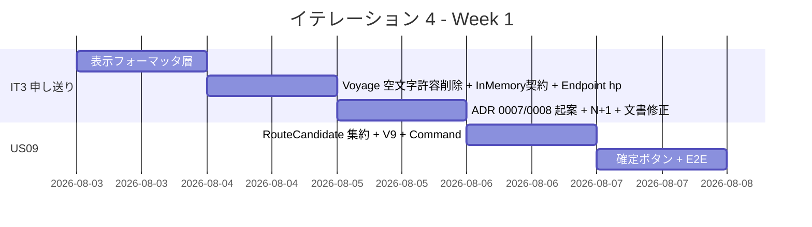
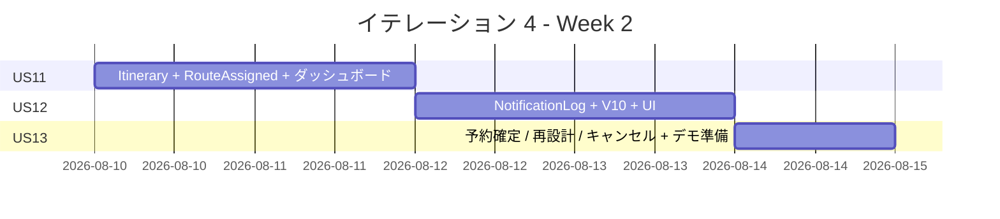
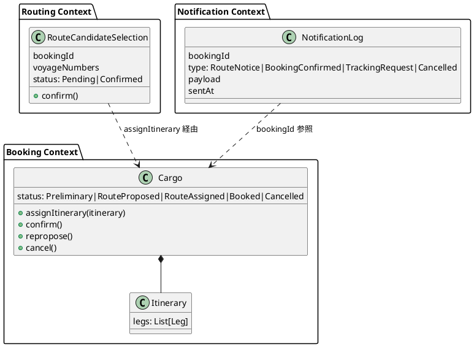
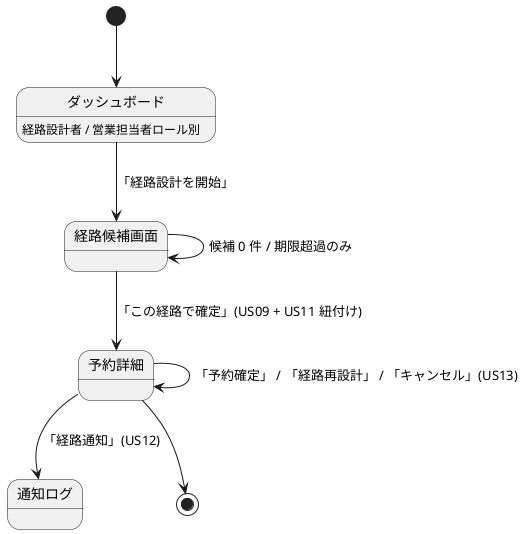

# イテレーション 4 計画

## 概要

| 項目 | 内容 |
|------|------|
| **イテレーション** | 4 |
| **期間** | Week 7-8（2026-08-03 〜 2026-08-16、2 週間） |
| **ゴール** | 経路選択確定（US09）から経路紐付け（US11）・荷主通知（US12）・予約確定（US13）までの Phase 2 後半業務導線を一気通貫で実装し、Release 0.2 をリリースする |
| **目標 SP** | 11（US09: 3 + US11: 2 + US12: 3 + US13: 3） |

---

## ゴール

### イテレーション終了時の達成状態

1. **経路選択確定（US09）**: 経路設計者が候補一覧から 1 件を選択すると経路が「確定」状態となり、予約に紐付けられる前提が成立する
2. **経路紐付け（US11）**: 確定経路を予約に紐付けると予約状態が「経路提案中」に遷移し、営業担当者ダッシュボードに表示される
3. **荷主通知（US12）**: 営業担当者が経路概要と料金概算を確認し、通知送信記録を残せる
4. **予約確定（US13）**: 荷主承認後に予約を「予約確定」状態へ遷移し、追跡番号発行依頼（IT5 前提）の通知ポイントを用意する
5. **業務導線完成**: ダッシュボード → 候補画面 → 選択確定 → 紐付け → 通知 → 確定の E2E が緑になる
6. **IT3 申し送り解消**: マルチパースペクティブレビュー高優先度のうち未対応 6 件を解消する

### 成功基準

- [ ] US09 / US11 / US12 / US13 の受入条件をすべて満たす
- [ ] 業務導線 E2E（ダッシュボード→候補画面→経路選択→予約確定）が緑
- [ ] new_coverage 80% 以上、Quality Gate PASS
- [ ] 表示フォーマッタ層（Money / Instant / UnLocode）が導入され、`Instant.toString` 生表示が画面から消える
- [ ] テストカバレッジ 80% 以上

---

## ユーザーストーリー

### 対象ストーリー

| ID | ユーザーストーリー | SP | 優先度 |
|----|-------------------|----|----|
| US09 | 経路を選択・確定する | 3 | 必須 |
| US11 | 経路情報を予約に紐付ける | 2 | 必須 |
| US12 | 確定経路を荷主に通知する | 3 | 中 |
| US13 | 予約を確定する | 3 | 必須 |
| **合計** | | **11** | |

### ストーリー詳細

#### US09: 経路を選択・確定する

> 経路設計者として、算出された経路候補から最適なものを選択し経路を確定したい。なぜなら、最適経路を正式に確定し予約への紐付けに進めるからだ。

**受入条件**:

1. 経路候補一覧（経由港・所要日数・費用・航海番号）を確認できる
2. 最適な経路候補を 1 件選択できる
3. 選択後、経路状態が「確定」になる
4. 最適な候補がない場合、経路条件調整（US10、IT9 予備）に進めるリンクを表示する

#### US11: 経路情報を予約に紐付ける

> 経路設計者として、確定した経路情報を貨物予約に紐付けたい。なぜなら、予約と経路の関連を確立し営業担当者が荷主にルート提案できるからだ。

**受入条件**:

1. 確定経路と予約番号を確認できる
2. 経路情報を予約に紐付ける操作を実行できる
3. 紐付け後、予約状態が `RouteAssigned`（経路提案中）に更新される

#### US12: 確定経路を荷主に通知する

> 営業担当者として、経路が予約に紐付けられた後、確定経路の詳細（経由港・所要日数・到着予定日）を荷主に通知したい。なぜなら、荷主が確定経路の内容を確認し承認または変更依頼を行えるからだ。

**受入条件**:

1. 予約番号を指定して紐付けられた経路情報を確認できる
2. 通知内容（経由港・所要日数・到着予定日・料金概算）を確認できる
3. 荷主への経路通知を送信できる
4. 通知送信記録が登録される

#### US13: 予約を確定する

> 営業担当者として、荷主がルートを承認したことを確認して予約を正式確定したい。なぜなら、荷主の同意を記録し追跡番号発行・輸送手配に進めるからだ。

**受入条件**:

1. 予約番号を指定して予約内容と選択ルートを確認できる
2. 確定操作を行うと予約状態が `Confirmed`（予約確定）に更新される
3. 経路設計者に追跡番号発行依頼の通知が送信される（IT5 前提のため通知ログのみ）
4. 荷主がルート変更を希望する場合、予約を `RouteProposed`（経路設計中）に戻せる
5. 荷主がキャンセルを希望する場合、予約を `Cancelled` 状態に変更できる
6. キャンセル時、荷主にキャンセル確認通知が送信される

### タスク

#### 0. IT3 申し送り（マルチパースペクティブレビュー高優先度残）

| # | タスク | 見積もり | 状態 |
|---|--------|---------|------|
| 0.1 | 表示フォーマッタ層（`Money` / `Instant` / `UnLocode + 港名`）を `views.helpers` 配下に導入し、既存画面（経路候補・航海検索）を移行 | 4h | [ ] |
| 0.2 | `Voyage.register(2 引数)` / `reconstruct(3 引数)` の空文字許容オーバーロードを削除し、V8 で `DEFAULT ''` を撤去（必須化）。フィクスチャを必須引数版に更新 | 3h | [ ] |
| 0.3 | `RouteCandidateQueryServiceSpec` の `InMemoryVoyageRepository.findByCriteria` を引数フィルタ実装に置き換え、契約テストパターンを `support/InMemoryRepositories` に整理 | 3h | [ ] |
| 0.4 | `RouteCandidateEndpointSpec` に「seed なし 200 + 空表示」ハッピーパス追加 | 1h | [ ] |
| 0.5 | 楽観ロック `Either[DomainError.ConcurrentModification, A]` API 化の ADR 0007 起案（実装は IT5 以降に申し送り） | 2h | [ ] |
| 0.6 | ArchUnit ルール 4 を `*QueryService` / `*Query` / `*Result` 許容に拡張し、`CalculateRouteCommand` 等を `queryservices` に戻す ADR 化 | 3h | [ ] |
| 0.7 | `Estimate.findAll` の N+1 解消（estimate + route_candidate を一括 SELECT で取得） | 2h | [ ] |
| 0.8 | iteration_plan-3.md L344 の VARCHAR 桁数表記不一致と L601-604 重複 ADR 表の修正 | 1h | [ ] |
| 0.9 | **設計ドキュメント整合化**: (a) `BookingStatus` に `RouteAssigned` 追加を `domain-model.md` に反映、(b) `route_candidate_selection` / `notification_log` テーブルを `data-model.md` に追記、(c) `ui_design.md` の経路画面 URL を `/bookings/:id/route` → `/bookings/:id/routes` に統一（IT3 実装乖離の解消）、(d) ui_design.md の予約詳細ボタン表に「経路を確定」(US09) を追記 | 3h | [ ] |

**小計**: 22h

> **保留事項（IT4 スコープ外）**:
>
> - IT3 レビュー高 #2「予約番号→検索画面の事前充填導線」は、US09 で経路候補画面から直接「この経路で確定」できるため IT4 では不要。US11 完了後に経路条件再調整（US10、IT9 予備）で再算出する流れに合わせて IT5 で再評価する。

#### 1. US09 経路選択・確定（3 SP）

| # | タスク | 見積もり | 状態 |
|---|--------|---------|------|
| 1.1 | `RouteCandidate` を集約として永続化する設計判断 + ADR 0008（集約境界）。経路状態 `Pending`/`Confirmed` enum を Routing Context に追加 | 3h | [ ] |
| 1.2 | Flyway V9: `route_candidate_selection`（id / booking_id / voyage_numbers / status / version / 監査）テーブル追加 | 1h | [ ] |
| 1.3 | `SelectRouteCommand` + `RoutingCommandService.confirmRoute(bookingId, candidateIndex)` 実装 | 4h | [ ] |
| 1.4 | 経路候補画面（IT3 タスク 2.7）に「この経路で確定」ボタンを各行に追加。POST `/bookings/:id/routes/:idx/confirm`（PRG） | 3h | [ ] |
| 1.5 | 統合 + E2E テスト（直行を確定 / 中継を確定 / 0 件時の US10 リンク表示） | 3h | [ ] |

**小計**: 14h

#### 2. US11 経路情報を予約に紐付ける（2 SP）

| # | タスク | 見積もり | 状態 |
|---|--------|---------|------|
| 2.1 | `Cargo.assignItinerary(itinerary)` + `Itinerary` 値オブジェクト（経路選択結果の Booking 側 ACL） | 3h | [ ] |
| 2.2 | `BookingStatus.RouteAssigned` 追加と canTransitionTo の遷移マトリクス拡張 | 2h | [ ] |
| 2.3 | US09 完了後に自動で予約紐付けを実行（同一トランザクション）。または別 Command に分離する判断 | 2h | [ ] |
| 2.4 | 営業担当者ダッシュボードに `RouteAssigned` 一覧を追加 | 2h | [ ] |
| 2.5 | テスト（紐付け成功 / 既に確定済予約への再紐付け禁止） | 2h | [ ] |

**小計**: 11h

#### 3. US12 確定経路を荷主に通知（3 SP）

| # | タスク | 見積もり | 状態 |
|---|--------|---------|------|
| 3.1 | `NotificationLog` 集約（Notification Context 新設または Booking 内エンティティ）。MailHog 経由のメール送信は IT5 以降、IT4 は DB ログのみ | 3h | [ ] |
| 3.2 | Flyway V10: `notification_log`（id / booking_id / type / sent_at / payload / version / 監査）追加 | 1h | [ ] |
| 3.3 | `NotifyRouteCommandService.notify(bookingId)` 実装（経路概要 + 料金概算をペイロード化） | 3h | [ ] |
| 3.4 | 営業ダッシュボードに「経路通知」ボタンを追加、`/bookings/:id/notifications` で通知ログ閲覧 | 3h | [ ] |
| 3.5 | テスト（通知ログ登録 / 未紐付け予約の通知拒否） | 2h | [ ] |

**小計**: 12h

#### 4. US13 予約確定（3 SP）

| # | タスク | 見積もり | 状態 |
|---|--------|---------|------|
| 4.1 | `BookingStatus.Confirmed`（既存）/ `Cancelled`（既存）の canTransitionTo 拡張（RouteAssigned → Confirmed / Cancelled / RouteProposed） | 2h | [ ] |
| 4.2 | `ConfirmBookingCommand` / `ReproposeRouteCommand` / `CancelBookingCommand` の 3 コマンド追加 | 4h | [ ] |
| 4.3 | 予約詳細画面に「予約確定」「経路再設計に戻す」「キャンセル」ボタンを RouteAssigned 状態の予約に表示 | 3h | [ ] |
| 4.4 | 各操作後の `NotificationLog` 記録（追跡番号発行依頼通知 / キャンセル確認通知） | 2h | [ ] |
| 4.5 | 統合 + E2E テスト（確定パス / 再設計パス / キャンセルパス） | 3h | [ ] |

**小計**: 14h

#### タスク合計

| カテゴリ | SP | 理想時間 |
|---------|----|----|
| IT3 申し送り（0.x） | - | 22h |
| US09 経路選択・確定 | 3 | 14h |
| US11 経路情報紐付け | 2 | 11h |
| US12 荷主通知 | 3 | 12h |
| US13 予約確定 | 3 | 14h |
| **合計** | **11** | **73h** |

**1 SP あたり**: 約 6.4h（IT3 申し送り含む / 機能タスクのみなら 4.6h）
**進捗率**: 0% (0/11 SP)

---

## スケジュール

### Week 1（Day 1-5）



| 日 | タスク |
|----|--------|
| Day 1 | 0.1 表示フォーマッタ層導入 |
| Day 2 | 0.2 / 0.3 / 0.4 |
| Day 3 | 0.5 / 0.6 / 0.7 / 0.8 |
| Day 4 | 1.1-1.3 US09 ドメイン + Command |
| Day 5 | 1.4-1.5 US09 UI + E2E |

### Week 2（Day 6-10）



| 日 | タスク |
|----|--------|
| Day 6 | 2.1-2.3 US11 ドメイン + 紐付け |
| Day 7 | 2.4-2.5 US11 UI + テスト |
| Day 8 | 3.1-3.3 US12 NotificationLog |
| Day 9 | 3.4-3.5 US12 UI + テスト + 4.1-4.2 US13 ドメイン |
| Day 10 | 4.3-4.5 US13 UI + E2E + 統合テスト + デモ準備 |

---

## 設計

### ドメインモデル（追加分）



### データモデル（追加分）

```sql
-- V9
CREATE TABLE route_candidate_selection (
  id BIGSERIAL PRIMARY KEY,
  booking_id VARCHAR(20) NOT NULL,
  voyage_numbers VARCHAR(255) NOT NULL,  -- カンマ区切り
  status VARCHAR(20) NOT NULL CHECK (status IN ('Pending','Confirmed')),
  version INT NOT NULL DEFAULT 0,
  created_at TIMESTAMP NOT NULL DEFAULT CURRENT_TIMESTAMP,
  updated_at TIMESTAMP NOT NULL DEFAULT CURRENT_TIMESTAMP,
  UNIQUE(booking_id)
);

-- V10
CREATE TABLE notification_log (
  id BIGSERIAL PRIMARY KEY,
  booking_id VARCHAR(20) NOT NULL,
  type VARCHAR(30) NOT NULL,
  payload TEXT NOT NULL,
  sent_at TIMESTAMP NOT NULL DEFAULT CURRENT_TIMESTAMP,
  version INT NOT NULL DEFAULT 0,
  created_at TIMESTAMP NOT NULL DEFAULT CURRENT_TIMESTAMP,
  updated_at TIMESTAMP NOT NULL DEFAULT CURRENT_TIMESTAMP
);
CREATE INDEX idx_notification_log_booking ON notification_log (booking_id, sent_at DESC);
```

### ユーザーインターフェース（変更）

#### 画面遷移（追加・変更）



#### htmx パターン

- US09 確定: 通常 POST + PRG（経路候補画面 → 予約詳細へ flash success）
- US12 通知ボタン: htmx で確認モーダル + POST `/bookings/:id/notify-route` → 通知ログ部分更新

### ADR

| ADR | タイトル | ステータス |
|-----|---------|-----------|
| [ADR 0007](../adr/0007-optimistic-lock-either-api.md) | 楽観ロック失敗を Either API に統一 | 提案（IT4 で起案 / 実装は IT5+） |
| [ADR 0008](../adr/0008-route-candidate-aggregate-boundary.md) | RouteCandidateSelection を Routing Context の集約として独立 | 提案 |

---

## リスクと対策

| リスク | 影響度 | 対策 |
|--------|--------|------|
| 集約境界の判断（RouteCandidateSelection vs Cargo.itinerary）が IT4 内で揺れる | 中 | Day 4 朝に ADR 0008 で意思決定し以降変更しない |
| NotificationLog を独立コンテキスト化するか Booking 内に収めるかで遅延 | 中 | IT4 は Booking 内のシンプル実装 + 独立化判断は IT5 以降に申し送り |
| 予約確定の状態遷移マトリクス拡張で既存テストが壊れる | 中 | canTransitionTo の網羅テスト（IT2 同様）を 4.1 で先に書く |
| IT3 申し送り 19h が機能タスクを圧迫 | 中 | Day 1-3 で申し送りを集中消化 / 圧迫時は 0.7 N+1 解消を IT5 へ申し送り |

---

## 完了条件

### Definition of Done

- [ ] 全タスクのコード変更が完了
- [ ] ユニット / 統合 / E2E テストがパス（new_coverage 80% 以上）
- [ ] **業務導線 E2E**（ダッシュボード→候補画面→経路選択→紐付け→通知→予約確定）が緑（IT3 ふりかえり T1）
- [ ] **計画書 vs 実装の差分セルフチェック完了**（IT3 ふりかえり T3）
- [ ] **ArchUnit / DDD 配置の判断はすべて ADR 化**（IT3 ふりかえり T4）
- [ ] scalafmt / scalafix エラーなし
- [ ] SonarQube Quality Gate PASS（Bug 0 / Vulnerability 0 / Code Smell 0 / 重複 < 3%）
- [ ] ドキュメント更新完了（domain-model.md / data-model.md / ui_design.md への反映、release_plan.md の進捗更新）
- [ ] **validating-iteration-plan 検証で不整合 0 件**（IT4 で発覚した domain-model/ui_design 乖離をすべて解消したこと）

### デモ項目

1. 経路設計者が経路候補画面から「この経路で確定」を押すと予約が `RouteAssigned` に遷移
2. 営業担当者が「経路通知」を押すと通知ログに記録される
3. 営業担当者が「予約確定」を押すと予約が `Confirmed` 状態へ遷移し、追跡番号発行依頼通知が記録される
4. キャンセル時に予約状態が `Cancelled` に遷移し通知ログが残る

---

## 更新履歴

| 日付 | 更新内容 | 更新者 |
|------|---------|--------|
| 2026-06-21 | 初版作成（IT3 ふりかえりの Try 6 件 + IT3 マルチパースペクティブレビュー高 6 件を IT3 申し送り 0.x に取り込み、US09-US13 を機能タスクとして計画）| AI Agent |
| 2026-06-21 | validating-iteration-plan 検証反映: (a) US13 状態名を `Booked` → `Confirmed` に修正（domain-model.md 整合）、(b) US11 紐付け状態は `RouteAssigned` を新規追加（既存 enum 拡張）、(c) US12 通知 URL を `/notify-route` に統一（ui_design.md L634 整合）、(d) 0.9 で domain-model.md / data-model.md / ui_design.md への反映タスク追加、(e) 保留事項として IT3 レビュー高 #2 を明記、合計 73h | AI Agent |

---

## 関連ドキュメント

- [リリース計画](./release_plan.md)
- [IT3 計画](./iteration_plan-3.md)
- [IT3 完了報告書](./iteration_report-3.md)
- [IT3 ふりかえり](./retrospective-3.md)
- [IT3 マルチパースペクティブレビュー](../review/it3_implementation_review_20260621.md)
