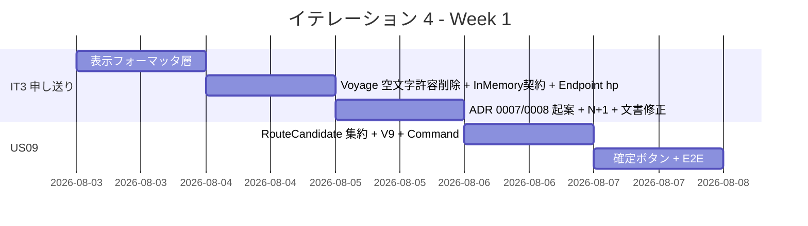
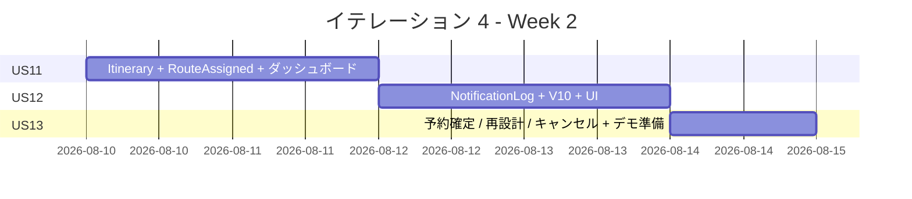
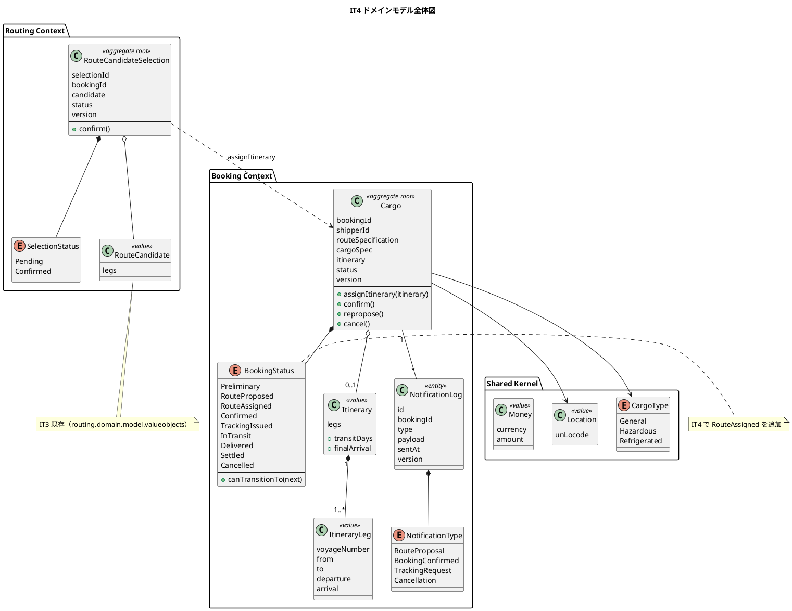
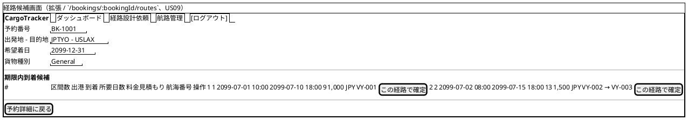
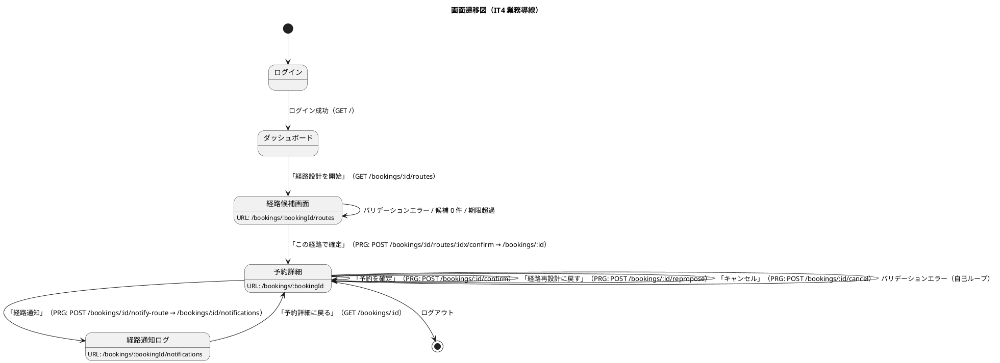

# イテレーション 4 計画

## 概要

| 項目 | 内容 |
|------|------|
| **イテレーション** | 4 |
| **期間** | Week 7-8（2026-08-03 〜 2026-08-16、2 週間） |
| **ゴール** | 経路選択確定（US09）から経路紐付け（US11）・荷主通知（US12）・予約確定（US13）までの Phase 2 後半業務導線を一気通貫で実装し、Release 0.2 をリリースする |
| **目標 SP** | 11（US09: 3 + US11: 2 + US12: 3 + US13: 3） |

---

## ゴール

### イテレーション終了時の達成状態

1. **経路選択確定（US09）**: 経路設計者が候補一覧から 1 件を選択すると経路が「確定」状態となり、予約に紐付けられる前提が成立する
2. **経路紐付け（US11）**: 確定経路を予約に紐付けると予約状態が「経路提案中」に遷移し、営業担当者ダッシュボードに表示される
3. **荷主通知（US12）**: 営業担当者が経路概要と料金概算を確認し、通知送信記録を残せる
4. **予約確定（US13）**: 荷主承認後に予約を「予約確定」状態へ遷移し、追跡番号発行依頼（IT5 前提）の通知ポイントを用意する
5. **業務導線完成**: ダッシュボード → 候補画面 → 選択確定 → 紐付け → 通知 → 確定の E2E が緑になる
6. **IT3 申し送り解消**: マルチパースペクティブレビュー高優先度のうち未対応 6 件を解消する

### 成功基準

- [ ] US09 / US11 / US12 / US13 の受入条件をすべて満たす
- [ ] 業務導線 E2E（ダッシュボード→候補画面→経路選択→予約確定）が緑
- [ ] new_coverage 80% 以上、Quality Gate PASS
- [ ] 表示フォーマッタ層（Money / Instant / UnLocode）が導入され、`Instant.toString` 生表示が画面から消える
- [ ] テストカバレッジ 80% 以上

---

## ユーザーストーリー

### 対象ストーリー

| ID | ユーザーストーリー | SP | 優先度 |
|----|-------------------|----|----|
| US09 | 経路を選択・確定する | 3 | 必須 |
| US11 | 経路情報を予約に紐付ける | 2 | 必須 |
| US12 | 確定経路を荷主に通知する | 3 | 中 |
| US13 | 予約を確定する | 3 | 必須 |
| **合計** | | **11** | |

### ストーリー詳細

#### US09: 経路を選択・確定する

> 経路設計者として、算出された経路候補から最適なものを選択し経路を確定したい。なぜなら、最適経路を正式に確定し予約への紐付けに進めるからだ。

**受入条件**:

1. 経路候補一覧（経由港・所要日数・費用・航海番号）を確認できる
2. 最適な経路候補を 1 件選択できる
3. 選択後、経路状態が「確定」になる
4. 最適な候補がない場合、経路条件調整（US10、IT9 予備）に進めるリンクを表示する

#### US11: 経路情報を予約に紐付ける

> 経路設計者として、確定した経路情報を貨物予約に紐付けたい。なぜなら、予約と経路の関連を確立し営業担当者が荷主にルート提案できるからだ。

**受入条件**:

1. 確定経路と予約番号を確認できる
2. 経路情報を予約に紐付ける操作を実行できる
3. 紐付け後、予約状態が `RouteAssigned`（経路提案中）に更新される

#### US12: 確定経路を荷主に通知する

> 営業担当者として、経路が予約に紐付けられた後、確定経路の詳細（経由港・所要日数・到着予定日）を荷主に通知したい。なぜなら、荷主が確定経路の内容を確認し承認または変更依頼を行えるからだ。

**受入条件**:

1. 予約番号を指定して紐付けられた経路情報を確認できる
2. 通知内容（経由港・所要日数・到着予定日・料金概算）を確認できる
3. 荷主への経路通知を送信できる
4. 通知送信記録が登録される

#### US13: 予約を確定する

> 営業担当者として、荷主がルートを承認したことを確認して予約を正式確定したい。なぜなら、荷主の同意を記録し追跡番号発行・輸送手配に進めるからだ。

**受入条件**:

1. 予約番号を指定して予約内容と選択ルートを確認できる
2. 確定操作を行うと予約状態が `Confirmed`（予約確定）に更新される
3. 経路設計者に追跡番号発行依頼の通知が送信される（IT5 前提のため通知ログのみ）
4. 荷主がルート変更を希望する場合、予約を `RouteProposed`（経路設計中）に戻せる
5. 荷主がキャンセルを希望する場合、予約を `Cancelled` 状態に変更できる
6. キャンセル時、荷主にキャンセル確認通知が送信される

### タスク

#### 0. IT3 申し送り（マルチパースペクティブレビュー高優先度残）

| # | タスク | 見積もり | 状態 |
|---|--------|---------|------|
| 0.1 | 表示フォーマッタ層（`Money` / `Instant` / `UnLocode + 港名`）を `views.helpers` 配下に導入し、既存画面（経路候補・航海検索）を移行 | 4h | [x] |
| 0.2 | `Voyage.register(2 引数)` / `reconstruct(3 引数)` の空文字許容オーバーロードを削除し、V8 で `DEFAULT ''` を撤去（必須化）。フィクスチャを必須引数版に更新 | 3h | [x] |
| 0.3 | `RouteCandidateQueryServiceSpec` の `InMemoryVoyageRepository.findByCriteria` を引数フィルタ実装に置き換え、契約テストパターンを `support/InMemoryRepositories` に整理 | 3h | [x] |
| 0.4 | `RouteCandidateEndpointSpec` に「seed なし 200 + 空表示」ハッピーパス追加 | 1h | [x] |
| 0.5 | 楽観ロック `Either[DomainError.ConcurrentModification, A]` API 化の ADR 0007 起案（実装は IT5 以降に申し送り） | 2h | [x] |
| 0.6 | ArchUnit ルール 4 を `*QueryService` / `*Query` / `*Result` 許容に拡張し、`CalculateRouteCommand` 等を `queryservices` に戻す ADR 化 | 3h | [x] |
| 0.7 | `Estimate.findAll` の N+1 解消（estimate + route_candidate を一括 SELECT で取得） | 2h | [x] |
| 0.8 | iteration_plan-3.md L344 の VARCHAR 桁数表記不一致と L601-604 重複 ADR 表の修正 | 1h | [x] |
| 0.9 | **設計ドキュメント整合化**: (a) `BookingStatus` に `RouteAssigned` 追加を `domain-model.md` に反映、(b) `route_candidate_selection` / `notification_log` テーブルを `data-model.md` に追記、(c) `ui_design.md` の経路画面 URL を `/bookings/:id/route` → `/bookings/:id/routes` に統一（IT3 実装乖離の解消）、(d) ui_design.md の予約詳細ボタン表に「経路を確定」(US09) を追記 | 3h | [x] |

**小計**: 22h

> **保留事項（IT4 スコープ外）**:
>
> - IT3 レビュー高 #2「予約番号→検索画面の事前充填導線」は、US09 で経路候補画面から直接「この経路で確定」できるため IT4 では不要。US11 完了後に経路条件再調整（US10、IT9 予備）で再算出する流れに合わせて IT5 で再評価する。

#### 1. US09 経路選択・確定（3 SP）

| # | タスク | 見積もり | 状態 |
|---|--------|---------|------|
| 1.1 | `RouteCandidate` を集約として永続化する設計判断 + ADR 0008（集約境界）。経路状態 `Pending`/`Confirmed` enum を Routing Context に追加 | 3h | [x] |
| 1.2 | Flyway V9: `route_candidate_selection`（id / booking_id / voyage_numbers / status / version / 監査）テーブル追加 | 1h | [x] |
| 1.3 | `SelectRouteCommand` + `RoutingCommandService.confirmRoute(bookingId, candidateIndex)` 実装 | 4h | [x] |
| 1.4 | 経路候補画面（IT3 タスク 2.7）に「この経路で確定」ボタンを各行に追加。POST `/bookings/:id/routes/:idx/confirm`（PRG） | 3h | [x] |
| 1.5 | 統合 + E2E テスト（直行を確定 / 中継を確定 / 0 件時の US10 リンク表示） | 3h | [x] |

**小計**: 14h

#### 2. US11 経路情報を予約に紐付ける（2 SP）

| # | タスク | 見積もり | 状態 |
|---|--------|---------|------|
| 2.1 | `Cargo.assignItinerary(itinerary)` + `Itinerary` 値オブジェクト（経路選択結果の Booking 側 ACL） | 3h | [x] |
| 2.2 | `BookingStatus.RouteAssigned` 追加と canTransitionTo の遷移マトリクス拡張 | 2h | [x] |
| 2.3 | US09 完了後に自動で予約紐付けを実行（同一トランザクション）。または別 Command に分離する判断 | 2h | [x] |
| 2.4 | 営業担当者ダッシュボードに `RouteAssigned` 一覧を追加 | 2h | [x] |
| 2.5 | テスト（紐付け成功 / 既に確定済予約への再紐付け禁止） | 2h | [x] |

**小計**: 11h

#### 3. US12 確定経路を荷主に通知（3 SP）

| # | タスク | 見積もり | 状態 |
|---|--------|---------|------|
| 3.1 | `NotificationLog` 集約（Notification Context 新設または Booking 内エンティティ）。MailHog 経由のメール送信は IT5 以降、IT4 は DB ログのみ | 3h | [x] |
| 3.2 | Flyway V11: `notification_log`（id / booking_id / type / sent_at / payload / version / 監査）追加 — V10 を cargo.itinerary_voyages に充てたため繰り下げ | 1h | [x] |
| 3.3 | `NotifyRouteCommandService.notify(bookingId)` 実装（経路概要 + 料金概算をペイロード化） | 3h | [x] |
| 3.4 | 営業ダッシュボードに「経路通知」ボタンを追加、`/bookings/:id/notifications` で通知ログ閲覧 | 3h | [x] |
| 3.5 | テスト（通知ログ登録 / 未紐付け予約の通知拒否） | 2h | [x] |

**小計**: 12h

#### 4. US13 予約確定（3 SP）

| # | タスク | 見積もり | 状態 |
|---|--------|---------|------|
| 4.1 | `BookingStatus.Confirmed`（既存）/ `Cancelled`（既存）の canTransitionTo 拡張（RouteAssigned → Confirmed / Cancelled / RouteProposed） | 2h | [ ] |
| 4.2 | `ConfirmBookingCommand` / `ReproposeRouteCommand` / `CancelBookingCommand` の 3 コマンド追加 | 4h | [ ] |
| 4.3 | 予約詳細画面に「予約確定」「経路再設計に戻す」「キャンセル」ボタンを RouteAssigned 状態の予約に表示 | 3h | [ ] |
| 4.4 | 各操作後の `NotificationLog` 記録（追跡番号発行依頼通知 / キャンセル確認通知） | 2h | [ ] |
| 4.5 | 統合 + E2E テスト（確定パス / 再設計パス / キャンセルパス） | 3h | [ ] |

**小計**: 14h

#### タスク合計

| カテゴリ | SP | 理想時間 |
|---------|----|----|
| IT3 申し送り（0.x） | - | 22h |
| US09 経路選択・確定 | 3 | 14h |
| US11 経路情報紐付け | 2 | 11h |
| US12 荷主通知 | 3 | 12h |
| US13 予約確定 | 3 | 14h |
| **合計** | **11** | **73h** |

**1 SP あたり**: 約 6.4h（IT3 申し送り含む / 機能タスクのみなら 4.6h）
**進捗率**: 0% (0/11 SP)

---

## スケジュール

### Week 1（Day 1-5）



| 日 | タスク |
|----|--------|
| Day 1 | 0.1 表示フォーマッタ層導入 |
| Day 2 | 0.2 / 0.3 / 0.4 |
| Day 3 | 0.5 / 0.6 / 0.7 / 0.8 |
| Day 4 | 1.1-1.3 US09 ドメイン + Command |
| Day 5 | 1.4-1.5 US09 UI + E2E |

### Week 2（Day 6-10）



| 日 | タスク |
|----|--------|
| Day 6 | 2.1-2.3 US11 ドメイン + 紐付け |
| Day 7 | 2.4-2.5 US11 UI + テスト |
| Day 8 | 3.1-3.3 US12 NotificationLog |
| Day 9 | 3.4-3.5 US12 UI + テスト + 4.1-4.2 US13 ドメイン |
| Day 10 | 4.3-4.5 US13 UI + E2E + 統合テスト + デモ準備 |

---

## 設計

### ドメインモデル

IT2 で導入した Booking / Routing Context、IT3 で拡張した Routing Context を、IT4 では以下のとおり拡張する。`RouteCandidateSelection` 集約（Routing）を新設し、`Itinerary` 値オブジェクト（Booking ACL）で Routing 側決定結果を受領、`BookingStatus.RouteAssigned` を追加、`NotificationLog` エンティティ（Booking 内 / 将来 Notification Context 独立予定）を追加する。コマンド命名・遷移は domain-model.md（line 442 / 585-625 / 651）+ ADR 0007 / 0008（IT4 Day 3 作成予定）準拠。



#### 不変条件（IT4 追加分）

1. `BookingStatus.canTransitionTo` の状態遷移は以下のマトリクスで制約する（IT4 で `RouteAssigned` を追加）。
2. `Cargo.assignItinerary` は `RouteProposed` 状態でのみ呼び出せ、成功時に `RouteAssigned` へ遷移する。
3. `Cargo.confirm` は `RouteAssigned` 状態でのみ呼び出せ、成功時に `Confirmed` へ遷移する。
4. `Cargo.repropose` は `RouteAssigned` 状態でのみ呼び出せ、`RouteProposed` へ巻き戻す（itinerary は破棄）。
5. `Cargo.cancel` は `Preliminary / RouteProposed / RouteAssigned / Confirmed` のいずれかでのみ呼び出せ、`Cancelled` へ遷移する（`Confirmed → Cancelled` は IT2 で既に許可されている）。
6. `RouteCandidateSelection.confirm` は `Pending` 状態でのみ呼び出せ、`Confirmed` へ遷移する（楽観ロックで `version` を +1）。
7. `Itinerary.legs` は 1 件以上必須。隣接する leg の `to` と `from` が一致し、`arrival ≤ 次 leg の departure` の連結条件を満たす。
8. `NotificationLog` は 1 つの `Cargo` に対して時系列で append-only。削除・更新は不可（監査要件）。

#### BookingStatus 状態遷移マトリクス（IT4 拡張版）

| from \ to | Preliminary | RouteProposed | **RouteAssigned** | Confirmed | TrackingIssued | InTransit | Delivered | Settled | Cancelled |
|-----------|:-----------:|:-------------:|:-----------------:|:---------:|:--------------:|:---------:|:---------:|:-------:|:---------:|
| **Preliminary**   | - | ✓（US06）| - | - | - | - | - | - | ✓（US13 経由なし、IT2 既存）|
| **RouteProposed** | - | - | **✓（US11）** | - | - | - | - | - | ✓（IT2 既存）|
| **RouteAssigned** | - | **✓（US13 reprop）** | - | **✓（US13）** | - | - | - | - | **✓（US13）** |
| **Confirmed**     | - | - | - | - | ✓（US14、IT5）| - | - | - | ✓（IT2 既存）|
| **TrackingIssued** | - | - | - | - | - | ✓ | - | - | - |
| **InTransit**     | - | - | - | - | - | - | ✓ | - | - |
| **Delivered**     | - | - | - | - | - | - | - | ✓ | - |

太字は IT4 で新規追加する遷移。

### データモデル

IT3 までに作成した Flyway V1〜V8 に加えて、IT4 で V9 / V10 を追加する。命名規約（単数形テーブル / `id BIGSERIAL PK + 業務キー UK` / `version INT` / `created_at` `updated_at` 監査カラム / FK は `id` 参照）は data-model.md に準拠する。

#### V9: route_candidate_selection（US09）

```sql
CREATE TABLE route_candidate_selection (
  id BIGSERIAL PRIMARY KEY,
  selection_id VARCHAR(30) NOT NULL,
  booking_id VARCHAR(20) NOT NULL,
  status VARCHAR(20) NOT NULL CHECK (status IN ('Pending', 'Confirmed')),
  version INT NOT NULL DEFAULT 0,
  created_at TIMESTAMP NOT NULL DEFAULT CURRENT_TIMESTAMP,
  updated_at TIMESTAMP NOT NULL DEFAULT CURRENT_TIMESTAMP,
  CONSTRAINT uk_route_candidate_selection_selection_id UNIQUE (selection_id),
  CONSTRAINT uk_route_candidate_selection_booking UNIQUE (booking_id)
);
CREATE INDEX idx_route_candidate_selection_status ON route_candidate_selection (status);

-- 選択された経路の leg を子テーブルで保持（既存 carrier_movement と類似構造）
CREATE TABLE route_candidate_selection_leg (
  id BIGSERIAL PRIMARY KEY,
  selection_id BIGINT NOT NULL REFERENCES route_candidate_selection (id) ON DELETE CASCADE,
  seq_number INT NOT NULL,
  voyage_number VARCHAR(20) NOT NULL,
  departure_location_unlocode CHAR(5) NOT NULL,
  arrival_location_unlocode CHAR(5) NOT NULL,
  departure_time TIMESTAMP NOT NULL,
  arrival_time TIMESTAMP NOT NULL,
  created_at TIMESTAMP NOT NULL DEFAULT CURRENT_TIMESTAMP,
  updated_at TIMESTAMP NOT NULL DEFAULT CURRENT_TIMESTAMP,
  CONSTRAINT uk_route_candidate_selection_leg UNIQUE (selection_id, seq_number)
);
CREATE INDEX idx_rcs_leg_voyage ON route_candidate_selection_leg (voyage_number);
```

#### V10: notification_log（US12 / US13）+ cargo.itinerary 永続化（US11）

```sql
-- cargo 拡張: itinerary を子テーブルで保持（US11）
CREATE TABLE cargo_itinerary_leg (
  id BIGSERIAL PRIMARY KEY,
  cargo_id BIGINT NOT NULL REFERENCES cargo (id) ON DELETE CASCADE,
  seq_number INT NOT NULL,
  voyage_number VARCHAR(20) NOT NULL,
  departure_location_unlocode CHAR(5) NOT NULL,
  arrival_location_unlocode CHAR(5) NOT NULL,
  departure_time TIMESTAMP NOT NULL,
  arrival_time TIMESTAMP NOT NULL,
  created_at TIMESTAMP NOT NULL DEFAULT CURRENT_TIMESTAMP,
  updated_at TIMESTAMP NOT NULL DEFAULT CURRENT_TIMESTAMP,
  CONSTRAINT uk_cargo_itinerary_leg UNIQUE (cargo_id, seq_number)
);
CREATE INDEX idx_cargo_itinerary_leg_voyage ON cargo_itinerary_leg (voyage_number);

-- 通知ログ（US12 / US13）
CREATE TABLE notification_log (
  id BIGSERIAL PRIMARY KEY,
  cargo_id BIGINT NOT NULL REFERENCES cargo (id) ON DELETE CASCADE,
  notification_type VARCHAR(30) NOT NULL
    CHECK (notification_type IN ('RouteProposal', 'BookingConfirmed', 'TrackingRequest', 'Cancellation')),
  payload_json TEXT NOT NULL,
  sent_at TIMESTAMP NOT NULL DEFAULT CURRENT_TIMESTAMP,
  version INT NOT NULL DEFAULT 0,
  created_at TIMESTAMP NOT NULL DEFAULT CURRENT_TIMESTAMP,
  updated_at TIMESTAMP NOT NULL DEFAULT CURRENT_TIMESTAMP
);
CREATE INDEX idx_notification_log_cargo_sent_at ON notification_log (cargo_id, sent_at DESC);
CREATE INDEX idx_notification_log_type ON notification_log (notification_type);
```

#### 既存テーブル一覧（参考）

| テーブル | バージョン | IT |
|---------|----------|-----|
| user, shipper, cargo, voyage, carrier_movement, voyage_supported_cargo_type, estimate, route_candidate | V1-V8 | IT1-IT3 |
| **route_candidate_selection / route_candidate_selection_leg** | **V9** | **IT4** |
| **cargo_itinerary_leg / notification_log** | **V10** | **IT4** |

### ユーザーインターフェース

#### ビュー

ui_design.md（line 71-130）の画面一覧に IT4 で追加する 1 画面（経路通知ログ）と、拡張する 2 画面（経路候補画面 / 予約詳細）を反映する（タスク 0.9 で ui_design.md にも反映）。ナビバーは IT2 から継続。



#### 画面一覧（IT4 追加・拡張）

| 画面名 | URL | 説明 | アクセスロール | 関連 US |
|--------|-----|------|---------------|---------|
| 経路候補画面（拡張）| `/bookings/:bookingId/routes` | IT3 既存に「この経路で確定」ボタン追加 | RouteDesigner, MasterAdmin | **US09** |
| 予約詳細（拡張）| `/bookings/:bookingId` | itinerary 表示 / 通知履歴 / 確定・再設計・キャンセル | Sales, RouteDesigner | **US11 / US13** |
| 経路通知ログ（新規）| `/bookings/:bookingId/notifications` | 通知履歴一覧 | Sales, MasterAdmin | **US12** |

#### インタラクション



#### htmx パターン

| パターン | 採用箇所 | 実装 |
|---------|---------|------|
| 確認モーダル | 「予約を確定」「キャンセル」「経路再設計に戻す」 | Bootstrap modal + `data-bs-toggle` 後に通常 POST フォーム送信（誤操作防止） |
| 通常 POST + PRG | 「この経路で確定」「経路を荷主に通知」 | フォーム送信 → SEE_OTHER → 詳細画面に flash success/error |
| htmx 部分更新 | 経路通知ログの追記 | `hx-post="/bookings/:id/notify-route" hx-target="#notification-history" hx-swap="outerHTML"` で通知履歴の差し替え |
| htmx エラー処理 | 通知失敗 | `htmx:responseError` を listener で受け `#flash-area` に `alert-danger` 挿入 |

#### フィードバックメッセージ

| トリガー | スタイル | メッセージ例 |
|---------|---------|------------|
| US09 確定成功 | `alert-success` | 「経路 VY-001 → VY-002 を予約 BK-1001 に紐付けました」 |
| US09 候補なし | `alert-warning` | 「期限内に到着可能な経路がありません。経路条件を調整してください」 |
| US11 紐付け不正 | `alert-danger` | 「既に経路が紐付けられた予約には再紐付けできません」 |
| US12 通知送信成功 | `alert-success` | 「荷主への経路通知を送信しました（通知 ID: NT-0001）」 |
| US13 確定成功 | `alert-success` | 「予約 BK-1001 を確定しました。追跡番号発行依頼を経路設計者に通知しました」 |
| US13 キャンセル成功 | `alert-info` | 「予約 BK-1001 をキャンセルしました。荷主に確認通知を送信しました」 |
| 楽観ロック衝突 | `alert-danger` | 「他のユーザーが先に更新しました。画面を再読み込みしてください」 |

### ディレクトリ構成

IT3 までの構成に対し、IT4 で以下を追加する。

```text
apps/cargo-tracker/
├── app/
│   ├── cargotracker/
│   │   ├── booking/
│   │   │   ├── domain/model/
│   │   │   │   ├── aggregates/
│   │   │   │   │   ├── Cargo.scala                   # IT4 拡張: assignItinerary/confirm/repropose/cancel
│   │   │   │   │   └── BookingStatus.scala           # IT4 拡張: RouteAssigned 追加
│   │   │   │   ├── valueobjects/
│   │   │   │   │   ├── Itinerary.scala               # IT4 新規
│   │   │   │   │   └── ItineraryLeg.scala            # IT4 新規
│   │   │   │   └── entities/
│   │   │   │       ├── NotificationLog.scala         # IT4 新規
│   │   │   │       └── NotificationType.scala        # IT4 新規
│   │   │   ├── application/
│   │   │   │   ├── commandservices/
│   │   │   │   │   ├── BookingCommandService.scala   # IT4 拡張: confirm/repropose/cancel
│   │   │   │   │   ├── AssignItineraryCommand.scala  # IT4 新規
│   │   │   │   │   ├── ConfirmBookingCommand.scala   # IT4 新規
│   │   │   │   │   ├── CancelBookingCommand.scala    # IT4 新規
│   │   │   │   │   └── NotifyRouteCommand.scala      # IT4 新規
│   │   │   │   └── queryservices/
│   │   │   │       └── NotificationQueryService.scala # IT4 新規
│   │   │   ├── infrastructure/repositories/
│   │   │   │   ├── ScalikeJdbcCargoRepository.scala  # IT4 拡張: itinerary 永続化
│   │   │   │   └── ScalikeJdbcNotificationLogRepository.scala # IT4 新規
│   │   │   └── interfaces/web/
│   │   │       ├── BookingController.scala           # IT4 拡張: confirm/repropose/cancel/notify-route
│   │   │       └── NotificationLogController.scala   # IT4 新規
│   │   ├── routing/
│   │   │   ├── domain/model/
│   │   │   │   ├── aggregates/
│   │   │   │   │   └── RouteCandidateSelection.scala # IT4 新規
│   │   │   │   ├── valueobjects/
│   │   │   │   │   └── SelectionStatus.scala         # IT4 新規
│   │   │   │   └── repositories/
│   │   │   │       └── RouteCandidateSelectionRepository.scala # IT4 新規（ポート）
│   │   │   ├── application/
│   │   │   │   └── commandservices/
│   │   │   │       ├── RoutingCommandService.scala   # IT4 新規
│   │   │   │       └── SelectRouteCommand.scala      # IT4 新規
│   │   │   ├── infrastructure/repositories/
│   │   │   │   └── ScalikeJdbcRouteCandidateSelectionRepository.scala # IT4 新規
│   │   │   └── interfaces/web/
│   │   │       └── RouteCandidateController.scala    # IT4 拡張: 確定 POST 追加
│   │   └── shared/
│   │       └── interfaces/web/
│   │           └── views/
│   │               └── helpers/                       # IT4 新規（タスク 0.1）
│   │                   ├── MoneyFormat.scala
│   │                   ├── InstantFormat.scala
│   │                   └── LocationFormat.scala
│   └── views/
│       ├── booking/
│       │   ├── detail.scala.html                     # IT4 拡張: itinerary 表示 / 確定ボタン
│       │   ├── routes.scala.html                     # IT4 拡張: 確定ボタン
│       │   └── notifications.scala.html              # IT4 新規
│       └── layout/
│           └── _confirmation_modal.scala.html        # IT4 新規（共通モーダル）
├── conf/
│   ├── routes                                        # IT4 拡張: 6 エンドポイント追加
│   └── db/migration/default/
│       ├── V9__add_route_candidate_selection.sql     # IT4 新規
│       └── V10__add_itinerary_and_notification.sql   # IT4 新規
└── test/
    └── cargotracker/
        ├── booking/                                  # IT4 拡張テスト
        ├── routing/                                  # IT4 拡張テスト
        └── e2e/
            └── EndToEndBookingFlowSpec.scala         # IT4 新規（業務導線 E2E、IT3 ふりかえり T1）
```

### API 設計

| メソッド | エンドポイント | 説明 | 関連 US |
|---------|---------------|------|---------|
| POST | `/bookings/:bookingId/routes/:candidateIndex/confirm` | 経路候補を確定（PRG → 予約詳細） | US09 |
| POST | `/bookings/:bookingId/notify-route` | 経路を荷主に通知（PRG → 通知ログ） | US12 |
| POST | `/bookings/:bookingId/confirm` | 予約を確定（PRG → 予約詳細） | US13 |
| POST | `/bookings/:bookingId/repropose` | 経路再設計に戻す（PRG → 予約詳細） | US13 |
| POST | `/bookings/:bookingId/cancel` | 予約をキャンセル（PRG → 予約詳細） | US13 |
| GET | `/bookings/:bookingId/notifications` | 通知ログ画面 | US12 |

### ADR

| ADR | タイトル | ステータス | 関連タスク |
|-----|---------|-----------|------|
| [ADR 0007](../adr/0007-optimistic-lock-either-api.md) | 楽観ロック失敗を `Either[DomainError.ConcurrentModification, A]` API に統一（実装は IT5+） | 提案（IT4 Day 3 起案） | 0.5 |
| [ADR 0008](../adr/0008-route-candidate-aggregate-boundary.md) | `RouteCandidateSelection` を Routing Context の独立集約として定義（Cargo.itinerary は ACL 経由で受領） | 提案（IT4 Day 4 起案） | 1.1 |

---

## リスクと対策

| リスク | 影響度 | 対策 |
|--------|--------|------|
| 集約境界の判断（RouteCandidateSelection vs Cargo.itinerary）が IT4 内で揺れる | 中 | Day 4 朝に ADR 0008 で意思決定し以降変更しない |
| NotificationLog を独立コンテキスト化するか Booking 内に収めるかで遅延 | 中 | IT4 は Booking 内のシンプル実装 + 独立化判断は IT5 以降に申し送り |
| 予約確定の状態遷移マトリクス拡張で既存テストが壊れる | 中 | canTransitionTo の網羅テスト（IT2 同様）を 4.1 で先に書く |
| IT3 申し送り 19h が機能タスクを圧迫 | 中 | Day 1-3 で申し送りを集中消化 / 圧迫時は 0.7 N+1 解消を IT5 へ申し送り |

---

## 完了条件

### Definition of Done

- [ ] 全タスクのコード変更が完了
- [ ] ユニット / 統合 / E2E テストがパス（new_coverage 80% 以上）
- [ ] **業務導線 E2E**（ダッシュボード→候補画面→経路選択→紐付け→通知→予約確定）が緑（IT3 ふりかえり T1）
- [ ] **計画書 vs 実装の差分セルフチェック完了**（IT3 ふりかえり T3）
- [ ] **ArchUnit / DDD 配置の判断はすべて ADR 化**（IT3 ふりかえり T4）
- [ ] scalafmt / scalafix エラーなし
- [ ] SonarQube Quality Gate PASS（Bug 0 / Vulnerability 0 / Code Smell 0 / 重複 < 3%）
- [ ] ドキュメント更新完了（domain-model.md / data-model.md / ui_design.md への反映、release_plan.md の進捗更新）
- [ ] **validating-iteration-plan 検証で不整合 0 件**（IT4 で発覚した domain-model/ui_design 乖離をすべて解消したこと）

### デモ項目

1. 経路設計者が経路候補画面から「この経路で確定」を押すと予約が `RouteAssigned` に遷移
2. 営業担当者が「経路通知」を押すと通知ログに記録される
3. 営業担当者が「予約確定」を押すと予約が `Confirmed` 状態へ遷移し、追跡番号発行依頼通知が記録される
4. キャンセル時に予約状態が `Cancelled` に遷移し通知ログが残る

---

## 更新履歴

| 日付 | 更新内容 | 更新者 |
|------|---------|--------|
| 2026-06-21 | 初版作成（IT3 ふりかえりの Try 6 件 + IT3 マルチパースペクティブレビュー高 6 件を IT3 申し送り 0.x に取り込み、US09-US13 を機能タスクとして計画）| AI Agent |
| 2026-06-21 | validating-iteration-plan 検証反映: (a) US13 状態名を `Booked` → `Confirmed` に修正（domain-model.md 整合）、(b) US11 紐付け状態は `RouteAssigned` を新規追加（既存 enum 拡張）、(c) US12 通知 URL を `/notify-route` に統一（ui_design.md L634 整合）、(d) 0.9 で domain-model.md / data-model.md / ui_design.md への反映タスク追加、(e) 保留事項として IT3 レビュー高 #2 を明記、合計 73h | AI Agent |
| 2026-06-21 | 設計セクションを iteration_plan-3.md と同レベルに拡充: (a) ドメインモデル全体図を全コンテキスト + 不変条件 8 件 + BookingStatus 状態遷移マトリクスで再構成、(b) データモデルを V9（route_candidate_selection + leg 子表）/ V10（cargo_itinerary_leg + notification_log）の完全 SQL DDL に拡張、(c) UI 設計に salt ワイヤーフレーム 3 画面 + 画面一覧 + 画面遷移図 + htmx パターン表 + フィードバックメッセージ表、(d) ディレクトリ構成の追加・拡張ファイル一覧、(e) API 設計 6 エンドポイント表、(f) ADR 0007/0008 関連タスク表 | AI Agent |

---

## 関連ドキュメント

- [リリース計画](./release_plan.md)
- [IT3 計画](./iteration_plan-3.md)
- [IT3 完了報告書](./iteration_report-3.md)
- [IT3 ふりかえり](./retrospective-3.md)
- [IT3 マルチパースペクティブレビュー](../review/it3_implementation_review_20260621.md)
