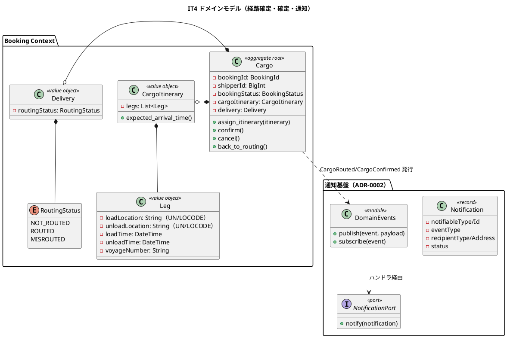
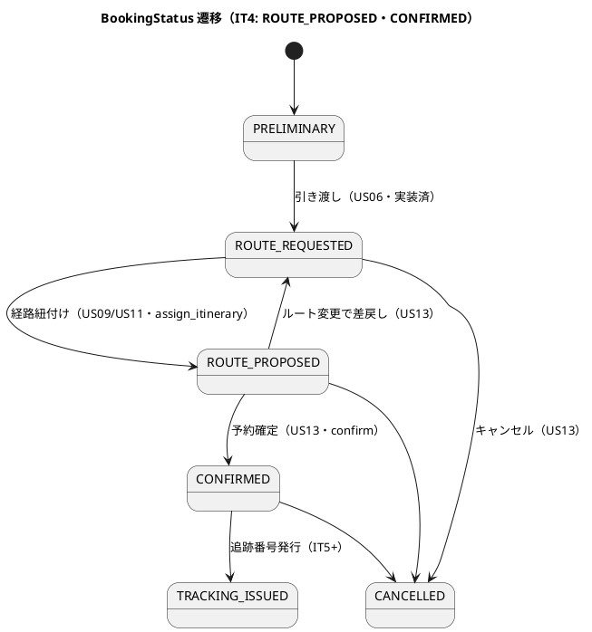
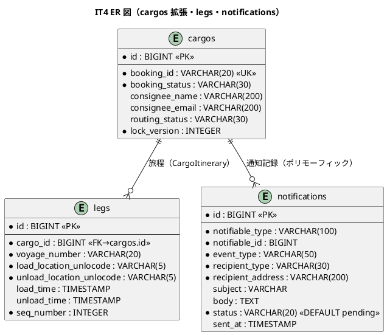
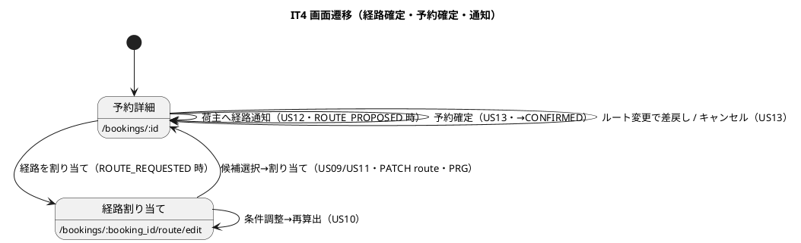

# イテレーション 4 計画 - 経路確定 + 予約確定 + 通知基盤

## ゴール

Booking Context の CargoItinerary（旅程）と BookingStatus 状態遷移（ROUTE_PROPOSED→CONFIRMED）を確立し、経路選択・確定（US09）・条件調整再算出（US10）・経路紐付け（US11）・確定経路の荷主通知（US12）・予約確定（US13）を中盤インサイドアウトで TDD 完成させる。あわせて ADR-0002 のドメインイベント駆動通知基盤（DomainEvents・NotificationPort・notifications テーブル）を初回実装する。Release 0.2 を出す。

- **局面**: 中盤（インサイドアウト）— [development_strategy.md](development_strategy.md) 参照
- **期間**: Week 7-8（2026-08-24 〜 2026-09-06）
- **目標 SP**: 15

## 対象ストーリー

| US | 概要 | SP | BC | 対応 UC |
|:---|:-----|:--|:---|:--------|
| US09 | 経路を選択・確定する | 3 | Booking / Routing | UC07 |
| US10 | 経路条件を調整して再算出する | 3 | Routing | UC08 |
| US11 | 経路情報を予約に紐付ける | 3 | Booking | UC09 |
| US12 | 確定経路を荷主に通知する | 3 | Booking（通知基盤） | UC10 |
| US13 | 予約を確定する | 3 | Booking | UC11 |

（release_plan.md Phase 2 / IT4 と一致）

## 受入条件

[user_story.md](../requirements/user_story.md) の受け入れ基準に準拠（全文）。

**US09 経路を選択・確定する**（として: 経路設計者。MVP では営業担当者が経路割り当て画面で代替）

- [ ] 経路候補一覧（経由港・所要日数・費用・航海番号）を確認できる
- [ ] 最適な経路候補を 1 件選択できる
- [ ] 選択後、経路状態が「確定」になる
- [ ] 最適な候補がない場合、経路条件調整（US10）に進める

**US10 経路条件を調整して再算出する**（として: 経路設計者）

- [ ] 現在の制約条件（期限・経由地制限等）を確認できる
- [ ] 条件を調整（期限延長・経由地追加・貨物種別変更等）して再算出を実行できる
- [ ] 調整後の条件で新たな経路候補が算出・提示される
- [ ] 調整後も条件を満たす経路がない場合、営業担当者に荷主との条件協議を依頼できる

**US11 経路情報を予約に紐付ける**（として: 経路設計者）

- [ ] 確定経路と予約番号を確認できる
- [ ] 経路情報を予約に紐付ける操作を実行できる
- [ ] 紐付け後、予約状態が「経路提案中」（ROUTE_PROPOSED）に更新される

**US12 確定経路を荷主に通知する**（として: 営業担当者）

- [ ] 予約番号を指定して紐付けられた経路情報を確認できる
- [ ] 通知内容（経由港・所要日数・到着予定日・料金概算）を確認できる
- [ ] 荷主への経路通知を送信できる
- [ ] 通知送信記録が登録される

**US13 予約を確定する**（として: 営業担当者）

- [ ] 予約番号を指定して予約内容と選択ルートを確認できる
- [ ] 確定操作を行うと予約状態が「予約確定」（CONFIRMED）に更新される
- [ ] 経路設計者に追跡番号発行依頼の通知が送信される
- [ ] 荷主がルート変更を希望する場合、予約を「経路設計中」（ROUTE_REQUESTED）に戻せる
- [ ] 荷主がキャンセルを希望する場合、予約をキャンセル状態に変更できる
- [ ] キャンセル時、荷主にキャンセル確認通知が送信される

## タスク分解（インサイドアウト）

中盤はデータ層 → ドメイン層 → アプリケーション → UI の順で貫通する。

### 技術的負債の返済枠（IT3 ふりかえり Try・序盤で先着手）

- [ ] 【T16】CI 相当のローカル検証を標準化（`db:drop db:prepare`（seed 込み）+ eager load + `--order random`）をクローズ前チェック手順に明記
- [ ] 【T17】Location 実在検証を Booking のアプリ層に配線（`Shared::Public::LocationDirectory#exists?`）・`booking/package.yml` に `packs/shared` 依存宣言（共有カーネルの実消費）
- [ ] 【T18】公開 API が内部 VO を素通しさせない射影規律（`RouteCandidate`・`CargoItinerary` の公開ビュー射影）
- [ ] 【T19】経路候補 UI に到着予定日・費用・運送会社を表示、フォールバック費用/バッジの語義改善（US09 の候補選択で活用）
- [ ] 【T21】voyages 楽観ロック（lock_version）と RegisterVoyage/UpdateSchedule の DRY・Voyage/Cargo に reconstitute 分離
- [ ] 【T23】ドメインイベント命名の統一（`CargoRouted`/`CargoBooked`/`CargoConfirmed` 等）を domain-model/architecture/test_strategy に反映・README を IT3/IT4 到達点に更新
- [ ] 【T22】US25 差分確認画面・US08 寄港地接続評価（フォールバック多区間）を実装（受入基準の完全充足）。US10 再算出と同時に独立コミット枠で対応（「余力次第」にしない）

> 【T20】航海登録の入力補助（港名サジェスト・日時ピッカー・多区間対応）・航海検索の港名/部分一致は **IT5 スコープに移す**（UI 磨き込みで IT4 の中核=経路確定/通知基盤とは独立。release_plan に反映）。

### データ層（通知基盤・cargos 拡張）

- [ ] `notifications` テーブル migration（ADR-0002・ポリモーフィック `notifiable`・`event_type`・`recipient_type`/`recipient_address`・`subject`/`body`・`status` pending/sent/failed・`sent_at`）
- [ ] `cargos` に `consignee_name`/`consignee_email`（US12 通知先）・`routing_status`（NOT_ROUTED/ROUTED/MISROUTED）カラム追加（data-model IT4+ 予定分）
- [ ] `legs` テーブル（作成済・未使用）を CargoItinerary 永続化に活用

### ドメイン層（CargoItinerary・状態遷移・イベント）

- [ ] `Leg`（loadLocation/unloadLocation/loadTime/unloadTime/voyageNumber）・`CargoItinerary`（legs 一覧・連結制約 `Leg[n].unload == Leg[n+1].load`・`expected_arrival_time`）値オブジェクトのユニット spec
- [ ] `Cargo#assign_itinerary`（US09/US11・ROUTE_REQUESTED→ROUTE_PROPOSED・`route_specification.satisfied_by?(itinerary)` を満たさなければ `InvalidItineraryError`）
- [ ] `Cargo#confirm`（US13・ROUTE_PROPOSED→CONFIRMED）・`Cargo#cancel`（任意→CANCELLED）・`Cargo#back_to_routing`（US13 ルート変更・ROUTE_PROPOSED→ROUTE_REQUESTED）
- [ ] `RouteSpecification#satisfied_by?`（旅程が出発地・目的地・期限を満たすか）
- [ ] `BookingStatus` に `route_proposed?`/`confirmed?` 述語追加、ROUTE_PROPOSED→ROUTE_REQUESTED の差戻し遷移
- [ ] `DomainEvents` モジュール（ADR-0002・ActiveSupport::Notifications ラップ・`publish`/`subscribe`・イベント名 `domain_event.<snake_case>`・ペイロードはプリミティブ Hash）
- [ ] `NotificationPort`（出力ポート）＋ `Notification`（送信記録レコード・非集約）・`ActiveRecordNotificationRepository`（notifications 永続化）

### アプリケーション（ユースケース・イベントハンドラ）

- [ ] `AssignItinerary` ユースケース（US09/US11・経路候補選択→CargoItinerary 生成→assign_itinerary→保存・悲観ロック）
- [ ] `ConfirmBooking`（US13・confirm→CONFIRMED・追跡番号発行依頼通知）・`CancelBooking`（US13・cancel→CANCELLED・キャンセル通知）・`RequestRerouting`（US13 差戻し）
- [ ] `RecalculateRoute`（US10・条件調整→CalculateRouteCandidates 再実行・条件協議依頼）
- [ ] `NotifyShipperOfRoute`（US12・CargoRouted イベント購読→NotificationPort→notifications 記録）。ドメインイベント駆動（アプリサービスからの直接呼び出し禁止・ADR-0002）
- [ ] イベント購読初期化（after_commit で発行・購読側例外はハンドラで捕捉し failed 記録）

### UI（経路割り当て・予約確定・通知）

- [ ] `PATCH /bookings/:booking_id/route`（`bookings/routes#update`・US09/US11 経路割り当て実行・PRG `see_other`）※ui_design に既存ルート、実装が未整備
- [ ] US10/US12/US13 の POST ルートを追加（例: `POST /bookings/:id/recalculate_route`・`POST /bookings/:id/notify_route`・`POST /bookings/:id/confirm`・`POST /bookings/:id/reroute`。既存の `assign_routing`/`cancel` と整合）し ui_design に反映
- [ ] 経路割り当て画面: 候補ラジオ選択→割り当て（US09）・条件調整フォーム→再算出（US10）
- [ ] 予約詳細画面: 経路情報表示・荷主通知ボタン（US12）・予約確定/キャンセル/差戻しボタン（US13・ROUTE_PROPOSED 時）
- [ ] ナビゲーション整合・ロール別到達性 system spec

### Release 0.2 リリース作業

- [ ] Phase 2（US24/US25/US07/US08/US09/US10/US11/US12/US13）完了を確認し `developing-release` で v0.2.0（`ruby/take-1/v0.2.0`）をリリース

## スケジュール

| Week | 主な作業 |
|:-----|:---------|
| Week 7 | **序盤先着手: T17（Location 配線）・T18（射影）・T19（経路候補 UX）を通知基盤より前に完了** → 負債返済枠（T16/T21/T23）→ 通知基盤（DomainEvents・NotificationPort・notifications）→ CargoItinerary/Leg・Cargo 状態遷移（US09/US11） |
| Week 8 | US10 再算出・US12 荷主通知・US13 予約確定/キャンセル・UI、デモ項目 system spec の green 化、品質ゲート（SonarQube 含む）、Release 0.2 |

## 設計（IT4 スコープに絞った 4 図）

### ドメインモデル図（Booking Context 経路確定 + 通知基盤）

> **制約**: `assign_itinerary` は `route_specification.satisfied_by?(itinerary)` を満たさなければ `InvalidItineraryError`。通知はドメインイベント駆動（集約が発行→ハンドラが NotificationPort→notifications 永続化）。アプリケーションサービスからの NotificationPort 直接呼び出しは禁止（ADR-0002）。

### 状態遷移図（BookingStatus・IT4 スコープを強調）

> **注**: IT4 で実装する遷移は「経路紐付け（→ROUTE_PROPOSED）」「差戻し（→ROUTE_REQUESTED）」「確定（→CONFIRMED）」「キャンセル（→CANCELLED）」。FORWARD 遷移表は IT3 で定義済み、Cargo 側メソッド追加が中心。

### ER 図（IT4 スコープ）

> **注**: `legs` は IT3 で作成済み（未使用）→ IT4 で CargoItinerary 永続化に活用。`notifications` は ADR-0002 の初回実装。`cargos` に consignee/routing_status を追加（data-model IT4+ 予定分を反映）。

### 画面遷移図（IT4 スコープ）

## リスク

| リスク | 対策 |
|--------|------|
| ドメインイベント通知基盤（ADR-0002）の初回実装が重い | after_commit 同期購読の最小実装から開始。購読側例外はハンドラで捕捉し failed 記録。Solid Queue + Outbox 移行は将来（ADR-0002） |
| CargoItinerary の連結制約・satisfied_by? のロジック複雑性 | ドメイン VO の連結制約をユニットで先に固め、経路候補（RouteCandidate legs）から CargoItinerary への変換をアダプタで整形 |
| US09/US11 の状態遷移が UI 上 2 段に見える（経路確定 / 予約紐付け）が実体は同一 ROUTE_PROPOSED 遷移 | 計画・受入条件に「US09 の経路確定と US11 の紐付けは assign_itinerary の一操作を UI 上で表現」と明記。二重遷移を作らない |
| ドメインイベント名の併存（CargoConfirmed vs CargoRoutedEvent） | T23 でユビキタス言語を統一し domain-model/architecture/test_strategy に反映 |

## 設計への反映が必要（validating 検証で確定予定）

以下は検証ステップで確定し、実装と同一コミットで `docs/design/` へ反映する（T12 の DoD 化・IT3 で実践）。

1. **notifications テーブル・cargos 拡張カラム**: notifications テーブルは data-model に定義済（新規作成）。cargos の consignee_name/email・routing_status は data-model 論理モデルにあるがテーブル定義節は「IT4+ 予定」→ IT4 で実カラム化。実装と data-model のテーブル定義を整合。
2. **US10/US12/US13 の導線・ルート**: `PATCH /bookings/:booking_id/route`（US09/US11）は ui_design に**既存**（活用する）。ui_design に**未整備**なのは経路条件調整（US10）・荷主通知（US12）・予約確定/キャンセル/差戻し（US13）の画面と POST ルート。これらを追加し ui_design に反映。
3. **ui_design の US06 遷移誤記**: ui_design:687「US06 引き渡し成功で ROUTE_PROPOSED」は誤記（US06 は ROUTE_REQUESTED）。修正する。
4. **ドメインイベント命名の統一**（T23）: domain-model（CargoBookedEvent/CargoRoutedEvent）と ADR-0002（CargoConfirmed 例示）のイベント名併存を統一。CargoBookedEvent の発火タイミング（イベント表 vs フロー図）の不一致も整理。
5. **CargoItinerary/Leg/Delivery/RoutingStatus** が domain-model の要素表にあることを確認し、実装と命名一致。RoutingStatus の BC 帰属（Shared vs Booking/Delivery）を一意化。
6. **【検証で追加】US13 差戻し遷移**: domain-model のコマンド一覧・ビジネスルール・状態遷移に ROUTE_PROPOSED→ROUTE_REQUESTED（差戻し・`RequestRerouting`）が未定義 → 追記する。
7. **【検証で追加】US13 の通知イベント/対応表**: domain-model の通知対応表に「確定→追跡番号発行依頼（宛先: 経路設計者）」「キャンセル→キャンセル確認（宛先: 荷主）」が欠落 → 確定イベント（CargoConfirmed 相当）と 2 行の通知対応を追記する（T23 と同時）。

## Definition of Done

- [x] US09/US10/US11/US12/US13 の受け入れ基準をすべて満たす（US12 の料金概算表示は次 IT・レビュー M で明示）
- [x] デモ項目 system/request spec（経路候補選択→紐付け→ROUTE_PROPOSED→荷主通知→予約確定→CONFIRMED、条件調整再算出、差戻し、キャンセル）が green
- [x] CargoItinerary/Leg 連結制約・Cargo 状態遷移（assign_itinerary/confirm/cancel/back_to_routing）のユニット spec が green
- [x] ドメインイベント駆動通知（DomainEvents→ハンドラ→NotificationRecorder→notifications 記録）の spec が green・アプリサービス直接記録呼び出しなし（ADR-0002・発行はアプリサービスがコミット後）
- [x] `bundle exec rspec`（239 例）/ `rubocop`（AR 禁止 cop）/ `brakeman`（0）/ `bundler-audit`（0）/ `bin/packwerk check`（privacy）green・CI success
- [x] ドメイン層カバレッジ 85% 以上・全体 80% 以上（全体 94% 超・新規 87.9%）
- [x] **SonarQube Quality Gate PASS**（Bug 0・Vulnerability 0・重複 0.0%・新規カバレッジ 87.9%・違反 0）
- [x] Booking→Shipper/Routing が公開 API 経由のみ（Packwerk privacy）・Location 実在検証を配線（T17）
- [x] 上記「設計への反映が必要」の 7 点を `docs/design/`・ADR に反映済み（US13 差戻し遷移・確定/キャンセル通知イベントの domain-model 追記・ADR-0002 発行主体の正典改訂を含む）
- [x] Release 0.2（`ruby/take-1/v0.2.0`）をリリース

> **実績注記（クローズ時）**: 5 視点マルチパースペクティブレビューの高 5 件はすべてクローズ前に対応済み（H1 satisfied_by? の nil 500 回避・H2 US10 協議依頼・H3 US12 明示送信・H4 ADR-0002 正典改訂・H5 consignee 注記）。負債返済枠のうち **T17/T18/T19 完了・T23 は設計反映で実施、T16/T21/T22 は未着手（次 IT へ繰越）**。architect 中優先の T24（reconstitute 分離）/T25（replace_legs 最適化）/T26（install! 冪等）は次 IT。詳細は [retrospective-4.md](retrospective-4.md) / [iteration_report-4.md](iteration_report-4.md) / [レビュー](../review/IT4実装_review_20260728.md)。

## デモ項目（イテレーションレビュー）

1. 経路割り当て画面で経路候補を選択して紐付けると、予約状態が「経路提案中」になる。
2. 条件を満たす候補がない場合、条件を調整して再算出できる。
3. 営業担当者が荷主へ経路を通知すると、通知記録が登録される。
4. 予約を確定すると状態が「予約確定」になり、経路設計者へ追跡番号発行依頼が通知される。
5. 荷主のキャンセル希望で予約をキャンセルすると、荷主にキャンセル確認通知が送られる。

## 更新履歴

| 日付 | 更新内容 | 更新者 |
|------|---------|--------|
| 2026-07-28 | 初版作成（IT4: 経路確定 US09/US11・再算出 US10・通知 US12・確定 US13・ADR-0002 通知基盤） | - |
| 2026-07-28 | 開始準備の整合性検証を反映（US13 差戻し遷移・確定/キャンセル通知イベントの domain-model 欠落を設計反映 7 点に拡張、recipient_address を NOT NULL に、PATCH route は既存活用と訂正し US10/12/13 の POST ルート追加、Notification を非集約に、T22 の「余力次第」を排除し独立枠化・T20 を IT5 移動、Week7 の先着手順序明記） | - |

## 関連ドキュメント

- [リリース計画](release_plan.md)
- [開発戦略](development_strategy.md)（中盤インサイドアウト）
- [イテレーション 3 ふりかえり](retrospective-3.md)（Try T16-T23）
- [ユーザーストーリー](../requirements/user_story.md)（US09-US13）
- [ドメインモデル](../design/domain-model.md)（Booking Context・CargoItinerary・通知）
- [データモデル](../design/data-model.md)（cargos/legs/notifications）
- [UI 設計](../design/ui_design.md)（経路割り当て・予約詳細）
- [ADR-0002](../adr/0002-domain-events-and-notification.md)（ドメインイベント駆動通知）
- [ADR-0004](../adr/0004-us08-route-candidate-bc-placement.md)（経路候補）
