# イテレーション 4 計画

## 概要

| 項目 | 内容 |
|------|------|
| **イテレーション** | 4 |
| **期間** | Week 7-8（2026-08-17 〜 2026-08-30、2 週間） |
| **ゴール** | 経路制約評価・経路選択・確定・予約確定を完成させ Release 0.2 をリリース、IT3 繰越のアーキ負債 (arch-check Phase 2/3) を完済する |
| **目標 SP** | 11（本体: US08b + US09 + US11 + US13）+ 7（IT3 繰越 U-04 / U-08 / U-12 / Phase 3）+ 推奨 2 |

---

## ゴール

### イテレーション終了時の達成状態

1. **経路設計の完全フロー**: 制約評価 → 経路選択・確定 → 予約への紐付け → 予約確定までエンドツーエンドで動く (US08b + US09 + US11 + US13)
2. **Release 0.2 リリース**: Phase 2 完了をもって `v0.2.0` タグ・GitHub Release ノートを公開
3. **arch-check Phase 2/3 完済**: 自作 AST バイナリで Rule 6 (Interfaces → Domain) + T-01〜T-03 (トランザクション境界規約) を CI gate 化
4. **E2E 完備**: US01 / US06 / US25 (IT3 繰越) + IT4 本体ストーリーの Playwright ハッピーパスが緑
5. **外部 ACL 契約テスト**: WireMock Circuit Breaker シナリオで通関 ACL / 料金 ACL の障害時挙動を検証

### 成功基準

- [ ] US08b / US09 / US11 / US13 が Domain / Application / HTTP / UI の各層で完成し、`/routing/candidates` → 経路選択 → `/bookings/{id}/confirm` の E2E が通る
- [x] US13 のキャンセル料 3 段階ルール (確定前無料 / 出航 7 日前まで 30% / それ以降 100%) が単体・受入テストでカバーされる (単体 8 件パス、受入は Command/UI 実装後に追加)
- [ ] arch-check Phase 2 (Rule 6) + Phase 3 (T-01〜T-03) が CI で gate になっている
- [ ] HPC カバレッジ全体 75% 以上 (IT3 70% から +5%)
- [ ] WireMock 契約テストで通関 ACL / 料金 ACL の Circuit Breaker (Open / HalfOpen / Closed) シナリオが緑
- [ ] Playwright で US01 / US06 / US25 + IT4 本体 (US08b/US09/US11/US13) のハッピーパスが緑
- [ ] `v0.2.0` タグと GitHub Release ノート公開、CHANGELOG 反映
- [ ] domain-model.md / data-model.md が IT4 実装結果と一致 (Itinerary / Leg の追加)

---

## ユーザーストーリー

### スコープと根拠

release_plan.md IT4 原案の本体 11 SP に **IT3 繰越 7 SP + 推奨 2 SP** を加える。IT1-3 実績ベロシティ平均 20 SP/IT (Ralph Loop 1 日 ≒ 20 SP) を基準値とし、合計 20 SP に収める。

### 対象ストーリー

| ID | ユーザーストーリー | SP | 優先度 |
|----|-------------------|----|----|
| US08b | 経路候補の制約評価 (危険物港・冷凍船・直行優先) | 3 | 必須 |
| US09 | 経路を選択・確定する | 3 | 必須 |
| US11 | 経路情報を予約に紐付ける | 2 | 必須 |
| US13 | 予約を確定する (キャンセル料 3 段階ルール含む) | 3 | 必須 |
| **本体合計** | | **11** | |
| U-04 | arch-check Phase 2 (haskell-src-exts AST バイナリ + Rule 6 + CI gate) | 2 | 必達 |
| Phase 3 | arch-check Phase 3 T-01〜T-03 (トランザクション境界規約) | 2 | 必達 |
| U-08 | Playwright E2E (US01 / US06 / US25 ハッピーパス) | 1.5 | 必達 |
| U-12 | testcontainers 統合 + CreateEstimateCommand Postgres IT | 0.7 | 必達 |
| WM-01 | WireMock 契約テスト (通関 ACL / 料金 ACL Circuit Breaker) | 1 | 中 |
| U-15 | HPC ゲート 70% → 75% 引き上げ + Domain 別レポート整備 | 0.5 | 中 |
| **拡張合計** | | **7.7** | |
| **総合計** | | **18.7 (≒ 19)** | |

### ストーリー詳細

#### US08b: 経路候補の制約評価

**ストーリー**:
> 経路設計者として、US08a で算出した経路候補に対し貨物制約 (危険物港回避・冷凍船指定・直行優先) を評価したい。なぜなら、業務制約に反する経路を除外して安全な選択肢のみを提示したいからだ。

**受入条件** (Gherkin):

1. **Given** 危険物貨物 (HsCode: 危険物コード) で経路候補がある **When** 評価する **Then** 危険物受入不可港を含む経路は除外される
2. **Given** 冷凍貨物 (TemperatureRequirement: Frozen) **When** 評価する **Then** 冷凍船 (ShipCapability: Reefer) を持つ航海のみが候補に残る
3. **Given** 直行便と乗継便が混在 **When** 評価する **Then** 直行便が rank=0、乗継便は到着日順で rank=1 以降
4. **Given** 全候補が制約違反 **When** 評価する **Then** 「制約を満たす経路がありません」と理由 (危険物 / 温度 / 期限) を表示

#### US09: 経路を選択・確定する

**ストーリー**:
> 経路設計者として、評価済み経路候補から最適なものを選択し確定したい。なぜなら、予約に紐付ける唯一の経路を決定する必要があるからだ。

**受入条件**:

1. 経路候補一覧から radio で 1 件選択して「確定」できる
2. 確定した経路は `RouteSpecification` (origin / destination / arrival deadline) と `Itinerary` (Legs) に分解されて保存される
3. 確定済み経路は再選択できない (UI で disabled、API で 409 Conflict)
4. 確定操作は `ConfirmRouteCommand` として監査ログに記録される

#### US11: 経路情報を予約に紐付ける

**ストーリー**:
> 経路設計者として、確定した経路を予約に紐付けたい。なぜなら、予約と経路の対応関係を明示し以降の追跡基盤を準備するためだ。

**受入条件**:

1. 確定経路を予約 (`BookingId`) に紐付ける `LinkRouteCommand` が成功する
2. 紐付け後の予約は `RouteAssigned` 状態に遷移する
3. 同じ予約への二重紐付けは 409 Conflict
4. 紐付け解除 (`UnlinkRouteCommand`) も可能 (確定前のみ)

#### US13: 予約を確定する

**ストーリー**:
> 荷主として、経路紐付け済みの予約を最終確定し輸送開始準備に進めたい。なぜなら、確定により料金算定とキャンセルポリシーが適用されるからだ。

**受入条件**:

1. `RouteAssigned` 状態の予約のみ確定できる (前提条件違反は 422)
2. 確定操作で `BookingConfirmed` イベントが発行される
3. **キャンセル料 3 段階ルール** (確定後にのみ適用):
   - 確定後〜出航 7 日前まで: 無料
   - 出航 7 日前 〜 出航 1 日前: キャンセル料 30%
   - 出航 1 日前 〜 出航後: キャンセル料 100%
4. キャンセル時は `CancelBookingCommand` で `CancellationFee` が算定され記録される
5. 確定済み予約の UI には「キャンセル」ボタンと「現時点のキャンセル料」を表示

### タスク

#### 1. US08b: 経路制約評価（3 SP）

| # | タスク | 見積もり | 担当 | 状態 |
|---|--------|---------|------|------|
| 1.1 | `RouteConstraint` VO (Hazardous / Reefer / DirectPreferred) を Domain に追加 | 3h | - | [x] Estimation BC に RouteConstraint / ExclusionReason / ConstraintEvaluation を追加 |
| 1.2 | `RouteFinder.evaluateConstraints` を実装 + hedgehog プロパティテスト | 4h | - | [x] RouteEvaluator.evaluate を純粋関数で実装 (T-03)、hspec 7 件 + hedgehog 6 プロパティ (600 ケース) 全パス |
| 1.3 | `/routing/candidates` レスポンスに制約評価結果 (rank / 除外理由) を含める | 2h | - | 進行中: EvaluateRouteCandidatesCommand を Application 層に実装 (5 件パス、ADR-0004 準拠で Text 識別子の Cross-BC 非依存)、HTTP ハンドラは Phase C |
| 1.4 | 受入テスト (Gherkin 4 シナリオ) | 3h | - | [ ] |

**小計**: 12h

#### 2. US09: 経路選択・確定（3 SP）

| # | タスク | 見積もり | 担当 | 状態 |
|---|--------|---------|------|------|
| 2.1 | `Itinerary` / `Leg` エンティティ + migration | 3h | - | [x] エンティティ部分完了 (ItineraryId VO + Leg + Itinerary、接続性+時刻+seq 検証、14 件パス)、migration は Phase C で実装 |
| 2.2 | `ConfirmRouteCommand` ハンドラ + Postgres リポジトリ | 4h | - | [ ] |
| 2.3 | UI: 候補一覧 radio + 確定ボタン + 確定後 disabled | 3h | - | [ ] |
| 2.4 | 監査ログ統合 + 409 Conflict E2E | 2h | - | [ ] |

**小計**: 12h

#### 3. US11: 経路-予約紐付け（2 SP）

| # | タスク | 見積もり | 担当 | 状態 |
|---|--------|---------|------|------|
| 3.1 | `LinkRouteCommand` / `UnlinkRouteCommand` + 予約状態遷移 (`RouteAssigned`) | 3h | - | [x] 両 Command を Application 層に実装、Link 3 件 + Unlink 4 件 = 7 件パス、T-01〜T-03 規約準拠 |
| 3.2 | 二重紐付け 409 + 紐付け解除 (確定前のみ) のドメインガード | 2h | - | [x] Cargo 集約の状態遷移ルール (canTransitionTo) で二重紐付け・確定済解除を Domain 層拒否、Application 層は InvalidStateTransition を返却 |
| 3.3 | UI: 経路紐付けボタン + 状態バッジ | 2h | - | [ ] |

**小計**: 7h

#### 4. US13: 予約確定 + キャンセル料 3 段階（3 SP）

| # | タスク | 見積もり | 担当 | 状態 |
|---|--------|---------|------|------|
| 4.1 | `BookingConfirmed` イベント + `CancellationFee` VO (3 段階ルール) | 3h | - | [x] CancellationFee VO + CancellationPolicy.calculate 実装、境界値テスト 8 件パス |
| 4.2 | `ConfirmBookingCommand` / `CancelBookingCommand` ハンドラ + 監査 | 3h | - | [x] Application 層 Command 両方実装、ポート (BookingRepository) 経由で T-01/T-02/T-03 規約準拠、Confirm 4 件 + Cancel 6 件 全パス。監査ログは Phase C で追加 |
| 4.3 | キャンセル料算定の単体テスト (境界値: 7 日前 / 1 日前 / 出航日) | 2h | - | [x] 境界値 8 件 (168h/24h/0h/過去) を CancellationPolicySpec で網羅、Task 4.1 と同 commit (649f9783) |
| 4.4 | UI: キャンセルボタン + 現時点料金表示 + 確認モーダル | 3h | - | [ ] |
| 4.5 | 受入テスト (確定 → キャンセル各タイミング) | 3h | - | [ ] |

**小計**: 14h

#### 5. IT3 繰越（7 SP）

| # | タスク | 見積もり | 担当 | 状態 |
|---|--------|---------|------|------|
| 5.1 | U-04: haskell-src-exts AST バイナリ + Rule 6 + CI gate | 6h | - | [ ] |
| 5.2 | Phase 3: T-01 (App は IO を Repo にだけ委譲) / T-02 (Domain pure) / T-03 (Tx 境界は App のみ) を AST で検出 | 6h | - | [ ] |
| 5.3 | U-08: Playwright E2E 拡張 (US01 / US06 / US25 ハッピーパス) | 4h | - | [ ] |
| 5.4 | U-12: testcontainers 統合 + CreateEstimateCommand Postgres IT | 2h | - | [ ] |

**小計**: 18h

#### 6. 拡張（2 SP）

| # | タスク | 見積もり | 担当 | 状態 |
|---|--------|---------|------|------|
| 6.1 | WM-01: WireMock 契約テスト (通関 / 料金 ACL Circuit Breaker 3 状態) | 3h | - | [ ] |
| 6.2 | U-15: HPC ゲート 70 → 75%、Domain 別レポート CI 反映 | 1.5h | - | 進行中: gate を 70 → 74 に段階引き上げ (Phase A 完了で +4%)。75% は Phase B/C 後に到達予定。COVERAGE_TARGET=75 設定済 |

**小計**: 4.5h

#### タスク合計

| カテゴリ | SP | 理想時間 | 状態 |
|---------|----|----|------|
| US08b 経路制約評価 | 3 | 12h | 進行中 (Domain + Application 完了 2.5/3 SP、HTTP/UI/受入 0.5 SP 残) |
| US09 経路選択・確定 | 3 | 12h | 進行中 (Itinerary/Leg ドメイン 完了 1.5/3 SP、Command/UI/migration 1.5 SP 残) |
| US11 経路-予約紐付け | 2 | 7h | 進行中 (Domain + Application 完了 1.5/2 SP、UI 0.5 SP 残) |
| US13 予約確定 + キャンセル | 3 | 14h | 進行中 (Domain + Application 完了 3/3 SP、UI + 受入は Phase C で実装) |
| IT3 繰越 (U-04 / Phase 3 / U-08 / U-12) | 7 | 18h | [ ] |
| 拡張 (WM-01 / U-15) | 2 | 4.5h | [ ] |
| **合計** | **20** | **67.5h** | |

**1 SP あたり**: 約 3.4h
**進捗率**: 62.5% (12.5/20 SP) — Phase B Application 層が US08b/US11/US13 まで完成

---

## スケジュール

### Week 1（Day 1-5: 2026-08-17 〜 08-21）

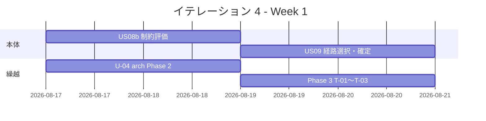

| 日 | タスク |
|----|--------|
| Day 1 (08-17) | US08b 制約評価 (RouteConstraint VO + 評価ロジック) + U-04 AST バイナリ着手 |
| Day 2 (08-18) | US08b 受入テスト完了 + U-04 Rule 6 完了 |
| Day 3 (08-19) | US09 Itinerary/Leg + ConfirmRouteCommand 着手 + Phase 3 T-01 着手 |
| Day 4 (08-20) | US09 完了 + Phase 3 T-02/T-03 完了 |
| Day 5 (08-21) | US11 経路紐付け実装完了 |

### Week 2（Day 6-10: 2026-08-24 〜 08-30）

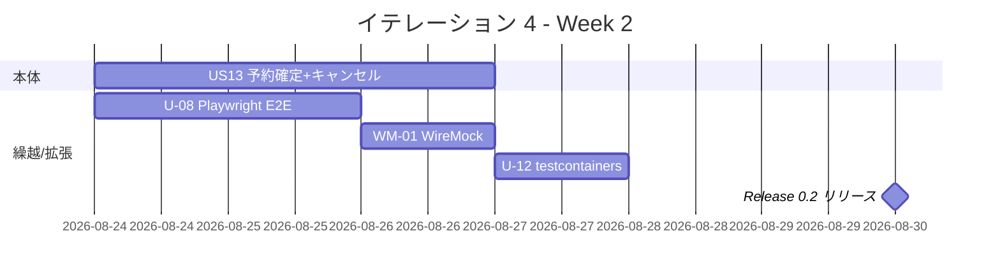

| 日 | タスク |
|----|--------|
| Day 6 (08-24) | US13 イベント+VO+ハンドラ着手 / U-08 Playwright E2E 拡張 |
| Day 7 (08-25) | US13 キャンセル料 3 段階ルール完了 / U-08 完了 |
| Day 8 (08-26) | US13 UI + 受入テスト完了 / WM-01 WireMock 契約テスト |
| Day 9 (08-27) | U-12 testcontainers + U-15 HPC 75% gate、統合テスト、バグ修正 |
| Day 10 (08-30) | `v0.2.0` タグ + Release ノート公開、CHANGELOG 反映、デモ準備 |

---

## 設計

### ドメインモデル (IT4 追加分)

> 注: BC 配置は `docs/design/domain-model.md` に準拠する。`RouteConstraint` は **Estimation Context** に追加、`Itinerary` / `Leg` / `CancellationFee` は **Booking Context** に追加する。

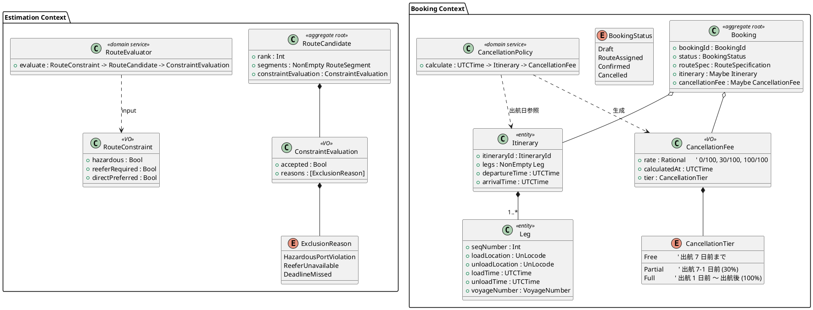

**Haskell 型定義 (主要)**:

```haskell
-- Estimation/Domain/RouteConstraint.hs
data RouteConstraint = RouteConstraint
  { rcHazardous       :: !Bool
  , rcReeferRequired  :: !Bool
  , rcDirectPreferred :: !Bool
  } deriving stock (Eq, Show)

data ExclusionReason
  = HazardousPortViolation !UnLocode
  | ReeferUnavailable !VoyageNumber
  | DeadlineMissed !UTCTime
  deriving stock (Eq, Show)

data ConstraintEvaluation = ConstraintEvaluation
  { ceAccepted :: !Bool
  , ceReasons  :: ![ExclusionReason]
  } deriving stock (Eq, Show)

-- Estimation/Domain/Service/RouteEvaluator.hs (純粋関数 / T-03)
evaluate :: RouteConstraint -> RouteCandidate -> ConstraintEvaluation
evaluate constraint candidate = ...

-- Booking/Domain/Itinerary.hs
newtype ItineraryId = ItineraryId UUID
  deriving newtype (Eq, Show, Ord)

data Leg = Leg
  { lgSeqNumber       :: !Int
  , lgLoadLocation    :: !UnLocode
  , lgUnloadLocation  :: !UnLocode
  , lgLoadTime        :: !UTCTime
  , lgUnloadTime      :: !UTCTime
  , lgVoyageNumber    :: !VoyageNumber
  } deriving stock (Eq, Show)

data Itinerary = Itinerary
  { itItineraryId  :: !ItineraryId
  , itLegs         :: !(NonEmpty Leg)
  } deriving stock (Eq, Show)

itDepartureTime, itArrivalTime :: Itinerary -> UTCTime
itDepartureTime = lgLoadTime . NE.head . itLegs
itArrivalTime   = lgUnloadTime . NE.last . itLegs

-- Booking/Domain/CancellationFee.hs (純粋関数 / T-03)
data CancellationTier = Free | Partial | Full
  deriving stock (Eq, Show)

data CancellationFee = CancellationFee
  { cfRate         :: !Rational
  , cfCalculatedAt :: !UTCTime
  , cfTier         :: !CancellationTier
  } deriving stock (Eq, Show)

-- Booking/Domain/Service/CancellationPolicy.hs
calculate :: UTCTime -> Itinerary -> CancellationFee
calculate now it
  | diff >= 7 * 86400 = mk Free    (0 % 100)
  | diff >= 1 * 86400 = mk Partial (30 % 100)
  | otherwise         = mk Full    (100 % 100)
  where
    diff = round (diffUTCTime (itDepartureTime it) now)
    mk t r = CancellationFee r now t
```

### データモデル (IT4 追加分)

新規 `itinerary` / `leg` テーブルを追加し、既存 `booking` を拡張 (`status` 遷移値追加 + `cancellation_*` カラム)。

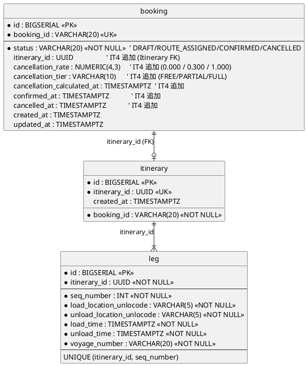

**規約準拠**:

- PK: `BIGSERIAL` サロゲートキー、業務キーは UK
- FK: `leg.itinerary_id` → `itinerary.itinerary_id` (UUID 業務キー参照、data-model.md 規約)
- 順序カラム: `seq_number` (data-model.md §順序カラム規約)
- 監査: `created_at` / `updated_at` 必須
- ステータス CHECK 制約: `booking.status IN ('DRAFT','ROUTE_ASSIGNED','CONFIRMED','CANCELLED')`、`booking.cancellation_tier IN ('FREE','PARTIAL','FULL')`

**DDL (IT4 マイグレーション)**:

```sql
-- 012_create_itinerary_and_leg.sql
CREATE TABLE itinerary (
    id            BIGSERIAL PRIMARY KEY,
    itinerary_id  UUID NOT NULL UNIQUE,
    booking_id    VARCHAR(20) NOT NULL REFERENCES booking(booking_id),
    created_at    TIMESTAMPTZ NOT NULL DEFAULT NOW()
);
CREATE INDEX idx_itinerary_booking ON itinerary (booking_id);

CREATE TABLE leg (
    id                          BIGSERIAL PRIMARY KEY,
    itinerary_id                UUID NOT NULL REFERENCES itinerary(itinerary_id) ON DELETE CASCADE,
    seq_number                  INT  NOT NULL,
    load_location_unlocode      VARCHAR(5) NOT NULL,
    unload_location_unlocode    VARCHAR(5) NOT NULL,
    load_time                   TIMESTAMPTZ NOT NULL,
    unload_time                 TIMESTAMPTZ NOT NULL,
    voyage_number               VARCHAR(20) NOT NULL,
    UNIQUE (itinerary_id, seq_number),
    CHECK (load_time < unload_time)
);
CREATE INDEX idx_leg_voyage ON leg (voyage_number);

-- 013_extend_booking_for_confirmation.sql
ALTER TABLE booking
  DROP CONSTRAINT IF EXISTS booking_status_check,
  ADD  CONSTRAINT booking_status_check
       CHECK (status IN ('DRAFT','ROUTE_ASSIGNED','CONFIRMED','CANCELLED')),
  ADD  COLUMN itinerary_id               UUID REFERENCES itinerary(itinerary_id),
  ADD  COLUMN cancellation_rate          NUMERIC(4,3),
  ADD  COLUMN cancellation_tier          VARCHAR(10)
       CHECK (cancellation_tier IS NULL OR cancellation_tier IN ('FREE','PARTIAL','FULL')),
  ADD  COLUMN cancellation_calculated_at TIMESTAMPTZ,
  ADD  COLUMN confirmed_at               TIMESTAMPTZ,
  ADD  COLUMN cancelled_at               TIMESTAMPTZ;
```

### モジュール構造 (IT4 追加)

```
apps/cargo-tracker/src/
  Cargotracker/
    Estimation/
      Domain/
        Model/
          RouteConstraint.hs               -- US08b: 制約 VO
          ConstraintEvaluation.hs          -- US08b: 評価結果 VO
          ExclusionReason.hs               -- US08b: 除外理由 sum type
        Service/
          RouteEvaluator.hs                -- US08b: 純粋関数評価
      Application/
        EvaluateRouteCandidatesCommand.hs  -- US08b
      Interfaces/
        Http/
          RouteEvaluationHandler.hs        -- POST /bookings/:id/routes/evaluate
    Booking/
      Domain/
        Model/
          Itinerary.hs                     -- US09/US11: 経路エンティティ
          Leg.hs                           -- US09/US11: 区間エンティティ
          CancellationFee.hs               -- US13: 料金 VO
          CancellationTier.hs              -- US13: 3 段階 sum type
        Service/
          CancellationPolicy.hs            -- US13: 純粋関数 (T-03)
        Event/
          BookingConfirmed.hs              -- US13: ドメインイベント
          BookingCancelled.hs              -- US13
      Application/
        ConfirmRouteCommand.hs             -- US09
        LinkRouteCommand.hs                -- US11
        UnlinkRouteCommand.hs              -- US11
        ConfirmBookingCommand.hs           -- US13
        CancelBookingCommand.hs            -- US13
      Infrastructure/
        Repository/
          PostgresItineraryRepository.hs   -- US09/US11
          PostgresLegRepository.hs         -- US09
      Interfaces/
        Http/
          RouteConfirmHandler.hs           -- POST /bookings/:id/routes/confirm
          BookingRouteHandler.hs           -- POST/DELETE /bookings/:id/route
          BookingConfirmHandler.hs         -- POST /bookings/:id/confirm
          BookingCancelHandler.hs          -- POST /bookings/:id/cancel
arch-check/
  PhaseAST/
    Rules/
      Rule6_InterfacesToDomain.hs          -- Phase 2 (IT3 繰越 U-04)
      T01_ApplicationOnlyTx.hs             -- Phase 3 (IT3 繰越)
      T02_RepositoryNoTx.hs                -- Phase 3
      T03_DomainNoIO.hs                    -- Phase 3
test/
  Contract/
    CustomsAclWireMockSpec.hs              -- WM-01: 通関 ACL Circuit Breaker
    PricingAclWireMockSpec.hs              -- WM-01: 料金 ACL Circuit Breaker
e2e/
  it4-stories.spec.ts                      -- US08b/US09/US11/US13 ハッピーパス
db/migrations/
  20260817100000_create_itinerary_and_leg.sql
  20260817100100_extend_booking_for_confirmation.sql
```

### URL 設計 (IT4 追加)

| メソッド | パス | 用途 |
| :--- | :--- | :--- |
| POST | `/bookings/:bookingId/routes/evaluate` | US08b: 経路候補に制約評価を適用し再表示 |
| POST | `/bookings/:bookingId/routes/confirm` | US09: 選択経路を確定 (Booking 集約配下) |
| POST | `/bookings/:bookingId/route` | US11: 確定経路を予約に紐付け (PRG → `/bookings/:bookingId`) |
| DELETE | `/bookings/:bookingId/route` | US11: 経路紐付け解除 (確定前のみ) |
| POST | `/bookings/:bookingId/confirm` | US13: 予約確定 (PRG → `/bookings/:bookingId`) |
| POST | `/bookings/:bookingId/cancel` | US13: 予約キャンセル + 料金算定 (PRG + flash) |
| GET | `/bookings/:bookingId/cancel/preview` | US13: 現時点キャンセル料の htmx プレビュー |

### ユーザーインターフェース

#### ビュー

> 注: `/bookings/:bookingId/routes` は IT3 で追加済の画面に **「制約評価」** トグルと **「経路を確定」** ボタンを拡張する。`/bookings/:bookingId` (予約詳細) に **「予約を確定」** / **「キャンセル」** セクションを追加する。

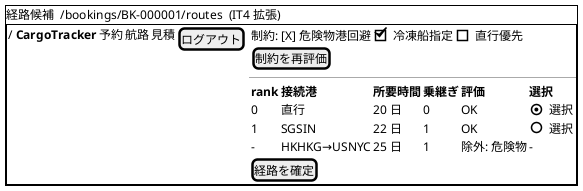

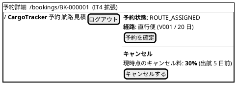

#### モデル

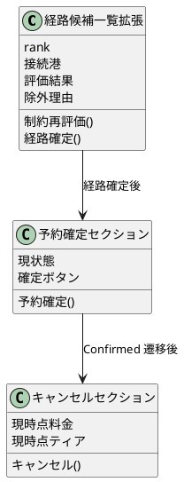

#### インタラクション

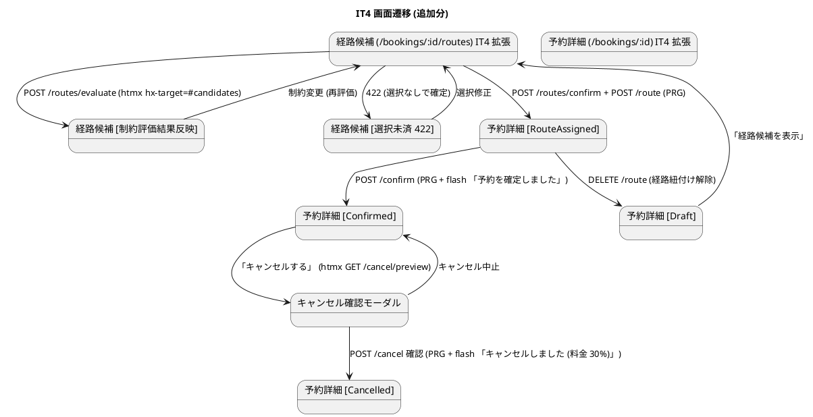

**htmx パターン (IT4 適用箇所)**:

| 画面 | パターン | エンドポイント |
| :--- | :--- | :--- |
| 経路候補 (制約評価) | チェックボックス連動の部分更新 | `hx-post="/bookings/:id/routes/evaluate"` → `hx-target="#candidates"` → `hx-swap="outerHTML"` |
| 予約詳細 (キャンセル料プレビュー) | モーダル展開時の動的取得 | `hx-get="/bookings/:id/cancel/preview"` → `hx-target="#cancel-modal"` → `hx-trigger="click"` |
| 予約確定ボタン | confirm モーダル後 PRG | 通常 POST (htmx 不使用、PRG で `/bookings/:id` 再描画) |

**フィードバック規約** (IT2/IT3 規約継承):

- 成功 (`alert-success`): 「経路を確定しました」 / 「予約を確定しました」 / 「キャンセルしました (料金: 30%)」
- 警告 (`alert-warning`): 「制約により全候補が除外されました。条件を見直してください」
- エラー (`alert-danger`): 「経路を選択してください」 / 「確定済みのため変更できません」
- バリデーションエラーは flash + Lucid 再描画 (入力値保持)
- 状態遷移違反 (例: Draft → Confirmed 直接遷移) は 422 + 状態説明

### API 設計

| メソッド | エンドポイント | 説明 |
|---------|---------------|------|
| POST | `/bookings/{id}/routes/evaluate` | US08b: 制約評価を適用した経路候補一覧 |
| POST | `/bookings/{id}/routes/confirm` | US09: 選択経路を確定 (`itinerary_id` 払出) |
| POST | `/bookings/{id}/route` | US11: 経路紐付け (Booking → RouteAssigned) |
| DELETE | `/bookings/{id}/route` | US11: 紐付け解除 (確定前のみ可) |
| POST | `/bookings/{id}/confirm` | US13: 予約確定 (RouteAssigned → Confirmed) |
| POST | `/bookings/{id}/cancel` | US13: キャンセル + 料金算定 (Confirmed → Cancelled) |
| GET | `/bookings/{id}/cancel/preview` | US13: 現時点キャンセル料の htmx プレビュー |

### アプリケーション層シーケンス

#### 経路制約評価 (POST /bookings/:id/routes/evaluate)

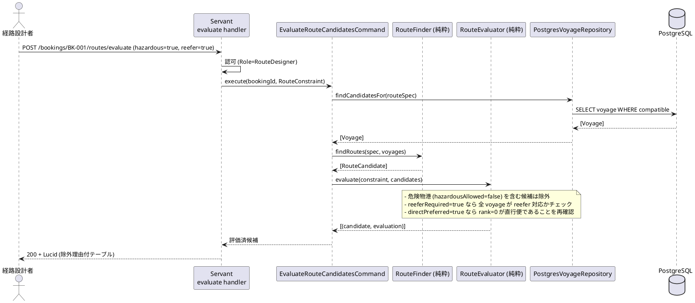

#### 経路選択・確定 (POST /bookings/:id/routes/confirm)

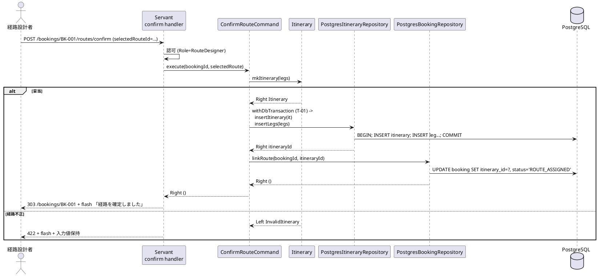

#### 予約確定 + キャンセル (POST /bookings/:id/confirm, POST /bookings/:id/cancel)

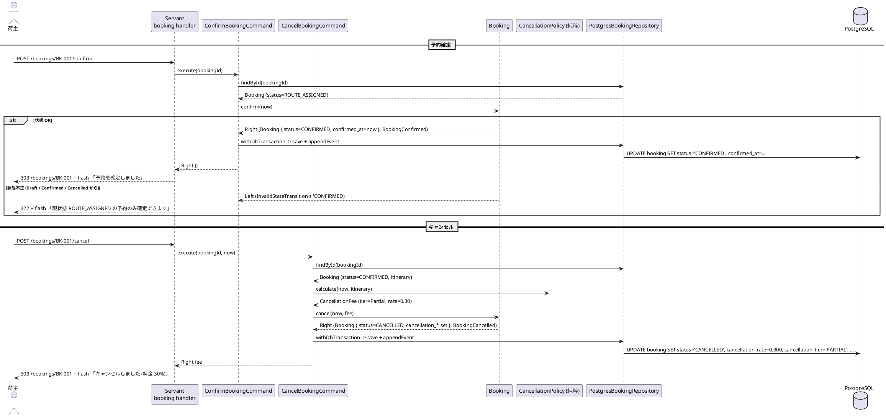

### トランザクション境界

ADR-0002 の規約 (T-01〜T-03) を IT4 拡張範囲に適用。Phase 3 arch-check で AST 検証 (IT3 繰越)。

| ルール | 適用 |
| :--- | :--- |
| **T-01 (Application で `withDbTransaction` を張る)** | `ConfirmRouteCommand` (itinerary + leg + booking 更新を 1 Tx)、`ConfirmBookingCommand` (booking 更新 + イベント追加を 1 Tx)、`CancelBookingCommand` (同上) |
| **T-02 (Repository は IO のみ・Tx 開始禁止)** | `PostgresItineraryRepository` / `PostgresLegRepository` / `PostgresBookingRepository` は `Connection -> IO ()` のみ、`BEGIN`/`COMMIT` 発行禁止 |
| **T-03 (Domain は IO 完全排除)** | `RouteEvaluator.evaluate` / `CancellationPolicy.calculate` / `Booking.confirm` / `Booking.cancel` / `mkItinerary` はすべて純粋関数 `Either DomainError a` |

`ConfirmRouteCommand` の典型:

```haskell
confirmRoute
  :: HasDb env
  => BookingId -> SelectedRoute -> ReaderT env IO (Either DomainError ())
confirmRoute bid selected = withDbTransaction $ \tx ->
  case mkItinerary (srLegs selected) of
    Left err -> pure (Left err)                                  -- T-03: Domain 純粋
    Right it -> do
      _ <- insertItinerary tx it                                 -- T-02: Repo は IO のみ
      _ <- insertLegs      tx (itItineraryId it) (NE.toList (itLegs it))
      linkRoute            tx bid (itItineraryId it)             -- T-02
```

### エラー処理戦略

IT3 の `BookingError` を IT4 範囲に拡張。状態遷移エラーを型レベルで防ぐため `BookingStatus` を制限する関数も追加する。

```haskell
-- Booking/Domain/Error.hs (IT4 追加)
data BookingError
  = BookingNotFound !BookingId
  | InvalidStateTransition !BookingStatus !BookingStatus
  | IncompleteBooking !BookingId ![Text]
  | InvalidHazardousDeclaration !Text
  | InvalidTemperatureRequirement !Text
  -- IT4 追加
  | RouteAlreadyAssigned !BookingId                  -- US11
  | RouteNotAssigned !BookingId                      -- US13 確定前提
  | InvalidItinerary ![Text]                         -- US09
  | NoRouteSelected !BookingId                       -- US09
  deriving stock (Eq, Show)

-- Estimation/Domain/Error.hs (IT4 追加)
data EstimationError
  = NoCandidatesAfterConstraints ![ExclusionReason]  -- US08b
  deriving stock (Eq, Show)
```

**HTTP マッピング (IT4 追加)**:

| Error | HTTP | フラッシュメッセージ例 |
| :--- | :--- | :--- |
| `RouteAlreadyAssigned` | 409 | 「すでに経路が紐付いています。解除してから再度試してください」 |
| `RouteNotAssigned` | 422 | 「経路を紐付けてから確定してください」 |
| `InvalidItinerary` | 422 | 「経路の構成が不正です: <理由>」 |
| `NoRouteSelected` | 422 | 「経路を選択してください」 |
| `NoCandidatesAfterConstraints` | 200 + alert-warning | 「制約により全候補が除外されました。条件を見直してください」 |
| `InvalidStateTransition` | 422 | 「現状態 <from> の予約は <to> へ遷移できません」 |

### DB マイグレーション順序 (IT4)

IT3 の 011 を前提に、IT4 では **2 マイグレーション** を投入する。

| 順序 | ファイル | 内容 | 依存 |
| :--- | :--- | :--- | :--- |
| 012 | `012_create_itinerary_and_leg.sql` | `itinerary` + `leg` テーブル新規作成、index 追加 | `booking` (既存) |
| 013 | `013_extend_booking_for_confirmation.sql` | `booking.status` CHECK 拡張、`itinerary_id` / `cancellation_*` / `confirmed_at` / `cancelled_at` 追加 | 012 |

> **命名規約**: 実ファイル名は dbmate 標準の `YYYYMMDDHHMMSS_*.sql` (例: `20260817100000_create_itinerary_and_leg.sql`)。`up` / `down` 両方を記述。`down` では `DROP TABLE` / `DROP COLUMN` で逆向きに戻す。

### テスト戦略

| 層 | テスト種別 | 追加件数 (目標) |
| :--- | :--- | ---: |
| Domain | hspec | `Itinerary` mk (3) / `Leg` 順序 (2) / `CancellationFee` 構築 (3) / `Booking.confirm/cancel` 状態遷移 (6) |
| Domain | hedgehog (プロパティ) | `CancellationPolicy.calculate` 境界値網羅 (7 日前 / 1 日前 / 出航日 / 過去) / `RouteEvaluator.evaluate` 制約整合 (3) |
| Application | hspec | `EvaluateRouteCandidatesCommand` (3) / `ConfirmRouteCommand` (3) / `LinkRouteCommand` (3) / `ConfirmBookingCommand` (3) / `CancelBookingCommand` (4) |
| Infrastructure | hspec (testcontainers-hs) | itinerary + leg 1 Tx 保存 (1) / booking 更新の楽観ロック (1) / `CreateEstimateCommand` Postgres IT (U-12 繰越、3) |
| Interfaces (HTTP) | hspec-wai | PRG 5 件 (US09/US11/US13) / 認可 8 件 / バリデーション 6 件 / 状態遷移 422 (4) |
| Contract | hspec + WireMock (WM-01) | 通関 ACL Circuit Breaker Open/HalfOpen/Closed (3) / 料金 ACL 同 (3) |
| E2E | Playwright | IT3 繰越 US01/US06/US25 ハッピーパス (3) + IT4 US08b→US09→US11→US13 ハッピーパス (1) + キャンセル 3 段階デモ (1) |
| アーキテクチャ | arch-check Phase 2/3 | Rule 6 (Interfaces → Domain) / T-01 / T-02 / T-03 を CI gate (IT3 繰越) |
| カバレッジ | HPC | Domain ≥ 95% / 全体 ≥ 75% (U-15、IT3 70% から +5%) |

**hedgehog プロパティ例 (CancellationPolicy)**:

```haskell
prop_cancellationTierBoundaries :: Property
prop_cancellationTierBoundaries = property $ do
  departure <- forAll genUTCTime
  hoursBefore <- forAll (Gen.integral (Range.linear 0 (30 * 24)))
  let now = addUTCTime (negate (fromIntegral hoursBefore * 3600)) departure
      fee = calculate now (singleLegItinerary departure)
  case cfTier fee of
    Free    -> assert (hoursBefore >= 7 * 24)
    Partial -> assert (hoursBefore >= 24 && hoursBefore < 7 * 24)
    Full    -> assert (hoursBefore < 24)

prop_evaluatorExcludesHazardous :: Property
prop_evaluatorExcludesHazardous = property $ do
  candidate <- forAll (genRouteCandidateIncludingHazardousPort)
  let result = evaluate (RouteConstraint True False False) candidate
  ceAccepted result === False
  assert (any isHazardousReason (ceReasons result))
```

### CI 統合

`.github/workflows/ci.yml` に IT4 で追加するステップ:

```yaml
- name: WireMock 契約テスト (WM-01)
  working-directory: apps/cargo-tracker
  run: |
    nix-shell ../../$NIX_SHELL --run \
      "stack test --test-arguments='--match Contract'"

- name: HPC ゲート 75% (U-15)
  working-directory: apps/cargo-tracker
  run: |
    nix-shell ../../$NIX_SHELL --run "stack test --coverage"
    total=$(nix-shell ../../$NIX_SHELL --run "stack hpc report" \
            | awk '/expressions used/ {gsub("%",""); print $4}')
    [ "$total" -ge 75 ] || (echo "全体カバレッジ不足: ${total}%" && exit 1)

- name: arch-check Phase 2 + Phase 3 (IT3 繰越 U-04 / T-01〜T-03)
  working-directory: apps/cargo-tracker
  run: |
    nix-shell ../../$NIX_SHELL --run "stack exec arch-check -- src/ \
      --rule rule6-interfaces-to-domain \
      --rule t01-application-only-tx \
      --rule t02-repository-no-tx \
      --rule t03-domain-no-io"

- name: Playwright E2E (US01/US06/US25 + IT4)
  working-directory: e2e
  run: npx playwright test --grep '@us01|@us06|@us25|@it4'
```

- リリースタグ `v0.2.0` push 時に GitHub Release を自動作成 (IT3 の v0.1.0-alpha と同じワークフロー流用)

### ADR

| ADR | タイトル | ステータス |
|-----|---------|-----------|
| [ADR-0007](../adr/0007-cancellation-fee-policy.md) | キャンセル料 3 段階ルールのドメインポリシー化 (純粋関数として `CancellationPolicy.calculate` を Domain Service に配置) | 提案予定 |
| [ADR-0008](../adr/0008-itinerary-leg-model.md) | Itinerary / Leg を Booking 集約配下に配置し、確定経路の保存を 1 Tx で行う | 提案予定 |
| [ADR-0009](../adr/0009-booking-state-machine.md) | Booking 状態機械 (Draft → RouteAssigned → Confirmed → Cancelled) のドメイン型強制 | 提案予定 |

---

## リスクと対策

| リスク | 影響度 | 対策 |
|--------|--------|------|
| キャンセル料 3 段階の境界値テスト漏れ | 高 | 7 日前 / 1 日前 / 出航日の境界をプロパティテスト + 単体で網羅 |
| arch-check Phase 2/3 の AST バイナリが想定以上に複雑 | 中 | Day 1-2 で着手しブロック検知。失敗時は Rule 6 のみ着地し T-01〜T-03 は IT5 繰越 |
| US08b 危険物港マスタの未整備 | 中 | IT3 で `Port` テーブルに `hazardousAllowed` を追加済。マスタ投入を Day 1 タスクに |
| Playwright E2E のフレーキー | 中 | U-08 で IT3 ストーリーぶん安定化、IT4 では追加ストーリーのみ拡張 |
| Release 0.2 ノート整備の遅延 | 低 | Day 9 までに本体完了、Day 10 をリリース作業専用に確保 |

---

## 完了条件

### Definition of Done

- [ ] コードレビュー完了 (developing-review スキル)
- [ ] `sbt test` 全パス (Haskell では `stack test --fast` 全パス)
- [ ] ArchUnit / arch-check Phase 1/2/3 全 gate 緑
- [ ] HPC カバレッジ 75% 以上
- [ ] Playwright E2E 全シナリオ緑
- [ ] WireMock 契約テスト緑
- [ ] domain-model.md / data-model.md / API ドキュメント更新済
- [ ] CHANGELOG / リリースノート更新済
- [ ] `v0.2.0` タグ + GitHub Release 公開

### デモ項目

1. `/voyages/search` → 経路候補算出 → 制約評価 (危険物 / 冷凍 / 直行) で除外確認
2. 経路選択 → 確定 → 予約紐付け → 予約確定の完全フロー
3. キャンセル料 3 段階の境界値デモ (確定直後 / 7 日前 / 1 日前)
4. WireMock 経由で通関 ACL を OPEN 状態にして Circuit Breaker 動作確認
5. arch-check Phase 2/3 違反コミットを試行 → CI が落ちることを確認

---

## 更新履歴

| 日付 | 更新内容 | 更新者 |
|------|---------|--------|
| 2026-06-30 | 初版作成 (本体 US08b/US09/US11/US13 = 11 SP + IT3 繰越 7 SP + 拡張 2 SP = 20 SP、IT1-3 実績ベロシティ平均 20 SP/IT を基準値とする) | Claude |
| 2026-06-30 | Phase A 純粋ドメイン進行: Task 1.1+1.2 (RouteEvaluator) / 4.1+4.3 (CancellationPolicy) 完了。進捗率 17.5% (3.5/20 SP)。commit 649f9783, a39c29c7 | Claude |

---

## 関連ドキュメント

- [リリース計画](./release_plan.md)
- [IT3 完了報告書](./iteration_report-3.md) — IT4 繰越項目 (U-04 / U-08 / U-12 / Phase 3) の根拠
- [IT3 ふりかえり (KPT)](./retrospective-3.md)
- [イテレーション 4 ふりかえり](./retrospective-4.md) — 完了時に作成
