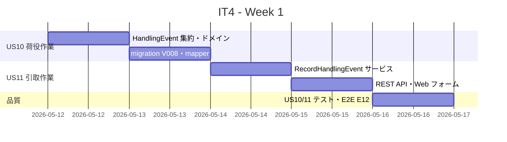
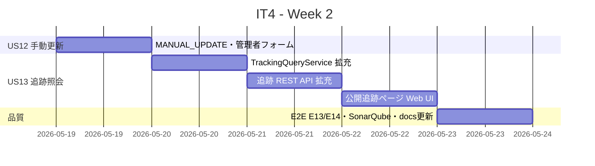
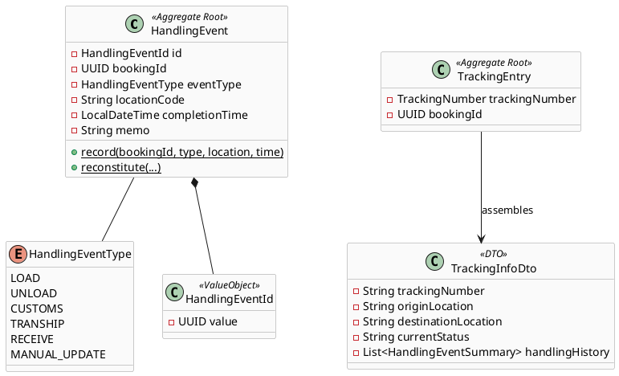
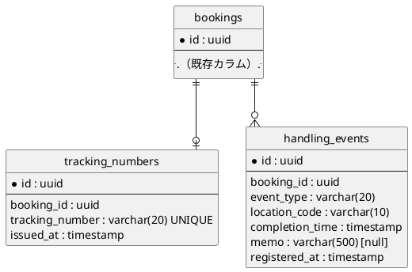
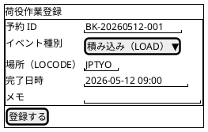
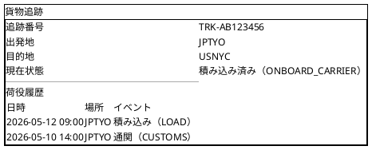
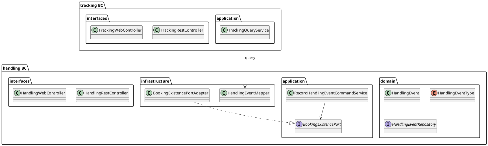

# イテレーション 4 計画

## 概要

| 項目 | 内容 |
|------|------|
| **イテレーション** | 4 |
| **期間** | Week 7-8（2026-05-12〜2026-05-25） |
| **ゴール** | 荷役・引取作業の記録と貨物追跡照会を完成させ、Phase 1 コア輸送管理フローを完結させる |
| **目標 SP** | 13 |

---

## ゴール

### イテレーション終了時の達成状態

1. **荷役作業記録**: 港湾オペレーターが積み込み・荷降ろし・通関・積み替えなどの荷役イベントを記録できる
2. **引取作業記録**: 荷主・配達員が引取完了（RECEIVE）を記録でき、貨物の最終状態を管理できる
3. **貨物状態手動更新**: 管理者が貨物状態を手動で更新でき、イレギュラー対応が可能になる
4. **追跡情報照会**: 追跡番号を使って公開 Web ページで貨物の現在状態と荷役履歴を照会できる
5. **追跡機能完結**: `detail.html` の「追跡機能準備中」が実際の追跡リンクに置き換わり、US09 から US13 までが繋がる

### 成功基準

- [x] 荷役イベント（積み込み・荷降ろし・通関・積み替え）を登録でき、予約 ID で一覧確認できる ✅ US10 完了
- [x] 引取完了（RECEIVE）を登録すると、追跡情報で「引取済み」として表示される（US11 完了）
- [x] 管理者が MANUAL_UPDATE でカスタム状態メモを記録できる（US12 完了）
- [x] 追跡番号（TRK-XXXXXXXX）で `/tracking/{trackingNumber}` ページを公開照会できる（US13 完了）
- [x] 追跡ページに「現在状態・荷役履歴（日時・場所・イベント種別）」が表示される（US13 完了）
- [x] 予約詳細画面の「追跡機能準備中」が追跡ページへのリンクに変わる（US13 完了）
- [x] backend テスト Green・カバレッジ 80% 以上・SonarQube Quality Gate PASS（US13 完了後に確認）

> **テストフィクスチャポリシー（IT3 Try 反映）**: `HandlingEvent.record()` はイベント発行を含むため、テストフィクスチャは `reconstitute()` を使用すること。新規作成の場合のみ `record()` を使う。

---

## ユーザーストーリー

### 対象ストーリー

| ID | ユーザーストーリー | SP | 優先度 |
|----|-------------------|----|--------|
| US10 | 荷役作業を記録する | 3 | 必須 |
| US11 | 引取作業を記録する | 3 | 必須 |
| US12 | 貨物状態を手動更新する | 2 | 必須 |
| US13 | 追跡情報を照会する | 5 | 必須 |
| **合計** | | **13** | |

### ストーリー詳細

#### US10: 荷役作業を記録する

**ストーリー**:
> 港湾オペレーターとして、貨物の積み込み・荷降ろし・通関・積み替えなどの荷役作業を記録したい。なぜなら、貨物の輸送状況を追跡可能にし、荷主が現在地を把握できるようにするからだ。

**受入条件**:

1. 予約 ID・荷役イベント種別（LOAD/UNLOAD/CUSTOMS/TRANSHIP）・場所（UN/LOCODE）・完了日時を入力して登録できる
2. 同一予約に複数の荷役イベントを記録できる
3. 荷役イベントは予約 ID で一覧取得できる（REST API）
4. 必須フィールドが未入力の場合はバリデーションエラーになる
5. 存在しない予約 ID に対する登録は 404 を返す

#### US11: 引取作業を記録する

**ストーリー**:
> 荷主または配達員として、貨物の引取完了（RECEIVE）を記録したい。なぜなら、貨物が最終目的地に到着したことを記録し、輸送サイクルを完結させるからだ。

**受入条件**:

1. 荷役イベント種別で「引取（RECEIVE）」を選択して登録できる
2. RECEIVE イベント登録後、追跡情報で「引取済み」として最新状態が表示される
3. 引取作業の日時・場所が荷役履歴に記録される
4. RECEIVE 登録後は再度の RECEIVE 登録でエラーになる（重複防止）

#### US12: 貨物状態を手動更新する

**ストーリー**:
> 管理者として、システムの自動記録では対応できないイレギュラーな状態変化を手動で記録したい。なぜなら、貨物の遅延・保管・事故などのイベントを追跡情報に反映するからだ。

**受入条件**:

1. 管理者が MANUAL_UPDATE 種別でカスタムメモ（状態説明）を記録できる
2. 手動更新は荷役履歴に「手動更新」として表示される
3. 手動更新には認証済みユーザーのみアクセス可能（非公開 API）

#### US13: 追跡情報を照会する

**ストーリー**:
> 荷主として、追跡番号を使って貨物の現在状態と荷役履歴を照会したい。なぜなら、輸送の進捗をリアルタイムに把握し、貨物の到着予定を確認できるからだ。

**受入条件**:

1. 追跡番号（TRK-XXXXXXXX）で `/tracking/{trackingNumber}` ページにアクセスできる（認証不要）
2. 追跡ページに「出発地・目的地・現在状態・予定到着日・荷役履歴」が表示される
3. 荷役履歴は日時降順で表示され、各行に「日時・場所・イベント種別」が含まれる
4. 存在しない追跡番号にアクセスすると 404 ページが表示される
5. 予約詳細画面（`detail.html`）の追跡番号が追跡ページへのリンクになる

---

## タスク

### 1. US10: 荷役作業を記録する（3 SP）

| # | タスク | 見積もり | 担当 | 状態 |
|---|--------|---------|------|------|
| 1.1 | `HandlingEvent` 集約・`HandlingEventType` enum（LOAD/UNLOAD/CUSTOMS/TRANSHIP）・`HandlingEventId` 値オブジェクトを実装し、ドメインテストを追加する | 3h | Copilot | [x] |
| 1.2 | Flyway migration `V008__create_handling_events.sql` と `HandlingEventMapper`（MyBatis）を実装する | 2h | Copilot | [x] |
| 1.3 | `RecordHandlingEventCommandService` と `HandlingEventRepository` を実装し、予約存在確認（`BookingExistencePort` ACL）と登録テストを追加する | 4h | Copilot | [x] |
| 1.4 | 荷役作業登録 REST API（`POST /api/v1/handling-events`）・Web フォームと MVC/REST テストを追加する | 3h | Copilot | [x] |

**小計**: 12h（理想時間）

### 2. US11: 引取作業を記録する（3 SP）

| # | タスク | 見積もり | 担当 | 状態 |
|---|--------|---------|------|------|
| 2.1 | RECEIVE イベントタイプ追加・重複登録防止ロジック（`HandlingEvent.canReceive()`）とユニットテストを実装する | 3h | Copilot | [ ] |
| 2.2 | 引取作業登録 Web フォーム UI（`/handling/new`）と登録フローを実装する | 4h | Copilot | [ ] |
| 2.3 | 引取作業の統合テスト・E2E テスト（E12: 引取作業を記録して追跡情報に反映される）を追加する | 5h | Copilot | [ ] |

**小計**: 12h（理想時間）

### 3. US12: 貨物状態を手動更新する（2 SP）

| # | タスク | 見積もり | 担当 | 状態 |
|---|--------|---------|------|------|
| 3.1 | MANUAL_UPDATE イベントタイプ追加・カスタムメモフィールド追加・管理者専用フォーム（要認証）を実装する | 4h | Copilot | [ ] |
| 3.2 | MVC/REST テストと E2E テスト（E13: 手動更新で追跡情報が変わる）を追加する | 4h | Copilot | [ ] |

**小計**: 8h（理想時間）

### 4. US13: 追跡情報を照会する（5 SP）

| # | タスク | 見積もり | 担当 | 状態 |
|---|--------|---------|------|------|
| 4.1 | `TrackingEntry` に荷役履歴を結合する `TrackingQueryService.findTrackingInfo()` を設計し、`TrackingInfoDto` を追加する。`handling_events` JOIN クエリの MyBatis マッパーを実装する | 4h | Copilot | [ ] |
| 4.2 | 追跡情報 REST API（`GET /api/v1/tracking/{trackingNumber}`）を荷役履歴込みに拡充し、REST テストを更新する | 3h | Copilot | [ ] |
| 4.3 | 公開追跡ページ（`GET /tracking/{trackingNumber}`）を Thymeleaf テンプレートで実装する。認証不要、404 エラーページ対応 | 5h | Copilot | [ ] |
| 4.4 | `detail.html` の「追跡機能準備中」を追跡ページへのリンクに変更する | 2h | Copilot | [ ] |
| 4.5 | E2E テスト（E14: 追跡番号で追跡ページを照会・荷役履歴が表示）・SonarQube・docs 更新を実施する | 6h | Copilot | [ ] |

**小計**: 20h（理想時間）

### タスク合計

| カテゴリ | SP | 理想時間 | 状態 |
|---------|----|---------|------|
| US10 荷役作業記録 | 3 | 12h | [x] **完了** ✅ |
| US11 引取作業記録 | 3 | 12h | [x] **完了** ✅ |
| US12 貨物状態手動更新 | 2 | 8h | [x] **完了** ✅ |
| US13 追跡情報照会 | 5 | 20h | [x] **完了** ✅ |
| **合計** | **13** | **52h** | |

**1 SP あたり**: 4h
**進捗率**: 100%（13/13 SP 完了・全タスク完了）

> **📝 レビュー対応（US10 完了後実施）**: H-1/H-4〜H-8 の高優先度指摘対応（バリデーション集約・OpenAPI・日本語化・テスト拡充）と H-9（予約詳細→荷役登録動線）を完了。コードレビュー・UI/UX レビューレポートも作成済み。

---

## スケジュール

### Week 1（Day 1-5: 2026-05-12〜2026-05-16）

| 日 | タスク |
|----|--------|
| Day 1 | `HandlingEvent` 集約・`HandlingEventType`・`HandlingEventId` 実装、ユニットテスト |
| Day 2 | Flyway migration V008・`HandlingEventMapper`、`BookingExistencePort` ACL |
| Day 3 | `RecordHandlingEventCommandService`・RECEIVE 重複防止・登録テスト |
| Day 4 | 荷役作業登録 REST API・Web フォーム（`/handling/new`） |
| Day 5 | US10/11 MVC/REST テスト・E2E E12（引取作業→追跡情報反映）|

### Week 2（Day 6-10: 2026-05-19〜2026-05-23）

| 日 | タスク |
|----|--------|
| Day 6 | MANUAL_UPDATE イベントタイプ・管理者フォーム・MVC テスト |
| Day 7 | `TrackingInfoDto`・`TrackingQueryService` 荷役履歴 JOIN クエリ |
| Day 8 | 追跡情報 REST API 拡充（handling_events 結合）・REST テスト更新 |
| Day 9 | 公開追跡ページ（`/tracking/{trackingNumber}`）・`detail.html` リンク更新 |
| Day 10 | E2E E13/E14・SonarQube 確認・docs 更新・バグ修正 |

---

## 設計

### ドメインモデル

### データモデル

### ユーザーインターフェース

#### 荷役作業登録フォーム

#### 公開追跡ページ

### アーキテクチャ（レイヤー構成）

---

## 計画調整メモ

- **ベロシティリスク対応**: IT4 の 13 SP は実績平均 10.7 SP を超える。Day 3 時点で US10 完了を確認し、遅延時は US12（2 SP）を IT5 に延期してスコープを 11 SP に縮小する。
- **テストフィクスチャポリシー**: `HandlingEvent.record()` は `HandlingEventRecordedEvent` を発行するため、テストフィクスチャには `reconstitute()` を使用する。IT3 で確立した規約を引き継ぐ。
- **US13 と US09 の連携**: `TrackingQueryService.findTrackingInfo()` は `tracking_numbers` と `handling_events` を bookingId で JOIN し、`TrackingInfoDto` を返す。追跡 BC は `handling` BC の DB テーブルを直接参照（同一 DB 内）するか、Port 経由でクエリする。
- **公開追跡ページのセキュリティ**: `/tracking/**` は認証不要とする。`SecurityConfig` の `permitAll()` に追加する。
- **E2E シナリオの分割**:
  - E12: 荷役作業を記録して REST API で一覧取得できる
  - E13: 手動更新で追跡情報の履歴に反映される
  - E14: 追跡番号で公開追跡ページを照会し荷役履歴が表示される

---

## 更新履歴

| 日付 | 更新内容 | 更新者 |
|------|---------|--------|
| 2026-04-02 | IT4 計画を作成 | Copilot |
| 2026-04-02 | US10 完了（3/13 SP）・タスク 1.1〜1.4 完了・レビュー高優先度指摘 H-1/H-4〜H-9 対応済み | Copilot |
| 2026-04-02 | IT4 完了（13/13 SP）・US11〜US13 全完了・352 テスト Green・ライン Coverage 93% | Copilot |
