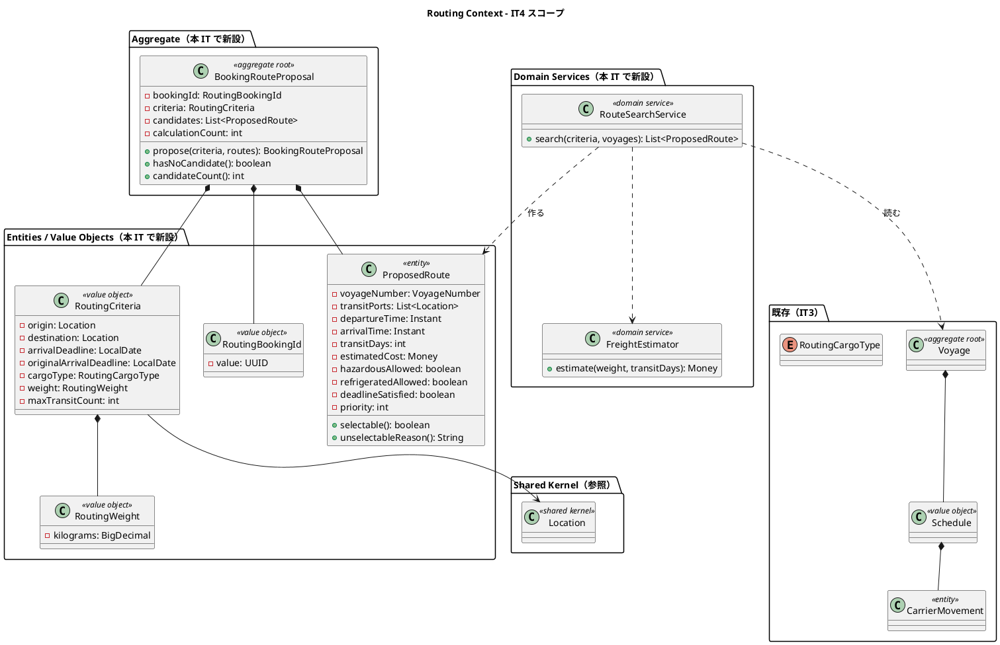
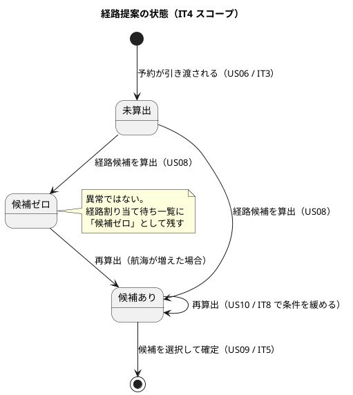
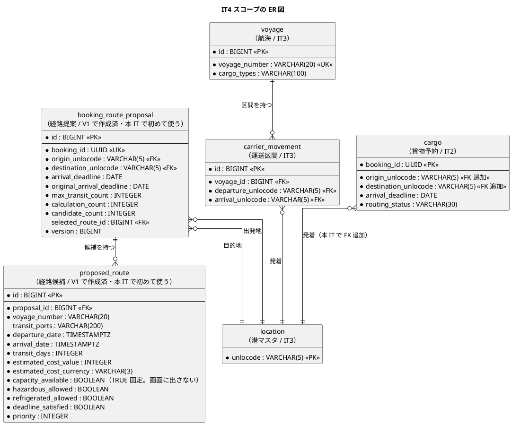
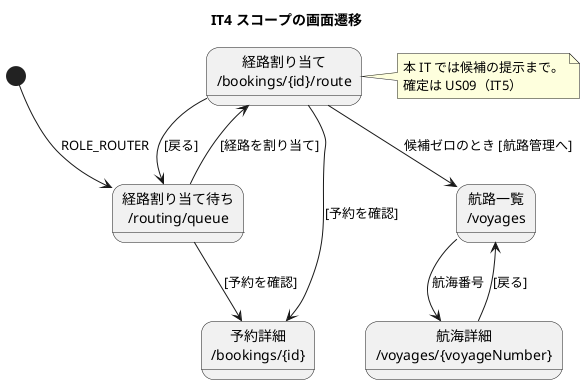

# イテレーション 4 計画

## ゴール

**予約 1 件に対して、期限内に到達できる経路の候補を自動で算出し、推奨順に提示する。**
Routing Context に `BookingRouteProposal` 集約と経路探索を確立し、経路の選択・確定（IT5）の
入力を用意する。

| 項目 | 内容 |
| :--- | :--- |
| リリース | Release 0.2（経路設計・予約確定） |
| 局面 | **中盤（インサイドアウト）** — `development_strategy.md` |
| 計画 SP | 8 |
| 前提 | IT3 完了（航海スケジュールの登録・検索。経路探索の入力が揃っている） |

**本システム最大の 1 件を単独で扱うイテレーション**である（`development_strategy.md`
「IT4 / US08 / `BookingRouteProposal` と経路探索（本システム最大の複雑さ）」）。
経路探索は**乗り継ぎを含むグラフの探索**であり、画面から作れば「つながっていない経路」
「期限を過ぎる経路」を候補として出してしまう。**探索と評価をドメインで固めてから外へ出す。**

---

## 前イテレーションからの引き継ぎ

IT3 のふりかえり（[retrospective-3.md](retrospective-3.md)）の Try と持ち越しを、本計画の
タスク・成功基準・DoD に落とし込む。

### Try の反映

| Try | 本計画での扱い |
| :--- | :--- |
| T1 修正した層の「鏡像」を探す | **DoD に追加。** 不具合を直したら `grep` で同じ形が他に無いかを確認し、確認した検索語を修正のコミットメッセージに残す |
| T2 クローズ前に CI と同じ条件で 1 度回す（`TZ=UTC ./gradlew test`） | **DoD に追加。** 本 IT は**日付判定が中心**（期限充足の判定）であり、時差の影響を最も受ける |
| T3 画面を作ったら「この画面から次に何ができるか」を書き出す | **タスク 4 と DoD に追加。** 経路割り当て画面は IT5（経路の確定）まで**確定ボタンが無い**。行き止まりにしないための出口を計画に明記する（下記「本 IT の出口」） |
| T4 `ui_design.md` の画面詳細の項目表を実装後に 1 行ずつ突き合わせる | **DoD に追加。** 候補テーブルの列は正典が 9 列を定めており、本 IT はそのうち「空き」を除く 8 列を出す（除く理由を画面に書く） |
| T5 同じ型の失敗が 2 回続いたら、その場で仕組みにする | 作業ルール。**H2 方言スモークは IT3 で仕組み化済み**であり、本 IT で追加するクエリもその対象に入れる |
| T6 返済枠を最初から時間で確保する | **タスク 0 として 10 時間確保**（下記） |

### 持ち越しの返済枠

| # | 内容 | 本計画での扱い |
| :--- | :--- | :--- |
| C1 | 航海の詳細画面（IT3 レビュー M1） | **タスク 0-1。** US08 で「選択中の航路詳細」に全区間の発着時刻が必要になるため、**本 IT で作るのが自然**である |
| C2 | 区間追加の htmx 化（IT3 レビュー M3） | **タスク 0-2** |
| C3 | ベロシティを 8SP として `release_plan.md` を見直す | **本計画の作成と同時に実施**（タスク 0-3。`release_plan.md` 側で再配分する） |
| C4 | US34（荷主セルフサービス） | 本 IT では対応しない。Release 1.1（IT9） |
| C5 | US33（ロック解除） | 本 IT では対応しない。**IT5 へ前倒し**（IT6 が期限であり、IT6 が 8SP を超えるため） |
| C6 | US25（航海スケジュールの更新） | 本 IT では対応しない。Release 1.1（IT9） |

---

## ユーザーストーリー

### 対象ストーリー

| ID | ユーザーストーリー | SP | 優先度 | Issue |
| :--- | :--- | :--- | :--- | :--- |
| US08 | 経路候補を算出する | 8 | 必須 | [#488](https://github.com/k2works/case-study-cargo-tracker/issues/488) |
| | **合計** | **8** | | |

### 受入基準

受入基準の正典は [ユーザーストーリー](../requirements/user_story.md) である。**本計画に書き写さず引用する。**

- US08: [US08 の受入基準](../requirements/user_story.md#us08-経路候補を算出する)

### 受入基準のうち本 IT で満たさないもの

| 内容 | 扱い | 理由 |
| :--- | :--- | :--- |
| `ui_design.md` が候補テーブルに求める**空き容量**の列 | **IT5（US09）へ送る。** 列は V1 で既に存在するため `TRUE` を入れるが、**画面には表示しない** | **空き容量は経路が確定して初めて減る。** 確定（US09）が無い本 IT では判定が常に「あり」を返し、**壊しても赤にならない安全装置**になる。IT3 で「安全装置は破って赤を確認する」を規律にした以上、赤にできない判定を先に入れない。**確かめていない「あり」を画面に出すことは、確かめたと言うことと同じ**であるため列ごと出さない。IT5 で US09・航海の容量とともに実装し、「満船の便は選べない」テストで固定する |
| 候補からの**選択・確定** | US09 / US11（IT5） | 本 IT は「候補を出すところまで」である |
| 条件を緩めた**再算出**（`[+3 日]` `[+7 日]`・経由回数の緩和） | US10（IT8） | ただし**候補ゼロの状態は本 IT で保持・表示する**（下記） |

### 本 IT の出口（行き止まりにしない）

**確定ボタンが無い画面を作ると、経路設計者は候補を見た後に何もできない。** IT3 の
レビュー P2 と同じ型の失敗を避けるため、本 IT の出口を先に決める。

| 状態 | 画面に置く出口 |
| :--- | :--- |
| 候補あり | **「経路の確定は次のイテレーションで提供します」と明示する。** 出せない機能を空のボタンで匂わせない |
| 候補ゼロ | `[航路管理へ]`（新しい便を登録して再算出する導線）。**条件緩和は US10 まで無い**ことを画面に書く |
| いずれも | `[予約を確認]`（予約詳細）・`[経路割り当て待ちへ戻る]` |

---

## 設計への反映が必要（当該 IT で対応）

計画作成時の突合で見つかった、**設計ドキュメント・スキーマ側の欠落**である。

| # | 内容 | 対応 |
| :--- | :--- | :--- |
| 1 | **候補の費用（`proposed_route.estimated_cost_value`）に入力が無い。** `voyage` は運賃を持たず、料金表も存在しない。US08 の受入基準は「費用が表示される」を求めている | **タスク 2-4 とタスク 5-1。** 距離や運賃表を持たない現状で「実際の運賃」は出せない。**概算式（基準単価 × 重量 × 所要日数）でドメインが算出する**方針を採り、単価を設定値として外に出す（ハードコーディングしない）。**この判断は [ADR-008] として起票する**。画面には「概算」と明示する |
| 2 | **`ui_design.md` は候補テーブルに「空き」列を定めているが、`voyage` に容量が無い。** `proposed_route.capacity_available` は V1 で `NOT NULL` として既に存在し、**入力が無いまま値を入れるしかない** | 本 IT は `TRUE` を入れ、**画面には出さない**（上記「満たさないもの」）。**IT5 で航海の容量カラムとともに実装する**旨を `data-model.md` に注記する（タスク 5-1） |
| 3 | **`BookingRouteProposal` は Routing Context の集約だが、探索には予約の情報（出発地・目的地・希望期限・貨物種別・重量）が要る** | **タスク 2-1。** ADR-005（共有カーネルは `Location` と `ShipperId` のみ）に従い、**Routing 側に ACL ポートを置き、Booking 側にアダプタを実装する**。IT2 の `ShipperExistenceChecker`（ポートは利用側・アダプタは提供側）と同じ形にする |
| 4 | **経路探索そのものが `domain-model.md` に無い。** 集約と値オブジェクトの一覧はあるが、「どう探すか」（探索の打ち切り条件・推奨順の定義）が書かれていない | **タスク 5-1 で `domain-model.md` に追記する。** ビジネスルールとして「経由回数の上限」「推奨順の基準」を明文化する。**実装と同じイテレーションで反映する** |
| 5 | `cargo.origin_unlocode` / `destination_unlocode` に `location` への外部キーが無い（IT3 の 4 番で「US08 で判断する」とした） | **本 IT で追加する**（タスク 1-1）。港マスタが揃い、既存データも港マスタの範囲に収まっていることを確認できる。**探索の起点・終点が港マスタに無いと、候補ゼロと区別がつかない** |
| 6 | **航海詳細 `/voyages/{voyageNumber}` が `ui_design.md` の画面一覧に無い**（あるのは `/voyages/new` と `/voyages/{voyageNumber}/edit` のみ）。IT3 レビュー M1 で「作る」と決めた画面に**正典上の居場所が無い** | **タスク 5-1 で画面一覧・画面遷移図に追加する。** URL は編集画面と揃えて `/voyages/{voyageNumber}` とする。**実装と同じイテレーションで反映する** |

> **IT2 はカラムの欠落、IT3 はマスタデータの欠落、IT4 は「値の出どころ」の欠落**である。
> 3 回とも「テーブルはあるが使えない」型であり、**着手前の突合でしか見つからない。**

---

## 設計（IT4 スコープ）

### ドメインモデル図

> **`RoutingBookingId` / `RoutingWeight` を Routing 側に持つ**のは、IT3 の
> `RoutingCargoType` と同じ理由である（ADR-005・ArchUnit ルール 4）。Booking の
> `BookingId` / `Weight` を直接参照すると BC 間の直接参照になる。

### 状態遷移図（IT4 スコープ）

**本 IT では `BookingStatus` を変えない。** 予約は US06（IT3）で `ROUTE_PROPOSED` に
なったままであり、経路を確定しても（US09 / IT5）`BookingStatus` は動かず
`RoutingStatus` が `NOT_ROUTED → ROUTED` になる（`domain-model.md` の
`RouteCargoCommand`）。**本 IT が動かすのは経路提案の状態だけ**である。

### ER 図（IT4 スコープ）

> **2 つのテーブルは `V1__init.sql` で作成済みであり、本 IT で初めて使う。** 新しい
> マイグレーションは `cargo` の外部キー（V7）だけである。
> `booking_route_proposal` と `cargo` の間に外部キーは張らない。**BC をまたぐ参照整合性は
> 書き込み側で保証する**（`data-model.md`）。

### 画面遷移図（IT4 スコープ）

> **新設する画面は `/bookings/{id}/route` と `/voyages/{voyageNumber}`（返済枠 C1）の 2 つ。**
> どちらも ROLE_ROUTER。**URL 直打ちでも他ロールから開けないこと**をテストで固定する。

---

## タスク分解

### 0. 返済枠（上限 10 時間。IT3 ふりかえり T6）

| # | タスク | 見積 |
| :--- | :--- | :--- |
| 0-1 | 航海詳細画面 `/voyages/{voyageNumber}`（全区間の発着時刻。IT3 レビュー M1・C1） | 3h |
| 0-2 | 区間追加の htmx 化（IT3 レビュー M3・C2） | 3h |
| 0-3 | `release_plan.md` の再配分（C3。ベロシティ 8SP・IT5 以降の割り当て・満足条件テーブルの SP 合計の修正） | 2h |
| 0-4 | ADR-008（経路候補の費用は概算式で算出する）の起票 | 2h |

### 1. 探索の入力を確かめる（前提）

| # | タスク | 見積 |
| :--- | :--- | :--- |
| 1-1 | `cargo.origin_unlocode` / `destination_unlocode` に `location` への外部キーを追加（V7）。既存データが港マスタに収まることを確認する | 2h |
| 1-2 | 動作確認用の航海データを、**乗り継ぎが成立する組み合わせ**に拡充（V903）。直行・1 回乗り継ぎ・期限超過・取扱不可の 4 パターンを含める | 2h |

### 2. ドメイン（インサイドから固める）

**画面はまだ触らない。** すべてユニットテストで先に赤にする。

| # | タスク | 見積 |
| :--- | :--- | :--- |
| 2-1 | `RoutingBookingId` / `RoutingWeight` / `RoutingCriteria`。ACL ポート `RoutableBookings`（Routing 側。IT3 の `KnownPorts` と同じ「複数形の名詞」で読み取りポートを表す）を定義 | 3h |
| 2-2 | `ProposedRoute`。**選択可否と理由**（取扱不可・期限超過）を持つ | 3h |
| 2-3 | `RouteSearchService`。**乗り継ぎを含む探索**。連結（前の到着港＝次の出発港）・時系列（着いてから出る）・経由回数の上限・貨物種別の取扱で枝を刈る | 6h |
| 2-4 | `FreightEstimator`。概算式と単価の外出し（設定値） | 2h |
| 2-5 | `BookingRouteProposal` 集約。候補ゼロの保持・算出回数・**推奨順の付与** | 3h |

**推奨順の定義**（`domain-model.md` に明文化する）: ①期限を満たす候補が先、②直行が先
（受入基準「直行便がある場合、最優先候補として提示される」）、③所要日数の短い順、
④費用の安い順。**この順序を `@ParameterizedTest` で固定する。**

### 3. 永続化

| # | タスク | 見積 |
| :--- | :--- | :--- |
| 3-1 | **マイグレーションは不要**（2 テーブルは V1 で作成済み）。既存 DDL が `data-model.md` と一致していることを確認する | 1h |
| 3-2 | `BookingRouteProposalRepository` と MyBatis 実装。**再算出は候補を全削除して入れ替える** | 3h |
| 3-3 | Booking 側の ACL アダプタ（`RoutableBookings` の実装） | 2h |
| 3-4 | Testcontainers で往復を固定。**H2 方言スモークに新クエリを追加** | 2h |

### 4. アプリケーションと画面

| # | タスク | 見積 |
| :--- | :--- | :--- |
| 4-1 | `ProposeRoutesCommandService`（算出 → 保存）と `RouteProposalQueryService` | 3h |
| 4-2 | `/bookings/{id}/route`（候補テーブル・選択中の航路詳細の htmx 部分更新・候補ゼロの空状態） | 4h |
| 4-3 | 経路割り当て待ち一覧に `[経路を割り当て]` と**候補ゼロの状態表示**を追加 | 2h |
| 4-4 | 認可（ROLE_ROUTER のみ）。**他ロールが URL 直打ちで開けないこと**をテストで固定 | 2h |

### 5. ドキュメント

| # | タスク | 見積 |
| :--- | :--- | :--- |
| 5-1 | `domain-model.md`（探索の打ち切り条件・推奨順・費用の概算）／`data-model.md`（`capacity_available` は IT5 の注記）／`ui_design.md`（航海詳細を画面一覧・遷移図に追加） | 4h |
| 5-2 | マニュアル「05. 航路管理」に**経路割り当ての節と航海詳細の節**を追加。キャプチャを再生成する | 3h |

**合計見積: 52 時間**（返済枠 10 時間を含む）

---

## リスク

| # | リスク | 影響 | 対応 |
| :--- | :--- | :--- | :--- |
| R1 | **探索が組み合わせ爆発する。** 港が 37・航海が増えると乗り継ぎの組み合わせが急増する | 画面が返らない | 経由回数の上限（既定 2）で枝を刈る。**上限を外したときの探索件数をテストで観測**し、上限が効いていることを確認する（安全装置を壊して赤にする） |
| R2 | **期限充足の判定を時刻付きで比較して当日着を落とす。** `arrival_deadline` は `DATE`、到着は `TIMESTAMPTZ` | 到着当日の便が候補から消える | `domain-model.md` ビジネスルール 2-1 に従い**日付単位で比較**する。テストに「期限当日 23:59 着」を必ず入れる。IT3 で踏んだ**業務タイムゾーン**の鏡像でもある（T1・T2） |
| R3 | **費用が概算であることが伝わらない。** 荷主に実額として渡ると業務上の事故になる | 誤った提示 | 画面・マニュアル・ADR-008 の 3 箇所に「概算」と明示する |
| R4 | US08 単独で 8SP。**返済枠 10 時間と合わせると計画外の作業を吸収する余地が小さい** | 未完了 | 返済枠は上限を守り、超えたら C1・C2 を IT5 へ送る（**US08 を削らない**） |
| R5 | 経路割り当て画面が**確定できない行き止まり**になる | 経路設計者が使えない | 「本 IT の出口」を先に定義済み。**DoD で到達性を確認する**（T3） |

---

## 完了の定義（DoD）

### 機能

- [ ] US08 の[受入基準](../requirements/user_story.md#us08-経路候補を算出する)をすべて満たす（**書き写さず引用する**。IT3 の学び）
- [ ] 「満たさないもの」に挙げた項目以外に、未達がない
- [ ] 候補ゼロが**異常ではなく状態として**保持・表示される

### ドメイン（中盤の完了条件）

- [ ] 探索の不変条件がユニットテストで固定されている（連結・時系列・経由上限・取扱可否）
- [ ] **必須境界値ケース**を含む（期限当日 23:59 着・経由回数ちょうど上限・乗り継ぎ時間 0）
- [ ] 推奨順が `@ParameterizedTest` で固定されている
- [ ] **安全装置をすべて壊して赤を確認した**（経由上限・期限判定・連結制約・認可）。壊した装置と落ちた件数をふりかえりに記録する

### 品質

- [ ] `./gradlew check` が緑
- [ ] **`TZ=UTC ./gradlew test` が緑**（T2。本 IT は日付判定が中心）
- [ ] CI が緑（`gh run list`）
- [ ] SonarQube Quality Gate が PASS（**1 回目の結果を結論にしない**。解析の完了を待って読む）
- [ ] Trivy HIGH / CRITICAL が 0 件
- [ ] ArchUnit 7 ルールが緑。**Routing が Booking を直接参照していない**（ACL ポート経由のみ）

### 到達性（T3・IT3 の学び）

- [ ] 新設 2 画面が ROLE_ROUTER で開ける
- [ ] **他ロールは URL 直打ちでも開けない**（403）
- [ ] **各画面から次に何ができるか**を書き出し、行き止まりが無いことを確認した
- [ ] `ui_design.md` の項目表と実装を 1 行ずつ突き合わせた（T4）

### ドキュメント

- [ ] `domain-model.md` / `data-model.md` を**実装と同じイテレーションで**更新した
- [ ] ADR-008 を起票した
- [ ] マニュアル「05. 航路管理」を更新し、キャプチャを再生成した
- [ ] `release_plan.md` を 8SP で再配分した（C3）

---

## 参照

- [リリース計画](release_plan.md)
- [開発戦略](development_strategy.md)
- [IT3 ふりかえり](retrospective-3.md)
- [IT3 実装レビュー](../review/IT3実装_review_20260807.md)
- [ユーザーストーリー](../requirements/user_story.md)
- [ドメインモデル設計](../design/domain-model.md)
- [データモデル設計](../design/data-model.md)
- [UI 設計](../design/ui_design.md)
