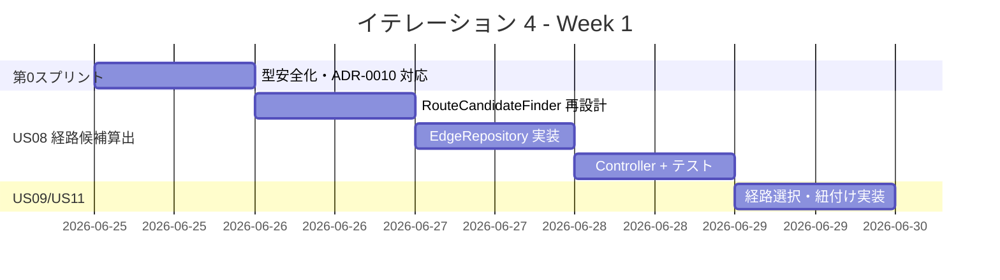
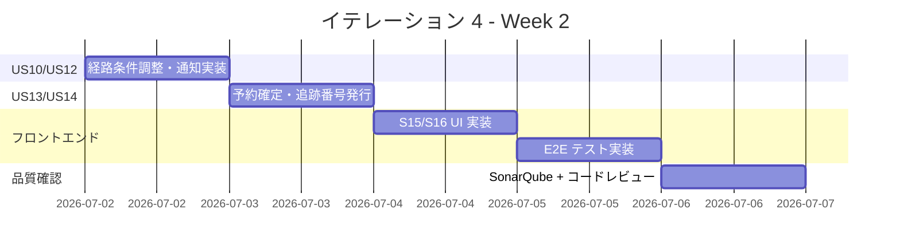

# イテレーション 4 計画

## 概要

| 項目 | 内容 |
|------|------|
| **イテレーション** | 4 / 8 |
| **期間** | Week 7-8（2026-06-25 〜 2026-07-08） |
| **ゴール** | 経路候補算出（US08）を中核に、選択・調整・確定・追跡番号発行まで Phase 1 の経路設計フローを完成させる |
| **目標 SP** | 25（新規 25 SP） |
| **基準ベロシティ** | 14.7 SP（IT1: 14 / IT2: 14 / IT3: 16 の平均）／ バッファ 15% 込み |

> **ベロシティ再評価（IT1〜IT3 実績）**: 実績平均 14.7 SP/IT。IT4 の目標 25 SP は平均の約 1.7 倍であり、スコープリスクが高い。IT4 第 0 スプリントでストーリー優先順位を精査し、フィーチャバッファ（US12 通知・US10 調整）を後回し候補として識別しておく。

> **ADR-0010 対応（IT4 第 0 スプリント）**: US08 本実装では `OptimalRouteService` を IT3 PoC のままプロモートせず、ADR-0010 に従ってゼロから設計する。IT3 の `OptimalRouteServiceTest`（6 テスト）を受け入れ基準として使用し、`TransitEdge` を `UnLocode` VO・`Set<CargoType>` で再実装する。

> **ADR-0011 対応**: `EdgeRepository` ポートを定義し `RouteCandidateFinder`（旧 OptimalRouteService）を Spring Bean 化する。`CarrierMovement`（Write Side）への直接参照は禁止。

---

## ゴール

### イテレーション終了時の達成状態

1. **経路候補算出（US08, UC06）**: 経路設計者が S11 で「経路候補を算出」を選択すると、`RouteCandidateFinder`（DFS → IT4 で評価関数付きに改善）が寄港地・期限・貨物種別・乗り継ぎ制約を考慮した候補一覧（所要日数・経由港・費用・航海番号）を返却し、S15 で推奨順に表示される
2. **経路選択・確定（US09, UC07）**: 経路設計者が候補一覧から 1 件を選択して「確定」すると、選択した経路の状態が「確定」になり、次ステップ（US11）へ進める。候補がない場合は条件調整（US10）に誘導する
3. **経路条件調整・再算出（US10, UC08）**: 候補ゼロ時に条件（期限・経由地・貨物種別）を調整して再算出でき、調整後も候補がない場合は営業担当者への引き継ぎ通知ができる
4. **経路情報の予約紐付け（US11, UC09）**: 確定経路を予約番号に紐付けると予約状態が「経路提案中」に更新され、`BookingStatus.ROUTE_PROPOSED` が `cargo_summary` に反映される
5. **荷主への経路通知（US12, UC10）**: 営業担当者が経路通知画面から経路詳細（経由港・所要日数・到着予定日・料金概算）を確認し、荷主へ通知を送信できる
6. **予約確定（US13, UC11）**: 荷主承認後に営業担当者が予約確定操作をすると `BookingStatus.CONFIRMED` に遷移し、経路設計者へ追跡番号発行依頼通知が送信される
7. **追跡番号発行（US14, UC12）**: `BookingStatus.CONFIRMED` の予約に対して一意の追跡番号が採番・保存され、荷主への発行通知が送信される

### 成功基準

- [ ] `POST /api/v1/routing/candidates`（または `GET /api/v1/bookings/{id}/candidates`）で経路候補一覧が返却される（US08）
- [ ] `POST /api/v1/routing/select` で候補を選択でき、経路状態が「確定」になる（US09）
- [ ] `POST /api/v1/routing/adjust` で条件を調整して経路を再算出できる（US10）
- [ ] `POST /api/v1/bookings/{id}/assign-route` で確定経路が予約に紐付き、`cargo_summary.booking_status` が `ROUTE_PROPOSED` に更新される（US11）
- [ ] `POST /api/v1/bookings/{id}/notify-route` で荷主への経路通知が送信される（US12）
- [ ] `POST /api/v1/bookings/{id}/confirm` で予約状態が `CONFIRMED` に遷移する（US13）
- [ ] `POST /api/v1/bookings/{id}/issue-tracking` で追跡番号が発行され `cargo_summary.tracking_number` に保存される（US14）
- [ ] `OptimalRouteServiceTest`（IT3 PoC の 6 テスト）が IT4 本実装で全件パスする（ADR-0010）
- [ ] SonarQube Quality Gate PASS（new_coverage ≥ 87%）
- [ ] フロントエンド「経路算出 → 選択 → 通知 → 確定 → 追跡番号」E2E が Playwright で GREEN

---

## ユーザーストーリー

### 対象ストーリー

| ID | ユーザーストーリー | SP | 優先度 | 区分 |
|----|-------------------|----|--------|------|
| US08 | 経路候補を算出する | 8 | 必須 | 新規（ADR-0010 本実装） |
| US09 | 経路を選択・確定する | 3 | 必須 | 新規 |
| US10 | 経路条件を調整して再算出する | 3 | 中 | 新規（フィーチャバッファ候補） |
| US11 | 経路情報を予約に紐付ける | 2 | 必須 | 新規 |
| US12 | 確定経路を荷主に通知する | 3 | 中 | 新規（フィーチャバッファ候補） |
| US13 | 予約を確定する | 3 | 必須 | 新規 |
| US14 | 追跡番号を発行する | 3 | 必須 | 新規 |
| **合計** | | **25** | | |

> **フィーチャバッファ**: US10（3 SP）と US12（3 SP）はベロシティ超過時の後回し候補。US10 なし → 候補 0 件時は「営業担当者に連絡」のみ表示。US12 なし → 通知はログ記録のみ。

### ストーリー詳細

#### US08: 経路候補を算出する（UC06）

**ストーリー**:

> 経路設計者として、航海スケジュール検索結果をもとに制約条件を考慮した経路候補を自動算出してほしい。なぜなら、手作業の属人化を解消し最適経路を効率的に見つけられるからだ。

**受入条件**:

1. 航海スケジュール検索結果・出発地・目的地・期限を入力として経路候補が自動算出される
2. 寄港地の接続可能性（前の到着港 == 次の出発港）が評価される
3. 経路候補ごとに所要日数・経由港・費用・航海番号が表示される
4. 直行便がある場合、最優先候補として提示される
5. 期限内に到達可能な経路がない場合、その旨が通知され条件調整が促される
6. IT3 PoC テスト（`OptimalRouteServiceTest` 6 件）が本実装でパスする

**ADR-0010 対応**:
- `OptimalRouteService`（PoC）の実装をゼロから再設計する
- クラス名を `RouteCandidateFinder` に変更する（M8 対応）
- グラフ表現を `Map<String, List<TransitEdge>>` 隣接リストに変更する（H3 対応）
- `TransitEdge` を `UnLocode` VO・`Set<CargoType>` で再実装する（H8, M5 対応）
- 乗り継ぎ最小時間（24h）を `RouteSearchSpecification` に追加する（H4 対応）
- 候補 0 件時の代替案提示を実装する（H5 対応）
- `EdgeRepository` ポートを定義して Spring Bean 化する（ADR-0011）

#### US09: 経路を選択・確定する（UC07）

**ストーリー**:

> 経路設計者として、算出された経路候補から最適なものを選択し、経路を確定したい。なぜなら、最適経路を正式に確定し、予約への紐付けに進めるからだ。

**受入条件**:

1. 経路候補一覧（経由港・所要日数・費用・航海番号）を確認できる
2. 最適な経路候補を 1 件選択できる
3. 選択後、経路状態が「確定」になる
4. 最適な候補がない場合、経路条件調整（US10）に進める

#### US10: 経路条件を調整して再算出する（UC08）

**ストーリー**:

> 経路設計者として、経路候補に最適なものがない場合に条件（期限・経由地等）を調整して経路候補を再算出したい。なぜなら、条件を柔軟に調整することで実現可能な経路を見つけ、輸送を実現できるからだ。

**受入条件**:

1. 現在の制約条件（期限・経由地制限等）を確認できる
2. 条件を調整（期限延長・経由地追加）して再算出を実行できる
3. 調整後も候補がない場合、営業担当者に荷主との条件協議を依頼できる

#### US11: 経路情報を予約に紐付ける（UC09）

**ストーリー**:

> 経路設計者として、確定した経路情報を貨物予約に紐付けたい。なぜなら、予約と経路の関連を確立し、営業担当者が荷主にルート提案できるようにするからだ。

**受入条件**:

1. 確定経路と予約番号を確認できる
2. 経路情報を予約に紐付ける操作を実行できる
3. 紐付け後、予約状態が「経路提案中」（`ROUTE_PROPOSED`）に更新される

#### US12: 確定経路を荷主に通知する（UC10）

**ストーリー**:

> 営業担当者として、経路が予約に紐付けられた後、確定経路の詳細を荷主に通知したい。なぜなら、荷主が確定経路の内容を確認し、承認または変更依頼を行えるようにするからだ。

**受入条件**:

1. 予約番号を指定して紐付けられた経路情報を確認できる
2. 通知内容（経由港・所要日数・到着予定日・料金概算）を確認できる
3. 荷主への経路通知を送信できる（IT4 ではログ記録のみ、メール送信は IT5+）

#### US13: 予約を確定する（UC11）

**ストーリー**:

> 営業担当者として、荷主がルートを承認したことを確認して予約を正式確定したい。なぜなら、荷主の同意を記録し、追跡番号発行・輸送手配に進めるからだ。

**受入条件**:

1. 予約番号を指定して予約内容と選択ルートを確認できる
2. 確定操作を行うと予約状態が `CONFIRMED` に更新される
3. 経路設計者に追跡番号発行依頼の通知が送信される（IT4 ではログ記録のみ）
4. 荷主がルート変更を希望する場合、予約を「経路設計中」に戻せる

#### US14: 追跡番号を発行する（UC12）

**ストーリー**:

> 経路設計者として、確定した予約に対して一意の追跡番号を発行し、荷主に通知したい。なぜなら、荷主が追跡番号を使って輸送状況をいつでも確認できるようになるからだ。

**受入条件**:

1. `CONFIRMED` 状態の予約に対して追跡番号を発行できる
2. 追跡番号は一意に採番される（フォーマット: `TRK-{YYYYMMDD}-{UUID 前 8 桁}`）
3. 発行後、貨物状態が「受領待ち」（`AWAITING_PICKUP`）に設定される

---

## タスク

### 1. IT4 第 0 スプリント: ADR 対応・型安全化（ADR-0010/0011）（1 日）

| # | タスク | 見積もり | 状態 |
|---|--------|---------|------|
| 0.1 | `TransitEdge` を `String` → `UnLocode` VO・`Set<CargoType>` で再実装（H8, M5） | 2h | [ ] |
| 0.2 | `RouteSearchSpecification` に最小乗り継ぎ時間（24h）・最大経由数を追加（H4, M6） | 1h | [ ] |
| 0.3 | `EdgeRepository` ポート（インターフェース）を定義（ADR-0011） | 1h | [ ] |
| 0.4 | `OptimalRouteServiceTest` が新実装でパスすることを確認（ADR-0010 検証） | 1h | [ ] |

**小計**: 5h

### 2. US08: 経路候補算出本実装（8 SP）

| # | タスク | 見積もり | 状態 |
|---|--------|---------|------|
| 2.1 | `RouteCandidateFinder`（旧 OptimalRouteService）を隣接リスト + 評価関数で再設計（H3） | 4h | [ ] |
| 2.2 | `EdgeRepositoryImpl`（MyBatis）で `voyage` + `carrier_movement` JOIN クエリ実装 | 3h | [ ] |
| 2.3 | `RouteCandidateFinder` を Spring Bean（`@Service`）化・`EdgeRepository` DI | 2h | [ ] |
| 2.4 | `RouteSearchController`（`GET /api/v1/routing/candidates`）実装 | 2h | [ ] |
| 2.5 | `RouteCandidateFinderTest`（境界値・異常系・REFRIGERATED 追加）（M1-M3 対応） | 3h | [ ] |
| 2.6 | `RouteSearchControllerIntegrationTest` 実装 | 2h | [ ] |

**小計**: 16h

### 3. US09: 経路選択・確定（3 SP）

| # | タスク | 見積もり | 状態 |
|---|--------|---------|------|
| 3.1 | `SelectRouteCommand` + `RouteSelectedEvent`・`Itinerary` Aggregate（routingms） | 3h | [ ] |
| 3.2 | `POST /api/v1/routing/select` REST エンドポイント実装 | 2h | [ ] |
| 3.3 | `RouteSelectionTest`（正常系・候補なし誘導） | 2h | [ ] |

**小計**: 7h

### 4. US10: 経路条件調整・再算出（3 SP）

| # | タスク | 見積もり | 状態 |
|---|--------|---------|------|
| 4.1 | `AdjustRouteConditionCommand` + 調整後再算出ロジック | 3h | [ ] |
| 4.2 | `POST /api/v1/routing/adjust` エンドポイント実装 | 2h | [ ] |
| 4.3 | 候補ゼロ時の営業担当者向けメッセージ実装 | 1h | [ ] |

**小計**: 6h

### 5. US11: 経路情報の予約紐付け（2 SP）

| # | タスク | 見積もり | 状態 |
|---|--------|---------|------|
| 5.1 | `AssignRouteCommand` + `RouteAssignedEvent`・`cargo_summary.booking_status` → `ROUTE_PROPOSED` 更新 | 3h | [ ] |
| 5.2 | `POST /api/v1/bookings/{id}/assign-route` エンドポイント実装 | 2h | [ ] |

**小計**: 5h

### 6. US12: 荷主への経路通知（3 SP）

| # | タスク | 見積もり | 状態 |
|---|--------|---------|------|
| 6.1 | `NotifyRouteCommand` + 通知ログ記録（IT4 はログのみ・メール IT5+） | 2h | [ ] |
| 6.2 | `POST /api/v1/bookings/{id}/notify-route` エンドポイント実装 | 2h | [ ] |

**小計**: 4h

### 7. US13: 予約確定（3 SP）

| # | タスク | 見積もり | 状態 |
|---|--------|---------|------|
| 7.1 | `ConfirmBookingCommand` + `BookingConfirmedEvent`・`BookingStatus.CONFIRMED` 遷移 | 3h | [ ] |
| 7.2 | `POST /api/v1/bookings/{id}/confirm` エンドポイント実装 | 2h | [ ] |
| 7.3 | ルート変更戻し（`ROUTE_PROPOSED` → `ROUTING`）コマンド実装 | 2h | [ ] |

**小計**: 7h

### 8. US14: 追跡番号発行（3 SP）

| # | タスク | 見積もり | 状態 |
|---|--------|---------|------|
| 8.1 | `IssueTrackingNumberCommand` + `TrackingNumberIssuedEvent`・採番ロジック | 3h | [ ] |
| 8.2 | `cargo_summary.tracking_number` 更新 + `cargo_summary.status` → `AWAITING_PICKUP` | 2h | [ ] |
| 8.3 | `POST /api/v1/bookings/{id}/issue-tracking` エンドポイント実装 | 2h | [ ] |

**小計**: 7h

### 9. フロントエンド（S15 経路候補・選択・確定 UI）

| # | タスク | 見積もり | 状態 |
|---|--------|---------|------|
| 9.1 | S15 経路候補一覧画面（推奨順表示・選択操作） | 4h | [ ] |
| 9.2 | S16 条件調整・再算出画面（US10） | 3h | [ ] |
| 9.3 | S10 予約詳細に「経路通知」「予約確定」アクション追加 | 2h | [ ] |
| 9.4 | 追跡番号発行操作の UI 実装 | 2h | [ ] |
| 9.5 | Playwright E2E「経路算出 → 選択 → 通知 → 確定 → 追跡番号」 | 4h | [ ] |

**小計**: 15h

### 10. 品質確認

| # | タスク | 見積もり | 状態 |
|---|--------|---------|------|
| 10.1 | SonarQube スキャン + Quality Gate 確認 | 1h | [ ] |
| 10.2 | コードレビュー（`developing-review`） | 2h | [ ] |

**小計**: 3h

### タスク合計

| カテゴリ | SP | 理想時間 | 状態 |
|---------|----|----|------|
| 第 0 スプリント（ADR 対応・型安全化） | - | 5h | [ ] |
| US08 経路候補算出 | 8 | 16h | [ ] |
| US09 経路選択・確定 | 3 | 7h | [ ] |
| US10 経路条件調整・再算出 | 3 | 6h | [ ] |
| US11 経路情報の予約紐付け | 2 | 5h | [ ] |
| US12 荷主への経路通知 | 3 | 4h | [ ] |
| US13 予約確定 | 3 | 7h | [ ] |
| US14 追跡番号発行 | 3 | 7h | [ ] |
| フロントエンド（S15/S16 UI + E2E） | - | 15h | [ ] |
| 品質確認 | - | 3h | [ ] |
| **合計** | **25** | **75h** | |

**1 SP あたり**: 約 3h（実装 + テスト）
**進捗率**: 0% (0/25 SP)

---

## スケジュール

### Week 1（Day 1-5）

| 日 | タスク |
|----|--------|
| Day 1 | 第 0 スプリント（型安全化・ADR-0010/0011 対応）|
| Day 2 | US08: `RouteCandidateFinder` 再設計 + `EdgeRepository` 実装 |
| Day 3 | US08: REST Controller + 統合テスト |
| Day 4 | US09: 経路選択・確定実装 |
| Day 5 | US11: 経路情報の予約紐付け実装 |

### Week 2（Day 6-10）

| 日 | タスク |
|----|--------|
| Day 6 | US10: 経路条件調整・再算出実装 |
| Day 7 | US12 + US13: 荷主通知・予約確定実装 |
| Day 8 | US14: 追跡番号発行実装 |
| Day 9 | フロントエンド S15/S16 UI + E2E |
| Day 10 | SonarQube 品質確認・コードレビュー・デモ準備 |

---

## 設計

### API 設計

| メソッド | エンドポイント | 説明 | SP |
|---------|---------------|------|-----|
| GET | `/api/v1/routing/candidates?bookingId={id}` | 経路候補算出（US08） | US08 |
| POST | `/api/v1/routing/select` | 経路選択・確定（US09） | US09 |
| POST | `/api/v1/routing/adjust` | 経路条件調整・再算出（US10） | US10 |
| POST | `/api/v1/bookings/{id}/assign-route` | 経路情報の予約紐付け（US11） | US11 |
| POST | `/api/v1/bookings/{id}/notify-route` | 荷主への経路通知（US12） | US12 |
| POST | `/api/v1/bookings/{id}/confirm` | 予約確定（US13） | US13 |
| POST | `/api/v1/bookings/{id}/issue-tracking` | 追跡番号発行（US14） | US14 |

### 主なドメインイベント

| コマンド | イベント | Aggregate | 状態遷移 |
|---------|---------|-----------|---------|
| `SelectRouteCommand` | `RouteSelectedEvent` | `Itinerary`（routingms） | → 確定 |
| `AssignRouteCommand` | `RouteAssignedEvent` | `Cargo`（bookingms） | → `ROUTE_PROPOSED` |
| `ConfirmBookingCommand` | `BookingConfirmedEvent` | `Cargo`（bookingms） | → `CONFIRMED` |
| `IssueTrackingNumberCommand` | `TrackingNumberIssuedEvent` | `Cargo`（bookingms） | → `AWAITING_PICKUP` |

### `cargo_summary` テーブルへの追加カラム

| カラム | 型 | 説明 |
|-------|-----|------|
| `tracking_number` | VARCHAR(30) | 追跡番号（`TRK-YYYYMMDD-XXXXXXXX`） |
| `status` | VARCHAR(20) | 貨物状態（`AWAITING_PICKUP` 等） |
| `route_summary` | TEXT | 選択された経路サマリー（JSON） |

### ADR

| ADR | タイトル | ステータス |
|-----|---------|-----------|
| [ADR-0010](../adr/0010-us08-poc-promotion-policy.md) | US08 PoC 処理方針（テスト存続・実装再設計） | 承認済み |
| [ADR-0011](../adr/0011-carrier-movement-and-transit-edge-responsibility.md) | CarrierMovement と TransitEdge の責務分離 | 承認済み |

---

## リスクと対策

| リスク | 影響度 | 対策 |
|--------|--------|------|
| US08 本実装がベロシティを大幅超過（PoC 捨て + 再設計） | 高 | IT4 第 0 スプリントで隣接リスト + EdgeRepository の骨格を先に確立し、その後 US09〜14 を並行実装 |
| 25 SP が基準ベロシティ（14.7 SP）の 1.7 倍 | 高 | US10（3 SP）と US12（3 SP）をフィーチャバッファとして識別。超過時は IT5 へ繰越し |
| bookingms ↔ routingms 間の Aggregate 状態同期 | 中 | Saga パターン（IT4 では手動トリガー）で段階的に実装。IT5 で自動化 |
| `EdgeRepository` の MyBatis JOIN クエリ複雑度 | 中 | `carrier_movement` × `voyage` の JOIN クエリをユニットテストで先に固定してから実装 |

---

## 完了条件

### Definition of Done

- [ ] コードレビュー（`developing-review`）完了
- [ ] 全ユニットテストがパス（`IT3 OptimalRouteServiceTest` 6 件含む）
- [ ] 統合テスト・E2E テストがパス
- [ ] SonarQube Quality Gate PASS（new_coverage ≥ 87%）
- [ ] Checkstyle / SpotBugs / SonarQube violations 0 件
- [ ] API ドキュメント（Swagger）が更新されている
- [ ] `cargo_summary` テーブルへの追加カラムが Flyway マイグレーションとして管理されている
- [ ] `docs/design/domain-model.md` / `data-model.md` が実装と整合している

### デモ項目

1. S11 で予約を選択し「経路候補を算出」→ 候補一覧が推奨順で表示される
2. 候補から 1 件を選択して「経路を確定」→ 状態が「確定」になる
3. S10 予約詳細で「経路通知」→ 通知ログが記録される
4. 「予約確定」→ `BookingStatus.CONFIRMED` に遷移する
5. 「追跡番号発行」→ 追跡番号が表示される

---

## 更新履歴

| 日付 | 更新内容 | 更新者 |
|------|---------|--------|
| 2026-05-16 | 初版作成（IT3 完了後・ADR-0010/0011 対応込み） | AI Agent（XP PM） |

---

## 関連ドキュメント

- [リリース計画](./release_plan.md)
- [イテレーション 3 計画](./iteration_plan-3.md)
- [イテレーション 3 完了報告書](./iteration_report-3.md)
- [ADR-0010 US08 PoC 処理方針](../adr/0010-us08-poc-promotion-policy.md)
- [ADR-0011 CarrierMovement と TransitEdge の責務分離](../adr/0011-carrier-movement-and-transit-edge-responsibility.md)
- [US08 先行スパイク コードレビュー](../review/us08_spike_review_20260516.md)
