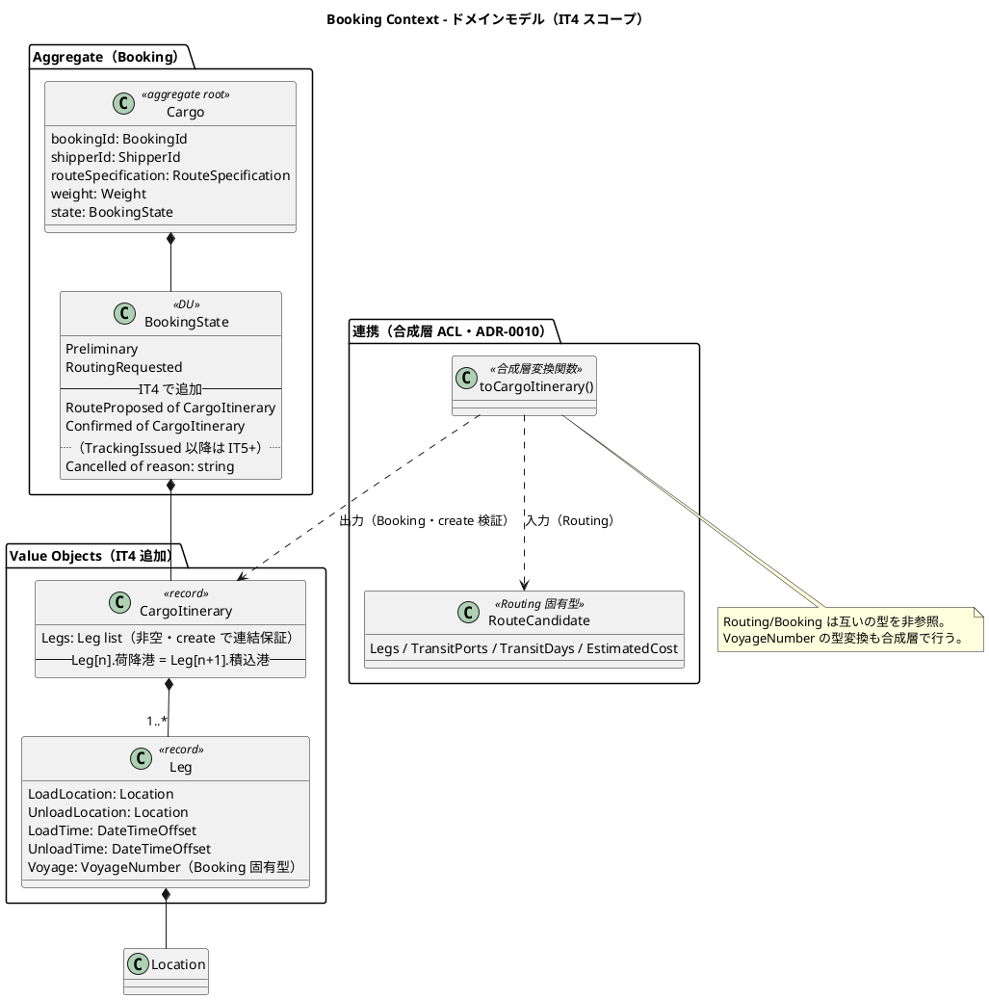
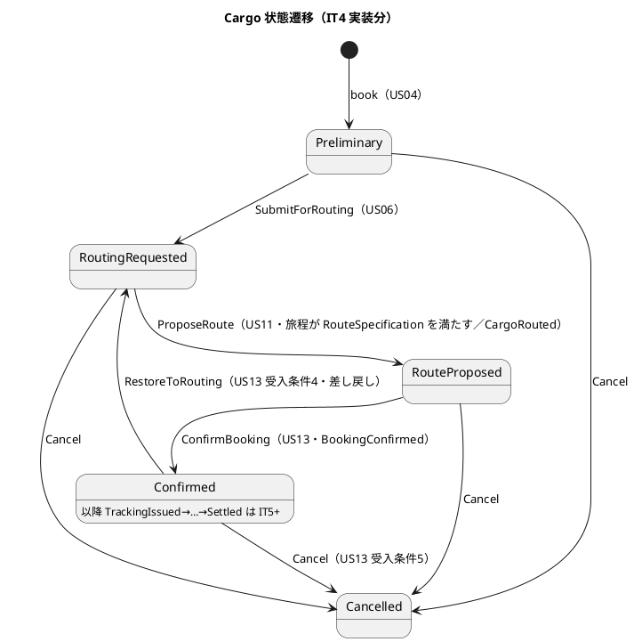
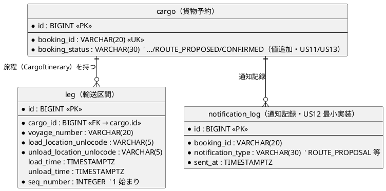
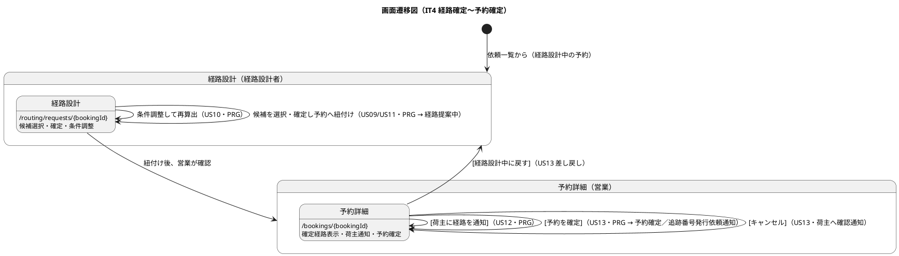

# イテレーション 4 計画

## 概要

| 項目 | 内容 |
|------|------|
| **イテレーション** | 4 |
| **期間** | 2026-08-25 〜 2026-09-05（2 週間） |
| **ゴール** | 算出済み経路候補の選択・確定から、予約への紐付け・荷主通知・予約確定まで、経路設計者と営業担当者をまたぐ予約フローを完結させる |
| **目標 SP** | 12（US09/US10/US11/US12/US13） |
| **局面** | 中盤（開発戦略）／アプローチ: **インサイドアウト** |

---

## ゴール

### イテレーション終了時の達成状態

1. **経路選択・確定（US09）**: 経路設計者が経路候補から 1 件を選択し、経路を確定できる。最適候補が無ければ条件調整（US10）に進める。
2. **経路条件調整・再算出（US10）**: 制約条件（期限・貨物種別等）を調整して経路候補を再算出できる。満たす経路が無ければ営業への条件協議依頼に進める。
3. **経路の予約紐付け（US11）**: 確定経路を貨物予約に紐付け、予約状態が「経路提案中（RouteProposed）」に更新される。
4. **確定経路の荷主通知（US12）**: 営業担当者が紐付けられた経路（経由港・所要日数・到着予定日・料金概算）を荷主に通知でき、通知記録が残る。
5. **予約確定（US13）**: 営業担当者が荷主承認を確認して予約を「予約確定（Confirmed）」に更新できる。経路設計者へ追跡番号発行依頼を通知。差し戻し（経路設計中へ）・キャンセルにも対応。

### 成功基準

- [ ] Booking の状態遷移（`Preliminary → RoutingRequested → RouteProposed → Confirmed`／各状態からの `Cancelled`／`Confirmed → RoutingRequested` 差し戻し）が FsCheck を含むユニットで網羅検証される
- [ ] `CargoItinerary`（Leg 非空リスト・連結制約 `Leg[n].荷降港 = Leg[n+1].積込港`）が `create` で保証される
- [ ] 選択された Routing の経路候補が Booking の `CargoItinerary` へ変換され予約に紐付く（BC 分離を保った連携）
- [ ] post-commit イベント dispatch（`CargoRouted`・`BookingConfirmed` 等）が UnitOfWork へ結線される（retro-3 Try#1・レビュー M2）
- [ ] 「経路選択→確定→紐付け→荷主通知→予約確定」が受け入れテストで一気通貫
- [ ] leg テーブルへの旅程永続化が統合テストでパスする
- [ ] ドメイン被覆 85%／全体 80% のカバレッジゲート・ArchUnit（Routing/Booking の BC 分離）が緑

> **アプローチ（中盤インサイドアウト IT3-IT5）**: [開発戦略](./development_strategy.md#中盤-インサイドアウトit3-it5)に従い、Booking の `CargoItinerary` と状態遷移（`ProposeRoute`/`ConfirmBooking` 等）をドメイン層で FsCheck 込みに固めてから、Routing→Booking 連携・永続化・Web へ展開する。IT2/IT3 で確立した ACL＝関数レコード・UoW・カバレッジゲート・ArchUnit の規律を踏襲する。

---

## ユーザーストーリー

### 対象ストーリー

| ID | ユーザーストーリー | SP | 優先度 |
|----|-------------------|----|----|
| US09 | 経路を選択・確定する | 3 | 必須 |
| US10 | 経路条件を調整して再算出する | 3 | 必須（バッファ調整候補）|
| US11 | 経路情報を予約に紐付ける | 2 | 必須 |
| US12 | 確定経路を荷主に通知する | 2 | 必須 |
| US13 | 予約を確定する | 2 | 必須 |
| **合計** | | **12** | |

### ストーリー詳細

#### US09: 経路を選択・確定する

**として**: 経路設計者

**受入条件**:

1. 経路候補一覧（経由港・所要日数・費用・航海番号）を確認できる
2. 最適な経路候補を 1 件選択できる
3. 選択後、経路状態が「確定」になる
4. 最適な候補がない場合、経路条件調整（US10）に進める

#### US10: 経路条件を調整して再算出する

**として**: 経路設計者

**受入条件**:

1. 現在の制約条件（期限・経由地制限等）を確認できる
2. 条件を調整（期限延長・貨物種別変更等）して再算出を実行できる
3. 調整後の条件で新たな経路候補が算出・提示される
4. 調整後も条件を満たす経路がない場合、営業担当者に荷主との条件協議を依頼できる

#### US11: 経路情報を予約に紐付ける

**として**: 経路設計者

**受入条件**:

1. 確定経路と予約番号を確認できる
2. 経路情報を予約に紐付ける操作を実行できる
3. 紐付け後、予約状態が「経路提案中」に更新される

#### US12: 確定経路を荷主に通知する

**として**: 営業担当者

**受入条件**:

1. 予約番号を指定して紐付けられた経路情報を確認できる
2. 通知内容（経由港・所要日数・到着予定日・料金概算）を確認できる
3. 荷主への経路通知を送信できる
4. 通知送信記録が登録される

#### US13: 予約を確定する

**として**: 営業担当者

**受入条件**:

1. 予約番号を指定して予約内容と選択ルートを確認できる
2. 確定操作を行うと予約状態が「予約確定」に更新される
3. 経路設計者に追跡番号発行依頼の通知が送信される
4. 荷主がルート変更を希望する場合、予約を「経路設計中」に戻せる
5. 荷主がキャンセルを希望する場合、予約をキャンセル状態に変更できる
6. キャンセル時、荷主にキャンセル確認通知が送信される

### タスク

#### 1. Booking ドメイン拡張（インサイドアウト先行）

| # | タスク | 見積もり | 担当 | 状態 |
|---|--------|---------|------|------|
| 1.1 | `Leg`（積込港・荷降港・積込/荷降時刻・VoyageNumber）と `CargoItinerary`（Leg 非空リスト・連結制約 `Leg[n].荷降港 = Leg[n+1].積込港`）を `create` で保証 + FsCheck | 4h | - | [x] |
| 1.2 | `BookingState` に `RouteProposed of CargoItinerary`・`Confirmed of CargoItinerary` を追加（ADR-0007 と同系統の DU 拡張・`toString`/`ofString`・CHECK 制約更新）| 2h | - | [x] |
| 1.3 | `BookingCommand`／`Cargo.execute` に `ProposeRoute`（RoutingRequested→RouteProposed・**`RouteSpecification.isSatisfiedBy` で旅程がルート仕様を満たすことを検証**・CargoRouted 発行）・`ConfirmBooking`（RouteProposed→Confirmed・BookingConfirmed 発行）・`RestoreToRouting`（Confirmed→RoutingRequested 差し戻し・US13 受入条件4）・`Cancel` を実装 + ユニット/FsCheck。DU 拡張後は必ずフルテスト（網羅性）| 4h | - | [x] |

**小計**: 10h（理想時間）

> **注（BookingState DU 拡張・教訓）**: `RouteProposed`/`Confirmed` 追加により `Cargo.execute`・`stateName`・`toString`/`ofString` の全パターンマッチを再検証する。DU ケース追加後は `dotnet test`（フル）で網羅性警告ゼロ・ArchTests 緑を確認する（ADR-0007 と同じ規律）。
>
> **注（domain-model 反映・要）**: `ProposeRoute`（RoutingRequested→RouteProposed）・`ConfirmBooking`（RouteProposed→Confirmed）は domain-model の `execute` に定義済み。一方 **`RestoreToRouting`（Confirmed→RoutingRequested 差し戻し）は US13 受入条件4 の要件だが domain-model の `execute` に未定義**のため、実装時に domain-model へ遷移を追加反映する。`CargoItinerary` は domain-model では `NonEmptyList<Leg>` だが、実装は Schedule（IT3）と同様に `list` + `create` 保証とし、domain-model の型表記を実装に合わせて修正する（IT3 レビュー M6 と同じ扱い）。

#### 2. Routing→Booking 経路確定連携（US09/US11・post-commit 結線）

| # | タスク | 見積もり | 担当 | 状態 |
|---|--------|---------|------|------|
| 2.1 | 選択された Routing 経路候補（`RouteCandidate`）を Booking `CargoItinerary` へ変換する連携（ACL 変換関数・合成層で結合・BC 分離維持）。ADR-0010 起票 | 3h | - | [x] |
| 2.2 | 経路確定→予約紐付けワークフロー（`ProposeRoute` 実行・`CargoRepository.Update` で旅程永続化）。US09 の選択確定を含む | 3h | - | [x] |
| 2.3 | **post-commit イベント dispatch 結線**（`UnitOfWork.execute` で `CargoRouted`/`BookingConfirmed` を発火）。IT2 H6・IT3 M2・retro-3 Try#1 の解消 | 3h | - | [x] |

**小計**: 9h（理想時間）

#### 3. インフラ（旅程永続化）

| # | タスク | 見積もり | 担当 | 状態 |
|---|--------|---------|------|------|
| 3.1 | マイグレーション 0007（`leg` テーブル〔data-model 既定義〕を作成。`cargo.booking_status` は VARCHAR のため ROUTE_PROPOSED/CONFIRMED は値追加のみで DDL 変更不要。`routing_status`〔ROUTED/MISROUTED/NOT_ROUTED〕は経路決定結果の別概念で US09-13 には不要のため対象外）両方言 + data-model 反映 | 3h | - | [x] |
| 3.2 | CargoRepository を CargoItinerary（leg 親子）の保存・復元に拡張（Update で旅程書き込み・FindById で復元）統合テスト | 4h | - | [x] |
| 3.3 | US12 通知記録の永続化（`notification_log` 相当・最小実装）+ 統合テスト | 2h | - | [ ] |

**小計**: 9h（理想時間）

#### 4. Web（US09/US10/US11/US12/US13）

| # | タスク | 見積もり | 担当 | 状態 |
|---|--------|---------|------|------|
| 4.1 | 経路設計画面（`/routing/requests/{bookingId}`）に**経路候補の選択・確定→予約紐付け**（US09/US11）を追加 + 受入テスト | 4h | - | [x] |
| 4.2 | **条件調整・再算出**（US10・期限延長等で computeRoutes 再実行）+ 受入テスト。営業への条件協議依頼導線 | 3h | - | [ ] |
| 4.3 | 予約詳細（`/bookings/{bookingId}`）に**確定経路表示・荷主通知（US12）・予約確定（US13）・差し戻し・キャンセル**を追加 + 受入テスト（状態遷移確認）| 4h | - | [x]（US12 通知は task3.3 と併せて対応予定）|

**小計**: 11h（理想時間）

#### 5. レビュー引き継ぎの小リファクタ（任意）

| # | タスク | 見積もり | 担当 | 状態 |
|---|--------|---------|------|------|
| 5.1 | IT3 レビュー M1: `Result list` 畳み込みを FsToolkit `List.traverseResultM` に集約（Routing Application/Infrastructure）| 2h | - | [ ] |

**小計**: 2h（理想時間）

#### タスク合計

| カテゴリ | SP | 理想時間 | 状態 |
|---------|----|----|------|
| Booking ドメイン拡張 | 5 | 10h | [x] |
| Routing→Booking 連携・post-commit | — | 9h | [ ] |
| インフラ（旅程永続化・通知記録）| — | 9h | [ ] |
| Web（US09-13）| 7 | 11h | [ ] |
| 小リファクタ（M1）| — | 2h | [ ] |
| **合計** | **12** | **41h** | |

**1 SP あたり**: 約 3.4h（ストーリー分 41h / 12 SP）
**進捗率**: 42% (5/12 SP)

---

## スケジュール

### Week 1（Day 1-5）: ドメイン拡張 → 連携 → 永続化

| 日 | タスク |
|----|--------|
| Day 1 | Leg・CargoItinerary 連結制約（FsCheck） |
| Day 2 | BookingState 拡張（RouteProposed/Confirmed）・execute 遷移（ProposeRoute/ConfirmBooking/RestoreToRouting）|
| Day 3 | Routing→Booking 経路候補変換（ADR-0010）・紐付けワークフロー |
| Day 4 | post-commit dispatch 結線（UnitOfWork）|
| Day 5 | マイグレーション 0007・CargoRepository の旅程永続化 統合テスト |

### Week 2（Day 6-10）: Web → 統合

| 日 | タスク |
|----|--------|
| Day 6 | US09/US11 経路選択・確定・紐付け画面・受入テスト |
| Day 7 | US10 条件調整・再算出・受入テスト |
| Day 8 | US12 荷主通知・US13 予約確定/差し戻し/キャンセル・受入テスト |
| Day 9 | M1 リファクタ・「選択→確定→通知→予約確定」一気通貫 E2E |
| Day 10 | カバレッジゲート・統合・デモ準備 |

---

## 設計

参照する設計ドキュメント:

- [ドメインモデル設計](../design/domain-model.md)（Booking: CargoItinerary・Leg・BookingState 全ケース・execute）
- [データモデル設計](../design/data-model.md)（cargo.booking_status・leg・routing_status）
- [UI 設計](../design/ui_design.md)（予約詳細 US12/US13・経路設計 US09/US10/US11）
- [開発戦略](./development_strategy.md)（中盤インサイドアウト）

### ドメインモデル（IT4 スコープ: Booking の経路確定拡張 + 連携）

IT4 で追加する Booking 要素（`Leg`・`CargoItinerary`・`BookingState` の `RouteProposed`/`Confirmed`）と、Routing→Booking 連携（ADR-0010・合成層 ACL 変換）を示す。`RestoreToRouting` は US13 差し戻し用に本 IT で追加（domain-model へ反映）。

### 状態遷移（IT4 スコープ: 経路確定〜予約確定）

### データモデル（IT4 スコープ: leg + cargo.booking_status 値追加）

`leg` テーブルは data-model 既定義。`cargo.booking_status` は VARCHAR のため値追加のみ（DDL 変更不要）。`routing_status`（経路決定結果）は US09-13 に不要のため対象外。

### 画面遷移（IT4 スコープ: 経路確定〜予約確定フロー）

役割分担（設計レビュー #25/#76）: 経路の選択・確定・紐付けは経路設計フロー、荷主通知・予約確定は営業の予約詳細に配置。

### 主要な設計判断

#### 経路確定の Routing→Booking 連携（要決着・ADR-0010 起票候補）

US09 で経路設計者が選択した Routing の経路候補（`RouteCandidate`: 航海番号・経由港・所要日数）を、US11 で Booking の `CargoItinerary`（`Leg` 非空リスト）へ変換して予約に紐付ける。BC 分離（ADR-0001）のもとで、この横断変換をどこに置くか。

| 案 | 内容 | トレードオフ |
|----|------|-------------|
| A（推奨）| Web 合成層の ACL 変換関数で `RouteCandidate → CargoItinerary` を構成し、Booking の `ProposeRoute` に渡す | Routing/Booking が互いの型を参照せず、変換を合成層に閉じ込める（IT3 の荷主名解決・ShipperExistenceAdapter と同方針）|
| B | ドメインイベント（`RouteSelected`）経由で Booking が旅程を構築 | イベント基盤の実利用だが、変換ロジックがイベントハンドラに分散し追跡しづらい |

> **注**: Booking の `VoyageNumber`（Leg.Voyage 用・Booking 固有型）と Routing の `VoyageNumber`（別型）の変換も本連携で行う（domain-model の型帰属方針）。ADR-0010 として案 A を起票する。

#### BookingState DU 拡張

`RouteProposed of CargoItinerary`・`Confirmed of CargoItinerary` を追加（domain-model の全ケース定義に整合）。ADR-0007（RoutingRequested 追加）と同系統の DU 拡張であり、`booking_status` に `ROUTE_PROPOSED`/`CONFIRMED` を追加、全パターンマッチを再検証する。

### ADR

IT4 で新規起票する:

| ADR | タイトル | ステータス |
|-----|---------|-----------|
| ADR-0010 | 経路確定の Routing→Booking 連携は合成層の ACL 変換で行う | 提案 |

前提とする既存 ADR: ADR-0001/0002/0004/0006/0007/0009。

---

## 過去レビュー・ふりかえりの引き継ぎ

| 出典 | 項目 | IT4 での対応 |
|------|------|-------------|
| IT2 レビュー H6 / IT3 レビュー M2 / retro-3 Try#1 | post-commit イベント dispatch 未結線 | タスク 2.3 で UnitOfWork へ結線（CargoRouted/BookingConfirmed）|
| retro-3 Try#2 | 経路候補費用の「暫定」ラベル | IT3 レビューで対応済み（`概算費用（暫定）`）。US12 の料金概算表示でも暫定を明示 |
| IT3 レビュー M1 | Result 畳み込みの FsToolkit 集約 | タスク 5.1（任意）|
| IT3 レビュー M6 | domain-model と実装のズレ（Schedule=NonEmptyList・updateSchedule）| IT4 で domain-model を実装に合わせて修正 |
| 設計レビュー 2026-07-06 #25/#76 | 経路割り当ての役割分担（営業は閲覧/通知のみ、割り当て確定は経路設計フローに一本化）| US09/US11（経路選択・確定・紐付け）は経路設計画面（`/routing/requests/{bookingId}`・タスク 4.1）、US12/US13（通知・確定）は予約詳細（タスク 4.3）に配置。ui_design の一本化方針に整合 |
| リリース計画 | IT5 過積載（17 SP）の再評価 | 本 IT 完了時に US17 切り出しを判断 |

---

## リスクと対策

| リスク | 影響度 | 対策 |
|--------|--------|------|
| BookingState DU 拡張が既存パターンマッチ（IT2 実装）へ波及 | 高 | DU ケース追加後にフルテスト（網羅性警告ゼロ）で裏取り。ADR-0007 の規律を踏襲 |
| Routing→Booking 変換の型変換（2 つの VoyageNumber・経由港→Leg）が複雑化 | 中 | ADR-0010 で合成層 ACL に一本化。変換関数をユニットで固める |
| post-commit 結線が Booking 既存挙動（book/submitForRouting）へ波及 | 中 | UoW.execute はテスト済み。段階的に寄せ原子性テストで裏取り |
| US10 条件調整の再算出が US08 のクエリ再構成と重複 | 中 | computeRoutes を再利用し、条件差分のみ画面で受ける |
| SP 12 に対しタスク多（5 分類）| 中 | US10 をバッファ調整候補として明示（リリース計画のバッファ消費ルール）|

---

## 完了条件

### Definition of Done

- [ ] コードレビュー完了（self-review: xp-programmer / xp-tester）
- [ ] ユニット・統合・アーキテクチャテストがパス
- [ ] BookingState 遷移・CargoItinerary 連結が FsCheck 含めて網羅検証
- [ ] 「経路選択→確定→紐付け→荷主通知→予約確定」の受入テストがパス
- [ ] post-commit dispatch がロールバック時非発行・コミット後発行で動作（統合テスト）
- [ ] カバレッジゲート（ドメイン 85%／全体 80%）が緑
- [ ] ナビゲーション整合性（予約詳細・経路設計の導線・検証テスト）
- [ ] Fantomas クリーン・FSharpLint 警告なし・ビルド警告 0
- [ ] ドキュメント更新完了（release_plan 進捗・ADR-0010・data-model 0007 反映・domain-model 整合修正）

### デモ項目

1. 経路候補の選択・確定と予約への紐付け（経路設計中→経路提案中）
2. 条件調整による経路再算出
3. 荷主通知と予約確定（経路提案中→予約確定）・差し戻し・キャンセル

---

## 更新履歴

| 日付 | 更新内容 | 更新者 |
|------|---------|--------|
| 2026-07-15 | 初版作成（US09-13・12 SP）。中盤インサイドアウト。ADR-0010（経路確定連携）・BookingState DU 拡張・post-commit 結線（retro-3 Try#1）を明記 | - |

---

## 関連ドキュメント

- [リリース計画](./release_plan.md)
- [開発戦略](./development_strategy.md)
- [イテレーション 3 ふりかえり](./retrospective-3.md)
- [イテレーション 4 ふりかえり](./retrospective-4.md)（IT4 完了時に作成）
