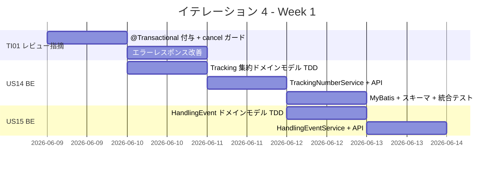
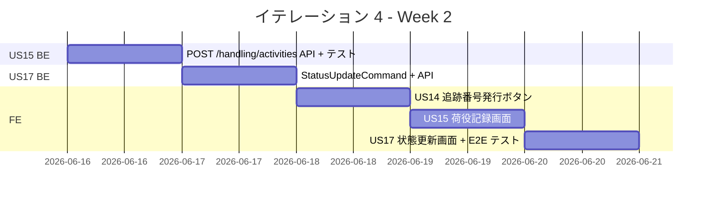
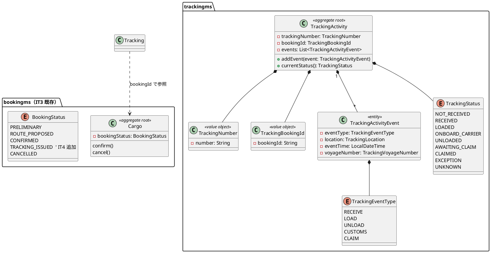
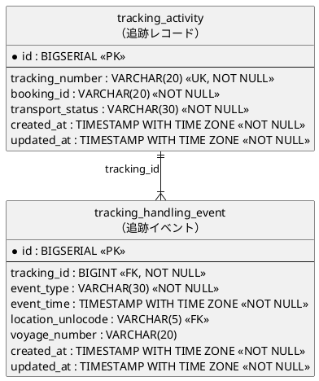
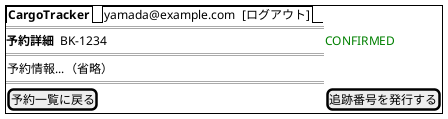
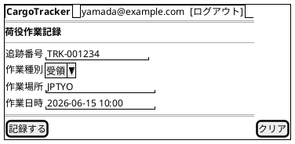
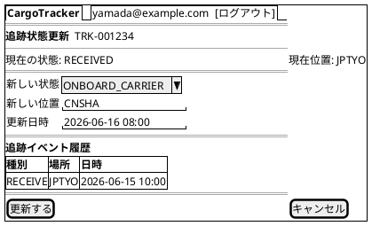
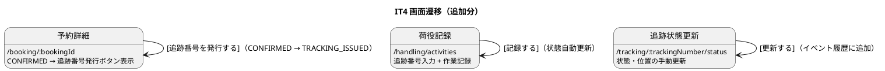
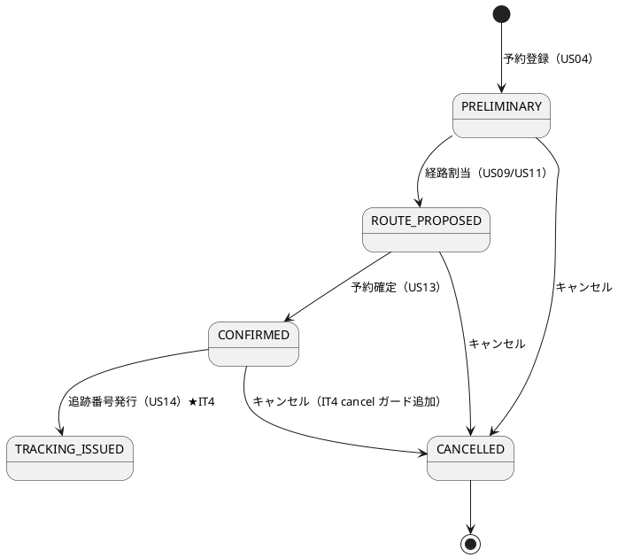
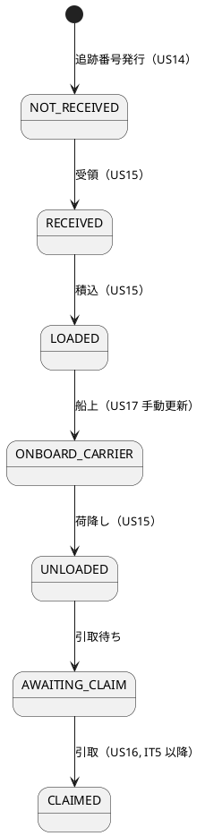

# イテレーション 4 計画

## 概要

| 項目 | 内容 |
|------|------|
| **イテレーション** | 4 |
| **期間** | Week 7-8（2026-06-09〜2026-06-20） |
| **ゴール** | trackingms を新規構築し、追跡番号発行・荷役作業記録・貨物状態手動更新の API + 画面を実装する。併せて IT3 コードレビュー高優先度指摘を解消する |
| **目標 SP** | 21（US: 18 SP + 技術改善: 3 SP） |

---

## ゴール

### イテレーション終了時の達成状態

1. **追跡番号発行**: bookingms の CONFIRMED 状態の予約に対して trackingms が追跡番号を発行し、貨物状態が「受領待ち」（NOT_RECEIVED）に遷移する API + 画面が動作する
2. **荷役作業記録**: trackingms に荷役イベント（受領・積込・荷降し）を記録し、貨物状態が自動更新される API + 画面が動作する
3. **貨物状態手動更新**: 追跡管理者が追跡番号を指定して貨物状態を手動更新できる API + 画面が動作する
4. **IT3 コードレビュー指摘解消**: `@Transactional` 付与、`cancel()` 状態ガード追加、API エラーレスポンス改善が完了する

### 成功基準

- [ ] US14: CONFIRMED 状態の予約に対して追跡番号を発行できる API が動作する（trackingms）
- [ ] US14: 追跡番号発行後、貨物状態が「受領待ち」に遷移する
- [ ] US15: 追跡番号を指定して荷役作業（受領・積込・荷降し）を記録できる API が動作する
- [ ] US15: 荷役記録後、貨物状態が対応する状態に自動更新される
- [ ] US17: 追跡番号を指定して貨物状態を手動更新できる API + 画面が動作する
- [ ] IT3 コードレビュー高優先度指摘（#1, #2, #4）が解消されている
- [ ] テストカバレッジ 80% 以上（trackingms + bookingms、JaCoCo / Vitest）

---

## ユーザーストーリー

### 対象ストーリー

| ID | ユーザーストーリー | BE | FE | SP | 優先度 |
|----|-------------------|----|----|-----|--------|
| US14 | 追跡番号を発行する | 3 | 2 | 5 | 必須 |
| US15 | 荷役作業を記録する | 5 | 3 | 8 | 必須 |
| US17 | 貨物状態を手動更新する | 3 | 2 | 5 | 必須 |
| TI01 | IT3 コードレビュー高優先度指摘解消 | 3 | 0 | 3 | 必須 |
| **合計** | | **14** | **7** | **21** | |

### ストーリー詳細

#### US14: 追跡番号を発行する

**ストーリー**:

> 経路設計者として、確定した予約に対して一意の追跡番号を発行し、荷主に通知したい。なぜなら、荷主が追跡番号を使って輸送状況をいつでも確認できるようになるからだ。

**受入条件**:

1. 「予約確定」（CONFIRMED）状態の予約に対して追跡番号を発行できる
2. 追跡番号は一意に採番される
3. 発行後、貨物状態が「受領待ち」（NOT_RECEIVED）に設定される
4. bookingms の予約状態が TRACKING_ISSUED に遷移する
5. 認証なしのリクエストは 401 エラーを返す
6. 荷主に追跡番号と追跡方法をメール通知する（通知 API 呼び出し、IT4 では stub 可）

#### US15: 荷役作業を記録する

**ストーリー**:

> 荷役作業員として、追跡番号を入力して貨物を特定し、作業種別・日時・場所を登録したい。なぜなら、荷役作業完了が即座に貨物状態に反映され、荷主がリアルタイムで確認できるからだ。

**受入条件**:

1. 追跡番号の入力（またはスキャン）で貨物を特定できる
2. 作業種別（受領・積込・荷降し）を選択できる
3. 作業日時と作業場所（UN/LOCODE 形式の港湾コード）を入力できる
4. 記録後、貨物状態が対応する状態（受領済・積込済・荷降し済）に自動更新される
5. 追跡番号が存在しない場合、エラーメッセージが表示される
6. 記録後、荷主に状態変更通知が送信される（IT4 では stub 可）
7. 作業場所が予定ルートと異なる場合、警告が表示される

#### US17: 貨物状態を手動更新する

**ストーリー**:

> 追跡管理者として、追跡番号を指定して貨物の状態・位置・更新日時を手動で更新したい。なぜなら、荷役作業員の記録だけでは捕捉できない状態変化（出港・入港等）を追跡情報に反映できるからだ。

**受入条件**:

1. 追跡番号を指定して現在の貨物情報を確認できる
2. 新しい状態・位置・日時を入力して追跡情報を更新できる
3. 更新後、追跡イベントが履歴に記録される
4. 状態変更の種類に応じて荷主への通知が送信される（IT4 では stub 可）

#### TI01: IT3 コードレビュー高優先度指摘解消

**受入条件**:

1. `CargoCommandService.assignRoute` / `confirmBooking` / `cancelBooking` に `@Transactional` が付与されている
2. `Cargo.cancel()` に DELIVERED / SETTLED 状態からのキャンセルを拒否するガードが追加されている
3. `CargoController` の `notFound()` / `badRequest()` にメッセージボディが含まれている

### タスク

#### 0. TI01 IT3 コードレビュー指摘解消（3 SP）

| # | タスク | 見積もり | 担当 | 状態 |
|---|--------|---------|------|------|
| 0.1 | bookingms: `@Transactional` を assignRoute / confirmBooking / cancelBooking に付与 + テスト確認 | 1h | - | [ ] |
| 0.2 | bookingms: `Cargo.cancel()` に状態ガード追加（DELIVERED/SETTLED 拒否）+ 状態遷移テスト（デシジョンテーブル） | 2h | - | [ ] |
| 0.3 | bookingms: `CargoController` エラーレスポンスにメッセージボディ追加 + Controller 異常系テスト | 2h | - | [ ] |

**小計**: 5h（理想時間）

#### 1. US14 追跡番号発行（5 SP）

| # | タスク | 見積もり | 担当 | 状態 |
|---|--------|---------|------|------|
| 1.1 | trackingms: TrackingNumber 値オブジェクト + TrackingActivity 集約ルート ドメインモデル TDD | 3h | - | [ ] |
| 1.2 | trackingms: TrackingNumberService アプリケーション層（追跡番号発行ロジック）TDD | 2h | - | [ ] |
| 1.3 | trackingms: POST /api/tracking/numbers エンドポイント + Controller テスト | 2h | - | [ ] |
| 1.4 | trackingms: MyBatis マッパー + スキーマ（tracking_db）+ 統合テスト | 2h | - | [ ] |
| 1.5 | FE: 予約詳細画面に「追跡番号を発行する」ボタン追加（CONFIRMED 状態のみ表示）+ mutation | 2h | - | [ ] |

**小計**: 11h（理想時間）

#### 2. US15 荷役作業記録（8 SP）

| # | タスク | 見積もり | 担当 | 状態 |
|---|--------|---------|------|------|
| 2.1 | trackingms: TrackingActivityEvent ドメインモデル（受領・積込・荷降し）+ 状態遷移ロジック TDD | 3h | - | [ ] |
| 2.2 | trackingms: TrackingActivityEventService アプリケーション層 TDD | 2h | - | [ ] |
| 2.3 | trackingms: POST /api/handling/activities エンドポイント + Controller テスト | 2h | - | [ ] |
| 2.4 | trackingms: MyBatis マッパー（tracking_handling_event テーブル）+ 統合テスト | 2h | - | [ ] |
| 2.5 | FE: 荷役記録画面（HandlingActivityPage）— 追跡番号入力 + 作業種別選択 + 記録フォーム | 3h | - | [ ] |
| 2.6 | FE: 荷役記録成功後のフィードバック UI + バリデーションエラー表示 | 1h | - | [ ] |

**小計**: 13h（理想時間）

#### 3. US17 貨物状態手動更新（5 SP）

| # | タスク | 見積もり | 担当 | 状態 |
|---|--------|---------|------|------|
| 3.1 | trackingms: StatusUpdateCommand ドメインロジック TDD | 2h | - | [ ] |
| 3.2 | trackingms: PUT /api/tracking/:trackingNumber/status エンドポイント + テスト | 2h | - | [ ] |
| 3.3 | FE: 追跡管理画面に状態手動更新フォーム実装（TrackingStatusUpdatePage） | 2h | - | [ ] |
| 3.4 | E2E: 追跡番号発行→荷役記録→状態更新の一連フロー Playwright テスト | 2h | - | [ ] |

**小計**: 8h（理想時間）

#### タスク合計

| カテゴリ | SP | 理想時間 | 状態 |
|---------|-----|---------|------|
| TI01 IT3 コードレビュー指摘解消 | 3 | 5h | [ ] |
| US14 追跡番号発行 | 5 | 11h | [ ] |
| US15 荷役作業記録 | 8 | 13h | [ ] |
| US17 貨物状態手動更新 | 5 | 8h | [ ] |
| **合計** | **21** | **37h** | |

**1 SP あたり**: 約 1.8h（IT3 実績 1.6h を考慮し、新規ドメイン構築のためやや余裕を持たせる）

**進捗率**: 0%（0/21 SP）

---

## スケジュール

### Week 1（Day 1-5）: 2026-06-09〜2026-06-13



| 日 | タスク |
|----|--------|
| Day 1 | TI01: `@Transactional` 付与 + `cancel()` 状態ガード + エラーレスポンス改善 |
| Day 2 | US14 BE: Tracking 集約ドメインモデル（TrackingNumber, Tracking）TDD |
| Day 3 | US14 BE: TrackingNumberService + POST /api/tracking/numbers エンドポイント |
| Day 4 | US14 BE: MyBatis マッパー + tracking_db スキーマ + 統合テスト |
| Day 5 | US15 BE: HandlingEvent ドメインモデル + HandlingEventService TDD |

### Week 2（Day 6-10）: 2026-06-16〜2026-06-20



| 日 | タスク |
|----|--------|
| Day 6 | US15 BE: POST /api/handling/activities エンドポイント + MyBatis + 統合テスト |
| Day 7 | US17 BE: StatusUpdateCommand ドメインロジック + PUT /api/tracking/:trackingNumber/status |
| Day 8 | US14 FE: 予約詳細画面「追跡番号を発行する」ボタン + mutation |
| Day 9 | US15 FE: 荷役記録画面（HandlingActivityPage）実装 |
| Day 10 | US17 FE: 状態手動更新画面 + E2E テスト + 統合テスト・バグ修正・デモ準備 |

---

## 設計

### ドメインモデル

IT4 では trackingms に新規ドメインモデルを構築する。



### データモデル

IT4 で tracking_db に新規テーブルを追加する。



### ユーザーインターフェース

#### ビュー

##### 予約詳細画面（/booking/:bookingId）— 更新

CONFIRMED 状態の予約に「追跡番号を発行する」ボタンを追加。



##### 荷役記録画面（/handling/activities）— 新規



##### 追跡状態更新画面（/tracking/:trackingNumber/status）— 新規



#### インタラクション



### ディレクトリ構成

```
apps/
  trackingms/                            # 新規マイクロサービス
    src/main/java/.../tracking/
      domain/
        TrackingActivity.java            # 新規: 追跡集約ルート（domain-model.md 準拠）
        TrackingNumber.java              # 新規: 追跡番号値オブジェクト
        TrackingBookingId.java           # 新規: 予約参照値オブジェクト
        TrackingActivityEvent.java       # 新規: 追跡イベントエンティティ（domain-model.md 準拠）
        TrackingEventType.java           # 新規: 追跡イベント種別（RECEIVE/LOAD/UNLOAD 等）
        TrackingStatus.java              # 新規: 追跡状態（domain-model.md の TrackingStatus 準拠）
      application/
        TrackingNumberService.java       # 新規: 追跡番号発行
        TrackingActivityEventService.java # 新規: 荷役イベント記録
        TrackingStatusService.java       # 新規: 状態手動更新
      infrastructure/
        persistence/
          TrackingActivityMapper.java    # 新規: MyBatis マッパー（tracking_activity テーブル）
          TrackingHandlingEventMapper.java # 新規: MyBatis マッパー（tracking_handling_event テーブル）
        rest/
          TrackingController.java        # 新規: REST API
          HandlingController.java        # 新規: REST API
  bookingms/
    src/main/java/.../booking/
      domain/
        Cargo.java                       # 更新: cancel() 状態ガード追加
      application/
        CargoCommandService.java         # 更新: @Transactional 付与
      infrastructure/rest/
        CargoController.java             # 更新: エラーレスポンスボディ追加
  frontend/
    src/features/
      handling/
        HandlingActivityPage.tsx         # 新規: 荷役記録画面
      tracking/
        TrackingStatusUpdatePage.tsx      # 新規: 追跡状態更新画面
      booking/
        BookingDetailPage.tsx            # 更新: 追跡番号発行ボタン追加
```

### API 設計

| メソッド | エンドポイント | サービス | 説明 |
|---------|---------------|---------|------|
| POST | /api/tracking/numbers | trackingms | 追跡番号発行（bookingId → TrackingNumber） |
| GET | /api/tracking/:trackingNumber | trackingms | 追跡情報照会（IT5 で画面追加） |
| PUT | /api/tracking/:trackingNumber/status | trackingms | 貨物状態手動更新 |
| POST | /api/handling/activities | trackingms | 荷役作業記録 |

### 状態遷移

BookingStatus の遷移（IT4 追加分）:



TrackingStatus の遷移（IT4 新規 ― domain-model.md に準拠）:



### ADR

| ADR | タイトル | ステータス |
|-----|---------|-----------|
| [ADR-003](../adr/ADR-003.md) | CargoEventPublisher ポート・アダプタ | 承認（IT3 策定、IT4 で trackingms 側でも同パターン適用） |
| [ADR-004](../adr/ADR-004.md) | Testcontainers RabbitMQ 統合テスト | 承認（IT4 でも継続利用） |

---

## リスクと対策

| リスク | 影響度 | 対策 |
|--------|--------|------|
| trackingms の新規構築で予想以上の工数がかかる | 高 | authms / bookingms のヘキサゴナル構成をテンプレートとして再利用。ドメインモデルから着手し、インフラ層は最小限で開始 |
| bookingms と trackingms のサービス間データ連携の整合性 | 中 | bookingId による論理参照のみ。RabbitMQ イベント連携は IT3 パターン（CargoRoutedEvent）を踏襲 |
| テストカバレッジ 80% 未達の継続（3 イテレーション連続） | 中 | TI01 でカバレッジ改善タスクを SP に含め、IT4 の DoD として明示的に追跡する |
| `@ConditionalOnBean` の評価順序問題（IT3 引継ぎ） | 低 | IT4 で trackingms を新規構築する際に `@AutoConfigureAfter` パターンを適用して検証 |

### IT3 コードレビュー高優先度指摘の対応方針（#5, #6）

| 指摘 # | 内容 | IT4 対応方針 |
|--------|------|-------------|
| #5 | 経路設計画面で予約情報（出発地・到着地）を自動引き継ぎ | IT5 対応。IT4 は trackingms 新規構築に集中し、スコープを限定 |
| #6 | confirmBooking 前の確認ダイアログを追加 | IT5 対応。IT4 の TI01 は BE の品質改善（@Transactional 等）を優先 |

---

## 完了条件

### Definition of Done

- [ ] コードレビュー完了（AI ペアレビュー）
- [ ] ユニットテストがパス（trackingms + bookingms）
- [ ] ArchUnit テストがパス（trackingms ヘキサゴナル依存ルール）
- [ ] E2E テストがパス（追跡番号発行→荷役記録→状態更新の一連フロー）
- [ ] テストカバレッジ 80% 以上（JaCoCo）
- [ ] SonarQube Quality Gate PASS
- [ ] 機能がローカル環境で動作確認済み
- [ ] ドキュメント更新完了

### デモ項目

1. CONFIRMED 状態の予約から追跡番号を発行する操作
2. 追跡番号を指定して荷役作業（受領・積込・荷降し）を記録し、貨物状態が自動更新される
3. 追跡管理者が貨物状態を手動更新し、イベント履歴に追加される
4. IT3 コードレビュー指摘の改善確認（キャンセルガード、エラーレスポンス）

---

## 更新履歴

| 日付 | 更新内容 | 更新者 |
|------|---------|--------|
| 2026-05-08 | 初版作成 | - |
| 2026-05-08 | 整合性検証による修正：ドメインモデル名（TrackingActivity/TrackingActivityEvent）・テーブル名（tracking_activity/tracking_handling_event）・TrackingStatus 値・US14/15/17 受入基準追加・IT3 レビュー#5/#6 対応方針追記 | - |

---

## 関連ドキュメント

- [イテレーション 4 ふりかえり](./retrospective-4.md)
- [イテレーション 3 計画](./iteration_plan-3.md)
- [イテレーション 3 ふりかえり](./retrospective-3.md)
- [IT3 コードレビュー結果](../review/it3_review_20260508.md)
- [リリース計画](./release_plan.md)
