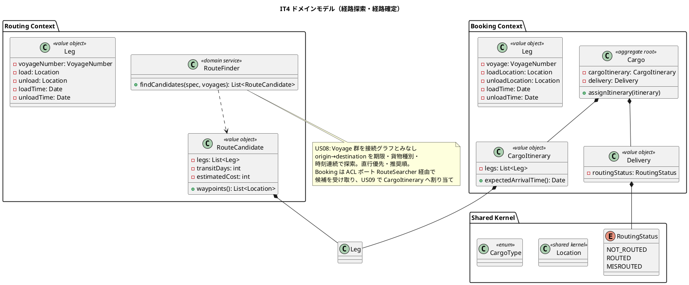
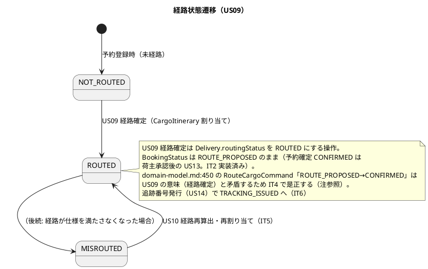
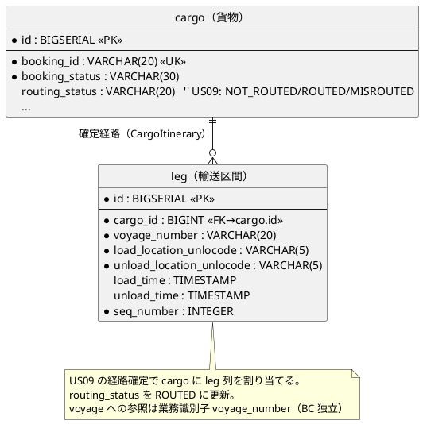
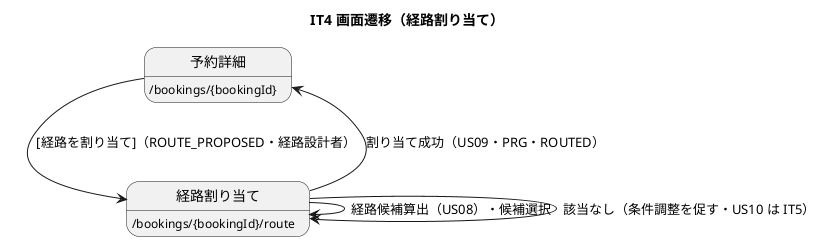

# イテレーション 4 計画

## 概要

本イテレーション（IT4）は、中盤局面（**インサイドアウト**）の核心として **経路候補算出（US08・8SP）** と **経路選択・確定（US09・3SP）** を実装する。IT3 で作り込んだ `Voyage` 集約（航海スケジュール）を土台に、Routing Context に**経路探索（グラフ探索）**の複雑ドメインを domain 層から堅牢に作り込み、Booking Context の `Cargo` に**確定経路（CargoItinerary）の割り当て**を追加する。

- **局面**: 中盤（IT3-6）／アプローチ: **インサイドアウト**（探索アルゴリズムを domain のドメインサービスとしてユニットテストで隔離検証してから上位層へ）
- **対象 BC**: Routing Context（経路探索の新設）・Booking Context（CargoItinerary/Leg・RoutingStatus・割り当て）
- **前提**: IT3 で Voyage/CarrierMovement/Schedule・航海検索（US07）が実装済み。US06 で予約を ROUTE_PROPOSED に引き渡し済み。IT4 は引き渡された予約に対して経路候補を算出・確定する。

---

## ゴール

### イテレーション終了時の達成状態

- 経路設計者が、予約の出発地・目的地・期限・貨物種別をもとに、航海スケジュール上の接続を評価した**経路候補を自動算出**できる（US08）。
- 経路候補から 1 件を選択して**経路を確定**し、確定経路が予約に `CargoItinerary` として割り当てられ経路状態が `ROUTED` になる（US09）。
- 経路探索ドメインサービスが domain 層で隔離検証され、Routing と Booking の BC 独立性が保たれる。

### 成功基準

- [x] US08/US09 の受け入れ基準を満たす（該当なし通知・直行優先・推奨順・確定→ROUTED）。
- [x] 経路探索アルゴリズムを domain のドメインサービスとしてユニットテストで隔離検証（境界: 直行/経由/接続不能/期限超過/貨物種別非対応/期限ちょうど/循環回避/推奨順タイブレーク）。
- [x] Routing・Booking のドメイン層カバレッジ 90% 以上（routing 96.6%・booking 96.4%）、SonarQube Quality Gate PASS（new_coverage 80.8%・new_violations 0）。
- [x] `make check`（build + test + lint + govulncheck + arch）green・CI success。

### IT3 ふりかえり Try の反映（返済枠）

- [x] **T3 見積候補の精緻化 + Clock 注入**: US08 の実経路探索を Estimation の `CreateEstimateService` からも利用し、スタブ候補を実候補へ。`time.Now` を `Clock` ポートで注入しテスト決定性を確保。見積詳細・経路候補に**経由港**を表示。
- [x] **T2 運送区間の動的行追加・edit 複数区間対応**: 航海登録フォームの区間を JS で動的追加、`/voyages/{n}/edit` を既存全区間表示・複数区間更新に（データ損失の解消）。
- [x] **T6 Estimate 集約の不変条件**: `arrivalDeadline` の非ゼロ・未来日検証を Estimate 集約側へ寄せる。
- [x] **T5 境界テスト補強**: US25（区間数変更）round-trip・経路探索の境界（期限ちょうど/DATE-TIMESTAMP/循環回避/多区間種別/3区間経由港/推奨順）を追加。
- [x] **T1 設計是正の同時反映**: 設計トピック（CargoItinerary/Leg・RoutingStatus・経路探索・/route 画面ロール・cargo.routing_status・route_candidate.waypoints）を design 本体（domain-model / data-model / ui_design）へ反映済み。
- [x] **T4 アクセシビリティ DoD**: 新規フォーム（/route 選択）は label とコントロールを関連付け、SonarQube ゲートで担保。

---

## ユーザーストーリー

### 対象ストーリー

| ID | ユーザーストーリー | SP | 対応 UC | BC | 優先度 |
|----|-------------------|----|---------|----|--------|
| US08 | 経路候補を算出する | 8 | UC06 | routing | 必須 |
| US09 | 経路を選択・確定する | 3 | UC07 | routing / booking | 必須 |
| **合計** | | **11** | | | |

> ベロシティ注記: IT1 15・IT2 8・IT3 17 SP（3 IT 平均 ≒ 13）。IT4 は US08（探索アルゴリズム）の難度が高く、BC 横断（Routing 探索 → Booking 割り当て）の設計を含む。基本 11 SP + IT3 Try 返済枠。US10（経路条件調整）は IT5。完了しきらない場合は US08 の探索を「直行 + 1 回乗り継ぎ」まで段階実装し、多段乗り継ぎを IT5 へ寄せる。

### ストーリー詳細（受け入れ基準の要点）

#### US08: 経路候補を算出する（経路設計者）

- 航海スケジュール（Voyage 群）と出発地・目的地・期限・貨物種別を入力に経路候補を自動算出。
- 寄港地の接続可能性（前区間の荷降地・時刻 → 次区間の積込地・時刻）を評価。
- 候補ごとに所要日数・経由港・費用・航海番号を表示し、推奨順（所要日数/費用）に提示。直行便は最優先。
- 期限内に到達可能な経路がなければ通知し条件調整（US10）を促す。
- **注**: 探索は「接続グラフの経路列挙」。多段乗り継ぎの探索深度は段階実装（直行→1 乗り継ぎ→多段）。費用は Voyage/区間ベースの簡易モデル（精緻化は後続）。

#### US09: 経路を選択・確定する（経路設計者）

- 経路候補一覧（経由港・所要日数・費用・航海番号）を確認し 1 件選択。
- 選択後、確定経路を予約の `CargoItinerary`（Leg 列）として割り当て、経路状態を `ROUTED` に。
- 最適候補がない場合は経路条件調整（US10・IT5）へ誘導。
- **設計トピック（validating-design で確定）**: `/bookings/{bookingId}/route` の操作ロール。ui_design.md:74 は「営業担当者（ROLE_SALES）」だが US08/US09 のアクターは「経路設計者（ROLE_ROUTE_DESIGNER）」。**経路設計者に統一する**方向で設計を是正し ui_design に反映する（本計画の第一候補）。

---

## タスク（インサイドアウト順）

### 0. Try 返済・基盤

- [x] **Clock ポート導入**: `shared` に `Clock` インターフェース（`Now() time.Time`）を定義。estimation の `stubCandidates` の `time.Now` を注入化（T3）。
- [x] **Estimate 不変条件の集約寄せ**（T6）・**境界テスト補強**（T5）。

### 1. Routing 経路探索（US08 / 8SP）

- [x] domain: `Leg`（積込/荷降地・時刻・航海番号）・`RouteCandidate`（Leg 列・所要日数・費用・経由港）値オブジェクト、`RouteFinder` ドメインサービス（Voyage 群を接続グラフとみなし、origin→destination を期限・貨物種別対応・時刻連続で探索。直行優先・推奨順ソート）。不変条件・境界（接続不能・期限超過・非対応）をユニットテストで隔離検証。
- [x] application: `SearchRoutesService`（RouteSpecification + 利用可能 Voyage → []RouteCandidate）。`VoyageRepository.ListAll` を再利用。
- [x] interfaces: 経路割り当て画面 `/bookings/{bookingId}/route`（候補一覧・選択）。ロールは経路設計者（下記 注）。

### 2. Booking 経路確定（US09 / 3SP）

- [x] domain: `Leg`（voyage: VoyageNumber・loadLocation/unloadLocation・load/unloadTime）・`CargoItinerary`（Leg 列・到着時刻計算・空間/時刻連結制約）・`Delivery`（routingStatus 保持。設計本体に合わせ Delivery 経由。transportStatus/最終荷役は IT6 で追加）・`RoutingStatus`（shared/domain 参照・新設）を Booking に追加。`Cargo.AssignItinerary(itinerary)`（CargoItinerary 割り当て・Delivery.routingStatus=ROUTED。**BookingStatus は ROUTE_PROPOSED のまま**）と可否判定。
- [x] infrastructure: `leg` テーブル（マイグレーション）、sqlc、`CargoRepository` の itinerary 保存/復元。
- [x] application: `AssignRouteService`（候補選択を受け取り Cargo に割り当て）・`RouteSearcher` ポート定義。
- [x] BC 横断オーケストレーション: 合成ルート（cmd/server）で Routing の `SearchRoutesService` を Booking の `RouteSearcher` ポートに変換注入（go-arch-lint 無改変・下記「設計判断」）。

### 3. Try: 見積候補の実経路化・動的区間（T2/T3）

- [x] estimation: `CreateEstimateService` を Routing の `SearchRoutesService` 利用へ（実候補）。見積詳細に経由港・候補ゼロ通知。
- [x] voyages フォーム: 区間の動的行追加、edit の複数区間表示・更新。

### 4. デモ E2E（受け入れ基準）

- [x] 引き渡し済み予約 → 経路候補算出 → 直行/経由の候補表示 → 選択 → 確定（ROUTED）の Playwright シナリオ。該当なし通知の異常系。

---

## 設計判断（BC 横断オーケストレーション・要 validating-design 確認）

US09 は Routing の探索結果を Booking の Cargo に割り当てる BC 横断操作である。BC 独立性（go-arch-lint）を保つ方式として、**合成ルート注入方式**を採る（validating-design の指摘により確定）。

**採用方式（`.go-arch-lint.yml` 無改変）**:

- **Booking application に `RouteSearcher` ポート**を定義（`Search(spec) []LegDTO の候補列`）。Booking domain の語彙（Leg/CargoItinerary の素材）で候補を受け取る。これは IT1 の ShipperExistenceChecker ACL と同じく「自 BC application にポートを定義」する正しい形。
- **アダプタは routing-application を直接 import しない**。合成ルート（`cmd/server`）が Routing の `SearchRoutesService` を生成し、Booking の `RouteSearcher` ポートに適合する薄い変換アダプタ（Routing の公開結果型 → Booking DTO）を注入する。`cmd` は既に routing-application への依存が許可済み（go-arch-lint）なので、**アーキテクチャルールを一切変更せずに BC 横断を実現**できる。
- 経路割り当て（US09）のハンドラは Booking interfaces に置き、`RouteSearcher`（探索）と `AssignRouteService`（割り当て）を注入で組み合わせる。
- **不採用**: 「booking-infrastructure → routing-application を go-arch-lint で許可」する案は、既存 ACL 先例（自 BC の sqlcgen で他 BC テーブルを業務識別子で直読・他 BC の application 非依存）と構造が異なり、前例のない越境依存をルールに導入するため採らない。
- Routing 側の探索結果の受け渡し型は、domain 型を漏らさないよう Routing application の公開 DTO（または shared の中立型）とする。

---

## 設計（IT4 スコープに絞って掲載）

### ドメインモデル

### 状態遷移図（RoutingStatus・US09）

### データモデル（ER 図）

### 画面遷移図

### API 設計

| メソッド | エンドポイント | 説明 | ロール |
|---------|---------------|------|--------|
| GET | `/bookings/{bookingId}/route` | 経路候補一覧（US08 算出結果） | ROLE_ROUTE_DESIGNER |
| POST | `/bookings/{bookingId}/route` | 経路選択・確定（US09） | ROLE_ROUTE_DESIGNER |

### ADR

| ADR | タイトル | 本 IT での扱い |
|-----|---------|---------------|
| [ADR-0002](../adr/0002-bounded-context-canon.md) | BC 正典 | Routing 探索・Booking 経路確定を正典どおり |
| [ADR-0003](../adr/0003-transport-status-canon.md) | TransportStatus/RoutingStatus 正典 | RoutingStatus（NOT_ROUTED/ROUTED/MISROUTED）を Booking に導入 |
| ADR-0007（新規予定） | 経路探索の BC 横断 ACL・探索アルゴリズム方針 | RouteSearcher ポート・合成ルート注入・探索深度の段階化を記録 |

---

## 検証結果（validating-iteration-plan / validating-design）

ステップ 3（validating-iteration-plan）・ステップ 4（validating-design）を並列エージェントで実施した。

### 一致を確認した項目

- **集約/値オブジェクト**: CargoItinerary/Leg（domain-model:301-311）・RoutingStatus（NOT_ROUTED/ROUTED/MISROUTED・shared）・Routing の RouteFinder/RouteCandidate が設計と一致。
- **テーブル/カラム**: leg テーブル（data-model:748）・cargo.routing_status・voyage_number 参照が一致。
- **URL/PRG**: /bookings/{bookingId}/route・確定後 PRG で予約詳細へ、が ui_design と一致。
- **軸 A（開発戦略）**: 中盤・インサイドアウト、IT4 の US 割当（US08/US09）、レイヤー貫通順序、デモ E2E 受け入れ基準化が一致。
- **軸 B/C**: RoutingStatus の Shared Domain 配置、コンテキスト固有型（VoyageNumber）・共有カーネル再利用、IT3 Try（T1〜T6）の取り込みに漏れなし。

### 検証で修正した計画側の不整合

- **BC 横断方式を合成ルート注入に確定**（最重要）: 「booking-infrastructure → routing-application を go-arch-lint で許可」案は既存 ACL 先例（自 BC sqlcgen 直読・他 BC application 非依存）と構造が異なるため不採用。`RouteSearcher` ポートは booking-application に定義し、Routing の SearchRoutesService を **合成ルート（cmd/server）で変換注入**する（go-arch-lint 無改変）。
- **RoutingStatus の保持先を Delivery 経由に是正**: 設計本体（domain-model:312-314・394）どおり `Cargo → Delivery → RoutingStatus`。IT4 では Delivery を routingStatus のみの最小 VO として導入し、transportStatus/最終荷役は IT6 で追加。
- **US09 の BookingStatus 遷移を確定**: 経路確定は Delivery.routingStatus=ROUTED で、BookingStatus は ROUTE_PROPOSED 維持（US09 受入「経路状態が確定」・US13 の予約確定と整合）。

### 注（設計ドキュメントを IT4 で是正 / T1: 実装と同時反映）

- **/route のロール**: ui_design.md:74 の「営業担当者」を「経路設計者（ROLE_ROUTE_DESIGNER）」に是正（US08/US09 のアクター。US07 の混在も整理）。
- **RouteCargoCommand の遷移**: domain-model.md:450「ROUTE_PROPOSED→CONFIRMED」を、US09 の経路確定＝Delivery.routingStatus=ROUTED（BookingStatus は不変）に是正。
- **Booking の itinerary/Delivery/RoutingStatus 実装**: 設計にはあるが未実装。IT4 で実装し domain-model/data-model と整合。
- **BC 横断オーケストレーション**: 合成ルート注入方式と RouteSearcher ポートを ADR-0007 に記録。
- **費用モデル・多段探索**: 簡易/段階実装（精緻化は後続）。

---

## リスクと対策

| リスク | 影響 | 対策 |
|--------|------|------|
| US08 探索アルゴリズムの複雑さで見積超過 | 高 | domain の RouteFinder をユニットテストで隔離検証。探索深度を直行→1乗り継ぎ→多段で段階実装し、未達分は IT5 へ明示繰越 |
| BC 横断（Routing 探索→Booking 割り当て）で BC 独立性違反 | 高 | ACL パターン（RouteSearcher ポート）＋ go-arch-lint に限定越境ルールを明示。実装前に validating-design で方式確定 |
| CargoItinerary の連結・時刻不変条件の漏れ | 中 | IT3 の Schedule 教訓（時刻連続性）を踏まえ、CargoItinerary にも空間・時刻の連結制約を不変条件化しテスト先行 |
| /route ロールの後戻り | 中 | validating-design でロールを確定し ui_design を同時是正 |

---

## 完了条件

### Definition of Done

- [x] US08/US09 の受け入れ基準を満たす（多段探索・費用精緻化など後続依存分は「注」で明示）。
- [x] RouteFinder をドメインサービスとしてユニットテストで隔離検証（境界網羅）。
- [x] CargoItinerary/Leg/RoutingStatus を実装し domain-model/data-model と整合。
- [x] BC 横断は合成ルート注入方式（RouteSearcher ポート + cmd/server 変換注入）で実現し go-arch-lint を無改変に保つ。ADR-0007 起票。
- [x] IT3 Try 返済（Clock 注入・見積実候補化・動的区間・Estimate 不変条件・境界テスト）。
- [x] Routing・Booking ドメイン層カバレッジ 90% 以上。
- [x] `make check` green・SonarQube Quality Gate PASS・CI success。
- [x] マルチパースペクティブレビュー実施・高優先度対応。
- [x] 設計是正（/route ロール・itinerary・ACL）を design 本体へ**同時反映**（T1）。
- [x] 新規フォームのアクセシビリティ（label 関連付け）を担保（T4）。

### デモ項目（E2E 受け入れ基準）

- [x] 引き渡し済み予約の経路候補算出（US08）→ 直行/経由の候補が推奨順に表示。
- [x] 期限内に到達可能な経路がない場合の通知。
- [x] 経路候補の選択・確定（US09）→ 経路状態が ROUTED、予約詳細に確定経路を表示。

---

## 更新履歴

| 日付 | 内容 |
|------|------|
| 2026-07-25 | 初版作成（IT4 開始準備・opening-iteration ステップ 2） |
| 2026-07-25 | クローズ時に実績反映。US08/US09（11 SP）完了・Try（T1-T6）全返済。成功基準・DoD・デモ項目を全達成でチェック。ドメイン層カバレッジ routing 96.6%・booking 96.4%、SonarQube Quality Gate PASS（new_coverage 80.8%・violations 0）、CI success。self-review でのバグ是正（DATE-TIMESTAMP 期限境界）・UX 改善（期限充足表示）を反映。繰越: US10 導線・確定前確認・多段探索深掘り・sqlcgen 重複返済（IT5+）。 |

---

## 関連ドキュメント

- [リリース計画](release_plan.md)
- [開発戦略](development_strategy.md)
- [IT3 ふりかえり](retrospective-3.md)
- [IT3 完了報告書](iteration_report-3.md)
- [ドメインモデル設計](../design/domain-model.md)
- [データモデル設計](../design/data-model.md)
- [UI 設計](../design/ui_design.md)
- [ユーザーストーリー](../requirements/user_story.md)
- [ADR-0002](../adr/0002-bounded-context-canon.md) / [ADR-0003](../adr/0003-transport-status-canon.md)
