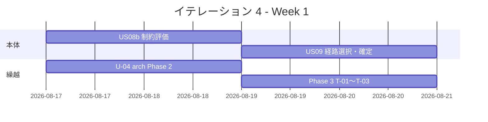
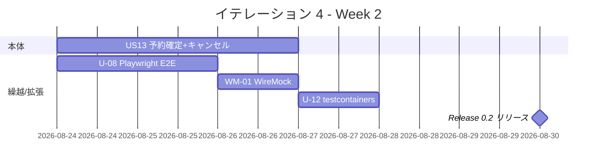
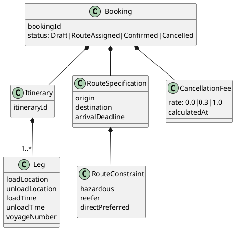

# イテレーション 4 計画

## 概要

| 項目 | 内容 |
|------|------|
| **イテレーション** | 4 |
| **期間** | Week 7-8（2026-08-17 〜 2026-08-30、2 週間） |
| **ゴール** | 経路制約評価・経路選択・確定・予約確定を完成させ Release 0.2 をリリース、IT3 繰越のアーキ負債 (arch-check Phase 2/3) を完済する |
| **目標 SP** | 11（本体: US08b + US09 + US11 + US13）+ 7（IT3 繰越 U-04 / U-08 / U-12 / Phase 3）+ 推奨 2 |

---

## ゴール

### イテレーション終了時の達成状態

1. **経路設計の完全フロー**: 制約評価 → 経路選択・確定 → 予約への紐付け → 予約確定までエンドツーエンドで動く (US08b + US09 + US11 + US13)
2. **Release 0.2 リリース**: Phase 2 完了をもって `v0.2.0` タグ・GitHub Release ノートを公開
3. **arch-check Phase 2/3 完済**: 自作 AST バイナリで Rule 6 (Interfaces → Domain) + T-01〜T-03 (トランザクション境界規約) を CI gate 化
4. **E2E 完備**: US01 / US06 / US25 (IT3 繰越) + IT4 本体ストーリーの Playwright ハッピーパスが緑
5. **外部 ACL 契約テスト**: WireMock Circuit Breaker シナリオで通関 ACL / 料金 ACL の障害時挙動を検証

### 成功基準

- [ ] US08b / US09 / US11 / US13 が Domain / Application / HTTP / UI の各層で完成し、`/routing/candidates` → 経路選択 → `/bookings/{id}/confirm` の E2E が通る
- [ ] US13 のキャンセル料 3 段階ルール (確定前無料 / 出航 7 日前まで 30% / それ以降 100%) が単体・受入テストでカバーされる
- [ ] arch-check Phase 2 (Rule 6) + Phase 3 (T-01〜T-03) が CI で gate になっている
- [ ] HPC カバレッジ全体 75% 以上 (IT3 70% から +5%)
- [ ] WireMock 契約テストで通関 ACL / 料金 ACL の Circuit Breaker (Open / HalfOpen / Closed) シナリオが緑
- [ ] Playwright で US01 / US06 / US25 + IT4 本体 (US08b/US09/US11/US13) のハッピーパスが緑
- [ ] `v0.2.0` タグと GitHub Release ノート公開、CHANGELOG 反映
- [ ] domain-model.md / data-model.md が IT4 実装結果と一致 (Itinerary / Leg の追加)

---

## ユーザーストーリー

### スコープと根拠

release_plan.md IT4 原案の本体 11 SP に **IT3 繰越 7 SP + 推奨 2 SP** を加える。IT1-3 実績ベロシティ平均 20 SP/IT (Ralph Loop 1 日 ≒ 20 SP) を基準値とし、合計 20 SP に収める。

### 対象ストーリー

| ID | ユーザーストーリー | SP | 優先度 |
|----|-------------------|----|----|
| US08b | 経路候補の制約評価 (危険物港・冷凍船・直行優先) | 3 | 必須 |
| US09 | 経路を選択・確定する | 3 | 必須 |
| US11 | 経路情報を予約に紐付ける | 2 | 必須 |
| US13 | 予約を確定する (キャンセル料 3 段階ルール含む) | 3 | 必須 |
| **本体合計** | | **11** | |
| U-04 | arch-check Phase 2 (haskell-src-exts AST バイナリ + Rule 6 + CI gate) | 2 | 必達 |
| Phase 3 | arch-check Phase 3 T-01〜T-03 (トランザクション境界規約) | 2 | 必達 |
| U-08 | Playwright E2E (US01 / US06 / US25 ハッピーパス) | 1.5 | 必達 |
| U-12 | testcontainers 統合 + CreateEstimateCommand Postgres IT | 0.7 | 必達 |
| WM-01 | WireMock 契約テスト (通関 ACL / 料金 ACL Circuit Breaker) | 1 | 中 |
| U-15 | HPC ゲート 70% → 75% 引き上げ + Domain 別レポート整備 | 0.5 | 中 |
| **拡張合計** | | **7.7** | |
| **総合計** | | **18.7 (≒ 19)** | |

### ストーリー詳細

#### US08b: 経路候補の制約評価

**ストーリー**:
> 経路設計者として、US08a で算出した経路候補に対し貨物制約 (危険物港回避・冷凍船指定・直行優先) を評価したい。なぜなら、業務制約に反する経路を除外して安全な選択肢のみを提示したいからだ。

**受入条件** (Gherkin):

1. **Given** 危険物貨物 (HsCode: 危険物コード) で経路候補がある **When** 評価する **Then** 危険物受入不可港を含む経路は除外される
2. **Given** 冷凍貨物 (TemperatureRequirement: Frozen) **When** 評価する **Then** 冷凍船 (ShipCapability: Reefer) を持つ航海のみが候補に残る
3. **Given** 直行便と乗継便が混在 **When** 評価する **Then** 直行便が rank=0、乗継便は到着日順で rank=1 以降
4. **Given** 全候補が制約違反 **When** 評価する **Then** 「制約を満たす経路がありません」と理由 (危険物 / 温度 / 期限) を表示

#### US09: 経路を選択・確定する

**ストーリー**:
> 経路設計者として、評価済み経路候補から最適なものを選択し確定したい。なぜなら、予約に紐付ける唯一の経路を決定する必要があるからだ。

**受入条件**:

1. 経路候補一覧から radio で 1 件選択して「確定」できる
2. 確定した経路は `RouteSpecification` (origin / destination / arrival deadline) と `Itinerary` (Legs) に分解されて保存される
3. 確定済み経路は再選択できない (UI で disabled、API で 409 Conflict)
4. 確定操作は `ConfirmRouteCommand` として監査ログに記録される

#### US11: 経路情報を予約に紐付ける

**ストーリー**:
> 経路設計者として、確定した経路を予約に紐付けたい。なぜなら、予約と経路の対応関係を明示し以降の追跡基盤を準備するためだ。

**受入条件**:

1. 確定経路を予約 (`BookingId`) に紐付ける `LinkRouteCommand` が成功する
2. 紐付け後の予約は `RouteAssigned` 状態に遷移する
3. 同じ予約への二重紐付けは 409 Conflict
4. 紐付け解除 (`UnlinkRouteCommand`) も可能 (確定前のみ)

#### US13: 予約を確定する

**ストーリー**:
> 荷主として、経路紐付け済みの予約を最終確定し輸送開始準備に進めたい。なぜなら、確定により料金算定とキャンセルポリシーが適用されるからだ。

**受入条件**:

1. `RouteAssigned` 状態の予約のみ確定できる (前提条件違反は 422)
2. 確定操作で `BookingConfirmed` イベントが発行される
3. **キャンセル料 3 段階ルール** (確定後にのみ適用):
   - 確定後〜出航 7 日前まで: 無料
   - 出航 7 日前 〜 出航 1 日前: キャンセル料 30%
   - 出航 1 日前 〜 出航後: キャンセル料 100%
4. キャンセル時は `CancelBookingCommand` で `CancellationFee` が算定され記録される
5. 確定済み予約の UI には「キャンセル」ボタンと「現時点のキャンセル料」を表示

### タスク

#### 1. US08b: 経路制約評価（3 SP）

| # | タスク | 見積もり | 担当 | 状態 |
|---|--------|---------|------|------|
| 1.1 | `RouteConstraint` VO (Hazardous / Reefer / DirectPreferred) を Domain に追加 | 3h | - | [ ] |
| 1.2 | `RouteFinder.evaluateConstraints` を実装 + hedgehog プロパティテスト | 4h | - | [ ] |
| 1.3 | `/routing/candidates` レスポンスに制約評価結果 (rank / 除外理由) を含める | 2h | - | [ ] |
| 1.4 | 受入テスト (Gherkin 4 シナリオ) | 3h | - | [ ] |

**小計**: 12h

#### 2. US09: 経路選択・確定（3 SP）

| # | タスク | 見積もり | 担当 | 状態 |
|---|--------|---------|------|------|
| 2.1 | `Itinerary` / `Leg` エンティティ + migration | 3h | - | [ ] |
| 2.2 | `ConfirmRouteCommand` ハンドラ + Postgres リポジトリ | 4h | - | [ ] |
| 2.3 | UI: 候補一覧 radio + 確定ボタン + 確定後 disabled | 3h | - | [ ] |
| 2.4 | 監査ログ統合 + 409 Conflict E2E | 2h | - | [ ] |

**小計**: 12h

#### 3. US11: 経路-予約紐付け（2 SP）

| # | タスク | 見積もり | 担当 | 状態 |
|---|--------|---------|------|------|
| 3.1 | `LinkRouteCommand` / `UnlinkRouteCommand` + 予約状態遷移 (`RouteAssigned`) | 3h | - | [ ] |
| 3.2 | 二重紐付け 409 + 紐付け解除 (確定前のみ) のドメインガード | 2h | - | [ ] |
| 3.3 | UI: 経路紐付けボタン + 状態バッジ | 2h | - | [ ] |

**小計**: 7h

#### 4. US13: 予約確定 + キャンセル料 3 段階（3 SP）

| # | タスク | 見積もり | 担当 | 状態 |
|---|--------|---------|------|------|
| 4.1 | `BookingConfirmed` イベント + `CancellationFee` VO (3 段階ルール) | 3h | - | [ ] |
| 4.2 | `ConfirmBookingCommand` / `CancelBookingCommand` ハンドラ + 監査 | 3h | - | [ ] |
| 4.3 | キャンセル料算定の単体テスト (境界値: 7 日前 / 1 日前 / 出航日) | 2h | - | [ ] |
| 4.4 | UI: キャンセルボタン + 現時点料金表示 + 確認モーダル | 3h | - | [ ] |
| 4.5 | 受入テスト (確定 → キャンセル各タイミング) | 3h | - | [ ] |

**小計**: 14h

#### 5. IT3 繰越（7 SP）

| # | タスク | 見積もり | 担当 | 状態 |
|---|--------|---------|------|------|
| 5.1 | U-04: haskell-src-exts AST バイナリ + Rule 6 + CI gate | 6h | - | [ ] |
| 5.2 | Phase 3: T-01 (App は IO を Repo にだけ委譲) / T-02 (Domain pure) / T-03 (Tx 境界は App のみ) を AST で検出 | 6h | - | [ ] |
| 5.3 | U-08: Playwright E2E 拡張 (US01 / US06 / US25 ハッピーパス) | 4h | - | [ ] |
| 5.4 | U-12: testcontainers 統合 + CreateEstimateCommand Postgres IT | 2h | - | [ ] |

**小計**: 18h

#### 6. 拡張（2 SP）

| # | タスク | 見積もり | 担当 | 状態 |
|---|--------|---------|------|------|
| 6.1 | WM-01: WireMock 契約テスト (通関 / 料金 ACL Circuit Breaker 3 状態) | 3h | - | [ ] |
| 6.2 | U-15: HPC ゲート 70 → 75%、Domain 別レポート CI 反映 | 1.5h | - | [ ] |

**小計**: 4.5h

#### タスク合計

| カテゴリ | SP | 理想時間 | 状態 |
|---------|----|----|------|
| US08b 経路制約評価 | 3 | 12h | [ ] |
| US09 経路選択・確定 | 3 | 12h | [ ] |
| US11 経路-予約紐付け | 2 | 7h | [ ] |
| US13 予約確定 + キャンセル | 3 | 14h | [ ] |
| IT3 繰越 (U-04 / Phase 3 / U-08 / U-12) | 7 | 18h | [ ] |
| 拡張 (WM-01 / U-15) | 2 | 4.5h | [ ] |
| **合計** | **20** | **67.5h** | |

**1 SP あたり**: 約 3.4h
**進捗率**: 0% (0/20 SP)

---

## スケジュール

### Week 1（Day 1-5: 2026-08-17 〜 08-21）

| 日 | タスク |
|----|--------|
| Day 1 (08-17) | US08b 制約評価 (RouteConstraint VO + 評価ロジック) + U-04 AST バイナリ着手 |
| Day 2 (08-18) | US08b 受入テスト完了 + U-04 Rule 6 完了 |
| Day 3 (08-19) | US09 Itinerary/Leg + ConfirmRouteCommand 着手 + Phase 3 T-01 着手 |
| Day 4 (08-20) | US09 完了 + Phase 3 T-02/T-03 完了 |
| Day 5 (08-21) | US11 経路紐付け実装完了 |

### Week 2（Day 6-10: 2026-08-24 〜 08-30）

| 日 | タスク |
|----|--------|
| Day 6 (08-24) | US13 イベント+VO+ハンドラ着手 / U-08 Playwright E2E 拡張 |
| Day 7 (08-25) | US13 キャンセル料 3 段階ルール完了 / U-08 完了 |
| Day 8 (08-26) | US13 UI + 受入テスト完了 / WM-01 WireMock 契約テスト |
| Day 9 (08-27) | U-12 testcontainers + U-15 HPC 75% gate、統合テスト、バグ修正 |
| Day 10 (08-30) | `v0.2.0` タグ + Release ノート公開、CHANGELOG 反映、デモ準備 |

---

## 設計

### ドメインモデル (追加分)

### API 設計 (追加分)

| メソッド | エンドポイント | 説明 |
|---------|---------------|------|
| POST | `/routing/candidates/evaluate` | US08b: 経路候補に制約評価を適用 |
| POST | `/routing/itineraries/{id}/confirm` | US09: 経路を確定 |
| POST | `/bookings/{id}/route` | US11: 経路を予約に紐付け |
| DELETE | `/bookings/{id}/route` | US11: 経路紐付け解除 (確定前のみ) |
| POST | `/bookings/{id}/confirm` | US13: 予約確定 |
| POST | `/bookings/{id}/cancel` | US13: 予約キャンセル + 料金算定 |

### ADR

| ADR | タイトル | ステータス |
|-----|---------|-----------|
| [ADR-0007](../adr/0007-cancellation-fee-policy.md) | キャンセル料 3 段階ルールのドメインポリシー化 | 提案予定 |
| [ADR-0008](../adr/0008-itinerary-leg-model.md) | Itinerary / Leg 集約とトランザクション境界 | 提案予定 |

---

## リスクと対策

| リスク | 影響度 | 対策 |
|--------|--------|------|
| キャンセル料 3 段階の境界値テスト漏れ | 高 | 7 日前 / 1 日前 / 出航日の境界をプロパティテスト + 単体で網羅 |
| arch-check Phase 2/3 の AST バイナリが想定以上に複雑 | 中 | Day 1-2 で着手しブロック検知。失敗時は Rule 6 のみ着地し T-01〜T-03 は IT5 繰越 |
| US08b 危険物港マスタの未整備 | 中 | IT3 で `Port` テーブルに `hazardousAllowed` を追加済。マスタ投入を Day 1 タスクに |
| Playwright E2E のフレーキー | 中 | U-08 で IT3 ストーリーぶん安定化、IT4 では追加ストーリーのみ拡張 |
| Release 0.2 ノート整備の遅延 | 低 | Day 9 までに本体完了、Day 10 をリリース作業専用に確保 |

---

## 完了条件

### Definition of Done

- [ ] コードレビュー完了 (developing-review スキル)
- [ ] `sbt test` 全パス (Haskell では `stack test --fast` 全パス)
- [ ] ArchUnit / arch-check Phase 1/2/3 全 gate 緑
- [ ] HPC カバレッジ 75% 以上
- [ ] Playwright E2E 全シナリオ緑
- [ ] WireMock 契約テスト緑
- [ ] domain-model.md / data-model.md / API ドキュメント更新済
- [ ] CHANGELOG / リリースノート更新済
- [ ] `v0.2.0` タグ + GitHub Release 公開

### デモ項目

1. `/voyages/search` → 経路候補算出 → 制約評価 (危険物 / 冷凍 / 直行) で除外確認
2. 経路選択 → 確定 → 予約紐付け → 予約確定の完全フロー
3. キャンセル料 3 段階の境界値デモ (確定直後 / 7 日前 / 1 日前)
4. WireMock 経由で通関 ACL を OPEN 状態にして Circuit Breaker 動作確認
5. arch-check Phase 2/3 違反コミットを試行 → CI が落ちることを確認

---

## 更新履歴

| 日付 | 更新内容 | 更新者 |
|------|---------|--------|
| 2026-06-30 | 初版作成 (本体 US08b/US09/US11/US13 = 11 SP + IT3 繰越 7 SP + 拡張 2 SP = 20 SP、IT1-3 実績ベロシティ平均 20 SP/IT を基準値とする) | Claude |

---

## 関連ドキュメント

- [リリース計画](./release_plan.md)
- [IT3 完了報告書](./iteration_report-3.md) — IT4 繰越項目 (U-04 / U-08 / U-12 / Phase 3) の根拠
- [IT3 ふりかえり (KPT)](./retrospective-3.md)
- [イテレーション 4 ふりかえり](./retrospective-4.md) — 完了時に作成
