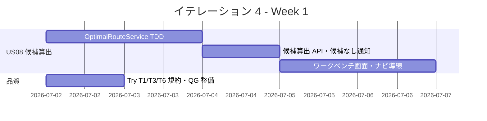
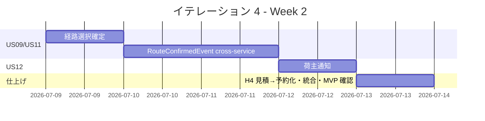
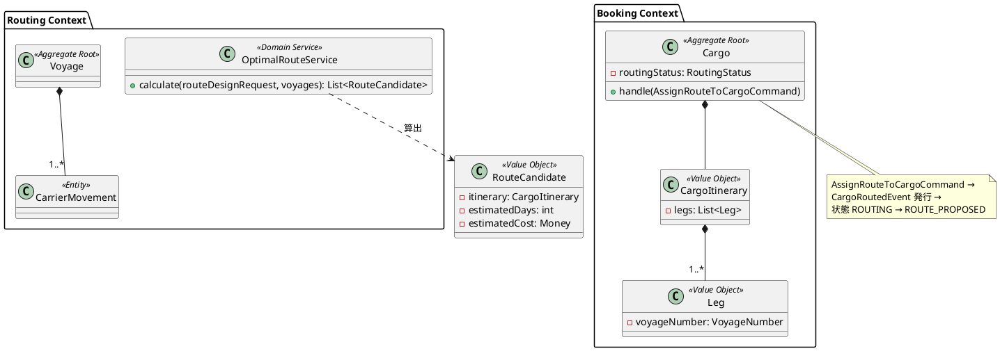
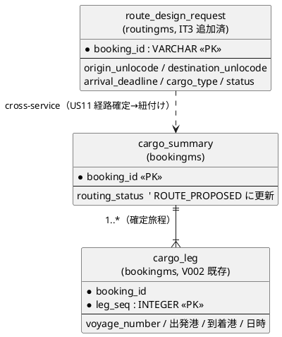
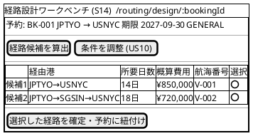
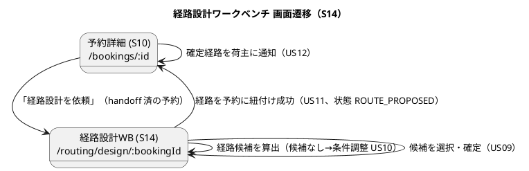

# イテレーション 4 計画

## 概要

| 項目 | 内容 |
|------|------|
| **イテレーション** | 4 |
| **期間** | 2026-07-02 〜 2026-07-15（2 週間） |
| **ゴール** | 経路設計者が経路設計待ちリストから経路候補を算出・選択・確定し、確定経路を予約に紐付けて荷主へ通知する。Phase 1 完了・Release 1.0 MVP を達成する。 |
| **目標 SP** | 11（コミット）＋ US10 2 SP（ストレッチ） |

---

## ゴール

### イテレーション終了時の達成状態

1. **経路候補算出（US08）**: 経路設計者が経路設計待ちリスト（route_design_request）から、航海スケジュールと制約条件をもとに経路候補を自動算出し、推奨順に確認できる。
2. **経路の選択・確定（US09）**: 算出候補から最適な 1 件を選択し、経路を確定できる。
3. **経路の予約紐付け（US11）**: 確定経路を予約に紐付け、bookingms の予約状態が cross-service で「経路提案中」に更新される（routingms → bookingms の逆方向 cross-service）。
4. **荷主通知（US12）**: 営業担当者が確定経路の詳細を荷主に通知し、通知記録が残る。
5. **経路設計ワークベンチ（S14）**: 経路設計者ロールのナビゲーションから待ちリスト→候補算出→選択→紐付けの一連の業務を画面上で完結できる（レビュー H3 対応）。

### 成功基準

- [ ] US08: 経路設計待ちリストから経路候補が推奨順に算出・表示される（直行便優先、期限内不可時は通知）
- [ ] US09: 経路候補から 1 件選択して確定でき、状態が「確定」になる
- [ ] US11: 確定経路を予約に紐付けると、bookingms の予約状態が Kafka 経由で「経路提案中」に更新される
- [ ] US12: 確定経路を荷主に通知でき、通知記録が登録される
- [ ] 経路設計者ロールのナビゲーションに経路設計ワークベンチ（S14）の導線がある
- [ ] cross-service（routingms → bookingms）のイベント駆動 E2E がパス（retro Try T2）
- [ ] テストカバレッジ（新規コード）80% 以上 / SonarQube Quality Gate PASS
- [ ] Release 1.0 MVP のリリース条件（全ユニット・E2E パス）を満たす

---

## ユーザーストーリー

### 対象ストーリー

| ID | ユーザーストーリー | SP | 優先度 |
|----|-------------------|----|----|
| US08 | 経路候補を算出する | 5 | 必須 |
| US09 | 経路を選択・確定する | 2 | 必須 |
| US11 | 経路情報を予約に紐付ける | 2 | 必須 |
| US12 | 確定経路を荷主に通知する | 2 | 必須 |
| US10 | 経路条件を調整して再算出する（ストレッチ） | 2 | 必須（バッファ消費で後回し可） |
| **合計（コミット）** | | **11** | |

> **実装順序**: US08（候補算出 + ワークベンチ）→ US09（選択確定）→ US11（cross-service 紐付け）→ US12（荷主通知）。US10 は US08 のアルゴリズムを再利用する増分のため、コミット分が片付き次第ストレッチで着手し、達成すれば Phase 1 を完全完了する。

### ストーリー詳細

#### US08: 経路候補を算出する

**ストーリー**:
> 経路設計者として、航海スケジュール検索結果をもとに制約条件を考慮した経路候補を自動算出してほしい。なぜなら、手作業の属人化を解消し、制約条件を漏れなく考慮した最適経路を効率的に見つけられるからだ。

**受入条件**:

1. 航海スケジュール検索結果と出発地・目的地・期限を入力として経路候補が自動算出される
2. 寄港地の接続可能性が評価される
3. 経路候補ごとに所要日数・経由港・費用・航海番号が表示される
4. 経路候補が推奨順に並べられて提示される
5. 直行便がある場合、最優先候補として提示される
6. 期限内に到達可能な経路がない場合、その旨が通知され条件調整が促される

#### US09: 経路を選択・確定する

**ストーリー**:
> 経路設計者として、算出された経路候補から最適なものを選択し経路を確定したい。なぜなら、最適経路を正式に確定し予約への紐付けに進めるからだ。

**受入条件**:

1. 経路候補一覧（経由港・所要日数・費用・航海番号）を確認できる
2. 最適な経路候補を 1 件選択できる
3. 選択後、経路状態が「確定」になる
4. 最適な候補がない場合、経路条件調整（US10）に進める

#### US11: 経路情報を予約に紐付ける

**ストーリー**:
> 経路設計者として、確定した経路情報を貨物予約に紐付けたい。なぜなら、予約と経路の関連を確立し営業担当者が荷主にルート提案できるようにするからだ。

**受入条件**:

1. 確定経路と予約番号を確認できる
2. 経路情報を予約に紐付ける操作を実行できる
3. 紐付け後、予約状態が「経路提案中」に更新される（routingms → bookingms の cross-service イベント）

#### US12: 確定経路を荷主に通知する

**ストーリー**:
> 営業担当者として、経路が予約に紐付けられた後、確定経路の詳細を荷主に通知したい。なぜなら、荷主が確定経路の内容を確認し承認または変更依頼を行えるようにするからだ。

**受入条件**:

1. 予約番号を指定して紐付けられた経路情報を確認できる
2. 通知内容（経由港・所要日数・到着予定日・料金概算）を確認できる
3. 荷主への経路通知を送信できる
4. 通知送信記録が登録される

#### US10: 経路条件を調整して再算出する（ストレッチ）

**ストーリー**:
> 経路設計者として、経路候補に最適なものがない場合に条件（期限・経由地等）を調整して経路候補を再算出したい。

**受入条件**:

1. 現在の制約条件を確認できる
2. 条件を調整（期限延長・経由地追加・貨物種別変更等）して再算出を実行できる
3. 調整後の条件で新たな経路候補が算出・提示される
4. 調整後も条件を満たす経路がない場合、営業担当者に条件協議を依頼できる

---

## タスク

### 1. US08 経路候補算出（5 SP）

| # | タスク | 見積もり | 担当 | 状態 |
|---|--------|---------|------|------|
| 1.1 | routingms: `OptimalRouteService`（経由港接続グラフ探索・直行便優先・推奨順ソート）を TDD で実装 | 8h | - | [ ] |
| 1.2 | route_design_request + 航海スケジュールを入力に候補算出する API（`POST /api/v1/routes/{bookingId}/calculate`） | 4h | - | [ ] |
| 1.3 | 期限内到達不可時の「候補なし」通知ロジック | 3h | - | [ ] |
| 1.4 | フロント: 経路設計ワークベンチ画面（S14）— 待ちリスト表示 + 候補算出トリガー + 候補一覧表示（レビュー H3） | 6h | - | [ ] |
| 1.5 | 経路設計者ロールのナビゲーション導線追加（レビュー H3） | 2h | - | [ ] |
| 1.6 | 単体・統合テスト（候補算出・接続評価・推奨順・候補なし） | 4h | - | [ ] |

**小計**: 27h（理想時間）

### 2. US09 経路選択確定（2 SP）

| # | タスク | 見積もり | 担当 | 状態 |
|---|--------|---------|------|------|
| 2.1 | routingms: 経路候補から 1 件選択し確定する状態遷移（Route 集約 or 経路設計状態） | 4h | - | [ ] |
| 2.2 | 確定 API + フロント候補選択 UI（ワークベンチ内） | 4h | - | [ ] |
| 2.3 | 候補なし時に US10（条件調整）へ誘導 | 2h | - | [ ] |
| 2.4 | テスト | 2h | - | [ ] |

**小計**: 12h（理想時間）

### 3. US11 経路紐付け（cross-service）（2 SP）

| # | タスク | 見積もり | 担当 | 状態 |
|---|--------|---------|------|------|
| 3.1 | shared: routingms → bookingms の cross-service イベント `RouteConfirmedEvent`（確定経路＝`CargoItinerary` 相当の `Leg` 列）を定義 | 2h | - | [ ] |
| 3.2 | routingms: 経路確定→予約紐付けで `RouteConfirmedEvent` を発行（Kafka publisher） | 3h | - | [ ] |
| 3.3 | bookingms: `RouteConfirmedEvent` を tracking 購読し、`BookingSagaManager` 経由で `AssignRouteToCargoCommand` を発行。Cargo が `CargoRoutedEvent` を適用して状態を「経路提案中（`ROUTE_PROPOSED`）」に更新し、`cargo_leg` を確定 | 4h | - | [ ] |
| 3.4 | cross-service E2E（イベント駆動、retro Try T2）+ Testcontainers Kafka 統合テスト | 3h | - | [ ] |

**小計**: 12h（理想時間）

### 4. US12 荷主通知（2 SP）

| # | タスク | 見積もり | 担当 | 状態 |
|---|--------|---------|------|------|
| 4.1 | bookingms: 確定経路の通知内容（経由港・所要日数・到着予定日・料金概算）組み立て + 通知送信コマンド | 4h | - | [ ] |
| 4.2 | 通知記録の Read Model + API | 3h | - | [ ] |
| 4.3 | フロント: 予約詳細に確定経路表示 + 荷主通知操作 | 3h | - | [ ] |
| 4.4 | テスト | 2h | - | [ ] |

**小計**: 12h（理想時間）

### 5. 負債返済・品質（SP 外、レビュー / retro Try）

| # | タスク | 見積もり | 担当 | 状態 |
|---|--------|---------|------|------|
| 5.1 | レビュー H4: 見積詳細「予約化」で見積情報を予約フォームにプリセット | 3h | - | [ ] |
| 5.2 | Try T1: 認証ヘッダを `shared/api/auth` 経由に統一する規約をレビュー観点テンプレートに追加 | 1h | - | [ ] |
| 5.3 | Try T3: JaCoCo はフル `gradle check` で生成し `--tests` 部分実行後は再生成する運用を明文化 | 1h | - | [ ] |
| 5.4 | Try T6: 全体品質目標（全体カバレッジ 80%・Code Smell 0）を SonarQube Quality Gate 条件に追加 | 2h | - | [ ] |
| 5.5 | Try T5: フロント編集後の E2E 実行チェックリスト（HMR 沈静化 / dev サーバー再起動）整備 | 1h | - | [ ] |

**小計**: 8h（理想時間）

### タスク合計

| カテゴリ | SP | 理想時間 | 状態 |
|---------|----|----|------|
| US08 経路候補算出 | 5 | 27h | [ ] |
| US09 経路選択確定 | 2 | 12h | [ ] |
| US11 経路紐付け | 2 | 12h | [ ] |
| US12 荷主通知 | 2 | 12h | [ ] |
| 負債返済・品質（SP 外） | - | 8h | [ ] |
| **合計（コミット）** | **11** | **71h** | |
| US10 経路条件調整（ストレッチ） | 2 | 10h | [ ] |

**1 SP あたり**: 約 6.5h（コミット分）
**進捗率**: 0% (0/11 SP)

---

## スケジュール

### Week 1（Day 1-5）



| 日 | タスク |
|----|--------|
| Day 1 | OptimalRouteService 設計・TDD（接続グラフ探索）、Try 規約整備 |
| Day 2 | OptimalRouteService 完成、候補算出 API |
| Day 3 | 候補なし通知、ワークベンチ画面（待ちリスト + 候補算出） |
| Day 4 | ワークベンチ候補一覧表示、経路設計者ナビ導線（H3） |
| Day 5 | US08 統合テスト、QG 条件追加（T6） |

### Week 2（Day 6-10）



| 日 | タスク |
|----|--------|
| Day 6 | US09 経路選択確定（状態遷移 + UI） |
| Day 7 | US11 `RouteConfirmedEvent` 発行（routingms）+ shared 定義 |
| Day 8 | US11 bookingms 購読 + Saga 連携 + cross-service E2E（T2） |
| Day 9 | US12 荷主通知（通知内容・記録・UI） |
| Day 10 | H4 見積→予約化プリセット、統合テスト、Release 1.0 MVP リリース条件確認、デモ準備（US10 ストレッチ着手） |

---

## 設計

### 主要設計方針

- **経路候補算出（routingms ドメインサービス）**: Routing コンテキストの集約は `Voyage` のみ（domain-model.md）。経路候補算出は `Voyage` / `CarrierMovement`（寄港地接続）と `route_design_request`（出発地・目的地・期限・貨物種別）を入力に候補を生成するドメインサービス `OptimalRouteService` として実装。直行便を最優先、所要日数・費用で推奨順ソート、期限内到達不可なら候補なしを返す。候補（`RouteCandidate`）は永続集約を持たず算出結果として返す。
- **逆方向 cross-service（US11、ADR-0009 準拠）**: routingms が経路確定時に shared の `RouteConfirmedEvent` を Kafka 発行 → bookingms が tracking 購読し `BookingSagaManager` 経由で `AssignRouteToCargoCommand` を発行 → Cargo が `CargoRoutedEvent` を適用して状態を「経路提案中（`ROUTE_PROPOSED`）」に更新、`cargo_leg` を確定。IT3 の bookingms → routingms と対になる routingms → bookingms 方向。
- **経路設計ワークベンチ（S14）**: 経路設計者（ROLE_ROUTING）の複合ビュー `/routing/design/:bookingId`（ui_design.md）。`GET /api/v1/routes/design-requests`（IT3 追加済み）の待ちリスト（arrivalDeadline 昇順、レビュー L4）→ 候補算出 → 選択 → 紐付けを実行（レビュー H3）。

### ドメインモデル



> 参照: domain-model.md。集約・VO・コマンド/イベント名（`Voyage` / `CargoItinerary` / `Leg` / `RouteCandidate` / `AssignRouteToCargoCommand` / `CargoRoutedEvent` / `ROUTE_PROPOSED`）は同ドキュメントに準拠。routingms に経路設計集約は新設せず、`OptimalRouteService` をドメインサービスとして追加する。

### データモデル



> 参照: data-model.md。US09 経路選択確定・US11 経路紐付け・US12 確定経路通知はいずれも `cargo_summary`・`cargo_leg` を更新（同 927-930 行）。経路候補は永続テーブルを持たず算出結果として扱う（routingms に route_candidate テーブルは新設しない）。`route_design_request.status` は IT3 時点で常に `PENDING`、状態遷移の責務は本イテレーションで検討（レビュー M4）。

### ユーザーインターフェース

#### ビュー



#### インタラクション



> 参照: ui_design.md（S14 経路設計ワークベンチ `/routing/design/:bookingId`、複合ビュー、ROLE_ROUTING）。本プロジェクトは React SPA のため htmx ではなく React Router + fetch で実装し、フィードバックは IT1-IT3 と同じ alert 表示パターンに従う。

### API 設計（新規想定）

| メソッド | エンドポイント | 説明 | サービス |
|---------|---------------|------|---------|
| `POST` | `/api/v1/routes/{bookingId}/calculate` | 経路候補算出（US08） | routingms |
| `GET` | `/api/v1/routes/{bookingId}/candidates` | 経路候補一覧（US08/US09） | routingms |
| `POST` | `/api/v1/routes/{bookingId}/select` | 経路候補の選択・確定（US09） | routingms |
| `POST` | `/api/v1/routes/{bookingId}/confirm` | 確定経路を予約に紐付け（US11、`RouteConfirmedEvent` 発行） | routingms |
| `POST` | `/api/v1/bookings/{bookingId}/notify-route` | 確定経路を荷主に通知（US12） | bookingms |

> エンドポイントは実装時に確定し、`docs/design/architecture_backend.md` の API カタログへ随時追記する（レビュー H2 / DoD）。

### ディレクトリ構成

```text
apps/backend/routingms/src/main/java/com/example/routingms/
├─ domain/services/OptimalRouteService.java   # US08 経路候補算出（ドメインサービス）
├─ interfaces/rest/RouteController.java        # /api/v1/routes/{bookingId}/*（US08/09/11）
apps/backend/bookingms/src/main/java/com/example/bookingms/
├─ saga/BookingSagaManager.java               # RouteConfirmedEvent → AssignRouteToCargoCommand
├─ domain/model/Cargo.java                     # handle(AssignRouteToCargoCommand) → CargoRoutedEvent
apps/backend/shared/src/main/java/com/example/shared/events/
├─ RouteConfirmedEvent.java                    # cross-service（routingms → bookingms）
apps/frontend/src/features/routing/pages/
├─ RouteDesignWorkbenchPage.tsx                # S14 /routing/design/:bookingId
```

### ADR

| ADR | タイトル | ステータス |
|-----|---------|-----------|
| [ADR-0009](../adr/0009-cross-service-event-saga.md) | cross-service イベント連携と Axon Saga | 承認済み（US11 の routingms → bookingms 逆方向 cross-service にも適用） |

> US11 で `RouteConfirmedEvent`（routingms → bookingms）を追加するため、トピック分割方針（retro Try / レビュー M5）を本イテレーションで ADR に追記検討。

---

## リスクと対策

| リスク | 影響度 | 対策 |
|--------|--------|------|
| 経路探索アルゴリズム（US08）の複雑度が見積もりを超過 | 高 | まず直行便 + 1 経由までの単純探索で MVP を満たし、多段経由は IT8 バッファ送り。OptimalRouteService をインタフェース化し段階拡張 |
| US11 の逆方向 cross-service で予約状態の二重更新・順序不整合 | 中 | 冪等な受信ハンドラ（IT3 と同方針）+ Saga の状態ガード。Testcontainers Kafka で順序・冪等を検証 |
| Phase 1 完了に US08-12（13 SP）が velocity（10-11）を超過 | 中 | コミットは US08/09/11/12（11 SP）に絞り、US10 はストレッチ。US10 がスリップしても Release 1.0 MVP のコア導線は成立。スリップ時は IT8 バッファで吸収 |
| 経路設計ワークベンチ（新画面）のロール別アクセス制御漏れ | 中 | 経路設計者ロールでの表示制御をフロント + gateway で確認（レビュー懸念対応） |

---

## 完了条件

### Definition of Done

- [ ] コードレビュー完了（developing-review、新規 API は architecture_backend.md に追記＝レビュー H2）
- [ ] ユニットテストがパス
- [ ] E2E テストがパス（cross-service を伴う US11 はイベント駆動 E2E を含む＝retro Try T2）
- [ ] ESLint エラーなし / SonarQube Quality Gate PASS（新規コードカバレッジ 80% 以上）
- [ ] 機能がローカル環境で動作確認済み
- [ ] ドキュメント更新完了（iteration_report-4 / API カタログ / data-model）

### デモ項目

1. 経路設計ワークベンチで待ちリストから経路候補を算出・推奨順表示（US08）
2. 候補を選択して確定し、予約に紐付けて予約状態が「経路提案中」に変わる（US09/US11）
3. 営業担当者が確定経路を荷主に通知する（US12）

---

## 更新履歴

| 日付 | 更新内容 | 更新者 |
|------|---------|--------|
| 2026-05-26 | 初版作成（IT3 実績ベロシティ 10 SP・レビュー H3/H4・retro Try を反映） | k2works |

---

## 関連ドキュメント

- [イテレーション 4 ふりかえり](./retrospective-4.md)（イテレーション終了時に作成）
- [IT3 ふりかえり](./retrospective-3.md)（Try T1-T6 の引き継ぎ元）
- [IT3 レビュー結果](../review/it3_session_review_20260526.md)（H3/H4 の引き継ぎ元）
- [ADR-0009 cross-service イベント連携と Axon Saga](../adr/0009-cross-service-event-saga.md)
