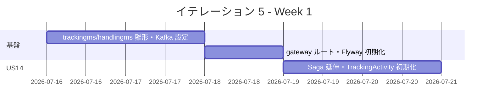
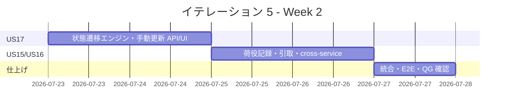
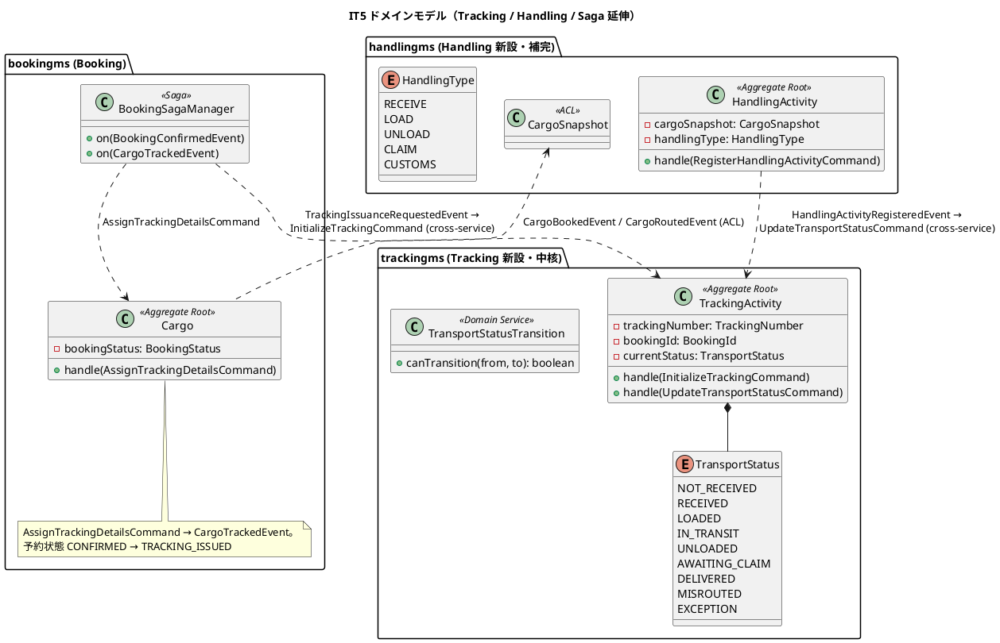
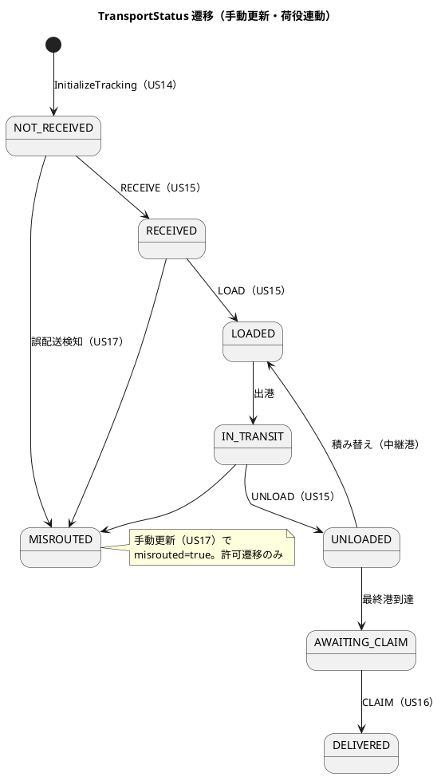
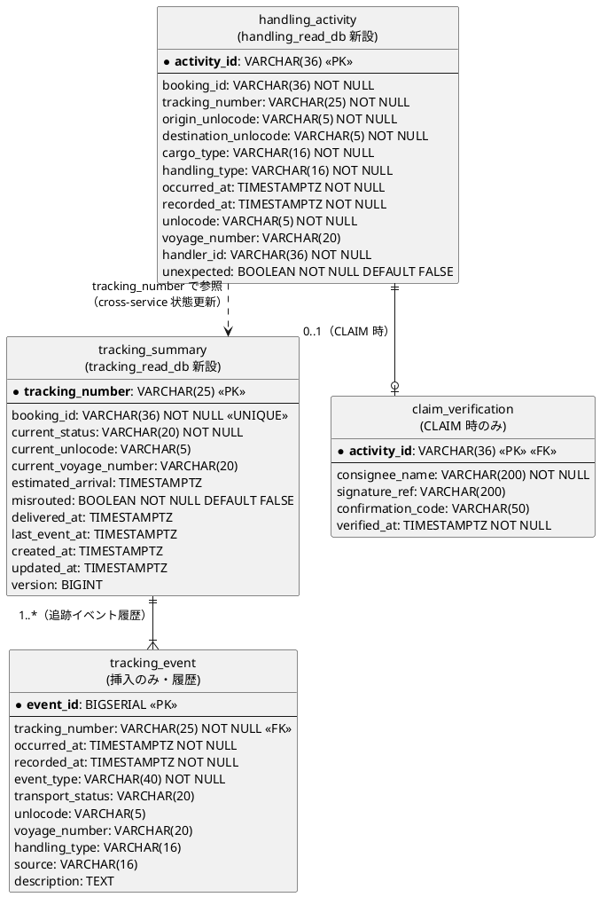
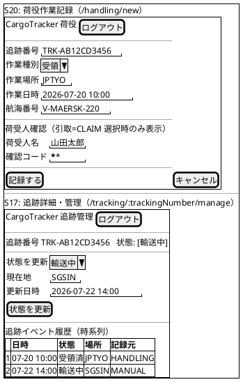
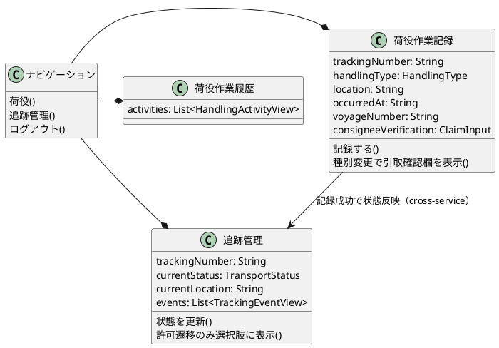
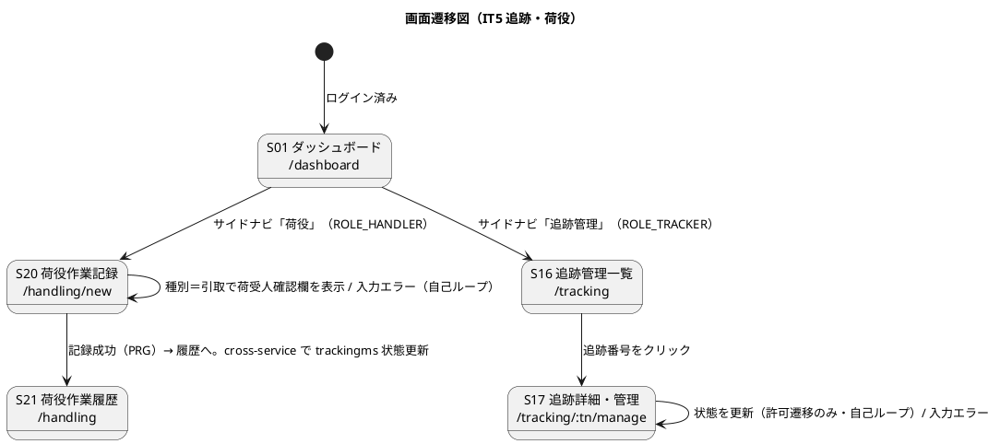

# イテレーション 5 計画

## 概要

| 項目 | 内容 |
|------|------|
| **イテレーション** | 5 |
| **期間** | 2026-07-16 〜 2026-07-29（2 週間） |
| **ゴール** | Phase 2 開始。予約確定後に追跡番号を発行し、荷役作業（受領・積込・荷降し・引取）と手動状態更新で貨物の輸送状態を追跡できるようにする。新サービス trackingms / handlingms を立ち上げ、bookingms → trackingms ← handlingms の cross-service 連携を確立する。 |
| **目標 SP** | 10（コミット） |

---

## ゴール

### イテレーション終了時の達成状態

1. **追跡番号発行（US14）**: 予約が確定（CONFIRMED）すると、Saga 経由で trackingms に追跡が初期化され、推測困難な追跡番号（`TRK-` + 大文字英数 10 桁）が発行される。予約状態が「追跡番号発行済（TRACKING_ISSUED）」に更新される。
2. **荷役作業記録（US15）**: 荷役作業員が受領・積込・荷降し・税関通過を記録でき、cross-service で trackingms の輸送状態が更新される。予定外の場所・種別は警告する。
3. **引取作業記録（US16）**: 引取（CLAIM）を荷受人確認つきで記録でき、貨物状態が「引取済（DELIVERED）」へ遷移する。
4. **貨物状態の手動更新（US17）**: 追跡管理者が `TransportStatus`（9 値）の許可された遷移のみで貨物状態を手動更新でき、履歴が時系列で残る。

### 成功基準

- [ ] US14: 予約確定 → Saga → trackingms 初期化 → 追跡番号発行 → 予約状態が TRACKING_ISSUED に更新される
- [ ] US15: 荷役作業（RECEIVE/LOAD/UNLOAD/CUSTOMS）を記録でき、cross-service で trackingms の状態が更新される（LOAD/UNLOAD は航海番号必須）
- [ ] US16: 引取（CLAIM）は荷受人確認（署名 or 確認コード）必須で、記録すると DELIVERED に遷移し `CargoDeliveredEvent` を発行する
- [ ] US17: `TransportStatusTransition` が許可する遷移のみ受理し、不正遷移は拒否。誤配送（MISROUTED）を検知・設定できる
- [ ] cross-service（bookingms → trackingms、handlingms → trackingms）のイベント駆動 E2E がパス
- [ ] trackingms / handlingms の新規コードカバレッジ 80% 以上 / SonarQube Quality Gate PASS・Code Smell 0
- [ ] 新サービス追加チェックリスト（gatewayms ルート・deploy SERVICES・sonar・Flyway）を満たす

---

## ユーザーストーリー

### 対象ストーリー

| ID | ユーザーストーリー | SP | 優先度 |
|----|-------------------|----|----|
| US14 | 追跡番号を発行する | 2 | 必須 |
| US15 | 荷役作業を記録する | 3 | 必須 |
| US16 | 引取作業を記録する | 2 | 必須 |
| US17 | 貨物状態を手動更新する | 3 | 必須 |
| **合計（コミット）** | | **10** | |

> **実装順序**: 基盤（trackingms / handlingms 新設）→ US14（追跡初期化・番号発行の Saga 連携）→ US17（trackingms の状態遷移エンジン）→ US15（handlingms 荷役記録 → trackingms 状態更新）→ US16（引取・荷受人確認・DELIVERED）。US14 と US17 を先に trackingms に集約し、US15/US16（handlingms）を後半に置く。

### ストーリー詳細

#### US14: 追跡番号を発行する

**ストーリー**:
> 経路設計者として、確定した予約に対して一意の追跡番号を発行し、荷主に通知したい。なぜなら、荷主が追跡番号を使って輸送状況をいつでも確認できるようになるからだ。

**受入条件**（user_story.md US14 準拠）:

1. 「予約確定」状態の予約に対して追跡番号を発行できる
2. 追跡番号は一意に採番される（`TRK-` + 大文字英数 10 桁の推測困難な書式）
3. 発行後、貨物状態が「受領待ち」（`TransportStatus = NOT_RECEIVED`）に設定される
4. 荷主に追跡番号と追跡方法を通知する（メール通知。本 IT は通知イベント発行 + `NotificationAcl` スタブまで。後述「通知の扱い」参照）

> **実装方式（設計）**: 予約確定（`BookingConfirmedEvent`）→ `BookingSagaManager` が `TrackingIssuanceRequestedEvent`（shared）を発行（ADR-0009、US13 → IT5）→ trackingms が `InitializeTrackingCommand` で `TrackingActivity` を NOT_RECEIVED 初期化・採番 → 採番結果を bookingms へ反映（`CargoTrackedEvent`）し予約状態を `TRACKING_ISSUED` にして `@EndSaga`。

#### US15: 荷役作業を記録する

**ストーリー**:
> 荷役作業員として、追跡番号を入力して貨物を特定し、作業種別・日時・場所を登録したい。なぜなら、荷役作業完了が即座に貨物状態に反映され、荷主がリアルタイムで確認できるからだ。

**受入条件**（user_story.md US15 準拠）:

1. 追跡番号の入力（またはスキャン）で貨物を特定できる
2. 作業種別（受領 RECEIVE・積込 LOAD・荷降し UNLOAD）を選択できる
3. 作業日時と作業場所（UN/LOCODE 形式の港湾コード）を入力できる
4. 記録後、貨物状態が対応する状態（受領済・積込済・荷降し済）に自動更新される（cross-service：`HandlingActivityRegisteredEvent` → trackingms `UpdateTransportStatusCommand`）
5. 記録後、荷主に状態変更通知が送信される（後述「通知の扱い」参照）
6. 追跡番号が存在しない場合、エラーメッセージが表示される
7. 作業場所が予定ルートと異なる場合、警告が表示される（`UnexpectedHandlingDetectedEvent`。記録は許容）

> **設計上の不変条件（domain-model.md）**: LOAD/UNLOAD は航海番号必須。同一追跡番号・同一種別・同一場所・近接時刻（5 分以内）の重複登録を拒否。税関通過（CUSTOMS）は `HandlingType` に存在するが US15 の核心（受領・積込・荷降し）には含めず、必要時に拡張する。

#### US16: 引取作業を記録する

**ストーリー**:
> 荷役作業員として、荷受人が貨物を引き取る際に、荷受人の確認（署名または確認コード）を取得して引取作業を記録したい。なぜなら、荷受人への正式な引き渡しを証明し、配送完了を記録できるからだ。

**受入条件**（user_story.md US16 準拠）:

1. 作業種別「引取」（CLAIM）を選択すると、荷受人確認フィールド（署名または確認コード）が表示される
2. 荷受人確認が取得されると引取作業が記録される（`ClaimVerification`：署名参照 or 確認コードのいずれか必須）
3. 記録後、貨物状態が「引取済」（`DELIVERED`）に更新される
4. 貨物状態「引取済」は配送完了を意味し、精算処理の開始条件となる（`CargoDeliveredEvent` を発行。IT7 Billing で購読）

#### US17: 貨物状態を手動更新する

**ストーリー**:
> 追跡管理者として、追跡番号を指定して貨物の状態・位置・更新日時を手動で更新したい。なぜなら、荷役作業員の記録だけでは捕捉できない状態変化（出港・入港等）を追跡情報に反映できるからだ。

**受入条件**（user_story.md US17 準拠）:

1. 追跡番号を指定して現在の貨物情報を確認できる
2. 新しい状態・位置・日時を入力して追跡情報を更新できる
3. 更新後、追跡イベントが履歴（`tracking_event`、`source = MANUAL`）に記録される
4. 状態変更の種類に応じて荷主への通知が送信される（後述「通知の扱い」参照）

> **設計上の不変条件（domain-model.md）**: 状態遷移は `TransportStatusTransition.canTransition` が許可する遷移（`TransportStatus` 9 値）のみ受理し、不正遷移は拒否。誤配送（MISROUTED）検知時は `misrouted = true`・`CargoMisroutedEvent`。

---

## タスク

### 0. 基盤：trackingms / handlingms サービス新設（SP 外・新サービス追加チェックリスト準拠）

| # | タスク | 見積もり | 担当 | 状態 |
|---|--------|---------|------|------|
| 0.1 | `settings.gradle` に `trackingms` / `handlingms` を追加し、build.gradle（Spring Boot 4 + Axon + Kafka + MyBatis + Flyway）を IT1 サービス雛形から作成 | 4h | - | [x] 2026-05-28（commit 0f48a866 / 810683cf） |
| 0.2 | application プロファイル（local-h2 / local-docker / heroku）と Axon Kafka 設定（publisher/fetcher、cross-service 用 tracking processor）を整備 | 4h | - | [x] 2026-05-28（cross-service-tracking-processor-profile-config 規律準拠） |
| 0.3 | gatewayms に `/api/v1/tracking/**`・`/api/v1/handling/**` ルートを追加（新サービス追加チェックリスト） | 2h | - | [x] 2026-05-28（commit 7c3f2b11） |
| 0.4 | Flyway 初期マイグレーション（tracking_read_db：tracking_summary/tracking_event/tracking_exception + token/saga、handling_read_db：handling_activity/handling_itinerary_snapshot/claim_verification + token） | 3h | - | [x] 2026-05-28（V1 Axon + V2 投影テーブル。token は Axon の `tokenentry` に統合） |
| 0.5 | docker-compose・deploy スクリプトの SERVICES・sonarqube.config.json・GitHub Project に新サービスを反映 | 2h | - | [一部対応] 2026-05-28：develop.js / heroku.js SERVICES + DEPLOY_ORDER + smoke、sonar-project.properties に反映（commit 7c3f2b11）。docker-compose.yml と GitHub Project Issue 同期は別途 |
| 0.6 | trackingms に `NotificationAcl` スタブ（ログ出力）を実装し、通知トリガーイベント（`TrackingInitializedEvent`・`TransportStatusUpdatedEvent`）の配線（US14/US15/US17 受入基準の通知。実メール連携は IT6 以降） | 3h | - | [x] 2026-05-29: NotificationAcl Port + LoggingNotificationAcl スタブ実装 + TrackingNotificationEventHandler で TrackingInitializedEvent / TransportStatusUpdatedEvent / CargoMisroutedEvent 購読。テスト 3 件 PASS |

**小計**: 18h（理想時間）

### 1. US14 追跡番号発行（2 SP）

| # | タスク | 見積もり | 担当 | 状態 |
|---|--------|---------|------|------|
| 1.1 | shared: `TrackingIssuanceRequestedEvent`（bookingms → trackingms）を定義 | 2h | - | [x]（2026-05-28：併せて `CargoTrackedEvent`・`HandlingActivityRegisteredEvent` も shared に先行追加。`gradle check` 全モジュール PASS。Saga 延伸（1.2）と Read Model 投影（1.4）は後続） |
| 1.2 | bookingms: `BookingSagaManager` を `BookingConfirmedEvent` → `TrackingIssuanceRequestedEvent` 発行まで延伸（ADR-0009、SagaTestFixture） | 4h | - | [x] 2026-05-28（commit b7979512）: EventGateway 注入で TrackingIssuanceRequestedEvent を cross-service publish。Saga が RouteDesignRequestedEvent / CargoRoutedEvent から属性集約。SagaTestFixture で Mockito verify publish 内容を完全検証 |
| 1.3 | trackingms: `TrackingActivity` 集約 + `InitializeTrackingCommand` → `TrackingInitializedEvent`、`TrackingNumber` 採番（TRK- + 10 桁） | 4h | - | [x] 2026-05-28（commit eb8050eb）: TrackingNumber 値オブジェクト + TrackingNumberGenerator（SecureRandom 36 文字種 × 10 桁）+ TrackingActivity 集約 + TransportStatus 9 値 enum。Axon Test Fixture 3 件 PASS（Positive 1 + Negative 2） |
| 1.4 | trackingms → bookingms: 採番結果を `CargoTrackedEvent` で反映し予約状態を TRACKING_ISSUED に（Saga 終了）+ Read Model 投影 | 4h | - | [x] 2026-05-28（commits e5c4541b / 3430e2c4 / 1c4011ba）: cross-service Saga 完結。AssignTrackingDetailsCommand で Cargo を TRACKING_ISSUED に遷移。tracking_summary / cargo_summary 投影実装 |
| 1.5 | テスト（Axon Test：Saga・集約、cross-service 統合：Testcontainers Kafka） | 3h | - | [x] 2026-05-28（commit 0c18463d）: cross-service 統合テスト 2 件追加（TrackingIssuanceRequestedKafkaIntegrationTest + CargoTrackedKafkaIntegrationTest）。Testcontainers Kafka で双方向 cross-service 経路を End-to-End 検証 |

**小計**: 17h（理想時間）

### 2. US17 貨物状態手動更新（3 SP）

| # | タスク | 見積もり | 担当 | 状態 |
|---|--------|---------|------|------|
| 2.1 | trackingms: `TransportStatus`（9 値）と `TransportStatusTransition`（遷移ガード）ドメインサービスを TDD で実装 | 4h | - | [x] 2026-05-29（commit ed2011ca）: TransportStatusTransition Map ベース宣言的実装。9×9=81 通り遷移マトリックス（許可 21・拒否 60）。CSV 駆動テスト 26 件 PASS |
| 2.2 | `UpdateTransportStatusCommand` → `TransportStatusUpdatedEvent`（不正遷移は拒否、MISROUTED 検知で `CargoMisroutedEvent`） | 4h | - | [x] 2026-05-29（commit ed2011ca）: TrackingActivity 集約に @CommandHandler 追加。MISROUTED 遷移時は TransportStatusUpdatedEvent + CargoMisroutedEvent の 2 件同時発行。Axon Test Fixture US17 4 件追加（許可遷移・不正遷移・MISROUTED 同時発行・終端 DELIVERED 拒否） |
| 2.3 | `tracking_summary` / `tracking_event`（source=MANUAL）の投影 + 照会・更新 API | 3h | - | [x] 2026-05-29（commit dff6c870）: TrackingEventMapper / TrackingEvent POJO / Mapper XML 新規。TrackingSummaryMapper に updateStatus + markMisrouted 追加。TrackingController（GET /tracking/{tn}・/events、POST /status）+ DTO + Application Service。Projection 3 件 + Controller 6 件 PASS |
| 2.4 | フロント：追跡管理 UI（S16 追跡管理一覧・S17 追跡詳細/状態更新、追跡管理者ロール） | 4h | - | [x] 2026-05-29（commit 272b8f39）: GET /api/v1/tracking 一覧 API（page/size 補正）+ TrackingListPage（S16）+ TrackingManagePage（S17、許可遷移のみセレクト + 履歴表示）+ trackingApi.ts（ALLOWED_TRANSITIONS バックエンド整合）。フロント 13 件 + 全体 152 件 PASS |
| 2.5 | テスト（遷移許可/拒否・境界、投影、API） | 3h | - | [x] 2026-05-29（commit 6ed60e63）: TrackingControllerIntegrationTest（@SpringBootTest + TestRestTemplate + Awaitility）5 件追加。ハッピーパス（NOT_RECEIVED → DELIVERED 6 段階）+ MISROUTED + 不正遷移 422 + 不正状態名 400 + 404。@ExceptionHandler で CommandExecutionException → 422 / 400 変換 |

**小計**: 18h（理想時間）

### 3. US15 荷役作業記録（3 SP）

| # | タスク | 見積もり | 担当 | 状態 |
|---|--------|---------|------|------|
| 3.1 | handlingms: `CargoSnapshot` ACL（bookingms の `CargoBookedEvent`/`CargoRoutedEvent` を購読して必要最小情報を写し取る） | 4h | - | [x] 2026-05-29（commit 3ac8c2bd）: cargo_snapshot Read Model + Flyway V3 + CargoSnapshotProjectionEventHandler。shared.TrackingIssuanceRequestedEvent / CargoTrackedEvent を Kafka tracking 購読し bookingId / origin / destination / cargoType / trackingNumber を冪等保存 |
| 3.2 | `HandlingActivity` 集約 + `RegisterHandlingActivityCommand`（LOAD/UNLOAD は航海番号必須・重複拒否・予定外警告） | 4h | - | [x] 2026-05-29: 集約全不変条件完成。HandlingValidationService（重複検知 + CargoSnapshot ベースの予定外検知）を集約に注入。未来時刻拒否・5 分粒度重複拒否（IllegalStateException）・予定外検知時の UnexpectedHandlingDetectedEvent 警告発行を追加。Aggregate Test 9 件 + ValidationService Test 9 件 PASS |
| 3.3 | handlingms → trackingms: `HandlingActivityRegisteredEvent` → `UpdateTransportStatusCommand`（cross-service） | 3h | - | [x] 2026-05-29（commit 3ac8c2bd）: HandlingActivityCrossServicePublisher（local → shared 変換）+ trackingms HandlingActivityRegisteredEventHandler（HandlingType 4 マッピング + ADR-0011 ホワイトリスト）。テスト 8 件 PASS |
| 3.4 | フロント：荷役作業記録 UI（荷役作業員ロール） | 3h | - | [x] 2026-05-29: handlingApi.ts（型 + 4 API + 3 ヘルパー）+ HandlingListPage（S21）+ HandlingFormPage（S20、種別セレクトで航海/荷受人確認の動的表示）+ App.tsx ルーティング追加。9 件 PASS、フロント全体 161 件 PASS |
| 3.5 | テスト（集約・バリデーション・cross-service 統合） | 3h | - | [部分対応] 2026-05-29: HandlingActivityRegisteredEventHandlerTest 8 件 + CargoDeliveredEventPublisherTest 3 件 PASS。Testcontainers Kafka cross-service 統合テストは未追加 |

**小計**: 17h（理想時間）

### 4. US16 引取作業記録（2 SP）

| # | タスク | 見積もり | 担当 | 状態 |
|---|--------|---------|------|------|
| 4.1 | handlingms: CLAIM 種別 + `ClaimVerification`（署名参照 or 確認コード必須）の不変条件 | 3h | - | [x] 2026-05-28（commit decf8a8c）: ClaimVerification record + 集約バリデーション。Axon Test 1 件 PASS |
| 4.2 | 引取記録 → trackingms で `DELIVERED` 遷移 → `CargoDeliveredEvent` 発行 | 3h | - | [x] 2026-05-29: HandlingActivityRegisteredEventHandler の CLAIM → DELIVERED マッピング（commit 3ac8c2bd）+ shared.CargoDeliveredEvent 新規 + CargoDeliveredEventPublisher（DELIVERED 遷移時に発行、IT7 Billing で購読予定）。テスト 3 件 PASS |
| 4.3 | フロント：引取確認 UI | 2h | - | [x] 2026-05-29: HandlingFormPage で CLAIM 選択時に荷受人確認フィールド（氏名 + 署名参照 + 確認コード）が動的表示。クライアントバリデーションで「いずれか必須」を検証 |
| 4.4 | テスト（引取確認必須・DELIVERED 遷移・CargoDeliveredEvent） | 2h | - | [x] 2026-05-29: 集約・cross-service・発行を各レイヤで検証（4.1 / 3.3 / 4.2 のテスト群） |

**小計**: 10h（理想時間）

### 5. E2E テスト（SP 外、IT5 受入条件検証）

IT5 で追加した 4 画面（S16 / S17 / S20 / S21）と cross-service 連携の自動検証を整備する。
ふりかえり Try：UI/フロー E2E は **TDD のアウトサイドインで先に書く** を IT6 以降で先取り（IT5 では事後追加）。

| # | タスク | 見積もり | 担当 | 状態 |
|---|--------|---------|------|------|
| 5.1 | 軽量 UI E2E（tracking / handling / Navigation）：ナビ表示・到達・空状態・クライアントバリデーション。Kafka 不要 | 3h | - | [x] 2026-05-29: tracking-handling-ui.spec.ts 8 件 PASS。追跡管理一覧到達 + 存在しない追跡番号の耐性 + 荷役新規記録到達 + LOAD ヒント + CLAIM 動的フィールド + クライアントバリデーション + ナビ 8 件確認 |
| 5.2 | cross-service E2E（handlingms → trackingms）：予約 → 採番 → 荷役（RECEIVE/LOAD/UNLOAD/CLAIM）→ tracking_summary の状態が伝搬する。`CROSS_SERVICE_E2E=1` 専用 | 3h | - | [x] 2026-05-29: cross-service.spec.ts に IT5 ブロック 2 件追加 PASS（予約→採番→RECEIVE→RECEIVED 伝搬 / 不正遷移 422）。全 E2E 45/45 PASS（既存 35 + 新規 10） |

**小計**: 6h（理想時間、SP 外、完了）

### タスク合計

| カテゴリ | SP | 理想時間 | 状態 |
|---------|----|----|------|
| 基盤（trackingms/handlingms 新設・通知スタブ・SP 外） | - | 18h | [x] 完了（0.6 含む、2026-05-29） |
| US14 追跡番号発行 | 2 | 17h | [x] 完了（2026-05-29） |
| US17 貨物状態手動更新 | 3 | 18h | [x] 完了（2026-05-29） |
| US15 荷役作業記録 | 3 | 17h | [x] 完了（2026-05-29） |
| US16 引取作業記録 | 2 | 10h | [x] 完了（2026-05-29） |
| **合計（コミット）** | **10** | **77h** | 10/10 SP 完了 |

**1 SP あたり**: 約 7.7h（コミット分）。基盤 18h を含めると 95h
**進捗率**: 100%（10/10 SP、Testcontainers Kafka cross-service 統合テスト追加 + 集約バリデーション拡張 [3.2 残] のみ後続フォローアップ）

> **注**: 新サービス 2 つの立ち上げ + 通知スタブ（基盤 18h）を含むため、IT1-IT4 の実効（約 70h/10-11SP）より重い。リスク欄の分割方針を参照。

---

## スケジュール

### Week 1（Day 1-5）



| 日 | タスク |
|----|--------|
| Day 1 | trackingms/handlingms 雛形・build.gradle・プロファイル |
| Day 2 | Axon Kafka 設定・gateway ルート |
| Day 3 | Flyway 初期マイグレーション（tracking/handling read db） |
| Day 4 | shared TrackingIssuanceRequestedEvent・Saga 延伸 |
| Day 5 | TrackingActivity 初期化・追跡番号採番・CargoTracked 反映 |

### Week 2（Day 6-10）



| 日 | タスク |
|----|--------|
| Day 6 | TransportStatusTransition・UpdateTransportStatus（US17） |
| Day 7 | 状態更新 API/UI・tracking_event 投影（US17） |
| Day 8 | CargoSnapshot ACL・HandlingActivity 登録（US15） |
| Day 9 | handling → tracking 連携・引取/荷受人確認・DELIVERED（US15/US16） |
| Day 10 | cross-service E2E・SonarQube QG 確認・デモ準備 |

---

## 設計

> **注**: domain-model.md（Tracking / Handling Context）・data-model.md（tracking_read_db / handling_read_db）・ui_design.md・ADR-0009 に準拠する。

### 主要設計方針

- **新サービス 2 つ**: trackingms（`TrackingActivity` 集約・中核ドメイン）と handlingms（`HandlingActivity` 集約・補完）を Database per Service で新設する。IT1 のサービス雛形と新サービス追加チェックリストに準拠。
- **予約 → 追跡の Saga 延伸（ADR-0009）**: `BookingSagaManager` を `BookingConfirmedEvent` → `TrackingIssuanceRequestedEvent`（shared）→ trackingms `InitializeTrackingCommand` まで延伸。追跡番号採番後、`CargoTrackedEvent`（bookingms ローカル）で予約状態を TRACKING_ISSUED にして `@EndSaga`。
- **荷役 → 追跡の cross-service**: handlingms の `HandlingActivityRegisteredEvent` を trackingms が tracking 購読し、`UpdateTransportStatusCommand` を発行（IT4 の routingms → bookingms と同方式）。受信側は冪等・孤児イベント耐性（ADR-0010）+ ホワイトリスト方式（ADR-0011：`AggregateNotFoundException` / `CommandExecutionException` のみ WARN スキップ、それ以外は伝播）。Positive/Negative ペアテストで catch 範囲の退行を構造的に検知する。
- **Handling → Booking の ACL 隔離**: handlingms は bookingms の `Cargo` に直接依存せず、`CargoSnapshot` ACL（`CargoBookedEvent`/`CargoRoutedEvent` 購読）で必要最小情報のみ保持（domain-model H5）。
- **追跡番号の所有**: trackingms が `InitializeTracking` 時に `TRK-` + 大文字英数 10 桁で採番（推測困難）。bookingms へはイベントで反映（cargo_summary.tracking_number は UNIQUE）。採番責務の所在は 1.3/1.4 で確定する。
- **通知の扱い（NotificationAcl、US14/US15/US17 受入基準の「荷主への通知」）**: 荷主への通知（メール）は user_story.md の US14/US15/US17 で受入基準に含まれるが、実メール送信基盤は本 IT の中核（追跡基盤の立ち上げ）とは別関心で範囲が大きい。本 IT では **通知トリガーとなるドメインイベント（`TrackingInitializedEvent`・`TransportStatusUpdatedEvent` 等）の発行と `NotificationAcl` のスタブ（ログ出力）まで**を範囲とし、**実メール連携は IT6（US18 追跡照会）以降で外部連携 ADR とともに実装**する。受入基準のうち「通知が送信される」はスタブ呼び出しの検証で満たす（対応方針：保留＝段階実装）。

### ドメインモデル（IT5 範囲）



#### 集約の不変条件（IT5 関連）

- **TrackingActivity（trackingms）**: `InitializeTrackingCommand` は予約確定済み貨物に対してのみ受理し、`TrackingNumber`（`TRK-` + 大文字英数 10 桁）を採番して初期状態 `NOT_RECEIVED` で生成する。`UpdateTransportStatusCommand` は `TransportStatusTransition.canTransition(from, to)` が許可する遷移のみ受理し、不正遷移は `IllegalStateException`。`MISROUTED` 遷移時は `misrouted = true`。状態変更は `tracking_event` に時系列追記（不変・更新なし）。
- **HandlingActivity（handlingms）**: `handlingType = LOAD / UNLOAD` の場合 `voyageNumber` 必須。`handlingType = CLAIM` の場合 `ClaimVerification`（署名参照 or 確認コードのいずれか）必須。`occurredAt` は集約生成時以前または同時。`cargoSnapshot.isExpectedHandling(type, location)` が false なら `UnexpectedHandlingDetectedEvent`（記録は許容）。同一追跡番号・種別・場所・近接時刻（5 分以内）の重複登録は拒否。
- **Cargo（bookingms、追跡発行範囲）**: `AssignTrackingDetailsCommand` は `bookingStatus = CONFIRMED` のときのみ受理し、`TrackingNumber` を確定して `TRACKING_ISSUED` へ遷移（`CargoTrackedEvent`）。`CANCELLED` の Cargo は受け付けない（domain-model.md 準拠）。

### 輸送状態の遷移（US17 範囲）



### データモデル

trackingms（`tracking_read_db`）と handlingms（`handling_read_db`）を **新設** し、data-model.md の定義に準拠して Flyway V001〜で初期化する（Axon の `token_entry` / `saga_entry` / `association_value_entry` も同 DB に作成）。本 IT で扱う主テーブルは `tracking_summary` / `tracking_event`（US14/US17）と `handling_activity` / `claim_verification`（US15/US16）。`tracking_exception` は IT6（例外処理 US19/US20）で本格利用する。



> **インデックス・制約（data-model.md 準拠）**: `tracking_summary` は `UNIQUE(booking_id)`・`INDEX(current_status)`・`INDEX(misrouted)`。`tracking_event` は `INDEX(tracking_number, occurred_at)`・`INDEX(event_type, recorded_at)`。`handling_activity` は `INDEX(tracking_number, occurred_at)`・`INDEX(voyage_number)`・`INDEX(handler_id)`・`UNIQUE(tracking_number, handling_type, unlocode, date_trunc('minute', occurred_at))`（5 分粒度の重複防止）。`claim_verification` は `CHECK(signature_ref IS NOT NULL OR confirmation_code IS NOT NULL)`（引取時の確認手段必須）。

### ユーザーインターフェース

> ui_design.md の画面 ID・パス・ロールに準拠する。S20=荷役作業記録（荷役）、S21=荷役作業履歴、S16=追跡管理一覧、S17=追跡詳細・管理（追跡管理）。フロントは React + Vite + React Router。フォームは送信成功で一覧/詳細へ遷移（PRG 相当）+ バリデーションエラーの自己ループで構成し、フィードバックは IT1-IT4 と同じ alert 表示パターン。

| 画面 ID | 画面 | パス | ロール | 対応ストーリー |
|---------|------|------|--------|---------------|
| S20 | 荷役作業記録 | `/handling/new` | 荷役作業員 | US15・US16（種別 CLAIM 選択で荷受人確認フィールド表示） |
| S21 | 荷役作業履歴 | `/handling` | 荷役・追跡管理 | US15（記録の確認） |
| S16 | 追跡管理一覧 | `/tracking` | 追跡管理 | US17（管理対象の一覧） |
| S17 | 追跡詳細・管理 | `/tracking/:trackingNumber/manage` | 追跡管理 | US17（状態・位置・日時の手動更新） |

> S15 追跡照会（`/tracking/:trackingNumber?token=<JWT>`・公開）は US18（IT6）のため本 IT 対象外。

#### ビュー



#### モデル



#### インタラクション



#### フィードバックメッセージ

| 種別 | 契機 | メッセージ例 | スタイル |
|------|------|-------------|---------|
| 成功 | 荷役記録・引取・状態更新 | 「荷役作業を記録しました（受領済）」「引取を記録しました（配送完了）」「状態を更新しました」 | `alert-success` |
| 警告 | 予定ルートと異なる場所/種別 | 「作業場所が予定ルートと異なります。記録は保存されました」 | `alert-warning` |
| エラー | 追跡番号不在・不正遷移・確認未取得 | 「追跡番号が見つかりません」「この状態へは遷移できません」「引取には荷受人確認が必要です」 | `alert-error` |

### API 設計

| メソッド | エンドポイント | 説明 | ストーリー | サービス |
|---------|---------------|------|-----------|---------|
| GET | /api/v1/tracking/{trackingNumber} | 追跡情報照会（IT6 の US18 で本格化） | US14/US17 | trackingms |
| POST | /api/v1/tracking/{trackingNumber}/status | 貨物状態の手動更新 | US17 | trackingms |
| POST | /api/v1/handling | 荷役作業の記録（RECEIVE/LOAD/UNLOAD/CUSTOMS） | US15 | handlingms |
| POST | /api/v1/handling/claim | 引取作業の記録（荷受人確認つき） | US16 | handlingms |

> エンドポイントは実装時に確定し、`docs/design/architecture_backend.md` の API カタログへ随時追記する（DoD）。

### ディレクトリ構成

```text
apps/backend/trackingms/src/main/java/com/example/trackingms/      # 新設（中核）
├─ domain/model/TrackingActivity.java               # 集約（InitializeTracking / UpdateTransportStatus）
├─ domain/model/TransportStatus.java                # 9 値 enum
├─ domain/model/TrackingNumber.java                 # TRK- + 大文字英数 10 桁 採番
├─ domain/services/TransportStatusTransition.java   # 遷移ガード（ドメインサービス）
├─ domain/commands/InitializeTrackingCommand.java / UpdateTransportStatusCommand.java
├─ domain/events/TrackingInitializedEvent.java / TransportStatusUpdatedEvent.java / CargoMisroutedEvent.java
├─ interfaces/rest/TrackingController.java           # GET /tracking/{tn}, POST /tracking/{tn}/status
├─ interfaces/events/TrackingIssuanceRequestedEventHandler.java  # bookingms→（InitializeTracking 発行）
├─ interfaces/events/HandlingActivityRegisteredEventHandler.java # handlingms→（UpdateTransportStatus 発行）
├─ interfaces/events/TrackingProjectionsEventHandler.java        # tracking_summary / tracking_event 投影
├─ infrastructure/acl/NotificationAcl.java           # 通知スタブ（ログ出力、US14/15/17）
└─ infrastructure/repositories/mybatis/              # Mapper（XML）
apps/backend/handlingms/src/main/java/com/example/handlingms/      # 新設（補完）
├─ domain/model/HandlingActivity.java                # 集約（RegisterHandlingActivity）
├─ domain/model/HandlingType.java / ClaimVerification.java
├─ domain/model/CargoSnapshot.java                   # ACL（CargoBooked/CargoRouted 購読）
├─ domain/commands/RegisterHandlingActivityCommand.java
├─ domain/events/HandlingActivityRegisteredEvent.java / UnexpectedHandlingDetectedEvent.java
├─ interfaces/rest/HandlingController.java            # POST /handling, POST /handling/claim
├─ interfaces/events/CargoSnapshotEventHandler.java   # bookingms イベント購読で ACL を構築
└─ infrastructure/repositories/mybatis/
apps/backend/shared/src/main/java/com/example/shared/events/
└─ TrackingIssuanceRequestedEvent.java               # cross-service（bookingms → trackingms）
apps/backend/bookingms/src/main/java/com/example/bookingms/
├─ saga/BookingSagaManager.java                      # BookingConfirmed→TrackingIssuanceRequested、CargoTracked で @EndSaga
└─ domain/model/Cargo.java                            # handle(AssignTrackingDetailsCommand) → CargoTrackedEvent
apps/frontend/src/features/tracking/pages/           # S16 追跡管理一覧・S17 追跡詳細・管理
apps/frontend/src/features/handling/pages/           # S20 荷役作業記録・S21 荷役作業履歴
```

### ADR

| ADR | タイトル | ステータス |
|-----|---------|-----------|
| [ADR-0009](../adr/0009-cross-service-event-saga.md) | cross-service イベント連携と Axon Saga | 承認済み（US14 の Saga 延伸・US15 の handling→tracking に適用） |
| [ADR-0010](../adr/0010-local-h2-kafka-topic-initialization.md) | トピック初期化・孤児イベント冪等スキップ | 承認済み（新規 cross-service 購読側に適用） |
| [ADR-0011](../adr/0011-kafka-tracking-error-handling-policy.md) | Kafka tracking エラーハンドリング統一方針（ホワイトリスト方式の継続と伝播先処理の標準化） | 承認済み（trackingms / handlingms の全 cross-service ハンドラに適用。Positive/Negative テスト必須） |

> 追跡照会の時限署名トークン（JWT）の ADR（data-model.md が参照する ADR-0013 相当）は US18（IT6）着手時に整備を検討する。

---

## リスクと対策

| リスク | 影響度 | 対策 |
|--------|--------|------|
| 新サービス 2 つの立ち上げ（基盤 15h）で velocity を超過 | 高 | 基盤を Day1-3 に前倒し。超過時は **US16（引取・2SP）を IT6 へ送る**（US14/US17/US15 で追跡の主導線は成立）。handlingms を US15/US16 ごと IT6 へ分割する案も保持 |
| cross-service の多段化（bookingms→trackingms←handlingms）で順序不整合・孤児イベント | 中 | ADR-0010 の冪等・孤児スキップ + ADR-0011 のホワイトリスト方式を新規購読側にも適用。Positive/Negative ペアテストで catch 範囲の退行を構造的に検知。Testcontainers Kafka で順序・冪等を検証 |
| 追跡番号採番の所有（trackingms か bookingms か）が曖昧 | 中 | 1.3/1.4 で trackingms 採番 + イベント反映に確定。data-model の UNIQUE 制約で二重採番を防止 |
| TransportStatus 9 値の遷移表の取りこぼし | 中 | `TransportStatusTransition` を表駆動で実装し、許可/拒否の境界を網羅テスト（retro の境界値テスト方針を継続） |

---

## 完了条件

### Definition of Done

- [ ] コードレビュー完了（developing-review、新規 API は architecture_backend.md に追記）
- [ ] ユニットテスト・Axon Test がパス
- [ ] cross-service を伴う US14/US15 はイベント駆動 E2E（Testcontainers Kafka + Playwright）を含む
- [ ] ESLint エラーなし / SonarQube Quality Gate PASS（trackingms・handlingms 含む新規コードカバレッジ 80% 以上・Code Smell 0）
- [ ] 新サービス追加チェックリスト（gateway ルート・deploy SERVICES・sonar・Flyway・GitHub Project）を満たす
- [ ] 機能がローカル環境で動作確認済み
- [ ] ドキュメント更新完了（iteration_report-5 / API カタログ / data-model / 索引）

### デモ項目

1. 予約確定 → 追跡番号発行 → 予約状態が TRACKING_ISSUED（US14）
2. 荷役作業記録（受領 → 積込 → 荷降し）で追跡状態が連動更新（US15）
3. 引取確認で DELIVERED に遷移（US16）、手動で MISROUTED を設定（US17）

---

## 更新履歴

| 日付 | 更新内容 | 更新者 |
|------|---------|--------|
| 2026-05-26 | 初版作成（IT5 Phase 2 開始・trackingms/handlingms 新設・IT4 実績ベロシティ 11 SP を反映） | k2works |
| 2026-05-28 | 着手準備完了：ADR-0011（Kafka tracking エラーハンドリング統一方針）への参照を §ADR / §リスク / §設計トピック / §関連に追加。タスク 1.1 完了（shared cross-service events 3 件追加）、1.2 部分対応（BookingSagaManager に @SagaEventHandler(BookingConfirmedEvent) + テスト 2 件）、1.4 / 3.3 に shared 側完了のトレーサビリティ。残作業は trackingms / handlingms 新規モジュール追加と cross-service publish の本格実装 | k2works |

---

## 関連ドキュメント

- [イテレーション 5 ふりかえり](./retrospective-5.md)（イテレーション終了時に作成）
- [IT4 完了報告書](./iteration_report-4.md)・[IT4 ふりかえり](./retrospective-4.md)
- [ADR-0009 cross-service イベント連携と Axon Saga](../adr/0009-cross-service-event-saga.md)
- [ADR-0010 トピック初期化・孤児イベント冪等スキップ](../adr/0010-local-h2-kafka-topic-initialization.md)
- [ADR-0011 Kafka tracking エラーハンドリング統一方針](../adr/0011-kafka-tracking-error-handling-policy.md)
- [ドメインモデル設計](../design/domain-model.md)（Tracking / Handling Context）
- [新サービス追加チェックリスト](../reference/新サービス追加チェックリスト.md)
