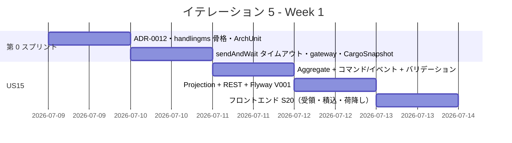
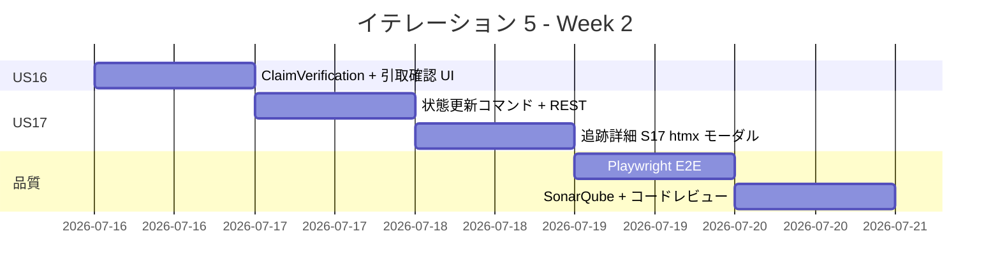
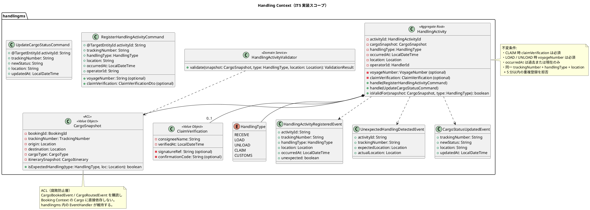
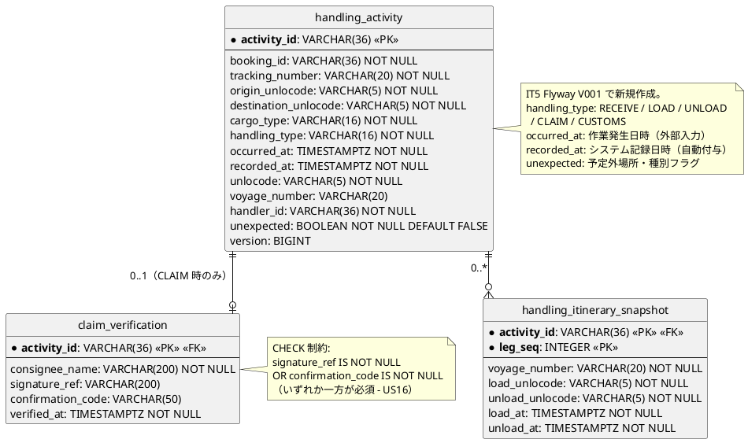
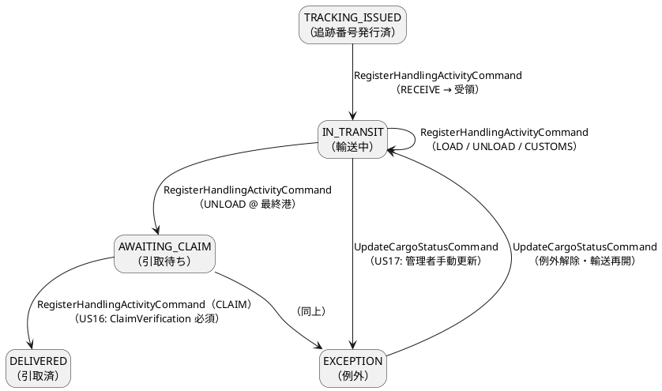
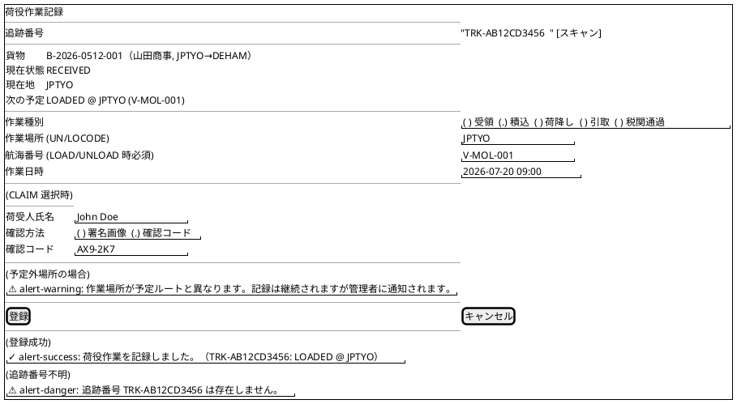
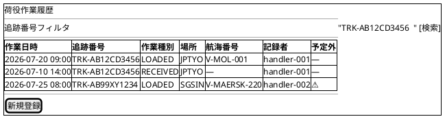
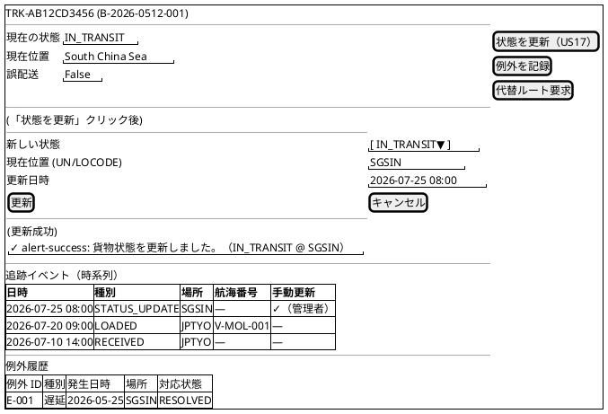
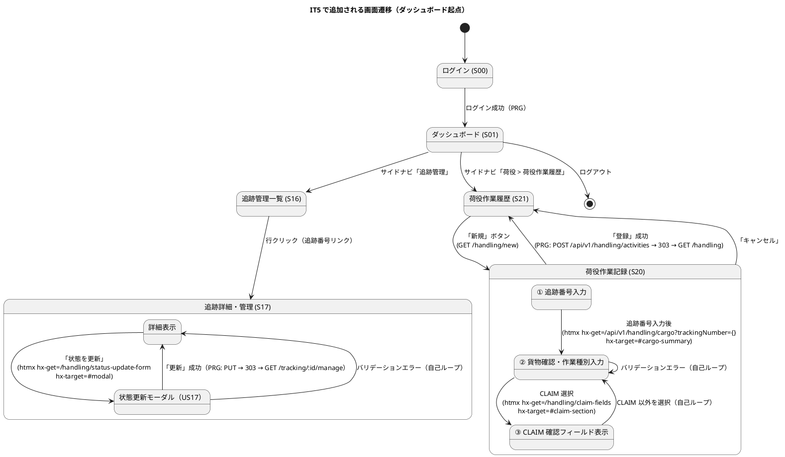

# イテレーション 5 計画

## 概要

| 項目 | 内容 |
|------|------|
| **イテレーション** | 5 / 8 |
| **期間** | Week 9-10（2026-07-09 〜 2026-07-22） |
| **ゴール** | `handlingms` を新設し、荷役作業記録（US15/US16）と貨物状態手動更新（US17）を実装することで Phase 2 追跡基盤を確立する |
| **目標 SP** | 11（新規 11 SP） |
| **基準ベロシティ** | 14.7 SP（IT1: 14 / IT2: 14 / IT3: 16 の平均）|

> **スコープ設定（IT4 完了後）**: IT1〜IT3 の平均ベロシティ 14.7 SP に対し IT5 目標は 11 SP（75%）。IT4 が特例スコープ（25 SP）だったため IT5 は持続可能ペース優先とし、handlingms 新設のインフラコストを TI04 として 2 SP 計上する。

> **TI04 対応（IT5 第 0 スプリント）**: IT4 コードレビュー高優先度指摘（H1〜H3）を着手前に解消し、ArchUnit テスト・sendAndWait タイムアウト・統合テスト整合を確立してから US15 実装に移行する。

> **ADR-0012 方針**: US15〜US17 は `handlingms` で実装し `HandlingActivityRegisteredEvent` を発行。将来の追跡照会（US18 以降）は `trackingms` が当該イベントをサブスクライブして Read Model を構築する。IT5 では `trackingms` は作成せず、handlingms 内の Projection で代替する。Saga 化は bookingms ↔ handlingms 連携が発生する IT6 以降に判断する（IT4 レビュー H4 対応）。

---

## ゴール

### イテレーション終了時の達成状態

1. **handlingms 稼働（TI04）**: Axon Event Sourcing による `HandlingActivity` Aggregate が起動し、`bookingms` の `CargoBookedEvent` をサブスクライブして `CargoSnapshot` を維持できる
2. **荷役作業記録（US15/US16）**: 追跡番号を入力して貨物を特定し、RECEIVE / LOAD / UNLOAD / CLAIM / CUSTOMS の 5 作業種別が記録でき、貨物状態に反映される。CLAIM（引取）時は `ClaimVerification`（署名または確認コード）が必須となる
3. **貨物状態手動更新（US17）**: 追跡管理者が追跡番号を指定して貨物状態・位置を手動更新でき、追跡イベント履歴に追記される

### 成功基準

- [ ] `POST /api/v1/handling/activities` が `RegisterHandlingActivityCommand` を発行し `HandlingActivityRegisteredEvent` が Axon Event Store に記録される（US15/US16）
- [ ] CLAIM 種別選択時に `ClaimVerification`（荷受人確認）が必須バリデーションとして機能する（US16）
- [ ] LOAD / UNLOAD 種別選択時に `voyageNumber` が必須バリデーションとして機能する
- [ ] `PUT /api/v1/handling/activities/{trackingNumber}/status` が状態手動更新を実行する（US17）
- [ ] `RouteCandidateFinderTest`（IT3 PoC の 6 テスト）に加え handlingms ユニット・統合テストが全件パスする
- [ ] フロントエンドの S20（荷役作業記録）・S21（作業履歴）・S17（追跡詳細）が動作する
- [ ] Playwright E2E テストが追加・全通過する
- [ ] SonarQube Quality Gate PASS（new_coverage ≥ 80%・violations 0）
- [ ] IT4 コードレビュー指摘の高優先度 3 件が対応済み（H1 ArchUnit・H2 タイムアウト・H3 テスト更新）

---

## ユーザーストーリー

### 対象ストーリー

| ID | ユーザーストーリー | SP | 優先度 | 区分 |
|----|------------------|----|----|------|
| TI04 | IT5 第 0 スプリント（handlingms 骨格・ADR-0012・IT4 レビュー H1-H3 対応） | 2 | 必須 | 技術タスク |
| US15 | 荷役作業を記録する | 5 | 必須 | 新規 |
| US16 | 引取作業を記録する | 2 | 必須 | 新規（US15 拡張） |
| US17 | 貨物状態を手動更新する | 2 | 必須 | 新規 |
| **合計** | | **11** | | |

> **フィーチャバッファ**: US16 引取確認フィールド（1 SP）は US15 が先行完了した場合に実装。US17 通知実送信（1 SP）は IT6 以降に繰越し可能。

### ストーリー詳細

#### TI04: IT5 第 0 スプリント

**目的**: handlingms の Axon Event Sourcing 骨格を確立し、IT4 コードレビュー指摘（H1〜H3）を解消する。

**受入条件**:

1. handlingms に `HandlingActivity` Aggregate クラスが存在し Spring Boot が起動できる
2. ADR-0012「handlingms と trackingms の責務分離方針」が承認済み
3. ArchUnit で `@TargetEntityId` 欠落コマンドを検出するアーキテクチャテストが bookingms に追加されている
4. `sendAndWait()` のタイムアウトが `BookingController` 全 3 箇所に明示指定されている（30 秒）
5. `confirm`・`issue-tracking` の統合テストが `sendAndWait` に更新されている

#### US15: 荷役作業を記録する（UC13）

**ストーリー**:

> 荷役作業員として、追跡番号を入力して貨物を特定し、作業種別・日時・場所を登録したい。なぜなら、荷役作業完了が即座に貨物状態に反映され、荷主がリアルタイムで確認できるからだ。

**受入条件**:

1. 追跡番号の入力（またはスキャン）で貨物を特定できる
2. 作業種別（受領・積込・荷降し・税関通過）を選択できる
3. 作業日時と作業場所（UN/LOCODE 形式の港湾コード）を入力できる
4. 記録後、貨物状態が対応する状態（受領済・積込済・荷降し済）に自動更新される
5. 記録後、荷主に状態変更通知が送信される（IT5 はログのみ、実送信は IT6+）
6. 追跡番号が存在しない場合、エラーメッセージが表示される
7. 作業場所が予定ルートと異なる場合、警告が表示される（`UnexpectedHandlingDetectedEvent` 発行）

**ADR-0012 対応**:

- `CargoSnapshot` ACL 経由で Booking への依存を隔離する
- `CargoBookedEvent` / `CargoRoutedEvent` を購読して `CargoSnapshot` を維持する
- `HandlingActivityValidator` で作業種別・場所・時刻の妥当性を検証する

#### US16: 引取作業を記録する（UC13）

**ストーリー**:

> 荷役作業員として、荷受人が貨物を引き取る際に、荷受人の確認（署名または確認コード）を取得して引取作業を記録したい。なぜなら、荷受人への正式な引き渡しを証明し、配送完了を記録できるからだ。

**受入条件**:

1. 作業種別「引取（CLAIM）」を選択すると、荷受人確認フィールド（署名または確認コード）が表示される
2. 荷受人確認が取得されると引取作業が記録される
3. 記録後、貨物状態が「引取済（DELIVERED）」に更新される
4. 貨物状態「引取済」は配送完了を意味し、精算処理の開始条件となる

#### US17: 貨物状態を手動更新する（UC14）

**ストーリー**:

> 追跡管理者として、追跡番号を指定して貨物の状態・位置・更新日時を手動で更新したい。なぜなら、荷役作業員の記録だけでは捕捉できない状態変化（出港・入港等）を追跡情報に反映できるからだ。

**受入条件**:

1. 追跡番号を指定して現在の貨物情報を確認できる
2. 新しい状態・位置・日時を入力して追跡情報を更新できる
3. 更新後、追跡イベントが履歴に記録される
4. 状態変更の種類に応じて荷主への通知が送信される（IT5 はログのみ、実送信は IT6+）

---

## タスク

### 1. TI04: IT5 第 0 スプリント（2 SP）

| # | タスク | 見積もり | 状態 |
|---|--------|---------|------|
| 1.1 | ADR-0012 起票（handlingms / trackingms 責務分離・Saga 方針） | 2h | [ ] |
| 1.2 | handlingms 骨格作成（Spring Boot + Axon + MyBatis + Flyway 設定） | 3h | [ ] |
| 1.3 | ArchUnit テスト追加（`@TargetEntityId` 強制・bookingms） | 2h | [ ] |
| 1.4 | `BookingController` `sendAndWait` タイムアウト明示指定（30s・全 3 箇所） | 1h | [ ] |
| 1.5 | `BookingControllerIntegrationTest` confirm/issue-tracking を sendAndWait に更新 | 1h | [ ] |
| 1.6 | gatewayms に `/api/v1/handling/**` ルーティング追加 | 1h | [ ] |
| 1.7 | `CargoBookedEvent` 購読 → `CargoSnapshot` 生成 EventHandler 実装 | 1h | [ ] |

**小計**: 11h

### 2. US15: 荷役作業を記録する（5 SP）

| # | タスク | 見積もり | 状態 |
|---|--------|---------|------|
| 2.1 | `RegisterHandlingActivityCommand` + `HandlingActivity` Aggregate（`handle` + `isValidFor`） | 3h | [ ] |
| 2.2 | `HandlingActivityRegisteredEvent` + `UnexpectedHandlingDetectedEvent` 定義 | 1h | [ ] |
| 2.3 | `HandlingActivityValidator`（ドメインサービス）実装 | 2h | [ ] |
| 2.4 | Flyway V001（handlingms）: `handling_activity` / `handling_itinerary_snapshot` / `claim_verification` テーブル作成 | 2h | [ ] |
| 2.5 | `HandlingProjectionsEventHandler`（`handling_activity` テーブル投影） | 2h | [ ] |
| 2.6 | `HandlingController` `POST /api/v1/handling/activities` 実装 | 2h | [ ] |
| 2.7 | ユニットテスト（Aggregate + バリデーション）+ 統合テスト（REST） | 2h | [ ] |
| 2.8 | フロントエンド S20 荷役作業記録フォーム（受領・積込・荷降し・税関通過） | 2h | [ ] |

**小計**: 16h

### 3. US16: 引取作業を記録する（2 SP）

| # | タスク | 見積もり | 状態 |
|---|--------|---------|------|
| 3.1 | `ClaimVerification` 値オブジェクト + CLAIM 時の不変条件（`claimVerification` 必須） | 2h | [ ] |
| 3.2 | フロントエンド S20: CLAIM 選択時に荷受人確認フィールドを動的表示（htmx） | 2h | [ ] |
| 3.3 | 「引取済（DELIVERED）」状態遷移テスト | 1h | [ ] |

**小計**: 5h

### 4. US17: 貨物状態を手動更新する（2 SP）

| # | タスク | 見積もり | 状態 |
|---|--------|---------|------|
| 4.1 | `UpdateCargoStatusCommand` + `CargoStatusUpdatedEvent`（handlingms 内 Aggregate） | 2h | [ ] |
| 4.2 | `HandlingController` `PUT /api/v1/handling/activities/{trackingNumber}/status` 実装 | 2h | [ ] |
| 4.3 | ユニットテスト + 統合テスト | 2h | [ ] |
| 4.4 | フロントエンド S17 追跡詳細「状態を更新」操作（htmx モーダル） | 2h | [ ] |

**小計**: 8h

### 5. E2E テスト + 品質確認

| # | タスク | 見積もり | 状態 |
|---|--------|---------|------|
| 5.1 | Playwright E2E: US15 荷役作業記録フルフロー（S20 → S21） | 2h | [ ] |
| 5.2 | Playwright E2E: US17 状態手動更新フロー（S17） | 1h | [ ] |
| 5.3 | SonarQube スキャン・violations 修正 | 1h | [ ] |
| 5.4 | コードレビュー（`developing-review`） | 1h | [ ] |

**小計**: 5h

### タスク合計

| カテゴリ | SP | 理想時間 | 状態 |
|---------|----|----|------|
| TI04 第 0 スプリント（IT4 レビュー H1-H3 + handlingms 骨格） | 2 | 11h | [ ] |
| US15 荷役作業を記録する | 5 | 16h | [ ] |
| US16 引取作業を記録する | 2 | 5h | [ ] |
| US17 貨物状態を手動更新する | 2 | 8h | [ ] |
| E2E・品質確認 | — | 5h | [ ] |
| **合計** | **11** | **45h** | |

**1 SP あたり**: 約 4h（実装 + テスト）
**進捗率**: 0%（0/11 SP）

---

## スケジュール

### Week 1（Day 1-5）: 第 0 スプリント・US15 実装



| 日 | タスク |
|----|--------|
| Day 1 | ADR-0012 起票・handlingms 骨格作成・ArchUnit テスト追加 |
| Day 2 | sendAndWait タイムアウト・統合テスト更新・gateway 追加・CargoSnapshot EventHandler |
| Day 3 | US15: `HandlingActivity` Aggregate + `RegisterHandlingActivityCommand` + `HandlingActivityValidator` |
| Day 4 | US15: `HandlingProjectionsEventHandler` + `HandlingController` + Flyway V001 |
| Day 5 | US15: フロントエンド S20（受領・積込・荷降し・税関通過フォーム） |

### Week 2（Day 6-10）: US16/US17・E2E・品質確認



| 日 | タスク |
|----|--------|
| Day 6 | US16: `ClaimVerification` VO + S20 CLAIM 選択時の動的フィールド表示 |
| Day 7 | US17: `UpdateCargoStatusCommand` + `PUT /api/v1/handling/activities/{trackingNumber}/status` |
| Day 8 | US17: フロントエンド S17 追跡詳細「状態を更新」モーダル |
| Day 9 | Playwright E2E（US15 フルフロー・US17 状態更新フロー） |
| Day 10 | SonarQube スキャン・violations 修正・コードレビュー・デモ準備 |

---

## 設計

### ドメインモデル（US15〜US17 観点）

> `domain-model.md` の Handling Context に準拠する。`HandlingActivity` Aggregate は `CargoSnapshot` ACL 経由で Booking 依存を隔離し、`HandlingType` 列挙で 5 作業種別を管理する。CLAIM 時は `ClaimVerification` VO が必須。`HandlingActivityValidator` ドメインサービスが予定外作業を検知し `UnexpectedHandlingDetectedEvent` を発行する。US17 の状態手動更新も `HandlingActivity` Aggregate の追加コマンドとして実装し、IT5 では handlingms 内 Projection で追跡情報を表現する。



| UC | 主集約 / サービス | 主コマンド | 主イベント | 状態遷移 |
|----|-----------------|-----------|-----------|---------|
| UC13 荷役作業記録（US15） | `HandlingActivity` | `RegisterHandlingActivityCommand` | `HandlingActivityRegisteredEvent` | `RECEIVED` / `LOADED` / `UNLOADED` |
| UC13 引取作業記録（US16） | `HandlingActivity` | `RegisterHandlingActivityCommand`（CLAIM） | `HandlingActivityRegisteredEvent` | `UNLOADED` → `AWAITING_CLAIM` → `DELIVERED` |
| UC14 貨物状態手動更新（US17） | `HandlingActivity` | `UpdateCargoStatusCommand` | `CargoStatusUpdatedEvent` | 任意状態遷移（管理者権限） |

### データモデル

> `data-model.md` の Handling Context テーブル定義に準拠する。`handling_activity` がメインテーブルで、`CargoSnapshot` 情報（`booking_id`・`origin_unlocode`・`destination_unlocode`・`cargo_type`）を射影として保持する。`handling_itinerary_snapshot` は LOAD/UNLOAD 時の旅程スナップショット。`claim_verification` は CLAIM 種別時のみ作成される 1:0..1 テーブル。`recipient_confirmation` カラムは使用せず、`claim_verification` テーブルに正規化する。



> **`handling_type` 状態と `BookingStatus` の連携（IT5 追加分）**:



### API 設計

| メソッド | エンドポイント | 説明 | US |
|---------|---------------|------|----|
| `POST` | `/api/v1/handling/activities` | 荷役作業を記録する（`RegisterHandlingActivityCommand` 発行） | US15, US16 |
| `PUT` | `/api/v1/handling/activities/{trackingNumber}/status` | 貨物状態を手動更新する（`UpdateCargoStatusCommand` 発行） | US17 |
| `GET` | `/api/v1/handling/activities/{trackingNumber}` | 作業履歴を照会する（S21・S17 用 Read Model） | US15, US17 |

#### POST /api/v1/handling/activities リクエスト例（US15: LOAD）

```json
{
  "trackingNumber": "TRK-20260718-ABC12345",
  "handlingType": "LOAD",
  "unlocode": "JPTYO",
  "voyageNumber": "V-MOL-001",
  "occurredAt": "2026-07-18T09:00:00",
  "operatorId": "handler-001"
}
```

#### POST /api/v1/handling/activities リクエスト例（US16: CLAIM）

```json
{
  "trackingNumber": "TRK-20260718-ABC12345",
  "handlingType": "CLAIM",
  "unlocode": "DEHAM",
  "occurredAt": "2026-08-10T14:30:00",
  "operatorId": "handler-002",
  "claimVerification": {
    "consigneeName": "John Doe",
    "confirmationCode": "AX9-2K7"
  }
}
```

#### PUT /api/v1/handling/activities/{trackingNumber}/status リクエスト例（US17）

```json
{
  "newStatus": "IN_TRANSIT",
  "unlocode": "SGSIN",
  "updatedAt": "2026-07-25T08:00:00"
}
```

### ユーザーインターフェース

#### ビュー（画面構成）

`ui_design.md` の画面一覧に準拠する。S20（荷役作業記録）と S21（作業履歴）が IT5 で本実装される新規画面。S17（追跡詳細・管理）は既存画面の「状態を更新」ボタンを IT5 で機能実装する。

| 画面 ID | 画面名 | パス | 実装内容 | US |
|--------|-------|------|---------|-----|
| S16 | 追跡管理一覧 | `/tracking` | 既存 — 変更なし。S17 への導線として追跡番号一覧を維持 | US17 前提 |
| S17 | 追跡詳細・管理 | `/tracking/:trackingNumber/manage` | IT5 で「状態を更新」ボタンを機能実装（htmx モーダル） | US17 |
| S20 | 荷役作業記録 | `/handling/new` | IT5 で新規作成 — 作業種別・場所・日時・引取確認フィールド | US15, US16 |
| S21 | 荷役作業履歴 | `/handling` | IT5 で新規作成 — 追跡番号別の作業履歴一覧 | US15 |

#### ワイヤーフレーム（PlantUML salt）

共通ヘッダー（`国際貨物輸送管理 | ユーザ名 (ロール) | [ログアウト]`）とサイドナビは全画面共通のため省略する。

##### S20: 荷役作業記録（US15/US16）



##### S21: 荷役作業履歴（US15）



##### S17: 追跡詳細・管理（US17 拡張部分）



#### インタラクション（画面遷移と htmx パターン）



> ダッシュボード起点で IT5 の主要シナリオを示す。**荷役作業員**はサイドナビ「荷役 > 荷役作業履歴」（S21）→「新規」→ S20 で作業記録を行う。**追跡管理者**はサイドナビ「追跡管理」（S16）→ S17 で状態手動更新を行う。

**htmx / PRG 規約**:

- 追跡番号入力後の貨物概要取得は `hx-get=/api/v1/handling/cargo?trackingNumber={}` で `#cargo-summary` を部分更新
- CLAIM 選択時の荷受人確認フィールド表示は `hx-get=/handling/claim-fields` で `#claim-section` を部分更新
- 荷役作業記録（S20 → S21）は PRG（`POST /api/v1/handling/activities` → 303 → `GET /handling`）でブラウザ戻る防止
- S17 の状態更新は htmx `hx-get=/handling/status-update-form` でモーダルを表示し、更新後は PRG
- コマンド成功時は `alert-success`、サーバーエラーは `htmx:responseError` を捕捉して `alert-danger` を表示（ui_design.md インタラクション規約準拠）
- Read Model 反映待ちは指数バックオフ最大 3 回（合計約 5 秒）で `invalidateQueries` 後に再フェッチ
- LOAD / UNLOAD 時に `voyageNumber` 未入力はクライアントバリデーションで即座にフィードバック

### ADR

| ADR | タイトル | ステータス |
|-----|---------|-----------|
| ADR-0012（新規） | handlingms と trackingms の責務分離・Saga 方針 | 提案 |

### ディレクトリ構成（新規）

```
apps/backend/handlingms/
├── src/main/java/com/example/cargotracker/handlingms/
│   ├── HandlingApplication.java
│   ├── domain/model/
│   │   ├── aggregates/
│   │   │   └── HandlingActivity.java
│   │   ├── commands/
│   │   │   ├── RegisterHandlingActivityCommand.java
│   │   │   └── UpdateCargoStatusCommand.java
│   │   ├── events/
│   │   │   ├── HandlingActivityRegisteredEvent.java
│   │   │   ├── UnexpectedHandlingDetectedEvent.java
│   │   │   └── CargoStatusUpdatedEvent.java
│   │   ├── valueobjects/
│   │   │   ├── CargoSnapshot.java
│   │   │   ├── ClaimVerification.java
│   │   │   ├── HandlingType.java
│   │   │   └── HandlingActivityId.java
│   │   └── services/
│   │       └── HandlingActivityValidator.java
│   ├── application/
│   │   └── eventhandlers/
│   │       ├── CargoSnapshotEventHandler.java
│   │       └── HandlingProjectionsEventHandler.java
│   ├── infrastructure/persistence/
│   │   ├── HandlingActivityMapper.java
│   │   ├── HandlingActivityRecord.java
│   │   ├── ClaimVerificationMapper.java
│   │   └── ClaimVerificationRecord.java
│   └── interfaces/rest/
│       ├── HandlingController.java
│       └── dto/
│           ├── RecordActivityRequest.java
│           └── UpdateStatusRequest.java
└── src/main/resources/
    ├── application.yml
    └── db/migration/
        └── V001__create_handling_tables.sql
```

---

## リスクと対策

| リスク | 影響度 | 対策 |
|--------|--------|------|
| handlingms 新設の設定コスト超過 | 中 | 第 0 スプリント（Day 1-2）で骨格を確立してから機能実装に移行。bookingms の設定を参考に短縮 |
| `@TargetEntityId` 欠落再発（handlingms） | 高 | TI04 で ArchUnit テストを追加し、CI で自動検出。bookingms の既存コマンドも検査対象に含める |
| `CargoSnapshot` の更新タイミング（bookingms ↔ handlingms 整合） | 中 | `CargoBookedEvent` / `CargoRoutedEvent` の EventHandler をユニットテストで先に固定してから実装 |
| CLAIM 時の荷受人確認フィールドの業務未合意 | 低 | 確認コード形式（UUID / 署名画像 / 4 桁 PIN）を IT5 計画前にユーザー代表と合意。現在は確認コード or 署名画像で設計 |
| US17 状態手動更新が不正な状態遷移を引き起こす | 中 | `UpdateCargoStatusCommand` に許可状態遷移リストを持たせ、追跡管理者ロール（`ROLE_TRACKER`）のみ実行可能とする |

---

## 完了条件

### Definition of Done

- [ ] コードレビュー（`developing-review`）完了（または SonarQube Quality Gate PASS で代替）
- [ ] 全ユニットテストがパス（バックエンド・フロントエンド）
- [ ] 統合テスト・E2E テストがパス（Playwright E2E: handling-activity.spec.ts）
- [ ] SonarQube Quality Gate PASS（new_coverage ≥ 80%・new_violations 0）
- [ ] SonarQube violations 0 件（Bug 0・Vulnerability 0・Code Smell 0）
- [ ] ArchUnit テストがパス（`@TargetEntityId` 強制・bookingms + handlingms）
- [ ] ADR-0012 承認済み
- [ ] gatewayms に `/api/v1/handling/**` が登録済み
- [ ] Flyway V001（handlingms）で 3 テーブルが作成済み
- [ ] IT4 コードレビュー指摘 H1〜H3 対応済み

### デモ項目

1. S21 荷役作業履歴で「新規」→ S20 に遷移し、追跡番号を入力すると貨物概要が表示される
2. S20 で「積込（LOAD）」を選択・航海番号・場所・日時を入力して「登録」→ 作業履歴に反映される
3. S20 で「引取（CLAIM）」を選択すると荷受人確認フィールドが動的表示される
4. S16 で追跡番号一覧から行をクリック → S17 追跡詳細「状態を更新」ボタンが機能する
5. S17 で「状態を更新」→ モーダルから新しい状態・場所・日時を入力して更新 → 追跡イベント履歴に追記される

### IT6 繰越し事項（IT5 スコープ外）

以下は IT4 コードレビュー中優先度指摘（M1〜M6）の対応。IT5 では実装せず IT6 計画に引き継ぐ。

| ID | 内容 | 指摘元 |
|----|------|--------|
| M1 | `data-testid` 属性を UI 要素に付与（E2E ロケーター強化） | xp-programmer / xp-tester |
| M2 | gatewayms predicates を YAML リスト形式に変更 | xp-programmer |
| M3 | Tracking Number フォーマット仕様を ADR に記録 | xp-architect |
| M4 | `sendAndWait` 変更理由を Javadoc に追記 | xp-technical-writer |
| M5 | `NotifyRouteCommand` に IT5+ メール送信予定を記載 | xp-technical-writer |
| M6 | `sendAndWait` 遅延時の処理中インジケータ追加（二重送信防止） | xp-user-representative |

---

## 更新履歴

| 日付 | 更新内容 | 更新者 |
|------|---------|--------|
| 2026-05-18 | 初版作成（IT4 完了後・IT4 コードレビュー指摘反映） | AI Agent（XP PM） |
| 2026-05-18 | 整合性検証対応: US 受入条件・ドメインモデル・データモデル修正、Saga 方針追記、IT6 繰越し追記 | AI Agent |
| 2026-05-18 | IT4 品質水準に合わせ設計セクションを全面拡充（ドメインモデル図・状態遷移図・データモデル ER 図・S20/S21/S17 ワイヤーフレーム・インタラクション遷移図・htmx 規約・コマンド/イベント表を追加） | AI Agent |

---

## 関連ドキュメント

- [リリース計画](./release_plan.md)
- [イテレーション 4 計画](./iteration_plan-4.md)
- [イテレーション 4 完了報告書](./iteration_report-4.md)
- [イテレーション 4 ふりかえり](./retrospective-4.md)
- [IT4 バグ修正コードレビュー](../review/IT4_bugfix_review_20260518.md)
