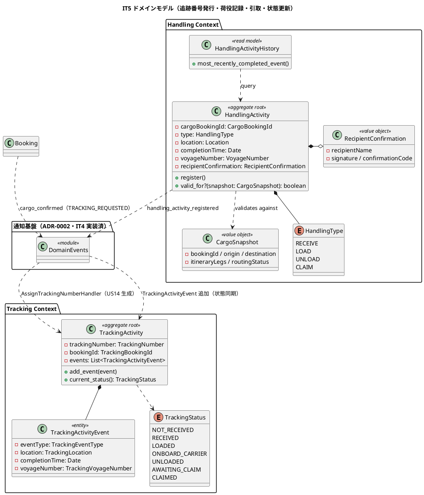
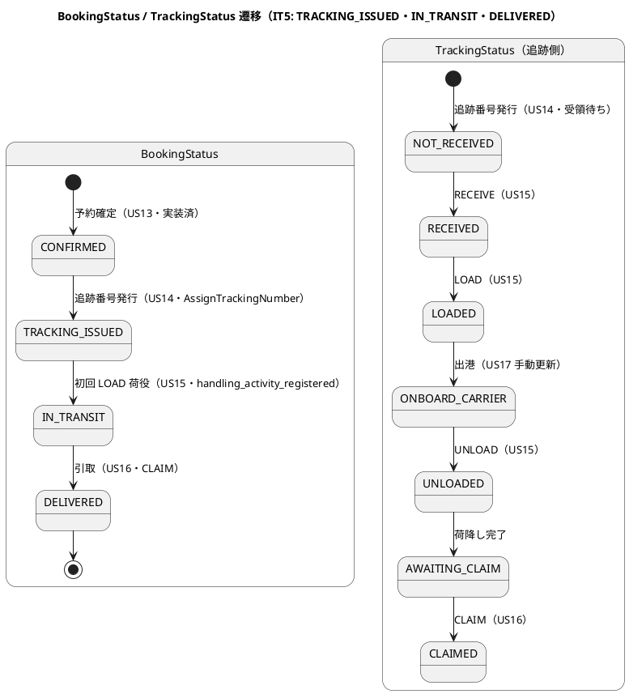
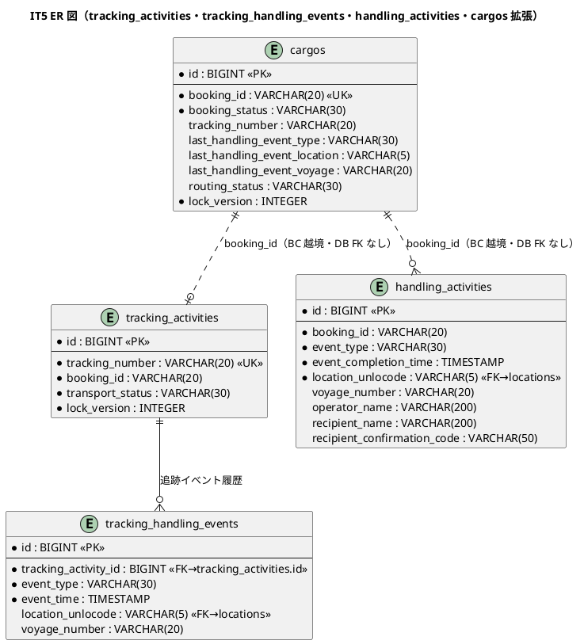
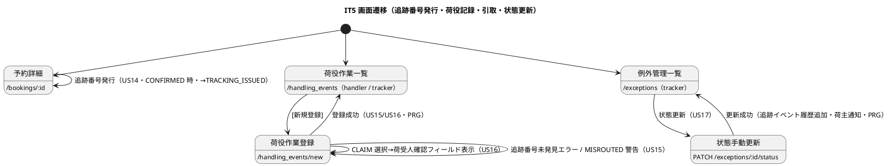

# イテレーション 5 計画 - 追跡番号発行 + 荷役記録 + 状態更新

## ゴール

Tracking Context の TrackingActivity 集約（TrackingNumber・TrackingActivityEvent）と Handling Context の HandlingActivity（HandlingActivityHistory Read Model）を確立し、追跡番号発行（US14）・荷役作業記録（US15）・引取作業記録（US16）・貨物状態手動更新（US17）を中盤インサイドアウトで TDD 完成させる。IT4 で確立した通知基盤（ADR-0002・ドメインイベント）を起点に、`cargo_confirmed`（event `TRACKING_REQUESTED`）購読ハンドラを TrackingActivity 生成へ結線し、BookingStatus の CONFIRMED→TRACKING_ISSUED→IN_TRANSIT 遷移を通す。Phase 3（追跡・荷役・例外処理）の前半にあたり、Release 0.3 は Phase 3 完了（IT6）時に出すため IT5 では出さない。

- **局面**: 中盤（インサイドアウト）— [development_strategy.md](development_strategy.md) 参照。データ層 → ドメイン層 → アプリケーション → UI の順で貫通する
- **期間**: Week 9-10（2026-09-07 〜 2026-09-20）
- **目標 SP**: 14

## 対象ストーリー

| US | 概要 | SP | BC | 対応 UC |
|:---|:-----|:--|:---|:--------|
| US14 | 追跡番号を発行する | 3 | Tracking | UC12 |
| US15 | 荷役作業を記録する | 5 | Handling | UC13 |
| US16 | 引取作業を記録する | 3 | Handling | UC13 |
| US17 | 貨物状態を手動更新する | 3 | Tracking | UC14 |

（release_plan.md Phase 3 / IT5 と一致・計 14 SP）

## 受入条件

[user_story.md](../requirements/user_story.md) の受け入れ基準に準拠（全文）。各基準は計画段階でテストケースへ 1:1 マッピングする（T27）。

**US14 追跡番号を発行する**（として: 経路設計者）

- [ ] 「予約確定」状態の予約に対して追跡番号を発行できる
- [ ] 追跡番号は一意に採番される
- [ ] 発行後、貨物状態が「受領待ち」に設定される
- [ ] 荷主に追跡番号と追跡方法をメール通知する

**US15 荷役作業を記録する**（として: 荷役作業員）

- [ ] 追跡番号の入力（またはスキャン）で貨物を特定できる
- [ ] 作業種別（受領・積込・荷降し）を選択できる
- [ ] 作業日時と作業場所（UN/LOCODE 形式の港湾コード）を入力できる
- [ ] 記録後、貨物状態が対応する状態（受領済・積込済・荷降し済）に自動更新される
- [ ] 記録後、荷主に状態変更通知が送信される
- [ ] 追跡番号が存在しない場合、エラーメッセージが表示される
- [ ] 作業場所が予定ルートと異なる場合、警告が表示される

**US16 引取作業を記録する**（として: 荷役作業員）

- [ ] 作業種別「引取」を選択すると、荷受人確認フィールド（署名または確認コード）が表示される
- [ ] 荷受人確認が取得されると引取作業が記録される
- [ ] 記録後、貨物状態が「引取済」に更新される
- [ ] 貨物状態「引取済」は配送完了を意味し、精算処理の開始条件となる

**US17 貨物状態を手動更新する**（として: 追跡管理者）

- [ ] 追跡番号を指定して現在の貨物情報を確認できる
- [ ] 新しい状態・位置・日時を入力して追跡情報を更新できる
- [ ] 更新後、追跡イベントが履歴に記録される
- [ ] 状態変更の種類に応じて荷主への通知が送信される

## タスク分解（インサイドアウト）

中盤はデータ層 → ドメイン層 → アプリケーション → UI の順で貫通する。

### 技術的負債の返済枠（IT4 ふりかえり Try・序盤の独立コミット枠で先着手）

> IT4 で「余力次第にしない」と独立枠化したにもかかわらず未消化だった反省（[[feedback_debt-allowance-defer-antipattern]]）を踏まえ、以下は **Week 9 序盤の独立コミット枠**で追跡・荷役の本体着手より前に先着手する。「余力次第」にしない。

- [ ] 【T16】CI 相当のローカル検証を**クローズ前チェック手順として定着**（`db:drop db:prepare`（seed 込み）+ eager load + `bundle exec rspec --order random` をローカルで実行し「ローカル緑・CI 赤」を封じる）
- [ ] 【T21】voyages 楽観ロック（`lock_version`）追加と `RegisterVoyage`/`UpdateSchedule` の DRY 化・`Voyage`/`Cargo` の生成/復元責務分離（T24 と統合）
- [ ] 【T24】`Cargo.reconstitute` を新設し生成（`new`）と復元（永続化からの再構築）の責務を分離（T21 と統合可）
- [ ] 【T25】`replace_legs` を旅程変更時のみ実行するよう条件化（無条件全置換による意図しない上書きを防止）
- [ ] 【T26】通知購読 `install!` に冪等ガードを追加（多重購読・多重発行を防止）
- [ ] 【T22】US25 差分確認画面・US08 寄港地接続評価（多区間フォールバック）を実装し受入基準を完全充足（独立コミット枠・繰越の連鎖を断つ）

### データ層（tracking 系・handling 系・cargos 拡張）

- [ ] `tracking_activities` テーブル migration（`tracking_number` UK・`booking_id`・状態カラム・`lock_version`。集約ルート・楽観ロック対象。data-model の `transport_status` と domain-model の `TrackingStatus` の命名不一致は「設計への反映が必要」で確定）
- [ ] `tracking_handling_events` テーブル migration（`tracking_activity_id` FK・`event_type`・`event_time`・`location_unlocode`・`voyage_number`。追跡イベント履歴。US15/US17 で記録）
- [ ] `handling_activities` テーブル migration（`booking_id`・`event_type` RECEIVE/LOAD/UNLOAD/CLAIM・`event_completion_time`・`location_unlocode`・`voyage_number`・`operator_name`・`recipient_name`・`recipient_confirmation_code`。CUSTOMS 種別と `customs_declarations` は IT5 スコープ外）
- [ ] `cargos` の将来追加予定カラムを実カラム化（`tracking_number`（US14 発行後設定）・`last_handling_event_type`/`last_handling_event_location`/`last_handling_event_voyage`（US15 最終荷役反映））

### ドメイン層（Tracking Context・Handling Context）

- [ ] Tracking Context 値オブジェクト: `TrackingNumber`・`TrackingBookingId`（ADR-0003 越境識別子・string）・`TrackingLocation`（ACL 変換）・`TrackingVoyageNumber` のユニット spec
- [ ] `TrackingActivity`（集約ルート・`add_event(TrackingActivityEvent)`・`current_status()`・`TrackingStatus` 9 段階のうち IT5 は NOT_RECEIVED/RECEIVED/LOADED/ONBOARD_CARRIER/UNLOADED/AWAITING_CLAIM/CLAIMED を対象）・`TrackingActivityEvent`（`event_type`・`location`・`completion_time`・`voyage_number`）のユニット spec
- [ ] Handling Context 値オブジェクト: `CargoBookingId`（ADR-0003）・`HandlingType`（RECEIVE/LOAD/UNLOAD/CLAIM・`requires_voyage_number?`/`load_type?`/`claim_type?`）・`CargoSnapshot`/`LegSnapshot`（ACL 経由・妥当性検証）・`VoyageNumber`・`RecipientConfirmation`（`recipient_name` + `signature` or `confirmation_code`・CLAIM 時必須・US16）
- [ ] `HandlingActivity`（集約ルート・`register()`・`valid_for?(CargoSnapshot)` の荷役妥当性デシジョンテーブル: RECEIVE=出発港照合・LOAD/UNLOAD=Itinerary 照合で不一致 MISROUTED・CLAIM=目的港照合。VoyageNumber 必須判定は HandlingType が内包）のユニット spec
- [ ] `HandlingActivityHistory`（Read Model・`most_recently_completed_event()`・クエリ専用。集約と切り離し・CQRS Query 側）
- [ ] `TrackingStatus`/`HandlingType`/`ExceptionType`（DELAY/DAMAGE/LOST/CUSTOMS_HOLD は IT6 例外処理で使用・enum 定義のみ先行可）の列挙型
- [ ] `BookingStatus` に CONFIRMED→TRACKING_ISSUED（US14）・TRACKING_ISSUED→IN_TRANSIT（US15 初回 LOAD）・→DELIVERED（US16 CLAIM）の遷移述語を追加（Cargo 側メソッド）

### アプリケーション（ユースケース・イベントハンドラ）

- [ ] `AssignTrackingNumber` ユースケース（US14・TrackingActivity 新規作成→TrackingNumber 一意採番→`cargos.tracking_number` 設定・BookingStatus CONFIRMED→TRACKING_ISSUED・荷主へ追跡番号通知）
- [ ] `cargo_confirmed`（event `TRACKING_REQUESTED`）購読ハンドラを **TrackingActivity 生成へ結線**（ADR-0002・IT4 では通知記録のみ→ IT5 で Tracking Context のハンドラ `AssignTrackingNumberHandler` を追加購読。BC 独立性: ペイロードはプリミティブ Hash 経由）
- [ ] `RegisterHandlingActivity` ユースケース（US15/US16・追跡番号で貨物特定→`CargoSnapshot` を Booking の公開 API 経由で取得→`valid_for?` 検証→HandlingActivity 保存→`handling_activity_registered` イベント発行）
- [ ] `handling_activity_registered` 購読ハンドラ（現状 domain-model「将来連携」→ IT5 で有効化）: Tracking Context が `TrackingActivityEvent` 追加＋貨物状態同期・Booking Context が `last_handling_event_*`/BookingStatus 同期（LOAD→IN_TRANSIT・CLAIM→DELIVERED）・荷主へ状態変更通知（US15/US16）
- [ ] `UpdateTrackingStatusManually` ユースケース（US17・追跡番号指定→状態・位置・日時を手動更新→`TrackingActivityEvent` 履歴追加→状態変更種別に応じ荷主通知）
- [ ] MISROUTED 警告: `valid_for?` が不一致を返した場合、UI へ警告を返す（記録は阻止しない・US15 受入基準）。LOAD/UNLOAD の MISROUTED は `cargos.routing_status` を MISROUTED に更新（`handling_activity_registered` 経由）

### UI（追跡番号発行・荷役記録・引取・状態更新）

- [ ] US14 追跡番号発行導線（予約詳細 `/bookings/:id` の CONFIRMED 状態で「追跡番号発行」操作・PRG `see_other`）※ui_design に導線追加が必要
- [ ] `GET /handling_events/new`・`POST /handling_events`（`handling_events#new`/`create`・US15/US16 荷役登録フォーム。追跡番号入力→作業種別選択→CLAIM 選択時に荷受人確認フィールドを動的表示（Stimulus）・PRG）
- [ ] `GET /handling_events`（`handling_events#index`・荷役履歴一覧・検索）
- [ ] US17 状態手動更新導線（`PATCH /exceptions/:id/status`＝`exceptions#update_status` を活用、または追跡系ルートに手動更新を追加。ui_design の US17 マッピングと整合させ確定）
- [ ] ナビゲーション整合・ロール別到達性 system spec: 荷役作業員（handler）が navbar「荷役管理」→荷役登録に到達・追跡管理者（tracker）が状態手動更新に到達（ui_design ナビ・ダッシュボード・検証テストの 4 点一致を DoD 化・[[feedback_navigation-integrity-check]]・[[feedback_role-entry-navigation]]）

## スケジュール

| Week | 主な作業 |
|:-----|:---------|
| Week 9 | **序盤先着手: 負債返済枠（T16 / T21+T24 / T25 / T26 / T22）を追跡・荷役本体より前に独立コミットで完了** → tracking/handling テーブル migration・cargos 拡張 → Tracking/Handling 値オブジェクト・TrackingActivity/HandlingActivity 集約のユニット spec → US14 追跡番号発行（cargo_confirmed 購読結線・CONFIRMED→TRACKING_ISSUED） |
| Week 10 | US15 荷役記録（RECEIVE/LOAD/UNLOAD・valid_for? 検証・handling_activity_registered 有効化・状態同期・荷主通知）→ US16 引取（CLAIM・RecipientConfirmation・DELIVERED）→ US17 状態手動更新 → UI・ナビ導線 → デモ項目 system spec の green 化、品質ゲート（SonarQube 含む）。Release 0.3 は IT6（Phase 3 完了）時のため IT5 では出さない |

## 設計（IT5 スコープに絞った 4 図）

### ドメインモデル図（Tracking Context + Handling Context）

> **制約**: Tracking / Handling は Booking の内部集約に直接依存せず、`CargoSnapshot`（ACL・公開 API 経由・ADR-0003 越境識別子は string）とドメインイベント（プリミティブ Hash ペイロード）でのみ連携する。荷役妥当性 `valid_for?` は RECEIVE=出発港・LOAD/UNLOAD=Itinerary・CLAIM=目的港を照合し、LOAD/UNLOAD 不一致は MISROUTED、RECEIVE/CLAIM 不一致は警告とする。CLAIM は RecipientConfirmation 必須（US16）。CustomsDeclaration/CUSTOMS は IT5 スコープ外。

### 状態遷移図（BookingStatus・TrackingStatus・IT5 スコープを強調）

> **注**: US14 で貨物状態は「受領待ち」（TrackingStatus=NOT_RECEIVED）に設定される。BookingStatus 側は CONFIRMED→TRACKING_ISSUED。US15 の荷役記録が TrackingStatus と BookingStatus（LOAD→IN_TRANSIT）を同期し、US16 CLAIM が DELIVERED へ遷移させる（精算開始条件）。US17 は追跡管理者が捕捉できない状態変化（出港・入港＝ONBOARD_CARRIER 等）を手動反映する。IN_TRANSIT の起点（初回 LOAD か出港か）は「設計への反映が必要」で確定する。

### ER 図（IT5 スコープ）

> **注**: `tracking_activities`/`tracking_handling_events`/`handling_activities` は data-model に定義済（新規作成）。BC 越境参照（`tracking_activities.booking_id`→`cargos.booking_id`・`handling_activities.booking_id`）には DB 外部キー制約を設けない（ADR-0001/data-model 方針）。`customs_declarations`・`tracking_exception_events` は IT6（例外処理）スコープのため IT5 では作成しない。`cargos.tracking_number`/`last_handling_event_*` は data-model「将来追加予定」を IT5 で実カラム化する。

### 画面遷移図（IT5 スコープ）

## リスク

| リスク | 対策 |
|--------|------|
| Tracking/Handling が Booking 内部に依存し BC 独立性を破る | 連携は `CargoSnapshot`（ACL・公開 API）とドメインイベント（プリミティブ Hash）に限定。`packs/tracking`・`packs/handling` の `package.yml` に不要な `packs/booking` 依存を持たせず Packwerk privacy で検証 |
| `handling_activity_registered`（domain-model「将来連携」）を IT5 で初有効化する結線コスト | IT4 の `DomainEvents`/`NotificationWiring`/購読ハンドラ構成を再利用。購読側例外は非伝播（状態遷移を妨げない）。`install!` 冪等ガード（T26）で多重購読を防止 |
| US14 の主体（経路設計者の手動発行 vs cargo_confirmed イベント駆動の自動生成）が設計上併存 | domain-model のコマンド一覧（`AssignTrackingNumberCommand` 実行アクターが Booking 表と Tracking 表で不一致）を「設計への反映が必要」で一意化。MVP は cargo_confirmed 購読で TrackingActivity を生成し、経路設計者は発行操作をトリガーする導線に整理 |
| TrackingStatus（9 値）と data-model `tracking_activities.transport_status`・cargos 側 TransportStatus の命名併存 | ユビキタス言語を TrackingStatus に統一し data-model のカラム説明・domain-model を整合。IT5 で使う状態値のみ実装し残りは IT6 |
| 荷役妥当性 `valid_for?` の MISROUTED 判定と警告の区別 | デシジョンテーブル（RECEIVE/CLAIM=警告・LOAD/UNLOAD=MISROUTED）をユニットで先に固定。記録は阻止せず警告表示（US15 受入基準） |

## 設計への反映が必要（validating 検証で確定予定）

以下は検証ステップで確定し、実装と同一コミットで `docs/design/`・ADR へ反映する（[[feedback_scope-change-canon-sync.md]]・正典 3 点同時更新）。

1. **US14 の主体とイベント駆動の一意化**: domain-model のコマンド一覧で `AssignTrackingNumberCommand` の実行アクターが「経路設計者」（Booking 表 615 行）と「Booking Context（イベント駆動）」（Tracking 表 947 行）で不一致。`cargo_confirmed`（TRACKING_REQUESTED）購読で TrackingActivity を生成し、経路設計者の発行操作がトリガーとなる方式に一意化して domain-model・ADR-0002 へ反映。
2. **`handling_activity_registered` を「将来連携」から「IT5 実装」へ**: domain-model のイベント表（1532 行）・通知対応表（1553 行）で本イベントが「将来」。US15/US16 で TrackingActivityEvent 追加・BookingStatus 同期（LOAD→IN_TRANSIT・CLAIM→DELIVERED）・荷主/荷受人通知を実装するため、実装状況注記と通知対応（event_type）を追記する。
3. **TrackingStatus 命名の統一**: data-model `tracking_activities.transport_status`（TransportStatus 列挙）と domain-model `TrackingStatus`（9 値）の命名併存を統一（ユビキタス言語＝TrackingStatus）。cargos 側の `next_expected_*`/`last_handling_event_*` の TransportStatus 参照も整合。
4. **BookingStatus IN_TRANSIT の起点**: CONFIRMED→TRACKING_ISSUED→IN_TRANSIT の IN_TRANSIT 遷移契機（初回 LOAD 荷役か出港手動更新か）が domain-model のビジネスルール・状態遷移に明記されていない → 確定して追記。
5. **ui_design の US 対応マッピング誤記**: ui_design の画面一覧で `/tracking`（76-77 行）が US13/US14/US15、`/handling_events/new`（78 行）が US10/US11 とマッピングされているが、追跡照会は US18、荷役登録は US15/US16 が正。IT5 該当画面（追跡詳細・荷役登録・状態手動更新）の US 対応を修正する。
6. **US14 追跡番号発行の UI 導線**: 予約詳細（CONFIRMED 時）からの「追跡番号発行」操作・ルートが ui_design に未整備 → 追加し反映（ロール: 経路設計者/営業担当者）。
7. **US17 状態手動更新のルート帰属**: ui_design では `PATCH /exceptions/:id/status`（例外管理）に US17 をマッピング（91-92・140 行）。追跡系ルート（`/tracking`）との整合を確認し、US17 の入口（追跡管理者の到達導線）を一意化して反映。
8. **RecipientConfirmation の署名フィールド**: domain-model は `signature` または `confirmation_code` を要求するが、data-model `handling_activities` は `recipient_confirmation_code` のみ（`signature` カラムなし）。IT5 で `recipient_signature` カラム追加要否を確定し data-model へ反映。

## Definition of Done

- [x] US14/US15/US16/US17 の受け入れ基準をすべて満たす（US14 通知本文の追跡 URL・handler 追跡導線はレビュー低優先で次 IT）
- [x] デモ項目 system/request spec（追跡番号発行→TRACKING_ISSUED、荷役記録 RECEIVE/LOAD/UNLOAD→状態自動更新・荷主通知、MISROUTED 警告、引取 CLAIM→DELIVERED、状態手動更新→履歴追加・通知）が green
- [x] TrackingActivity/HandlingActivity/route_check デシジョンテーブル・HandlingActivityHistory Read Model・RecipientConfirmation のユニット spec が green
- [x] `handling_activity_registered`→状態同期・通知（3 ハンドラ同時）の spec が green（ドメイン集約は純 PORO・発行はアプリサービス・ADR-0002）。※US14 は cargo_confirmed 自動生成ではなく明示発行に一意化（ADR-0002 追記）
- [x] `bundle exec rspec`（294 例）/ `rubocop`（AR 禁止 cop）/ `brakeman`（0）/ `bundler-audit`（0）/ `bin/packwerk check`（privacy）green・CI success
- [x] ドメイン層カバレッジ 85% 以上・全体 80% 以上（新規 92.7%）
- [x] **SonarQube Quality Gate PASS**（Bug 0・Vulnerability 0・重複 0.0%・違反 0）
- [x] BC 独立性: Tracking/Handling が Booking の内部集約に依存せず公開 API（`CargoSnapshot`）/ドメインイベント経由のみ（Packwerk privacy・ADR-0003）
- [x] ナビゲーション整合・ロール別到達性（荷役作業員→荷役登録、追跡管理者→貨物追跡入力→詳細）の system spec green・4 点一致
- [x] 上記「設計への反映が必要」の 8 点を `docs/design/`・ADR に反映済み
- [x] 負債返済枠 T16/T21/T22/T24/T25/T26 を序盤の独立コミット枠で消化済み（繰越の連鎖を断つ）
- [x] Release 0.3 は Phase 3 完了（IT6）時に出すため IT5 では出さない（IT5 は Phase 3 前半）

> **実績注記（クローズ時）**: 5 視点マルチパースペクティブレビューの高 5 件はすべてクローズ前に対応済み（H1 MISROUTED 警告分離・H2 CLAIM 動的表示 Stimulus・H3 荷役前提状態ガード・H4 3 ハンドラ結合 spec・H5 ui_design 未実装ルート整合）。中 7 件のうち 5 件（M1 日時差分正規化・M2 発行冪等回復・M3 enum 日本語化・M4 ADR-0002 追記・M5 route_check 補完）を対応。**M6（荷役二重登録防止）・M7（ロック競合テスト）は次 IT へ繰越**。低優先 8 件（L1 ファンアウト非トランザクション性＝将来 Outbox で受容・L2 MISROUTED→routing_status 反映・他）は次 IT。詳細は [retrospective-5.md](retrospective-5.md) / [iteration_report-5.md](iteration_report-5.md) / [レビュー](../review/IT5実装_review_20260728.md)。

## デモ項目（イテレーションレビュー）

1. 予約確定済みの貨物に追跡番号を発行すると、追跡番号が一意採番され貨物状態が「受領待ち」・BookingStatus が TRACKING_ISSUED になり、荷主へ追跡番号通知が登録される。
2. 荷役作業員が追跡番号で貨物を特定し受領・積込・荷降しを記録すると、貨物状態が自動更新され荷主へ状態変更通知が送られる。
3. 作業場所が予定ルートと異なる場合、MISROUTED 警告が表示される（記録は継続）。
4. 引取（CLAIM）を荷受人確認（署名/確認コード）付きで記録すると、貨物状態が「引取済」（DELIVERED）になり精算開始条件を満たす。
5. 追跡管理者が追跡番号を指定して状態・位置・日時を手動更新すると、追跡イベント履歴に記録され荷主へ通知される。

## 更新履歴

| 日付 | 更新内容 | 更新者 |
|------|---------|--------|
| 2026-07-28 | 初版作成（IT5: 追跡番号発行 US14・荷役記録 US15・引取 US16・状態手動更新 US17・Tracking/Handling Context 確立・cargo_confirmed 購読の TrackingActivity 生成結線） | - |

## 関連ドキュメント

- [リリース計画](release_plan.md)
- [開発戦略](development_strategy.md)（中盤インサイドアウト）
- [イテレーション 4 ふりかえり](retrospective-4.md)（Try T16/T21/T22/T24/T25/T26/T27）
- [イテレーション 4 計画](iteration_plan-4.md)（通知基盤・CargoItinerary）
- [ユーザーストーリー](../requirements/user_story.md)（US14-US17）
- [ドメインモデル](../design/domain-model.md)（Tracking / Handling Context・ドメインイベント）
- [データモデル](../design/data-model.md)（tracking_activities/tracking_handling_events/handling_activities）
- [UI 設計](../design/ui_design.md)（追跡・荷役・状態更新）
- [ADR-0002](../adr/0002-domain-events-and-notification.md)（ドメインイベント駆動通知）
- [ADR-0003](../adr/0003-cross-context-identifier-and-acl.md)（越境識別子・ACL）
