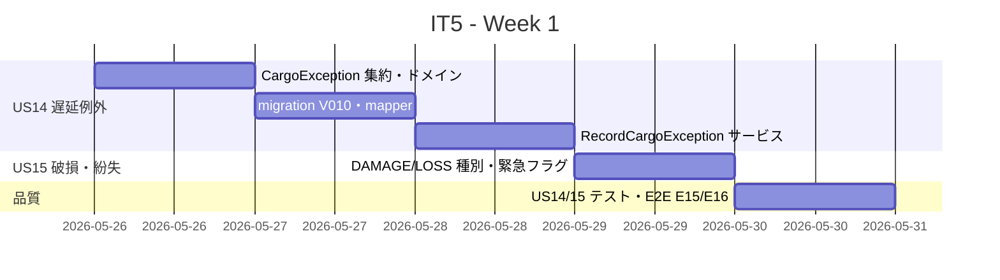
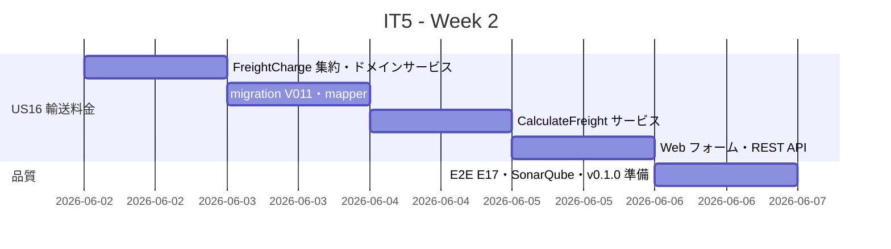
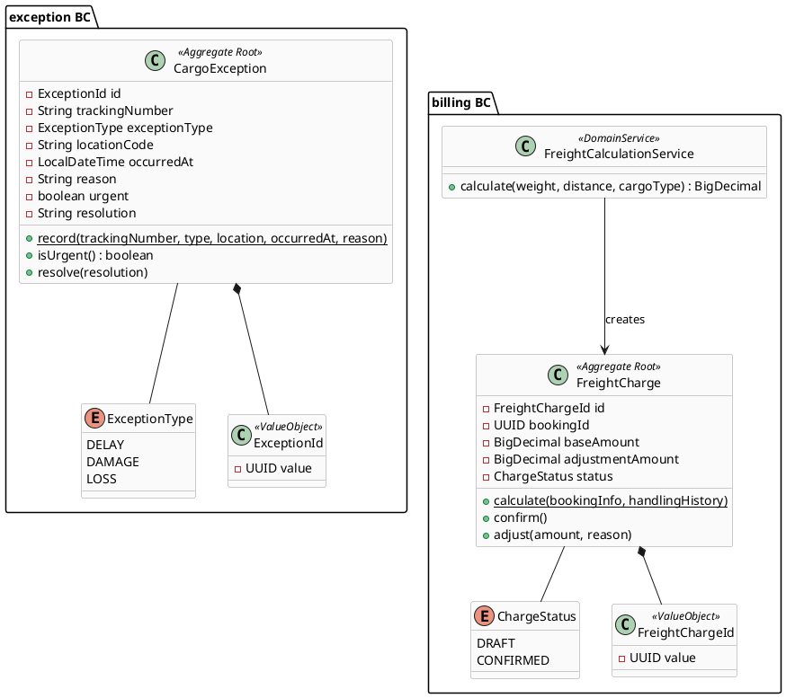
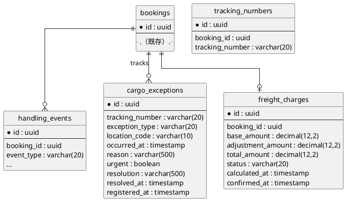
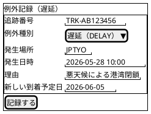
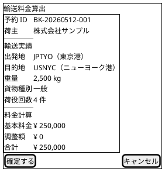

# イテレーション 5 計画

## 概要

| 項目 | 内容 |
|------|------|
| **イテレーション** | 5 |
| **期間** | Week 9-10（2026-05-26〜2026-06-08） |
| **ゴール** | 例外処理（遅延・破損・紛失）で Phase 1 を完結させ、輸送料金算出（Phase 2 開始）を実装する |
| **目標 SP** | 11 |

---

## ゴール

### イテレーション終了時の達成状態

1. **遅延例外処理**: 追跡管理者が輸送中の遅延を例外種別「遅延」として記録し、貨物状態を「例外発生」に更新できる
2. **破損・紛失例外処理**: 追跡管理者が破損または紛失を記録し、例外種別に応じた対応（通知・escalation）が行われる
3. **輸送料金算出**: 経理担当者が「引取済」予約に対して輸送実績をもとに基本料金を算出・確定できる
4. **Phase 1 完結**: US01〜US15 が揃い、v0.1.0 リリースの準備が整う

### 成功基準

- [x] 追跡番号と例外種別「遅延」・発生状況を記録でき、貨物状態が「例外発生」に更新される
- [ ] 例外種別「破損」または「紛失」を記録でき、「紛失」は緊急フラグが設定される
- [ ] 「引取済」予約に対して輸送料金算出を開始し、基本料金が自動計算される
- [ ] 算出結果を確認して確定操作でき、確定後に「確定」状態で登録される
- [ ] backend テスト Green・カバレッジ 80% 以上・SonarQube Quality Gate PASS

---

## ユーザーストーリー

### 対象ストーリー

| ID | ユーザーストーリー | SP | 優先度 |
|----|-------------------|----|--------|
| US14 | 遅延例外を処理する | 3 | 中 |
| US15 | 破損・紛失例外を処理する | 3 | 中 |
| US16 | 輸送料金を算出する | 5 | 中 |
| **合計** | | **11** | |

### ストーリー詳細

#### US14: 遅延例外を処理する

**ストーリー**:
> 追跡管理者として、輸送中に遅延が発生した場合、例外種別「遅延」として記録し、荷主への通知と対応内容を管理したい。なぜなら、遅延情報を速やかに荷主に伝え、対応策（代替ルート等）を迅速に提示できるからだ。

**受入条件**:

1. 追跡番号と例外種別「遅延」・発生状況（場所・日時・理由）を記録できる
2. 記録後、貨物状態が「例外発生」に更新される
3. 荷主に遅延発生の通知が送信される（Phase 1 では通知ログとして記録）
4. 対応内容（新しい到着予定日・対応方針）を入力して荷主に対応報告を送信できる
5. 例外対応履歴が記録される

#### US15: 破損・紛失例外を処理する

**ストーリー**:
> 追跡管理者（または荷役作業員）として、輸送中に破損または紛失が発生した場合、例外種別「破損」または「紛失」として記録し、関係者に緊急通知を送りたい。なぜなら、重大な例外は即座に全関係者に共有し、保険手続き・補償対応・代替措置を迅速に開始できるからだ。

**受入条件**:

1. 追跡番号と例外種別「破損」または「紛失」・発生状況を記録できる
2. 記録後、貨物状態が「例外発生」に更新される
3. 例外種別「紛失」の場合、緊急フラグが設定されて管理職への escalation 通知が送信される（Phase 1 ではログ記録）
4. 荷主に破損・紛失発生の通知が送信される（Phase 1 ではログ記録）

#### US16: 輸送料金を算出する

**ストーリー**:
> 経理担当者として、配送完了した予約に対して輸送実績（経路・重量・貨物種別・荷役実績）をもとに輸送料金を算出したい。なぜなら、実際の輸送内容に基づく正確な料金を算出し、精算に進めるからだ。

**受入条件**:

1. 「引取済」状態の予約に対して料金算出を開始できる
2. 輸送実績（経路・重量・貨物種別・荷役作業実績）が表示される
3. 基本料金が自動計算される（重量 × 単価 × 距離係数）
4. 算出結果を確認して確定操作ができる
5. 確定後、輸送料金が「確定」状態で登録される
6. 例外（遅延・破損等）が発生している場合、料金調整（減額・補償費用）の入力ができる

---

## タスク

### 1. US14: 遅延例外を処理する（3 SP）

| # | タスク | 見積もり | 担当 | 状態 |
|---|--------|---------|------|------|
| 1.1 | `CargoException` 集約・`ExceptionType` enum（DELAY/DAMAGE/LOSS）・`ExceptionId` 値オブジェクトを実装し、ドメインテストを追加する | 3h | Copilot | [ ] |
| 1.2 | Flyway migration `V010__create_cargo_exceptions.sql` と `CargoExceptionMapper`（MyBatis）を実装する | 2h | Copilot | [ ] |
| 1.3 | `RecordCargoExceptionCommandService` を実装し、追跡番号存在確認・貨物状態「例外発生」更新ロジックとテストを追加する | 4h | Copilot | [ ] |
| 1.4 | 例外記録 Web フォーム（`/exceptions/delay`）・REST API（`POST /api/v1/cargo-exceptions`）と MVC/REST テストを追加する | 3h | Copilot | [ ] |

**小計**: 12h（理想時間）

### 2. US15: 破損・紛失例外を処理する（3 SP）

| # | タスク | 見積もり | 担当 | 状態 |
|---|--------|---------|------|------|
| 2.1 | DAMAGE/LOSS 種別処理・緊急フラグ設定ロジック（`CargoException.isUrgent()`）とユニットテストを実装する | 3h | Copilot | [ ] |
| 2.2 | 破損・紛失例外登録 Web フォーム UI（`/exceptions/damage`, `/exceptions/loss`）と登録フローを実装する | 4h | Copilot | [ ] |
| 2.3 | 例外処理の統合テスト・E2E テスト（E15: 遅延記録で状態が例外発生になる、E16: 紛失記録で緊急フラグが立つ）を追加する | 5h | Copilot | [ ] |

**小計**: 12h（理想時間）

### 3. US16: 輸送料金を算出する（5 SP）

| # | タスク | 見積もり | 担当 | 状態 |
|---|--------|---------|------|------|
| 3.1 | `FreightCharge` 集約・`FreightCalculationService` ドメインサービス（基本料金 = 重量 × 単価 × 距離係数）・`ChargeStatus` enum を実装しドメインテストを追加する | 4h | Copilot | [ ] |
| 3.2 | Flyway migration `V011__create_freight_charges.sql` と `FreightChargeMapper`（MyBatis）を実装する | 2h | Copilot | [ ] |
| 3.3 | `CalculateFreightCommandService` を実装し、引取済み予約の輸送実績取得（`BookingInfoQueryPort`・`HandlingHistoryQueryPort`）と確定ロジックとテストを追加する | 4h | Copilot | [ ] |
| 3.4 | 料金算出 Web フォーム（`/freight/calculate`）・料金一覧（`/freight`）・REST API（`POST /api/v1/freight-charges`）と MVC/REST テストを追加する | 5h | Copilot | [ ] |
| 3.5 | E2E テスト（E17: 引取済み予約の料金算出と確定）・SonarQube・docs 更新を実施する | 5h | Copilot | [ ] |

**小計**: 20h（理想時間）

### タスク合計

| カテゴリ | SP | 理想時間 | 状態 |
|---------|----|---------|------|
| US14 遅延例外処理 | 3 | 12h | [x] 完了 |
| US15 破損・紛失例外処理 | 3 | 12h | [ ] 未着手 |
| US16 輸送料金算出 | 5 | 20h | [ ] 未着手 |
| **合計** | **11** | **44h** | |

**1 SP あたり**: 4h
**進捗率**: 27%（3/11 SP 完了）

---

## スケジュール

### Week 1（Day 1-5: 2026-05-26〜2026-05-30）

| 日 | タスク |
|----|--------|
| Day 1 | `CargoException` 集約・`ExceptionType`（DELAY/DAMAGE/LOSS）・`ExceptionId` 実装、ユニットテスト |
| Day 2 | Flyway migration V010・`CargoExceptionMapper`・`RecordCargoExceptionCommandService` |
| Day 3 | Web フォーム（`/exceptions/delay`）・REST API（`POST /api/v1/cargo-exceptions`）・MVC テスト |
| Day 4 | DAMAGE/LOSS 種別・緊急フラグロジック・破損紛失フォーム実装 |
| Day 5 | US14/15 統合テスト・E2E E15（遅延記録）・E16（紛失緊急フラグ） |

### Week 2（Day 6-10: 2026-06-02〜2026-06-06）

| 日 | タスク |
|----|--------|
| Day 6 | `FreightCharge` 集約・`FreightCalculationService`（重量 × 単価 × 距離係数）・ドメインテスト |
| Day 7 | Flyway migration V011・`FreightChargeMapper`・`CalculateFreightCommandService` |
| Day 8 | `BookingInfoQueryPort`・`HandlingHistoryQueryPort` 経由の輸送実績取得・確定ロジック |
| Day 9 | 料金算出 Web フォーム（`/freight/calculate`）・料金一覧（`/freight`）・REST API |
| Day 10 | E2E E17・SonarQube 確認・docs 更新・v0.1.0 リリース準備 |

---

## 設計

### ドメインモデル

### データモデル

### ユーザーインターフェース

#### 例外記録フォーム（遅延）

#### 輸送料金算出画面

### アーキテクチャ（新規 BC）

```plantuml
@startuml IT5_architecture
package "exception BC" {
  package "domain" {
    class CargoException
    enum ExceptionType
    interface CargoExceptionRepository
  }
  package "application" {
    class RecordCargoExceptionCommandService
    interface TrackingNumberExistencePort
  }
  package "infrastructure" {
    class CargoExceptionMapper
    class TrackingNumberExistencePortAdapter
  }
  package "interfaces" {
    class ExceptionRestController
    class ExceptionWebController
  }
}

package "billing BC" {
  package "domain" {
    class FreightCharge
    class FreightCalculationService
    interface FreightChargeRepository
  }
  package "application" {
    class CalculateFreightCommandService
    interface BookingInfoQueryPort
    interface HandlingHistoryQueryPort
  }
  package "infrastructure" {
    class FreightChargeMapper
    class BookingInfoQueryAdapter
    class HandlingHistoryQueryAdapter
  }
  package "interfaces" {
    class FreightRestController
    class FreightWebController
  }
}

RecordCargoExceptionCommandService --> TrackingNumberExistencePort
CalculateFreightCommandService --> BookingInfoQueryPort
CalculateFreightCommandService --> HandlingHistoryQueryPort
@enduml
```

---

## 計画調整メモ

- **Phase 1 完結**: US14・US15 で Phase 1（US01〜US15, 51SP）が完結する。IT5 終了後に v0.1.0 リリースタグを付与する。
- **通知の簡略化**: US14・US15 の通知要件（荷主通知・escalation）は Phase 1 では通知ログへの記録として実装し、実際のメール送信は Phase 2 以降に延期する。
- **料金計算式**: US16 の基本料金計算は `重量（kg）× 距離係数 × 単価（¥0.1/kg/km）` の簡易式とする。距離係数は出発地・目的地の UNLOCODE から算出した概算距離を使用する。
- **例外種別と BC 分割**: US14・US15 を独立した `exception` BC として実装する。handling BC の拡張ではなく、追跡番号を外部キーとして参照することで BC 境界を維持する。
- **ベロシティリスク対応**: 平均ベロシティ 11.25SP に対して 11SP のため達成可能。Day 5 時点で US14・US15 完了を確認し、遅延時は US16 の確定操作を次 IT に延期する。
- **E2E シナリオ**:
  - E15: 追跡番号で遅延例外を記録し、貨物状態が「例外発生」になる
  - E16: 紛失例外を記録し、緊急フラグが設定される
  - E17: 引取済み予約の輸送料金を算出して確定する

---

## 更新履歴

| 日付 | 更新内容 | 更新者 |
|------|---------|--------|
| 2026-04-02 | IT5 計画を作成 | Copilot |
