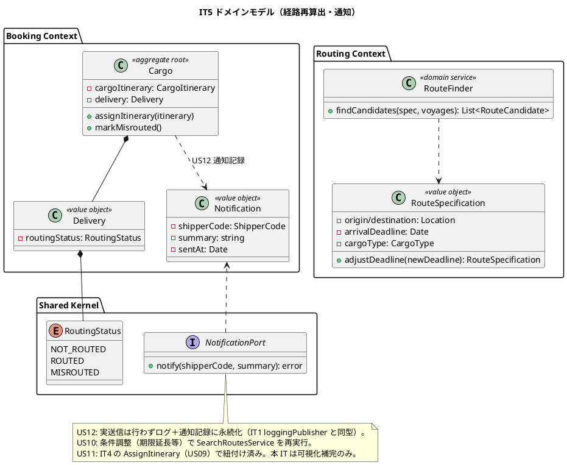
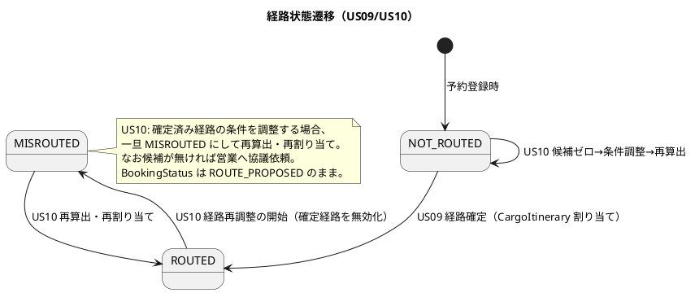
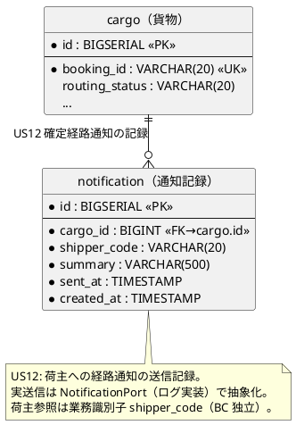
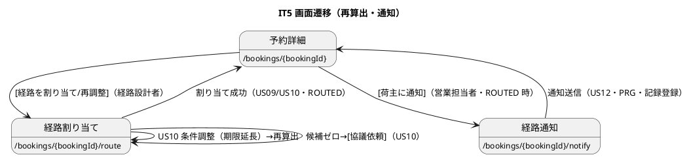

# イテレーション 5 計画

## 概要

本イテレーション（IT5）は、中盤局面（**インサイドアウト**）として **経路条件調整（US10・3SP）**・**経路情報紐付け（US11・2SP）**・**確定経路通知（US12・2SP）** を実装し、IT4 で作り込んだ経路探索・経路確定フローを**運用完成**させる。経路候補が期限内に見つからない場合の**再算出・条件緩和・協議依頼**の導線を整え、確定経路を荷主に**通知**する仕組み（NotificationPort・通知記録）を追加する。

- **局面**: 中盤（IT3-6）／アプローチ: **インサイドアウト**（経路再算出の仕様・通知記録の集約を domain / data 層から固めて上位層へ）
- **対象 BC**: Routing Context（再算出）・Booking Context（紐付け・MISROUTED・通知記録）・Shared（NotificationPort）
- **前提**: IT4 で RouteFinder（経路探索）・SearchRoutesService・CargoItinerary/Leg/Delivery/RoutingStatus・AssignRouteService・`/bookings/{id}/route` 画面・合成ルート注入（ADR-0007）が実装済み。IT5 はこの上に「調整・再算出・通知」を積む。

---

## ゴール

### イテレーション終了時の達成状態

- 経路設計者が、期限内に候補がない場合に**条件（期限等）を調整して経路を再算出**でき、なお候補がなければ**営業担当者へ条件協議を依頼**できる（US10）。
- 確定経路が予約に紐付き、営業担当者が荷主にルート提案できる状態（**ROUTE_PROPOSED**・確定経路可視）になる（US11）。
- 営業担当者が、紐付けられた確定経路の詳細（経由港・所要日数・到着予定日・料金概算）を**荷主に通知**し、**通知記録が登録**される（US12）。

### 成功基準

- [ ] US10/US11/US12 の受け入れ基準を満たす（条件確認・調整再算出・協議依頼・紐付け可視化・通知送信・通知記録）。
- [ ] 経路再算出の条件調整仕様（RouteSpecification 拡張）を domain のユニットテストで隔離検証。
- [ ] 通知記録（Notification）を集約/値オブジェクトとして実装し、NotificationPort（出力ポート）で送信を抽象化。
- [ ] Routing・Booking のドメイン層カバレッジ 90% 以上、SonarQube Quality Gate PASS。
- [ ] `make check`（build + test + lint + govulncheck + arch）green・CI success。

### IT4 ふりかえり Try の反映（返済枠）

- [ ] **T3（IT4 由来）US10 の実装**: 該当なし通知からの再算出・条件緩和導線を本 IT の中心として実装。route.html の行き止まりを解消。
- [ ] **T4（IT4 由来）確定前確認・確定後リルート導線**: 経路確定前の確認と、確定後も MISROUTED 経由で再割り当てできる導線を US10 と同時に整える。
- [ ] **T1（IT4 由来）マイグレーション時の data-model 同時更新**: 通知記録テーブル追加時に data-model の物理テーブル表・DDL・論理モデルを同一コミットで更新することを DoD 化。
- [ ] **T2（IT4 由来）受入基準 UX の E2E アサート化**: 通知内容（経由港・所要日数・到着予定日・料金概算）が画面に表示されることを E2E で検証。機能導線だけでなく情報充足も検証。
- [ ] **T7（IT4 由来）CI 手動トリガー**: feature ブランチの CI は workflow_dispatch 手動起動が必要。クローズ手順に沿って確認。
- [ ] **T5（IT4 由来・任意）sqlcgen per-BC schema 分離**: 余力があれば全スキーマ重複の返済に着手（優先度は US10-12 が上）。

---

## ユーザーストーリー

### 対象ストーリー

| ID | ユーザーストーリー | SP | 対応 UC | BC | 優先度 |
|----|-------------------|----|---------|----|--------|
| US10 | 経路条件を調整して再算出する | 3 | UC08 | routing / booking | 高 |
| US11 | 経路情報を予約に紐付ける | 2 | UC09 | booking | 高 |
| US12 | 確定経路を荷主に通知する | 2 | UC10 | booking / shared | 高 |
| **合計** | | **7** | | | |

> ベロシティ注記: IT1 15・IT2 8・IT3 17・IT4 11 SP（4 IT 平均 ≒ 12.75）。IT5 は 7 SP と軽め。US11 は IT4 の US09（AssignItinerary で CargoItinerary 紐付け・ROUTE_PROPOSED 維持）と大きく重複するため、実装量は「明示的な経路提案アクションと可視化の補完」に絞られる見込み（下記「設計判断」で確定）。余力は T5（sqlcgen 分離）または IT6 前倒しに充てる。

### ストーリー詳細（受け入れ基準の要点）

#### US10: 経路条件を調整して再算出する（経路設計者）

- 現在の制約条件（期限・出発地・目的地・貨物種別）を確認できる。
- 条件を調整（**期限延長**を第一候補。経由地追加・貨物種別変更は段階実装）して再算出を実行できる。
- 調整後の条件で新たな経路候補が算出・提示される。
- 調整後も候補がない場合、**営業担当者に条件協議を依頼**できる（依頼記録／フラグ）。
- **注**: 再算出は既存 `SearchRoutesService` を調整済み `RouteSearchQuery` で再実行する。cargo の routeSpec を永続更新するか一時オーバーライドかは設計判断（下記）。

#### US11: 経路情報を予約に紐付ける（経路設計者）

- 確定経路と予約番号を確認できる。
- 経路情報を予約に紐付ける操作を実行できる。
- 紐付け後、予約状態が「経路提案中（ROUTE_PROPOSED）」に更新される。
- **注（重複整理・要 validating-design）**: IT4 の US09（`Cargo.AssignItinerary`）で既に CargoItinerary を紐付け、Delivery.routingStatus=ROUTED・BookingStatus=ROUTE_PROPOSED 維持を実装済み。US11 の受入「ROUTE_PROPOSED に更新」は既に満たされている。本 IT の US11 は **重複実装を避け**、「営業担当者が荷主提案できるよう確定経路を可視化・照会する」補完（予約一覧/詳細での経路提案状態表示・確定経路サマリ）に絞る。二重定義を排し設計本体（RouteCargoCommand）と整合させる。

#### US12: 確定経路を荷主に通知する（営業担当者）

- 予約番号を指定して紐付けられた経路情報を確認できる。
- 通知内容（経由港・所要日数・到着予定日・料金概算）を確認できる。
- 荷主への経路通知を送信できる（NotificationPort・IT5 ではログ/記録ベースの疑似送信）。
- 通知送信記録が登録される（通知日時・宛先荷主・内容サマリ）。
- **注**: 実メール送信は行わず、`NotificationPort`（出力ポート）で抽象化し、ログ出力＋通知記録テーブルへの永続化とする（IT1 の loggingPublisher と同型）。

---

## タスク（インサイドアウト順）

### 1. Routing 経路再算出（US10 / 3SP）

- [ ] domain: `RouteSpecification` の条件調整を表現（期限延長等の調整仕様）。再算出の境界（調整後に候補あり／なお候補なし）を RouteFinder のユニットテストで検証（既存 domain の再利用＋調整ケース追加）。
- [ ] application: `SearchRoutesService` を調整済み条件で再実行する経路（`RouteSearchQuery` に調整パラメータ）。協議依頼を表す application 操作（`RequestNegotiationService` または Booking 側フラグ更新）。
- [ ] interfaces: `/bookings/{bookingId}/route` に**条件調整フォーム**（期限延長・再算出ボタン）を追加。候補ゼロ時に「営業担当者へ協議依頼」アクションを表示。

### 2. Booking 経路紐付けの可視化補完（US11 / 2SP）

- [ ] domain/application: US09 で実装済みの紐付けを前提に、**経路提案状態の照会**（予約一覧に経路状態列・確定経路サマリ）を CQRS クエリ側で補完。二重の紐付けコマンドは追加しない（設計判断）。
- [ ] interfaces: 予約一覧（/bookings）に経路状態（RoutingStatus）列と「経路提案中」表示。予約詳細の確定経路サマリ（IT4 実装済み）と整合。

### 3. Booking 確定経路通知（US12 / 2SP）

- [ ] domain: `Notification`（通知記録：宛先 ShipperCode・内容サマリ・送信日時）値オブジェクト/エンティティ。通知内容の生成（確定経路→経由港・所要日数・到着予定日・料金概算）。
- [ ] infrastructure: `notification` テーブル（マイグレーション）・sqlc・`NotificationRepository`。`NotificationPort` のログ実装。**data-model を同一コミットで更新（T1）**。
- [ ] application: `NotifyRouteService`（予約の確定経路から通知内容を組み立て、NotificationPort で送信・記録）。
- [ ] interfaces: `/bookings/{bookingId}/notify`（通知内容プレビュー・送信）。営業担当者ロール。送信後 PRG・通知記録の表示。

### 4. デモ E2E（受け入れ基準）

- [ ] US10: 期限超過で候補ゼロ → 期限延長で再算出 → 候補提示 → 確定の Playwright シナリオ。なお候補なし → 協議依頼の異常系。
- [ ] US12: 確定経路の予約 → 通知内容プレビュー（経由港・所要日数・到着予定日・料金概算）→ 送信 → 通知記録表示。

---

## 設計判断（要 validating-design 確認）

1. **US11 の重複整理（最重要）**: IT4 の `Cargo.AssignItinerary`（US09）が既に CargoItinerary 紐付け・ROUTE_PROPOSED 維持を実装済み。US11 は新たな紐付けコマンドを追加せず、**確定経路の可視化・照会補完**に絞る。domain-model の RouteCargoCommand（US09）と US11 の受入を突き合わせ、二重定義を排する。→ validating-design で確定。
2. **US10 の条件調整の永続化方針**: 再算出は cargo の routeSpec を永続更新せず、**一時オーバーライド**（フォーム入力の調整条件で `SearchRoutesService` を再実行）を第一候補とする。確定時のみ選択候補を AssignItinerary で反映。期限自体を予約に反映する必要があれば別途 US（予約変更）として切り出す。→ validating-design で確定。
3. **MISROUTED の扱い**: 確定済み（ROUTED）の経路を再調整する場合、Delivery.routingStatus を MISROUTED にしてから再算出・再割り当て（ROUTED）する導線（IT4 Try T4）。状態遷移図（ADR-0003）と整合。
4. **NotificationPort と通知記録**: 実送信は行わず、`shared` または `booking/application` の `NotificationPort`（出力ポート）で抽象化し、ログ実装＋`notification` テーブルへ記録。BC 独立性を保つ（通知は Booking の関心事）。

---

## 設計（IT5 スコープに絞って掲載）

### ドメインモデル

### 状態遷移図（RoutingStatus・US10 再算出）

### データモデル（ER 図・IT5 追加分）

### 画面遷移図

### API 設計

| メソッド | エンドポイント | 説明 | ロール |
|---------|---------------|------|--------|
| GET/POST | `/bookings/{bookingId}/route` | 経路候補算出・条件調整再算出・選択確定（US08/US09/US10） | ROLE_ROUTE_DESIGNER |
| POST | `/bookings/{bookingId}/route/negotiate` | 候補ゼロ時の協議依頼（US10） | ROLE_ROUTE_DESIGNER |
| GET | `/bookings/{bookingId}/notify` | 確定経路の通知内容プレビュー（US12） | ROLE_SALES |
| POST | `/bookings/{bookingId}/notify` | 荷主への経路通知送信・記録（US12） | ROLE_SALES |

### ADR

| ADR | タイトル | 本 IT での扱い |
|-----|---------|---------------|
| [ADR-0003](../adr/0003-transport-status-canon.md) | TransportStatus/RoutingStatus 正典 | MISROUTED 遷移（US10 再調整）を導入 |
| [ADR-0007](../adr/0007-route-search-cross-bc-acl.md) | 経路探索 BC 横断 ACL | US10 再算出も既存 RouteSearcher 経由で実施 |
| ADR-0008（新規予定・要否は validating-design で判断） | 通知の抽象化（NotificationPort・記録） | 実送信を抽象化しログ＋記録に留める方針を記録 |

---

## 検証結果（validating-iteration-plan / validating-design）

> ステップ 3（validating-iteration-plan）・ステップ 4（validating-design）の並列検証結果をここに追記する（本節は検証後に更新）。

---

## リスクと対策

| リスク | 影響 | 対策 |
|--------|------|------|
| US11 が IT4 US09 と重複し二重実装 | 中 | validating-design で重複を確定整理し、US11 を可視化補完に絞る（設計判断1） |
| US10/US12 の画面・通知テーブルが設計本体に未定義 | 中 | ui_design・data-model の設計ギャップを「注」で明記し、実装と同時に設計本体へ反映（T1） |
| MISROUTED 遷移の不変条件漏れ | 中 | ADR-0003 の状態遷移に沿って Cargo.markMisrouted の可否判定を不変条件化しテスト先行 |
| 通知の実送信を作り込みすぎる | 低 | NotificationPort でログ＋記録に留め、実メールは後続（外部連携 IT）へ |

---

## 完了条件

### Definition of Done

- [ ] US10/US11/US12 の受け入れ基準を満たす（再算出・協議依頼・紐付け可視化・通知送信・記録）。
- [ ] 経路再算出・MISROUTED 遷移・通知記録を domain のユニットテストで隔離検証。
- [ ] Notification/notification テーブルを実装し data-model と整合（**マイグレーションと同一コミットで data-model 更新・T1**）。
- [ ] US11 の重複を整理し設計本体（RouteCargoCommand）と一貫（二重定義なし）。
- [ ] Routing・Booking ドメイン層カバレッジ 90% 以上。
- [ ] `make check` green・SonarQube Quality Gate PASS・CI success。
- [ ] マルチパースペクティブレビュー実施・高優先度対応。
- [ ] 設計是正（US10/US12 画面・通知テーブル・US11 整理）を design 本体へ**同時反映**（T1）。
- [ ] 通知内容の情報充足（経由港・所要日数・到着予定日・料金概算）を E2E でアサート（T2）。

### デモ項目（E2E 受け入れ基準）

- [ ] 期限超過で候補ゼロ → 期限延長で再算出 → 候補提示 → 確定（US10）。
- [ ] なお候補なし → 営業へ協議依頼（US10 異常系）。
- [ ] 確定経路の予約 → 通知内容プレビュー → 送信 → 通知記録表示（US12）。

---

## 更新履歴

| 日付 | 内容 |
|------|------|
| 2026-07-25 | 初版作成（IT5 開始準備・opening-iteration ステップ 2） |

---

## 関連ドキュメント

- [リリース計画](release_plan.md)
- [開発戦略](development_strategy.md)
- [IT4 ふりかえり](retrospective-4.md)
- [IT4 完了報告書](iteration_report-4.md)
- [IT4 マルチパースペクティブレビュー](../review/it4_go_review_20260725.md)
- [ドメインモデル設計](../design/domain-model.md)
- [データモデル設計](../design/data-model.md)
- [UI 設計](../design/ui_design.md)
- [ユーザーストーリー](../requirements/user_story.md)
- [ADR-0003](../adr/0003-transport-status-canon.md) / [ADR-0007](../adr/0007-route-search-cross-bc-acl.md)
